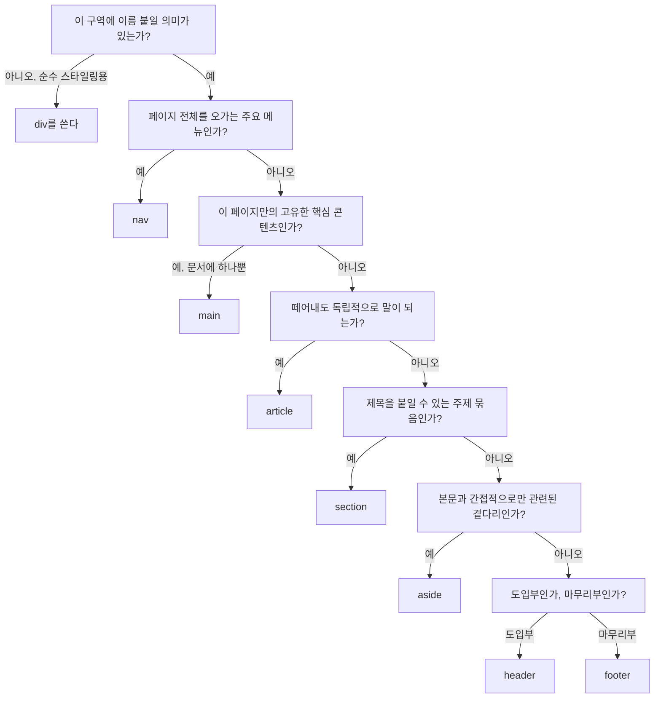

<Callout type="info">
  **이번 문서의 목표:** 이 문서를 다 읽으면 `header`·`nav`·`main`·`article`·`section`·`aside`·`footer` 중 어떤 요소가 정확히 어떤 콘텐츠 카테고리인지 구분하고, `div`와 시맨틱 요소 중 무엇을 쓸지 실제 페이지 앞에서 스스로 판단할 수 있게 됩니다.
</Callout>

## 왜 시맨틱 sectioning이 필요한가

2000년대 웹 페이지의 소스 코드를 열어 보면 `<div id="header">`, `<div class="nav">`, `<div id="main">`, `<div class="footer">`가 줄줄이 나옵니다. `div`는 아무 의미도 담지 않는 **일반 컨테이너**(generic container)이기 때문에, 브라우저나 스크린 리더 입장에서는 그 페이지가 "이름 없는 상자 안에 이름 없는 상자가 또 들어있는" 구조로만 보입니다. 개발자는 `id="nav"`라는 이름을 보고 의미를 알지만, 기계는 문자열 `"nav"`에 아무 규칙도 부여하지 않습니다. 이렇게 의미 없는 `div`를 남발하는 관행을 업계에서는 흔히 **"divitis"**(디비티스, div 남용증)라고 부릅니다.

HTML5가 도입한 **시맨틱 sectioning 요소**(semantic sectioning element)는 이 문제를 정면으로 풉니다. **시맨틱**(semantic)은 "의미론적인"이라는 뜻으로, 요소 이름 자체가 그 안에 들어갈 콘텐츠의 역할을 브라우저에게 알려준다는 뜻입니다. `<nav>`라고 쓰면 브라우저와 스크린 리더는 별도의 설명 없이도 "여기가 내비게이션(navigation, 이동 메뉴) 영역이구나"를 알아챕니다.

> **쉽게 말하면:** `div`는 이름표 없는 종이 상자이고, `nav`·`main`·`article` 같은 시맨틱 요소는 상자 겉면에 "내비게이션", "본문", "독립 기사"라고 인쇄된 상자입니다. 상자 안 물건(콘텐츠)이 같아도, 겉면에 적힌 이름이 있어야 기계가 상자를 열어보지 않고도 무슨 상자인지 압니다.

## sectioning 콘텐츠와의 관계 — 이름이 주는 착각

05편에서 콘텐츠 카테고리 7종(메타데이터, flow, sectioning, heading, phrasing, embedded, interactive)을 다뤘습니다(자세한 내용은 [05편](/web/html/html_fundamentals/05_content-models-and-categories) 참조). 이번 편에서 다루는 7개 요소를 전부 "**섹셔닝 요소**"라고 뭉뚱그려 부르기 쉽지만, WHATWG 스펙이 정의하는 **섹셔닝 콘텐츠**(sectioning content) 카테고리에 실제로 속하는 것은 그중 4개뿐입니다.

| 요소 | 콘텐츠 카테고리 | 암묵적 랜드마크 역할 |
|------|-----------------|----------------------|
| `article` | 섹셔닝 콘텐츠 | article |
| `section` | 섹셔닝 콘텐츠 | region (접근 가능한 이름이 있을 때만) |
| `aside` | 섹셔닝 콘텐츠 | complementary |
| `nav` | 섹셔닝 콘텐츠 | navigation |
| `header` | flow 콘텐츠 (섹셔닝 아님) | banner (최상위일 때만) |
| `footer` | flow 콘텐츠 (섹셔닝 아님) | contentinfo (최상위일 때만) |
| `main` | flow 콘텐츠 (섹셔닝 아님) | main |

**섹셔닝 콘텐츠**란 "그 자신의 아웃라인(개요) 범위를 만드는 콘텐츠"라는 뜻으로 정의되어 있습니다. `header`·`footer`·`main`은 이 정의를 충족하지 않아 스펙상 그냥 flow 콘텐츠로 분류됩니다. 실무에서 이 구분이 크게 중요하지는 않지만, "이 7개가 다 같은 카테고리"라고 외우면 05편에서 배운 콘텐츠 모델 규칙과 충돌하는 순간이 옵니다 — 자주 틀리는 점으로 뒤에서 다시 짚습니다.

## 요소별 선택 기준

### header — 도입부

`header`는 "이 구역이 시작되는 지점의 소개용 콘텐츠"를 담습니다. 로고, 사이트 제목, 검색창, 그 구역의 도입 문단이 여기 들어갑니다. 문서 전체의 최상위에 한 번만 쓰는 것이 아니라, `article`이나 `section` 안에서 그 구역만의 소개부로도 반복해서 쓸 수 있습니다.

```html
<body>
  <header>
    <h1>제노의 블로그</h1>
    <nav>
      <a href="/">홈</a>
      <a href="/about">소개</a>
    </nav>
  </header>
</body>
```

### nav — 주요 내비게이션

`nav`는 페이지나 사이트 전체를 오가는 **주요** 내비게이션 링크 묶음에만 씁니다. "주요"라는 조건이 핵심입니다. 본문 안에 흩어진 링크 두세 개, 푸터의 저작권 링크 하나까지 전부 `nav`로 감싸면 스크린 리더 사용자가 페이지 안의 내비게이션 랜드마크 목록을 열었을 때 진짜 중요한 메뉴를 찾기 어려워집니다. 한 페이지에 `nav`가 여러 개 있어도 되지만(예: 헤더의 주 메뉴, 푸터의 사이트맵), 각각에 `aria-label`로 구분 이름을 붙이는 것이 좋습니다. 이 부분은 20편에서 랜드마크 이름 붙이기로 이어집니다.

### main — 문서의 핵심 콘텐츠

`main`은 그 문서의 **고유하고 핵심적인** 콘텐츠를 감쌉니다. 반복되는 헤더·내비게이션·사이드바·푸터는 제외한, "이 페이지만의 진짜 내용"입니다. 스펙이 강제하는 규칙이 세 가지 있습니다.

1. 화면에 보이는(`hidden` 속성이 없는) `main`은 **문서 하나에 딱 하나**여야 합니다.
2. `main`은 `article`·`aside`·`footer`·`header`·`nav`의 **자손으로 오면 안 됩니다.**
3. 이 규칙들은 브라우저가 강제로 막지는 않지만(파싱 오류로 죽지 않음), Nu HTML Checker 같은 검증기는 위반을 경고로 잡아냅니다. 21편에서 이 검증 실습을 합니다.

### article — 독립적으로 떼어내도 말이 되는 덩어리

`article`을 쓸지 판단하는 가장 실용적인 질문은 이것입니다. **"이 콘텐츠만 뚝 떼어서 RSS 피드나 다른 사이트에 옮겨놔도 그 자체로 뜻이 통하는가?"** 블로그 글 하나, 뉴스 기사 하나, 포럼 댓글 하나, 상품 카드 하나가 전형적인 예입니다. `article`은 섹셔닝 콘텐츠이므로 그 안에 자기만의 `h1`~`h6`, 자기만의 `header`/`footer`(작성자, 게시일)를 가질 수 있고, `article` 안에 `article`을 중첩해 "게시글 안의 댓글들"처럼 표현할 수도 있습니다.

### section — 주제로 묶이는 구역

`section`은 "관련된 콘텐츠를 주제(theme)로 묶은 구역"입니다. 실무에서 가장 헷갈리는 요소이기도 합니다. 판단 기준은 두 가지입니다.

1. 이 구역에 **그 구역을 대표하는 제목**(`h1`~`h6`)을 붙일 수 있는가?
2. 순전히 CSS 스타일링을 위해 상자를 나누는 것뿐이라면, 그것은 `section`이 아니라 그냥 `div`입니다.

> **쉽게 말하면:** `section`은 책의 "장(chapter)"과 같습니다. 각 장에는 제목이 있고 내용이 있습니다. 반대로 `div`는 종이를 접는 선일 뿐, 그 자체로 "무엇에 관한 부분"이라는 의미는 없습니다.

### aside — 곁다리 콘텐츠

`aside`는 본문과 **간접적으로만** 관련된 콘텐츠에 씁니다. 사이드바, 광고, 관련 글 목록, 본문 중간에 끼워 넣는 인용구(pull quote), 용어 설명 박스가 해당합니다. "간접적으로만"이 핵심이라, 본문 흐름에서 없으면 안 되는 내용을 `aside`에 넣으면 잘못된 사용입니다.

### footer — 마무리 정보

`footer`는 그 구역을 마무리하는 메타 정보(저작권, 연락처, 관련 문서 링크, 작성자)를 담습니다. `header`와 마찬가지로 문서 최상위뿐 아니라 `article`·`section` 안에서도 반복해서 쓸 수 있습니다.

## div와 시맨틱 요소, 무엇을 쓸까

아래 순서대로 물어보면 대부분의 경우 답이 나옵니다.



## 함께 조립해 보기

아래 실습기에서 `<main>`을 `article`이나 `nav`의 자손으로 옮겨 보세요. 브라우저는 화면을 그대로 그려주지만(파싱 오류로 죽지 않는 이유는 22편), 접근성 트리에서는 `main` 랜드마크의 의미가 흐트러집니다.

<CodePlayground
  template="static"
  activeFile="/index.html"
  label="시맨틱 sectioning 요소로 페이지 뼈대 조립하기"
  files={{
    '/index.html': `<!doctype html>
<html lang="ko">
<head>
  <meta charset="utf-8" />
  <title>제노의 블로그</title>
  <link rel="stylesheet" href="styles.css" />
</head>
<body>
  <header>
    <h1>제노의 블로그</h1>
    <nav aria-label="주 메뉴">
      <a href="/">홈</a>
      <a href="/archive">아카이브</a>
    </nav>
  </header>

  <main>
    <article>
      <header>
        <h2>시맨틱 요소를 쓰는 이유</h2>
        <p>작성일: 2026-09-01</p>
      </header>
      <p>div만으로 만든 페이지는 기계에게는 이름 없는 상자 더미입니다.</p>
      <footer>
        <p>작성자: 제노</p>
      </footer>
    </article>

    <aside aria-label="관련 글">
      <h2>같이 보면 좋은 글</h2>
      <ul>
        <li><a href="#">콘텐츠 모델 이해하기</a></li>
      </ul>
    </aside>
  </main>

  <footer>
    <p>&copy; 2026 제노의 블로그</p>
  </footer>
</body>
</html>`,
    '/styles.css': `body { font-family: system-ui, sans-serif; margin: 0 auto; max-width: 640px; padding: 16px; }
header, footer { background: #f2f2f2; padding: 12px; }
main { display: grid; grid-template-columns: 2fr 1fr; gap: 16px; margin: 16px 0; }
article, aside { border: 1px solid #ddd; padding: 12px; }`,
  }}
/>

이 예시에서 `article` 안에 다시 `header`/`footer`가 들어간 것을 확인하세요. 문서 최상위의 `header`/`footer`와 `article` 안의 `header`/`footer`는 **같은 요소지만 범위가 다릅니다.** 스펙이 "가장 가까운 조상 sectioning 요소(또는 body)까지가 이 header/footer의 영역"이라고 정의하기 때문입니다.

## 접근성 관점 — 랜드마크가 자동으로 생긴다

시맨틱 요소를 쓰면 별도의 ARIA 속성 없이도 **랜드마크 역할**(landmark role)이 자동으로 부여됩니다. 스크린 리더 사용자는 이 랜드마크 목록만 훑어봐도 페이지 구조를 파악하고 원하는 구역으로 바로 건너뛸 수 있습니다. 다만 `header`·`footer`·`section`은 그 요소가 `body`의 직계 자손일 때만(다른 sectioning 요소 안에 중첩되지 않았을 때만) 각각 banner·contentinfo·region 역할을 갖습니다. `article` 안의 `header`는 그냥 flow 콘텐츠일 뿐 별도 랜드마크가 아닙니다. 랜드마크와 스크린 리더 탐색의 나머지 이야기는 20편에서 이어집니다.

<Callout type="warning">
  **자주 틀리는 점:** "시맨틱 요소를 썼으니 이 페이지는 접근성이 확보됐다"는 결론으로 바로 넘어가면 안 됩니다. `nav`가 여러 개인데 이름을 안 붙이면 스크린 리더 사용자는 "내비게이션, 내비게이션, 내비게이션"만 듣고 어느 게 무엇인지 구분하지 못합니다. 랜드마크는 출발점일 뿐, 이름표(`aria-label`)와 제목 구조까지 갖춰야 실제로 쓸모가 있습니다.
</Callout>

## 핵심 정리

- `article`·`section`·`aside`·`nav`만 스펙상 섹셔닝 콘텐츠이고, `header`·`footer`·`main`은 flow 콘텐츠로 분류된다.
- `main`은 문서에 화면에 보이는 것이 딱 하나여야 하고, `article`·`aside`·`footer`·`header`·`nav`의 자손이면 안 된다.
- `section`을 쓸지 판단하는 기준은 "제목을 붙일 수 있는 주제 묶음인가"이고, 순수 스타일링용 상자는 `div`다.
- `article`은 "떼어내도 독립적으로 말이 되는가"로 판단한다.
- `header`/`footer`는 문서 최상위뿐 아니라 `article`/`section` 안에서 반복해서 쓸 수 있고, 범위는 가장 가까운 조상 sectioning 요소까지다.
- 시맨틱 요소는 랜드마크 역할을 자동으로 부여하지만, 이름 붙이기·제목 구조까지 갖춰야 실제 접근성이 완성된다.

## 마무리 복습

<Quiz
  questionNumber={1}
  question="다음 중 WHATWG가 정의하는 섹셔닝 콘텐츠(sectioning content) 카테고리에 속하지 않는 것은?"
  options={['section', 'article', 'main', 'aside']}
  correctAnswer={3}
  explanation="main은 flow 콘텐츠로 분류되며 섹셔닝 콘텐츠가 아니다. section, article, aside는 모두 섹셔닝 콘텐츠에 속한다."
  optionExplanations={['섹셔닝 콘텐츠에 속한다', '섹셔닝 콘텐츠에 속한다', '정답 — main은 flow 콘텐츠로 분류된다', '섹셔닝 콘텐츠에 속한다']}
/>

<Quiz
  questionNumber={2}
  question="main 요소에 대한 설명으로 옳지 않은 것은?"
  options={['화면에 보이는 main은 문서에 하나만 있어야 한다', 'article 요소의 자손으로 와도 된다', '그 페이지만의 고유한 핵심 콘텐츠를 감싼다', '반복되는 헤더나 사이드바는 포함하지 않는다']}
  correctAnswer={2}
  explanation="main은 article, aside, footer, header, nav의 자손이 되면 안 된다는 제약이 있다."
  optionExplanations={['실제 규칙이다', '정답 — main은 article의 자손이 되면 안 된다', '실제 정의다', '실제 정의다']}
/>

<Quiz
  questionNumber={3}
  question="section과 div 중 무엇을 쓸지 판단하는 기준으로 가장 알맞은 것은?"
  options={['CSS로 배경색을 다르게 주고 싶을 때는 section을 쓴다', '제목을 붙일 수 있는 주제 묶음이면 section, 순수 스타일링용이면 div를 쓴다', 'section은 항상 페이지 최상위에만 쓴다', 'div는 HTML5 이후 사용이 금지되었다']}
  correctAnswer={2}
  explanation="section은 주제로 묶이고 제목을 붙일 수 있는 구역에 쓴다. 순수 스타일링 목적의 상자 분할은 div가 맞는 선택이다."
  optionExplanations={['스타일링 목적만으로는 section을 쓸 근거가 되지 않는다', '정답 — 의미 유무가 기준이다', 'section은 article이나 다른 sectioning 요소 안에도 중첩될 수 있다', 'div는 여전히 유효하고 필요한 요소다']}
/>

<Quiz
  questionNumber={4}
  question="nav 요소 사용에 대한 설명으로 옳은 것은?"
  options={['본문 중간의 링크 두세 개도 항상 nav로 감싸야 한다', '한 페이지에 nav는 하나만 쓸 수 있다', '주요 내비게이션 블록에만 쓰고, 여러 개일 때는 aria-label로 구분하는 것이 좋다', 'nav 안에는 반드시 ul 목록만 와야 한다']}
  correctAnswer={3}
  explanation="nav는 페이지나 사이트를 오가는 주요 내비게이션에만 쓰며, 여러 개일 경우 aria-label로 구분해 스크린 리더 사용자가 헷갈리지 않게 한다."
  optionExplanations={['사소한 링크 묶음까지 nav로 감싸면 랜드마크 목록이 어수선해진다', '헤더의 주 메뉴와 푸터의 사이트맵처럼 여러 개를 쓸 수 있다', '정답 — 주요 내비게이션에만 쓰고 이름으로 구분한다', 'nav는 링크를 담는 컨테이너일 뿐 목록 형식을 강제하지 않는다']}
/>

<Quiz
  questionNumber={5}
  question="article을 쓸지 판단하는 가장 실용적인 질문은?"
  options={['이 요소에 CSS 클래스가 몇 개 붙어 있는가', '이 콘텐츠만 떼어내 다른 곳에 옮겨도 그 자체로 뜻이 통하는가', '이 요소가 페이지에서 가장 큰 영역을 차지하는가', '이 요소 안에 이미지가 포함되어 있는가']}
  correctAnswer={2}
  explanation="article은 블로그 글, 뉴스 기사, 댓글처럼 독립적으로 배포해도 의미가 통하는 콘텐츠에 쓴다."
  optionExplanations={['시각적 크기나 클래스 개수는 시맨틱 선택 기준이 아니다', '정답 — 독립적 배포 가능 여부가 핵심 기준이다', '영역 크기는 기준이 아니다', '이미지 포함 여부는 무관하다']}
/>

<Quiz
  questionNumber={6}
  question="header, footer 요소의 콘텐츠 모델 규칙으로 옳은 것은?"
  options={['header는 footer를 자손으로 포함할 수 없다', 'header는 문서 최상위에만 한 번 쓸 수 있다', 'footer 안에는 nav를 넣을 수 없다', 'header는 article 안에서는 쓸 수 없다']}
  correctAnswer={1}
  explanation="header와 footer는 각각 header나 footer를 자손으로 포함할 수 없다는 콘텐츠 모델 제약이 있다."
  optionExplanations={['정답 — header/footer 안에 header나 footer 요소가 다시 들어갈 수 없다', 'header는 article이나 section 안에서도 반복해서 쓸 수 있다', 'footer 안에 링크 목록을 위한 nav를 넣는 것은 허용된다', 'article 안에서 그 글만의 도입부로 header를 쓰는 것은 흔한 패턴이다']}
/>

<Quiz
  questionNumber={7}
  question="시맨틱 sectioning 요소와 접근성의 관계에 대한 설명으로 옳지 않은 것은?"
  options={['nav, main, aside는 별도 ARIA 속성 없이도 랜드마크 역할을 갖는다', '시맨틱 요소만 쓰면 그 페이지의 접근성이 전부 해결된다', 'header, footer, section은 body의 직계 자손일 때만 각각 banner, contentinfo, region 역할을 갖는다', '랜드마크는 스크린 리더 사용자가 구조를 훑어보는 출발점이다']}
  correctAnswer={2}
  explanation="시맨틱 요소는 랜드마크의 출발점일 뿐이며, 이름 붙이기와 제목 구조까지 갖춰야 실제 접근성이 완성된다."
  optionExplanations={['실제로 자동 부여되는 규칙이다', '정답(틀린 설명) — 시맨틱 요소만으로 접근성이 완성되지 않는다', '실제 규칙이다', '맞는 설명이다']}
/>

## 참고 자료

- [MDN - h1–h6: The HTML Section Heading elements](https://developer.mozilla.org/en-US/docs/Web/HTML/Reference/Elements/Heading_Elements)
- [WHATWG - 4.3 Sections](https://html.spec.whatwg.org/multipage/sections.html)
- [MDN - Content categories](https://developer.mozilla.org/en-US/docs/Web/HTML/Guides/Content_categories)
