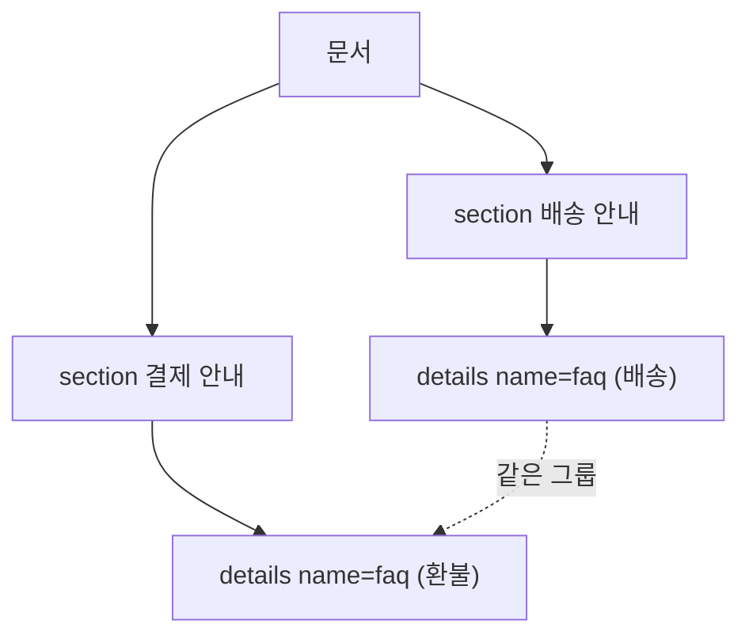

<Callout type="info">
  **이번 문서의 목표:** 이 문서를 다 읽으면 `<details>`에 `name` 속성 하나만 추가해서, 자바스크립트 없이 "하나를 열면 나머지가 자동으로 닫히는" 아코디언(accordion, 접었다 펼치는 목록 UI)을 만들 수 있게 됩니다.
</Callout>

## 복습 — `<details>`/`<summary>`의 기본 동작

`<details>`와 `<summary>`는 클릭하면 펼쳐지고 접히는 콘텐츠 상자를 만드는 요소입니다. 문법과 기본 토글 동작 자체는 HTML Fundamentals 과목(`/web/html/html_fundamentals`)에서 다뤘으므로 여기서는 딱 필요한 만큼만 짚고 넘어갑니다.

```html
<details>
  <summary>배송은 얼마나 걸리나요?</summary>
  <p>영업일 기준 2~3일이 소요됩니다.</p>
</details>
```

`<summary>`는 항상 보이는 제목이고, 그 뒤의 콘텐츠는 `<details>`에 `open` 속성이 붙어야만 보입니다. 클릭하면 브라우저가 자동으로 `open` 속성을 토글합니다. 여기까지는 자바스크립트가 전혀 필요 없습니다.

## 1. 왜 exclusive accordion이 필요한가

### 문제 상황

FAQ(자주 묻는 질문) 목록에서 흔히 원하는 동작은 "한 번에 하나의 질문만 펼쳐져 있게" 하는 것입니다. `<details>`를 여러 개 늘어놓으면 각각 독립적으로 열리고 닫히기 때문에, 사용자가 다섯 개를 다 열어버리면 화면이 길어지고 원하는 답을 찾기 어려워집니다.

이 "하나가 열리면 나머지는 닫힌다"는 동작을 **배타적**(exclusive, 서로 다른 것을 배제하는) 동작이라 부릅니다. 라디오 버튼(radio button)이 그룹 안에서 하나만 선택되는 것과 똑같은 원리입니다. 예전에는 이걸 구현하려면 모든 `<details>`에 클릭 리스너를 달고, 하나가 열릴 때 나머지의 `open` 속성을 JS로 지워야 했습니다.

> **쉽게 말하면:** exclusive accordion은 "문 다섯 개짜리 방인데, 한 번에 하나의 문만 열려 있는" 구조입니다.

### 지원 상태(2026-09 기준)

`<details name>`은 **최신 브라우저 기준**으로 표기합니다. Baseline 2024에 포함되었고, 2025년 중 주요 브라우저 전반에 확산되었습니다. 오래된 브라우저를 아직 지원해야 하는 프로젝트라면 아래에서 다룰 폴백 동작을 반드시 함께 고려해야 합니다.

## 2. `name` 속성 — 그룹 짓는 방법

### 정의

`<details>`에 같은 `name` 값을 주면, 브라우저가 그 요소들을 하나의 그룹으로 인식합니다. 그룹 안에서 하나를 열면 나머지는 브라우저가 알아서 닫습니다.

```html
<details name="faq">
  <summary>배송은 얼마나 걸리나요?</summary>
  <p>영업일 기준 2~3일이 소요됩니다.</p>
</details>

<details name="faq">
  <summary>환불은 어떻게 하나요?</summary>
  <p>마이페이지에서 신청하면 3일 이내 처리됩니다.</p>
</details>

<details name="faq">
  <summary>해외 배송도 되나요?</summary>
  <p>일부 국가에 한해 가능합니다.</p>
</details>
```

`name` 값 하나만 맞추면 끝입니다. 자바스크립트도, 별도의 부모 컨테이너 요소도 필요 없습니다.

### 브라우저가 실제로 하는 일

브라우저는 문서 전체에서 같은 `name` 값을 가진 `<details>`들을 하나의 "라디오 그룹"처럼 내부적으로 관리합니다. 사용자가 하나를 클릭해 열면, 브라우저는 같은 `name`을 가진 다른 `<details>`들의 `open` 속성을 프로그래밍적으로 제거합니다. 이때 각 `<details>`는 닫힐 때 `toggle` 이벤트를 발생시키므로, 필요하다면 "닫혔을 때 애니메이션을 재생한다" 같은 부가 동작을 이 이벤트에 걸 수 있습니다.

### DOM 순서와 무관하게 그룹화된다

이 그룹화의 중요한 특징은 **DOM 트리에서 서로 인접해 있을 필요가 없다**는 점입니다. 다른 `<section>`이나 `<div>`에 흩어져 있어도, `name` 값만 같으면 하나의 그룹으로 동작합니다.



이 성질 덕분에, 시각적 레이아웃(어느 섹션에 배치할지)과 상호작용 그룹(어느 것끼리 배타적으로 동작할지)을 완전히 분리해서 설계할 수 있습니다. 예를 들어 "설정" 페이지에서 카테고리별로 다른 섹션에 나눠 배치된 옵션 패널들을, 카테고리와 무관하게 하나의 배타적 그룹으로 묶는 것도 가능합니다.

## 3. 구형 브라우저 폴백 — 우아한 저하

### 무슨 일이 일어나는가

`name` 속성을 지원하지 않는 구형 브라우저는 이 속성을 그냥 무시합니다. `<details>` 요소 자체는 아주 오래전부터 지원되어 왔으므로, 각 `<details>`는 **독립적인 개별 토글**로 동작합니다. 즉 exclusive 동작만 사라지고, 펼치고 접는 기본 기능 자체는 그대로 살아 있습니다.

이런 동작 방식을 **점진적 향상**(progressive enhancement, 기본 기능은 누구에게나 보장하고 지원 브라우저에만 추가 기능을 얹는 설계 원칙)의 한 예로 볼 수 있고, 기능이 지원되지 않을 때 화면이 깨지지 않고 한 단계 낮은 수준으로 자연스럽게 동작하는 것을 **우아한 저하**(graceful degradation, 기능이 없어도 서비스가 망가지지 않고 품위 있게 물러나는 것)라고 부릅니다. `<details name>`은 이 두 원칙이 별도의 코드 없이 속성 하나로 저절로 성립하는 드문 사례입니다.

<Callout type="warning">
  **자주 틀리는 점:** "구형 브라우저에서는 아코디언이 아예 안 열린다"고 오해하기 쉽지만 사실이 아닙니다. exclusive 동작(배타적으로 닫히는 것)만 사라질 뿐, 열고 닫는 기본 기능은 모든 브라우저에서 동일하게 작동합니다. 성능 저하나 오류 없이 조용히 한 단계 낮은 경험으로 물러납니다.
</Callout>

## 4. 접근성 — 키보드와 스크린 리더 관점

`<details>`/`<summary>`는 원래부터 접근성을 잘 갖춘 요소입니다. `<summary>`는 자동으로 키보드 포커스를 받고, 스크린 리더는 이를 "펼치기/접기 가능한 항목, 닫힘" 또는 "열림" 상태로 안내합니다. `name`을 추가해도 이 기본 접근성은 그대로 유지되며, 오히려 라디오 버튼 그룹처럼 "이 항목을 열면 다른 항목이 닫힌다"는 예측 가능한 상호작용 패턴을 제공해 사용자가 그룹의 동작 방식을 짐작하기 쉬워집니다. 다만 그룹 전체가 "이것들은 서로 관련된 질문 묶음"이라는 것을 시각·의미상으로 알리려면, 그룹을 감싸는 `<section>`에 적절한 제목(`<h2>` 등)을 붙이는 것이 좋습니다.

## 5. 실습 — name 값을 바꿔가며 그룹 동작 확인하기

아래 실습기에서 세 번째 `<details>`의 `name` 값을 다른 두 개와 다르게 바꾸면 무엇이 달라지는지 확인해 보세요.

<CodePlayground
  template="static"
  activeFile="/index.html"
  label="details name 그룹 동작 실험"
  files={{
    '/index.html': `<h2>자주 묻는 질문</h2>

<details name="faq" open>
  <summary>배송은 얼마나 걸리나요?</summary>
  <p>영업일 기준 2~3일이 소요됩니다.</p>
</details>

<details name="faq">
  <summary>환불은 어떻게 하나요?</summary>
  <p>마이페이지에서 신청하면 3일 이내 처리됩니다.</p>
</details>

<!-- 이 name 값을 "faq"로 바꾸면 위 두 개와 같은 그룹이 됩니다.
     "other"로 두면 독립적으로 동작하는 것을 비교해 보세요. -->
<details name="other">
  <summary>해외 배송도 되나요?</summary>
  <p>일부 국가에 한해 가능합니다.</p>
</details>`,
    '/styles.css': `body { font-family: system-ui, sans-serif; padding: 2rem; max-width: 480px; }
details {
  border: 1px solid #d1d5db;
  border-radius: 8px;
  padding: 0.75rem 1rem;
  margin-bottom: 0.5rem;
}
summary {
  cursor: pointer;
  font-weight: 600;
}
details[open] summary {
  color: #2563eb;
}`,
  }}
/>

세 번째 항목의 `name`을 `"faq"`로 바꾸는 순간, 세 개 중 하나만 열려 있게 되는 것을 확인할 수 있습니다. 반대로 지금처럼 `"other"`로 두면 독립적으로 열고 닫힙니다.

## 핵심 정리

- `<details>`/`<summary>`의 기본 토글 동작은 HTML Fundamentals에서 이미 다뤘다. 이 편은 그 위에 얹는 `name` 속성만 다룬다.
- 같은 `name` 값을 가진 `<details>`들은 하나의 배타적 그룹으로 동작해, 하나를 열면 나머지가 자동으로 닫힌다.
- 그룹화는 DOM 트리상 위치와 무관하다. 서로 다른 섹션에 흩어져 있어도 `name`만 같으면 한 그룹이다.
- 2026-09 기준 최신 브라우저 대부분에서 동작하며(최신 브라우저 기준), 지원하지 않는 구형 브라우저에서는 `name`이 무시되어 개별 토글로 우아하게 저하될 뿐 기본 기능은 깨지지 않는다.
- `<summary>`의 키보드 포커스·스크린 리더 안내는 `name` 유무와 관계없이 그대로 유지된다.

## 마무리 복습

<Quiz
  questionNumber={1}
  question="같은 name 값을 가진 details 요소들에 대한 설명으로 옳은 것은?"
  options={['서로 부모-자식 관계로 중첩되어야만 그룹으로 인식된다', 'DOM 트리에서 서로 인접하거나 같은 부모 아래 있지 않아도 그룹으로 동작한다', 'name이 같아도 open 속성을 각자 관리해야 배타적으로 동작한다', 'name 속성은 시각적 스타일만 통일시킬 뿐 열림 동작에는 영향이 없다']}
  correctAnswer={2}
  explanation="name으로 묶인 details 그룹은 DOM 트리상 위치와 무관하게 동작한다. 서로 다른 섹션에 흩어져 있어도 name 값만 같으면 브라우저가 하나의 배타적 그룹으로 관리한다."
  optionExplanations={['중첩 관계는 요구되지 않는다', '정답 — DOM 위치와 무관하게 name만으로 그룹화된다', '브라우저가 open 속성 제거를 자동으로 처리해 준다', 'name은 열림 동작(배타성)을 결정하는 속성이다']}
/>

<Quiz
  questionNumber={2}
  question="name 속성을 지원하지 않는 구형 브라우저에서 name이 붙은 details 요소는 어떻게 동작하는가?"
  options={['details 요소 자체가 렌더링되지 않는다', 'name 속성이 무시되고 각 details가 독립적인 개별 토글로 동작한다', '브라우저가 오류를 콘솔에 출력하고 페이지 로딩을 중단한다', 'summary 클릭이 아무 반응도 하지 않는다']}
  correctAnswer={2}
  explanation="name을 지원하지 않는 브라우저는 이 속성을 그냥 무시한다. details 요소 자체는 오래전부터 지원되어 왔으므로 배타적 동작만 사라지고 개별 토글 기능은 정상 작동한다."
  optionExplanations={['details 요소는 정상적으로 렌더링된다', '정답 — 배타성만 사라지고 개별 토글은 그대로 동작한다', '지원하지 않는 속성을 조용히 무시할 뿐 오류가 발생하지 않는다', '클릭하면 정상적으로 열리고 닫힌다']}
/>

<Quiz
  questionNumber={3}
  question="details name 속성이 지원하지 않는 브라우저에서도 서비스가 깨지지 않고 한 단계 낮은 수준으로 동작하는 원칙을 가리키는 용어는?"
  options={['핫 모듈 교체', '우아한 저하(graceful degradation)', '트리 셰이킹', '지연 로딩']}
  correctAnswer={2}
  explanation="기능이 지원되지 않을 때 오류 없이 한 단계 낮은 경험으로 자연스럽게 물러나는 것을 우아한 저하라고 부른다."
  optionExplanations={['개발 중 코드를 즉시 반영하는 도구 개념으로 무관하다', '정답 — 우아한 저하가 정확한 용어다', '번들 크기를 줄이는 빌드 기법으로 무관하다', '리소스를 늦게 불러오는 기법으로 무관하다']}
/>

<Quiz
  questionNumber={4}
  question="2026-09 시점에서 details name의 지원 상태를 문서에 표기할 때 알맞은 표현은?"
  options={['모든 브라우저에서 예외 없이 완벽히 지원된다고 단정한다', '최신 브라우저 기준으로 사용 가능하다고 표기하고 폴백을 함께 안내한다', '아직 어떤 브라우저도 지원하지 않는 실험 단계라고 표기한다', '지원 여부를 표기할 필요가 없다']}
  correctAnswer={2}
  explanation="details name은 Baseline 2024에 포함되어 2025년 중 주요 브라우저 전반에 확산되었지만, 아직 모든 환경에서 예외 없이 지원된다고 단정할 수는 없으므로 최신 브라우저 기준으로 표기하고 폴백 동작을 함께 안내해야 한다."
  optionExplanations={['모든 환경을 단정하는 것은 이 과목의 사실 확인 원칙에 어긋난다', '정답 — 최신 브라우저 기준 표기와 폴백 안내가 필요하다', '이미 여러 주요 브라우저에 확산된 기능이라 실험 단계라 보기는 어렵다', '지원 상태 표기는 이 과목 전체의 필수 규칙이다']}
/>

<Quiz
  questionNumber={5}
  question="name으로 그룹화된 details 중 하나를 열었을 때, 나머지 details에서 실제로 일어나는 일은?"
  options={['나머지 details 요소 자체가 DOM에서 제거된다', '나머지 details의 open 속성이 브라우저에 의해 제거되며 닫힌다', '나머지 details의 summary 텍스트가 사라진다', '아무 일도 일어나지 않고 사용자가 직접 닫아야 한다']}
  correctAnswer={2}
  explanation="브라우저는 같은 name을 가진 다른 details의 open 속성을 프로그래밍적으로 제거해 자동으로 닫는다. 이때 toggle 이벤트도 함께 발생한다."
  optionExplanations={['요소 자체는 DOM에 그대로 남아 있고 열림 상태만 바뀐다', '정답 — open 속성이 제거되어 자동으로 닫힌다', 'summary는 항상 보이는 제목이라 사라지지 않는다', '브라우저가 자동으로 나머지를 닫아 준다']}
/>

<Quiz
  questionNumber={6}
  question="name으로 그룹화된 details 중 하나가 브라우저에 의해 자동으로 닫힐 때 함께 발생하는 것은?"
  options={['click 이벤트만 발생하고 toggle 이벤트는 발생하지 않는다', 'toggle 이벤트가 발생해 닫힘 시점에 추가 동작을 걸 수 있다', 'resize 이벤트가 발생해 레이아웃이 다시 계산된다', '이벤트가 전혀 발생하지 않아 감지할 방법이 없다']}
  correctAnswer={2}
  explanation="같은 name 그룹에서 하나가 열려 다른 details가 브라우저에 의해 닫힐 때도 toggle 이벤트가 발생한다. 이 이벤트에 닫힘 애니메이션 같은 부가 동작을 걸 수 있다."
  optionExplanations={['toggle 이벤트가 발생하므로 이 설명은 틀렸다', '정답 — 닫힐 때도 toggle 이벤트가 발생해 감지할 수 있다', 'resize는 창 크기 변경 시 발생하는 이벤트로 이 상황과 무관하다', '이벤트가 발생하지 않는다는 설명은 본문 내용과 반대다']}
/>

<Quiz
  questionNumber={7}
  question="details에 name 속성을 추가했을 때 summary의 키보드 포커스와 스크린 리더 접근성은 어떻게 되는가?"
  options={['name을 추가하면 summary가 더 이상 키보드 포커스를 받지 못한다', 'name 유무와 관계없이 기존 접근성이 그대로 유지된다', '스크린 리더 안내 문구가 name 값으로 완전히 대체된다', 'name을 추가하면 접근성 속성을 모두 수동으로 다시 설정해야 한다']}
  correctAnswer={2}
  explanation="details/summary는 원래부터 접근성을 갖춘 요소이며, name을 추가해도 summary의 키보드 포커스와 스크린 리더의 펼침/닫힘 안내는 그대로 유지된다."
  optionExplanations={['name은 그룹화 기능만 추가할 뿐 포커스 동작을 없애지 않는다', '정답 — 기본 접근성은 name 유무와 무관하게 그대로 유지된다', '스크린 리더는 열림/닫힘 상태를 안내할 뿐 name 값으로 문구가 대체되지 않는다', 'name 추가만으로 기존에 갖춰진 접근성이 사라지지 않으므로 재설정이 필요 없다']}
/>

## 참고 자료

- [MDN Blog — HTML details exclusive accordions](https://developer.mozilla.org/en-US/blog/html-details-exclusive-accordions)
- [Chrome for Developers — Exclusive Accordion](https://developer.chrome.com/docs/css-ui/exclusive-accordion)
