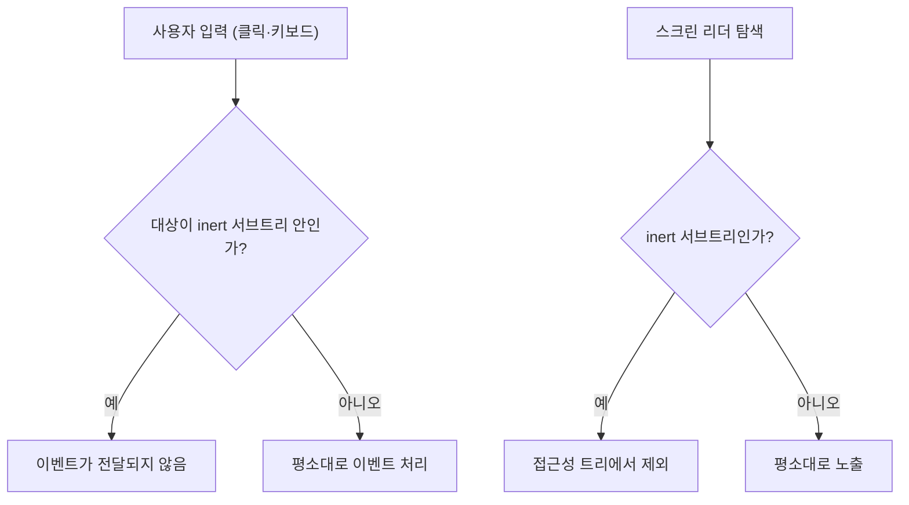

<Callout type="info">
  **이번 문서의 목표:** 이 문서를 다 읽으면 `inert` 속성이 정확히 무엇을 차단하고 무엇을 차단하지 않는지 구분하고, `<dialog>`와 popover가 왜 굳이 이 속성을 내부적으로 함께 쓰는지 설명할 수 있게 됩니다.
</Callout>

## 왜 필요한가

03·04편의 `<dialog>`, 05·06편의 popover를 배우며 이미 "배경이 비활성화된다"는 표현을 여러 번 봤습니다. 그런데 그 비활성화가 정확히 어떤 메커니즘으로 일어나는지는 아직 짚지 않았습니다. 이번 편이 그 답입니다. `<dialog>`의 `showModal()`이 배경을 막을 때 내부적으로 쓰는 바로 그 장치가 `inert`(이너트, "비활성의, 반응이 없는"이라는 뜻의 영단어)라는 전역 속성입니다.

`inert` 자체는 `<dialog>`나 popover 전용이 아닙니다. 어떤 요소에든 독립적으로 붙일 수 있는 범용 속성입니다. 예를 들어 "삭제 확인 중에는 페이지의 나머지 부분을 통째로 막고 싶다"거나 "사이드바가 접혀 있을 때 그 안의 링크들이 Tab 키로 포커스를 받지 않게 하고 싶다" 같은 상황에 직접 쓸 수 있습니다.

> **쉽게 말하면:** `inert`는 특정 영역에 투명한 유리벽을 세우는 속성입니다. 눈에는 보이지만(원한다면 흐리게 처리할 수도 있지만) 클릭도, 키보드 포커스도, 화면 안의 글자 찾기도 그 벽을 통과하지 못합니다.

**지원 상태(2026-09 기준): 널리 사용 가능합니다.** `inert` 전역 속성은 2023년 4월부터 널리 사용 가능한 상태입니다.

## 1. `inert`가 실제로 막는 것

### 정의

`inert`가 붙은 요소와 그 자손 전체는 다음 세 가지가 차단됩니다.

1. **포커스**: Tab 키로도, `.focus()`를 스크립트로 호출해도 그 안의 어떤 요소에도 포커스가 가지 않습니다.
2. **클릭·포인터 이벤트**: 마우스로 클릭하거나 터치해도 반응하지 않습니다.
3. **텍스트 검색과 접근성 트리 노출**: 브라우저의 페이지 내 찾기(Ctrl+F) 기능과 스크린 리더의 가상 커서 탐색에서 제외됩니다.

```html
<div id="배경">
  <button>이 버튼은 눌러도 반응이 없습니다</button>
  <a href="/home">이 링크도 포커스를 받지 못합니다</a>
</div>

<script>
  document.getElementById("배경").inert = true;
</script>
```

속성으로 직접 써도 되고(`<div inert>`), 스크립트에서 `.inert = true`로 켜고 끌 수도 있습니다.

### 브라우저가 실제로 하는 일

`inert`가 적용되면 브라우저는 해당 서브트리(subtree, 하위 트리 — 어떤 요소와 그 자손 전체)를 렌더링 파이프라인에서는 그대로 그리지만, **이벤트 디스패치 대상과 접근성 트리 양쪽에서 제외**합니다. 즉 화면에는 여전히 보이되(원하면 CSS로 흐리게 만들 수 있음), 사용자와 상호작용하는 모든 경로에서 존재하지 않는 것처럼 취급됩니다.



## 2. `inert`가 막지 않는 것

`inert`는 강력하지만 만능은 아닙니다. 다음은 흔히 착각하는, 하지만 `inert`가 하지 않는 일입니다.

| 흔한 오해 | 실제 동작 |
|------|------|
| 화면에서 안 보이게 될 것이다 | 시각적으로는 여전히 그대로 보인다. 흐리게 하려면 CSS `filter`나 `opacity`를 별도로 줘야 한다 |
| 페이지 스크롤이 자동으로 막힐 것이다 | `inert`는 스크롤 자체를 막지 않는다. 배경 스크롤 방지는 별도 처리(3절)가 필요하다 |
| CSS 선택자로 스타일링에 활용할 수 없을 것이다 | `:inert` CSS 의사 클래스로 `inert` 상태인 요소를 선택해 스타일을 줄 수 있다 |
| 자바스크립트 이벤트 리스너 자체가 삭제될 것이다 | 리스너는 그대로 남아 있다. 다만 이벤트가 그 요소까지 도달하지 못할 뿐이다 |

<Callout type="warning">
  **자주 틀리는 점:** `inert`를 `display: none`이나 `visibility: hidden`과 같은 것으로 오해하면 안 됩니다. 저 둘은 요소를 화면에서 아예 지우거나(공간까지 차지하지 않거나, 공간은 차지하되 안 보이게) 하는 CSS 속성이고, `inert`는 시각적으로는 그대로 두고 오직 **상호작용 경로만** 차단하는 HTML 속성입니다. 셋의 차이는 CSS 과목의 `visibility` vs `display` vs `hidden` 비교(`/web/css/css_fundamentals` 참조)와 함께 놓고 봐야 헷갈리지 않습니다.
</Callout>

## 3. `<dialog>`·popover가 내부적으로 쓰는 자동 inert

### `<dialog>`의 `showModal()`

`<dialog>`를 `showModal()`로 열면, 브라우저는 그 dialog를 제외한 **문서의 나머지 전체**를 자동으로 `inert` 상태로 만듭니다. 이것이 04편에서 "포커스가 dialog 안에 트랩된다"고 설명했던 동작의 실체입니다. 개발자가 `inert` 속성을 직접 붙일 필요 없이, `showModal()` 호출 한 번으로 브라우저가 알아서 처리합니다. `close()`를 호출하면 이 자동 inert도 함께 풀립니다.

### popover의 경우

06편에서 popover의 `::backdrop`은 `<dialog>`만큼 강하게 배경을 막지 않는다고 설명했습니다. 이는 popover가 기본적으로는 배경에 자동 `inert`를 걸지 않기 때문입니다. 다만 `popovertargetaction`이나 스크립트를 통해 popover를 열 때, 개발자가 의도적으로 배경 컨테이너에 `inert`를 직접 걸어 "이 popover만큼은 모달처럼 동작하게" 만들 수 있습니다. 즉 `<dialog>`는 모달성이 기본 내장되어 있고, popover는 필요할 때 `inert`를 직접 조합해 모달성을 흉내 낼 수 있는 재료를 제공하는 셈입니다.

이 대비가 바로 세 기능이 "포커스와 가시성 통제"라는 같은 문제를 서로 다른 층위에서 푼다는 것의 실체입니다.

| 요소 | 모달성 | inert 적용 방식 |
|------|------|------|
| `<dialog>` showModal() | 기본 내장 | 브라우저가 배경 전체에 자동 적용 |
| popover | 기본 없음 | 필요 시 개발자가 배경 컨테이너에 직접 적용 |
| `inert` 단독 사용 | 요소 단위로 직접 제어 | 개발자가 대상과 시점을 전부 결정 |

## 4. 배경 스크롤·포커스 유출 방지 패턴

### 포커스 유출이란

**포커스 유출**(focus leak, 포커스가 의도한 범위를 벗어나 새는 것)은 오버레이가 열려 있는데도 Tab 키를 계속 누르면 포커스가 배경의 링크나 버튼으로 넘어가 버리는 문제입니다. 사용자는 화면에 뜬 모달 안에 있다고 생각하는데 실제 포커스는 안 보이는 배경 어딘가에 가 있는, 스크린 리더 사용자에게 특히 혼란스러운 상황입니다. `<dialog>`의 자동 `inert`는 이 문제를 근본적으로 없앱니다. 배경 전체가 포커스를 받을 수 없는 상태가 되므로, Tab을 아무리 눌러도 포커스는 dialog 내부를 순환할 수밖에 없습니다.

`inert`를 직접 쓸 때도 이 원리를 그대로 적용할 수 있습니다. 커스텀 오버레이를 만든다면, 오버레이를 열 때 `<body>`의 나머지 최상위 요소(오버레이 자신을 제외한)에 `inert`를 걸어주면 포커스 유출이 원천 차단됩니다.

### 배경 스크롤 방지는 별개의 문제

`inert`는 스크롤을 막지 않으므로, 모달이 열려 있는 동안 배경이 스크롤되는 것을 막으려면 CSS로 별도 처리해야 합니다. 흔히 쓰는 방법은 모달이 열려 있는 동안 `<body>`에 `overflow: hidden`을 거는 것입니다. `<dialog>`의 `showModal()`은 이 스크롤 방지를 자동으로 해주지 않으므로, 모달이 열려 있는 스타일 상태(`body:has(dialog[open])` 같은 선택자, 또는 스크립트로 클래스를 토글하는 방식)에 맞춰 직접 처리해야 한다는 점을 기억해야 합니다.

## 5. 실습 — inert 켜고 끄며 포커스 이동 확인하기

아래 실습기에서 "배경 잠그기" 버튼을 눌러 배경 영역에 `inert`를 걸고, Tab 키를 눌러 포커스가 배경 링크로 넘어가지 않는지 확인해 보세요.

<CodePlayground
  template="static"
  activeFile="/index.js"
  showConsole
  label="inert 토글로 포커스·클릭 차단 확인"
  files={{
    '/index.html': `<button id="잠금버튼">배경 잠그기 / 풀기</button>

<div id="배경" class="배경">
  <p>이 영역은 잠기면 아래 버튼과 링크를 누르거나 Tab으로 포커스할 수 없습니다.</p>
  <button id="배경버튼">배경 버튼 (클릭해 보세요)</button>
  <a href="#" id="배경링크">배경 링크</a>
</div>`,
    '/styles.css': `body { font-family: system-ui, sans-serif; padding: 2rem; }
.배경 {
  margin-top: 1.5rem;
  padding: 1.5rem;
  border: 2px solid #d1d5db;
  border-radius: 8px;
}
.배경[inert] {
  opacity: 0.4;
  /* inert는 흐림 효과를 자동으로 주지 않는다 — CSS로 직접 표현해야 한다 */
}
button, a { display: inline-block; margin-right: 0.5rem; }`,
    '/index.js': `const 배경 = document.getElementById("배경");
const 배경버튼 = document.getElementById("배경버튼");

배경버튼.addEventListener("click", () => {
  console.log("배경 버튼 클릭됨 — inert 상태에서는 이 로그가 찍히지 않습니다");
});

document.getElementById("잠금버튼").addEventListener("click", () => {
  배경.inert = !배경.inert;
  console.log("배경 inert 상태:", 배경.inert);
});`,
  }}
/>

`배경.inert = true`인 상태에서 배경 버튼을 클릭해도 콘솔에 로그가 찍히지 않는 것을 확인했다면, `inert`가 이벤트 디스패치 자체를 막는다는 사실을 눈으로 본 것입니다.

## 핵심 정리

- `inert`는 포커스·클릭 등 포인터 이벤트·텍스트 검색과 접근성 트리 노출, 이 세 가지를 막는 전역 속성이다. 시각적으로 숨기지도, 스크롤을 막지도 않는다.
- `display`/`visibility`가 "보이는가"를 다루는 CSS라면, `inert`는 "상호작용할 수 있는가"를 다루는 HTML 속성이다.
- `<dialog>`의 `showModal()`은 배경 전체에 `inert`를 자동으로 걸어 모달성을 기본 제공한다. popover는 이를 자동으로 걸지 않으므로 필요하면 직접 조합해야 한다.
- 포커스 유출 방지는 `inert`가 해결하지만, 배경 스크롤 방지는 별도의 CSS 처리가 필요하다.
- `inert` 서브트리를 시각적으로 구분하려면 `:inert` CSS 의사 클래스나 `opacity`/`filter`를 직접 적용해야 한다.

## 마무리 복습

<Quiz
  questionNumber={1}
  question="inert 속성이 붙은 요소에 대한 설명으로 옳은 것은?"
  options={['화면에서 완전히 사라져 공간도 차지하지 않는다', '클릭·포커스·페이지 내 찾기에서는 제외되지만 시각적으로는 그대로 보인다', 'CSS 선택자로는 전혀 대상화할 수 없다', '내부의 이벤트 리스너가 자동으로 제거된다']}
  correctAnswer={2}
  explanation="inert는 상호작용 경로(포커스, 클릭, 텍스트 검색, 접근성 트리)만 차단할 뿐 시각적으로는 그대로 보인다. 흐리게 하려면 별도 CSS가 필요하다."
  optionExplanations={['inert는 시각적으로 요소를 지우지 않는다', '정답 — 상호작용만 막고 시각적으로는 그대로 남는다', ':inert 의사 클래스로 스타일링이 가능하다', '리스너는 그대로 남아 있고 이벤트가 도달하지 못할 뿐이다']}
/>

<Quiz
  questionNumber={2}
  question="inert가 자동으로 막아주지 않아서 개발자가 별도로 처리해야 하는 것은?"
  options={['Tab 키를 통한 포커스 이동', '마우스 클릭 이벤트', '배경 콘텐츠의 스크롤', '스크린 리더의 가상 커서 탐색']}
  correctAnswer={3}
  explanation="inert는 포커스, 클릭, 스크린 리더 탐색을 막지만 스크롤 자체는 막지 않는다. 배경 스크롤 방지는 body에 overflow: hidden 같은 CSS를 별도로 적용해야 한다."
  optionExplanations={['inert가 자동으로 차단하는 대상이다', 'inert가 자동으로 차단하는 대상이다', '정답 — 스크롤은 inert의 차단 범위 밖이라 별도 처리가 필요하다', 'inert가 자동으로 차단하는 대상이다']}
/>

<Quiz
  questionNumber={3}
  question="dialog의 showModal()과 popover의 기본 동작을 inert 적용 방식 기준으로 비교했을 때 옳은 설명은?"
  options={['둘 다 배경 전체에 자동으로 inert를 적용한다', 'dialog는 자동으로 배경에 inert를 적용하지만 popover는 기본적으로 적용하지 않는다', 'popover는 자동으로 배경에 inert를 적용하지만 dialog는 적용하지 않는다', '둘 다 inert와 무관하게 동작한다']}
  correctAnswer={2}
  explanation="dialog의 showModal()은 배경 전체에 inert를 자동으로 걸어 모달성을 기본 제공한다. popover는 이를 기본으로 적용하지 않으며, 필요하면 개발자가 직접 배경에 inert를 걸어야 한다."
  optionExplanations={['popover는 배경에 자동으로 inert를 걸지 않는다', '정답 — dialog는 자동, popover는 수동으로 조합해야 한다', 'popover가 자동 적용하는 쪽이 아니라 dialog가 자동 적용하는 쪽이다', 'dialog의 모달 동작은 내부적으로 inert를 이용한다']}
/>

<Quiz
  questionNumber={4}
  question="포커스 유출(focus leak)에 대한 설명으로 가장 알맞은 것은?"
  options={['모달이 열려 있는 동안 배경 스크롤이 계속되는 현상', '오버레이가 열려 있어도 Tab 키로 포커스가 배경 요소로 넘어가 버리는 현상', 'CSS 애니메이션이 예상보다 오래 지속되는 현상', '자바스크립트 이벤트 리스너가 중복 등록되는 현상']}
  correctAnswer={2}
  explanation="포커스 유출은 오버레이가 열려 있음에도 Tab 키 등으로 포커스가 배경의 다른 요소로 새어 나가는 문제를 가리킨다. 배경 전체를 inert로 만들면 이 문제가 근본적으로 사라진다."
  optionExplanations={['이것은 배경 스크롤 문제이며 별개의 사안이다', '정답 — 포커스가 의도한 범위를 벗어나는 것이 포커스 유출이다', '애니메이션 지속과는 무관한 개념이다', '이벤트 리스너 중복과는 무관한 개념이다']}
/>

<Quiz
  questionNumber={5}
  question="inert와 display: none의 차이로 옳은 것은?"
  options={['둘 다 요소를 화면에서 완전히 지운다는 점에서 동일하다', 'inert는 상호작용만 막고 시각적으로 남기지만, display: none은 요소를 렌더링 자체에서 제외한다', 'display: none은 상호작용만 막고 시각적으로는 그대로 둔다', '두 속성 모두 접근성 트리에는 영향을 주지 않는다']}
  correctAnswer={2}
  explanation="inert는 시각적으로는 그대로 두고 상호작용 경로만 차단하는 HTML 속성이고, display: none은 요소를 렌더링에서 완전히 제외해 공간도 차지하지 않게 만드는 CSS 속성이다."
  optionExplanations={['inert는 요소를 시각적으로 지우지 않는다', '정답 — 시각적 처리 여부가 두 속성의 핵심 차이다', 'display: none은 시각적으로도 완전히 제거한다', '둘 다 접근성 트리에서 해당 요소를 제외시킨다']}
/>

<Quiz
  questionNumber={6}
  question="inert가 걸린 요소 안의 버튼에 스크립트로 .focus()를 직접 호출하면 어떻게 되는가?"
  options={['inert와 무관하게 정상적으로 포커스가 이동한다', 'Tab 키로는 막히지만 .focus() 스크립트 호출은 예외적으로 통과한다', '스크립트로 호출해도 포커스가 이동하지 않는다', '오류가 발생해 스크립트 실행이 중단된다']}
  correctAnswer={3}
  explanation="inert는 Tab 키를 통한 포커스뿐 아니라 .focus()를 스크립트로 호출하는 경우까지 포함해 그 서브트리 안의 어떤 요소에도 포커스가 가지 않도록 막는다."
  optionExplanations={['inert가 걸린 서브트리에서는 포커스 이동이 차단된다', '.focus() 호출도 Tab 키와 동일하게 차단 대상이다', '정답 — 스크립트 호출 여부와 관계없이 포커스 자체가 막힌다', 'inert는 포커스를 조용히 막을 뿐 오류를 던지지 않는다']}
/>

<Quiz
  questionNumber={7}
  question="dialog를 showModal()로 연 뒤 close()를 호출하면 배경에 자동으로 걸렸던 inert는 어떻게 되는가?"
  options={['close() 이후에도 배경은 계속 inert 상태로 남는다', 'close() 호출과 함께 배경의 자동 inert도 함께 풀린다', 'inert는 브라우저를 새로고침해야만 풀린다', 'close()는 inert와 관련이 없어 별도로 해제 코드를 작성해야 한다']}
  correctAnswer={2}
  explanation="showModal()이 배경 전체에 자동으로 건 inert는, close()를 호출하면 함께 풀린다. 개발자가 별도로 inert를 해제하는 코드를 작성할 필요가 없다."
  optionExplanations={['close()를 호출하면 자동 inert도 함께 해제된다', '정답 — close() 호출과 동시에 자동 inert가 풀린다', '새로고침 없이 close() 호출만으로 해제된다', 'close()가 자동 inert 해제까지 함께 처리해 준다']}
/>

## 참고 자료

- [MDN — inert 전역 속성](https://developer.mozilla.org/en-US/docs/Web/HTML/Reference/Global_attributes/inert)
- [MDN — dialog 요소](https://developer.mozilla.org/en-US/docs/Web/HTML/Reference/Elements/dialog)
