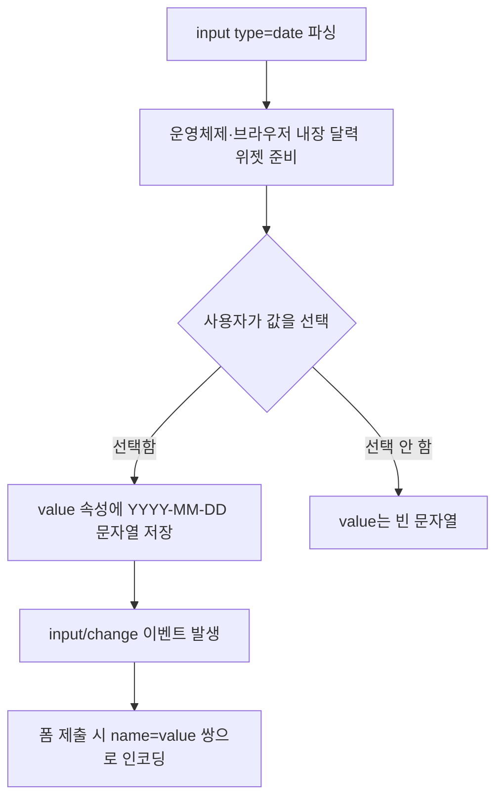

<Callout type="info">
  **이번 문서의 목표:** 이 문서를 다 읽으면 날짜·시간·색상·범위·이메일·URL 입력에 맞는 `type` 값을 골라 브라우저가 제공하는 네이티브 피커(picker, 선택 도구)를 그대로 활용하고, 각 타입이 자바스크립트로 넘겨주는 값의 실제 형식과 접근성 주의점을 설명할 수 있게 됩니다.
</Callout>

## 왜 필요한가 — text 하나로 다 해결하던 시절의 대가

`<input>`의 `type` 속성이 `text`/`password`/`checkbox`/`radio` 같은 전통적인 값만 지원하던 시절(전체 목록과 기본 규약은 `/web/html/html_fundamentals/14_forms-input-types-traditional` 참조), 날짜나 색상처럼 특수한 값을 입력받으려면 방법이 하나뿐이었습니다. `type="text"`로 받아 놓고, 사용자가 "2026-09-14"처럼 원하는 형식으로 정확히 타이핑해 주기를 바라거나, 자바스크립트 달력 위젯 라이브러리를 통째로 붙이는 것입니다.

두 방법 다 대가가 컸습니다. 사용자가 직접 타이핑하면 `09/14/2026`, `2026.9.14`, `14일` 같은 형식이 뒤섞여 서버에서 파싱 오류가 속출했습니다. 라이브러리를 붙이면 페이지 로딩이 무거워지고, 그 라이브러리가 키보드 접근성이나 스크린 리더 대응을 제대로 못 했을 경우 오히려 접근성이 나빠지는 경우도 흔했습니다.

HTML5부터 이어진 표준화 작업은 이 문제를 브라우저 내장 기능으로 옮겼습니다. `type="date"`라고만 쓰면, 운영체제·브라우저가 이미 가지고 있는 날짜 선택 UI를 그대로 빌려 씁니다. 사용자는 늘 쓰던 손에 익은 달력을 보고, 개발자는 파싱 걱정 없는 표준 형식의 문자열을 받습니다.

## 정의 — 값이 어떤 형식으로 돌아오는지가 핵심

> **쉽게 말하면:** 새 input 타입들은 "화면에 보이는 모습"이 아니라 "자바스크립트로 넘어오는 값의 형식"을 표준으로 정한 것입니다. 화면 모습은 브라우저·운영체제마다 다를 수 있어도, `value`에 담기는 문자열 형식은 항상 같습니다.

이 원칙을 표로 정리하면 각 타입의 성격이 한눈에 들어옵니다.

| type | 네이티브 UI | value의 형식(문자열) | 대표 용도 |
|------|-------------|------------------------|-----------|
| `date` | 달력 피커 | `2026-09-14` (YYYY-MM-DD) | 생년월일, 예약일 |
| `time` | 시간 피커 | `14:30` (HH:mm, 24시간제) | 예약 시간, 알람 |
| `color` | 색상 선택기(colorpicker) | `#1a73e8` (소문자 6자리 16진수) | 테마 색상 선택 |
| `range` | 슬라이더 | `50` (min–max 사이 숫자 문자열) | 볼륨, 밝기, 필터 강도 |
| `email` | 일반 텍스트 입력 + 자동 검증 | 입력한 그대로의 문자열 | 이메일 주소 |
| `url` | 일반 텍스트 입력 + 자동 검증 | 입력한 그대로의 문자열 | 웹사이트 주소 |

`email`과 `url`은 겉모습이 `text`와 거의 같아 보이지만, 결정적인 차이가 있습니다. 브라우저가 입력값의 형식을 스스로 검사해 `@`가 없는 문자열이나 스킴(scheme, `https` 같은 통신 방식)이 빠진 주소를 제출 시점에 자동으로 걸러낸다는 점입니다. 이 검증 메커니즘 자체(`:valid`/`:invalid`, 커스텀 오류 메시지)는 `/web/html/modern_html/13_constraint-validation-api`에서 깊게 다룹니다. 여기서는 "이 타입을 쓰면 검증이 공짜로 딸려온다"는 사실만 기억하면 됩니다.

## 타입별로 실제로 확인하기

값을 눈으로 확인하는 것이 가장 빠릅니다. 아래 실습기에서 각 입력을 조작하면서 오른쪽 출력 영역에 찍히는 값의 실제 형식을 확인해 보세요. 특히 `range`는 값을 바꿀 때마다 숫자가 어떻게 갱신되는지 살펴보면, "브라우저가 항상 문자열로 값을 돌려준다"는 감각이 잡힙니다.

<CodePlayground
  template="vanilla"
  activeFile="/index.html"
  showConsole
  label="현대적 input 타입이 돌려주는 실제 값 확인하기"
  files={{
    '/index.html': `<form id="폼">
  

    <label for="생년월일">생년월일 (date)</label>
    <input type="date" id="생년월일" name="생년월일" />
  

  

    <label for="약속시간">약속 시간 (time)</label>
    <input type="time" id="약속시간" name="약속시간" />
  

  

    <label for="테마색상">테마 색상 (color)</label>
    <input type="color" id="테마색상" name="테마색상" value="#1a73e8" />
  

  

    <label for="밝기">밝기 (range) — <output id="밝기출력">50</output></label>
    <input type="range" id="밝기" name="밝기" min="0" max="100" value="50" />
  

  

    <label for="이메일">이메일 (email)</label>
    <input type="email" id="이메일" name="이메일" placeholder="name@example.com" />
  

</form>
<pre id="결과">여기에 각 입력의 value가 실시간으로 찍힙니다.</pre>`,
    '/index.js': `const 폼 = document.getElementById('폼');
const 결과 = document.getElementById('결과');
const 밝기입력 = document.getElementById('밝기');
const 밝기출력 = document.getElementById('밝기출력');

function 값갱신() {
  const 항목들 = [...폼.elements].filter((el) => el.name);
  const 줄들 = 항목들.map((el) => el.name + ' = "' + el.value + '" (타입: ' + el.type + ')');
  결과.textContent = 줄들.join('\\n');
}

폼.addEventListener('input', (이벤트) => {
  if (이벤트.target === 밝기입력) {
    밝기출력.textContent = 밝기입력.value;
  }
  값갱신();
});

값갱신();`,
  }}
/>

콘솔이 아니라 `<pre>` 요소로 값을 찍은 이유가 있습니다. `date`나 `color` 타입은 브라우저 UI로 값을 고르는 것이 자연스러운데, 이때마다 매번 `change` 이벤트가 발생하는지 `input` 이벤트가 발생하는지 직접 조작하며 관찰할 수 있게 하기 위해서입니다. `range`는 슬라이더를 드래그하는 동안 계속 `input` 이벤트가 발생하지만, `date`·`color`는 피커 안에서 값을 고르고 확정하는 순간에만 발생하는 경우가 많습니다. 이 차이는 브라우저·운영체제 구현에 따라 미묘하게 달라질 수 있으므로, 실시간 반응이 꼭 필요하다면 실제 타깃 브라우저에서 직접 확인하는 습관이 중요합니다.

## 브라우저가 실제로 하는 일

`type="date"`를 예로 들면, 브라우저는 다음 순서로 동작합니다.

여기서 중요한 점은 **화면에 보이는 표시 형식과 실제 `value`가 다를 수 있다**는 것입니다. 한국어 로캘(locale, 지역 설정)의 브라우저는 화면에 "2026년 9월 14일"처럼 보여줄 수 있지만, 자바스크립트의 `value`와 폼 제출 시 서버로 넘어가는 값은 로캘과 무관하게 항상 `2026-09-14` 형식으로 고정됩니다. 표시는 사용자 친화적으로, 데이터는 기계가 파싱하기 좋게 고정한다는 설계입니다.

## 타입별 접근성 주의점

각 타입을 쓸 때 스크린 리더·키보드 사용자 관점에서 놓치기 쉬운 지점이 다릅니다.

- **`date`/`time`**: 스크린 리더는 네이티브 피커의 각 구성 요소(년/월/일 각각의 숫자 스피너)를 개별 필드로 읽어줍니다. `<label>`을 반드시 연결(레이블 연결 방법은 `/web/html/html_fundamentals/13_forms-structure-and-labels` 참조)해 "이 입력 전체가 무엇을 묻는지"부터 알려줘야, 세부 필드를 읽기 전에 맥락이 잡힙니다.
- **`color`**: 색상 선택기는 시각적으로 색을 고르는 도구라, 저시력 사용자나 색맹 사용자에게는 선택한 색의 이름이나 16진수 값을 별도 텍스트로 병기해 주는 것이 좋습니다. 색만으로 의미를 전달하지 않는다는 접근성 원칙이 여기에도 적용됩니다.
- **`range`**: 슬라이더는 마우스 드래그가 기본 조작처럼 보이지만, 키보드로도 화살표 키로 값을 바꿀 수 있어야 합니다. 표준 `<input type="range">`는 이 키보드 조작을 기본으로 지원합니다. 현재 값을 시각적으로도 숫자로 함께 보여주면(위 실습의 `<output>` 요소처럼) 스크린 리더 사용자와 저시력 사용자 모두에게 도움이 됩니다.
- **`email`/`url`**: 자동 검증 문구가 브라우저 기본 언어로 뜨는데, 이 문구가 사이트의 다른 언어와 다르면 혼란스러울 수 있습니다. 필요하면 `setCustomValidity`로 메시지를 통일할 수 있으며, 이 API는 다음 편에서 다룹니다.
- **공통**: `inputmode`로 모바일 가상 키보드 레이아웃을 바꾸는 방법(`/web/html/modern_html/14_mobile-form-affordances`)과 `autocomplete` 토큰으로 자동완성을 정확히 지정하는 방법(`/web/html/modern_html/15_autocomplete-tokens`)은 모든 입력 타입에 함께 적용되는 별도 주제이므로 각각의 편에서 자세히 다룹니다.

<Callout type="warning">
  **자주 틀리는 점:** `type="range"`나 `type="color"`는 값이 비어 있을 수 없다고 착각하기 쉽습니다. 실제로는 `min`/`max`를 지정하지 않은 `range`는 기본값(대개 0~100, 초깃값 50)을 쓰고, `color`도 지정하지 않으면 브라우저 기본값(대개 검정)을 씁니다. 즉 사용자가 아무 조작도 하지 않아도 항상 어떤 값이 채워져 있다는 뜻이므로, "사용자가 아직 선택하지 않았다"는 상태를 별도로 표현하려면 `required`나 커스텀 검증 로직을 따로 설계해야 합니다.
</Callout>

## 지원 상태

이 편에서 다룬 타입들은 2026-09 시점 기준으로 **널리 사용 가능**합니다. `date`/`time`/`color`/`range`/`email`/`url` 모두 HTML5 시기부터 주요 브라우저에 오래 자리 잡아 온 기능으로, 최신 여부를 걱정할 필요는 거의 없습니다. 다만 세부 UI(피커의 모양, 날짜 형식 표시 로캘)는 브라우저·운영체제마다 다르므로, "값의 형식은 표준이 보장하지만 겉모습은 보장하지 않는다"는 원칙만 기억하면 됩니다.

## 핵심 정리

- 새 input 타입들은 화면 모습이 아니라 `value`로 돌아오는 문자열의 형식을 표준화한다. `date`는 `YYYY-MM-DD`, `time`은 `HH:mm`, `color`는 소문자 6자리 16진수로 항상 고정된다.
- 네이티브 UI(달력, 색상 선택기, 슬라이더)는 운영체제·브라우저가 이미 가진 것을 그대로 빌려 쓰므로 별도 라이브러리 없이도 접근성 있는 조작이 가능하다.
- `email`/`url`은 겉모습은 텍스트 입력과 비슷하지만 브라우저가 형식을 자동으로 검증한다는 점이 다르다.
- 화면 표시 형식은 사용자 로캘을 따를 수 있지만, 실제 `value`와 서버로 전송되는 값은 로캘과 무관하게 표준 형식으로 고정된다.
- `date`/`time`은 레이블 연결, `color`는 값의 텍스트 병기, `range`는 키보드 조작과 현재 값 표시가 접근성의 핵심이다.

## 마무리 복습

<Quiz
  questionNumber={1}
  question="input type=date에서 사용자가 2026년 9월 14일을 선택했을 때 value 프로퍼티에 담기는 문자열은?"
  options={['09/14/2026', '2026.09.14', '2026-09-14', '14 September 2026']}
  correctAnswer={3}
  explanation="date 타입의 value는 로캘과 무관하게 항상 YYYY-MM-DD 형식의 표준 문자열로 고정된다. 화면 표시만 사용자 로캘에 따라 달라질 수 있다."
  optionExplanations={['이 형식은 화면 표시용 로캘 표기일 뿐 value 형식이 아니다', '이 형식도 표준 value 형식이 아니다', '정답 — YYYY-MM-DD가 표준으로 고정된 형식이다', '영어 표기 형식도 value에 담기는 표준 형식이 아니다']}
/>

<Quiz
  questionNumber={2}
  question="input type=color의 value에 담기는 값의 형식은?"
  options={['red, blue 같은 색상 이름 문자열', 'rgb(26, 115, 232) 형식의 함수 표기', '#1a73e8처럼 소문자 6자리 16진수', 'HSL 색상 공간의 세 숫자 배열']}
  correctAnswer={3}
  explanation="color 타입의 value는 항상 소문자 6자리 16진수 형식(#rrggbb)으로 고정된다. 색상 이름이나 다른 색 표기법으로 반환되지 않는다."
  optionExplanations={['색상 이름 문자열로 반환되지 않는다', 'rgb 함수 표기로 반환되지 않는다', '정답 — 소문자 6자리 16진수로 고정된 형식이다', 'HSL 배열 형식으로 반환되지 않는다']}
/>

<Quiz
  questionNumber={3}
  question="email이나 url 타입이 text 타입과 다른 결정적인 차이는?"
  options={['화면에 보이는 입력창의 모양이 완전히 다르게 렌더링된다', '브라우저가 입력값의 형식을 자동으로 검증해 제출 전에 걸러낼 수 있다', '키보드 입력 자체를 받을 수 없고 마우스로만 값을 넣을 수 있다', '값이 항상 암호화되어 서버로 전송된다']}
  correctAnswer={2}
  explanation="email/url 타입은 겉모습이 text와 비슷하지만, 브라우저가 형식을 자동으로 검사해 잘못된 값의 제출을 막는 Constraint Validation이 함께 딸려온다는 점이 다르다."
  optionExplanations={['겉모습은 일반 텍스트 입력과 크게 다르지 않다', '정답 — 자동 형식 검증이 핵심 차이다', '일반 키보드 입력을 그대로 받는다', '값 전송 방식은 이 타입과 무관하다']}
/>

<Quiz
  questionNumber={4}
  question="input type=range를 키보드로 조작하는 방법에 대한 설명으로 옳은 것은?"
  options={['range는 마우스 전용 컨트롤이라 키보드로는 조작할 수 없다', '표준 range는 화살표 키로 값을 바꾸는 조작을 기본으로 지원한다', '키보드 조작을 지원하려면 반드시 별도의 자바스크립트를 추가해야 한다', 'Tab 키로만 값을 바꿀 수 있고 화살표 키는 지원하지 않는다']}
  correctAnswer={2}
  explanation="표준 input type=range는 포커스가 있을 때 화살표 키로 값을 증감하는 키보드 조작을 브라우저가 기본으로 제공한다."
  optionExplanations={['화살표 키로 조작할 수 있는 키보드 접근성을 기본 제공한다', '정답 — 별도 스크립트 없이 브라우저가 기본 제공하는 동작이다', '추가 스크립트 없이 브라우저가 기본으로 지원한다', 'Tab은 포커스 이동용이며 값 변경은 화살표 키가 담당한다']}
/>

<Quiz
  questionNumber={5}
  question="min과 max를 지정하지 않은 input type=range의 초기 상태에 대한 설명으로 옳은 것은?"
  options={['값이 비어 있는 빈 문자열 상태로 시작한다', '사용자가 조작하기 전까지는 value가 정의되지 않아 오류를 던진다', '기본 범위(대개 0~100)와 기본값(대개 50)이 채워진 상태로 시작한다', '반드시 required 속성이 자동으로 추가된다']}
  correctAnswer={3}
  explanation="range 타입은 min/max를 지정하지 않아도 브라우저 기본 범위(대개 0~100)와 초깃값(대개 50)을 적용하므로, 조작 전에도 항상 어떤 값이 채워져 있다."
  optionExplanations={['range는 항상 어떤 값이 채워진 상태로 시작한다', '오류를 던지지 않고 기본값으로 채워진다', '정답 — 기본 범위와 초깃값이 자동으로 채워진다', 'required 속성이 자동으로 추가되지는 않는다']}
/>

<Quiz
  questionNumber={6}
  question="input type=time에서 오후 2시 30분을 선택했을 때 value에 담기는 문자열 형식은?"
  options={['2:30 PM', '14:30', '14시 30분', '오후 2:30']}
  correctAnswer={2}
  explanation="time 타입의 value는 로캘이나 12/24시간 표시 방식과 무관하게 항상 HH:mm 형식의 24시간제 문자열로 고정된다."
  optionExplanations={['12시간제 오전/오후 표기는 화면 표시용일 뿐 value 형식이 아니다', '정답 — HH:mm 24시간제가 표준으로 고정된 형식이다', '한글 표기 형식은 value에 담기지 않는다', '한글 오전/오후 표기 역시 value 형식이 아니다']}
/>

<Quiz
  questionNumber={7}
  question="date나 time 타입 입력에서 스크린 리더 사용자를 위해 반드시 챙겨야 할 접근성 조치는?"
  options={['색상 대비만 맞추면 충분하고 label은 선택 사항이다', 'label을 연결해 입력 전체가 무엇을 묻는지 먼저 알려준다', '네이티브 피커 대신 반드시 커스텀 자바스크립트 위젯을 만들어야 한다', 'placeholder만 넣으면 label 없이도 충분하다']}
  correctAnswer={2}
  explanation="스크린 리더는 네이티브 피커의 년/월/일 같은 세부 필드를 개별적으로 읽어주므로, label을 반드시 연결해 입력 전체가 묻는 내용의 맥락을 먼저 알려줘야 한다."
  optionExplanations={['색상 대비만으로는 스크린 리더 사용자에게 맥락을 전달할 수 없다', '정답 — label 연결이 date/time 접근성의 핵심이다', '네이티브 피커 자체가 이미 접근성을 갖추고 있어 커스텀 위젯이 필수는 아니다', 'placeholder는 값이 입력되면 사라지고 label을 대체하지 못한다']}
/>

## 참고 자료

- [MDN - Client-side form validation](https://developer.mozilla.org/en-US/docs/Learn_web_development/Extensions/Forms/Form_validation)
- [MDN - Your first form](https://developer.mozilla.org/en-US/docs/Learn_web_development/Extensions/Forms/Your_first_form)
