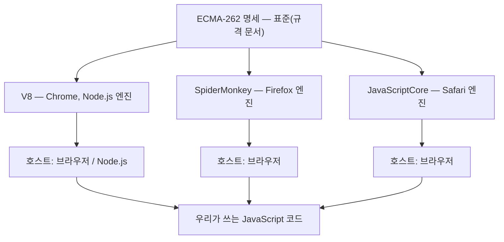
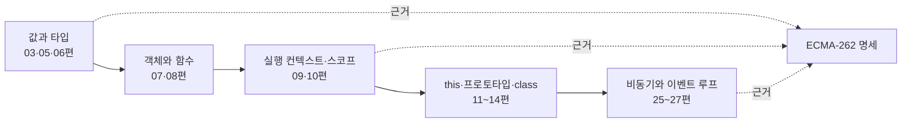

<Callout type="info">
  **이번 문서의 목표:** 이 파일을 다 읽으면 "이 동작이 왜 이런가"를 블로그가 아니라 **ECMAScript 명세 문서에서 직접 찾아 확인**할 수 있게 된다.
</Callout>

## 왜 이 문서부터 시작하는가

이 과목은 "JavaScript 문법 강의"가 아닙니다. 이미 변수·함수·배열을 써 본 사람이 "**왜 그렇게 동작하는가**"를 끝까지 파고드는 과목입니다. 그런데 "왜"의 최종 답은 언제나 한 곳에 있습니다. 바로 **ECMAScript 명세**(specification, 스펙 — 언어의 공식 규격 문서)입니다.

`0.1 + 0.2`가 왜 `0.30000000000000004`인지, `[] + {}`가 왜 문자열이 되는지, `console.log` 출력 순서가 왜 그렇게 나오는지 — 이 모든 질문의 근거는 블로그 글이 아니라 명세의 조항 번호입니다. 그래서 첫 편에서 **명세를 읽는 최소한의 문해력**을 먼저 확보합니다. 지도 없이 산에 오르면 길을 잃듯, 용어 체계 없이 딥 다이브를 시작하면 3편쯤에서 반드시 막힙니다.

> **쉽게 말하면:** 이번 편은 "JS 문법"이 아니라 "**JS 문법의 근거를 찾는 방법**"을 배우는 편입니다.

## 1. ECMAScript와 JavaScript는 무슨 사이인가

### 이름의 유래부터 — 어원으로 감 잡기

**ECMAScript**(에크마스크립트)라는 낯선 단어를 쪼개봅시다.

- **ECMA**는 원래 European Computer Manufacturers Association(유럽 컴퓨터 제조사 협회)의 약자였습니다. 지금은 활동 범위가 유럽을 넘어서서 약자를 풀지 않고 그냥 **Ecma International**이라는 고유명사로 씁니다.
- **Script**(스크립트)는 "대본, 각본"이라는 뜻입니다. 프로그래밍에서는 **컴파일 없이 위에서부터 읽어 실행하는 코드**를 가리키는 말로 굳었습니다. 배우가 대본을 한 줄씩 읽어 내려가듯 실행된다는 이미지입니다.

즉 ECMAScript는 "**Ecma라는 표준화 단체가 관리하는 스크립트 언어 규격**"입니다.

그럼 **JavaScript**(자바스크립트)는? 1995년 넷스케이프(Netscape)라는 회사가 브라우저에 넣으려고 만든 언어의 **제품 이름**입니다. 당시 인기 언어였던 Java의 후광을 빌리려고 붙인 마케팅 이름이었고, 실제로 Java와 언어적 혈연관계는 거의 없습니다. 게다가 "JavaScript"라는 이름은 오랫동안 상표(trademark)로 묶여 있었습니다. 그래서 표준을 만들 때 그 이름을 그대로 쓸 수 없었고, 중립적인 이름 **ECMAScript**가 붙었습니다.

<Callout type="info">
  **한 문장 요약:** ECMAScript는 **규격**(표준 문서)이고, JavaScript는 그 규격을 따르는 **언어의 통칭·제품명**입니다.
</Callout>

### 표준·구현·엔진 — 세 층을 반드시 구분하라

입문자가 가장 많이 뒤섞는 세 단어를 층으로 정리합니다.



- **표준**(standard, 스탠더드): 문서입니다. "이 코드는 이런 결과를 내야 한다"고 **글로 적힌 약속**. 실행되지 않습니다. 정식 이름은 **ECMA-262**입니다.
- **구현**(implementation, 임플리멘테이션): 그 약속을 실제로 지키도록 만든 **프로그램**. 이 구현체를 특히 **엔진**(engine)이라고 부릅니다. 대표적으로 구글의 **V8**(Chrome과 Node.js), 모질라의 **SpiderMonkey**(Firefox), 애플의 **JavaScriptCore**(Safari)가 있습니다.
- **호스트 환경**(host environment, 호스트): 엔진을 품고 있는 바깥 프로그램. 브라우저, Node.js, Deno 같은 것들입니다. 호스트는 언어에 없는 기능(화면 조작, 파일 읽기)을 **추가로** 제공합니다.

> **비유:** ECMA-262는 **건축 법규집**, 엔진은 그 법규대로 지어진 **건물**, 호스트 환경은 그 건물이 서 있는 **동네**입니다. 법규는 "계단 폭은 90cm 이상"까지만 정하고, 동네마다 있는 편의점·지하철역(DOM, 파일 시스템)은 법규집에 없습니다.

### 실험 — 지금 내 엔진이 표준을 어떻게 지키고 있나

말로만 하면 와닿지 않으니 직접 확인합시다. 아래 코드를 실행해 보고, 주석의 값을 바꿔가며 결과를 관찰하세요.

<CodePlayground
  template="vanilla"
  activeFile="/index.js"
  showConsole
  label="표준이 정한 것 vs 호스트가 얹어준 것 구분하기"
  files={{
    '/index.js': `// (1) ECMAScript 표준이 정의하는 것 — 어느 엔진에서든 존재해야 한다
console.log("표준 소속:", typeof Object, typeof Array, typeof Promise, typeof Symbol);

// (2) 호스트 환경(브라우저)이 얹어준 것 — 표준 문서에는 없다
console.log("호스트 소속 console:", typeof console);
console.log("호스트 소속 document:", typeof document);
console.log("호스트 소속 setTimeout:", typeof setTimeout);

// (3) 전역 객체의 표준 이름은 globalThis 하나뿐이다
console.log("globalThis === window ?", globalThis === window);

// (4) 표준이 '정확히' 정한 규칙의 예 — 부동소수점 연산
// 이 결과는 엔진이 틀린 게 아니라, 표준이 그렇게 정한 것이다
console.log("0.1 + 0.2 =", 0.1 + 0.2);
console.log("Number.MAX_SAFE_INTEGER =", Number.MAX_SAFE_INTEGER);

// 실험해 보기: 아래 값을 0.5 + 0.25, 0.3 + 0.6 등으로 바꿔보세요.
// 어떤 조합은 딱 떨어지고 어떤 조합은 오차가 납니다. 이유는 19편에서.
const 실험값 = 0.1 + 0.2;
console.log("오차가 있나?", 실험값 === 0.3);`,
  }}
/>

여기서 관찰할 것은 **`Object`·`Array`·`Promise`는 명세 문서 안에 있고, `console`·`document`·`setTimeout`은 명세 문서 안에 없다**는 사실입니다. 놀랍게도 우리가 매일 쓰는 `console.log`조차 ECMAScript 표준에는 한 줄도 나오지 않습니다. 이것이 "언어 자체"와 "환경이 얹어준 기능"을 가르는 선이고, 이 과목은 **선의 안쪽**, 곧 언어 자체만 다룹니다. 바깥쪽인 DOM·이벤트·네트워크는 별도의 Web APIs 과목 영역입니다.

<Callout type="warning">
  **자주 틀리는 점:** "`alert`가 안 되니까 JavaScript가 아니다" 같은 판단은 틀렸습니다. `alert`는 브라우저라는 **호스트가 준 기능**이라 Node.js에는 없을 뿐, 언어는 동일합니다. 어떤 기능이 안 될 때 "**언어가 없는 건가, 호스트가 안 준 건가**"를 먼저 나누는 습관이 디버깅 속도를 바꿉니다.
</Callout>

## 2. 버전 — ES6 이후 무슨 일이 있었나

### 매년 6월에 나오는 표준

ECMAScript는 **매년 6월** 새 판(edition, 에디션)이 나옵니다. 이름은 연도를 붙여 ES2015, ES2016… 식으로 부릅니다. 그런데 현장에서는 "ES6"라는 말이 훨씬 자주 들립니다. ES6는 **ES2015의 옛 이름**입니다. 6번째 판이라서 ES6였는데, 2015년부터 연도 표기로 바뀌었습니다.

| 판 이름 | 연도 | 이 과목에서 특히 중요한 변화 |
|---------|------|------------------------------|
| ES5 | 2009 | strict mode, 프로퍼티 어트리뷰트, `Object.defineProperty` |
| ES6 – ES2015 | 2015 | `let`·`const`, 화살표 함수, class, Promise, 모듈, Symbol, 이터레이터 |
| ES2016 | 2016 | 지수 연산자, `Array.prototype.includes` |
| ES2017 | 2017 | `async`·`await`, `Object.entries` |
| ES2018 – ES2019 | 2018–2019 | 객체 스프레드, `Promise.prototype.finally`, `flat` |
| ES2020 | 2020 | 옵셔널 체이닝, 널 병합, `BigInt`, `globalThis` |
| ES2021 이후 | 2021– | 논리 할당 연산자, `at`, 클래스 private 필드, `Object.groupBy` 등 |

**ES6는 언어의 분수령**입니다. 그 이전과 이후는 코드 생김새가 완전히 다릅니다. 이 과목은 ES6 이후를 기본값으로 놓되, `var`와 함수 선언문 같은 ES5 유산도 **왜 지금도 살아 있는지**까지 설명합니다. 오래된 코드를 읽어야 하는 순간이 반드시 오기 때문입니다.

### 새 문법은 어떻게 표준이 되는가 — TC39 프로세스

새 문법은 어느 날 갑자기 추가되지 않습니다. **TC39**(Technical Committee 39, 기술위원회 39)라는 위원회가 아래 다섯 단계를 거쳐 합의합니다.

<Steps>

### Stage 0 — Strawperson (허수아비)

"이런 게 있으면 좋겠다" 수준의 아이디어. 아무나 제안할 수 있습니다.

### Stage 1 — Proposal (제안)

담당자(champion, 챔피언)가 정해지고, 해결하려는 문제와 대략의 형태를 문서로 정리합니다.

### Stage 2 — Draft (초안)

명세 문서에 들어갈 **정식 문장**으로 다듬어집니다. 이 단계부터 "언젠가 표준이 되겠구나" 하고 기대할 만합니다.

### Stage 3 — Candidate (후보)

명세가 완성되어 **엔진 구현과 실사용 피드백**을 받는 단계. 브라우저가 실험적으로 지원하기 시작합니다.

### Stage 4 — Finished (완료)

두 개 이상의 엔진에 구현되고 테스트를 통과하면 완료. **다음 해 6월 판에 정식 수록**됩니다.

</Steps>

이 단계를 알아두면 실무에서 크게 유용합니다. 블로그에서 본 신기한 문법이 **Stage 2**라면 아직 바뀔 수 있으니 프로덕션에 쓰면 안 되고, **Stage 4**라면 안심하고 써도 됩니다. 새 문법을 만났을 때 "이거 몇 스테이지야?"라고 묻는 것이 전문가의 첫 질문입니다.

## 3. 명세 읽기 — 최소 문법

이제 실제로 명세 문서를 읽어봅시다. 겁먹을 필요 없습니다. 알아야 할 표기는 네 가지뿐입니다.

### (1) 추상 연산 — `ToNumber(argument)` 같은 것

명세에는 우리가 코드로 부를 수 없는 함수들이 잔뜩 나옵니다. `ToNumber`, `ToPrimitive`, `ToString`, `OrdinaryGet` 같은 것들입니다. 이들을 **추상 연산**(abstract operation, 앱스트랙트 오퍼레이션)이라고 부릅니다.

> **쉽게 말하면:** 추상 연산은 **엔진 내부에서만 쓰이는, 이름 붙은 동작 절차**입니다. 요리책의 "육수 내기" 항목과 같습니다. 손님이 "육수 내기"를 주문할 수는 없지만, 거의 모든 요리 설명이 그것을 참조합니다.

예를 들어 `1 + "2"`가 왜 `"12"`인지는 명세의 덧셈 항목이 **`ToPrimitive`를 호출한 뒤, 한쪽이 문자열이면 `ToString`을 호출한다**고 적혀 있기 때문입니다. 이 추적 방식이 5편(강제 변환)의 핵심 도구가 됩니다.

### (2) 내부 슬롯과 내부 메서드 — 이중 대괄호 표기

명세에는 `[[Prototype]]`, `[[Value]]`, `[[Writable]]`, `[[Get]]` 같은 **이중 대괄호** 표기가 나옵니다. 이것을 **내부 슬롯**(internal slot, 값 저장 칸) 또는 **내부 메서드**(internal method, 내부 동작)라고 합니다.

> **비유:** 내부 슬롯은 **자판기 내부의 부품**입니다. 자판기 앞의 버튼(공개 API)으로만 조작할 수 있고, 부품을 손으로 직접 만질 수는 없습니다.

핵심 성질은 이겁니다 — **내부 슬롯은 원칙적으로 코드에서 직접 접근할 수 없습니다.** `someObject.[[Prototype]]`이라고 쓰면 문법 오류입니다. 대신 명세는 일부 슬롯에 **간접 통로**를 열어둡니다.

| 내부 슬롯·메서드 | 뜻 | 코드에서 접근하는 통로 |
|------------------|-----|------------------------|
| `[[Prototype]]` | 상속의 부모 객체 | `Object.getPrototypeOf(o)` 또는 `o.__proto__` |
| `[[Value]]` | 프로퍼티에 저장된 값 | `Object.getOwnPropertyDescriptor` |
| `[[Writable]]` | 값 변경 가능 여부 | `Object.getOwnPropertyDescriptor` |
| `[[Call]]` | 호출 가능 여부 – 함수인지 | `typeof f === "function"` |
| `[[Construct]]` | `new` 가능 여부 | 직접 통로 없음 – `new`로 시도해 봐야 함 |

### (3) 알고리즘 단계 — 번호가 붙은 절차

명세의 대부분은 **번호 매긴 단계 목록**입니다. 예를 들어 `Boolean(x)`의 동작을 명세는 대략 이렇게 씁니다.

```text
ToBoolean(argument):
  1. argument가 Boolean이면 → argument를 그대로 반환한다.
  2. argument가 undefined이면 → false를 반환한다.
  3. argument가 null이면 → false를 반환한다.
  4. argument가 Number이면 →
       +0, -0, NaN이면 false, 아니면 true를 반환한다.
  5. argument가 String이면 →
       빈 문자열이면 false, 아니면 true를 반환한다.
  6. 그 외(객체)이면 → true를 반환한다.
```

이 여섯 줄이 "JavaScript의 거짓 같은 값(falsy)은 왜 하필 그 여섯 개인가"에 대한 **완전한 답**입니다. 외울 필요가 없습니다 — 알고리즘 한 번 읽으면 이해로 대체됩니다.

### (4) 실험 — 명세 알고리즘을 코드로 재현해 보기

명세를 읽는 가장 좋은 훈련은 **알고리즘을 직접 코드로 옮겨 결과가 같은지 확인하는 것**입니다. 아래에서 `ToBoolean`을 손으로 구현하고, 진짜 `Boolean()`과 비교해 봅시다.

<CodePlayground
  template="vanilla"
  activeFile="/index.js"
  showConsole
  label="명세의 ToBoolean 알고리즘을 손으로 재현해 보기"
  files={{
    '/index.js': `// 명세 ToBoolean 알고리즘을 그대로 코드로 옮긴 것
function 내가만든ToBoolean(값) {
  if (typeof 값 === "boolean") return 값;          // 1단계
  if (값 === undefined) return false;              // 2단계
  if (값 === null) return false;                   // 3단계
  if (typeof 값 === "number") {                    // 4단계
    if (값 === 0 || Number.isNaN(값)) return false;
    return true;
  }
  if (typeof 값 === "string") {                    // 5단계
    return 값.length !== 0;
  }
  return true;                                     // 6단계: 객체는 언제나 true
}

// 표준 Boolean()과 내 구현이 일치하는지 전수 확인
const 검사대상 = [
  true, false, undefined, null,
  0, -0, NaN, 1, -1, Infinity,
  "", "0", "false", " ",
  {}, [], function () {}
];

검사대상.forEach(function (값) {
  const 표준결과 = Boolean(값);
  const 내결과 = 내가만든ToBoolean(값);
  const 표기 = typeof 값 === "string" ? JSON.stringify(값) : String(값);
  console.log(표기, "→", 내결과, 표준결과 === 내결과 ? "일치" : "불일치!");
});

// 실험해 보기: 검사대상 배열에 새 값을 추가해 보세요.
// 예: new Date(), Symbol("x"), 0n, [[]], { valueOf: function(){ return 0; } }
// 특히 "0"과 []가 true인 이유를 알고리즘 5·6단계에서 확인하세요.`,
  }}
/>

결과를 해석해 봅시다. `"0"`이 `true`인 이유는 5단계가 **길이만 보기 때문**입니다. 내용이 무엇이든 빈 문자열만 아니면 참입니다. 빈 배열 `[]`가 `true`인 이유는 6단계 — **객체는 예외 없이 참**이기 때문입니다. 흔히 "빈 배열은 비었으니 거짓 아닌가?"라고 착각하는데, 명세에는 "비었는지" 따지는 단계 자체가 없습니다. 이렇게 알고리즘을 보면 **직관이 틀렸을 때 왜 틀렸는지**가 즉시 드러납니다.

<Callout type="warning">
  **자주 틀리는 점:** `if (배열)`로 "배열이 비었는지"를 판단하면 항상 참으로 들어갑니다. 길이를 명시적으로 확인해야 합니다 — `if (배열.length > 0)`. 같은 함정이 빈 객체, `new Boolean(false)`, 문자열 `"false"`에도 있습니다.
</Callout>

## 4. 이 과목의 지도 — 무엇을 언제 배우는가

명세 문서 전체는 1000쪽이 넘습니다. 전부 읽을 필요는 없고, **실행 모델**(execution model, 코드가 실제로 돌아가는 방식)을 이루는 다섯 축만 잡으면 나머지는 참조 문서 검색으로 해결됩니다.



- **값과 타입**: 원시값과 객체가 메모리에서 어떻게 다른가, 변환은 어떤 알고리즘으로 일어나는가.
- **객체와 함수**: 프로퍼티는 값 하나가 아니라 **어트리뷰트 묶음**이라는 사실, 함수가 왜 객체인가.
- **실행 컨텍스트와 스코프**: 호이스팅과 TDZ의 정체, 클로저가 성립하는 구조적 이유.
- **this·프로토타입·class**: `this`가 왜 "호출 방식"으로 결정되는가, class가 왜 문법 설탕(syntactic sugar)인가.
- **비동기와 이벤트 루프**: 출력 순서가 왜 그렇게 나오는가, 마이크로태스크는 왜 먼저인가.

이 다섯 축을 관통하는 학습 태도는 하나입니다 — **"외우지 말고 알고리즘을 확인하라."** 이 과목의 모든 편은 이 원칙 위에서 쓰였습니다.

## 핵심 정리

- **ECMAScript**는 Ecma International이 관리하는 언어 **표준 문서**(ECMA-262)이고, **JavaScript**는 그 표준을 따르는 언어의 통칭·제품명이다.
- **표준**(문서) → **엔진**(V8, SpiderMonkey 등 구현) → **호스트 환경**(브라우저, Node.js) 세 층을 구분해야 한다. `console`·`document`·`setTimeout`은 언어가 아니라 호스트가 준 기능이다.
- 표준은 매년 6월에 새 판이 나오며 **ES6는 ES2015의 옛 이름**이다. 새 문법은 TC39의 Stage 0부터 Stage 4까지 다섯 단계를 거쳐 표준이 된다.
- 명세를 읽는 최소 도구는 **추상 연산**(`ToBoolean` 등), **내부 슬롯·메서드**(`[[Prototype]]` 등 이중 대괄호), **번호 매긴 알고리즘 단계** 세 가지다.
- 딥 다이브의 원칙은 "외우지 말고 알고리즘을 확인하라" — 직관이 틀렸을 때 그 이유를 명세 단계에서 짚어낼 수 있어야 한다.

## 마무리 복습

<Quiz
  questionNumber={1}
  question="ECMAScript와 JavaScript의 관계를 가장 정확하게 설명한 것은?"
  options={['ECMAScript는 JavaScript의 상위 호환 언어로, 서로 다른 문법을 가진다', 'ECMAScript는 언어의 표준 규격 문서이고, JavaScript는 그 규격을 따르는 언어의 통칭이다', 'JavaScript는 Java의 축약 버전이며 ECMAScript는 그 실행 엔진이다', 'ECMAScript는 브라우저 전용이고 JavaScript는 서버 전용이다']}
  correctAnswer={2}
  explanation="ECMAScript는 Ecma International이 관리하는 표준 문서(ECMA-262)이고, JavaScript는 그 표준을 구현한 언어의 통칭이자 원래의 제품명이다. 상표 문제 때문에 표준 이름이 따로 붙었을 뿐 별개의 언어가 아니다."
  optionExplanations={['둘은 별개 언어가 아니라 규격과 그 규격을 따르는 언어의 관계다', '정답 — 규격 문서와 그 규격을 따르는 언어의 관계다', 'JavaScript는 이름만 Java에서 빌렸을 뿐 언어적 혈연관계가 거의 없고, ECMAScript는 엔진이 아니라 문서다', '둘 다 브라우저와 서버 양쪽에서 동일하게 통용된다']}
/>

<Quiz
  questionNumber={2}
  question="다음 중 ECMAScript 표준(ECMA-262)에 정의되어 있지 않은 것은?"
  options={['Promise', 'Symbol', 'document', 'Array']}
  correctAnswer={3}
  explanation="document는 브라우저라는 호스트 환경이 제공하는 DOM API로, 언어 표준에는 없다. Node.js에는 document가 존재하지 않는 이유가 바로 이것이다. Promise, Symbol, Array는 모두 언어 표준의 빌트인 객체다."
  optionExplanations={['Promise는 ES2015에서 언어 표준에 정식 수록되었다', 'Symbol도 ES2015에서 언어 표준에 추가된 원시 타입이다', '정답 — document는 호스트 환경(브라우저)이 제공하는 DOM API다', 'Array는 가장 오래된 표준 빌트인 객체 중 하나다']}
/>

<Quiz
  questionNumber={3}
  question="명세에서 이중 대괄호로 표기되는 [[Prototype]] 같은 것을 무엇이라 부르며, 그 성질로 옳은 것은?"
  options={['내부 슬롯이며, 코드에서 직접 접근할 수 없고 정해진 통로로만 간접 접근한다', '전역 변수이며, 어디서든 이름으로 읽고 쓸 수 있다', '예약어이며, 변수 이름으로 쓸 수 없다는 뜻이다', '주석 표기이며, 실행에는 아무 영향이 없다']}
  correctAnswer={1}
  explanation="이중 대괄호 표기는 내부 슬롯 또는 내부 메서드로, 엔진 내부 상태를 가리킨다. 코드로 직접 쓸 수 없고 Object.getPrototypeOf 같은 정해진 통로로만 접근한다."
  optionExplanations={['정답 — 내부 슬롯은 직접 접근 불가이며 지정된 API로만 간접 접근한다', '전역 변수와는 아무 관계가 없다', '예약어는 for, class 같은 키워드를 가리키는 별개 개념이다', '주석이 아니라 엔진 동작을 규정하는 실제 명세 표기다']}
/>

<Quiz
  questionNumber={4}
  question="명세의 ToBoolean 알고리즘에 따를 때, Boolean(값)이 false가 되는 값만 모은 것은?"
  options={['0, 빈 문자열, null, undefined, NaN', '0, 빈 배열, 빈 객체, null, undefined', '문자열 false, 숫자 0, 빈 배열, null', '빈 객체, 빈 배열, 빈 문자열, 0']}
  correctAnswer={1}
  explanation="ToBoolean 알고리즘에서 거짓이 되는 값은 false, undefined, null, +0·-0·NaN, 빈 문자열이다. 객체는 마지막 단계에서 예외 없이 true가 되므로 빈 배열과 빈 객체도 참이다."
  optionExplanations={['정답 — 알고리즘 2~5단계에 해당하는 값들이다', '빈 배열과 빈 객체는 객체이므로 마지막 단계에서 true가 된다', '문자열 false는 길이가 0이 아니므로 true이고, 빈 배열도 true다', '빈 객체와 빈 배열은 모두 객체이므로 true다']}
/>

<Quiz
  questionNumber={5}
  question="TC39의 표준화 단계에 대한 설명으로 옳은 것은?"
  options={['Stage 0에 올라온 제안은 다음 해 표준에 반드시 포함된다', 'Stage 4에 도달한 제안이 다음 판에 정식 수록되며, 그 전 단계는 변경될 수 있다', 'Stage는 총 두 단계뿐이며 제안과 승인으로 나뉜다', '엔진이 지원하기 시작하면 자동으로 Stage 4가 된다']}
  correctAnswer={2}
  explanation="Stage 0부터 4까지 다섯 단계가 있고, 두 개 이상의 엔진 구현과 테스트 통과 등을 만족해 Stage 4가 되면 다음 6월 판에 수록된다. Stage 3 이하는 아직 명세가 바뀔 수 있다."
  optionExplanations={['Stage 0은 아이디어 수준이라 폐기될 수도 있다', '정답 — Stage 4가 되어야 정식 수록이 확정된다', '단계는 Stage 0부터 4까지 다섯 단계다', '엔진 지원은 Stage 3의 요건 중 하나일 뿐 자동 승격이 아니다']}
/>

<Quiz
  questionNumber={6}
  question="추상 연산(abstract operation)에 대한 설명으로 옳은 것은?"
  options={['개발자가 코드에서 직접 호출할 수 있는 전역 함수다', '명세 안에서만 쓰이는, 이름 붙은 내부 동작 절차다', '엔진마다 자유롭게 구현을 바꿔도 되는 선택 사항이다', '반드시 async 함수로 구현해야 하는 비동기 연산이다']}
  correctAnswer={2}
  explanation="ToNumber, ToPrimitive 같은 추상 연산은 명세가 동작을 설명하기 위해 이름을 붙인 내부 절차다. 코드에서 직접 호출할 수 없지만, 연산자와 빌트인 함수의 동작이 이들을 참조해 정의되므로 동작 결과는 정확히 규정된다."
  optionExplanations={['ToNumber라는 이름으로 직접 호출할 수는 없다', '정답 — 명세 서술을 위한 이름 붙은 내부 절차다', '결과가 명세로 규정되어 있으므로 엔진이 마음대로 바꿀 수 없다', '비동기와는 무관하며 대부분 동기적인 값 변환 절차다']}
/>

<Quiz
  questionNumber={7}
  question="어떤 기능이 Node.js에서는 되는데 브라우저에서는 안 될 때, 가장 먼저 세워야 할 가설로 알맞은 것은?"
  options={['ECMAScript 표준 자체가 환경마다 다르게 정의되어 있다', '언어 표준 기능이 아니라 호스트 환경이 제공하는 기능일 가능성이 높다', '엔진 버전이 다르면 문법 자체가 달라진다', 'JavaScript 파일 확장자를 바꾸면 해결된다']}
  correctAnswer={2}
  explanation="언어 표준 기능은 어느 호스트에서도 동일하게 동작해야 한다. 환경에 따라 유무가 갈리는 기능은 대개 호스트가 제공하는 API(파일 시스템, DOM 등)다."
  optionExplanations={['표준은 하나이며 환경마다 다르게 정의되지 않는다', '정답 — 언어 소속인지 호스트 소속인지를 먼저 나눠야 한다', '엔진 버전 차이는 최신 문법 지원 여부에 영향을 줄 뿐, 이 상황의 첫 가설로는 부적절하다', '확장자는 모듈 해석 방식에 영향을 줄 뿐 호스트 API 유무와 무관하다']}
/>

## 참고 자료

- [ECMA-262 표준 소개 – Ecma International](https://ecma-international.org/publications-and-standards/standards/ecma-262/)
- [ECMAScript Language Specification – 최신 명세 본문](https://262.ecma-international.org/)
- [MDN – JavaScript reference](https://developer.mozilla.org/en-US/docs/Web/JavaScript/Reference)
