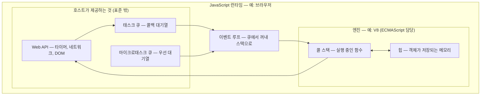
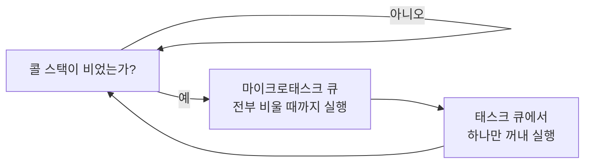

<Callout type="info">
  **이번 문서의 목표:** 이 파일을 다 읽으면 "JavaScript는 싱글 스레드인데 어떻게 동시에 여러 일을 하죠?"라는 질문에 **콜 스택·태스크 큐·이벤트 루프라는 구조로** 답할 수 있게 된다.
</Callout>

## 왜 런타임 지도가 먼저인가

1편에서 표준·엔진·호스트 세 층을 나눴습니다. 이번 편은 그중 **엔진과 호스트가 실제로 어떻게 맞물려 돌아가는지** 그 무대를 그립니다.

이걸 먼저 그려야 하는 이유는 분명합니다. 앞으로 배울 거의 모든 개념 — 호이스팅, 스코프, 클로저, `this`, Promise, `async`·`await` — 은 결국 "**코드가 실행될 때 엔진이 어떤 자료구조를 만들고 무엇을 밀어 넣는가**"의 이야기입니다. 무대를 모르면 배우의 동선을 이해할 수 없습니다.

> **쉽게 말하면:** 이번 편은 JavaScript가 돌아가는 **극장의 평면도**를 그리는 시간입니다. 무대(콜 스택), 대기실(태스크 큐), 무대감독(이벤트 루프)의 위치를 잡습니다.

## 1. 런타임이라는 말부터

### 어원 풀기

**런타임**(runtime)은 `run`(실행하다)과 `time`(때)의 합성어입니다. 문맥에 따라 두 가지 뜻으로 쓰이는데, 이 혼동이 초보자를 자주 괴롭힙니다.

1. **실행 시점**이라는 뜻: "런타임 에러"라고 하면 "코드를 돌리는 도중에 난 에러"입니다. 반대말은 **파싱 타임**(parse time) 또는 컴파일 타임 — 코드를 읽어 들이는 시점입니다.
2. **실행 환경**이라는 뜻: "Node.js는 JavaScript 런타임이다"라고 하면 "JavaScript 코드를 실행해 주는 환경 일체"를 가리킵니다.

이번 편에서 말하는 런타임은 **두 번째 뜻**, 곧 실행 환경입니다.

### 런타임 = 엔진 + 호스트 제공 기능

런타임의 구성을 한 장으로 그리면 이렇습니다.

이 그림에서 반드시 챙겨야 할 사실이 하나 있습니다. **엔진 안에는 타이머도, 네트워크도, 태스크 큐도 없습니다.** 명세가 정의하는 것은 콜 스택과 힙, 그리고 잡 큐(job queue)라는 아주 얇은 개념뿐입니다. `setTimeout`, `fetch`, 클릭 이벤트는 전부 **호스트가 얹어준 능력**입니다.

> **비유:** 엔진은 **요리사 한 명**이고, 호스트는 **주방 설비 전체**입니다. 요리사는 한 번에 한 가지 요리만 만들 수 있지만, 오븐(타이머)과 배달원(네트워크)이 있어서 "10분 뒤에 꺼내달라"고 맡겨두고 다른 요리를 시작할 수 있습니다. 동시에 일하는 것처럼 보이는 비밀은 **요리사가 여럿이어서가 아니라 설비가 대신 기다려주기 때문**입니다.

## 2. 엔진 안쪽 — 콜 스택과 힙

### 콜 스택 — 실행 중인 함수를 쌓는 접시탑

**콜 스택**(call stack, 호출 스택)은 **지금 실행 중인 함수들을 쌓아둔 자료구조**입니다.

`stack`(스택)은 "쌓아 올린 더미"라는 뜻이고, 자료구조에서는 **나중에 넣은 것을 먼저 꺼내는** 규칙을 가진 구조를 뜻합니다. 이 규칙을 **LIFO**(Last In First Out, 마지막에 들어온 것이 먼저 나감)라고 부릅니다.

> **비유:** 식당 주방의 **접시탑**입니다. 새 접시는 맨 위에 올리고, 꺼낼 때도 맨 위부터 꺼냅니다. 중간 접시를 빼낼 방법은 없습니다.

함수를 호출하면 그 함수의 **실행 컨텍스트**(execution context, 실행에 필요한 정보 묶음)가 만들어져 스택 맨 위에 **푸시**(push, 밀어 넣기)되고, 함수가 끝나면 **팝**(pop, 꺼내기)됩니다. 실행 컨텍스트의 내부 구조는 9편에서 통째로 해부합니다. 지금은 "함수 호출 = 스택에 한 칸 쌓기"만 잡으면 됩니다.

### 실험 — 콜 스택을 눈으로 확인하기

콜 스택은 추상적인 개념이 아니라 **실제로 들여다볼 수 있는 것**입니다. 에러가 났을 때 나오는 스택 트레이스(stack trace)가 바로 그 순간의 콜 스택 사진입니다.

<CodePlayground
  template="vanilla"
  activeFile="/index.js"
  showConsole
  label="콜 스택이 쌓이고 무너지는 과정 관찰하기"
  files={{
    '/index.js': `// 함수가 서로를 부르며 스택이 쌓이는 과정을 추적한다
function 깊이표시(단계, 이름) {
  console.log("  ".repeat(단계) + "→ " + 이름 + " 시작");
}

function 첫번째() {
  깊이표시(0, "첫번째");
  두번째();
  console.log("→ 첫번째 끝 (스택에서 팝)");
}

function 두번째() {
  깊이표시(1, "두번째");
  세번째();
  console.log("  → 두번째 끝 (스택에서 팝)");
}

function 세번째() {
  깊이표시(2, "세번째");
  // 이 순간의 콜 스택 사진을 찍는다
  console.log(new Error("스택 사진").stack);
  console.log("    → 세번째 끝 (스택에서 팝)");
}

첫번째();

// ── 실험 1: 스택에는 한계가 있다 ─────────────────
// 아래 주석을 풀고 실행하면 RangeError가 납니다.
// 스택에 쌓을 수 있는 칸 수가 유한하다는 증거입니다.
/*
let 깊이 = 0;
function 끝없이자기를부름() {
  깊이 = 깊이 + 1;
  끝없이자기를부름();
}
try {
  끝없이자기를부름();
} catch (e) {
  console.log("터진 깊이:", 깊이, "/ 에러:", e.name);
}
*/

// ── 실험 2: 깊이를 재보세요 ────────────────────
// 위 주석을 풀고 여러 번 실행하면 '터진 깊이'가 조금씩 달라집니다.
// 함수가 쓰는 지역 변수 개수에 따라 한 칸의 크기가 달라지기 때문입니다.`,
  }}
/>

실험 1의 결과를 해석해 봅시다. 재귀가 무한히 돌면 `RangeError: Maximum call stack size exceeded`가 납니다. 이 에러 이름이 그대로 알려줍니다 — **콜 스택은 크기가 정해진 유한한 공간**이라는 것을. 흔히 말하는 "스택 오버플로"(stack overflow, 스택 넘침)가 바로 이 상황입니다.

<Callout type="warning">
  **자주 틀리는 점:** 스택의 최대 깊이는 명세에 정해져 있지 않습니다. 엔진과 실행 환경, 심지어 함수가 쓰는 지역 변수 개수에 따라 달라집니다. "1만 번까지 된다" 같은 숫자를 코드가 의존하면 안 됩니다. 깊은 재귀가 필요하면 반복문이나 명시적 스택 자료구조로 바꾸는 것이 정답입니다.
</Callout>

### 힙 — 객체가 사는 창고

**힙**(heap)은 원래 "쌓아둔 더미"라는 뜻이지만, 스택과 달리 **순서 없이 흩어져 저장되는 메모리 영역**을 가리킵니다.

- **스택**에는 실행 정보와 크기가 고정된 값이 들어갑니다. 넣고 빼는 순서가 엄격합니다.
- **힙**에는 **객체·배열·함수**처럼 크기가 가변적인 것들이 들어갑니다. 순서가 없어서 아무 데나 놓고 주소로 찾아옵니다.

> **비유:** 스택은 **책상 위에 쌓은 서류철**(순서대로만 접근), 힙은 **창고**(선반 번호를 알면 아무 데나 바로 접근)입니다.

이 구분이 3편의 핵심 주제로 이어집니다. 변수에 객체를 담으면 **객체 자체가 아니라 힙의 주소가 담긴다**는 사실 — 이 주소를 참조(reference)라고 부릅니다 — 그래서 두 변수가 같은 객체를 가리킬 수 있다는 사실 — 전부 여기서 나옵니다. 힙에서 더 이상 쓰이지 않는 객체를 자동으로 정리하는 장치가 **GC**(Garbage Collection, 가비지 컬렉션 — 쓰레기 수거)이며, 30편에서 다룹니다.

## 3. "싱글 스레드"라는 말 바로잡기

### 오해가 생기는 지점

"JavaScript는 싱글 스레드(single thread, 단일 실행 흐름)다"는 문장은 자주 인용되지만, 그대로 받아들이면 두 가지 오해가 생깁니다.

**오해 1: "그래서 JavaScript는 느리다"** — 틀렸습니다. 느린 것은 **JS 코드로 계산을 오래 하는 경우**뿐입니다. 파일 읽기나 네트워크 요청 같은 기다림은 호스트가 대신 처리하므로, 기다리는 동안 JS는 다른 일을 합니다.

**오해 2: "한 번에 하나만 하니까 동시성이 없다"** — 틀렸습니다. **병렬성**(parallelism, 물리적으로 동시에 실행)은 없지만 **동시성**(concurrency, 여러 작업을 번갈아 진행)은 있습니다.

### 정확한 표현

정확히 말하면 이렇습니다.

<Callout type="info">
  **하나의 실행 흐름이 하나의 콜 스택을 쓰며, 한 번에 하나의 코드 조각만 실행한다** — 이 실행 흐름을 스레드(thread)라고 부른다. 다만 기다림이 필요한 작업은 호스트에 위임하고, 완료 시 실행할 콜백을 큐에 받아둔다.
</Callout>

여기서 결정적인 성질이 하나 나옵니다. **실행 중인 코드는 절대 중간에 끊기지 않습니다.** 함수 하나가 시작되면 그 함수가 끝날 때까지 다른 코드가 끼어들 수 없습니다. 이 성질을 **런투컴플리션**(run-to-completion, 끝까지 실행)이라고 부릅니다.

> **비유:** 은행 창구 직원 한 명입니다. 손님 A를 응대하는 도중에 손님 B가 끼어들 수 없습니다. 다만 A가 "서류 떼 오겠다"며 자리를 비우면, 그동안 B를 응대합니다. 서류를 떼 오는 일(네트워크·타이머)은 창구 직원이 아니라 다른 부서가 처리합니다.

이 성질 덕분에 JavaScript에는 다른 언어에서 악명 높은 **경쟁 상태**(race condition, 두 스레드가 같은 값을 동시에 건드려 생기는 버그)나 **잠금**(lock, 락)이 거의 필요 없습니다. 대신 대가가 있습니다 — **긴 계산 하나가 화면 전체를 얼립니다.**

### 실험 — 스레드 하나가 막히면 무슨 일이 벌어지나

<CodePlayground
  template="vanilla"
  activeFile="/index.js"
  showConsole
  label="런투컴플리션과 블로킹을 직접 확인하기"
  files={{
    '/index.js': `// 0밀리초 뒤에 실행하라고 예약해도, 지금 실행 중인 코드가 끝나야 실행된다
console.log("1. 동기 코드 시작");

setTimeout(function () {
  console.log("4. 타이머 콜백 — 0ms로 예약했지만 가장 마지막");
}, 0);

Promise.resolve().then(function () {
  console.log("3. 마이크로태스크 — 타이머보다 먼저");
});

// 일부러 오래 걸리는 계산으로 스레드를 붙잡아 둔다 (블로킹)
const 시작 = Date.now();
let 합계 = 0;
for (let i = 0; i < 20000000; i = i + 1) {
  합계 = 합계 + i;
}
const 걸린시간 = Date.now() - 시작;

console.log("2. 동기 계산 끝 — 약 " + 걸린시간 + "ms 동안 스레드를 붙잡음");

// ── 실험 ─────────────────────────────────────
// (1) 반복 횟수 20000000을 2000000이나 200000000으로 바꿔 보세요.
//     '걸린시간'만 바뀌고 출력 순서 1→2→3→4는 절대 바뀌지 않습니다.
// (2) setTimeout의 0을 1000으로 바꿔도 순서는 그대로입니다.
//     예약 시간은 '최소 대기 시간'일 뿐, 실행 시점 보장이 아니기 때문입니다.
// (3) Promise.resolve().then(...) 줄을 setTimeout 위로 옮겨도
//     3번이 4번보다 먼저입니다. 큐의 우선순위가 다르기 때문입니다.`,
  }}
/>

**결과 해석**이 이번 편의 하이라이트입니다. 출력은 반드시 1 → 2 → 3 → 4 순서입니다.

- **1번이 먼저**인 이유: 동기 코드는 그대로 콜 스택에서 실행됩니다.
- **2번이 그다음**인 이유: 반복문이 끝날 때까지 스택이 비지 않습니다. 이것이 런투컴플리션입니다.
- **3번이 4번보다 먼저**인 이유: Promise의 콜백은 **마이크로태스크 큐**에, 타이머 콜백은 **태스크 큐**에 들어가는데, 이벤트 루프가 **마이크로태스크 큐를 먼저, 그것도 완전히 비울 때까지** 처리하기 때문입니다.
- `setTimeout(f, 0)`이 **즉시 실행되지 않는** 이유: 0은 "지금 당장"이 아니라 "**최소 0밀리초 뒤에 큐에 넣어라**"라는 뜻이기 때문입니다.

## 4. 이벤트 루프 맛보기

### 무대감독의 규칙

**이벤트 루프**(event loop, 사건 반복기)는 아주 단순한 규칙을 무한 반복하는 장치입니다.

<Steps>

### 1단계 — 콜 스택이 비었는지 본다

비어 있지 않으면 아무것도 하지 않고 기다립니다. **실행 중인 코드를 절대 끊지 않는다**는 원칙이 여기서 지켜집니다.

### 2단계 — 마이크로태스크 큐를 완전히 비운다

Promise 콜백 등이 들어 있는 우선 대기열입니다. 하나 꺼내 실행하고, 그 실행 중에 새로 추가된 마이크로태스크까지 **전부 없어질 때까지** 반복합니다.

### 3단계 — 태스크 큐에서 딱 하나를 꺼낸다

타이머 콜백, 이벤트 핸들러 등이 들어 있는 일반 대기열에서 **하나만** 꺼내 스택에 올립니다.

### 4단계 — 다시 1단계로

이 순환을 페이지가 살아 있는 내내 반복합니다. 그래서 이름이 루프(loop, 고리)입니다.

</Steps>

### 태스크와 마이크로태스크 — 두 대기열의 차이

| 구분 | 태스크 — 매크로태스크 | 마이크로태스크 — 잡 |
|------|----------------------|---------------------|
| 대표 예 | `setTimeout`, `setInterval`, 이벤트 핸들러 | Promise의 `then`·`catch`·`finally`, `queueMicrotask` |
| 누가 정의? | 주로 호스트 환경 | ECMAScript 명세의 잡 큐 개념 |
| 한 사이클에 몇 개? | 하나만 | 큐가 빌 때까지 전부 |
| 우선순위 | 낮음 | 높음 – 먼저 처리 |

명세 용어로는 마이크로태스크를 **잡**(job)이라고 부릅니다. ECMAScript 표준이 직접 정의하는 비동기 개념은 사실상 이 잡 큐 하나뿐이고, 태스크 큐라는 개념은 호스트 쪽 규격에서 정의합니다. 이 구분이 왜 중요한지는 27편에서 출력 순서 문제를 풀며 확실히 굳힙니다.

<Callout type="warning">
  **자주 틀리는 점:** 마이크로태스크 안에서 또 마이크로태스크를 무한히 만들면 **태스크 큐에 영영 차례가 오지 않아** 화면이 멈춥니다. 2단계가 "큐가 빌 때까지"이기 때문입니다. 반대로 무거운 작업을 잘게 쪼개 `setTimeout`으로 나눠 넣으면 중간중간 화면 갱신이 끼어들 수 있습니다. 이 차이가 실무에서 "왜 멈추지?"의 흔한 원인입니다.
</Callout>

## 5. 이 편이 뒤 편들과 연결되는 방식

지금 그린 지도는 앞으로 이렇게 쓰입니다.

- **콜 스택** → 9편 실행 컨텍스트, 10편 클로저. "스택에서 팝된 함수의 변수는 왜 살아남는가"가 클로저의 질문입니다.
- **힙과 참조** → 3편 값과 타입, 30편 메모리·GC. "왜 배열을 복사했는데 원본이 바뀌지?"의 답입니다.
- **런투컴플리션** → 25·26·27편 비동기. "`await`는 무엇을 기다리며, 그동안 스택은 어떤 상태인가"의 전제입니다.
- **두 개의 큐** → 27편 이벤트 루프. 출력 순서 문제를 근거 있게 푸는 도구입니다.

## 핵심 정리

- **런타임**은 엔진(콜 스택·힙)과 호스트 제공 기능(타이머·네트워크·큐)을 합친 실행 환경 전체를 가리킨다.
- **콜 스택**은 실행 중인 함수를 LIFO 방식으로 쌓는 유한한 공간이고, **힙**은 객체·배열·함수가 저장되는 순서 없는 메모리 영역이다.
- "싱글 스레드"의 정확한 뜻은 **하나의 콜 스택으로 한 번에 하나만 실행하며, 실행 중인 코드는 끊기지 않는다**는 것이다 — 런투컴플리션.
- 기다림이 필요한 작업은 호스트에 위임되고, 완료된 콜백은 **태스크 큐** 또는 **마이크로태스크 큐**에 쌓인다.
- **이벤트 루프**는 스택이 빌 때마다 마이크로태스크를 전부 비운 뒤 태스크를 하나 꺼내는 순환을 반복한다. 그래서 `setTimeout(f, 0)`도 항상 동기 코드와 Promise 콜백보다 늦다.

## 마무리 복습

<Quiz
  questionNumber={1}
  question="다음 중 ECMAScript 엔진 자체가 아니라 호스트 환경이 제공하는 것만 모은 것은?"
  options={['콜 스택, 힙, 잡 큐', 'setTimeout, DOM 이벤트, 네트워크 요청', 'Object, Array, Promise', 'let 선언, 화살표 함수, 클래스']}
  correctAnswer={2}
  explanation="타이머, DOM 이벤트, 네트워크는 언어 표준에 없고 브라우저나 Node.js 같은 호스트가 제공한다. 콜 스택·힙·잡 큐는 엔진 영역이고, Object·Array·Promise와 문법 요소는 언어 표준이다."
  optionExplanations={['이 셋은 모두 엔진과 명세가 다루는 영역이다', '정답 — 셋 다 호스트가 얹어준 능력이다', '모두 언어 표준의 빌트인 객체다', '모두 언어 문법 자체다']}
/>

<Quiz
  questionNumber={2}
  question="콜 스택에 대한 설명으로 옳지 않은 것은?"
  options={['나중에 쌓인 것이 먼저 제거되는 LIFO 구조다', '함수를 호출하면 실행 컨텍스트가 쌓이고 종료하면 제거된다', '최대 깊이가 ECMAScript 명세에 숫자로 정해져 있다', '깊이 한계를 넘으면 RangeError가 발생한다']}
  correctAnswer={3}
  explanation="스택의 최대 깊이는 명세에 정해져 있지 않으며 엔진과 환경, 함수가 쓰는 지역 변수 양에 따라 달라진다. 그래서 특정 깊이 숫자에 의존하는 코드는 위험하다."
  optionExplanations={['LIFO는 스택의 기본 성질이 맞다', '함수 호출과 종료가 곧 푸시와 팝이다', '정답(틀린 설명) — 명세에 최대 깊이 숫자는 없다', '한계를 넘으면 Maximum call stack size exceeded 형태의 RangeError가 난다']}
/>

<Quiz
  questionNumber={3}
  question="다음 순서로 코드를 작성했다. 1을 로그, 0밀리초 setTimeout 안에서 2를 로그, 즉시 이행된 Promise의 then 안에서 3을 로그, 마지막으로 4를 로그. 실제 출력 순서는?"
  options={['1, 2, 3, 4', '1, 4, 3, 2', '1, 4, 2, 3', '1, 3, 4, 2']}
  correctAnswer={2}
  explanation="동기 코드인 1과 4가 먼저 실행되고, 스택이 빈 뒤 마이크로태스크 큐의 3이 처리되며, 마지막으로 태스크 큐의 타이머 콜백 2가 실행된다."
  optionExplanations={['타이머 콜백은 동기 코드보다 먼저 실행될 수 없다', '정답 — 동기 → 마이크로태스크 → 태스크 순서다', '마이크로태스크가 태스크보다 우선하므로 3이 2보다 먼저다', '3은 동기 코드가 모두 끝난 뒤에 실행되므로 4보다 늦다']}
/>

<Quiz
  questionNumber={4}
  question="런투컴플리션(run-to-completion) 성질이 뜻하는 것은?"
  options={['모든 함수는 반드시 값을 반환해야 한다', '실행이 시작된 코드는 끝날 때까지 다른 코드가 끼어들지 못한다', '비동기 코드는 반드시 동기 코드보다 먼저 완료된다', '반복문은 중간에 break로 멈출 수 없다']}
  correctAnswer={2}
  explanation="하나의 콜 스택으로 실행되므로, 실행 중인 코드는 완료될 때까지 중단되지 않는다. 그래서 경쟁 상태가 거의 없는 대신 긴 동기 계산이 전체를 멈춘다."
  optionExplanations={['반환값 유무와는 무관한 개념이다', '정답 — 끼어들기 없이 끝까지 실행된다는 뜻이다', '비동기 콜백은 오히려 동기 코드가 끝난 뒤에 실행된다', 'break는 문법 기능이며 이 개념과 관계없다']}
/>

<Quiz
  questionNumber={5}
  question="setTimeout(fn, 0)이 즉시 실행되지 않는 가장 정확한 이유는?"
  options={['0밀리초는 내부적으로 항상 1000밀리초로 바뀌기 때문', '0은 최소 대기 시간을 뜻하며, 콜백은 태스크 큐를 거쳐 스택이 빈 뒤에 실행되기 때문', '타이머는 반드시 다른 스레드에서 실행되기 때문', 'Promise가 없으면 타이머가 동작하지 않기 때문']}
  correctAnswer={2}
  explanation="지연 시간은 실행 시점 보장이 아니라 큐에 넣기까지의 최소 대기 시간이다. 실제 실행은 콜 스택이 비고 마이크로태스크가 모두 처리된 뒤 태스크 큐 차례가 와야 이루어진다."
  optionExplanations={['환경에 따라 최소값이 조정될 수 있지만 1000ms로 바뀌지는 않는다', '정답 — 최소 대기 시간이며 실행은 큐 차례를 기다려야 한다', '콜백 자체는 결국 같은 하나의 스택에서 실행된다', 'Promise와 타이머는 서로 독립적이다']}
/>

<Quiz
  questionNumber={6}
  question="마이크로태스크 큐와 태스크 큐의 처리 방식 차이로 옳은 것은?"
  options={['이벤트 루프는 한 사이클에서 마이크로태스크를 전부 비우고 태스크는 하나만 처리한다', '두 큐 모두 한 사이클에 하나씩만 처리한다', '태스크 큐를 먼저 전부 비운 뒤 마이크로태스크를 처리한다', '두 큐는 사실 같은 큐이며 이름만 다르다']}
  correctAnswer={1}
  explanation="이벤트 루프는 스택이 빌 때마다 마이크로태스크 큐를 완전히 비운 뒤, 태스크 큐에서는 하나만 꺼낸다. 그래서 마이크로태스크를 무한히 생성하면 태스크가 영영 실행되지 못한다."
  optionExplanations={['정답 — 마이크로태스크는 전부, 태스크는 하나다', '마이크로태스크는 하나만 처리하지 않는다', '우선순위가 반대다 — 마이크로태스크가 먼저다', '우선순위와 처리 방식이 다른 별개의 큐다']}
/>

<Quiz
  questionNumber={7}
  question="힙(heap)에 저장되는 것으로 알맞게 짝지어진 것은?"
  options={['실행 컨텍스트와 호출 순서 정보', '객체, 배열, 함수처럼 크기가 가변적인 값', '소스 코드 원문과 주석', '이벤트 루프의 순환 횟수']}
  correctAnswer={2}
  explanation="힙은 크기가 정해지지 않은 데이터를 순서 없이 저장하는 영역이며, 객체·배열·함수가 여기에 놓인다. 실행 컨텍스트와 호출 순서는 콜 스택이 관리한다."
  optionExplanations={['그것은 콜 스택이 관리하는 정보다', '정답 — 가변 크기 데이터가 힙에 저장된다', '소스 코드 관리와 힙 저장은 별개다', '이벤트 루프 순환 횟수는 저장 대상이 아니다']}
/>

## 참고 자료

- [MDN – Event loop](https://developer.mozilla.org/en-US/docs/Web/JavaScript/Event_loop)
- [ECMAScript Language Specification – 최신 명세 본문](https://262.ecma-international.org/)
- [MDN – Memory management](https://developer.mozilla.org/en-US/docs/Web/JavaScript/Guide/Memory_management)
