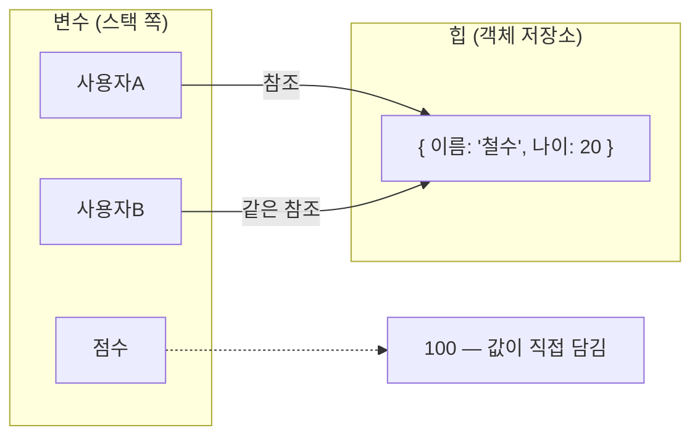

<Callout type="info">
  **이번 문서의 목표:** 이 파일을 다 읽으면 "복사했는데 원본이 같이 바뀌었다" 부류의 버그를 **원시값·객체·참조라는 구조로 즉시 진단**하고, `==`·`===`·`Object.is`·`SameValueZero`의 차이를 근거와 함께 설명할 수 있게 된다.
</Callout>

## 왜 값과 타입부터인가

프로그래밍에서 우리가 다루는 것은 결국 **값**(value, 밸류) 하나뿐입니다. 변수는 값을 담는 상자이고, 함수는 값을 받아 값을 내놓으며, 연산자는 값을 조합합니다. 그러니 값이 메모리에서 어떻게 존재하는지를 정확히 알면, 그 위에 쌓인 모든 개념이 순순히 풀립니다.

JavaScript에서 값의 세계는 **딱 두 나라**로 나뉩니다. **원시값**의 나라와 **객체**의 나라입니다. 이 국경선이 이 언어에서 벌어지는 혼란의 절반 이상을 설명합니다.

> **쉽게 말하면:** 원시값은 **손에 쥔 물건**이고, 객체는 **창고에 있는 물건의 보관증**입니다. 물건을 건네주면 상대가 자기 물건을 갖게 되지만, 보관증을 복사해 건네주면 둘이 **같은 창고 칸**을 열게 됩니다.

## 1. 타입 여덟 가지 — 명세가 정한 전부

### 목록과 어원

ECMAScript 명세는 언어의 타입을 정확히 여덟 가지로 규정합니다. 일곱 개의 **원시 타입**(primitive type)과 하나의 **객체 타입**(Object type)입니다.

`primitive`는 "원시의, 더 쪼갤 수 없는"이라는 뜻입니다. 이름 그대로 **더 작은 조각으로 나눌 수 없는 값**이라는 의미입니다.

| 타입 | 값의 예 | `typeof` 결과 | 등장 시기 |
|------|---------|---------------|-----------|
| Undefined | `undefined` | `"undefined"` | 최초부터 |
| Null | `null` | `"object"` – 버그 | 최초부터 |
| Boolean | `true`, `false` | `"boolean"` | 최초부터 |
| Number | `42`, `3.14`, `NaN`, `Infinity` | `"number"` | 최초부터 |
| String | `"안녕"`, `""` | `"string"` | 최초부터 |
| Symbol | `Symbol("id")` | `"symbol"` | ES2015 |
| BigInt | `9007199254740993n` | `"bigint"` | ES2020 |
| Object | `{}`, `[]`, `function(){}` | `"object"` 또는 `"function"` | 최초부터 |

여기서 **`typeof null`이 `"object"`인 것은 언어 초창기의 버그**입니다. 값의 타입을 하위 비트로 표시하던 구현에서 `null`의 표현이 객체와 같은 비트 패턴이었던 탓입니다. 지금 고치면 기존 웹 페이지 수백만 개가 깨지므로 영원히 고치지 않기로 했습니다. 명세에도 "역사적 이유로 그렇다"고 사실상 명시되어 있습니다.

<Callout type="warning">
  **자주 틀리는 점:** `typeof x === "object"`로 객체 여부를 판단하면 `null`이 통과합니다. 안전한 판정은 `x !== null && typeof x === "object"`입니다. 함수를 포함해 판단하려면 `typeof x === "function"`도 함께 봐야 합니다.
</Callout>

### undefined와 null — 왜 둘 다 있는가

둘 다 "값이 없음"을 뜻하는데 왜 두 개일까요? 의도가 다릅니다.

- **`undefined`**: **아직 값이 정해지지 않았다**는 뜻. 엔진이 자동으로 넣어주는 값입니다. 선언만 하고 초기화하지 않은 변수, 없는 프로퍼티를 읽었을 때, 반환문이 없는 함수의 결과가 전부 `undefined`입니다.
- **`null`**: **의도적으로 비워두었다**는 뜻. 사람이 명시적으로 대입하는 값입니다.

> **비유:** `undefined`는 **아직 이름표를 안 붙인 빈 서랍**, `null`은 **"여기 아무것도 없음"이라고 적힌 이름표를 붙여둔 서랍**입니다. 둘 다 비었지만 의도의 유무가 다릅니다.

이 구분은 실전에서 의미가 있습니다. 함수 인자로 `null`이 왔다면 "호출자가 일부러 비웠구나"로, `undefined`가 왔다면 "안 넘겼구나"로 읽을 수 있습니다. 실제로 **기본값 매개변수는 `undefined`일 때만 발동하고 `null`에는 발동하지 않습니다** — 8편에서 다시 다룹니다.

## 2. 원시값 — 변경 불가능하다는 말의 정확한 뜻

### 불변성의 진짜 대상

원시값의 결정적 성질은 **불변**(immutable, 이뮤터블 — 변경 불가능)입니다. 그런데 이 말이 오해를 많이 삽니다.

```js
let 인사 = "안녕";
인사 = "반가워";   // 이건 가능하다. 그럼 변한 거 아닌가?
```

변한 것은 **변수가 가리키는 값**이지 **값 자체**가 아닙니다. 문자열 `"안녕"`이라는 값 자체는 세상 어디에서도 바뀌지 않았습니다. 그저 변수 `인사`가 다른 값을 가리키게 되었을 뿐입니다.

> **비유:** 숫자 `3`을 생각해 보세요. `3`을 `4`로 "바꿀" 수 있나요? 없습니다. 3은 영원히 3입니다. 변수가 3 대신 4를 가리키게 할 수는 있어도, 3이라는 값 자체를 개조할 수는 없습니다. 문자열과 불리언도 똑같습니다.

이 성질에서 중요한 귀결이 나옵니다 — **원시값을 변수에 담거나 함수에 넘기면 값 자체가 복사됩니다.** 복사본은 원본과 완전히 독립적입니다.

### 문자열 인덱스 대입이 조용히 실패하는 이유

<CodePlayground
  template="vanilla"
  activeFile="/index.js"
  showConsole
  label="원시값의 불변성과 값 복사를 확인하기"
  files={{
    '/index.js': `"use strict";

// ── (1) 문자열은 인덱스로 바꿀 수 없다 ─────────────
let 이름 = "김철수";
console.log("0번째 글자 읽기:", 이름[0]);  // 읽기는 된다

try {
  이름[0] = "박";                          // 쓰기는 실패한다
  console.log("변경 후:", 이름);
} catch (e) {
  console.log("변경 시도 결과:", e.name, "-", e.message);
}
// strict mode에서는 TypeError, 아니면 조용히 무시된다.
// "use strict"; 줄을 지우고 다시 실행해 차이를 확인해 보세요.

// ── (2) 문자열 메서드는 원본을 바꾸지 않고 새 값을 만든다 ──
const 원본 = "hello";
const 대문자 = 원본.toUpperCase();
console.log("원본:", 원본, "/ 결과:", 대문자);

// ── (3) 원시값은 복사된다 ──────────────────────
let 점수A = 100;
let 점수B = 점수A;    // 값 자체가 복사됨
점수B = 50;
console.log("점수A:", 점수A, "/ 점수B:", 점수B);  // 100 / 50 — 독립적

// ── (4) 함수에 넘겨도 복사본이 간다 ─────────────
function 값을바꿔보기(숫자) {
  숫자 = 숫자 + 1000;
  return 숫자;
}
let 바깥값 = 7;
const 반환값 = 값을바꿔보기(바깥값);
console.log("바깥값:", 바깥값, "/ 반환값:", 반환값);  // 7 / 1007

// 실험: (3)의 점수A를 객체 { 값: 100 }으로 바꾸고
// 점수B.값 = 50 을 해보세요. 결과가 완전히 달라집니다.`,
  }}
/>

**결과 해석**: `이름[0] = "박"`은 에러를 내거나 조용히 무시됩니다. 문자열은 겉보기에 배열처럼 인덱스로 읽히지만, 실제로는 각 글자가 **읽기 전용**(read-only) 프로퍼티이기 때문입니다. strict mode에서는 이 실패가 `TypeError`로 드러나고, 아니면 아무 일 없이 지나갑니다 — 이 차이 자체가 4편에서 다룰 strict mode의 존재 이유입니다.

## 3. 객체 — 참조로 다뤄지는 값

### 참조란 무엇인가

객체·배열·함수는 크기가 정해져 있지 않습니다. 배열에 원소를 계속 넣을 수 있으니까요. 그래서 이들은 2편에서 본 **힙**(heap)에 저장되고, 변수에는 그 **위치를 가리키는 값**만 담깁니다. 이 위치 값을 **참조**(reference, 레퍼런스)라고 부릅니다.



`사용자A`와 `사용자B`는 **같은 객체를 가리키는 두 개의 이름표**입니다. `사용자B.나이 = 21`을 하면 `사용자A.나이`도 21이 됩니다. 하나의 물건을 두 사람이 가리키고 있으니 당연한 일입니다.

<Callout type="warning">
  **용어 주의:** JavaScript는 흔히 "참조에 의한 전달"(pass by reference)을 한다고 잘못 설명됩니다. 정확히는 **참조라는 값을 복사해서 전달**합니다. 그래서 함수 안에서 `인자.프로퍼티 = 값`은 바깥에 반영되지만, `인자 = 완전히새객체`는 바깥에 반영되지 않습니다. 이 미묘한 차이를 아래 실험에서 직접 확인합니다.
</Callout>

### 실험 — 공유와 재대입의 차이

<CodePlayground
  template="vanilla"
  activeFile="/index.js"
  showConsole
  label="참조 복사, 얕은 복사, 깊은 복사를 한자리에서 비교하기"
  files={{
    '/index.js': `// ── (1) 참조 복사 — 같은 객체를 가리킨다 ────────────
const 사용자A = { 이름: "철수", 나이: 20 };
const 사용자B = 사용자A;
사용자B.나이 = 21;
console.log("(1) 사용자A.나이 =", 사용자A.나이);   // 21 — 같이 바뀐다
console.log("(1) 같은 객체인가?", 사용자A === 사용자B);

// ── (2) 함수 안에서 프로퍼티 수정 vs 재대입 ──────────
function 프로퍼티수정(객체) { 객체.나이 = 99; }
function 통째로재대입(객체) { 객체 = { 이름: "새사람", 나이: 1 }; }

const 대상 = { 이름: "영희", 나이: 30 };
프로퍼티수정(대상);
console.log("(2) 프로퍼티 수정 후:", 대상.나이);   // 99 — 반영됨
통째로재대입(대상);
console.log("(2) 통째로 재대입 후:", 대상.이름);   // 영희 — 반영 안 됨

// ── (3) 얕은 복사 — 1단계만 복사된다 ────────────────
const 원본설정 = { 테마: "dark", 알림: { 이메일: true, 푸시: false } };
const 얕은복사 = Object.assign({}, 원본설정);
// 스프레드 문법도 동일: const 얕은복사 = { ...원본설정 };

얕은복사.테마 = "light";              // 1단계 값 → 독립적
얕은복사.알림.이메일 = false;          // 2단계 객체 → 공유된다!

console.log("(3) 원본 테마:", 원본설정.테마);           // dark — 안전
console.log("(3) 원본 알림.이메일:", 원본설정.알림.이메일); // false — 오염됨!
console.log("(3) 알림 객체 공유?", 원본설정.알림 === 얕은복사.알림);

// ── (4) 깊은 복사 — 중첩까지 새로 만든다 ─────────────
const 깊은복사 = structuredClone(원본설정);
깊은복사.알림.푸시 = true;
console.log("(4) 원본 알림.푸시:", 원본설정.알림.푸시);  // false — 안전
console.log("(4) 알림 객체 공유?", 원본설정.알림 === 깊은복사.알림);

// 실험해 보기:
// (a) (3)의 Object.assign을 스프레드로 바꿔도 결과가 같은지 확인
// (b) structuredClone 대신 JSON.parse(JSON.stringify(원본설정))을 써보고,
//     원본설정에 날짜: new Date() 나 함수: function(){} 를 추가하면
//     어떤 것이 사라지거나 변형되는지 관찰`,
  }}
/>

**결과 해석**을 세 층으로 정리합니다.

1. (2)번의 **대비**가 참조 전달의 정체를 정확히 보여줍니다. 함수 안 `객체`는 바깥 참조를 **복사한 별도의 변수**입니다. 그 복사본으로 같은 힙 객체를 조작하면 바깥에 보이고, 복사본 자체에 다른 참조를 넣으면 바깥과 연결이 끊깁니다.
2. (3)번 **얕은 복사**(shallow copy)의 함정: `Object.assign`과 스프레드는 **1단계 프로퍼티의 값만** 새 객체에 옮깁니다. 그 값이 참조면 참조가 복사되므로, 중첩 객체는 원본과 그대로 공유됩니다. 실무 버그의 단골 원인입니다.
3. (4)번 **깊은 복사**(deep copy): `structuredClone`은 중첩까지 전부 새로 만듭니다. 예전에 많이 쓰던 `JSON.parse(JSON.stringify(x))`는 함수·`undefined`·`Symbol`을 날려버리고 `Date`를 문자열로 바꿔버리므로 안전하지 않습니다.

## 4. 동일성 — 네 가지 비교 알고리즘

"같다"는 판단은 하나가 아닙니다. 명세는 네 가지 알고리즘을 정의합니다.

| 알고리즘 | 코드 표기 | 타입이 다르면 | `NaN`과 `NaN` | `+0`과 `-0` |
|----------|-----------|---------------|---------------|-------------|
| IsLooselyEqual | `==` | 변환 후 비교 | 다름 | 같음 |
| IsStrictlyEqual | `===` | 곧바로 거짓 | 다름 | 같음 |
| SameValueZero | `includes`, `Map` 키 | 곧바로 거짓 | 같음 | 같음 |
| SameValue | `Object.is` | 곧바로 거짓 | 같음 | 다름 |

### 세 가지 특이 케이스의 이유

**`NaN !== NaN`인 이유**: `NaN`은 Not-a-Number(숫자가 아님)의 약자로, "계산에 실패했다"는 **표지**입니다. 서로 다른 두 실패가 같은 실패라고 볼 근거가 없으므로, IEEE 754라는 부동소수점 국제 표준이 "NaN은 자기 자신과도 같지 않다"고 정했고 JavaScript가 그대로 따릅니다. 그래서 `NaN` 판별에는 `Number.isNaN(x)`이나 `Object.is(x, NaN)`을 씁니다.

**`+0 === -0`인 이유**: 부동소수점에는 부호 있는 0이 두 개 존재합니다. 산술적으로는 둘 다 0이므로 `===`는 같다고 봅니다. 다만 `1/+0`은 `Infinity`, `1/-0`은 `-Infinity`라 실제로는 구별되는 값입니다. 그 구별이 필요할 때 쓰라고 `Object.is`가 있습니다.

**`==`가 위험한 이유**: 타입이 다르면 **강제 변환**(coercion, 코어션)을 거쳐 비교합니다. 이 변환 규칙이 직관과 자주 어긋납니다. 5편과 6편에서 알고리즘을 통째로 해부하지만, 맛보기로 `null == undefined`는 참인데 `null == 0`은 거짓입니다.

### 실험 — 네 알고리즘 한자리 비교

<CodePlayground
  template="vanilla"
  activeFile="/index.js"
  showConsole
  label="== / === / SameValueZero / Object.is 를 한 표로 비교하기"
  files={{
    '/index.js': `// 네 가지 동일성 알고리즘을 같은 입력으로 한 번에 비교한다
function SameValueZero(a, b) {
  // 배열의 includes가 쓰는 알고리즘을 그대로 흉내 낸 것
  return [a].includes(b);
}

const 비교쌍 = [
  [1, "1"],
  [null, undefined],
  [null, 0],
  [NaN, NaN],
  [0, -0],
  [true, 1],
  ["", 0],
  [[], ""],
  [{}, {}],
];

console.log("A | B | == | === | SameValueZero | Object.is");
비교쌍.forEach(function (쌍) {
  const a = 쌍[0];
  const b = 쌍[1];
  const 표기 = function (v) {
    if (typeof v === "string") return JSON.stringify(v);
    if (Array.isArray(v)) return "[]";
    if (v !== null && typeof v === "object") return "obj";
    return String(v);
  };
  console.log(
    표기(a) + " | " + 표기(b) + " | " +
    (a == b) + " | " + (a === b) + " | " +
    SameValueZero(a, b) + " | " + Object.is(a, b)
  );
});

// ── 참조 동일성 확인 ───────────────────────────
const 배열1 = [1, 2, 3];
const 배열2 = [1, 2, 3];
console.log("내용이 같은 두 배열:", 배열1 === 배열2);   // false
console.log("자기 자신과 비교:", 배열1 === 배열1);      // true
// 객체 비교는 '내용'이 아니라 '같은 힙 주소인가'를 본다.

// 실험: 비교쌍 배열에 다음 쌍을 추가해 보세요.
// ["0", false] / [Infinity, Infinity] / [Symbol("a"), Symbol("a")]
// 특히 마지막 쌍이 왜 모두 false인지 생각해 보세요 (16편에서 다룹니다).`,
  }}
/>

**결과 해석**: 표에서 `==` 열만 유독 `true`가 많다는 것이 한눈에 보입니다. `1 == "1"`, `true == 1`, `"" == 0`, `[] == ""` 이 전부 참입니다. 이 관대함은 편해 보이지만 **의도치 않은 참**을 만들어 버그가 됩니다. 실무 원칙은 명확합니다 — **기본은 `===`, `null`과 `undefined`를 한꺼번에 걸러낼 때만 `x == null`을 관용적으로 쓴다.**

<Callout type="warning">
  **자주 틀리는 점:** 객체 비교에서 `===`는 **내용이 같은가**가 아니라 **같은 객체인가**를 봅니다. 내용 비교가 필요하면 각 프로퍼티를 순회해 비교하거나, 구조가 단순하다면 직렬화 후 비교하는 방식을 씁니다. 배열이 특정 값을 포함하는지 볼 때 `indexOf`는 `===` 기반이라 `NaN`을 찾지 못하고, `includes`는 SameValueZero 기반이라 찾아냅니다.
</Callout>

## 5. 가변성 — const가 지켜주는 것과 못 지켜주는 것

`const`(constant, 상수)로 선언한 변수에는 재대입할 수 없습니다. 그런데 **`const`가 막는 것은 변수의 재대입뿐이지 값의 내부 변경이 아닙니다.**

```js
const 설정 = { 테마: "dark" };
설정.테마 = "light";     // 가능 — 객체 내부를 바꾸는 것은 재대입이 아니다
설정 = {};               // TypeError — 변수가 다른 참조를 가리키게 하는 것은 금지
```

> **비유:** `const`는 **보관증을 다른 보관증으로 바꾸는 것을 금지**할 뿐, **창고 안 물건을 정리하는 것까지 막지는 않습니다.**

내부까지 막고 싶다면 별도의 장치가 필요합니다.

| 방법 | 막는 범위 | 중첩 객체까지? |
|------|-----------|----------------|
| `const` | 변수 재대입 | 해당 없음 |
| `Object.preventExtensions` | 프로퍼티 추가 | 아니요 |
| `Object.seal` | 추가·삭제 | 아니요 |
| `Object.freeze` | 추가·삭제·수정 | 아니요 – 1단계만 |

`Object.freeze`조차 **얕게만** 동작합니다. 중첩까지 얼리려면 재귀적으로 순회하며 얼려야 합니다. 이 세 함수의 정확한 동작과 프로퍼티 어트리뷰트의 관계는 7편에서 해부합니다.

## 핵심 정리

- 명세가 정한 타입은 **원시 7종**(Undefined, Null, Boolean, Number, String, Symbol, BigInt)과 **Object 1종**뿐이다. `typeof null`이 `"object"`인 것은 고칠 수 없는 역사적 버그다.
- **원시값은 불변**이며 변수에 담거나 함수에 넘길 때 **값 자체가 복사**된다. 문자열 인덱스 대입이 실패하는 이유가 여기에 있다.
- **객체는 힙에 저장되고 변수에는 참조가 담긴다.** 참조가 복사되어 전달되므로, 프로퍼티 수정은 바깥에 반영되지만 인자 재대입은 반영되지 않는다.
- **얕은 복사는 1단계만** 새로 만든다. 중첩 객체가 공유되어 원본이 오염되는 것이 대표적 버그이며, `structuredClone`으로 깊은 복사를 한다.
- 동일성 알고리즘은 네 가지다 — `==`는 변환 후 비교, `===`는 타입까지 엄격, `SameValueZero`는 `NaN`을 같다고 보고, `Object.is`는 거기에 더해 `+0`과 `-0`을 구별한다.
- `const`는 **재대입만** 막는다. 내용까지 막으려면 `Object.freeze` 계열이 필요하고, 그마저 얕게 동작한다.

## 마무리 복습

<Quiz
  questionNumber={1}
  question="ECMAScript 명세가 정의하는 원시 타입의 개수와 구성으로 옳은 것은?"
  options={['6종 — Undefined, Null, Boolean, Number, String, Object', '7종 — Undefined, Null, Boolean, Number, String, Symbol, BigInt', '8종 — 앞의 7종에 Array를 더한 것', '5종 — Number, String, Boolean, Array, Object']}
  correctAnswer={2}
  explanation="원시 타입은 Undefined, Null, Boolean, Number, String, Symbol, BigInt의 7종이며, 여기에 Object 타입을 더해 전체 8종이 된다. Array와 Function은 별도 타입이 아니라 Object에 속한다."
  optionExplanations={['Object는 원시 타입이 아니고, Symbol과 BigInt가 빠졌다', '정답 — 원시 7종이며 여기에 Object를 더해 전체 8종이다', 'Array는 독립된 언어 타입이 아니라 Object의 한 종류다', 'Array와 Object는 원시 타입이 아니다']}
/>

<Quiz
  questionNumber={2}
  question="다음 상황의 결과로 옳은 것은? 객체 하나를 두 변수 A와 B에 담고, 함수에 B를 넘겨 함수 안에서 매개변수에 완전히 새로운 객체를 재대입했다."
  options={['A와 B가 모두 새 객체를 가리키게 된다', 'B만 새 객체를 가리키고 A는 그대로다', 'A와 B 모두 원래 객체를 그대로 가리킨다', 'TypeError가 발생한다']}
  correctAnswer={3}
  explanation="함수의 매개변수는 전달된 참조를 복사한 별개의 변수다. 거기에 새 객체를 재대입해도 바깥의 A와 B에는 아무 영향이 없다. 반면 매개변수를 통해 프로퍼티를 수정했다면 A와 B 모두에서 그 변화가 보인다."
  optionExplanations={['재대입은 함수 안 지역 변수에만 영향을 준다', 'B도 바뀌지 않는다 — 바뀐 것은 함수 안의 매개변수뿐이다', '정답 — 참조 값이 복사되어 전달되므로 바깥은 그대로다', '재대입 자체는 오류가 아니다']}
/>

<Quiz
  questionNumber={3}
  question="스프레드 문법이나 Object.assign으로 객체를 복사했을 때 생길 수 있는 문제는?"
  options={['원시값 프로퍼티까지 원본과 공유되어 모두 오염된다', '중첩된 객체 프로퍼티는 참조가 복사되어 원본과 공유된다', '복사된 객체는 자동으로 동결되어 수정할 수 없다', '프로퍼티 이름이 모두 문자열로 바뀐다']}
  correctAnswer={2}
  explanation="얕은 복사는 1단계 프로퍼티의 값만 옮긴다. 그 값이 참조라면 참조가 복사되므로 중첩 객체는 원본과 같은 대상을 가리킨다. 깊은 복사가 필요하면 structuredClone 등을 사용한다."
  optionExplanations={['원시값은 값 자체가 복사되므로 독립적이다', '정답 — 중첩 객체가 공유되어 원본이 오염될 수 있다', '복사본은 동결되지 않는다', '심볼 키는 문자열로 바뀌지 않으며 이 상황과 무관하다']}
/>

<Quiz
  questionNumber={4}
  question="NaN과 관련한 설명으로 옳은 것은?"
  options={['NaN === NaN 은 true이며 NaN은 유일한 값이다', 'NaN은 자기 자신과 엄격 비교하면 false이지만 Object.is로는 true다', 'NaN은 typeof 결과가 undefined다', 'NaN은 배열 includes로도 찾을 수 없다']}
  correctAnswer={2}
  explanation="부동소수점 표준에 따라 NaN은 자기 자신과 같지 않으므로 === 은 false다. 그러나 SameValue 알고리즘을 쓰는 Object.is와 SameValueZero를 쓰는 includes는 NaN을 같다고 판정한다."
  optionExplanations={['NaN은 자기 자신과도 같지 않다', '정답 — 알고리즘에 따라 판정이 갈린다', 'typeof NaN의 결과는 number다', 'includes는 SameValueZero를 쓰므로 NaN을 찾아낸다']}
/>

<Quiz
  questionNumber={5}
  question="Object.is와 엄격 동등 비교(===)의 유일한 실질적 차이는?"
  options={['타입이 다를 때 변환 여부', 'NaN과 +0·-0의 처리', '객체 내용 비교 여부', '문자열 대소문자 구분 여부']}
  correctAnswer={2}
  explanation="Object.is는 SameValue 알고리즘으로, NaN을 자기 자신과 같다고 보고 +0과 -0을 다르다고 본다. 그 외의 경우는 === 과 결과가 동일하며, 둘 다 객체는 참조로 비교한다."
  optionExplanations={['둘 다 타입 변환을 하지 않는다', '정답 — 이 두 특수 케이스에서만 결과가 갈린다', '둘 다 객체 내용을 비교하지 않는다', '문자열 비교 방식은 동일하다']}
/>

<Quiz
  questionNumber={6}
  question="const로 선언한 변수에 객체를 담았을 때 가능한 동작은?"
  options={['변수에 다른 객체를 재대입하는 것', '객체의 프로퍼티 값을 변경하는 것', '두 동작 모두 불가능하다', '두 동작 모두 가능하다']}
  correctAnswer={2}
  explanation="const는 변수 바인딩의 재대입만 금지한다. 객체 내부의 프로퍼티 추가·수정·삭제는 재대입이 아니므로 자유롭게 가능하다. 내부까지 막으려면 Object.freeze 같은 별도 장치가 필요하다."
  optionExplanations={['재대입은 TypeError를 발생시킨다', '정답 — 내부 변경은 재대입이 아니므로 허용된다', '프로퍼티 변경은 가능하다', '재대입은 불가능하다']}
/>

<Quiz
  questionNumber={7}
  question="undefined와 null의 의도상 차이로 가장 적절한 설명은?"
  options={['undefined는 엔진이 값이 없는 상태에 자동으로 넣는 값이고, null은 사람이 의도적으로 비웠음을 표시하는 값이다', 'undefined는 객체용이고 null은 원시값용이다', '둘은 완전히 동일하며 취향에 따라 골라 쓴다', 'null은 오류가 발생했을 때만 생성된다']}
  correctAnswer={1}
  explanation="선언만 하고 초기화하지 않은 변수, 없는 프로퍼티 읽기, 반환문 없는 함수의 결과는 모두 undefined다. null은 개발자가 명시적으로 대입해 비어 있음을 나타낸다. 기본값 매개변수가 undefined에만 반응하는 것도 이 구분에서 나온다."
  optionExplanations={['정답 — 자동 부여와 의도적 표시의 차이다', '타입 용도로 나뉘는 개념이 아니다', 'typeof 결과와 기본값 매개변수 동작 등에서 실제로 다르게 취급된다', '오류와는 무관하며 개발자가 대입하는 값이다']}
/>

<Quiz
  questionNumber={8}
  question="typeof 연산자로 객체 여부를 안전하게 판단하려 할 때 반드시 함께 확인해야 하는 것은?"
  options={['값이 배열인지 여부', '값이 null이 아닌지 여부', '값의 길이가 0보다 큰지 여부', '값이 동결되었는지 여부']}
  correctAnswer={2}
  explanation="typeof null의 결과가 object이므로, null을 먼저 걸러내지 않으면 null이 객체로 잘못 판정된다. 함수까지 포함해 판단하려면 typeof 결과가 function인 경우도 따로 고려해야 한다."
  optionExplanations={['배열도 객체이므로 이 판단만으로는 부족하다', '정답 — typeof null이 object인 역사적 버그 때문이다', '길이 확인은 객체 여부 판정과 무관하다', '동결 여부와 타입 판정은 별개다']}
/>

## 참고 자료

- [MDN – Equality comparisons and sameness](https://developer.mozilla.org/en-US/docs/Web/JavaScript/Guide/Equality_comparisons_and_sameness)
- [MDN – JavaScript data types and data structures](https://developer.mozilla.org/en-US/docs/Web/JavaScript/Reference)
- [ECMAScript Language Specification – 최신 명세 본문](https://262.ecma-international.org/)
