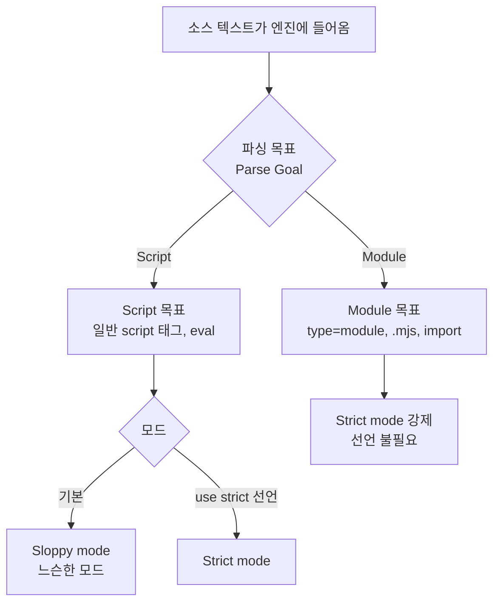

<Callout type="info">
  **이번 문서의 목표:** 이 파일을 다 읽으면 내가 쓴 코드가 **어떤 목표·어떤 모드로 해석되고 있는지 스스로 판정**하고, strict mode가 바꾸는 규칙을 근거와 함께 설명할 수 있게 된다.
</Callout>

## 왜 "모드"라는 게 존재하는가

JavaScript는 1995년에 열흘 만에 설계되었다는 유명한 일화가 있는 언어입니다. 급하게 만들어진 만큼 위험한 설계 결정이 여럿 들어갔고, 그중 상당수는 **되돌릴 수 없었습니다.** 웹의 대원칙 때문입니다.

<Callout type="info">
  **웹의 제1원칙 — "웹을 깨지 마라"**(Don't break the web). 20년 전에 만든 페이지도 오늘 브라우저에서 동작해야 한다. 그래서 언어의 기존 동작은 함부로 바꿀 수 없다.
</Callout>

이 원칙 아래에서 언어를 개선하려면 방법은 하나뿐입니다 — **새 규칙을 원하는 코드만 자발적으로 신청하게 하는 것.** 그렇게 도입된 것이 ES5의 **strict mode**(스트릭트 모드, 엄격 모드)입니다.

> **쉽게 말하면:** strict mode는 **"저는 옛날 관대한 규칙 대신 엄격한 규칙으로 채점받겠습니다"라고 손을 드는 선언**입니다. 손을 든 코드에서만 위험한 문법이 에러가 됩니다.

## 1. 두 개의 축 — 목표(goal)와 모드(mode)

여기서 초보자가 가장 많이 헷갈립니다. **엄격/비엄격**과 **script/module**은 서로 다른 축입니다.



- **파싱 목표**(parse goal, 파스 골): 엔진이 소스 텍스트를 **어떤 문법 규칙으로 읽을 것인가**. `Script`와 `Module` 두 가지가 있습니다.
- **모드**(mode): 읽은 코드를 **얼마나 엄격하게 채점할 것인가**. `sloppy`(느슨한 모드, 비엄격 모드)와 `strict` 두 가지입니다.

핵심 관계는 이렇습니다.

| 코드가 놓인 자리 | 파싱 목표 | 기본 모드 |
|------------------|-----------|-----------|
| 일반 스크립트 파일 | Script | sloppy – 직접 선언해야 strict |
| 모듈 파일 – type이 module이거나 확장자가 .mjs | Module | **strict 강제** |
| class 본문 안 | 상속 | **strict 강제** |
| `eval`로 실행한 문자열 | Script | 호출 위치의 모드를 따름 |

<Callout type="warning">
  **자주 틀리는 점:** "요즘은 다 strict니까 신경 안 써도 된다"는 절반만 맞습니다. 모듈과 class 본문은 자동으로 strict이지만, **HTML의 일반 script 태그나 브라우저 콘솔에 붙여 넣는 코드는 여전히 sloppy**입니다. 콘솔에서 되던 코드가 모듈에서 에러가 나는 흔한 이유가 바로 이것입니다.
</Callout>

### 선언 방법과 적용 범위

`"use strict"`는 문자열 하나를 그냥 적어두는 것처럼 보이지만, 명세가 인정하는 **지시 서두**(directive prologue, 디렉티브 프롤로그)라는 특별한 자리입니다. 규칙이 까다롭습니다.

```js
// (1) 파일 전체에 적용 — 반드시 파일의 맨 첫 줄
"use strict";
let x = 1;

// (2) 함수 하나에만 적용 — 함수 본문의 맨 첫 줄
function 엄격함수() {
  "use strict";
  // 여기만 엄격
}

// (3) 실패하는 경우들
function 실패1() {
  let a = 1;
  "use strict";   // 첫 줄이 아니라서 그냥 문자열일 뿐, 아무 효과 없음
}

function 실패2(a = 1) {
  "use strict";   // SyntaxError — 기본값 매개변수가 있는 함수에는 쓸 수 없다
}
```

(3)의 두 번째가 특히 중요합니다. **기본값 매개변수·레스트 파라미터·구조 분해 매개변수를 가진 함수 안에서는 `"use strict"`를 쓸 수 없습니다.** 매개변수 기본값이 평가되는 시점의 모드가 모호해지기 때문에 명세가 아예 문법 오류로 막았습니다. 이런 함수를 엄격하게 만들려면 **파일이나 바깥 스코프 전체를 strict로** 만들어야 합니다.

## 2. strict mode가 바꾸는 규칙들 — 하나씩 재현

말로 나열하면 안 외워집니다. 직접 실행해 확인합시다.

### (1) 암묵적 전역 변수 금지 — 가장 중요한 하나

sloppy mode에서 선언 없이 변수에 값을 대입하면, 엔진은 **전역 객체에 프로퍼티를 몰래 만들어 줍니다.** 오타 하나가 전역 오염이 되는 설계입니다.

<CodePlayground
  template="vanilla"
  activeFile="/index.js"
  showConsole
  label="암묵적 전역이 만들어지는 순간과, strict mode가 막아주는 순간"
  files={{
    '/index.js': `// ── 느슨한 모드: 오타가 전역 변수를 만든다 ──────────
function 사용자저장_느슨() {
  사용자이룸 = "철수";   // 선언 없음! 오타로 '이름'을 '이룸'이라 씀
  return "저장 완료";
}
console.log(사용자저장_느슨());
console.log("전역이 오염됐나?", typeof 사용자이룸, "-", globalThis.사용자이룸);
// 에러 하나 없이 조용히 전역 프로퍼티가 생겼다.

// ── 엄격 모드: 같은 코드가 즉시 에러 ────────────────
function 사용자저장_엄격() {
  "use strict";
  사용자나이 = 20;       // 선언 없는 대입
  return "저장 완료";
}
try {
  사용자저장_엄격();
} catch (e) {
  console.log("엄격 모드 결과:", e.name, "-", e.message);
}

// ── 실험해 보기 ───────────────────────────────
// (a) 사용자저장_엄격 안의 "use strict"; 줄을 지우면 에러가 사라집니다.
// (b) 사용자저장_엄격 안에서 let 사용자나이 = 20; 으로 바꾸면 통과합니다.
// (c) 파일 맨 위(1번째 줄)에 "use strict"; 를 넣으면
//     느슨한 버전까지 한꺼번에 에러가 됩니다. 적용 범위를 확인하세요.`,
  }}
/>

**결과 해석**: 느슨한 모드에서는 `사용자이룸`이라는 오타가 **에러 없이** 전역 프로퍼티로 만들어집니다. 프로그램은 계속 돌지만 원하는 값은 어디에도 저장되지 않았습니다. 이런 버그는 몇 시간을 잡아먹습니다. strict mode는 같은 상황을 `ReferenceError`로 **즉시** 드러냅니다. **버그를 나중에 이상한 증상으로 만나는 대신, 지금 정확한 위치에서 만나게 해주는 것** — 이것이 strict mode의 본질적 가치입니다.

### (2) 조용한 실패를 에러로 승격

sloppy mode에는 "실패했는데 아무 말 안 하는" 상황이 여럿 있습니다. strict mode는 전부 `TypeError`로 바꿉니다.

<CodePlayground
  template="vanilla"
  activeFile="/index.js"
  showConsole
  label="조용한 실패 vs TypeError — 네 가지 상황 비교"
  files={{
    '/index.js': `// 같은 동작을 두 모드에서 각각 실행해 결과를 비교한다
function 느슨하게실행(라벨, 동작) {
  try {
    동작();
    console.log("[느슨] " + 라벨 + ": 에러 없음 (조용한 실패)");
  } catch (e) {
    console.log("[느슨] " + 라벨 + ": " + e.name);
  }
}

function 엄격하게실행(라벨, 동작) {
  "use strict";
  try {
    동작();
    console.log("[엄격] " + 라벨 + ": 에러 없음");
  } catch (e) {
    console.log("[엄격] " + 라벨 + ": " + e.name + " - " + e.message);
  }
}

// 동작 1: 읽기 전용 프로퍼티에 대입
const 얼린객체 = Object.freeze({ 값: 1 });
const 동작1_느슨 = function () { 얼린객체.값 = 999; };
const 동작1_엄격 = function () { "use strict"; 얼린객체.값 = 999; };

// 동작 2: 확장 불가 객체에 새 프로퍼티 추가
const 봉인객체 = Object.preventExtensions({ 기존: 1 });
const 동작2_느슨 = function () { 봉인객체.새프로퍼티 = 1; };
const 동작2_엄격 = function () { "use strict"; 봉인객체.새프로퍼티 = 1; };

// 동작 3: 삭제할 수 없는 프로퍼티 삭제
const 동작3_느슨 = function () { delete Object.prototype; };
const 동작3_엄격 = function () { "use strict"; delete Object.prototype; };

느슨하게실행("freeze된 값 대입", 동작1_느슨);
엄격하게실행("freeze된 값 대입", 동작1_엄격);
느슨하게실행("확장 불가 객체에 추가", 동작2_느슨);
엄격하게실행("확장 불가 객체에 추가", 동작2_엄격);
느슨하게실행("삭제 불가 프로퍼티 삭제", 동작3_느슨);
엄격하게실행("삭제 불가 프로퍼티 삭제", 동작3_엄격);

console.log("최종 확인 — 얼린객체.값:", 얼린객체.값);

// 실험: Object.freeze를 Object.seal로 바꾸면 어떤 동작이 통과할까요?
// seal은 추가·삭제만 막고 기존 값 수정은 허용합니다 (7편에서 상세히).`,
  }}
/>

**결과 해석**: 느슨한 모드에서는 세 동작 모두 **에러 없이 통과**하지만 실제로는 아무것도 바뀌지 않았습니다. 코드를 쓴 사람은 성공했다고 믿습니다. 엄격 모드는 전부 `TypeError`로 알려줍니다. 마지막 줄에서 `얼린객체.값`이 여전히 1인 것을 확인하면, **느슨한 모드가 얼마나 위험한 침묵을 하는지** 명확해집니다.

### (3) 일반 함수 호출에서 this가 undefined

이것은 12편에서 통째로 다룰 주제이지만, 모드에 따라 달라지는 대표적 규칙이라 여기서 짚습니다.

```js
function 확인() {
  return this;
}

// sloppy mode: this가 undefined이면 전역 객체로 바꿔치기된다 (this substitution)
확인();              // globalThis

// strict mode: 바꿔치기하지 않는다
function 확인엄격() {
  "use strict";
  return this;
}
확인엄격();          // undefined
```

sloppy mode의 이 **바꿔치기**(this substitution) 규칙 때문에, 메서드를 잘못 떼어내 호출했을 때 에러가 나는 대신 **전역 객체를 조용히 오염시키는** 사고가 벌어집니다. strict mode에서는 `undefined.프로퍼티` 접근이 되어 `TypeError`로 즉시 드러납니다.

### (4) 그 밖의 규칙들

| 규칙 | sloppy mode | strict mode |
|------|-------------|-------------|
| 매개변수 이름 중복 | 허용 – 뒤엣것이 이김 | SyntaxError |
| 객체 리터럴 키 중복 | 허용 – 뒤엣것이 이김 | 허용 – ES2015에서 완화됨 |
| 8진수 리터럴 `010` | 8로 해석 | SyntaxError – `0o10`을 쓸 것 |
| `with` 문 | 허용 | SyntaxError |
| `arguments`와 매개변수 연동 | 서로 값이 연동됨 | 연동 끊김 – 독립적 |
| `implements`, `interface`, `package` 등 | 변수명 가능 | 예약어 – 사용 불가 |
| 함수 선언문을 블록 안에 | 동작이 엔진마다 달랐음 | 블록 스코프로 명확히 규정 |

**`with` 문**은 객체의 프로퍼티를 스코프에 직접 펼쳐 넣는 문법인데, 스코프 결정을 **실행 시점에야 알 수 있게** 만들어 최적화를 불가능하게 하고 코드 의미를 모호하게 합니다. strict mode에서 완전히 금지된 유일한 문(statement)입니다.

**`arguments` 연동**도 놀라운 규칙입니다. sloppy mode에서는 매개변수 `a`의 값을 바꾸면 `arguments[0]`도 함께 바뀌고 그 반대도 성립합니다. strict mode에서는 이 연결이 끊겨 각자 독립적으로 동작합니다. 8편에서 다시 확인합니다.

## 3. Script와 Module — 목표가 다르면 무엇이 달라지나

모드와 별개로, **파싱 목표**가 무엇이냐에 따라서도 규칙이 달라집니다.

| 항목 | Script 목표 | Module 목표 |
|------|-------------|-------------|
| 기본 모드 | sloppy | strict 강제 |
| `import`·`export` | 문법 오류 | 사용 가능 |
| 최상위 `this` | `globalThis` | `undefined` |
| 최상위 `var`·함수 선언 | 전역 객체의 프로퍼티가 됨 | 모듈 스코프에만 존재 |
| 최상위 `await` | 불가 | 가능 – top-level await |
| 파일 간 이름 공유 | 전역 스코프를 통해 공유됨 | 명시적 `import`로만 |
| 실행 시점 | 만나는 즉시 | 항상 지연 – defer와 유사 |

### 전역의 정체 — 최상위 var가 만드는 것

Script 목표에서 최상위에 `var`나 함수 선언을 쓰면, 그 이름이 **전역 객체의 프로퍼티가 됩니다.** 반면 `let`·`const`·`class`로 선언하면 전역 스코프에는 들어가지만 **전역 객체의 프로퍼티는 되지 않습니다.**

<CodePlayground
  template="vanilla"
  activeFile="/index.js"
  showConsole
  label="var / let / const가 전역 객체에 남기는 흔적 비교"
  files={{
    '/index.js': `// 이 코드는 Script 목표(일반 스크립트)에서 실행된다고 가정합니다.
var var변수 = "var로 선언";
let let변수 = "let으로 선언";
const const변수 = "const로 선언";
function 함수선언() { return "함수 선언문"; }

console.log("--- 전역 객체에 프로퍼티로 존재하는가? ---");
console.log("var변수:", "var변수" in globalThis);
console.log("let변수:", "let변수" in globalThis);
console.log("const변수:", "const변수" in globalThis);
console.log("함수선언:", "함수선언" in globalThis);

console.log("--- 그래도 이름으로는 전부 접근 가능하다 ---");
console.log(var변수, "/", let변수, "/", const변수, "/", typeof 함수선언);

console.log("--- 전역 객체의 표준 이름은 globalThis 하나 ---");
console.log("globalThis 타입:", typeof globalThis);

// 전역 객체가 이미 갖고 있는 표준 프로퍼티들
console.log("--- 원래부터 전역에 있던 것들 ---");
console.log("undefined:", typeof undefined, "/ NaN:", typeof NaN);
console.log("parseInt:", typeof parseInt, "/ Infinity:", typeof Infinity);

// 실험해 보기:
// (a) var변수 대신 var undefined = 1; 을 시도해 보세요.
//     전역 undefined는 writable이 false라 조용히 무시되거나 에러가 납니다.
// (b) 이 코드를 모듈로 실행하면 var변수조차 globalThis에 없습니다.
//     모듈 최상위는 전역이 아니라 '모듈 스코프'이기 때문입니다.`,
  }}
/>

**결과 해석**: `var`와 함수 선언문만 전역 객체에 흔적을 남깁니다. 이것은 ES6가 `let`·`const`를 설계할 때 **의도적으로 끊어낸 연결**입니다. 전역 객체가 무한정 오염되면 라이브러리 간 이름 충돌이 생기고, 최적화도 어려워지기 때문입니다.

`globalThis`는 ES2020에 추가된 **전역 객체를 가리키는 표준 이름**입니다. 그전에는 브라우저에서 `window`, 워커에서 `self`, Node.js에서 `global`로 이름이 제각각이라 환경 감지 코드가 필요했습니다.

<Callout type="warning">
  **자주 틀리는 점:** "모듈이면 무조건 안전하다"고 생각해 전역 오염을 잊는 경우가 있습니다. 모듈 안에서도 선언 없이 대입하면 — strict가 강제되므로 에러가 나서 다행이지만 — `globalThis.무언가 = 값`처럼 **명시적으로 전역 객체를 건드리는 코드**는 여전히 가능합니다. 모듈이 막아주는 것은 실수이지 의도가 아닙니다.
</Callout>

## 4. 실전 판정 체크리스트

내 코드가 지금 어떤 상태인지 세 가지만 확인하면 됩니다.

<Steps>

### 1단계 — 이 파일은 모듈인가?

`import`나 `export`가 있거나, HTML에서 `type="module"`로 불러오거나, 확장자가 `.mjs`라면 모듈입니다. **모듈이면 strict가 이미 켜져 있고 최상위 `this`는 `undefined`입니다.**

### 2단계 — 모듈이 아니라면 첫 줄에 선언이 있는가?

파일의 진짜 첫 줄에 `"use strict";`가 있어야 파일 전체가 엄격해집니다. 주석은 앞에 있어도 됩니다.

### 3단계 — 지금 이 코드 조각이 class 본문 안인가?

`class` 본문은 선언 여부와 무관하게 항상 strict입니다.

</Steps>

빠르게 확인하는 코드도 있습니다. 아래 한 줄이 `true`면 지금 위치가 strict mode입니다.

```js
// 느슨한 모드에서만 this가 전역 객체로 바꿔치기된다는 성질을 이용한 판정
const 지금엄격한가 = (function () { return this === undefined; })();
```

## 핵심 정리

- **파싱 목표**(Script/Module)와 **모드**(sloppy/strict)는 서로 다른 축이다. 모듈과 class 본문은 자동으로 strict이고, 일반 스크립트와 콘솔은 기본이 sloppy다.
- `"use strict"`는 **파일이나 함수 본문의 맨 첫 줄**에만 효력이 있으며, 기본값 매개변수를 가진 함수 안에서는 문법 오류다.
- strict mode의 핵심 효과는 **암묵적 전역 금지**와 **조용한 실패를 TypeError로 승격**하는 것이다. 버그를 나중의 이상한 증상 대신 지금 정확한 위치에서 만나게 해준다.
- strict mode에서는 일반 함수 호출의 `this`가 전역 객체로 바꿔치기되지 않고 `undefined`로 남는다.
- Script 목표에서 최상위 `var`와 함수 선언은 **전역 객체의 프로퍼티가 되지만**, `let`·`const`·`class`는 되지 않는다. 전역 객체의 표준 이름은 `globalThis`다.

## 마무리 복습

<Quiz
  questionNumber={1}
  question="다음 중 별도의 선언 없이도 항상 strict mode로 동작하는 것만 모은 것은?"
  options={['일반 script 태그로 불러온 파일, 브라우저 콘솔 입력', 'ES 모듈 파일, class 본문', 'eval로 실행한 모든 문자열, 화살표 함수', '함수 선언문 내부, 객체 메서드 내부']}
  correctAnswer={2}
  explanation="ES 모듈과 class 본문은 선언 여부와 무관하게 항상 strict다. 일반 스크립트와 콘솔은 기본이 sloppy이며, eval은 호출 위치의 모드를 따르고, 함수나 화살표 함수 자체가 strict를 강제하지는 않는다."
  optionExplanations={['둘 다 기본이 느슨한 모드다', '정답 — 둘 다 strict가 강제된다', 'eval은 주변 모드를 따르고 화살표 함수는 모드와 무관하다', '함수 종류만으로는 모드가 결정되지 않는다']}
/>

<Quiz
  questionNumber={2}
  question="use strict 지시문이 효력을 갖지 못하는 경우로 옳은 것은?"
  options={['파일의 첫 줄에 주석이 있고 그 아래에 있을 때', '함수 본문의 첫 줄에 있을 때', '함수 본문 안에서 다른 문장 뒤에 있을 때', '모듈 파일의 첫 줄에 있을 때']}
  correctAnswer={3}
  explanation="지시 서두는 반드시 다른 실행 문장보다 앞서야 한다. 다른 문장 뒤에 나온 use strict는 평범한 문자열 표현식일 뿐 아무 효과가 없다. 주석은 문장이 아니므로 앞에 있어도 무방하다."
  optionExplanations={['주석은 지시 서두 판정에 영향을 주지 않는다', '함수 본문 첫 줄은 유효한 위치다', '정답 — 다른 문장 뒤에서는 단순 문자열이 된다', '모듈은 이미 strict이므로 무의미할 뿐 오류는 아니다']}
/>

<Quiz
  questionNumber={3}
  question="느슨한 모드에서 함수 안에 선언 없이 변수에 값을 대입하면 어떤 일이 일어나는가?"
  options={['ReferenceError가 발생한다', '전역 객체의 프로퍼티가 조용히 생성된다', '함수 지역 변수로 자동 선언된다', '해당 문장이 무시되고 아무 일도 일어나지 않는다']}
  correctAnswer={2}
  explanation="느슨한 모드는 선언 없는 대입을 전역 객체의 프로퍼티 생성으로 처리한다. 오타 하나가 전역 오염이 되며 에러가 나지 않아 발견이 늦어진다. strict mode는 같은 상황을 ReferenceError로 즉시 알린다."
  optionExplanations={['ReferenceError는 strict mode에서의 동작이다', '정답 — 암묵적 전역이 만들어진다', '지역 변수가 아니라 전역 프로퍼티가 된다', '무시되지 않고 실제로 값이 저장된다']}
/>

<Quiz
  questionNumber={4}
  question="Object.freeze로 동결한 객체의 프로퍼티에 값을 대입했을 때, 두 모드의 동작 차이로 옳은 것은?"
  options={['느슨한 모드는 값이 실제로 바뀌고, 엄격 모드는 바뀌지 않는다', '두 모드 모두 값이 바뀌지 않지만, 엄격 모드에서만 TypeError가 발생한다', '두 모드 모두 TypeError가 발생한다', '느슨한 모드에서만 TypeError가 발생한다']}
  correctAnswer={2}
  explanation="동결된 객체에 대한 대입은 어느 모드에서도 성공하지 않는다. 차이는 실패를 알려주는지 여부다. 느슨한 모드는 조용히 무시하고, 엄격 모드는 TypeError를 던진다."
  optionExplanations={['느슨한 모드에서도 값은 바뀌지 않는다', '정답 — 결과는 같고 알림 여부만 다르다', '느슨한 모드에서는 에러가 나지 않는다', '반대로 서술되어 있다']}
/>

<Quiz
  questionNumber={5}
  question="일반 함수를 그냥 호출했을 때 함수 안의 this 값은?"
  options={['두 모드 모두 전역 객체다', '두 모드 모두 undefined다', '느슨한 모드는 전역 객체, 엄격 모드는 undefined다', '느슨한 모드는 undefined, 엄격 모드는 전역 객체다']}
  correctAnswer={3}
  explanation="느슨한 모드에는 this가 undefined나 null일 때 전역 객체로 바꿔치기하는 규칙이 있다. 엄격 모드는 이 바꿔치기를 하지 않으므로 undefined가 그대로 남고, 그 덕분에 바인딩 실수가 TypeError로 드러난다."
  optionExplanations={['엄격 모드에서는 전역 객체가 아니다', '느슨한 모드에서는 전역 객체가 된다', '정답 — this 바꿔치기 규칙의 유무 차이다', '설명이 반대다']}
/>

<Quiz
  questionNumber={6}
  question="Script 목표에서 최상위에 선언했을 때 전역 객체의 프로퍼티가 되는 것만 모은 것은?"
  options={['var 변수와 함수 선언문', 'let과 const 변수', 'class 선언', 'let, const, class 전부']}
  correctAnswer={1}
  explanation="var 선언과 함수 선언문은 전역 객체의 프로퍼티가 된다. ES6가 도입한 let, const, class는 전역 스코프에는 등록되지만 전역 객체의 프로퍼티는 되지 않도록 의도적으로 설계되었다."
  optionExplanations={['정답 — 예전부터 있던 두 선언만 전역 객체에 흔적을 남긴다', 'let과 const는 전역 객체의 프로퍼티가 되지 않는다', 'class도 마찬가지로 전역 객체에 들어가지 않는다', '셋 다 전역 객체의 프로퍼티가 되지 않는다']}
/>

<Quiz
  questionNumber={7}
  question="ES 모듈과 일반 스크립트의 차이로 옳지 않은 것은?"
  options={['모듈의 최상위 this는 undefined이고 스크립트의 최상위 this는 전역 객체다', '모듈에서는 최상위 await를 쓸 수 있다', '모듈은 별도 선언 없이도 strict mode다', '모듈에서도 최상위 var는 전역 객체의 프로퍼티가 된다']}
  correctAnswer={4}
  explanation="모듈의 최상위는 전역 스코프가 아니라 모듈 스코프이므로, var로 선언해도 전역 객체의 프로퍼티가 되지 않는다. 나머지 세 설명은 모두 옳다."
  optionExplanations={['모듈 최상위 this는 undefined가 맞다', '최상위 await는 모듈의 기능이다', '모듈은 strict가 강제된다', '정답(틀린 설명) — 모듈 최상위 var는 모듈 스코프에만 존재한다']}
/>

<Quiz
  questionNumber={8}
  question="strict mode에서 문법 오류가 되는 것으로 알맞은 것은?"
  options={['with 문 사용과 8진수 리터럴 010 표기', '화살표 함수 사용', 'const 재대입 시도', 'try와 catch 사용']}
  correctAnswer={1}
  explanation="with 문은 스코프 결정을 실행 시점까지 미뤄 최적화와 가독성을 해치므로 strict mode에서 금지되며, 앞에 0을 붙인 옛 8진수 표기도 금지되어 0o 접두사를 써야 한다. const 재대입은 문법 오류가 아니라 실행 시점의 TypeError다."
  optionExplanations={['정답 — 둘 다 SyntaxError가 된다', '화살표 함수는 모드와 무관하게 정상 문법이다', '재대입은 실행 시점 TypeError이지 문법 오류가 아니다', '예외 처리 문법은 제한되지 않는다']}
/>

## 참고 자료

- [MDN – Strict mode](https://developer.mozilla.org/en-US/docs/Web/JavaScript/Reference/Strict_mode)
- [MDN – JavaScript modules](https://developer.mozilla.org/en-US/docs/Web/JavaScript/Guide/Modules)
- [ECMAScript Language Specification – 최신 명세 본문](https://262.ecma-international.org/)
