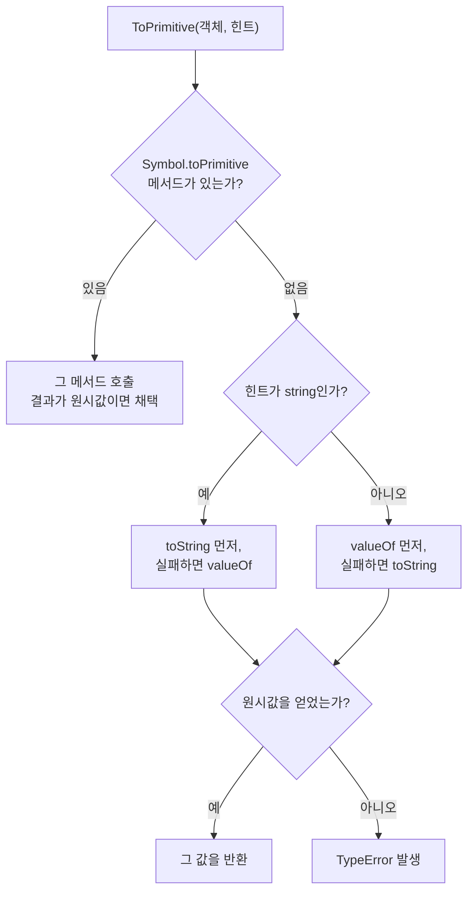

<Callout type="info">
  **이번 문서의 목표:** 이 파일을 다 읽으면 `[] + {}`, `1 + "2"`, `"5" - 3` 같은 표현식의 결과를 **외우지 않고 명세 알고리즘으로 유도**할 수 있게 된다.
</Callout>

## 왜 강제 변환을 파고들어야 하는가

JavaScript는 **동적 타입 언어**(dynamically typed language)입니다. 변수에 타입을 미리 못 박지 않고, 값이 실행 중에 필요한 타입으로 **알아서 바뀝니다.** 이 자동 변환을 **강제 변환**(coercion, 코어션) 또는 **타입 캐스팅**(type casting)이라고 부릅니다.

`coerce`는 "강제로 시키다"라는 뜻입니다. 개발자가 시키지 않아도 엔진이 강제로 타입을 바꾼다는 어감입니다.

문제는 이 자동 변환이 **직관과 자주 어긋난다**는 점입니다. 유명한 사례들을 보면 언어를 원망하고 싶어집니다.

```js
1 + "2"        // "12"    — 문자열
"5" - 3        // 2       — 숫자
[] + {}        // "[object Object]"
[] + []        // ""      — 빈 문자열
{} + []        // 문맥에 따라 0 또는 "[object Object]"
"5" * "2"      // 10
null + 1       // 1
undefined + 1  // NaN
```

여기서 이 편의 태도를 분명히 합니다. **이것들은 외울 목록이 아니라, 하나의 알고리즘에서 유도되는 결과입니다.** 알고리즘 세 개만 익히면 전부 계산할 수 있습니다. 그 세 개가 `ToPrimitive`, `ToNumber`, `ToString`입니다.

> **쉽게 말하면:** 강제 변환은 마술이 아니라 **엔진이 따라가는 순서도**입니다. 순서도를 손에 쥐면 결과가 예측 가능해집니다.

## 1. 명시적 변환 vs 암묵적 변환

### 두 가지를 먼저 구분

- **명시적 변환**(explicit coercion): 개발자가 눈에 보이게 지시합니다. `Number(x)`, `String(x)`, `Boolean(x)`, `parseInt(x)`.
- **암묵적 변환**(implicit coercion): 연산자가 뒤에서 몰래 수행합니다. `x + ""`, `+x`, `!!x`, `x == y`.

> **비유:** 명시적 변환은 **환전소에 가서 "달러로 바꿔주세요"라고 말하는 것**이고, 암묵적 변환은 **자판기가 알아서 지폐를 동전으로 바꿔주는 것**입니다. 후자가 편하지만, 자판기가 어떤 환율을 쓰는지 모르면 손해를 봅니다.

암묵적 변환 자체가 나쁜 것은 아닙니다. `if (배열.length)`처럼 관용적이고 읽기 쉬운 코드도 많습니다. 나쁜 것은 **규칙을 모른 채 쓰는 것**입니다.

## 2. ToPrimitive — 모든 혼란의 출발점

### 왜 이 연산이 필요한가

`+`, `-`, `<` 같은 연산자는 **객체를 직접 다루지 못합니다.** 숫자나 문자열 같은 원시값만 계산할 수 있습니다. 그래서 객체가 피연산자로 오면, 엔진은 먼저 **그 객체를 원시값 하나로 납작하게 만드는 절차**를 밟습니다. 이 절차가 추상 연산 `ToPrimitive`입니다.

> **비유:** 객체는 **여러 서류가 든 서류철**이고, 연산자는 **한 장짜리 요약본만 받는 창구**입니다. `ToPrimitive`는 서류철을 한 장으로 요약해 주는 담당자입니다. 요약 방식은 창구가 "숫자 요약본을 원한다"고 했는지 "문자 요약본을 원한다"고 했는지에 따라 달라집니다.

### 알고리즘 — 힌트와 두 메서드

`ToPrimitive(입력, 힌트)`는 두 번째 인자로 **힌트**(hint, 어떤 종류의 원시값을 원하는지)를 받습니다. 힌트는 세 가지입니다.

| 힌트 | 언제 쓰이는가 | 메서드 시도 순서 |
|------|---------------|------------------|
| `"number"` | 산술 연산, 비교 연산 | `valueOf` → `toString` |
| `"string"` | 문자열 문맥 – 템플릿, 프로퍼티 키 | `toString` → `valueOf` |
| `"default"` | `+` 연산자, `==` 비교 | Date 외에는 `"number"`와 동일 |

동작 순서를 그림으로 정리하면 이렇습니다.



"실패"란 메서드가 없거나, 호출했는데 **객체를 반환한 경우**를 뜻합니다. 두 메서드가 모두 객체를 반환하면 변환할 방법이 없으므로 `TypeError`가 납니다.

### 기본 객체들의 기본 응답

대부분의 객체는 `Object.prototype`에서 물려받은 기본 구현을 씁니다.

| 값 | `valueOf()` 결과 | `toString()` 결과 |
|----|------------------|-------------------|
| `{}` | 자기 자신 – 객체 | `"[object Object]"` |
| `[]` | 자기 자신 – 객체 | `""` – 빈 문자열 |
| `[1,2]` | 자기 자신 – 객체 | `"1,2"` |
| `[5]` | 자기 자신 – 객체 | `"5"` |
| `new Date()` | 자기 자신 – 객체 | 사람이 읽는 날짜 문자열 |

여기서 결정적인 사실이 나옵니다. **일반 객체와 배열의 `valueOf`는 자기 자신, 곧 객체를 반환합니다.** 즉 "실패"입니다. 그래서 힌트가 무엇이든 결국 `toString`으로 넘어가고, **객체는 사실상 언제나 문자열이 됩니다.**

배열의 `toString`은 특이합니다. 내부적으로 `join(",")`을 호출하므로 `[]`는 `""`, `[5]`는 `"5"`, `[1,2]`는 `"1,2"`가 됩니다. 이 사실이 뒤에서 나올 기괴한 결과들의 절반을 설명합니다.

### 실험 — 변환 과정을 눈으로 추적하기

<CodePlayground
  template="vanilla"
  activeFile="/index.js"
  showConsole
  label="ToPrimitive가 어떤 메서드를 어떤 순서로 부르는지 직접 관찰"
  files={{
    '/index.js': `// valueOf와 toString에 로그를 심어, 호출 순서를 눈으로 본다
const 추적객체 = {
  valueOf: function () {
    console.log("   valueOf 호출됨");
    return 42;
  },
  toString: function () {
    console.log("   toString 호출됨");
    return "나는문자열";
  }
};

console.log("[1] 산술 연산 (힌트 number):");
console.log("   결과:", 추적객체 * 1);

console.log("[2] 문자열 문맥 (힌트 string):");
console.log("   결과:", String(추적객체));

console.log("[3] 더하기 연산 (힌트 default):");
console.log("   결과:", 추적객체 + "");

console.log("[4] 템플릿 문맥 (힌트 string):");
console.log("   결과:", ["앞", 추적객체, "뒤"].join("-"));

// ── Symbol.toPrimitive로 전부 가로채기 ──────────────
const 가로채기객체 = {
  valueOf: function () { return 100; },
  toString: function () { return "백"; },
  [Symbol.toPrimitive]: function (힌트) {
    console.log("   Symbol.toPrimitive 호출 — 힌트:", 힌트);
    if (힌트 === "number") return 999;
    if (힌트 === "string") return "구백구십구";
    return "기본값응답";
  }
};

console.log("[5] Symbol.toPrimitive가 있으면 valueOf/toString은 무시된다:");
console.log("   숫자 문맥:", 가로채기객체 * 1);
console.log("   문자 문맥:", String(가로채기객체));
console.log("   default 문맥:", 가로채기객체 + "");

// ── 실험해 보기 ────────────────────────────────
// (a) 추적객체의 valueOf가 객체를 반환하도록 return {}; 로 바꿔보세요.
//     '실패'로 처리되어 toString으로 넘어가는 것을 확인할 수 있습니다.
// (b) valueOf와 toString을 둘 다 객체 반환으로 바꾸면 TypeError가 납니다.
// (c) [1]의 * 1 을 - 0, / 1, > 0 등으로 바꿔도 힌트가 number임을 확인하세요.`,
  }}
/>

**결과 해석**: `추적객체 * 1`은 `valueOf`를 먼저 부르고, `String(추적객체)`는 `toString`을 먼저 부릅니다. 힌트에 따라 순서가 뒤집히는 것이 눈으로 확인됩니다. 그리고 `Symbol.toPrimitive`가 있으면 나머지 둘은 아예 호출되지 않습니다 — 이것이 **웰노운 심볼**(well-known symbol, 언어가 미리 정해둔 특수 키)의 힘이며 16편에서 자세히 다룹니다.

## 3. ToNumber — 숫자로 만드는 규칙

### 원시값별 변환표

| 입력 | `Number(입력)` 결과 | 이유 |
|------|---------------------|------|
| `undefined` | `NaN` | 값이 정해지지 않았으므로 숫자로 볼 수 없음 |
| `null` | `0` | 역사적 결정 – 의도적 비움을 0으로 봄 |
| `true` / `false` | `1` / `0` | 참을 1, 거짓을 0으로 |
| `""` – 빈 문자열 | `0` | 공백만 있는 문자열도 0 |
| `"  42  "` | `42` | 앞뒤 공백은 제거 후 파싱 |
| `"42abc"` | `NaN` | 전체가 숫자여야 함 – 부분 파싱 안 함 |
| `"0x1F"` | `31` | 16진수 표기 인식 |
| `Symbol()` | `TypeError` | 심볼은 숫자로 변환 불가 |
| `10n` – BigInt | `10` | 값이 안전 범위면 변환 |

**`null`이 0이고 `undefined`가 `NaN`인 비대칭**이 이상해 보이지만, 3편에서 본 의미 차이와 연결하면 납득됩니다. `null`은 "의도적으로 비움"이라 0이라는 값을 부여할 여지가 있고, `undefined`는 "정해지지 않음"이라 어떤 숫자로도 정할 수 없다는 것입니다.

<Callout type="warning">
  **자주 틀리는 점:** `Number("42abc")`는 `NaN`인데 `parseInt("42abc")`는 `42`입니다. `Number`는 **문자열 전체**가 유효한 숫자여야 하고, `parseInt`는 **앞에서부터 읽을 수 있는 만큼만** 읽습니다. 반대로 `parseInt("")`는 `NaN`인데 `Number("")`는 `0`입니다. 둘은 다른 도구입니다. 사용자 입력 검증에 `parseInt`를 쓰면 `"12개"` 같은 값이 통과합니다.
</Callout>

### 객체가 입력이면

객체는 먼저 `ToPrimitive(객체, "number")`로 원시값이 된 뒤, 그 원시값에 다시 `ToNumber`가 적용됩니다. **2단 변환**입니다.

```text
Number([])      → ToPrimitive([], number)
                → valueOf 실패 → toString → ""
                → ToNumber("") → 0

Number([5])     → toString → "5" → ToNumber("5") → 5

Number([1,2])   → toString → "1,2" → ToNumber("1,2") → NaN

Number({})      → toString → "[object Object]" → NaN
```

`Number([])`가 `0`이라는 유명한 결과가 이렇게 유도됩니다. 신비할 것이 하나도 없습니다.

## 4. 연산자별 알고리즘 — 실제 문제 풀이

### `+` 연산자 — 유일하게 특별한 연산자

`+`는 **덧셈과 문자열 연결을 겸하는** 유일한 연산자입니다. 명세의 알고리즘은 이렇습니다.

<Steps>

### 1단계 — 양쪽을 원시값으로

두 피연산자 각각에 `ToPrimitive`를 힌트 `"default"`로 적용합니다.

### 2단계 — 한쪽이라도 문자열인가?

둘 중 하나라도 String 타입이면, 양쪽을 `ToString`한 뒤 **이어 붙입니다.**

### 3단계 — 아니면 숫자 덧셈

둘 다 문자열이 아니면 양쪽을 `ToNumber`한 뒤 **더합니다.**

</Steps>

이 세 단계로 앞의 수수께끼를 전부 풀 수 있습니다.

```text
1 + "2"
  1단계: 둘 다 이미 원시값 → 1, "2"
  2단계: "2"가 문자열 → ToString(1) = "1", 이어 붙임
  결과: "12"

[] + {}
  1단계: ToPrimitive([]) = "",  ToPrimitive({}) = "[object Object]"
  2단계: 둘 다 문자열 → 이어 붙임
  결과: "[object Object]"

[] + []
  1단계: "" 와 ""
  2단계: 문자열 → 이어 붙임
  결과: ""

null + 1
  1단계: 둘 다 원시값
  2단계: 문자열 없음 → 3단계로
  3단계: ToNumber(null) = 0, 0 + 1
  결과: 1

undefined + 1
  3단계: ToNumber(undefined) = NaN, NaN + 1
  결과: NaN
```

### 나머지 산술 연산자 — 훨씬 단순하다

`-`, `*`, `/`, `%`, `**`에는 문자열 특례가 없습니다. **무조건 양쪽을 숫자로 만든 뒤 계산**합니다. 그래서 `"5" - 3`은 `2`, `"5" * "2"`는 `10`입니다. **`+`만 이상한 것**이지 나머지는 일관됩니다.

### 실험 — 두 부류의 대비 확인

<CodePlayground
  template="vanilla"
  activeFile="/index.js"
  showConsole
  label="더하기 연산자와 나머지 산술 연산자의 알고리즘 차이 확인"
  files={{
    '/index.js': `// 같은 피연산자 쌍에 + 와 - 를 각각 적용해 대비를 본다
const 쌍목록 = [
  [1, "2"],
  ["5", 3],
  [true, 1],
  [null, 1],
  [undefined, 1],
  [[], {}],
  [[], []],
  [[5], 3],
  [[1, 2], 1],
];

function 표기(v) {
  if (typeof v === "string") return JSON.stringify(v);
  if (Array.isArray(v)) return "[" + v.join(",") + "]";
  if (v !== null && typeof v === "object") return "obj";
  return String(v);
}

console.log("A | B | A + B | A - B");
쌍목록.forEach(function (쌍) {
  const a = 쌍[0];
  const b = 쌍[1];
  console.log(
    표기(a) + " | " + 표기(b) + " | " +
    JSON.stringify(a + b) + " | " + String(a - b)
  );
});

// ── 단항 플러스는 ToNumber 그 자체다 ────────────────
console.log("--- 단항 + 는 Number()와 같다 ---");
console.log("+'42' =", +"42", "/ Number('42') =", Number("42"));
console.log("+'' =", +"", "/ +[] =", +[], "/ +{} =", +{});
console.log("+true =", +true, "/ +null =", +null, "/ +undefined =", +undefined);

// ── 실험해 보기 ────────────────────────────────
// (a) 쌍목록에 [new Date(), 1] 을 추가해 보세요.
//     Date는 힌트 default에서 string처럼 동작하는 유일한 표준 객체입니다.
//     그래서 + 는 문자열 연결, - 는 숫자 계산이 됩니다.
// (b) [{ valueOf: function(){ return 10; } }, 5] 를 추가해 보세요.
//     valueOf를 직접 정의하면 객체도 숫자처럼 더해집니다.`,
  }}
/>

**결과 해석**: `A - B` 열에는 문자열이 하나도 없습니다. 전부 숫자 아니면 `NaN`입니다. 반면 `A + B` 열에는 문자열이 잔뜩 섞여 있습니다. 이 한 장의 표가 "**`+`만 특별하다**"는 사실을 시각적으로 못 박아 줍니다.

Date를 추가하는 실험이 특히 중요합니다. **Date는 힌트 `"default"`를 `"string"`처럼 취급하는 유일한 표준 객체**입니다. `new Date() + 1`이 문자열 연결이 되는 이유이고, 명세가 명시적으로 예외 처리한 부분입니다.

## 5. ToString과 ToBoolean

### ToString — 짧지만 함정이 있다

| 입력 | `String(입력)` 결과 |
|------|---------------------|
| `null` | `"null"` |
| `undefined` | `"undefined"` |
| `123` | `"123"` |
| `-0` | `"0"` – 부호가 사라진다 |
| `NaN` | `"NaN"` |
| `[1,2]` | `"1,2"` |
| `{}` | `"[object Object]"` |
| `Symbol("x")` | `"Symbol(x)"` – 단, 암묵적 변환은 TypeError |

**심볼의 비대칭**을 주의해야 합니다. `String(심볼)`은 동작하지만 `심볼 + ""`는 `TypeError`입니다. 심볼이 실수로 문자열에 섞이는 것을 막으려는 명세의 의도적 설계입니다.

### ToBoolean — 거짓 같은 값 여섯 개

1편에서 알고리즘을 봤으니 여기서는 결론만 굳힙니다. **falsy**(폴시, 거짓 같은 값)는 정확히 여섯 개입니다.

`false`, `0` – `+0`과 `-0` 포함, `""` – 빈 문자열, `null`, `undefined`, `NaN`

여기에 `0n`(BigInt 영)과 `document.all`이라는 특수 사례가 더 있지만, 실무에서는 위 여섯 개만 기억하면 충분합니다. **나머지는 전부 truthy**(트루시, 참 같은 값)이며, 특히 **객체는 예외 없이 참**입니다.

<Callout type="warning">
  **자주 틀리는 점:** `if (값)`으로 "값이 있는가"를 판단하면 `0`과 `""`가 함께 걸러집니다. 사용자가 입력한 숫자 0이나 빈 문자열이 유효한 값인 상황에서 이 코드는 버그입니다. "존재 여부"만 보고 싶다면 `if (값 !== undefined && 값 !== null)` 또는 관용적으로 `if (값 != null)`을 씁니다. `??`(널 병합 연산자)가 `||`보다 안전한 이유도 정확히 이것이며, 6편에서 다룹니다.
</Callout>

## 6. 실무 원칙

알고리즘을 이해했다면, 이제 원칙은 단순해집니다.

1. **비교는 `===`로 한다.** `==`는 `null` 검사(`x == null`)에만 관용적으로 쓴다.
2. **숫자 변환은 `Number` 호출로 명시한다.** 사용자 입력 검증에는 `Number.isFinite(Number(입력))` 같은 조합을 쓴다.
3. **문자열 변환은 템플릿 리터럴이나 `String` 호출로 명시한다.** `x + ""`는 `Symbol`에서 터진다.
4. **불리언 판정은 조건을 명시한다.** `if (배열.length > 0)`처럼 무엇을 보는지 드러낸다.
5. **객체를 산술 연산에 넣지 않는다.** 필요하면 `valueOf`나 `Symbol.toPrimitive`를 직접 정의해 의도를 밝힌다.

## 핵심 정리

- 강제 변환은 마술이 아니라 **`ToPrimitive`, `ToNumber`, `ToString` 세 추상 연산**이 만드는 결정론적 결과다.
- `ToPrimitive`는 힌트에 따라 `valueOf`와 `toString`을 다른 순서로 호출한다. **일반 객체와 배열의 `valueOf`는 자기 자신을 반환해 실패하므로, 결국 `toString` 결과가 쓰인다.**
- `+`는 **양쪽을 원시값으로 만든 뒤 한쪽이라도 문자열이면 연결, 아니면 덧셈**을 한다. 다른 산술 연산자는 무조건 숫자로 변환한다.
- `Number(null)`은 `0`, `Number(undefined)`는 `NaN`이다. `Number`는 전체 문자열을, `parseInt`는 앞부분만 파싱한다.
- falsy는 `false`, `0`, `""`, `null`, `undefined`, `NaN` 여섯 개뿐이며 **객체는 언제나 truthy**다.
- Date는 힌트 `"default"`를 `"string"`처럼 다루는 예외이고, `Symbol.toPrimitive`를 정의하면 변환 규칙 전체를 가로챌 수 있다.

## 마무리 복습

<Quiz
  questionNumber={1}
  question="ToPrimitive 추상 연산에서 힌트가 number일 때 메서드 호출 순서로 옳은 것은?"
  options={['toString을 먼저 호출하고 실패하면 valueOf', 'valueOf를 먼저 호출하고 실패하면 toString', 'Symbol.toPrimitive만 호출하고 나머지는 무시', 'JSON.stringify를 호출한다']}
  correctAnswer={2}
  explanation="힌트가 number이면 valueOf를 먼저 시도하고, 그 결과가 원시값이 아니면 toString을 시도한다. 힌트가 string이면 순서가 반대다. Symbol.toPrimitive가 정의되어 있으면 그것이 최우선으로 쓰인다."
  optionExplanations={['그것은 힌트가 string일 때의 순서다', '정답 — number 힌트는 valueOf 우선이다', 'Symbol.toPrimitive는 있을 때만 쓰이며 없으면 두 메서드를 시도한다', 'JSON 직렬화는 변환 알고리즘과 무관하다']}
/>

<Quiz
  questionNumber={2}
  question="빈 배열과 빈 객체를 더하기 연산자로 연결했을 때 문자열 결과가 나오는 이유로 옳은 것은?"
  options={['배열과 객체의 valueOf가 객체를 반환해 실패하므로 toString 결과가 쓰이고, 문자열이 하나라도 있으면 연결되기 때문', '더하기 연산자는 항상 문자열 연결만 수행하기 때문', '배열은 내부적으로 문자열로 저장되기 때문', '객체는 숫자로 변환할 수 없어 항상 TypeError가 나기 때문']}
  correctAnswer={1}
  explanation="일반 객체와 배열의 valueOf는 자기 자신을 반환해 원시값 추출에 실패한다. 그래서 toString이 쓰여 빈 배열은 빈 문자열, 빈 객체는 object Object 형태의 문자열이 되고, 더하기의 2단계 규칙에 따라 연결된다."
  optionExplanations={['정답 — valueOf 실패 후 toString이 쓰이는 흐름이다', '숫자끼리 더하면 산술 덧셈을 하므로 항상 연결은 아니다', '배열은 내부적으로 문자열이 아니다', 'TypeError는 두 메서드가 모두 객체를 반환할 때만 난다']}
/>

<Quiz
  questionNumber={3}
  question="다음 중 결과가 숫자 2가 되는 표현식은?"
  options={['1 더하기 문자열 1', '문자열 5 빼기 숫자 3', '빈 배열 더하기 빈 배열', 'undefined 더하기 숫자 1']}
  correctAnswer={2}
  explanation="빼기 연산자는 문자열 특례가 없어 양쪽을 무조건 숫자로 변환한 뒤 계산하므로 5에서 3을 뺀 2가 된다. 더하기는 한쪽이 문자열이면 연결하고, undefined는 숫자 변환 시 NaN이 된다."
  optionExplanations={['문자열 연결이 일어나 문자열 11이 된다', '정답 — 빼기는 무조건 숫자 변환 후 계산한다', '두 빈 문자열이 연결되어 빈 문자열이 된다', 'undefined는 NaN이 되어 결과가 NaN이다']}
/>

<Quiz
  questionNumber={4}
  question="Number와 parseInt의 차이로 옳은 것은?"
  options={['Number는 문자열 전체가 유효해야 하고, parseInt는 앞에서 읽을 수 있는 만큼만 읽는다', '둘의 동작은 완전히 같고 이름만 다르다', 'parseInt는 빈 문자열을 0으로 변환한다', 'Number는 16진수 표기를 인식하지 못한다']}
  correctAnswer={1}
  explanation="Number는 전체가 유효한 숫자 표기여야 하며 아니면 NaN을 낸다. parseInt는 앞부분만 파싱하므로 42abc에서 42를 얻는다. 빈 문자열의 경우 Number는 0, parseInt는 NaN으로 결과가 반대다."
  optionExplanations={['정답 — 파싱 범위가 다르다', '빈 문자열과 42abc 처리에서 결과가 갈린다', 'parseInt는 빈 문자열에 대해 NaN을 반환한다', 'Number는 0x 접두사를 인식한다']}
/>

<Quiz
  questionNumber={5}
  question="falsy로 평가되는 값만 모은 것은?"
  options={['0, 빈 문자열, null, undefined, NaN, false', '0, 빈 배열, 빈 객체, null, undefined', '문자열 0, 문자열 false, 숫자 0, null', '빈 배열, 0, NaN, 문자열 공백 한 칸']}
  correctAnswer={1}
  explanation="ToBoolean이 거짓으로 판정하는 값은 false, 0(부호 무관), 빈 문자열, null, undefined, NaN이다. 객체는 마지막 단계에서 예외 없이 참이 되므로 빈 배열과 빈 객체는 truthy이고, 공백 한 칸 문자열도 길이가 있으므로 truthy다."
  optionExplanations={['정답 — 표준 falsy 여섯 개다', '빈 배열과 빈 객체는 객체이므로 truthy다', '문자열 0과 문자열 false는 길이가 있어 truthy다', '빈 배열과 공백 문자열은 모두 truthy다']}
/>

<Quiz
  questionNumber={6}
  question="객체에 Symbol.toPrimitive 메서드를 정의했을 때의 효과로 옳은 것은?"
  options={['valueOf와 toString이 호출된 뒤 마지막으로 추가 호출된다', 'valueOf와 toString보다 먼저 호출되며, 원시값을 반환하면 그것으로 변환이 끝난다', '문자열 변환에서만 사용되고 숫자 변환에는 영향이 없다', '정의해도 무시되며 표준 동작이 유지된다']}
  correctAnswer={2}
  explanation="Symbol.toPrimitive가 존재하면 ToPrimitive는 힌트를 인자로 그 메서드를 먼저 호출하고, 원시값이 반환되면 valueOf와 toString은 아예 호출하지 않는다. 객체의 변환 규칙 전체를 가로챌 수 있는 통로다."
  optionExplanations={['순서가 반대이며 나머지 둘은 호출되지 않는다', '정답 — 최우선으로 호출되어 변환을 결정한다', '힌트를 인자로 받아 모든 문맥에 관여한다', '정의하면 실제로 우선 적용된다']}
/>

<Quiz
  questionNumber={7}
  question="Date 객체가 다른 표준 객체와 다르게 취급되는 지점은?"
  options={['valueOf가 아예 없다', '힌트가 default일 때 string처럼 동작해 더하기 연산에서 문자열 연결이 된다', 'toString이 항상 빈 문자열을 반환한다', '산술 연산 자체가 금지되어 TypeError가 난다']}
  correctAnswer={2}
  explanation="일반 객체는 default 힌트를 number처럼 다루지만, Date만 예외적으로 string처럼 다룬다. 그래서 Date에 더하기를 쓰면 날짜 문자열이 연결되고, 빼기를 쓰면 타임스탬프 숫자 계산이 된다."
  optionExplanations={['Date의 valueOf는 타임스탬프 숫자를 반환한다', '정답 — default 힌트를 string으로 다루는 유일한 표준 객체다', 'toString은 사람이 읽는 날짜 문자열을 반환한다', '빼기 연산은 정상적으로 숫자 계산이 된다']}
/>

<Quiz
  questionNumber={8}
  question="심볼 값을 문자열로 다룰 때의 규칙으로 옳은 것은?"
  options={['String 함수로는 변환되지만 더하기로 문자열과 결합하면 TypeError가 난다', '두 방법 모두 정상 동작한다', '두 방법 모두 TypeError가 난다', 'String 함수는 TypeError를 내고 더하기는 동작한다']}
  correctAnswer={1}
  explanation="심볼이 실수로 문자열에 섞이는 것을 막기 위해 암묵적 문자열 변환은 TypeError로 막혀 있다. 다만 의도를 명시한 String 호출과 심볼의 description 접근은 허용된다."
  optionExplanations={['정답 — 명시적 변환만 허용된다', '암묵적 결합은 허용되지 않는다', 'String 호출은 정상 동작한다', '설명이 반대다']}
/>

## 참고 자료

- [ECMAScript Language Specification – Type Conversion 추상 연산](https://262.ecma-international.org/)
- [MDN – Equality comparisons and sameness](https://developer.mozilla.org/en-US/docs/Web/JavaScript/Guide/Equality_comparisons_and_sameness)
- [MDN – Expressions and operators](https://developer.mozilla.org/en-US/docs/Web/JavaScript/Guide/Expressions_and_operators)
