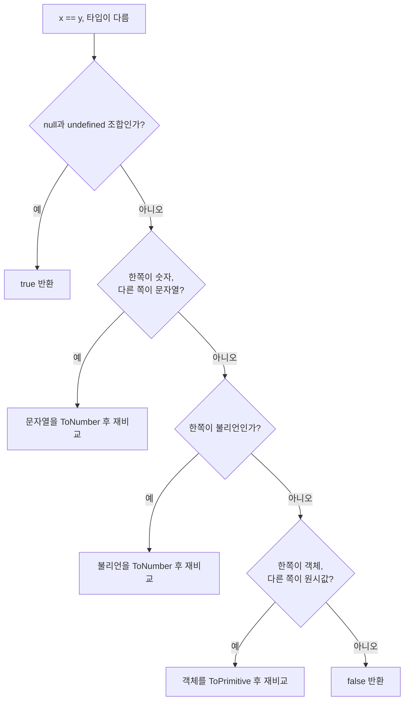

<Callout type="info">
  **이번 문서의 목표:** 이 파일을 다 읽으면 `==` 비교 결과를 명세 단계로 유도하고, `||`·`&&`·`??`·`?.`가 각각 **무엇을 기준으로 판단하고 무엇을 반환하는지** 구분해 안전한 기본값 코드를 쓸 수 있게 된다.
</Callout>

## 연산자를 다시 배우는 이유

`+`, `===`, `||` 같은 연산자는 이미 다 써본 것들입니다. 그런데 이 편에서 다시 다루는 이유는, 이들이 **값을 계산하는 함수가 아니라 명세에 정의된 알고리즘**이기 때문입니다. 5편에서 강제 변환 알고리즘을 손에 넣었으니, 이제 그 알고리즘을 **연산자 안에서 실제로 돌려볼** 차례입니다.

특히 논리 연산자에는 초보자가 거의 예외 없이 오해하는 성질이 있습니다 — **`||`와 `&&`는 `true`나 `false`를 반환하지 않습니다.** 이 하나만 제대로 이해해도 코드가 달라집니다.

> **쉽게 말하면:** 이번 편은 **연산자의 설명서를 정독하는 시간**입니다. 매일 쓰던 도구의 숨은 기능과 안전 수칙을 확인합니다.

## 1. 동등 비교 — `==`의 알고리즘을 끝까지

### `===`부터 — 단순하다

**엄격 동등**(strict equality, `===`)의 알고리즘은 짧습니다.

<Steps>

### 1단계 — 타입이 다른가?

다르면 즉시 `false`. 변환은 일절 없습니다.

### 2단계 — 숫자인가?

`NaN`이 하나라도 있으면 `false`. `+0`과 `-0`은 같다고 봅니다. 나머지는 수학적 값을 비교합니다.

### 3단계 — 문자열인가?

**코드 유닛**(code unit, 문자열을 구성하는 16비트 조각)이 순서대로 전부 같아야 `true`.

### 4단계 — 객체인가?

**같은 객체를 가리키는가**만 봅니다. 내용은 보지 않습니다.

</Steps>

### `==` — 타입이 다를 때 시작되는 절차

**느슨한 동등**(loose equality, `==`)은 타입이 같으면 `===`와 똑같이 동작합니다. 문제는 타입이 다를 때입니다. 명세는 다음 순서로 처리합니다.



이 순서도에서 뽑아낼 규칙 네 가지가 있습니다.

1. **`null`과 `undefined`는 서로만 같습니다.** 다른 어떤 값과도 `==`로 같지 않습니다. `null == 0`이 `false`인 이유입니다 — 숫자 변환 단계로 넘어가지 않고 첫 분기에서 끝나기 때문입니다.
2. **불리언은 언제나 먼저 숫자가 됩니다.** 그래서 `true == 1`은 참이고 `true == "1"`도 참이지만, `true == "true"`는 **거짓**입니다. `true`가 `1`이 되고 `"true"`가 `NaN`이 되기 때문입니다.
3. **객체는 원시값으로 납작해진 뒤 다시 비교됩니다.** 5편의 `ToPrimitive`가 여기서 그대로 쓰입니다.
4. **비교는 재귀적입니다.** 변환 후 다시 `==` 규칙을 적용합니다. `[] == false`는 `[] == 0` → `"" == 0` → `0 == 0` → `true`가 되는 3단 변환입니다.

### 실험 — 변환 단계를 손으로 따라가기

<CodePlayground
  template="vanilla"
  activeFile="/index.js"
  showConsole
  label="느슨한 동등 비교가 거치는 변환 단계를 단계별로 재현"
  files={{
    '/index.js': `// 대표적인 == 사례를 모아 === 결과와 나란히 본다
const 사례 = [
  ["null == undefined", null, undefined],
  ["null == 0", null, 0],
  ["undefined == 0", undefined, 0],
  ["true == 1", true, 1],
  ["true == '1'", true, "1"],
  ["true == 'true'", true, "true"],
  ["'' == 0", "", 0],
  ["'0' == 0", "0", 0],
  ["'' == '0'", "", "0"],
  ["[] == false", [], false],
  ["[] == ''", [], ""],
  ["[0] == false", [0], false],
  ["NaN == NaN", NaN, NaN],
];

console.log("표현식 | == | ===");
사례.forEach(function (항목) {
  console.log(항목[0] + " | " + (항목[1] == 항목[2]) + " | " + (항목[1] === 항목[2]));
});

// ── 악명 높은 비추이성(non-transitivity) 확인 ─────────
// 수학의 등호라면 A=B이고 B=C이면 A=C여야 한다. == 는 그렇지 않다.
console.log("--- == 는 추이적이지 않다 ---");
console.log("'' == 0 :", "" == 0);
console.log("0 == '0' :", 0 == "0");
console.log("'' == '0' :", "" == "0", "← 앞의 둘이 참인데 이건 거짓!");

// ── 유일하게 권장되는 == 사용법 ─────────────────
function 값이비었나(v) {
  return v == null;   // null과 undefined를 한 번에 잡는 관용구
}
console.log("--- x == null 관용구 ---");
[null, undefined, 0, "", false, NaN].forEach(function (v) {
  console.log(String(v), "→", 값이비었나(v));
});

// ── 실험해 보기 ────────────────────────────────
// (a) 사례 배열에 ["[] == 0", [], 0] 을 추가하고 왜 true인지 유도해 보세요.
// (b) ["{} == '[object Object]'", {}, "[object Object]"] 를 추가해 보세요.
// (c) [null >= 0, null > 0, null == 0] 세 결과를 비교해 보세요.
//     비교 연산자와 동등 연산자가 서로 다른 알고리즘임을 알 수 있습니다.`,
  }}
/>

**결과 해석**: 세 번째 실험이 가장 충격적입니다. `"" == 0`이 참이고 `0 == "0"`도 참인데 `"" == "0"`은 거짓입니다. 수학의 등호가 반드시 가지는 **추이성**(transitivity, A=B이고 B=C면 A=C)이 `==`에는 없습니다. 그 이유는 명확합니다 — 앞의 두 비교는 **변환을 거친 비교**이고 마지막은 **타입이 같아 변환 없이 비교**한 것이기 때문입니다. 같은 연산자가 상황에 따라 다른 알고리즘을 쓰는 것이니 추이성이 보장될 리가 없습니다.

<Callout type="warning">
  **자주 틀리는 점:** `null >= 0`은 `true`인데 `null > 0`은 `false`이고 `null == 0`도 `false`입니다. 관계 연산자(`<`, `>`, `<=`, `>=`)는 동등 연산자와 **완전히 다른 알고리즘**을 씁니다. 관계 연산자는 `null`을 특별 취급하지 않고 `ToNumber`로 0을 만들지만, `==`는 `null`을 첫 분기에서 특별 취급합니다. `>=`는 "크거나 같다"를 "작지 않다"의 부정으로 계산하기 때문에 결과가 어긋납니다. 이런 조합을 실무 코드에 두면 안 됩니다.
</Callout>

## 2. 논리 연산자 — 불리언을 반환하지 않는다

### 가장 중요한 오해 교정

많은 언어에서 `||`와 `&&`는 `true`/`false`를 반환합니다. **JavaScript는 다릅니다.**

<Callout type="info">
  `||`와 `&&`는 **피연산자 중 하나를 그대로 반환합니다.** 불리언으로 바꾸지 않습니다. 판단할 때만 `ToBoolean`을 쓰고, 반환할 때는 **원래 값**을 돌려줍니다.
</Callout>

정확한 규칙은 이렇습니다.

- `A || B`: `A`가 truthy면 **`A`를 반환**하고 `B`는 평가조차 하지 않습니다. `A`가 falsy면 **`B`를 반환**합니다.
- `A && B`: `A`가 falsy면 **`A`를 반환**하고 `B`는 평가하지 않습니다. `A`가 truthy면 **`B`를 반환**합니다.

> **비유:** `||`는 "**쓸 만한 것이 나올 때까지 훑는 눈**"입니다. 첫 번째가 쓸 만하면 거기서 멈추고 그것을 집어 옵니다. `&&`는 "**하나라도 문제가 있으면 즉시 중단하는 검사원**"입니다. 문제를 발견하면 그 문제 자체를 보고합니다.

오른쪽 피연산자를 평가하지 않고 건너뛰는 이 성질을 **단축 평가**(short-circuit evaluation, 쇼트서킷 — 회로를 짧게 끊는다는 뜻)라고 부릅니다.

### 단축 평가의 두 가지 용도

**용도 1 — 기본값 제공**

```js
const 표시이름 = 입력이름 || "이름 없음";
```

**용도 2 — 조건부 실행**

```js
콜백 && 콜백();          // 콜백이 있을 때만 호출
로그인여부 && 화면갱신();  // 조건이 참일 때만 실행
```

두 번째 용도는 부수 효과를 노린 것이라 가독성 논란이 있지만, JSX 같은 표현식 문맥에서는 여전히 널리 쓰입니다.

### 실험 — 반환값과 평가 여부 확인

<CodePlayground
  template="vanilla"
  activeFile="/index.js"
  showConsole
  label="논리 연산자의 반환값과 단축 평가를 동시에 관찰"
  files={{
    '/index.js': `// ── (1) 반환되는 것은 불리언이 아니라 피연산자 자체 ────
console.log("'철수' || '기본값' →", "철수" || "기본값");
console.log("'' || '기본값' →", "" || "기본값");
console.log("0 || '기본값' →", 0 || "기본값");
console.log("null && '뒤' →", null && "뒤");
console.log("'앞' && '뒤' →", "앞" && "뒤");
console.log("타입 확인:", typeof ("철수" || "기본값"));

// ── (2) 단축 평가 — 오른쪽이 아예 실행되지 않는다 ─────
function 무거운계산() {
  console.log("   !! 무거운계산 실행됨 !!");
  return "계산결과";
}

console.log("[A] truthy || 무거운계산()");
const a = "이미있는값" || 무거운계산();   // 무거운계산은 호출되지 않는다
console.log("   결과:", a);

console.log("[B] falsy || 무거운계산()");
const b = "" || 무거운계산();             // 호출된다
console.log("   결과:", b);

console.log("[C] falsy && 무거운계산()");
const c = null && 무거운계산();           // 호출되지 않는다
console.log("   결과:", c);

// ── (3) || 로 기본값을 주면 생기는 버그 ───────────────
function 설정적용(옵션) {
  const 수량 = 옵션.수량 || 10;
  const 제목 = 옵션.제목 || "제목 없음";
  const 활성 = 옵션.활성 || true;
  return "수량=" + 수량 + " / 제목=" + JSON.stringify(제목) + " / 활성=" + 활성;
}

console.log("--- || 로 기본값을 준 경우 ---");
console.log("정상 입력:", 설정적용({ 수량: 5, 제목: "보고서", 활성: true }));
console.log("0과 빈문자열:", 설정적용({ 수량: 0, 제목: "", 활성: false }));
// 0이 10으로, 빈 문자열이 '제목 없음'으로, false가 true로 바뀌어 버린다!

// ── (4) ?? 로 바꾸면 해결된다 ───────────────────
function 설정적용_안전(옵션) {
  const 수량 = 옵션.수량 ?? 10;
  const 제목 = 옵션.제목 ?? "제목 없음";
  const 활성 = 옵션.활성 ?? true;
  return "수량=" + 수량 + " / 제목=" + JSON.stringify(제목) + " / 활성=" + 활성;
}
console.log("--- ?? 로 기본값을 준 경우 ---");
console.log("0과 빈문자열:", 설정적용_안전({ 수량: 0, 제목: "", 활성: false }));

// ── 실험해 보기 ────────────────────────────────
// (a) 설정적용_안전에 빈 객체를 넘겨 보세요. 기본값이 제대로 나옵니다.
// (b) 옵션.수량을 null로 넘기면 ?? 가 발동하고, 0으로 넘기면 발동하지 않습니다.
// (c) (2)의 [A]를 && 로 바꾸면 무거운계산이 실행됩니다. 왜인지 설명해 보세요.`,
  }}
/>

**결과 해석**: (3)번이 이 편에서 가장 실무적인 대목입니다. `||`는 **falsy 전부**를 "값이 없다"로 간주합니다. 그런데 `0`, `""`, `false`는 **정당한 값**인 경우가 많습니다. 수량 0을 입력했는데 10이 되고, 제목을 비웠는데 "제목 없음"이 들어가고, 비활성으로 설정했는데 활성이 되어버립니다. 이 부류의 버그는 조용히 데이터를 오염시키므로 발견이 늦습니다.

## 3. 널 병합 연산자 `??` — 판단 기준이 다르다

### 정확한 발동 조건

**널 병합 연산자**(nullish coalescing operator, `??`)는 ES2020에 추가되었습니다. `nullish`는 "null스러운"이라는 뜻으로, **`null`과 `undefined` 딱 두 값만** 가리킵니다.

| 연산자 | 왼쪽이 어떨 때 오른쪽을 쓰는가 | 걸러지는 값 |
|--------|-------------------------------|-------------|
| 논리 OR – `\|\|` | falsy일 때 | `false`, `0`, `""`, `null`, `undefined`, `NaN` |
| `??` | nullish일 때 | `null`, `undefined` |

즉 `??`는 `||`의 **훨씬 좁고 정확한 버전**입니다. "값이 아예 없을 때만" 기본값을 쓰겠다는 의도를 정확히 표현합니다.

> **비유:** `||`는 "**비어 보이면 다 채워 넣는 성급한 조수**"이고, `??`는 "**진짜로 없을 때만 채워 넣는 신중한 조수**"입니다. 숫자 0과 빈 문자열은 비어 보이지만 실제로는 내용이 있는 값입니다.

### 문법 제약 — 괄호가 강제된다

`??`를 `||`나 `&&`와 **괄호 없이 섞어 쓰면 문법 오류**입니다.

```js
const 값 = a || b ?? c;      // SyntaxError
const 값 = (a || b) ?? c;    // OK
const 값 = a || (b ?? c);    // OK
```

명세가 일부러 막았습니다. 두 연산자의 판단 기준이 다르기 때문에, 우선순위를 암기에 맡기면 반드시 오해가 생긴다고 본 것입니다. **읽는 사람이 헷갈릴 코드는 아예 못 쓰게 한다** — 최근 명세 설계의 태도를 보여주는 좋은 예입니다.

### 논리 할당 연산자

ES2021은 세 가지 축약 형태를 추가했습니다.

| 표기 | 같은 뜻 | 언제 대입되는가 |
|------|---------|-----------------|
| `a \|\|= b` | `a \|\| (a = b)` | `a`가 falsy일 때 |
| `a &&= b` | `a && (a = b)` | `a`가 truthy일 때 |
| `a ??= b` | `a ?? (a = b)` | `a`가 nullish일 때 |

이들도 **단축 평가**를 유지합니다. 조건에 맞지 않으면 **대입 자체가 일어나지 않습니다.** 이 성질이 중요한 이유는 setter가 정의된 프로퍼티나 프록시에서 **불필요한 쓰기 동작을 피할 수 있기 때문**입니다.

## 4. 옵셔널 체이닝 `?.` — 안전한 접근

### 문제 상황

중첩된 데이터에서 값을 꺼낼 때, 중간이 없으면 `TypeError`가 납니다.

```js
const 도시 = 사용자.주소.도시;
// 주소가 undefined이면 → TypeError: Cannot read properties of undefined
```

예전에는 이렇게 방어했습니다.

```js
const 도시 = 사용자 && 사용자.주소 && 사용자.주소.도시;
```

**옵셔널 체이닝**(optional chaining, `?.`)은 이 패턴을 문법으로 만든 것입니다.

```js
const 도시 = 사용자?.주소?.도시;   // 중간이 없으면 undefined
```

### 세 가지 형태와 정확한 동작

| 형태 | 용도 | 예시 |
|------|------|------|
| `객체?.프로퍼티` | 프로퍼티 접근 | `사용자?.이름` |
| `객체?.[표현식]` | 계산된 키 접근 | `사용자?.[키변수]` |
| `함수?.()` | 함수 호출 | `콜백?.()` |

동작 규칙에서 반드시 챙길 것이 세 가지입니다.

1. **발동 조건은 nullish뿐입니다.** `null`이나 `undefined`일 때만 `undefined`를 반환하고 멈춥니다. `0`이나 `""`에서는 발동하지 않고 정상 접근을 시도합니다.
2. **단락되면 전체 체인이 통째로 중단됩니다.** `a?.b.c.d`에서 `a`가 `null`이면 뒤의 `.b.c.d`는 **평가조차 되지 않고** 전체 결과가 `undefined`입니다. 이것을 **단락 평가**(short-circuiting)라고 하며, 첫 `?.` 이후를 전부 감싸는 효과입니다.
3. **오탈자를 숨깁니다.** `사용자?.일홈`처럼 프로퍼티 이름을 틀려도 조용히 `undefined`가 나옵니다. 옵셔널 체이닝은 "**없을 수 있다고 알고 있는 자리**"에만 써야 하고, 반드시 있어야 하는 자리에 남발하면 버그를 감춥니다.

### 실험 — 발동 조건과 단락 범위 확인

<CodePlayground
  template="vanilla"
  activeFile="/index.js"
  showConsole
  label="옵셔널 체이닝의 발동 조건과 단락 범위를 확인"
  files={{
    '/index.js': `const 사용자들 = [
  { 이름: "철수", 주소: { 도시: "서울", 우편: 12345 } },
  { 이름: "영희", 주소: null },
  { 이름: "민수" },
  null,
];

console.log("--- 옵셔널 체이닝 결과 ---");
사용자들.forEach(function (u, i) {
  console.log(i + ":", u?.주소?.도시);
});

console.log("--- ?. 없이 접근하면 ---");
try {
  console.log(사용자들[1].주소.도시);
} catch (e) {
  console.log("에러:", e.name, "-", e.message);
}

// ── 발동 조건은 nullish뿐 ────────────────────────
console.log("--- 0과 빈 문자열에서는 발동하지 않는다 ---");
const 숫자값 = 0;
const 문자값 = "";
console.log("(0)?.toFixed(1) =", 숫자값?.toFixed(1));
console.log("('')?.length =", 문자값?.length);
console.log("null?.length =", null?.length);

// ── 단락 범위 확인 ─────────────────────────────
function 접근추적() {
  console.log("   !! 이 함수가 호출됨 !!");
  return { 값: 1 };
}
const 없는객체 = null;
console.log("[단락 확인] a?.b 뒤의 체인은 평가되지 않는다:");
console.log("   결과:", 없는객체?.속성[접근추적()]);
// 없는객체가 null이므로 접근추적()은 호출조차 되지 않는다

// ── 함수 호출 형태 ──────────────────────────────
const 설정 = { 콜백: function () { return "콜백 실행됨"; } };
const 빈설정 = {};
console.log("콜백 있음:", 설정.콜백?.());
console.log("콜백 없음:", 빈설정.콜백?.());

// ── ?? 와 조합한 실전 패턴 ────────────────────────
function 도시가져오기(u) {
  return u?.주소?.도시 ?? "주소 미등록";
}
console.log("--- ?. 와 ?? 조합 ---");
사용자들.forEach(function (u, i) {
  console.log(i + ":", 도시가져오기(u));
});

// ── 실험해 보기 ────────────────────────────────
// (a) 빈설정.콜백?.() 에서 ?. 를 빼면 어떤 에러가 나는지 확인
// (b) 콜백 자리에 함수가 아닌 숫자를 넣고 ?.() 를 호출하면
//     발동하지 않고 TypeError가 납니다. 왜인지 생각해 보세요.
// (c) 도시가져오기의 ?? 를 || 로 바꾸고, 도시가 빈 문자열인
//     사용자를 추가하면 결과가 어떻게 달라지는지 확인`,
  }}
/>

**결과 해석**: `(0)?.toFixed(1)`이 정상 동작하는 것이 핵심 관찰입니다. `0`은 falsy이지만 nullish가 아니므로 옵셔널 체이닝이 발동하지 않고 그냥 메서드를 호출합니다. 단락 확인 실험에서는 `접근추적()`이 **한 번도 출력되지 않습니다** — 첫 `?.`에서 단락되면 뒤의 대괄호 안 표현식까지 통째로 건너뛴다는 증거입니다.

<Callout type="warning">
  **자주 틀리는 점:** `?.`는 **없을 수도 있는 대상**에 쓰는 것이지 오류를 없애는 마법이 아닙니다. `콜백?.()`에서 `콜백`이 함수가 아닌 숫자라면 여전히 `TypeError`가 납니다. nullish일 때만 봐주고, 그 외에는 정상 규칙대로 동작하기 때문입니다. 또한 `?.`는 **대입의 왼쪽에 쓸 수 없습니다** — `a?.b = 1`은 문법 오류입니다.
</Callout>

## 5. 삼항 연산자와 쉼표 연산자

### 삼항 연산자 — 유일한 3항 연산자

`조건 ? 참일때값 : 거짓일때값`은 피연산자가 셋이라 **삼항 연산자**(ternary operator)라고 부릅니다. `if` 문과 결정적으로 다른 점은 **표현식**(expression)이라는 것입니다. 값을 만들어내므로 대입문 오른쪽, 함수 인자, 템플릿 안 어디서나 쓸 수 있습니다.

```js
const 등급 = 점수 >= 90 ? "A" : 점수 >= 80 ? "B" : "C";
```

이렇게 연쇄할 수 있지만, 세 단계를 넘어가면 가독성이 급격히 나빠집니다. 그때는 `if`나 조회 테이블로 바꾸는 것이 낫습니다.

### 연산자 우선순위 — 외우지 말고 괄호를 쓰라

JavaScript에는 20개가 넘는 우선순위 단계가 있습니다. 전부 외울 필요는 없고, **자주 사고가 나는 조합**만 기억하면 됩니다.

| 위험한 표현 | 실제 해석 | 안전한 표기 |
|-------------|-----------|-------------|
| `a && b \|\| c` | `(a && b) \|\| c` | 괄호를 명시 |
| `!a instanceof B` | `(!a) instanceof B` | `!(a instanceof B)` |
| `typeof a + b` | `(typeof a) + b` | `typeof (a + b)` |
| `-x ** 2` | SyntaxError – 금지됨 | `-(x ** 2)` |

마지막 줄이 흥미롭습니다. 거듭제곱 연산자 `**`는 단항 마이너스와 섞으면 **문법 오류**가 됩니다. 수학에서도 해석이 갈리는 표기라, 명세가 아예 괄호를 강제한 것입니다. `??`의 괄호 강제와 같은 철학입니다.

## 핵심 정리

- `===`는 **타입이 다르면 즉시 거짓**이고 객체는 참조로만 비교한다. `==`는 타입이 다를 때 정해진 순서로 변환을 거치며, `null`과 `undefined`는 서로만 같다.
- `==`는 **추이적이지 않다.** 실무 원칙은 `===` 기본, `x == null` 관용구만 예외다.
- `||`와 `&&`는 **불리언이 아니라 피연산자 자체를 반환**하며, 오른쪽을 평가하지 않는 **단축 평가**를 한다.
- `||`는 **falsy 전부**를 기본값 대상으로 보지만 `??`는 **nullish 두 개만** 본다. `0`·`""`·`false`가 유효한 값이면 반드시 `??`를 써야 한다.
- `?.`는 nullish일 때만 발동하며, 단락되면 **뒤의 체인 전체가 평가되지 않는다.** 없어도 되는 자리에만 쓰고 오탈자를 감추지 않도록 주의한다.
- `??`와 `||`·`&&`를 괄호 없이 섞는 것, `-x ** 2`는 **문법 오류**다. 명세가 헷갈릴 표기를 아예 금지한 사례다.

## 마무리 복습

<Quiz
  questionNumber={1}
  question="느슨한 동등 비교에서 null과 관련한 규칙으로 옳은 것은?"
  options={['null은 0, 빈 문자열, false와 모두 같다고 판정된다', 'null은 undefined와만 같고 다른 값과는 모두 다르다고 판정된다', 'null은 어떤 값과도 같지 않다', 'null은 모든 falsy 값과 같다']}
  correctAnswer={2}
  explanation="느슨한 동등 알고리즘의 첫 분기가 null과 undefined 조합을 참으로 처리하고, 그 외의 타입 조합에서는 숫자 변환 단계로 넘어가지 않고 거짓이 된다. 그래서 null과 0의 비교는 거짓이다."
  optionExplanations={['0이나 빈 문자열과는 같지 않다', '정답 — 서로만 같다고 판정된다', 'undefined와는 같다고 판정된다', 'false, 0 등과는 같지 않다']}
/>

<Quiz
  questionNumber={2}
  question="다음 비교 결과의 조합으로 옳은 것은? 빈 문자열과 숫자 0의 느슨한 비교, 숫자 0과 문자열 0의 느슨한 비교, 빈 문자열과 문자열 0의 느슨한 비교"
  options={['참, 참, 참', '참, 참, 거짓', '거짓, 거짓, 참', '거짓, 참, 참']}
  correctAnswer={2}
  explanation="앞의 두 비교는 타입이 달라 숫자 변환을 거치므로 모두 참이 된다. 마지막은 둘 다 문자열이라 변환 없이 그대로 비교하므로 거짓이다. 느슨한 동등이 추이적이지 않다는 대표 사례다."
  optionExplanations={['마지막 비교는 문자열끼리라 거짓이다', '정답 — 변환을 거친 두 비교만 참이다', '앞의 두 비교는 변환을 거쳐 참이 된다', '첫 비교도 참이다']}
/>

<Quiz
  questionNumber={3}
  question="논리 OR 연산자의 반환값에 대한 설명으로 옳은 것은?"
  options={['항상 true 또는 false를 반환한다', '왼쪽이 truthy면 왼쪽 값을, falsy면 오른쪽 값을 그대로 반환한다', '항상 오른쪽 값을 반환한다', '양쪽을 모두 평가한 뒤 뒤엣것을 반환한다']}
  correctAnswer={2}
  explanation="논리 연산자는 판단에만 ToBoolean을 쓰고 반환은 피연산자 원래 값으로 한다. 왼쪽이 truthy면 오른쪽은 평가조차 하지 않는 단축 평가가 일어난다."
  optionExplanations={['불리언으로 변환해 반환하지 않는다', '정답 — 피연산자 자체가 반환된다', '왼쪽이 truthy면 왼쪽이 반환된다', '단축 평가 때문에 오른쪽이 평가되지 않을 수 있다']}
/>

<Quiz
  questionNumber={4}
  question="옵션 객체의 수량 프로퍼티에 0이 정상적으로 들어올 수 있는 상황에서 기본값 10을 주려 한다. 올바른 방법은?"
  options={['논리 OR로 기본값을 준다', '널 병합 연산자로 기본값을 준다', '삼항 연산자로 truthy 여부를 검사한다', '논리 AND로 기본값을 준다']}
  correctAnswer={2}
  explanation="논리 OR는 falsy 전체를 기본값 대상으로 보므로 정당한 값 0이 10으로 바뀌어 버린다. 널 병합 연산자는 null과 undefined일 때만 발동하므로 0을 그대로 보존한다."
  optionExplanations={['0이 falsy라서 기본값으로 덮인다', '정답 — nullish일 때만 발동해 0을 보존한다', 'truthy 검사도 0을 걸러내므로 같은 문제가 생긴다', '논리 AND는 기본값 제공 용도가 아니다']}
/>

<Quiz
  questionNumber={5}
  question="옵셔널 체이닝이 발동해 undefined를 반환하는 경우는?"
  options={['대상이 숫자 0일 때', '대상이 빈 문자열일 때', '대상이 null 또는 undefined일 때', '대상이 false일 때']}
  correctAnswer={3}
  explanation="옵셔널 체이닝은 nullish, 즉 null과 undefined에서만 단락된다. 0, 빈 문자열, false는 falsy이지만 nullish가 아니므로 정상적으로 프로퍼티 접근이나 메서드 호출을 시도한다."
  optionExplanations={['0에서는 발동하지 않고 정상 접근을 시도한다', '빈 문자열도 nullish가 아니다', '정답 — nullish일 때만 단락된다', 'false도 nullish가 아니다']}
/>

<Quiz
  questionNumber={6}
  question="널 병합 연산자를 논리 OR나 논리 AND와 괄호 없이 함께 쓰면 어떻게 되는가?"
  options={['왼쪽부터 순서대로 평가된다', '널 병합이 항상 우선한다', 'SyntaxError가 발생한다', '논리 연산자가 항상 우선한다']}
  correctAnswer={3}
  explanation="판단 기준이 다른 두 연산자를 섞을 때 생기는 오해를 막기 위해, 명세가 괄호 없는 혼용을 문법 오류로 규정했다. 괄호로 의도를 명시하면 정상 동작한다."
  optionExplanations={['평가 자체가 되지 않고 파싱 단계에서 막힌다', '우선순위 규칙이 아니라 금지 규칙이다', '정답 — 괄호 없는 혼용은 문법 오류다', '역시 우선순위 문제가 아니다']}
/>

<Quiz
  questionNumber={7}
  question="옵셔널 체이닝의 단락 범위에 대한 설명으로 옳은 것은?"
  options={['단락되면 바로 다음 프로퍼티 접근 하나만 건너뛴다', '단락되면 그 뒤에 이어지는 체인 전체가 평가되지 않는다', '단락되어도 뒤의 함수 호출은 그대로 실행된다', '단락되면 null을 반환한다']}
  correctAnswer={2}
  explanation="첫 옵셔널 접근에서 단락되면 그 뒤의 프로퍼티 접근, 대괄호 안 표현식, 함수 호출까지 전부 건너뛰고 전체 결과가 undefined가 된다. 반환값은 null이 아니라 undefined다."
  optionExplanations={['하나만 건너뛰는 것이 아니라 체인 전체가 중단된다', '정답 — 체인 전체가 평가되지 않는다', '뒤의 호출도 실행되지 않는다', '반환값은 undefined다']}
/>

<Quiz
  questionNumber={8}
  question="논리 할당 연산자의 특징으로 옳은 것은?"
  options={['조건과 무관하게 항상 대입이 일어난다', '조건에 맞지 않으면 대입 자체가 일어나지 않는다', '오른쪽 피연산자를 항상 먼저 평가한다', '객체 프로퍼티에는 사용할 수 없다']}
  correctAnswer={2}
  explanation="논리 할당 연산자는 단축 평가를 유지하므로 조건이 맞지 않으면 오른쪽을 평가하지도, 대입하지도 않는다. 이 성질 덕분에 setter나 프록시가 걸린 프로퍼티에서 불필요한 쓰기를 피할 수 있다."
  optionExplanations={['조건이 맞을 때만 대입한다', '정답 — 대입 자체가 조건부다', '왼쪽을 먼저 평가해 조건을 판단한다', '객체 프로퍼티에도 사용할 수 있다']}
/>

## 참고 자료

- [MDN – Expressions and operators](https://developer.mozilla.org/en-US/docs/Web/JavaScript/Guide/Expressions_and_operators)
- [MDN – Equality comparisons and sameness](https://developer.mozilla.org/en-US/docs/Web/JavaScript/Guide/Equality_comparisons_and_sameness)
- [ECMAScript Language Specification – 최신 명세 본문](https://262.ecma-international.org/)
