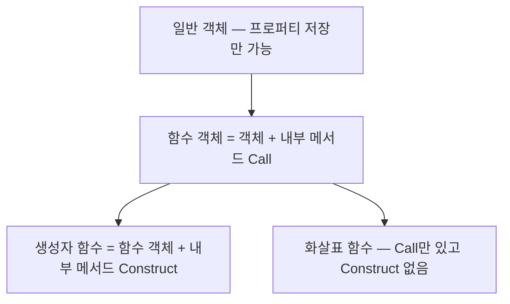
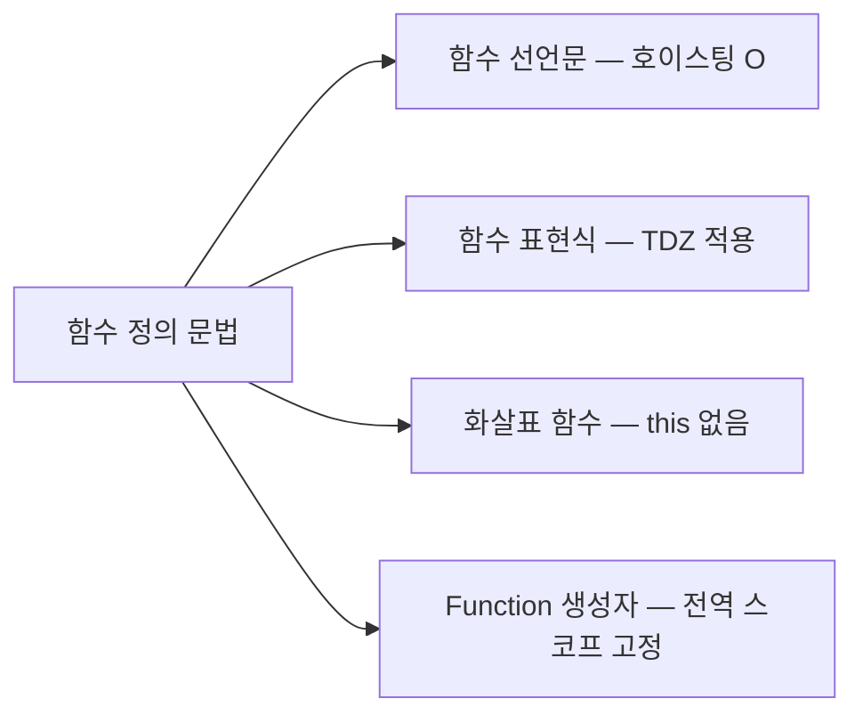
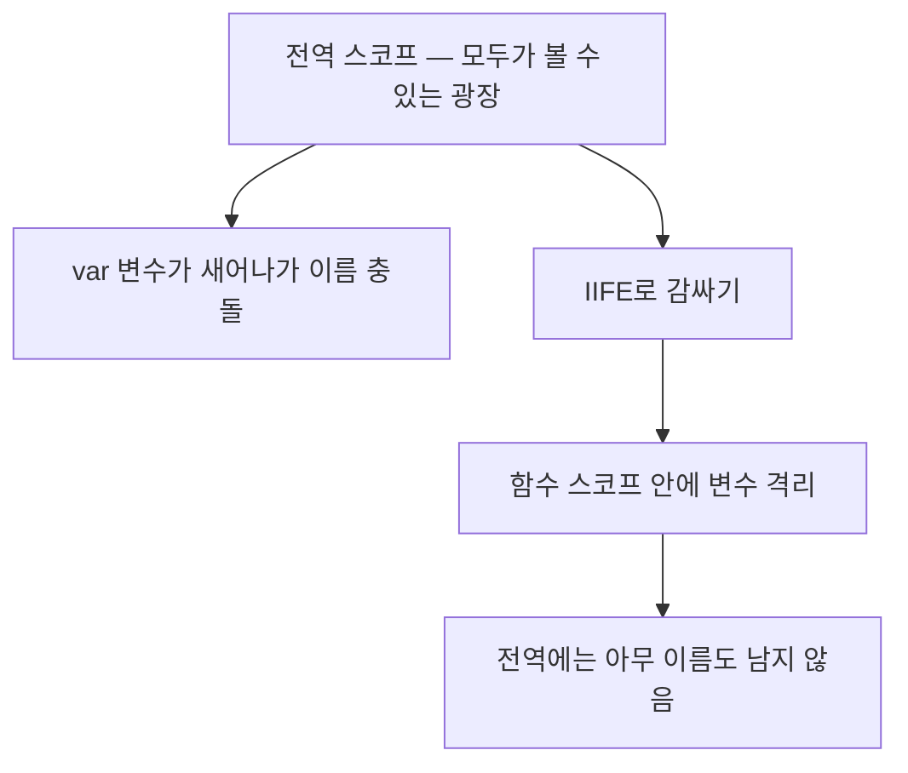

<Callout type="info">
  **이번 문서의 목표:** 이 파일을 다 읽으면 함수를 "코드 묶음"이 아니라 **호출 가능한 객체**로 바라보게 되고, 선언문·표현식·화살표 함수의 차이를 동작 원리로 설명하며, 매개변수와 인수가 어긋날 때 무슨 일이 벌어지는지 예측할 수 있게 된다.
</Callout>

## 1. 왜 함수부터 다시 보는가

우리는 이미 함수를 써 봤습니다. `function 더하기(a, b) { return a + b; }` 정도는 눈 감고도 씁니다. 그런데 이 과목에서 함수를 한 편 통째로 다시 다루는 이유가 있습니다.

앞으로 배울 **실행 컨텍스트**(execution context, 실행 문맥 — 9편), **클로저**(closure, 10편), **this 바인딩**(this binding, 12편), **프로토타입**(prototype, 13편)은 전부 "함수란 무엇인가"에서 파생됩니다. 함수를 "코드 덩어리"로만 알고 있으면 이 네 주제에서 반드시 길을 잃습니다.

핵심 문장을 먼저 던지겠습니다.

> **쉽게 말하면:** JavaScript에서 함수는 **호출할 수 있는 객체**(callable object, 콜러블 오브젝트)다. 객체이므로 변수에 담기고, 다른 함수에 넘겨지고, 프로퍼티를 붙일 수 있다.

이 문장이 이 편 전체의 씨앗입니다.

## 2. 일급 객체로서의 함수

### 2-1. 왜 "일급"이라는 말이 필요했나

프로그래밍 언어 이론에서 어떤 값이 **일급**(first-class, 퍼스트클래스)이라는 말은 "그 언어에서 값으로 할 수 있는 모든 일을 그 대상도 할 수 있다"는 뜻입니다. 영어 first-class는 원래 배·비행기의 **1등석**을 가리키는 말인데, "차별 없이 최고 대우를 받는다"는 뉘앙스가 그대로 옮겨온 용어입니다.

C 언어 같은 오래된 언어에서 함수는 2등 시민이었습니다. 함수를 변수에 담거나, 함수 안에서 새 함수를 만들어 반환하는 일이 자유롭지 않았습니다. 반면 JavaScript는 함수를 숫자·문자열과 똑같은 값으로 취급합니다.

### 2-2. 일급의 네 가지 조건

**조건 1**: 런타임(runtime, 프로그램이 실제로 돌아가는 시점)에 값처럼 생성할 수 있다.

```js
// 프로그램이 도는 도중에 함수가 만들어진다
const 인사 = function () {
  return "안녕하세요";
};
```

**조건 2**: 변수·객체 프로퍼티·배열 요소에 담을 수 있다.

```js
const 계산기 = {
  더하기: function (a, b) { return a + b; },
  빼기: (a, b) => a - b,
};

const 함수목록 = [Math.abs, Math.floor, Math.round];
console.log(함수목록[1](3.7)); // 3
```

**조건 3**: 다른 함수의 **인수**(argument, 아규먼트)로 전달할 수 있다.

```js
const 숫자들 = [3, 1, 2];
숫자들.sort(function (a, b) { return a - b; }); // 함수를 인수로 넘김
```

**조건 4**: 다른 함수의 **반환값**(return value, 리턴 밸류)이 될 수 있다.

```js
function 곱하기만들기(배수) {
  return function (값) {
    return 값 * 배수;
  };
}
const 세배 = 곱하기만들기(3);
console.log(세배(10)); // 30
```

> **쉽게 말하면:** 함수는 "실행할 수 있는 값"입니다. 숫자를 상자에 넣고 택배로 보내듯, 함수도 상자에 넣고 보낼 수 있습니다.

이 네 조건 덕분에 **고차 함수**(higher-order function, 하이어오더 펑션 — 함수를 인수로 받거나 함수를 반환하는 함수)가 가능해집니다. 배열의 `map`, `filter`, `reduce`(18편)가 전부 고차 함수이고, 클로저(10편)도 조건 4가 있어야 성립합니다.

### 2-3. 함수는 객체다 — 증거를 직접 보기

말로만 "함수는 객체"라고 하면 와닿지 않습니다. 객체라면 프로퍼티를 붙일 수 있어야 합니다. 직접 확인해 봅시다.

<CodePlayground
  template="vanilla"
  activeFile="/index.js"
  showConsole
  label="실험 1 — 함수에 프로퍼티를 붙여 보기"
  files={{
    '/index.js': `function 인사하기(이름) {
  인사하기.호출횟수 = (인사하기.호출횟수 || 0) + 1;
  return "안녕, " + 이름;
}

// 1) 함수도 객체이므로 프로퍼티를 붙일 수 있다
인사하기.설명 = "이름을 받아 인사말을 만든다";
console.log("붙인 프로퍼티:", 인사하기.설명);

// 2) 함수 객체가 기본으로 갖는 프로퍼티들
console.log("name:", 인사하기.name);       // 함수 이름
console.log("length:", 인사하기.length);   // 선언된 매개변수 개수

// 3) typeof는 object가 아니라 function을 돌려준다
console.log("typeof:", typeof 인사하기);

// 4) 그래도 객체는 맞다 — Object의 상속을 받는다
console.log("객체인가?", 인사하기 instanceof Object);

// 5) 호출할 때마다 자기 자신에 상태를 기록할 수도 있다
인사하기("가나");
인사하기("다라");
console.log("호출횟수:", 인사하기.호출횟수);`,
  }}
/>

여기서 두 가지를 짚어야 합니다.

- `typeof`가 `"object"`가 아니라 `"function"`을 돌려주는 이유: 명세는 **내부 메서드**(internal method, 대괄호 두 겹으로 표기)를 정의하는데, 호출 가능한 객체만 `[[Call]]`이라는 내부 메서드를 갖습니다. `typeof`는 이 `[[Call]]`의 유무를 보고 `"function"`을 반환합니다. 즉 함수는 **`[[Call]]`을 가진 특별한 객체**입니다.
- `new`로 호출할 수 있는 함수는 `[[Construct]]`라는 내부 메서드도 추가로 갖습니다. 이 이야기는 11편에서 이어집니다.



<Callout type="warning">
  **자주 틀리는 점:** "함수는 객체"라는 말을 듣고 `typeof 함수 === "object"`를 기대했다가 틀리는 경우가 많습니다. `typeof`의 결과는 `"function"`이지만, `instanceof Object`는 `true`입니다. 둘은 모순이 아니라, `typeof`가 호출 가능성을 특별 취급해서 알려주는 것뿐입니다.
</Callout>

## 3. 함수를 만드는 네 가지 방법

같은 기능의 함수라도 만드는 문법이 여러 개입니다. 문법이 다르면 **엔진이 처리하는 시점과 방식**도 달라집니다.

### 3-1. 함수 선언문

```js
function 사각형넓이(가로, 세로) {
  return 가로 * 세로;
}
```

**함수 선언문**(function declaration, 펑션 디클러레이션)은 문장(statement)입니다. 가장 중요한 특징은 **호이스팅**(hoisting, 끌어올림)입니다. 엔진은 코드를 실행하기 전에 스코프를 훑으며 함수 선언문을 먼저 찾아 **함수 객체를 통째로 만들어 두고 식별자에 할당**합니다. 그래서 선언보다 위에서 호출해도 동작합니다.

```js
console.log(사각형넓이(2, 3)); // 6 — 선언 전인데 동작한다
function 사각형넓이(가로, 세로) {
  return 가로 * 세로;
}
```

호이스팅의 정확한 메커니즘(렉시컬 환경에 언제 무엇이 기록되는가)은 9편에서 실행 컨텍스트와 함께 끝까지 파고듭니다. 여기서는 "선언문은 미리 완성되어 있다"까지만 잡아둡니다.

### 3-2. 함수 표현식

```js
const 사각형넓이 = function (가로, 세로) {
  return 가로 * 세로;
};
```

**함수 표현식**(function expression, 펑션 익스프레션)은 값을 만들어 변수에 대입하는 **식**(expression)입니다. 변수 선언 `const`는 호이스팅되지만 **TDZ**(Temporal Dead Zone, 일시적 사각지대)에 갇혀 있어, 대입이 실행되기 전에는 접근하면 에러가 납니다.

```js
console.log(사각형넓이(2, 3)); // ReferenceError
const 사각형넓이 = function (가로, 세로) { return 가로 * 세로; };
```

> **쉽게 말하면:** 선언문은 개업 전에 이미 간판을 달고 물건까지 채워 둔 가게이고, 표현식은 "그 줄에 도착해야" 비로소 물건이 들어오는 가게입니다.

함수 표현식에서 `function` 뒤에 이름을 붙이지 않으면 **익명 함수**(anonymous function, 어나니머스 펑션)입니다. 이름을 붙일 수도 있는데, 이를 **기명 함수 표현식**(named function expression)이라고 합니다.

```js
const 팩토리얼 = function 내부이름(n) {
  return n <= 1 ? 1 : n * 내부이름(n - 1); // 자기 자신을 안전하게 호출
};
// console.log(내부이름); // ReferenceError — 바깥에서는 안 보인다
```

기명 함수 표현식의 이름은 **그 함수 몸통 안에서만 유효**합니다. 외부 변수 `팩토리얼`이 나중에 다른 값으로 바뀌어도 재귀가 깨지지 않는다는 실용적 장점이 있습니다.

### 3-3. 화살표 함수

```js
const 사각형넓이 = (가로, 세로) => 가로 * 세로;
```

**화살표 함수**(arrow function, 애로 펑션)는 ES6에서 도입된 짧은 문법인데, **문법만 짧아진 게 아니라 기능이 의도적으로 덜어진 함수**입니다. 자세한 비교는 4장에서 표로 정리합니다.

### 3-4. Function 생성자

```js
const 사각형넓이 = new Function("가로", "세로", "return 가로 * 세로;");
```

**Function 생성자**(Function constructor)는 문자열을 코드로 해석해 함수를 만듭니다. 실무에서는 거의 쓰지 않습니다. 이유는 두 가지입니다. 첫째, 문자열을 코드로 바꾸므로 외부 입력이 섞이면 보안 구멍이 됩니다. 둘째, 이렇게 만든 함수는 **자신이 만들어진 자리의 스코프를 기억하지 못하고 항상 전역 스코프에서 만들어진 것처럼** 동작합니다. 즉 클로저가 성립하지 않습니다.



## 4. 화살표 함수는 무엇이 다른가

화살표 함수는 "짧게 쓰는 function"이 아닙니다. 명세상 **다른 종류의 함수 객체**입니다.

| 비교 항목 | 일반 함수 | 화살표 함수 |
|---|---|---|
| 자신의 `this` | 호출 방식에 따라 결정 | 없음 – 바깥 스코프의 `this`를 그대로 씀 |
| `arguments` 객체 | 있음 | 없음 – 바깥 것을 참조 |
| `new`로 호출 | 가능 – `[[Construct]]` 있음 | 불가 – TypeError |
| `prototype` 프로퍼티 | 있음 | 없음 |
| `super` 사용 | 메서드 축약형에서 가능 | 바깥 것을 그대로 씀 |
| 반환 생략 | 불가 – `return` 필요 | 몸통이 식 하나면 자동 반환 |

핵심은 첫 줄입니다. 화살표 함수는 **`this`를 자기 것으로 만들지 않습니다.** 그래서 함수 안에서 `this`를 쓰면, 마치 변수처럼 스코프 체인을 타고 바깥으로 올라가 가장 가까운 일반 함수의 `this`를 찾아 씁니다. 이 성질을 **렉시컬 this**(lexical this, 코드가 쓰여진 위치로 결정되는 this)라고 부릅니다.

> **비유:** 일반 함수는 자기 이름표를 새로 만들어 목에 겁니다. 화살표 함수는 이름표를 만들지 않고, 자기를 감싼 방의 벽에 붙어 있는 이름표를 그냥 읽습니다.

이 차이가 실제로 어떤 버그를 만들고 어떤 버그를 고치는지는 12편 this 바인딩에서 정면으로 다룹니다. 지금은 "화살표 함수는 this를 안 만든다"는 사실을 확실히 못 박아 둡니다.

<Callout type="warning">
  **자주 틀리는 점:** 객체 리터럴의 메서드를 화살표 함수로 쓰는 실수가 대표적입니다. `const 사람 = { 이름: "가나", 인사: () => this.이름 };`에서 `this`는 사람 객체가 아니라 바깥 스코프의 `this`입니다. 메서드에는 **메서드 축약형**을 쓰세요 — `인사() { return this.이름; }`.
</Callout>

## 5. 매개변수와 인수 — 내부에서 무슨 일이 일어나는가

용어부터 정확히 구분합니다. **매개변수**(parameter, 파라미터)는 함수를 **정의**할 때 괄호 안에 적는 이름이고, **인수**(argument, 아규먼트)는 함수를 **호출**할 때 실제로 넘기는 값입니다. 매개변수는 그릇, 인수는 그릇에 담기는 내용물입니다.

### 5-1. 개수가 안 맞아도 에러가 나지 않는다

JavaScript는 매개변수 개수와 인수 개수가 달라도 에러를 내지 않습니다.

- 인수가 **부족하면** 남는 매개변수는 `undefined`가 됩니다.
- 인수가 **남으면** 그냥 버려집니다. 단 `arguments` 객체에는 남아 있습니다.

이것은 편의가 아니라 **버그의 온상**입니다. 오타로 인수 하나를 빠뜨려도 조용히 `undefined`가 흘러다니다가 엉뚱한 곳에서 `NaN`으로 터집니다.

### 5-2. 기본값 매개변수

```js
function 할인가(정가, 할인율 = 0.1) {
  return 정가 * (1 - 할인율);
}
console.log(할인가(10000));           // 9000
console.log(할인가(10000, 0.3));      // 7000
console.log(할인가(10000, undefined)); // 9000 — undefined도 기본값 발동
console.log(할인가(10000, null));      // 10000 — null은 기본값이 발동 안 함
```

**기본값**(default parameter, 디폴트 파라미터)은 인수가 `undefined`일 때만 적용됩니다. `null`, `0`, `""`는 각각 "값이 있는 것"으로 취급되어 기본값이 적용되지 않습니다. 이 규칙은 5편의 강제 변환과 연결되는데, 기본값 발동 조건은 falsy 판정이 아니라 **엄격하게 `undefined`인지**를 봅니다.

### 5-3. 나머지 매개변수와 arguments

인수 개수가 정해지지 않은 함수를 쓰는 방법이 두 가지입니다.

```js
// 옛 방식 — arguments 객체
function 합계옛날() {
  let 합 = 0;
  for (let i = 0; i < arguments.length; i++) 합 += arguments[i];
  return 합;
}

// 현대 방식 — 나머지 매개변수
function 합계(...숫자들) {
  return 숫자들.reduce((누적, 값) => 누적 + 값, 0);
}
```

`arguments`는 **유사 배열 객체**(array-like object, 어레이라이크 오브젝트)입니다. `length`와 숫자 인덱스는 있지만 배열이 아니라서 `map`, `reduce` 같은 배열 메서드가 없습니다. 반면 **나머지 매개변수**(rest parameter, 레스트 파라미터) `...숫자들`은 **진짜 배열**입니다. 새 코드에서는 예외 없이 나머지 매개변수를 씁니다. 스프레드·레스트 문법 전반은 22편에서 다룹니다.

### 5-4. length와 name이 알려주는 것

함수 객체의 `length` 프로퍼티는 **기본값이나 나머지 매개변수가 등장하기 전까지의 매개변수 개수**입니다.

```js
console.log(((a, b) => 0).length);        // 2
console.log(((a, b = 1) => 0).length);    // 1 — 기본값 앞까지만
console.log(((a, ...rest) => 0).length);  // 1 — 나머지는 세지 않음
```

### 5-5. 인수 전달 방식 — 원시값과 객체

```js
function 바꿔보기(숫자, 객체) {
  숫자 = 999;
  객체.값 = 999;
}
let 내숫자 = 1;
let 내객체 = { 값: 1 };
바꿔보기(내숫자, 내객체);
console.log(내숫자);      // 1   — 안 바뀜
console.log(내객체.값);   // 999 — 바뀜
```

JavaScript의 인수 전달은 항상 **값에 의한 전달**(pass by value)입니다. 다만 객체를 담은 변수에 들어 있는 "값"이 **참조**(reference, 레퍼런스 — 객체가 있는 자리를 가리키는 주소)이기 때문에, 그 주소를 복사해서 넘기면 같은 객체를 함께 가리키게 됩니다. 이를 **공유에 의한 전달**(call by sharing)이라고도 부릅니다. 3편에서 다룬 원시값과 객체의 차이가 그대로 재현되는 자리입니다.

<Callout type="warning">
  **자주 틀리는 점:** 위 예제에서 `객체 = { 값: 999 }`처럼 **재할당**을 하면 원본은 바뀌지 않습니다. 매개변수라는 지역 변수가 새 주소를 가리키게 될 뿐, 호출한 쪽 변수는 여전히 옛 주소를 봅니다. "프로퍼티 수정은 전달되고, 재할당은 전달되지 않는다"로 기억하세요.
</Callout>

### 5-6. 직접 실험해 보기

<CodePlayground
  template="vanilla"
  activeFile="/index.js"
  showConsole
  label="실험 2 — 매개변수와 인수의 어긋남을 눈으로 확인"
  files={{
    '/index.js': `// 1) 인수가 부족하면 조용히 undefined
function 더하기(a, b) {
  console.log("a =", a, "/ b =", b, "→ 결과:", a + b);
}
더하기(1, 2);
더하기(1);        // b는 undefined → 1 + undefined = NaN
더하기(1, 2, 3);  // 3은 버려진다

// 2) 기본값은 undefined일 때만 발동
function 인사(이름 = "손님") {
  console.log("안녕하세요, " + 이름 + "님");
}
인사();
인사(undefined);
인사(null);   // null은 값으로 취급 → "null님"

// 3) length가 세는 규칙
function 세기1(a, b, c) {}
function 세기2(a, b = 1, c) {}
function 세기3(a, ...rest) {}
console.log("length:", 세기1.length, 세기2.length, 세기3.length);

// 4) 값 전달 vs 참조 공유
function 수정(원시, 객체, 재할당대상) {
  원시 = 999;
  객체.값 = 999;
  재할당대상 = { 값: 999 };
}
let 숫자 = 1;
let 객체A = { 값: 1 };
let 객체B = { 값: 1 };
수정(숫자, 객체A, 객체B);
console.log("원시:", 숫자);
console.log("프로퍼티 수정:", 객체A.값);
console.log("재할당:", 객체B.값);

// 5) arguments는 배열이 아니다
function 확인() {
  console.log("배열인가?", Array.isArray(arguments));
  console.log("length:", arguments.length);
}
확인(1, 2, 3);`,
  }}
/>

## 6. 반환값의 규칙

`return`을 만나면 함수는 즉시 종료하고 값을 돌려줍니다. 몇 가지 규칙이 있습니다.

1. `return`이 없거나 `return;`만 있으면 반환값은 `undefined`입니다.
2. 반환값은 **하나**뿐입니다. 여러 값을 돌려주고 싶으면 배열이나 객체로 묶습니다.
3. `return`과 값 사이에 줄바꿈을 넣으면 **자동 세미콜론 삽입**(ASI, Automatic Semicolon Insertion)이 개입해 `return;`으로 해석됩니다.

```js
function 위험한반환() {
  return
    { 값: 1 };   // 실제로는 return; 으로 끊긴다 → undefined
}
```

이것은 JavaScript에서 손꼽히는 함정입니다. `return` 뒤의 여는 중괄호는 **반드시 같은 줄에** 두세요.

## 7. 즉시 실행 함수

**즉시 실행 함수**(IIFE, Immediately Invoked Function Expression — "이피"라고 읽습니다)는 정의하자마자 곧바로 한 번 호출되고 사라지는 함수입니다.

```js
(function () {
  const 비밀 = "밖에서 못 본다";
  console.log(비밀);
})();

(() => {
  console.log("화살표 버전");
})();
```

### 왜 이런 문법이 생겼나

`var`만 있던 시절에는 **블록 스코프**가 없었습니다. `if` 블록이나 `for` 블록 안에서 `var`로 선언한 변수가 함수 바깥까지 새어 나가 전역을 오염시켰습니다. 그래서 "변수를 가둘 벽"이 필요했는데, 당시 유일한 벽이 **함수 스코프**였습니다. 함수를 하나 만들어 그 안에 코드를 넣고 바로 실행하면, 변수는 그 함수 안에 갇힙니다.



### 문법의 이유

`function () {}()`처럼 그냥 쓰면 문법 오류입니다. 문장의 맨 앞에 오는 `function` 키워드를 엔진이 **함수 선언문**으로 해석하려 하기 때문입니다. 선언문에는 이름이 필요하고, 선언문 뒤에 바로 괄호를 붙여 호출할 수도 없습니다. 그래서 전체를 소괄호로 감싸 **표현식이라는 신호**를 줍니다. 소괄호 대신 `!`, `+`, `void` 같은 연산자를 앞에 붙여도 같은 효과가 납니다.

### 지금도 필요한가

`let`, `const`가 블록 스코프를 주고, ES 모듈(29편)이 파일마다 독립 스코프를 주면서 IIFE의 원래 용도는 대부분 사라졌습니다. 다만 남아 있는 쓰임이 있습니다.

- **top-level await**를 쓸 수 없는 환경에서 비동기 코드를 감싸는 용도
- 라이브러리를 하나의 파일로 묶을 때의 감싸개

옛 코드를 읽을 때 반드시 만나므로, 원리는 알아두어야 합니다.

## 8. 순수 함수라는 감각

마지막으로 함수 설계의 기준 하나를 짚습니다. **순수 함수**(pure function, 퓨어 펑션)는 두 조건을 만족하는 함수입니다.

1. 같은 인수를 넣으면 **항상 같은 결과**를 돌려준다.
2. 함수 바깥 상태를 바꾸지 않는다 — **부수 효과**(side effect, 사이드 이펙트)가 없다.

```js
// 순수 — 입력만 보고 결과를 낸다
const 합 = (a, b) => a + b;

// 비순수 — 바깥 배열을 직접 뒤집어 놓는다
const 목록 = [3, 1, 2];
function 정렬하기() { 목록.sort(); }
```

순수 함수는 **테스트하기 쉽고, 순서에 의존하지 않으며, 버그 재현이 쉽습니다.** 반대로 모든 함수를 순수하게 만들 수는 없습니다. 화면 출력, 파일 저장, 네트워크 요청은 본질적으로 부수 효과입니다. 실무의 기준은 "부수 효과를 없애기"가 아니라 "**부수 효과를 한곳에 몰아 두기**"입니다.

## 핵심 정리

- JavaScript의 함수는 내부 메서드 `[[Call]]`을 가진 **객체**다. 그래서 프로퍼티를 붙일 수 있고, `typeof`만 특별히 `"function"`을 돌려준다.
- 함수는 **일급 객체**다 – 값처럼 생성·저장·전달·반환할 수 있으며, 이것이 고차 함수와 클로저의 토대다.
- 함수 선언문은 호이스팅되어 미리 완성되지만, 함수 표현식은 그 줄에 도달해야 값이 생긴다.
- 화살표 함수는 짧은 문법이 아니라 **`this`·`arguments`·`prototype`·`[[Construct]]`가 없는 다른 종류의 함수**다.
- 매개변수는 그릇, 인수는 내용물이다. 개수가 달라도 에러가 없고, 기본값은 오직 `undefined`일 때만 발동한다.
- 인수 전달은 항상 값 전달이지만, 객체는 참조가 복사되므로 **프로퍼티 수정은 전달되고 재할당은 전달되지 않는다**.
- IIFE는 블록 스코프가 없던 시절 변수를 가두기 위한 관용구였고, 지금은 대부분 `let`·`const`·모듈로 대체된다.

## 마무리 복습

<Quiz
  questionNumber={1}
  question="JavaScript에서 함수가 일급 객체라는 말의 의미로 가장 적절한 것은?"
  options={['함수가 다른 값보다 우선순위 높게 실행된다는 뜻이다', '함수를 변수에 담고 인수로 넘기고 반환값으로 돌려줄 수 있다는 뜻이다', '함수는 반드시 이름을 가져야 한다는 뜻이다', '함수 안에서는 전역 변수를 쓸 수 없다는 뜻이다']}
  correctAnswer={2}
  explanation="일급(first-class)은 그 언어에서 값이 할 수 있는 모든 일을 할 수 있다는 뜻이다. 생성, 변수 할당, 인수 전달, 반환이 모두 가능해야 한다. 실행 우선순위나 이름 필수 여부와는 무관하다."
  optionExplanations={['실행 순서와는 아무 관련이 없다', '정답 — 값으로 취급된다는 것이 일급의 정의다', '익명 함수도 얼마든지 만들 수 있다', '함수 안에서 전역 변수 접근은 스코프 체인으로 가능하다']}
/>

<Quiz
  questionNumber={2}
  question="typeof 연산자가 함수에 대해 object가 아니라 function을 돌려주는 이유로 알맞은 것은?"
  options={['함수는 객체가 아니라 완전히 별개의 원시 타입이기 때문', '함수 객체는 호출을 담당하는 내부 메서드를 갖고 있고 typeof가 이를 특별히 구분해 주기 때문', '함수에는 프로퍼티를 붙일 수 없기 때문', '함수는 메모리에 저장되지 않기 때문']}
  correctAnswer={2}
  explanation="함수는 내부 메서드 [[Call]]을 가진 객체다. instanceof Object는 true이며 프로퍼티도 붙일 수 있다. typeof만 호출 가능성을 구분해서 function을 돌려준다."
  optionExplanations={['함수는 원시 타입이 아니며 instanceof Object가 true다', '정답 — 호출 가능한 객체를 typeof가 별도로 알려준다', '함수에도 얼마든지 프로퍼티를 붙일 수 있다', '함수 객체도 메모리에 저장된다']}
/>

<Quiz
  questionNumber={3}
  question="다음 중 화살표 함수가 가지지 않는 것으로만 묶인 것은?"
  options={['자신의 this, arguments 객체, prototype 프로퍼티', '매개변수, 반환값, 클로저', 'name 프로퍼티, length 프로퍼티, 호출 가능성', '재귀 호출, 기본값 매개변수, 나머지 매개변수']}
  correctAnswer={1}
  explanation="화살표 함수는 자신의 this를 만들지 않고, arguments 객체가 없으며, prototype 프로퍼티도 없어 new로 호출할 수 없다. 매개변수·반환값·클로저·기본값·나머지 매개변수는 모두 정상적으로 사용할 수 있다."
  optionExplanations={['정답 — 화살표 함수에서 의도적으로 제거된 세 가지다', '이들은 화살표 함수에서도 모두 사용할 수 있다', 'name과 length는 있고 호출도 당연히 된다', '이들 역시 화살표 함수에서 정상 동작한다']}
/>

<Quiz
  questionNumber={4}
  question="function 할인(정가, 율 = 0.1) 형태의 함수에서 기본값이 적용되는 경우는?"
  options={['두 번째 인수로 null을 넘겼을 때', '두 번째 인수로 0을 넘겼을 때', '두 번째 인수를 생략했거나 undefined를 넘겼을 때', '두 번째 인수로 빈 문자열을 넘겼을 때']}
  correctAnswer={3}
  explanation="기본값 매개변수는 falsy 판정이 아니라 값이 정확히 undefined인지를 본다. 인수를 생략하면 undefined가 되므로 기본값이 적용되고, null·0·빈 문자열은 값이 있는 것으로 취급되어 기본값이 적용되지 않는다."
  optionExplanations={['null은 값으로 취급되어 그대로 전달된다', '0도 값이므로 기본값이 발동하지 않는다', '정답 — 오직 undefined일 때만 기본값이 쓰인다', '빈 문자열도 값이므로 그대로 전달된다']}
/>

<Quiz
  questionNumber={5}
  question="함수 안에서 매개변수로 받은 객체에 대해 다음 두 동작의 결과 차이를 옳게 설명한 것은? (가) 객체의 프로퍼티를 수정한다 (나) 매개변수에 새 객체를 재할당한다"
  options={['둘 다 호출한 쪽 변수에 반영된다', '가는 반영되고 나는 반영되지 않는다', '가는 반영되지 않고 나는 반영된다', '둘 다 반영되지 않는다']}
  correctAnswer={2}
  explanation="인수 전달은 참조값의 복사이므로 같은 객체를 함께 가리킨다. 프로퍼티 수정은 그 공유된 객체를 바꾸므로 반영되지만, 재할당은 지역 매개변수가 다른 주소를 가리키게 될 뿐이라 호출한 쪽에는 영향이 없다."
  optionExplanations={['재할당은 반영되지 않는다', '정답 — 프로퍼티 수정은 공유, 재할당은 지역 변경이다', '방향이 반대로 서술되어 있다', '프로퍼티 수정은 분명히 반영된다']}
/>

<Quiz
  questionNumber={6}
  question="즉시 실행 함수(IIFE)가 등장한 원래 목적으로 가장 정확한 것은?"
  options={['함수를 더 빠르게 실행하기 위해', 'var만 있던 시절 변수를 함수 스코프에 가두어 전역 오염을 막기 위해', '비동기 코드를 동기 코드로 바꾸기 위해', '함수 이름 충돌을 막기 위해 반드시 이름을 붙이려고']}
  correctAnswer={2}
  explanation="블록 스코프가 없던 시절, 변수를 가둘 수 있는 유일한 벽이 함수 스코프였기 때문에 함수로 감싸 즉시 실행하는 관용구가 생겼다. 지금은 let·const와 모듈이 같은 역할을 한다."
  optionExplanations={['실행 속도와는 관계가 없다', '정답 — 스코프 격리가 본래 목적이다', '비동기를 동기로 바꾸지는 못한다', 'IIFE는 오히려 익명 함수로 쓰는 것이 일반적이다']}
/>

<Quiz
  questionNumber={7}
  question="다음 중 arguments 객체에 대한 설명으로 옳지 않은 것은?"
  options={['length 프로퍼티와 숫자 인덱스를 가진 유사 배열 객체다', '화살표 함수에는 자신의 arguments가 없다', '선언된 매개변수보다 많은 인수를 넘겨도 모두 담긴다', '배열이므로 map과 reduce를 바로 사용할 수 있다']}
  correctAnswer={4}
  explanation="arguments는 유사 배열 객체일 뿐 진짜 배열이 아니어서 배열 메서드를 바로 쓸 수 없다. 나머지 매개변수를 쓰면 진짜 배열을 얻을 수 있으므로 새 코드에서는 나머지 매개변수를 쓴다."
  optionExplanations={['유사 배열 객체가 맞다', '화살표 함수는 arguments를 만들지 않고 바깥 것을 참조한다', '초과 인수도 arguments에는 모두 들어간다', '정답(틀린 설명) — 배열이 아니므로 배열 메서드를 바로 못 쓴다']}
/>

<Quiz
  questionNumber={8}
  question="return 키워드 뒤에서 줄을 바꾸고 그 다음 줄에 값을 적으면 생기는 문제는?"
  options={['문법 에러가 발생해 실행되지 않는다', '자동 세미콜론 삽입으로 return만 실행되어 undefined가 반환된다', '반환값이 문자열로 변환된다', '함수가 두 번 호출된다']}
  correctAnswer={2}
  explanation="자동 세미콜론 삽입(ASI) 규칙에 따라 return 바로 뒤에서 문장이 끊긴다. 그래서 아래 줄의 값은 반환되지 않고 undefined가 반환된다. 여는 중괄호는 return과 같은 줄에 두어야 한다."
  optionExplanations={['문법 에러가 아니라 조용히 잘못 동작하는 것이 더 위험하다', '정답 — ASI가 return 직후에 세미콜론을 넣는다', '타입 변환과는 무관하다', '호출 횟수와는 무관하다']}
/>

## 참고 자료

- [MDN - Functions 가이드](https://developer.mozilla.org/en-US/docs/Web/JavaScript/Guide/Functions)
- [MDN - Arrow function expressions](https://developer.mozilla.org/en-US/docs/Web/JavaScript/Reference/Functions/Arrow_functions)
- [MDN - Default parameters](https://developer.mozilla.org/en-US/docs/Web/JavaScript/Reference/Functions/Default_parameters)
- [ECMAScript Language Specification - Function Objects](https://262.ecma-international.org/)
