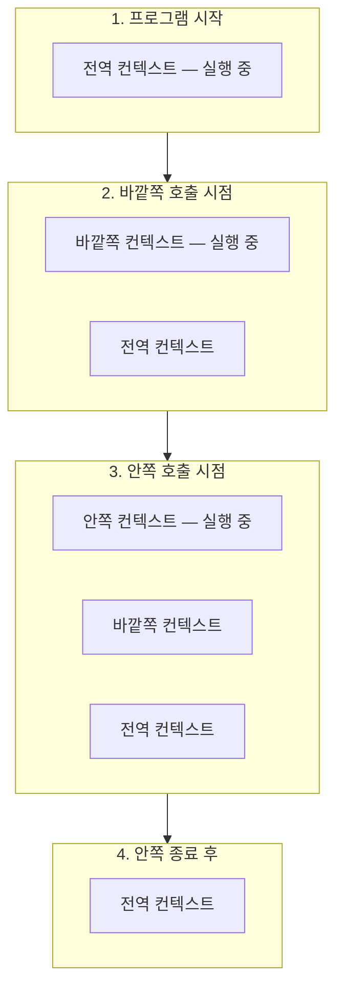
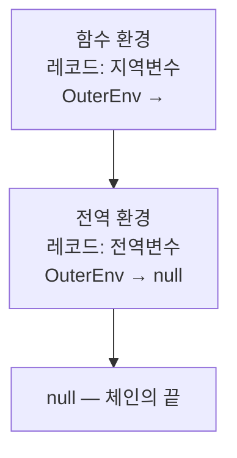
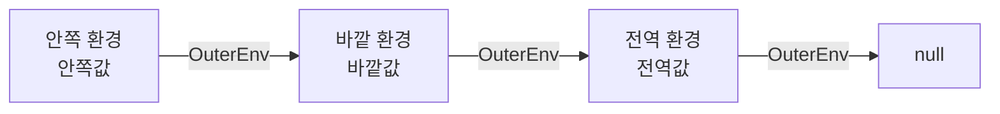
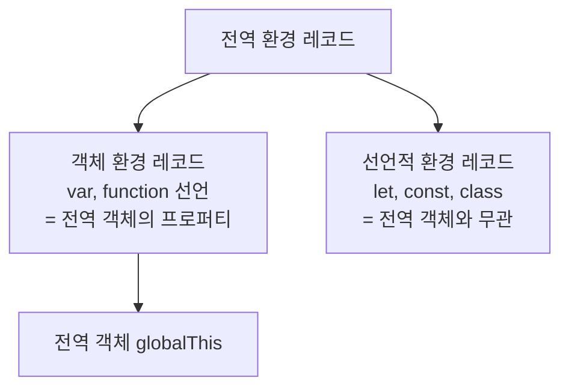
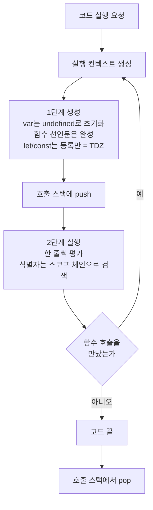

<Callout type="info">
  **이번 문서의 목표:** 이 파일을 다 읽으면 "이 식별자는 어떤 값을 갖는가"를 추측이 아니라 **규칙으로 계산**할 수 있게 된다. 호이스팅, TDZ, var와 let의 차이, 전역 변수의 정체가 하나의 그림 안에서 설명된다.
</Callout>

## 1. 왜 이 편이 이 과목의 심장인가

다음 코드의 출력을 정확히 예측할 수 있나요?

```js
console.log(a); // ?
console.log(b); // ?
var a = 1;
let b = 2;
```

첫 줄은 `undefined`, 둘째 줄은 `ReferenceError`입니다. "var는 호이스팅되고 let은 안 된다"는 흔한 설명은 **틀렸습니다.** 둘 다 호이스팅됩니다. 다르게 동작하는 진짜 이유를 이해하려면 엔진이 코드 실행 직전에 무엇을 만드는지를 봐야 합니다.

> **쉽게 말하면:** 엔진은 코드를 곧바로 읽어 내려가지 않습니다. 먼저 **작업대**를 하나 차리고, 그 위에 이 코드가 쓸 이름표들을 미리 늘어놓은 다음에야 한 줄씩 실행합니다. 그 작업대가 **실행 컨텍스트**입니다.

## 2. 실행 컨텍스트란 무엇인가

### 2-1. 이름 뜯어보기

**실행 컨텍스트**(execution context)는 두 단어입니다. execution은 "실행", context는 "문맥·맥락"입니다. 합치면 **코드가 실행되는 데 필요한 모든 맥락 정보를 담은 자료구조**입니다.

식당 주방에 비유해 봅시다. 요리사가 요리를 시작하려면 레시피만으로는 부족합니다. 도마 위에 재료가 놓여 있어야 하고, 지금 누구의 주문인지(this) 알아야 하고, 이 요리가 끝나면 어디로 돌아갈지도 알아야 합니다. 실행 컨텍스트는 이 "요리대 한 세트"입니다.

### 2-2. 언제 만들어지는가

실행 컨텍스트가 생기는 경우는 세 가지입니다.

1. **전역 코드** 실행 시작 – 전역 실행 컨텍스트가 딱 하나 만들어집니다.
2. **함수 호출** – 호출될 때마다 새 함수 실행 컨텍스트가 만들어집니다.
3. `eval` 코드 – 실무에서 쓰지 않으므로 다루지 않습니다.

여기서 중요한 건 2번입니다. **함수를 정의할 때가 아니라 호출할 때** 만들어집니다. 같은 함수를 100번 호출하면 실행 컨텍스트가 100개 만들어졌다가 사라집니다.

### 2-3. 무엇이 들어 있는가

명세 기준으로 실행 컨텍스트에는 크게 세 가지가 들어 있습니다.

| 구성 요소 | 영어 이름 | 하는 일 |
|---|---|---|
| 렉시컬 환경 | LexicalEnvironment | `let`·`const`·함수 매개변수 등 식별자와 값의 대응표 |
| 변수 환경 | VariableEnvironment | `var`로 선언된 식별자 전용 대응표 |
| this 바인딩 | ThisBinding | 이 코드에서 `this`가 가리킬 대상 |

`this` 이야기는 12편에서 통째로 다루므로, 이 편은 앞의 두 개 – **환경**에 집중합니다.

## 3. 호출 스택 — 컨텍스트가 쌓이는 방식

### 3-1. 스택이라는 자료구조

**호출 스택**(call stack, 콜 스택)은 실행 컨텍스트를 담아 두는 통입니다. stack은 영어로 "쌓아 올린 더미"인데, 자료구조로서의 스택은 **후입선출**(LIFO, Last In First Out — 마지막에 넣은 것이 가장 먼저 나옴) 규칙을 따릅니다.

식판을 쌓아 두는 통을 떠올리면 정확합니다. 새 식판은 맨 위에 얹고, 꺼낼 때도 맨 위 것부터 꺼냅니다. 중간에 있는 것을 뽑을 수는 없습니다.

### 3-2. 실제로 쌓이는 과정

```js
function 안쪽() {
  console.log("안쪽 실행");
}
function 바깥쪽() {
  안쪽();
}
바깥쪽();
```

이 코드가 실행되는 동안 호출 스택의 상태는 다음처럼 변합니다.



항상 **맨 위에 있는 컨텍스트가 현재 실행 중인 컨텍스트**입니다. 이를 **실행 중인 실행 컨텍스트**(running execution context)라고 부릅니다.

### 3-3. 스택이 넘치면

```js
function 무한() { 무한(); }
무한(); // RangeError: Maximum call stack size exceeded
```

재귀 함수가 종료 조건 없이 자기를 부르면 컨텍스트가 계속 쌓입니다. 통의 크기는 유한하므로 **스택 오버플로**(stack overflow, 스택 넘침)가 발생합니다. 이 에러를 만나면 "종료 조건이 빠졌거나, 잘못된 상호 재귀가 있다"로 바로 의심하면 됩니다.

<Callout type="warning">
  **자주 틀리는 점:** "JavaScript는 싱글 스레드라서 한 번에 한 가지만 한다"는 말과 호출 스택을 혼동하는 경우가 많습니다. 정확히는 **호출 스택이 하나뿐이라서** 한 번에 하나의 컨텍스트만 실행됩니다. 비동기 작업은 스택 밖(태스크 큐)에서 대기하다가 스택이 비면 올라옵니다. 27편 이벤트 루프에서 이어집니다.
</Callout>

## 4. 렉시컬 환경 — 이름표가 사는 곳

### 4-1. "렉시컬"이 무슨 뜻인가

**렉시컬**(lexical, 렉시컬)은 어원상 "어휘의, 낱말의"라는 뜻입니다. 프로그래밍에서는 "**소스 코드에 글자가 쓰여 있는 위치 기준**"이라는 의미로 씁니다. 즉 실행 중에 누가 누구를 호출했는지가 아니라, **코드에 적혀 있는 물리적 위치**로 결정된다는 뜻입니다.

이 개념의 반대편에 **동적 스코프**(dynamic scope)가 있습니다. 동적 스코프 언어에서는 "누가 나를 불렀는지"에 따라 변수 참조가 달라집니다. JavaScript는 동적 스코프가 아니라 **렉시컬 스코프**(정적 스코프, static scope)를 씁니다. 함수가 어디서 **호출**되었는지는 스코프에 아무 영향이 없고, 어디에 **정의**되었는지가 전부입니다.

### 4-2. 렉시컬 환경의 두 부분

**렉시컬 환경**(Lexical Environment)은 두 부분으로 이루어집니다.

1. **환경 레코드**(Environment Record) – 이 스코프에서 선언된 식별자와 값을 저장하는 실제 표
2. **외부 렉시컬 환경 참조**(OuterEnv) – 자신을 감싸고 있는 바깥 환경을 가리키는 화살표

두 번째가 결정적입니다. 이 화살표가 있어서 **스코프 체인**(scope chain)이 만들어집니다.



### 4-3. 식별자 검색 알고리즘

`이름`이라는 식별자를 만났을 때 엔진이 하는 일은 놀랄 만큼 단순합니다.

1. 현재 실행 중인 컨텍스트의 렉시컬 환경 레코드에 `이름`이 있는가? 있으면 그 값을 쓰고 끝.
2. 없으면 OuterEnv 화살표를 따라 바깥 환경으로 이동해 1번을 반복.
3. 전역 환경까지 갔는데도 없으면 → `ReferenceError`.

> **비유:** 회사에서 서류를 찾는 것과 같습니다. 먼저 내 책상 서랍을 뒤지고, 없으면 우리 팀 캐비닛, 그래도 없으면 회사 중앙 문서고. 문서고에도 없으면 "그런 서류 없습니다"가 됩니다. 중요한 건 **위로만 갈 수 있고 옆이나 아래로는 못 간다**는 점입니다.

이 단방향성이 스코프의 핵심 성질입니다. 바깥에서 안쪽 함수의 지역 변수를 볼 수 없는 이유가 바로 이것입니다 – 화살표가 안쪽을 향하지 않기 때문입니다.

### 4-4. 중첩된 스코프 체인 그려 보기

```js
const 전역값 = "전역";

function 바깥() {
  const 바깥값 = "바깥";

  function 안쪽() {
    const 안쪽값 = "안쪽";
    console.log(안쪽값, 바깥값, 전역값); // 셋 다 접근 가능
  }

  안쪽();
}
바깥();
```



`안쪽` 함수에서 `전역값`을 읽으면 세 칸을 거슬러 올라가 찾습니다. 반대로 `바깥` 함수에서 `안쪽값`을 읽으려 하면? 화살표는 바깥쪽만 향하므로 찾지 못하고 `ReferenceError`입니다.

## 5. 실행 컨텍스트의 두 단계

여기가 호이스팅의 정체가 드러나는 자리입니다. 실행 컨텍스트가 만들어질 때, 엔진은 **두 단계**를 거칩니다.

### 5-1. 1단계 — 생성 단계

코드를 한 줄도 실행하기 전에, 엔진은 그 스코프 전체를 훑으며 선언을 수집합니다. 명세는 이 과정을 **선언 인스턴스화**(Declaration Instantiation)라고 부릅니다. 이때 선언 종류마다 처리가 다릅니다.

| 선언 종류 | 생성 단계에서 하는 일 | 선언 전 접근 시 |
|---|---|---|
| `var` 변수 | 환경 레코드에 등록 + `undefined`로 초기화 | `undefined` |
| 함수 선언문 | 환경 레코드에 등록 + **함수 객체까지 완성해 할당** | 정상 호출됨 |
| `let` 변수 | 환경 레코드에 등록만, 값은 비워 둠 | ReferenceError |
| `const` 변수 | 환경 레코드에 등록만, 값은 비워 둠 | ReferenceError |
| `class` 선언 | 환경 레코드에 등록만, 값은 비워 둠 | ReferenceError |

**이 표 한 장이 이 편의 결론입니다.** 다섯 가지 모두 "등록"은 됩니다. 즉 **전부 호이스팅됩니다.** 다른 것은 **초기화 시점**뿐입니다.

### 5-2. 2단계 — 실행 단계

이제 코드를 한 줄씩 실행합니다. `var a = 1;`이라는 줄을 만나면, 등록은 이미 되어 있으므로 **할당만** 수행합니다. `let b = 2;`를 만나면 비어 있던 자리에 값을 채워 넣으며 **초기화**합니다.

### 5-3. 호이스팅이라는 말의 정체

**호이스팅**(hoisting)의 hoist는 "끌어올리다, 도르래로 들어올리다"라는 뜻입니다. 마치 선언문이 코드 맨 위로 물리적으로 올라간 것처럼 보인다고 해서 붙은 **별명**입니다.

<Callout type="warning">
  **자주 틀리는 점:** 호이스팅은 명세에 나오는 공식 용어가 아니라 현상을 설명하기 위한 별명입니다. 코드가 실제로 위로 이동하지 않습니다. **생성 단계에서 미리 등록되기 때문에** 위에서 접근할 수 있는 것처럼 보이는 것뿐입니다. "코드가 위로 올라간다"고 외우면 TDZ를 만나는 순간 설명이 무너집니다.
</Callout>

## 6. TDZ — 일시적 사각지대

### 6-1. 왜 이런 게 필요했나

`var`의 호이스팅은 편리해 보이지만 버그의 원인이었습니다.

```js
console.log(가격); // undefined — 에러가 아니라서 조용히 지나감
var 가격 = 1000;
```

오타로 선언 위에서 변수를 썼는데도 프로그램이 멈추지 않고 `undefined`가 흘러다닙니다. 나중에 엉뚱한 곳에서 `NaN`이 되어 터지고, 원인 추적에 몇 시간이 날아갑니다.

ES6는 `let`·`const`를 도입하면서 이 구멍을 막았습니다. **선언되기 전에는 접근 자체를 에러로 만든다**는 것입니다.

### 6-2. 정의

**TDZ**(Temporal Dead Zone, 일시적 사각지대)는 **스코프의 시작 지점부터 해당 변수의 선언문이 실행되는 지점까지의 구간**을 말합니다. 이 구간 안에서 그 변수에 접근하면 `ReferenceError`가 발생합니다.

- **Temporal**(템포럴): "시간적인". 위치가 아니라 **시간**의 문제라는 뜻입니다.
- **Dead Zone**(데드 존): "죽은 구역". 변수는 존재하지만 만질 수 없는 구역입니다.


"시간적"이라는 말이 핵심인 이유는 다음 예제가 보여줍니다.

```js
function 확인() {
  return 값; // 여기는 값의 선언보다 물리적으로 위지만...
}
let 값 = 10;
console.log(확인()); // 10 — 호출 시점이 선언 이후라서 정상
```

함수 몸통은 **호출될 때** 실행됩니다. 호출 시점이 `let 값 = 10;` 이후라면 TDZ는 이미 끝났습니다. 그래서 위치가 아니라 시간의 문제입니다.

### 6-3. TDZ가 존재한다는 증거

TDZ에 있는 변수는 "아직 없는 변수"와 다릅니다.

```js
console.log(없는이름);  // ReferenceError: 없는이름 is not defined
console.log(있는이름);  // ReferenceError: Cannot access '있는이름' before initialization
let 있는이름 = 1;
```

에러 메시지가 다릅니다. 두 번째는 "**초기화 전에는 접근할 수 없다**"고 말합니다. 즉 엔진은 그 이름의 존재를 이미 알고 있습니다 — 등록은 되어 있고 값만 비어 있다는 증거입니다.

### 6-4. 직접 실험해 보기

<CodePlayground
  template="vanilla"
  activeFile="/index.js"
  showConsole
  label="실험 1 — 호이스팅과 TDZ를 콘솔로 확인하기"
  files={{
    '/index.js': `// 1) var — 등록 + undefined 초기화가 이미 끝나 있다
console.log("var 선언 전:", varValue);
var varValue = "값";
console.log("var 선언 후:", varValue);

// 2) 함수 선언문 — 함수 객체까지 완성되어 있다
console.log("함수 선언 전 호출:", 미리호출());
function 미리호출() { return "나는 미리 준비됨"; }

// 3) let — 등록은 되었지만 값이 없다 (TDZ)
try {
  console.log(letValue);
} catch (e) {
  console.log("let TDZ 에러:", e.constructor.name, "-", e.message);
}
let letValue = "이제 초기화됨";
console.log("let 선언 후:", letValue);

// 4) 아예 없는 이름과 에러 메시지를 비교
try {
  console.log(존재하지않음);
} catch (e) {
  console.log("미선언 에러:", e.message);
}

// 5) 함수 표현식은 함수 선언문과 다르다
try {
  표현식함수();
} catch (e) {
  console.log("함수 표현식 호출:", e.constructor.name, "-", e.message);
}
const 표현식함수 = function () { return "표현식"; };

// 6) TDZ는 위치가 아니라 시간의 문제
function 나중에읽기() { return 나중값; }
let 나중값 = 42;
console.log("호출 시점이 선언 이후:", 나중에읽기());`,
  }}
/>

## 7. var vs let vs const — 세 가지 축의 차이

### 7-1. 스코프의 단위

`var`는 **함수 스코프**(function scope)입니다. 함수 몸통 전체가 하나의 방입니다. `if`, `for` 같은 블록은 `var`에게 벽이 되지 못합니다.

`let`·`const`는 **블록 스코프**(block scope)입니다. 중괄호로 감싼 모든 블록이 벽입니다.

```js
if (true) {
  var 바깥까지 = "샌다";
  let 안에만 = "갇힌다";
}
console.log(바깥까지); // "샌다"
console.log(안에만);   // ReferenceError
```

이 차이를 만드는 것이 실행 컨텍스트의 두 저장소입니다. `var`는 **변수 환경**(VariableEnvironment)에 기록되는데 이건 함수 단위로 한 번만 만들어집니다. `let`·`const`는 **렉시컬 환경**(LexicalEnvironment)에 기록되고, 블록에 진입할 때마다 새 블록 환경이 만들어져 스코프 체인에 끼어듭니다.

### 7-2. 재선언과 재할당

| 구분 | 재선언 | 재할당 | 스코프 | TDZ |
|---|---|---|---|---|
| `var` | 가능 | 가능 | 함수 | 없음 |
| `let` | 불가 | 가능 | 블록 | 있음 |
| `const` | 불가 | 불가 | 블록 | 있음 |

`var`의 재선언 허용은 특히 위험합니다. 큰 파일에서 같은 이름을 두 번 선언해도 에러가 없어, 앞의 값을 조용히 덮어씁니다.

<Callout type="warning">
  **자주 틀리는 점:** `const`가 막는 것은 **재할당**이지 **값의 변경**이 아닙니다. `const 목록 = [1,2];` 이후 `목록.push(3)`은 정상 동작합니다. 상자에 붙은 주소를 바꿀 수 없을 뿐, 그 주소에 있는 객체 내부는 얼마든지 바뀝니다. 진짜 불변이 필요하면 `Object.freeze`를 씁니다 – 7편 참고.
</Callout>

### 7-3. 반복문에서 드러나는 결정적 차이

```js
for (var i = 0; i < 3; i++) {}
console.log(i); // 3 — 루프 밖에서도 살아 있다

for (let j = 0; j < 3; j++) {}
console.log(j); // ReferenceError
```

더 중요한 차이가 있습니다. `let`으로 선언한 반복 변수는 **매 반복마다 새로운 바인딩**이 만들어집니다. 명세의 `CreatePerIterationEnvironment` 단계가 이 일을 합니다. 이 성질이 클로저와 만나면 유명한 문제가 풀리는데, 10편에서 정면으로 다룹니다.

## 8. 전역 환경의 정체

### 8-1. 전역은 특별하다

전역 실행 컨텍스트의 렉시컬 환경은 다른 것들과 구조가 조금 다릅니다. **전역 환경 레코드**(Global Environment Record)는 내부적으로 두 개의 레코드를 겹쳐 놓은 것입니다.

1. **객체 환경 레코드**(Object Environment Record) – 전역 객체와 연결됨. `var` 선언과 함수 선언문이 여기로 갑니다.
2. **선언적 환경 레코드**(Declarative Environment Record) – `let`, `const`, `class`가 여기로 갑니다.



### 8-2. 그래서 이런 차이가 생긴다

```js
var 브이 = 1;
let 엘 = 2;

console.log(globalThis.브이); // 1   — 전역 객체의 프로퍼티가 된다
console.log(globalThis.엘);   // undefined — 프로퍼티가 아니다
```

`var`로 선언한 전역 변수는 **전역 객체의 프로퍼티**가 됩니다. 브라우저에서는 `window`, Node.js에서는 `global`, 표준 이름은 `globalThis`입니다. 이 성질 때문에 `var` 전역 변수는 다른 스크립트가 덮어쓸 수 있어 위험합니다. `let`·`const`는 전역 스코프에 있어도 전역 객체에 붙지 않습니다.

### 8-3. 암묵적 전역

```js
function 실수() {
  선언안함 = 100; // var, let, const 없이 할당
}
실수();
console.log(선언안함); // 100 — 전역이 되어 버렸다
```

선언 키워드 없이 할당하면, 엔진은 스코프 체인을 끝까지 뒤진 뒤 없으면 **전역 객체에 프로퍼티를 만들어 버립니다.** 이를 **암묵적 전역**(implicit global)이라고 합니다. 변수 선언이 아니라 프로퍼티 생성이므로 호이스팅도 되지 않습니다.

`"use strict"`(4편)를 켜면 이 동작은 `ReferenceError`로 바뀝니다. 이것이 strict mode를 쓰는 가장 실용적인 이유 중 하나입니다.

## 9. 종합 실험 — 스코프 체인 추적하기

<CodePlayground
  template="vanilla"
  activeFile="/index.js"
  showConsole
  label="실험 2 — 스코프 체인과 렉시컬 스코프를 직접 확인"
  files={{
    '/index.js': `const 값 = "전역";

function 정의된곳() {
  console.log("나는 정의된 위치의 값을 본다:", 값);
}

function 호출하는곳() {
  const 값 = "호출한 함수 안";
  정의된곳(); // 호출 위치가 아니라 정의 위치가 기준
}

호출하는곳(); // "전역" — 렉시컬(정적) 스코프의 증거

// var는 블록을 뚫고 나온다
function 스코프단위() {
  if (true) {
    var 브이 = "var는 함수 스코프";
    let 엘 = "let은 블록 스코프";
    console.log("블록 안 let:", 엘);
  }
  console.log("블록 밖 var:", 브이);
  try {
    console.log(엘);
  } catch (e) {
    console.log("블록 밖 let:", e.constructor.name);
  }
}
스코프단위();

// 같은 함수를 여러 번 호출하면 컨텍스트도 여러 개
function 카운터붙이기(라벨) {
  let 지역 = 0;
  지역 += 1;
  console.log(라벨, "의 지역 변수:", 지역);
}
카운터붙이기("첫 호출");
카운터붙이기("둘째 호출"); // 서로 독립 — 매번 새 환경

// 전역 객체와의 관계
var 전역브이 = 1;
let 전역엘 = 2;
console.log("globalThis.전역브이:", globalThis.전역브이);
console.log("globalThis.전역엘:", globalThis.전역엘);`,
  }}
/>

## 10. 한 장으로 보는 전체 그림



## 핵심 정리

- **실행 컨텍스트**는 코드가 실행되는 데 필요한 맥락을 담은 자료구조이며, 전역 코드 시작 시 한 번, 그리고 **함수가 호출될 때마다** 새로 만들어진다.
- 컨텍스트들은 **호출 스택**에 후입선출로 쌓이고, 항상 맨 위 컨텍스트가 실행 중이다.
- **렉시컬 환경**은 식별자 표(환경 레코드)와 바깥을 가리키는 화살표(OuterEnv)로 이루어지며, 이 화살표들이 이어져 **스코프 체인**을 만든다. 검색은 안에서 밖으로 단방향이다.
- JavaScript는 **렉시컬 스코프**를 쓴다 – 함수가 어디서 호출되었는지가 아니라 **어디에 정의되었는지**가 스코프를 결정한다.
- `var`, 함수 선언문, `let`, `const`, `class`는 **모두 호이스팅된다**. 다른 것은 초기화 시점뿐이며, `let`·`const`·`class`는 초기화 전 구간이 **TDZ**가 되어 접근 시 ReferenceError가 난다.
- `var`는 함수 스코프이며 전역에서 선언하면 **전역 객체의 프로퍼티**가 되지만, `let`·`const`는 블록 스코프이며 전역 객체에 붙지 않는다.
- 선언 키워드 없는 할당은 **암묵적 전역**을 만들며, strict mode에서는 에러가 된다.

## 마무리 복습

<Quiz
  questionNumber={1}
  question="실행 컨텍스트가 새로 생성되는 시점으로 옳은 것은?"
  options={['함수를 정의할 때마다', '함수를 호출할 때마다', '변수를 선언할 때마다', '파일을 저장할 때마다']}
  correctAnswer={2}
  explanation="실행 컨텍스트는 전역 코드가 시작될 때 한 번, 그리고 함수가 호출될 때마다 새로 만들어진다. 정의 시점에는 함수 객체만 만들어질 뿐 실행 컨텍스트는 생기지 않는다."
  optionExplanations={['정의 시점에는 함수 객체가 만들어질 뿐이다', '정답 — 호출마다 새 컨텍스트가 만들어져 스택에 쌓인다', '변수 선언은 기존 컨텍스트의 환경 레코드에 기록될 뿐이다', '실행과 무관한 동작이다']}
/>

<Quiz
  questionNumber={2}
  question="다음 중 호이스팅에 대한 설명으로 가장 정확한 것은?"
  options={['선언문이 실제로 코드 맨 위로 이동한다', 'var만 호이스팅되고 let과 const는 호이스팅되지 않는다', 'var, let, const, function 선언 모두 생성 단계에 등록되며 초기화 시점만 다르다', '호이스팅은 실행 단계에서 일어난다']}
  correctAnswer={3}
  explanation="다섯 종류의 선언 모두 생성 단계에서 환경 레코드에 등록된다. var는 undefined로 초기화되고 함수 선언문은 함수 객체까지 완성되지만, let·const·class는 값이 비어 있어 TDZ가 생긴다. 코드가 물리적으로 이동하지는 않는다."
  optionExplanations={['코드는 이동하지 않는다 — 미리 등록될 뿐이다', 'let과 const도 등록은 된다', '정답 — 차이는 등록 여부가 아니라 초기화 시점이다', '호이스팅에 해당하는 등록은 생성 단계에서 일어난다']}
/>

<Quiz
  questionNumber={3}
  question="TDZ(Temporal Dead Zone)에 대한 설명으로 옳지 않은 것은?"
  options={['스코프 시작부터 선언문 실행 전까지의 구간이다', '이 구간에서 접근하면 ReferenceError가 발생한다', '선언되지 않은 변수와 같은 에러 메시지가 나온다', '위치가 아니라 실행 시점의 문제이므로 함수 안에서는 호출 시점에 따라 달라진다']}
  correctAnswer={3}
  explanation="TDZ 변수는 이미 등록되어 있으므로 초기화 전 접근이라는 메시지가 나오고, 아예 선언되지 않은 이름은 정의되지 않았다는 메시지가 나온다. 메시지가 다르다는 사실 자체가 등록은 되어 있다는 증거다."
  optionExplanations={['TDZ 구간의 정의가 맞다', 'ReferenceError가 맞다', '정답(틀린 설명) — 에러 메시지가 서로 다르다', '함수 몸통은 호출 시점에 실행되므로 시간 기준이 맞다']}
/>

<Quiz
  questionNumber={4}
  question="다음 코드의 결과로 옳은 것은? 전역에 const 값 = 전역문자열 이 있고, 함수 A는 그 값을 출력한다. 함수 B는 자기 안에 같은 이름의 지역 변수를 만든 뒤 A를 호출한다. B를 호출하면?"
  options={['B 안의 지역 변수 값이 출력된다', '전역의 값이 출력된다', 'ReferenceError가 발생한다', 'undefined가 출력된다']}
  correctAnswer={2}
  explanation="JavaScript는 렉시컬(정적) 스코프를 사용한다. 함수 A의 스코프 체인은 A가 정의된 위치를 기준으로 만들어지므로, 누가 호출했는지와 관계없이 전역의 값을 참조한다."
  optionExplanations={['호출한 곳의 변수를 보는 것은 동적 스코프이며 JavaScript는 그렇지 않다', '정답 — 정의된 위치가 스코프를 결정한다', '전역에 값이 있으므로 에러가 나지 않는다', '값이 초기화되어 있으므로 undefined가 아니다']}
/>

<Quiz
  questionNumber={5}
  question="var로 선언한 전역 변수와 let으로 선언한 전역 변수의 차이로 옳은 것은?"
  options={['var는 전역 객체의 프로퍼티가 되고 let은 되지 않는다', '둘 다 전역 객체의 프로퍼티가 된다', 'let만 전역 객체의 프로퍼티가 된다', '둘 다 전역 객체와 무관하다']}
  correctAnswer={1}
  explanation="전역 환경 레코드는 객체 환경 레코드와 선언적 환경 레코드로 나뉜다. var와 함수 선언문은 객체 환경 레코드로 가서 전역 객체의 프로퍼티가 되지만, let·const·class는 선언적 환경 레코드에 저장되어 전역 객체에 붙지 않는다."
  optionExplanations={['정답 — 저장되는 레코드가 서로 다르다', 'let은 전역 객체의 프로퍼티가 되지 않는다', '방향이 반대다', 'var는 전역 객체와 관련이 있다']}
/>

<Quiz
  questionNumber={6}
  question="호출 스택(call stack)에 대한 설명으로 옳지 않은 것은?"
  options={['후입선출 방식으로 실행 컨텍스트를 관리한다', '맨 위에 있는 컨텍스트가 현재 실행 중인 컨텍스트다', '종료 조건 없는 재귀는 스택 오버플로를 일으킨다', '중간에 있는 컨텍스트를 골라서 먼저 제거할 수 있다']}
  correctAnswer={4}
  explanation="스택은 마지막에 넣은 것부터 꺼내는 자료구조이므로 중간 항목을 임의로 꺼낼 수 없다. 나머지 설명은 모두 옳다."
  optionExplanations={['LIFO가 스택의 정의다', '실행 중인 실행 컨텍스트는 항상 맨 위다', '컨텍스트가 계속 쌓여 한계를 넘으면 RangeError가 난다', '정답(틀린 설명) — 스택은 중간 접근을 허용하지 않는다']}
/>

<Quiz
  questionNumber={7}
  question="함수 안에서 선언 키워드 없이 어떤 이름에 값을 할당했을 때 일어나는 일로 옳은 것은?"
  options={['문법 에러가 발생해 실행되지 않는다', '함수의 지역 변수가 만들어진다', '전역 객체의 프로퍼티가 만들어지는 암묵적 전역이 발생한다', '해당 줄이 무시된다']}
  correctAnswer={3}
  explanation="스코프 체인을 끝까지 검색해도 그 이름이 없으면 엔진은 전역 객체에 프로퍼티를 만들어 할당한다. 변수 선언이 아니라 프로퍼티 생성이므로 호이스팅되지 않으며, strict mode에서는 ReferenceError가 된다."
  optionExplanations={['비엄격 모드에서는 에러 없이 동작한다', '지역 변수가 아니라 전역 프로퍼티가 만들어진다', '정답 — 암묵적 전역이며 strict mode에서 막힌다', '무시되지 않고 실제로 값이 할당된다']}
/>

<Quiz
  questionNumber={8}
  question="const로 선언한 배열에 push로 요소를 추가하면 어떻게 되는가?"
  options={['TypeError가 발생한다', '정상적으로 추가된다 — const는 재할당만 막기 때문이다', 'SyntaxError가 발생한다', '배열이 새로 복사되어 원본은 그대로다']}
  correctAnswer={2}
  explanation="const는 바인딩에 다른 값을 다시 할당하는 것을 막을 뿐, 그 값이 가리키는 객체의 내부 변경은 막지 않는다. 내부까지 막으려면 Object.freeze 같은 별도 수단이 필요하다."
  optionExplanations={['재할당이 아니므로 에러가 나지 않는다', '정답 — 재할당 금지와 불변은 다른 개념이다', '문법 오류가 아니다', '원본 배열이 그대로 변경된다']}
/>

## 참고 자료

- [ECMAScript Language Specification - Executable Code and Execution Contexts](https://262.ecma-international.org/)
- [MDN - Closures 가이드의 렉시컬 스코프 설명](https://developer.mozilla.org/en-US/docs/Web/JavaScript/Guide/Closures)
- [MDN - Hoisting 용어 해설](https://developer.mozilla.org/en-US/docs/Glossary/Hoisting)
- [MDN - let 선언과 TDZ](https://developer.mozilla.org/en-US/docs/Web/JavaScript/Reference/Statements/let)
- [MDN - var 선언](https://developer.mozilla.org/en-US/docs/Web/JavaScript/Reference/Statements/var)
