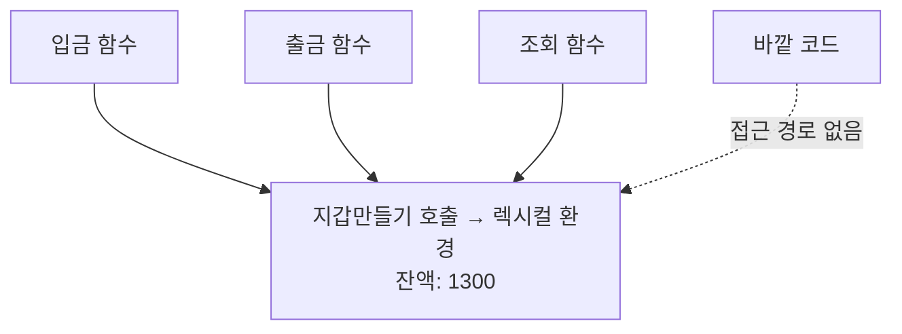
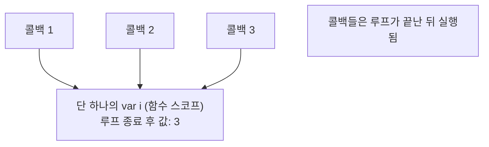
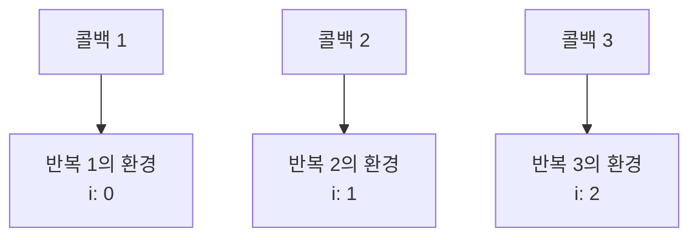

<Callout type="info">
  **이번 문서의 목표:** 이 파일을 다 읽으면 클로저를 "어려운 개념"이 아니라 **9편에서 배운 렉시컬 환경의 자연스러운 귀결**로 이해하게 되고, 루프와 비동기에서 생기는 클로저 버그를 원인부터 진단해 고칠 수 있게 된다.
</Callout>

## 1. 이상한 현상에서 출발하기

먼저 설명 없이 코드부터 봅시다.

```js
function 카운터만들기() {
  let 횟수 = 0;
  return function () {
    횟수 += 1;
    return 횟수;
  };
}

const 세기 = 카운터만들기();
console.log(세기()); // 1
console.log(세기()); // 2
console.log(세기()); // 3
```

여기서 이상한 점이 있습니다. `카운터만들기()`는 **이미 끝났습니다.** 9편에서 배운 대로라면, 함수가 끝나면 그 실행 컨텍스트는 호출 스택에서 제거됩니다. 그런데 그 안의 지역 변수 `횟수`는 사라지기는커녕, 호출할 때마다 값을 기억하고 있습니다.

> **쉽게 말하면:** 함수는 끝났는데 그 함수의 방(변수 저장소)은 안 치워졌습니다. 안에서 만들어진 함수가 그 방의 열쇠를 들고 나갔기 때문입니다.

이 현상을 **클로저**(closure, 클로저)라고 부릅니다.

## 2. 클로저의 정의와 이름의 유래

### 2-1. 정의

MDN의 정의를 우리 언어로 옮기면 이렇습니다.

**클로저란, 함수와 그 함수가 선언된 렉시컬 환경의 조합**입니다.

영어 close에는 "닫다"라는 뜻 말고 "**에워싸다, 둘러싸다**"라는 뜻이 있습니다. closure는 여기서 온 말로, **함수가 자신이 태어난 환경을 함께 껴안고 다닌다**는 이미지입니다. 수학에서 "닫혀 있다"(closed)는 표현과 뿌리가 같습니다 — 필요한 것이 바깥에 새지 않고 안에 다 들어 있다는 뜻입니다.

### 2-2. 성립 조건

클로저가 되려면 두 가지가 필요합니다.

1. **중첩**: 함수 안에 함수가 정의되어 있어야 한다.
2. **생존**: 안쪽 함수가 바깥 함수보다 오래 살아남아야 한다 — 반환되거나, 어딘가에 저장되거나, 콜백으로 넘겨지거나.

그리고 실용적으로 한 가지가 더 붙습니다.

3. **참조**: 안쪽 함수가 바깥 함수의 변수를 실제로 참조해야 한다. (참조하지 않으면 엔진이 최적화로 그 환경을 버릴 수 있습니다.)

<Callout type="warning">
  **자주 틀리는 점:** "클로저 = 함수를 반환하는 함수"로 외우면 절반만 맞습니다. 반환이 아니어도 됩니다. `setTimeout`에 넘긴 콜백, 이벤트 리스너로 등록한 함수, 배열에 저장한 함수 모두 클로저입니다. **바깥 함수보다 오래 사는 경로**면 무엇이든 됩니다.
</Callout>

## 3. 왜 변수가 살아남는가 — 렉시컬 환경으로 설명

9편에서 배운 두 가지를 기억해 봅시다.

- 함수 객체는 만들어질 때 자신이 정의된 위치의 렉시컬 환경을 **내부 슬롯 `[[Environment]]`** 에 기록해 둔다.
- 실행 컨텍스트가 스택에서 제거되어도, **렉시컬 환경 자체는 별개의 메모리 공간**이다.

이 둘을 합치면 답이 나옵니다. `카운터만들기`가 끝나면 그 **실행 컨텍스트**는 스택에서 사라집니다. 하지만 반환된 안쪽 함수가 `[[Environment]]`로 그 **렉시컬 환경**을 계속 가리키고 있으므로, 가비지 컬렉터(garbage collector, 쓰레기 수집기 — 30편)는 그 환경을 "아직 도달 가능하다"고 판단하고 치우지 않습니다.


핵심은 **실행 컨텍스트와 렉시컬 환경은 다른 것**이라는 점입니다. 컨텍스트는 스택에 쌓였다 사라지는 임시 작업대이고, 렉시컬 환경은 힙(heap, 자유롭게 할당되는 메모리 영역)에 있는 상자입니다. 상자를 가리키는 손이 하나라도 남아 있으면 상자는 남습니다.

> **비유:** 호텔 방을 예약해 체크아웃했는데, 내가 만든 사물함 열쇠를 친구에게 줬다면 그 사물함은 계속 유지됩니다. 프런트(엔진)는 열쇠를 가진 사람이 아무도 없을 때만 사물함을 비웁니다.

### 캡처인가 참조인가

흔히 "클로저가 변수를 **캡처**(capture, 붙잡음)한다"고 표현하는데, 정확히는 **값을 복사해 두는 것이 아니라 환경을 참조**하는 것입니다. 이 차이가 실제 동작을 가릅니다.

```js
function 만들기() {
  let 값 = 1;
  const 읽기 = () => 값;
  값 = 99;        // 반환 전에 바꿔 버림
  return 읽기;
}
console.log(만들기()()); // 99 — 1이 아니다
```

값을 복사해 두었다면 1이 나왔을 겁니다. 환경을 참조하므로 마지막 값 99가 나옵니다. **클로저는 스냅샷이 아니라 살아 있는 연결입니다.**

## 4. 직접 확인하는 실험

<CodePlayground
  template="vanilla"
  activeFile="/index.js"
  showConsole
  label="실험 1 — 클로저는 값을 복사하지 않고 환경을 공유한다"
  files={{
    '/index.js': `// 1) 함수가 끝나도 변수는 살아남는다
function 카운터만들기(시작) {
  let 횟수 = 시작;
  return function () {
    횟수 += 1;
    return 횟수;
  };
}
const 세기A = 카운터만들기(0);
const 세기B = 카운터만들기(100);
console.log("A:", 세기A(), 세기A(), 세기A());
console.log("B:", 세기B(), 세기B());
console.log("A와 B는 서로 다른 환경을 갖는다");

// 2) 같은 호출에서 나온 함수들은 환경을 공유한다
function 지갑만들기() {
  let 잔액 = 1000;
  return {
    입금: (금액) => (잔액 += 금액),
    출금: (금액) => (잔액 -= 금액),
    조회: () => 잔액,
  };
}
const 내지갑 = 지갑만들기();
내지갑.입금(500);
내지갑.출금(200);
console.log("잔액:", 내지갑.조회());
console.log("잔액 직접 접근 시도:", 내지갑.잔액); // undefined — 은닉됨

// 3) 스냅샷이 아니라 살아 있는 참조
function 확인용() {
  let 값 = 1;
  const 읽기 = () => 값;
  값 = 99;
  return 읽기;
}
console.log("복사였다면 1, 참조라면 99 →", 확인용()());

// 4) 참조하지 않으면 클로저의 의미가 없다
function 참조안함() {
  let 안쓰는값 = "버려짐";
  return () => "나는 바깥 변수를 안 쓴다";
}
console.log(참조안함()());`,
  }}
/>

## 5. 클로저의 첫 번째 용도 — 상태 은닉

### 왜 필요한가

객체에 상태를 그냥 프로퍼티로 두면 누구나 마음대로 바꿉니다.

```js
const 지갑 = { 잔액: 1000 };
지갑.잔액 = -999999; // 아무 검증 없이 통과
```

은행 시스템이 이렇다면 큰일입니다. 우리가 원하는 것은 "**잔액은 정해진 통로로만 바꿀 수 있다**"입니다. 이를 **정보 은닉**(information hiding) 또는 **캡슐화**(encapsulation, 캡슐로 감싸기)라고 부릅니다.

### 클로저로 만드는 비공개 상태

```js
function 지갑만들기(초기잔액) {
  let 잔액 = 초기잔액; // 바깥에서 절대 닿을 수 없다

  return {
    입금(금액) {
      if (금액 <= 0) throw new Error("입금액은 양수여야 합니다");
      잔액 += 금액;
      return 잔액;
    },
    출금(금액) {
      if (금액 > 잔액) throw new Error("잔액 부족");
      잔액 -= 금액;
      return 잔액;
    },
    조회() { return 잔액; },
  };
}
```

`잔액`은 `지갑만들기`의 지역 변수이므로 바깥에서 접근할 문법 자체가 없습니다. 오직 반환된 세 함수만이 그 환경을 공유합니다. 이것이 **모듈 패턴**(module pattern)의 핵심 아이디어이고, ES6의 `class` private 필드(14편)와 ES 모듈(29편)이 나오기 전까지 JavaScript에서 캡슐화를 구현하는 사실상 유일한 방법이었습니다.



### 자주 쓰이는 파생 패턴

**한 번만 실행되는 함수**

```js
function 한번만(원본) {
  let 실행됨 = false;
  let 결과;
  return function (...인수) {
    if (!실행됨) {
      실행됨 = true;
      결과 = 원본(...인수);
    }
    return 결과;
  };
}
```

**메모이제이션** – 계산 결과를 기억해 두는 기법입니다. memoization은 memo(메모)에서 온 말로, "적어 두고 다시 쓴다"는 뜻입니다.

```js
function 기억하기(계산함수) {
  const 저장소 = new Map();
  return function (입력) {
    if (저장소.has(입력)) return 저장소.get(입력);
    const 결과 = 계산함수(입력);
    저장소.set(입력, 결과);
    return 결과;
  };
}
```

두 패턴 모두 "함수 호출 사이에 살아남는 저장 공간"이 필요하고, 그 공간을 전역 변수로 두지 않으려고 클로저를 씁니다.

## 6. 클로저의 대표 함정 ① — 루프와 var

### 문제 상황

```js
for (var i = 0; i < 3; i++) {
  setTimeout(function () {
    console.log(i);
  }, 0);
}
// 기대: 0 1 2
// 실제: 3 3 3
```

이 코드는 JavaScript 면접 단골 문제입니다. 왜 이렇게 될까요?

### 원인 분석

두 가지가 겹쳐서 생깁니다.

**첫째**, `var i`는 **함수 스코프**입니다. 루프가 세 번 돌아도 `i`는 **단 하나**입니다. 세 개의 콜백 함수는 전부 **같은 렉시컬 환경의 같은 `i`**를 가리킵니다.

**둘째**, `setTimeout`의 콜백은 **나중에** 실행됩니다. 지연 시간이 0이어도 마찬가지입니다. 콜백은 태스크 큐에 들어갔다가 호출 스택이 빈 뒤에야 실행되므로(27편), 그때는 루프가 이미 끝나 `i`가 3이 되어 있습니다.



### 해결책 1 — let 쓰기

```js
for (let i = 0; i < 3; i++) {
  setTimeout(() => console.log(i), 0); // 0 1 2
}
```

9편에서 언급한 그 성질입니다. `let`으로 선언한 반복 변수는 **매 반복마다 새 바인딩**이 만들어집니다. 명세는 반복이 한 번 끝날 때마다 새 환경을 만들고 이전 값을 복사해 넣는데(`CreatePerIterationEnvironment`), 그래서 콜백 세 개가 **각자 다른 환경의 다른 `i`**를 붙잡게 됩니다.



### 해결책 2 — IIFE로 환경 만들기

`let`이 없던 시절에는 반복마다 함수 스코프를 직접 만들었습니다.

```js
for (var i = 0; i < 3; i++) {
  (function (복사본) {
    setTimeout(() => console.log(복사본), 0);
  })(i);
}
```

매 반복마다 IIFE(8편)가 호출되어 새 실행 컨텍스트와 새 환경이 만들어지고, 매개변수 `복사본`에 그 시점의 `i` 값이 복사됩니다. 원리는 `let` 해법과 정확히 같습니다 — **반복마다 별개의 환경을 만든다**는 것.

## 7. 클로저의 대표 함정 ② — 오래된 값 붙잡기

비동기 코드에서 더 미묘한 형태로 나타납니다.

```js
let 현재사용자 = "가나";

function 인사예약() {
  setTimeout(() => console.log("안녕, " + 현재사용자), 1000);
}

인사예약();
현재사용자 = "다라"; // 1초 안에 바뀜
// 1초 뒤 출력: "안녕, 다라"
```

클로저는 스냅샷이 아니라 살아 있는 참조이므로, **콜백이 실행되는 시점의 값**을 읽습니다. 이것이 원하는 동작일 때도 있고 버그일 때도 있습니다. "예약한 시점의 값"을 쓰고 싶다면 명시적으로 복사해야 합니다.

```js
function 인사예약() {
  const 예약시점사용자 = 현재사용자; // 값 복사
  setTimeout(() => console.log("안녕, " + 예약시점사용자), 1000);
}
```

이 패턴은 React의 이벤트 핸들러에서 "stale closure"(스테일 클로저, 낡은 클로저)라는 이름으로 자주 등장합니다. 원인은 지금 본 것과 완전히 동일합니다.

## 8. 실험 — 함정을 직접 재현하고 고치기

<CodePlayground
  template="vanilla"
  activeFile="/index.js"
  showConsole
  label="실험 2 — 루프 클로저 함정과 세 가지 해법 비교"
  files={{
    '/index.js': `console.log("=== 1. var + setTimeout : 함정 재현 ===");
for (var i = 0; i < 3; i++) {
  setTimeout(function () {
    console.log("var i =", i);
  }, 0);
}

setTimeout(function () {
  console.log("=== 2. let : 반복마다 새 바인딩 ===");
  for (let j = 0; j < 3; j++) {
    setTimeout(function () {
      console.log("let j =", j);
    }, 0);
  }
}, 20);

setTimeout(function () {
  console.log("=== 3. IIFE : 반복마다 새 환경 ===");
  for (var k = 0; k < 3; k++) {
    (function (복사본) {
      setTimeout(function () {
        console.log("IIFE 복사본 =", 복사본);
      }, 0);
    })(k);
  }
}, 40);

setTimeout(function () {
  console.log("=== 4. 즉시 실행이면 함정이 없다 ===");
  for (var m = 0; m < 3; m++) {
    (function () { console.log("즉시 실행 m =", m); })();
  }
}, 60);

setTimeout(function () {
  console.log("=== 5. 살아 있는 참조 vs 값 복사 ===");
  let 사용자 = "가나";
  const 참조판 = () => "참조판: " + 사용자;
  const 복사본 = 사용자;
  const 복사판 = () => "복사판: " + 복사본;
  사용자 = "다라";
  console.log(참조판());
  console.log(복사판());
}, 80);`,
  }}
/>

콘솔 출력을 보면 1번만 `3 3 3`이 나오고 나머지는 의도대로 동작합니다. 4번이 정상인 이유도 중요합니다 — 콜백을 나중에 실행하지 않고 **즉시** 실행하면, 루프가 끝나기 전이므로 `m`이 아직 그 시점의 값입니다. 즉 이 함정은 **클로저 자체의 문제가 아니라 "하나의 변수를 공유"와 "나중에 실행"이 겹칠 때만** 생깁니다.

## 9. 클로저와 메모리

클로저는 변수를 살려 두므로, 잘못 쓰면 메모리를 붙잡고 놓지 않습니다.

```js
function 큰데이터붙잡기() {
  const 거대배열 = new Array(1000000).fill("데이터");
  return function () {
    return "나는 거대배열을 안 쓰는데도 환경에 매달려 있을 수 있다";
  };
}
```

현대 엔진은 최적화를 해서, 안쪽 함수가 실제로 참조하는 변수만 환경에 남기는 경우가 많습니다. 하지만 보장된 동작은 아니므로, **필요 없어진 클로저는 참조를 끊어 주는 것**이 안전합니다.

```js
let 핸들러 = 만들기();
핸들러 = null; // 환경까지 수거 대상이 된다
```

이벤트 리스너를 등록만 하고 해제하지 않으면 리스너 함수가 계속 살아 있고, 그 함수가 붙잡은 환경도 함께 살아남습니다. **메모리 누수**(memory leak)의 흔한 원인입니다. 도달 가능성(reachability)과 GC의 전체 그림은 30편에서 다룹니다.

<Callout type="warning">
  **자주 틀리는 점:** "클로저는 메모리 낭비이니 피해야 한다"는 조언은 과장입니다. 클로저 없이는 콜백·이벤트 핸들러·모듈 패턴이 성립하지 않습니다. 문제는 클로저 자체가 아니라 **필요 없어진 뒤에도 참조를 끊지 않는 것**입니다.
</Callout>

## 10. 클로저를 알아보는 눈

마지막으로 "이게 클로저인가?"를 판별하는 체크리스트를 정리합니다.

| 코드 형태 | 클로저인가 | 이유 |
|---|---|---|
| 함수를 반환하는 함수 | 예 | 안쪽 함수가 바깥보다 오래 산다 |
| `setTimeout` 콜백이 바깥 변수 참조 | 예 | 콜백이 나중에 실행된다 |
| 이벤트 리스너가 바깥 변수 참조 | 예 | 리스너가 계속 살아 있다 |
| 배열 메서드 콜백 – `map`, `filter` | 예 | 형식상 클로저지만 즉시 끝나 티가 안 난다 |
| 중첩 없이 전역 변수만 쓰는 함수 | 아니오 | 전역은 어차피 계속 산다 |
| 안쪽 함수가 바깥 변수를 전혀 안 씀 | 실질적으로 아니오 | 붙잡을 것이 없다 |

## 핵심 정리

- **클로저는 함수와 그 함수가 선언된 렉시컬 환경의 조합**이다. 9편의 렉시컬 환경 개념에서 자동으로 따라 나오는 결과이지, 별도의 특별한 기능이 아니다.
- 실행 컨텍스트는 스택에서 사라져도 **렉시컬 환경은 참조가 남아 있는 한 살아남는다**. 이것이 지역 변수가 함수 종료 후에도 유지되는 이유다.
- 클로저는 값을 복사한 스냅샷이 아니라 **살아 있는 참조**다. 나중에 값이 바뀌면 클로저도 바뀐 값을 본다.
- 대표 용도는 **상태 은닉**이다 – 지역 변수를 비공개로 두고 정해진 함수로만 접근하게 하는 모듈 패턴, 메모이제이션, 일회성 실행이 모두 여기서 나온다.
- 루프 함정의 원인은 클로저가 아니라 **`var`의 단일 바인딩 + 콜백의 지연 실행**의 조합이다. `let`이나 IIFE로 **반복마다 새 환경**을 만들면 해결된다.
- 클로저는 환경을 살려 두므로, 필요 없어진 참조는 끊어야 **메모리 누수**를 피할 수 있다.

## 마무리 복습

<Quiz
  questionNumber={1}
  question="클로저의 정의로 가장 정확한 것은?"
  options={['다른 함수를 인수로 받는 함수', '함수와 그 함수가 선언된 렉시컬 환경의 조합', '실행이 끝나면 즉시 메모리에서 사라지는 함수', '이름이 없는 익명 함수']}
  correctAnswer={2}
  explanation="클로저는 함수 객체와 그 함수가 정의된 위치의 렉시컬 환경이 함께 묶인 것을 말한다. 함수를 인수로 받는 것은 고차 함수이고, 익명 여부와도 무관하다."
  optionExplanations={['그것은 고차 함수의 설명이다', '정답 — 함수 더하기 그 함수가 태어난 환경이다', '오히려 환경이 살아남는 것이 클로저의 특징이다', '이름 유무와는 관계가 없다']}
/>

<Quiz
  questionNumber={2}
  question="바깥 함수의 실행이 끝났는데도 그 지역 변수가 살아 있는 이유로 옳은 것은?"
  options={['실행 컨텍스트가 호출 스택에서 제거되지 않기 때문', '지역 변수가 자동으로 전역 변수로 승격되기 때문', '안쪽 함수가 그 렉시컬 환경을 참조하고 있어 수거 대상에서 제외되기 때문', '엔진이 모든 지역 변수를 영구 보관하기 때문']}
  correctAnswer={3}
  explanation="실행 컨텍스트는 스택에서 제거되지만 렉시컬 환경은 별개의 메모리 공간이다. 안쪽 함수 객체가 내부 슬롯으로 그 환경을 계속 가리키므로 도달 가능한 상태가 되어 수거되지 않는다."
  optionExplanations={['컨텍스트는 정상적으로 제거된다', '전역 변수로 승격되는 일은 없다', '정답 — 도달 가능성 때문에 환경이 유지된다', '참조가 끊기면 정상적으로 수거된다']}
/>

<Quiz
  questionNumber={3}
  question="var를 사용한 for 루프 안에서 setTimeout 콜백이 반복 변수를 출력할 때, 마지막 값만 세 번 출력되는 원인으로 옳은 것은?"
  options={['setTimeout이 콜백을 세 번만 실행하기 때문', 'var 변수가 하나뿐이라 콜백들이 같은 변수를 공유하고, 콜백은 루프가 끝난 뒤 실행되기 때문', '클로저가 값을 복사해 두기 때문', 'setTimeout의 지연 시간이 0이기 때문']}
  correctAnswer={2}
  explanation="var는 함수 스코프이므로 반복 변수 바인딩이 하나뿐이고, 세 콜백이 같은 변수를 참조한다. 게다가 콜백은 호출 스택이 빈 뒤 실행되므로 그때는 루프가 이미 끝나 최종값이 되어 있다."
  optionExplanations={['콜백은 정상적으로 세 번 실행되며 값만 같다', '정답 — 단일 바인딩과 지연 실행이 겹친 결과다', '오히려 복사하지 않고 참조하기 때문에 생기는 문제다', '지연 시간을 늘려도 결과는 같다']}
/>

<Quiz
  questionNumber={4}
  question="위 문제 상황에서 var를 let으로 바꾸면 의도대로 동작하는 이유는?"
  options={['let이 setTimeout보다 먼저 실행되기 때문', 'let 반복 변수는 매 반복마다 새로운 바인딩이 만들어져 콜백들이 서로 다른 환경을 참조하기 때문', 'let은 클로저를 만들지 않기 때문', 'let이 값을 문자열로 변환하기 때문']}
  correctAnswer={2}
  explanation="명세는 let으로 선언한 for문의 반복 변수에 대해 반복마다 새 환경을 만들고 값을 이어받게 한다. 그 결과 각 콜백이 자기 반복의 환경을 붙잡게 되어 서로 다른 값을 본다."
  optionExplanations={['실행 순서와는 무관하다', '정답 — 반복마다 별개의 바인딩이 생긴다', 'let을 써도 클로저는 그대로 만들어진다', '타입 변환과는 관계가 없다']}
/>

<Quiz
  questionNumber={5}
  question="다음 중 클로저를 이용한 상태 은닉 패턴에 대한 설명으로 옳지 않은 것은?"
  options={['바깥 함수의 지역 변수는 반환된 함수들만 접근할 수 있다', '같은 호출에서 반환된 여러 함수는 하나의 환경을 공유한다', '바깥 함수를 여러 번 호출하면 호출마다 독립적인 상태가 만들어진다', '은닉된 변수는 점 표기법으로 객체에서 직접 읽을 수 있다']}
  correctAnswer={4}
  explanation="은닉된 값은 지역 변수일 뿐 반환 객체의 프로퍼티가 아니므로 점 표기법으로 접근할 문법 자체가 없다. 접근하면 undefined가 나온다. 나머지 세 가지는 모두 옳다."
  optionExplanations={['접근 통로가 그 함수들뿐인 것이 은닉의 핵심이다', '한 번의 호출이 만든 환경을 함께 공유한다', '호출마다 새 환경이 만들어져 상태가 분리된다', '정답(틀린 설명) — 프로퍼티가 아니므로 직접 읽을 수 없다']}
/>

<Quiz
  questionNumber={6}
  question="클로저가 값을 복사하지 않고 환경을 참조한다는 사실이 드러나는 상황은?"
  options={['함수를 반환하기 전에 캡처된 변수의 값을 바꾸면, 반환된 함수가 바뀐 값을 읽는다', '함수를 반환한 뒤에는 어떤 변경도 반영되지 않는다', '클로저가 만들어지는 순간 모든 변수가 상수가 된다', '클로저 안에서는 변수를 읽을 수만 있고 쓸 수 없다']}
  correctAnswer={1}
  explanation="클로저는 그 시점 값을 복사한 스냅샷이 아니라 환경에 대한 살아 있는 연결이다. 그래서 나중에 값이 바뀌면 클로저도 바뀐 값을 본다. 클로저 안에서 값을 수정하는 것도 가능하다."
  optionExplanations={['정답 — 살아 있는 참조임을 보여주는 대표 예다', '반환 후 변경도 반영된다', '상수가 되지 않는다', '증감 연산 등 쓰기도 가능하다']}
/>

<Quiz
  questionNumber={7}
  question="클로저와 메모리에 대한 설명으로 가장 적절한 것은?"
  options={['클로저는 항상 메모리 누수를 일으키므로 사용을 피해야 한다', '클로저는 환경을 살려 두므로, 필요 없어진 참조를 끊지 않으면 누수로 이어질 수 있다', '클로저가 붙잡은 환경은 가비지 컬렉터가 절대 회수하지 못한다', '클로저는 메모리를 전혀 사용하지 않는다']}
  correctAnswer={2}
  explanation="클로저 자체가 문제가 아니라, 필요 없어진 뒤에도 참조가 남아 환경이 계속 도달 가능한 상태로 유지되는 것이 문제다. 참조를 끊으면 정상적으로 수거된다."
  optionExplanations={['클로저 없이는 콜백과 모듈 패턴이 성립하지 않는다', '정답 — 참조 관리가 관건이다', '참조가 끊기면 회수된다', '환경을 유지하므로 메모리를 사용한다']}
/>

<Quiz
  questionNumber={8}
  question="다음 중 클로저가 성립하는 경우로 보기 어려운 것은?"
  options={['setTimeout 콜백이 바깥 함수의 지역 변수를 참조하는 경우', '이벤트 리스너 함수가 바깥 지역 변수를 참조하는 경우', '중첩 없이 전역 변수만 읽는 최상위 함수', '함수 안에서 만든 함수를 배열에 저장해 나중에 꺼내 쓰는 경우']}
  correctAnswer={3}
  explanation="클로저는 중첩된 함수가 바깥 함수의 지역 변수를 붙잡고 바깥보다 오래 사는 상황에서 성립한다. 중첩 없이 전역 변수만 쓰는 함수는 붙잡아 둘 지역 환경이 없다."
  optionExplanations={['지연 실행되므로 전형적인 클로저다', '리스너가 오래 살아남으므로 클로저다', '정답 — 전역은 어차피 계속 살아 있어 클로저라 부를 대상이 없다', '저장된 함수가 바깥보다 오래 살므로 클로저다']}
/>

## 참고 자료

- [MDN - Closures](https://developer.mozilla.org/en-US/docs/Web/JavaScript/Guide/Closures)
- [ECMAScript Language Specification - Environment Records](https://262.ecma-international.org/)
- [MDN - Memory management](https://developer.mozilla.org/en-US/docs/Web/JavaScript/Guide/Memory_management)
- [MDN - for 문과 반복별 바인딩](https://developer.mozilla.org/en-US/docs/Web/JavaScript/Reference/Statements/for)
