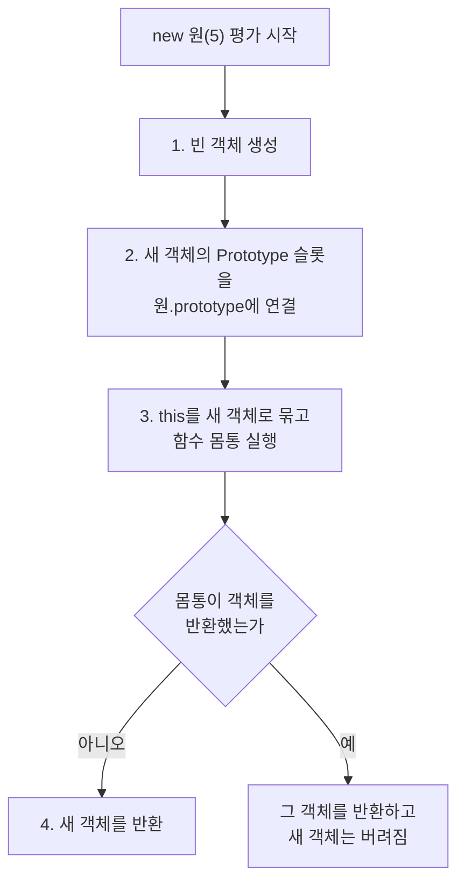
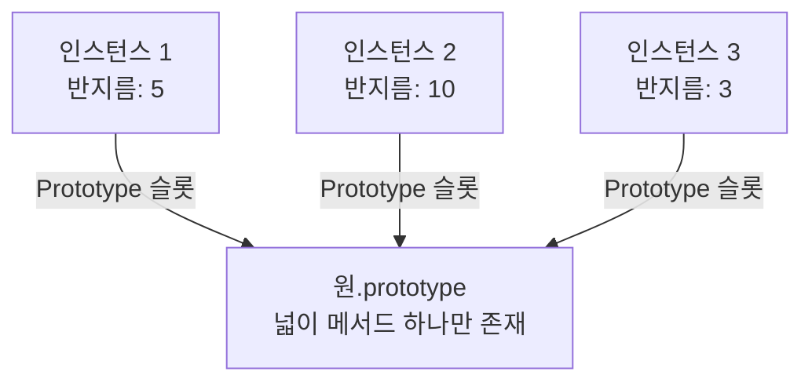

<Callout type="info">
  **이번 문서의 목표:** 이 파일을 다 읽으면 `new 생성자()` 한 줄이 내부에서 정확히 어떤 네 단계를 밟는지 말로 설명할 수 있고, `new`를 빠뜨렸을 때 왜 조용히 이상한 일이 벌어지는지 진단할 수 있게 된다.
</Callout>

## 1. 같은 모양 객체를 여럿 만들어야 할 때

객체 리터럴은 편리합니다.

```js
const 원1 = { 반지름: 5, 넓이() { return Math.PI * this.반지름 ** 2; } };
const 원2 = { 반지름: 10, 넓이() { return Math.PI * this.반지름 ** 2; } };
const 원3 = { 반지름: 3, 넓이() { return Math.PI * this.반지름 ** 2; } };
```

그런데 문제가 보입니다. **`넓이` 메서드가 세 번 중복**되어 있습니다. 원이 1000개면 똑같은 함수 객체가 1000개 만들어집니다. 메모리도 낭비고, 계산식을 고칠 때 1000군데를 고쳐야 합니다.

> **쉽게 말하면:** 객체 리터럴은 "이 물건 하나"를 손으로 만드는 방식입니다. 같은 물건을 여럿 만들려면 **틀**(붕어빵 틀)이 필요합니다.

그 틀 역할을 하는 것이 **생성자 함수**(constructor function, 컨스트럭터 펑션)입니다. construct는 "짓다, 건설하다"라는 뜻이고, constructor는 "짓는 사람"입니다.

## 2. 객체를 만드는 다섯 가지 방법

먼저 전체 지도를 그려 둡시다.

| 방법 | 코드 형태 | 특징 |
|---|---|---|
| 객체 리터럴 | `{ 키: 값 }` | 가장 간단, 하나짜리 객체에 적합 |
| `Object` 생성자 | `new Object()` | 거의 쓰지 않음, 리터럴과 결과 동일 |
| 생성자 함수 | `new 원(5)` | 같은 구조 객체를 반복 생성 |
| `Object.create` | `Object.create(원형)` | 프로토타입을 직접 지정 – 13편 |
| `class` | `new 원(5)` | 생성자 함수의 문법적 정비 – 14편 |

이 편은 세 번째 – 생성자 함수와 `new` 연산자에 집중합니다. `class`도 내부적으로는 여기서 배우는 메커니즘 위에서 돌아가기 때문에, 이 편을 건너뛰면 14편이 마법처럼 보이게 됩니다.

## 3. 생성자 함수의 문법과 관례

```js
function 원(반지름) {
  this.반지름 = 반지름;
  this.넓이 = function () {
    return Math.PI * this.반지름 ** 2;
  };
}

const 원1 = new 원(5);
const 원2 = new 원(10);
console.log(원1.넓이()); // 78.53...
```

### 3-1. 생성자 함수는 특별한 문법이 아니다

여기서 반드시 짚어야 할 사실이 있습니다. **`원`은 그냥 평범한 함수입니다.** 문법적으로 생성자 함수를 선언하는 별도의 키워드는 없습니다. 차이를 만드는 것은 **`new`를 붙여서 호출했는가**뿐입니다.

```js
const 잘못 = 원(5);       // new 없이 호출 — 생성자로 동작하지 않음
const 제대로 = new 원(5); // new를 붙임 — 생성자로 동작
```

그래서 **파스칼 케이스**(PascalCase — 첫 글자를 대문자로 쓰는 표기법)로 이름을 짓는 **관례**가 생겼습니다. `Person`, `Circle`처럼 대문자로 시작하면 "이건 `new`와 함께 쓰세요"라는 신호입니다. 강제가 아니라 사람끼리의 약속입니다.

### 3-2. new 없이 호출하면 무슨 일이 일어나는가

```js
function 원(반지름) {
  this.반지름 = 반지름;
}
const 결과 = 원(5); // new 없음
console.log(결과);  // undefined
console.log(globalThis.반지름); // 5 — 전역이 오염되었다!
```

`new` 없이 호출하면 **일반 함수 호출**이 됩니다. 12편에서 자세히 다루겠지만, 일반 함수 호출에서 `this`는 비엄격 모드에서 **전역 객체**를 가리킵니다. 그래서 `this.반지름 = 반지름`은 전역 객체에 프로퍼티를 만들어 버립니다. 게다가 반환문이 없으니 `undefined`가 돌아옵니다.

strict mode(4편)에서는 `this`가 `undefined`이므로 `TypeError`가 나서 오히려 **빨리 실패**합니다. 조용히 망가지는 것보다 낫습니다.

## 4. new 연산자의 내부 동작 — 네 단계

이 편의 심장입니다. `new 원(5)`를 만나면 엔진은 정확히 다음 순서로 동작합니다.

<Steps>

### 1단계 — 빈 객체 생성

아무 프로퍼티도 없는 새 객체를 하나 만듭니다.

### 2단계 — 프로토타입 연결

새 객체의 내부 슬롯 `[[Prototype]]`을 **생성자 함수의 `prototype` 프로퍼티가 가리키는 객체**로 설정합니다. 이 연결이 상속의 통로가 됩니다 – 13편의 주제입니다.

### 3단계 — this 바인딩 후 함수 몸통 실행

새 객체를 `this`로 바인딩한 뒤 함수 몸통을 실행합니다. 그래서 `this.반지름 = 반지름`이 새 객체에 프로퍼티를 만듭니다.

### 4단계 — 암묵적 반환

함수가 객체를 명시적으로 반환하지 않았다면, 1단계에서 만든 새 객체를 자동으로 반환합니다.

</Steps>

이 네 단계를 JavaScript 코드로 흉내 내면 이렇게 됩니다.

```js
function 흉내낸new(생성자, ...인수) {
  const 새객체 = Object.create(생성자.prototype); // 1, 2단계
  const 반환값 = 생성자.apply(새객체, 인수);       // 3단계
  return typeof 반환값 === "object" && 반환값 !== null
    ? 반환값
    : 새객체;                                      // 4단계
}
```



## 5. 생성자의 반환값 규칙

4단계에서 조건이 붙어 있었습니다. 이 규칙이 은근히 자주 사고를 냅니다.

**규칙 1**: 아무것도 반환하지 않거나 원시값을 반환하면 → **새 객체가 반환된다.**

```js
function 원(r) {
  this.반지름 = r;
  return 100; // 원시값 — 무시된다
}
console.log(new 원(5).반지름); // 5
```

**규칙 2**: 객체를 반환하면 → **그 객체가 반환되고 새 객체는 버려진다.**

```js
function 원(r) {
  this.반지름 = r;
  return { 다른것: true }; // 객체 — 이게 반환된다
}
console.log(new 원(5).반지름); // undefined
```

왜 이런 규칙이 있을까요? 원시값 반환을 무시하는 것은 실수 방지 성격이 강합니다. 반면 객체 반환을 허용하는 것은 의도적인 기능으로, **팩토리 패턴**이나 **싱글턴**(singleton, 인스턴스를 하나만 유지하는 패턴)을 생성자 안에서 구현할 수 있게 해 줍니다.

<Callout type="warning">
  **자주 틀리는 점:** 생성자 안에 `return` 문을 쓰지 않는 것이 원칙입니다. 특히 `return this;`는 무해하지만 불필요하고, 실수로 객체를 반환하면 인스턴스가 통째로 바뀌어 원인 찾기가 매우 어려워집니다. 배열도 객체이므로 `return [1,2];` 역시 인스턴스를 대체합니다.
</Callout>

## 6. 실험 — new의 동작을 직접 뜯어보기

<CodePlayground
  template="vanilla"
  activeFile="/index.js"
  showConsole
  label="실험 1 — new의 네 단계와 반환값 규칙 확인"
  files={{
    '/index.js': `// 준비: 생성자 함수
function 원(반지름) {
  this.반지름 = 반지름;
}
원.prototype.넓이 = function () {
  return (Math.PI * this.반지름 ** 2).toFixed(2);
};

const c1 = new 원(5);
console.log("1) 인스턴스:", c1.반지름, "넓이:", c1.넓이());

// 2) 프로토타입이 실제로 연결되었는지 확인
console.log("2) 프로토타입 연결:", Object.getPrototypeOf(c1) === 원.prototype);
console.log("   instanceof:", c1 instanceof 원);

// 3) new를 직접 흉내 내 보기
function 흉내낸new(생성자, ...인수) {
  const 새객체 = Object.create(생성자.prototype);
  const 반환값 = 생성자.apply(새객체, 인수);
  return typeof 반환값 === "object" && 반환값 !== null ? 반환값 : 새객체;
}
const c2 = 흉내낸new(원, 7);
console.log("3) 흉내 결과:", c2.반지름, "instanceof:", c2 instanceof 원);

// 4) 반환값 규칙 — 원시값은 무시된다
function 원시반환(r) { this.반지름 = r; return 12345; }
console.log("4) 원시값 반환:", new 원시반환(5).반지름);

// 5) 반환값 규칙 — 객체는 인스턴스를 대체한다
function 객체반환(r) { this.반지름 = r; return { 대체됨: true }; }
const c3 = new 객체반환(5);
console.log("5) 객체 반환:", c3, "반지름은?", c3.반지름);

// 6) new 없이 호출하면
function 위험(r) { this.반지름 = r; }
const 결과 = 위험(99);
console.log("6) new 없이 호출한 반환값:", 결과);
console.log("   전역이 오염되었나?:", globalThis.반지름);

// 7) 메서드 중복 확인 — 프로토타입에 두면 공유된다
const a = new 원(1), b = new 원(2);
console.log("7) 메서드가 공유되는가:", a.넓이 === b.넓이);`,
  }}
/>

7번 결과가 중요합니다. `넓이` 메서드를 `원.prototype`에 붙였기 때문에 인스턴스가 몇 개든 **함수 객체는 하나**입니다. 반면 처음 예제처럼 `this.넓이 = function(){}`으로 붙이면 인스턴스마다 별개의 함수가 생겨 메모리를 낭비합니다. 이것이 프로토타입을 쓰는 가장 실용적인 이유이고, 13편의 출발점입니다.

## 7. 함수의 두 얼굴 — callable과 constructor

8편에서 함수는 내부 메서드 `[[Call]]`을 가진 객체라고 했습니다. 여기에 하나가 더 있습니다.

- `[[Call]]`이 있으면 **호출 가능**(callable) – 일반 호출 `f()`이 된다.
- `[[Construct]]`가 있으면 **생성자로 사용 가능**(constructor) – `new f()`가 된다.

모든 함수가 둘 다 갖는 것은 아닙니다.

| 함수 종류 | `[[Call]]` | `[[Construct]]` | `new` 사용 |
|---|---|---|---|
| 함수 선언문·표현식 | 있음 | 있음 | 가능 |
| 화살표 함수 | 있음 | 없음 | TypeError |
| 메서드 축약형 | 있음 | 없음 | TypeError |
| `class` | 있음(제한) | 있음 | 필수 – `new` 없이 호출하면 TypeError |
| 제너레이터 함수 | 있음 | 없음 | TypeError |

```js
const 화살표 = () => {};
new 화살표(); // TypeError: 화살표 is not a constructor

const 객체 = { 메서드() {} };
new 객체.메서드(); // TypeError
```

> **비유:** 모든 함수는 "부를 수 있는 사람"이지만, 그중 일부만 "집을 지을 자격증"을 갖고 있습니다. 화살표 함수는 자격증 없이 일만 하는 일꾼입니다.

`class`는 반대 방향으로 특별합니다. `new` **없이** 호출하면 에러가 납니다. 생성자 함수의 가장 큰 실수 원인을 문법 차원에서 막아 버린 것입니다.

## 8. new.target — new로 불렸는지 알아내기

### 문제

생성자 함수를 만들었는데 사용자가 `new`를 빠뜨리면 조용히 망가집니다. 이걸 함수 스스로 감지할 방법이 필요합니다.

### 해결

ES6에서 도입된 **new.target**은 함수 안에서 쓸 수 있는 특수한 표현식입니다. 메타 프로퍼티(meta property)라고 부르며, 규칙은 단순합니다.

- `new`와 함께 호출되면 → `new.target`은 **그 생성자 함수 자신**
- 일반 호출이면 → `new.target`은 **`undefined`**

```js
function 원(반지름) {
  if (!new.target) {
    return new 원(반지름); // new를 붙여 다시 부른다
  }
  this.반지름 = 반지름;
}

const a = new 원(5);
const b = 원(5);        // new를 빠뜨려도 안전
console.log(b.반지름);  // 5
```

이 패턴을 **스코프 세이프 생성자**(scope-safe constructor)라고 부릅니다. 여기서 `return new 원(반지름)`은 객체를 반환하므로, 규칙 2에 따라 그 객체가 최종 반환값이 됩니다. 앞서 배운 반환값 규칙이 실제로 쓰이는 자리입니다.

### 옛날 방식 — instanceof로 검사

`new.target`이 없던 시절에는 이렇게 했습니다.

```js
function 원(반지름) {
  if (!(this instanceof 원)) return new 원(반지름);
  this.반지름 = 반지름;
}
```

`new`로 호출되면 `this`는 `원.prototype`을 상속한 새 객체이므로 `this instanceof 원`이 참입니다. 일반 호출이면 `this`는 전역 객체나 `undefined`라 거짓입니다. 동작은 비슷하지만, `call`이나 `apply`로 억지로 다른 `this`를 넣으면 속을 수 있어서 `new.target`이 더 정확합니다.

<Callout type="info">
  `new.target`은 상속 관계에서도 유용합니다. 부모 생성자 안에서 `new.target`을 찍어 보면, 자식을 `new`로 만들었을 때 **자식 생성자**가 나옵니다. 추상 클래스처럼 "직접 인스턴스화 금지"를 구현할 때 쓰입니다 – 14편에서 다시 만납니다.
</Callout>

## 9. 생성자 함수의 한계와 프로토타입으로 가는 길

생성자 함수는 편리하지만 두 가지 불편이 남습니다.

### 한계 1 — 메서드 중복

앞서 본 문제입니다. 생성자 몸통에서 `this.메서드 = function(){}`으로 붙이면 인스턴스마다 함수가 복제됩니다. 해법은 함수를 `생성자.prototype`에 두어 **모든 인스턴스가 하나를 공유**하게 하는 것입니다.



인스턴스는 자기만의 데이터(반지름)만 갖고, 공통 동작(넓이)은 프로토타입에서 빌려 씁니다. **데이터는 개별, 동작은 공유** — 이것이 프로토타입 기반 객체지향의 기본 전략입니다.

### 한계 2 — 상속 코드가 장황하다

생성자 함수만으로 상속을 구현하려면 부모 생성자를 `call`로 호출하고, `prototype`을 손으로 이어 붙이고, `constructor`를 복구해야 합니다. 이 절차를 문법으로 정비한 것이 `class`이며, 14편에서 다룹니다.

### 그럼에도 이 편을 배우는 이유

`class`가 있는데 왜 생성자 함수를 배울까요? **`class`는 이 메커니즘을 가리는 껍데기이지, 대체하는 새 메커니즘이 아니기 때문입니다.** `class` 문법 안에서도 `new`는 여전히 네 단계를 밟고, 메서드는 여전히 `prototype`에 올라가며, `new.target`도 그대로 동작합니다. 껍데기 아래를 봐야 디버깅이 됩니다.

## 10. 실험 — new.target과 constructor 판별

<CodePlayground
  template="vanilla"
  activeFile="/index.js"
  showConsole
  label="실험 2 — new.target과 생성자 자격 확인"
  files={{
    '/index.js': `// 1) new.target 값 확인
function 확인용() {
  console.log("new.target:", new.target ? new.target.name : "undefined");
}
new 확인용();
확인용();

// 2) 스코프 세이프 생성자
function 원(반지름) {
  if (!new.target) return new 원(반지름);
  this.반지름 = 반지름;
}
const a = new 원(5);
const b = 원(7); // new를 빼먹어도 안전
console.log("2) a:", a.반지름, "/ b:", b.반지름);
console.log("   b도 인스턴스인가:", b instanceof 원);

// 3) 화살표 함수는 생성자가 아니다
const 화살표 = () => {};
try {
  new 화살표();
} catch (e) {
  console.log("3) 화살표 + new:", e.constructor.name, "-", e.message);
}

// 4) 메서드 축약형도 생성자가 아니다
const 객체 = { 메서드() {} };
try {
  new 객체.메서드();
} catch (e) {
  console.log("4) 메서드 + new:", e.constructor.name);
}

// 5) class는 new 없이 호출할 수 없다
class 상자 { constructor() { this.값 = 1; } }
try {
  상자();
} catch (e) {
  console.log("5) class를 new 없이:", e.constructor.name, "-", e.message);
}

// 6) 생성자 자격을 검사하는 간단한 함수
function 생성자인가(f) {
  try { new (new Proxy(f, { construct: () => ({}) }))(); return true; }
  catch (e) { return false; }
}
console.log("6) 일반 함수:", 생성자인가(function () {}));
console.log("   화살표 함수:", 생성자인가(() => {}));

// 7) prototype 프로퍼티의 유무
function 일반() {}
console.log("7) 일반 함수의 prototype:", typeof 일반.prototype);
console.log("   화살표 함수의 prototype:", typeof (() => {}).prototype);`,
  }}
/>

## 핵심 정리

- 같은 구조의 객체를 여럿 만들 때 객체 리터럴은 **메서드가 중복**되는 문제가 있고, 이를 해결하려고 **생성자 함수**를 쓴다.
- 생성자 함수는 특별한 문법이 아니라 **`new`와 함께 호출된 평범한 함수**다. 파스칼 케이스 이름은 강제가 아닌 관례다.
- `new`는 네 단계를 밟는다 – ① 빈 객체 생성 ② 그 객체의 프로토타입을 생성자의 `prototype`에 연결 ③ `this`를 그 객체로 묶고 몸통 실행 ④ 명시적 객체 반환이 없으면 그 객체를 반환.
- **반환값 규칙**: 원시값 반환은 무시되고 새 객체가 반환되지만, **객체를 반환하면 인스턴스가 통째로 대체된다.**
- 함수는 `[[Call]]`만 있으면 호출만 가능하고, `[[Construct]]`가 있어야 `new`를 쓸 수 있다. **화살표 함수·메서드 축약형·제너레이터는 생성자가 아니다.**
- `new.target`은 `new`로 호출되었는지 알려 준다 – `new`면 생성자 자신, 일반 호출이면 `undefined`. 이를 이용해 **스코프 세이프 생성자**를 만든다.
- 메서드는 생성자 몸통이 아니라 **`prototype`에 두어 모든 인스턴스가 공유**하게 하는 것이 기본 전략이다 – 13편으로 이어진다.

## 마무리 복습

<Quiz
  questionNumber={1}
  question="new 연산자가 수행하는 단계의 순서로 올바른 것은?"
  options={['함수 몸통 실행 → 빈 객체 생성 → 프로토타입 연결 → 반환', '빈 객체 생성 → 프로토타입 연결 → this 바인딩 후 몸통 실행 → 암묵적 반환', '프로토타입 연결 → 반환 → 빈 객체 생성 → 몸통 실행', '몸통 실행 → 반환 → 프로토타입 연결']}
  correctAnswer={2}
  explanation="new는 빈 객체를 만들고, 그 객체의 프로토타입을 생성자의 prototype에 연결한 뒤, this를 그 객체로 바인딩해 몸통을 실행하고, 명시적 객체 반환이 없으면 그 객체를 돌려준다."
  optionExplanations={['객체가 없는 상태로 몸통을 실행할 수 없다', '정답 — 생성, 연결, 실행, 반환 순이다', '반환이 중간에 올 수 없다', '프로토타입 연결은 몸통 실행 전에 이루어진다']}
/>

<Quiz
  questionNumber={2}
  question="생성자 함수 몸통에서 객체를 명시적으로 return 하면 어떻게 되는가?"
  options={['무시되고 새로 만든 인스턴스가 반환된다', '문법 에러가 발생한다', '그 객체가 반환되고 새로 만든 인스턴스는 버려진다', '두 객체가 병합되어 반환된다']}
  correctAnswer={3}
  explanation="원시값을 반환하면 무시되지만, 객체를 반환하면 그 객체가 최종 결과가 되고 new가 만든 인스턴스는 버려진다. 배열도 객체이므로 같은 규칙이 적용된다."
  optionExplanations={['원시값을 반환했을 때의 동작이다', '문법 에러는 아니다', '정답 — 객체 반환은 인스턴스를 대체한다', '병합되는 일은 없다']}
/>

<Quiz
  questionNumber={3}
  question="일반 함수를 new 없이 호출하면서 몸통에서 this에 프로퍼티를 할당하면, 비엄격 모드에서 어떤 일이 벌어지는가?"
  options={['새 객체가 만들어지고 그 객체에 프로퍼티가 생긴다', 'this가 전역 객체를 가리켜 전역이 오염되고 함수는 undefined를 반환한다', 'TypeError가 발생한다', '아무 일도 일어나지 않는다']}
  correctAnswer={2}
  explanation="new 없는 호출은 일반 함수 호출이므로 비엄격 모드에서 this가 전역 객체가 된다. 그래서 프로퍼티가 전역 객체에 생기고, 반환문이 없어 undefined가 반환된다. strict mode에서는 this가 undefined라 TypeError가 난다."
  optionExplanations={['새 객체는 new가 만들어 주는 것이다', '정답 — 조용히 전역이 오염되는 위험한 상황이다', 'strict mode에서의 결과다', '실제로 전역에 프로퍼티가 생긴다']}
/>

<Quiz
  questionNumber={4}
  question="new.target의 값에 대한 설명으로 옳은 것은?"
  options={['new로 호출되면 생성자 함수 자신이고, 일반 호출이면 undefined다', '항상 전역 객체를 가리킨다', '항상 undefined다', '생성자가 반환할 객체를 가리킨다']}
  correctAnswer={1}
  explanation="new.target은 함수가 new와 함께 호출되었는지 알려 주는 메타 프로퍼티다. new 호출이면 해당 생성자 함수를, 일반 호출이면 undefined를 갖는다. 이를 이용해 스코프 세이프 생성자를 만든다."
  optionExplanations={['정답 — 호출 방식에 따라 값이 달라진다', '전역 객체와는 무관하다', 'new 호출에서는 undefined가 아니다', '반환될 객체가 아니라 생성자 함수를 가리킨다']}
/>

<Quiz
  questionNumber={5}
  question="다음 중 new 연산자와 함께 사용할 수 없는 것은?"
  options={['함수 선언문으로 만든 함수', '함수 표현식으로 만든 익명 함수', '화살표 함수', 'class로 정의한 것']}
  correctAnswer={3}
  explanation="화살표 함수는 내부 메서드 [[Construct]]가 없어서 new와 함께 쓸 수 없고 TypeError가 난다. 메서드 축약형과 제너레이터 함수도 마찬가지다. class는 오히려 new 없이 호출하는 것이 금지된다."
  optionExplanations={['일반 함수는 생성자로 쓸 수 있다', '익명 함수 표현식도 생성자로 쓸 수 있다', '정답 — 화살표 함수는 생성자가 아니다', 'class는 반드시 new와 함께 써야 한다']}
/>

<Quiz
  questionNumber={6}
  question="메서드를 생성자 몸통에서 this에 직접 붙이지 않고 prototype에 두는 가장 큰 이유는?"
  options={['문법이 더 짧아서', '모든 인스턴스가 하나의 함수 객체를 공유해 메모리와 유지보수에 유리해서', 'prototype에 두어야 this가 동작해서', '그렇게 해야 new를 쓸 수 있어서']}
  correctAnswer={2}
  explanation="생성자 몸통에서 함수를 할당하면 인스턴스마다 별개의 함수 객체가 만들어진다. prototype에 두면 인스턴스 수와 관계없이 함수는 하나뿐이라 메모리를 아끼고 수정 지점도 한 곳이 된다."
  optionExplanations={['문법 길이의 문제가 아니다', '정답 — 데이터는 개별, 동작은 공유가 기본 전략이다', 'this는 두 경우 모두 정상 동작한다', 'new 사용 여부와는 무관하다']}
/>

<Quiz
  questionNumber={7}
  question="생성자 함수 이름을 대문자로 시작하는 파스칼 케이스로 쓰는 이유는?"
  options={['대문자로 시작해야 엔진이 생성자로 인식하기 때문', 'new와 함께 써야 하는 함수임을 사람이 알아보게 하는 관례이기 때문', '소문자로 시작하면 문법 에러가 나기 때문', 'prototype 프로퍼티가 대문자 함수에만 생기기 때문']}
  correctAnswer={2}
  explanation="엔진은 이름의 대소문자를 전혀 신경 쓰지 않는다. 생성자 함수와 일반 함수를 구분하는 유일한 기준은 new를 붙였는가이며, 파스칼 케이스는 사람끼리의 약속일 뿐이다."
  optionExplanations={['엔진은 이름을 보고 판단하지 않는다', '정답 — 강제가 아니라 가독성을 위한 관례다', '소문자로 시작해도 문법 에러가 아니다', 'prototype은 이름과 무관하게 생긴다']}
/>

<Quiz
  questionNumber={8}
  question="class 문법이 도입된 뒤에도 생성자 함수와 new의 내부 동작을 알아야 하는 이유로 가장 적절한 것은?"
  options={['class는 아직 표준이 아니기 때문', 'class는 이 메커니즘을 가리는 문법일 뿐 내부에서 같은 단계와 프로토타입 연결이 그대로 일어나기 때문', 'class에서는 new를 쓸 수 없기 때문', 'class는 프로토타입을 사용하지 않기 때문']}
  correctAnswer={2}
  explanation="class는 새로운 객체 모델을 도입한 것이 아니라 생성자 함수와 프로토타입 메커니즘을 문법적으로 정비한 것이다. new의 네 단계, prototype에 올라가는 메서드, new.target 모두 그대로 동작한다."
  optionExplanations={['class는 ES6부터 표준이다', '정답 — 껍데기 아래를 알아야 디버깅이 된다', 'class는 반드시 new와 함께 쓴다', 'class 메서드도 prototype에 저장된다']}
/>

## 참고 자료

- [MDN - new 연산자](https://developer.mozilla.org/en-US/docs/Web/JavaScript/Reference/Operators/new)
- [MDN - new.target](https://developer.mozilla.org/en-US/docs/Web/JavaScript/Reference/Operators/new.target)
- [MDN - Object.create](https://developer.mozilla.org/en-US/docs/Web/JavaScript/Reference/Global_Objects/Object/create)
- [ECMAScript Language Specification - The new Operator](https://262.ecma-international.org/)
