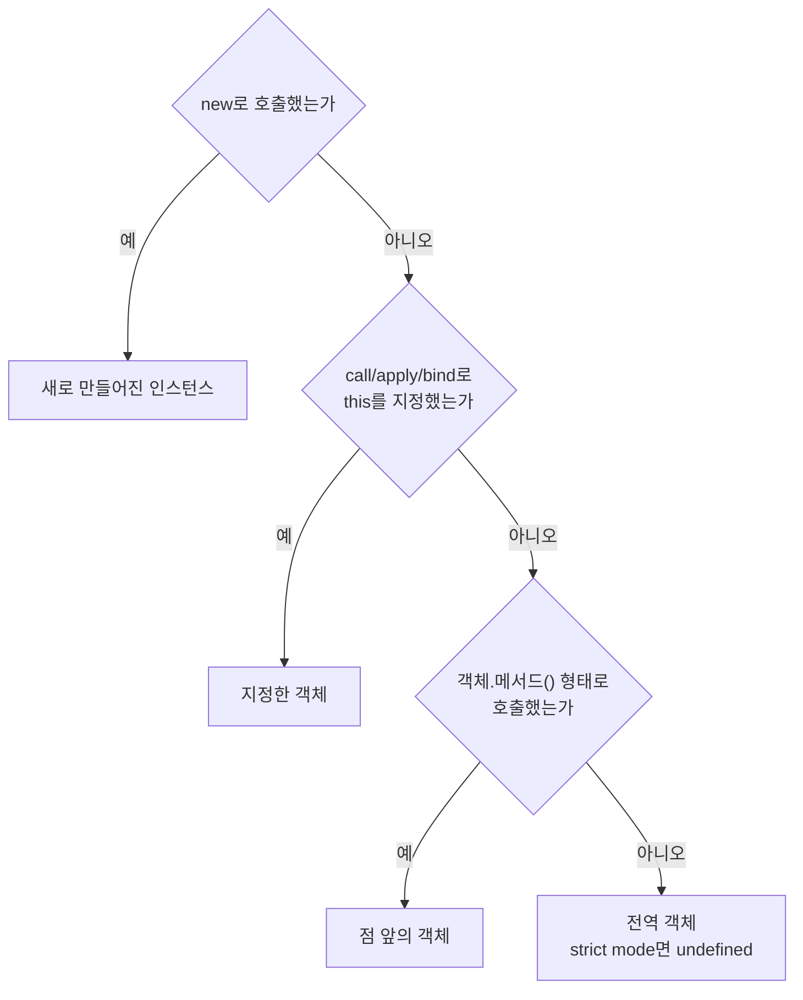
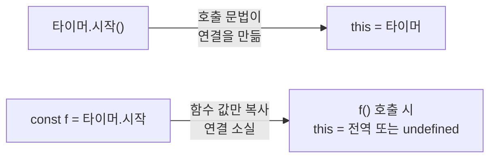
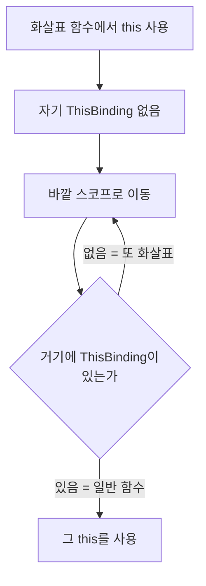

<Callout type="info">
  **이번 문서의 목표:** 이 파일을 다 읽으면 임의의 코드에서 `this`가 무엇을 가리키는지 **규칙 순서대로 계산**할 수 있게 되고, 콜백에 메서드를 넘겼을 때 `this`가 사라지는 문제를 세 가지 방법으로 고칠 수 있게 된다.
</Callout>

## 1. this가 어려운 진짜 이유

Java나 C++을 배운 사람에게 `this`는 쉬운 개념입니다. "이 객체 자신"이면 끝입니다. 그런데 JavaScript의 `this`는 사람들을 괴롭힙니다. 이유는 하나입니다.

> **쉽게 말하면:** JavaScript의 `this`는 **함수가 어디에 쓰여 있는지가 아니라, 어떻게 호출되었는지**로 결정됩니다.

9편에서 배운 스코프는 정반대였습니다. 스코프는 **렉시컬**(정의 위치 기준)이라서 호출 위치와 무관했습니다. 그런데 `this`만은 **동적**(dynamic, 실행 시점 기준)입니다. 이 비대칭이 혼란의 근원입니다.

같은 함수가 호출 방식에 따라 완전히 다른 `this`를 갖는 것을 직접 봅시다.

```js
function 보여주기() {
  console.log(this);
}

보여주기();                      // 전역 객체 (또는 undefined)
const 객체 = { 보여주기 };
객체.보여주기();                 // 객체
new 보여주기();                  // 새로 만들어진 인스턴스
보여주기.call({ 이름: "직접" }); // { 이름: "직접" }
```

**함수는 하나인데 this는 네 개**입니다. 그러니 함수 코드만 보고 `this`를 판단하려는 시도는 애초에 불가능합니다. 항상 **호출하는 자리**를 봐야 합니다.

## 2. this는 무엇인가

**this**는 자신이 속한 객체 또는 자신이 생성할 인스턴스를 가리키는 **자기 참조 변수**(self-referencing variable)입니다. 명세 관점에서는 실행 컨텍스트(9편)의 구성 요소 중 하나인 **ThisBinding**에 저장되는 값입니다.

중요한 사실 하나: **`this`는 함수가 호출될 때 실행 컨텍스트가 만들어지면서 함께 결정됩니다.** 즉 정의 시점에는 값이 없습니다. 그래서 "이 함수의 this는 무엇인가"라는 질문 자체가 성립하지 않고, "이 **호출**의 this는 무엇인가"만 성립합니다.

또 하나: **`this`는 변수처럼 보이지만 예약어**입니다. 재할당할 수 없습니다.

## 3. 네 가지 바인딩 규칙과 우선순위

`this`가 결정되는 방식은 딱 네 가지입니다. 여러 규칙이 겹치면 **우선순위가 높은 것이 이깁니다.**



이 순서도가 이 편의 요약입니다. 위에서부터 차례로 물어보면 답이 나옵니다. 하나씩 해부합니다.

### 3-1. 규칙 1 (최우선) — new 바인딩

`new 생성자()`로 호출하면 `this`는 **새로 만들어진 인스턴스**입니다. 11편에서 본 `new`의 3단계가 바로 이것입니다.

```js
function 사람(이름) {
  this.이름 = 이름;
}
const 나 = new 사람("가나");
console.log(나.이름); // "가나"
```

### 3-2. 규칙 2 — 명시적 바인딩: call, apply, bind

함수는 객체이므로 메서드를 갖습니다. `Function.prototype`에 있는 세 메서드가 `this`를 직접 지정하게 해 줍니다.

```js
function 소개(인사말, 끝맺음) {
  return 인사말 + ", 저는 " + this.이름 + "입니다" + 끝맺음;
}
const 사람A = { 이름: "가나" };

소개.call(사람A, "안녕하세요", "!");        // 인수를 나열
소개.apply(사람A, ["안녕하세요", "!"]);     // 인수를 배열로
const 묶인소개 = 소개.bind(사람A);          // 새 함수를 반환
묶인소개("안녕하세요", "!");
```

| 메서드 | 인수 전달 방식 | 즉시 실행 | 반환값 |
|---|---|---|---|
| `call` | 하나씩 나열 | 예 | 함수의 실행 결과 |
| `apply` | 배열 하나로 | 예 | 함수의 실행 결과 |
| `bind` | 하나씩 나열 – 부분 적용 가능 | 아니오 | `this`가 고정된 새 함수 |

기억법: **a**pply는 **a**rray(배열), **c**all은 **c**omma(쉼표로 나열)입니다. `bind`는 실행하지 않고 **묶기만** 합니다.

`bind`가 만든 함수는 **바운드 함수**(bound function)라고 하며, 한 번 묶인 `this`는 다시 `call`로도 바꿀 수 없습니다. 단 `new`로 호출하면 규칙 1이 이기므로 `this`는 새 인스턴스가 됩니다 — 우선순위가 실제로 작동하는 자리입니다.

`bind`의 두 번째 이후 인수는 **부분 적용**(partial application)에 쓰입니다.

```js
function 곱하기(a, b) { return a * b; }
const 두배 = 곱하기.bind(null, 2);
console.log(두배(7)); // 14
```

### 3-3. 규칙 3 — 암묵적 바인딩: 메서드 호출

`객체.메서드()` 형태로 호출하면 `this`는 **점 바로 앞의 객체**입니다.

```js
const 사람 = {
  이름: "가나",
  인사() { return "저는 " + this.이름; },
};
console.log(사람.인사()); // "저는 가나"
```

여기서 결정적으로 중요한 사실이 있습니다.

<Callout type="warning">
  **자주 틀리는 점:** `this`는 함수가 **어느 객체 안에 정의되어 있는지**와 아무 상관이 없습니다. **호출하는 순간 점 앞에 무엇이 있는지**만 봅니다. 같은 함수를 다른 객체에 붙여 호출하면 `this`도 따라 바뀝니다.
</Callout>

```js
const 사람B = { 이름: "다라", 인사: 사람.인사 };
console.log(사람B.인사()); // "저는 다라" — 함수는 같은데 this가 다르다
```

중첩된 경우에는 **가장 마지막 점 앞**이 기준입니다.

```js
const 회사 = { 부서: { 이름: "개발팀", 알려줘() { return this.이름; } } };
console.log(회사.부서.알려줘()); // "개발팀" — 회사가 아니라 부서
```

### 3-4. 규칙 4 (기본) — 일반 함수 호출

위 셋 중 어느 것도 아니면 기본 규칙이 적용됩니다.

- **비엄격 모드**: `this`는 **전역 객체**(브라우저의 `window`, 표준 이름 `globalThis`)
- **strict mode**: `this`는 **`undefined`**

```js
function 확인() { return this; }
console.log(확인());  // 비엄격: globalThis / strict: undefined
```

strict mode에서 `undefined`가 되는 것은 **의도된 안전장치**입니다. 실수로 전역을 오염시키는 대신 즉시 에러를 내게 만든 것입니다. ES 모듈(29편)은 항상 strict mode이므로, 모던 코드에서는 `undefined`가 기본입니다.

## 4. 실험 — 네 가지 규칙을 한 번에 확인

<CodePlayground
  template="vanilla"
  activeFile="/index.js"
  showConsole
  label="실험 1 — 같은 함수, 다른 호출, 다른 this"
  files={{
    '/index.js': `function 정체() {
  if (this === undefined) return "undefined (strict)";
  if (this === globalThis) return "전역 객체";
  return JSON.stringify(this);
}

// 규칙 4 — 일반 호출
console.log("1) 일반 호출:", 정체());

// 규칙 3 — 메서드 호출
const 객체 = { 이름: "가나", 정체 };
console.log("2) 메서드 호출:", 객체.정체());

// 중첩 객체 — 마지막 점 앞이 기준
const 바깥 = { 이름: "바깥", 안쪽: { 이름: "안쪽", 정체 } };
console.log("3) 중첩 메서드:", 바깥.안쪽.정체());

// 규칙 2 — 명시적 바인딩
console.log("4) call:", 정체.call({ 이름: "call로 지정" }));
console.log("5) apply:", 정체.apply({ 이름: "apply로 지정" }));
const 묶임 = 정체.bind({ 이름: "bind로 고정" });
console.log("6) bind:", 묶임());

// bind는 다시 바꿀 수 없다
console.log("7) 묶인 함수에 call:", 묶임.call({ 이름: "무시됨" }));

// 규칙 1이 규칙 2를 이긴다
function 생성자() { this.표시 = "new로 만든 인스턴스"; }
const 묶인생성자 = 생성자.bind({ 표시: "bind한 객체" });
console.log("8) bind한 생성자를 new로:", new 묶인생성자().표시);

// strict mode에서의 일반 호출
function 엄격함() {
  "use strict";
  return this === undefined ? "undefined" : "전역";
}
console.log("9) strict 일반 호출:", 엄격함());`,
  }}
/>

8번 결과가 우선순위를 증명합니다. `bind`로 묶어 두었는데도 `new`로 호출하니 새 인스턴스가 `this`가 되었습니다.

## 5. 바인딩 상실 — this가 사라지는 순간

### 5-1. 문제 상황

가장 흔하고 가장 헷갈리는 버그입니다.

```js
const 타이머 = {
  이름: "내 타이머",
  시작() {
    console.log(this.이름);
  },
};

타이머.시작();              // "내 타이머" — 정상
const 꺼낸함수 = 타이머.시작;
꺼낸함수();                 // undefined — this가 사라졌다!
setTimeout(타이머.시작, 100); // undefined — 역시 사라졌다
```

### 5-2. 원인

`타이머.시작`이라고 쓰는 순간, 그 값은 **함수 객체 그 자체**입니다. 객체와의 연결은 값에 들어 있지 않습니다. 연결은 **점 표기법으로 호출하는 문법이 그 순간에만 만들어 주는 일시적인 것**입니다.

> **비유:** 명함을 건네는 것과 같습니다. 명함에는 이름과 연락처가 적혀 있지만, "지금 이 명함을 누가 들고 있는지"는 적혀 있지 않습니다. 함수를 변수에 담는 순간 명함만 넘어가고 "누구의 것인지"는 사라집니다.

`setTimeout(타이머.시작, 100)`도 똑같습니다. `타이머.시작`이 평가되어 함수 값만 넘어가고, 나중에 `setTimeout` 내부에서 그냥 `콜백()` 형태로 호출됩니다. 규칙 4가 적용되어 `this`는 전역 객체 또는 `undefined`가 됩니다.



### 5-3. 해결책 세 가지

**해결 1 — bind로 묶기**

```js
const 꺼낸함수 = 타이머.시작.bind(타이머);
setTimeout(타이머.시작.bind(타이머), 100);
```

가장 명시적이고 확실합니다. 다만 `bind`는 매번 **새 함수를 만들어 반환**하므로, 같은 함수를 반복해서 `bind`하면 매번 다른 객체가 됩니다. 이벤트 리스너를 제거할 때 이 성질 때문에 실패하는 사고가 흔합니다.

**해결 2 — 화살표 함수로 감싸기**

```js
setTimeout(() => 타이머.시작(), 100);
```

화살표 함수 안에서 `타이머.시작()` 형태로 호출하므로 규칙 3이 그대로 적용됩니다.

**해결 3 — 애초에 화살표 함수로 정의하기**

중첩 함수에서 `this`가 끊기는 경우에 특히 유용합니다.

```js
const 목록 = {
  항목들: ["가", "나", "다"],
  이름: "내 목록",
  출력() {
    // 일반 함수 콜백이면 this가 끊긴다
    this.항목들.forEach(function (항목) {
      // console.log(this.이름); // undefined — 규칙 4 적용
    });
    // 화살표 함수는 바깥 this를 그대로 쓴다
    this.항목들.forEach((항목) => {
      console.log(this.이름 + ": " + 항목); // 정상
    });
  },
};
```

## 6. 화살표 함수의 렉시컬 this

### 6-1. 화살표 함수는 this를 만들지 않는다

8편에서 예고한 내용을 여기서 완결합니다. 화살표 함수는 실행 컨텍스트에 **자신만의 ThisBinding을 만들지 않습니다.** 그래서 함수 몸통에서 `this`를 쓰면, 엔진은 이를 **스코프 체인을 타고 찾아야 하는 식별자처럼** 취급합니다. 변수를 찾듯 바깥 환경으로 올라가 가장 가까운 일반 함수의 `this`를 찾아 씁니다.

이것을 **렉시컬 this**(lexical this)라고 부릅니다. 스코프와 같은 규칙 — **정의 위치 기준**이라는 뜻입니다.



### 6-2. 그래서 이런 결과가 나온다

화살표 함수에는 규칙 1~4가 **적용되지 않습니다.**

```js
const 화살표 = () => this;
console.log(화살표.call({ 이름: "무시됨" })); // call이 무시된다
console.log(화살표.bind({ 이름: "무시됨" })()); // bind도 무시된다
// new 화살표(); // TypeError — 애초에 생성자가 아니다
```

### 6-3. 화살표 함수를 쓰면 안 되는 자리

<Callout type="warning">
  **자주 틀리는 점:** 화살표 함수를 **객체 리터럴의 메서드**로 쓰면 안 됩니다. 객체 리터럴은 스코프를 만들지 않으므로, 그 안의 화살표 함수는 객체가 아니라 **객체를 감싼 바깥 스코프의 this**를 참조합니다. 모듈 최상위라면 `undefined`입니다.
</Callout>

```js
const 잘못 = {
  이름: "가나",
  인사: () => "저는 " + this.이름, // this는 객체가 아니다
};

const 올바름 = {
  이름: "가나",
  인사() { return "저는 " + this.이름; }, // 메서드 축약형
};
```

같은 이유로 **프로토타입 메서드**(13편)와 **DOM 이벤트 핸들러**(핸들러의 `this`는 이벤트가 걸린 요소여야 하는데, 화살표 함수는 그것을 못 받습니다)에도 화살표 함수를 쓰지 않습니다.

반대로 **콜백 안에서 바깥 this를 유지하고 싶을 때**는 화살표 함수가 최선입니다. 정리하면 이렇습니다.

| 상황 | 권장 |
|---|---|
| 객체 리터럴의 메서드 | 메서드 축약형 |
| 프로토타입에 붙이는 메서드 | 일반 함수 |
| DOM 이벤트 핸들러 – 요소를 참조해야 할 때 | 일반 함수 |
| 생성자 | 일반 함수 또는 `class` |
| 메서드 내부의 콜백 | 화살표 함수 |
| 배열 고차 함수의 짧은 콜백 | 화살표 함수 |

## 7. 화살표 함수 이전의 해법 — 옛 코드 읽기

ES6 이전에는 `this`를 변수에 담아 두는 관용구를 썼습니다.

```js
var 목록 = {
  이름: "내 목록",
  출력: function () {
    var that = this; // self, _this 등으로도 씀
    this.항목들.forEach(function (항목) {
      console.log(that.이름 + ": " + 항목);
    });
  },
};
```

`that`은 평범한 변수이므로 클로저(10편)로 캡처됩니다. 스코프는 렉시컬이므로 안쪽 함수에서 정상적으로 보입니다. **화살표 함수의 렉시컬 this는 이 관용구를 문법으로 승격시킨 것**이라고 이해하면 정확합니다.

또 다른 방법은 콜백을 받는 메서드가 제공하는 `thisArg` 매개변수를 쓰는 것이었습니다.

```js
this.항목들.forEach(function (항목) {
  console.log(this.이름);
}, this); // 두 번째 인수가 콜백의 this가 된다
```

`forEach`, `map`, `filter`, `some`, `every`가 이 두 번째 인수를 받습니다. 화살표 함수에는 효과가 없습니다 — 화살표 함수는 어차피 `this`를 받지 않기 때문입니다.

## 8. 실험 — 바인딩 상실과 세 가지 해법

<CodePlayground
  template="vanilla"
  activeFile="/index.js"
  showConsole
  label="실험 2 — this가 사라지는 순간과 고치는 방법"
  files={{
    '/index.js': `const 타이머 = {
  이름: "내 타이머",
  시작() {
    console.log("  → this.이름 =", this === undefined ? "this가 undefined" : this.이름);
  },
};

console.log("1) 정상 메서드 호출");
타이머.시작();

console.log("2) 함수만 꺼내서 호출 — 바인딩 상실");
const 꺼냄 = 타이머.시작;
꺼냄();

console.log("3) bind로 고정");
const 묶음 = 타이머.시작.bind(타이머);
묶음();

console.log("4) 화살표 함수로 감싸기");
const 감쌈 = () => 타이머.시작();
감쌈();

console.log("5) 콜백 안에서의 this");
const 목록 = {
  이름: "내 목록",
  항목들: ["가", "나"],
  일반콜백() {
    this.항목들.forEach(function (항목) {
      console.log("  일반 함수 콜백:", this === undefined || this === globalThis ? "this 끊김" : this.이름);
    });
  },
  화살표콜백() {
    this.항목들.forEach((항목) => {
      console.log("  화살표 콜백:", this.이름, "-", 항목);
    });
  },
  thisArg사용() {
    this.항목들.forEach(function (항목) {
      console.log("  thisArg 사용:", this.이름, "-", 항목);
    }, this);
  },
};
목록.일반콜백();
목록.화살표콜백();
목록.thisArg사용();

console.log("6) 화살표 함수에는 call/bind가 통하지 않는다");
const 화살표 = () => (typeof this === "undefined" ? "undefined" : "바깥 this");
console.log("  call 시도:", 화살표.call({ 이름: "무시됨" }));

console.log("7) 객체 리터럴 메서드를 화살표로 쓰면");
const 잘못 = { 이름: "가나", 인사: () => (typeof this === "undefined" ? "this가 객체가 아님" : "바깥 this") };
console.log(" ", 잘못.인사());`,
  }}
/>

## 9. this를 계산하는 절차 정리

임의의 코드에서 `this`를 알아내려면 이 순서로 물어보세요.

1. **이 함수가 화살표 함수인가?** → 그렇다면 규칙 1~4를 건너뛰고, 이 함수를 감싼 **가장 가까운 일반 함수의 this**를 같은 절차로 다시 계산한다.
2. **`new`로 호출되었는가?** → 새로 만들어진 인스턴스.
3. **`call`·`apply`·`bind`로 지정되었는가?** → 지정된 객체.
4. **점 표기법 메서드 호출 형태인가?** → 마지막 점 앞의 객체.
5. **위 어느 것도 아닌가?** → strict mode면 `undefined`, 아니면 전역 객체.

이 다섯 줄이면 모든 경우를 판정할 수 있습니다.

## 핵심 정리

- `this`는 함수가 **정의된 위치가 아니라 호출된 방식**으로 결정된다. 스코프가 렉시컬인 것과 정반대여서 혼란이 생긴다.
- 우선순위는 **new 바인딩 → 명시적 바인딩 → 암묵적 바인딩 → 기본 바인딩** 순이다. 명시적은 `call`·`apply`·`bind`, 암묵적은 메서드 호출을 말한다.
- 기본 바인딩에서 `this`는 비엄격 모드에서 전역 객체, **strict mode와 ES 모듈에서는 `undefined`**다.
- `call`은 인수를 나열, `apply`는 배열로 전달하며 둘 다 즉시 실행한다. `bind`는 실행하지 않고 **`this`가 고정된 새 함수**를 반환한다.
- 메서드를 변수에 담거나 콜백으로 넘기면 **바인딩이 상실된다**. 연결은 함수 값이 아니라 `객체.메서드()`라는 호출 문법이 만들어 주기 때문이다.
- 화살표 함수는 자신의 `this`를 만들지 않고 **바깥의 this를 그대로 쓴다**(렉시컬 this). 그래서 `call`·`apply`·`bind`가 통하지 않는다.
- 객체 리터럴 메서드·프로토타입 메서드·DOM 이벤트 핸들러에는 화살표 함수를 쓰지 않고, **메서드 내부의 콜백**에는 화살표 함수를 쓴다.

## 마무리 복습

<Quiz
  questionNumber={1}
  question="JavaScript에서 this 값이 결정되는 기준으로 옳은 것은?"
  options={['함수가 정의된 위치', '함수가 호출된 방식', '함수의 이름', '함수가 속한 파일']}
  correctAnswer={2}
  explanation="스코프는 정의 위치로 결정되는 렉시컬 방식이지만, this는 예외적으로 호출 시점의 호출 방식으로 결정된다. 화살표 함수만 예외적으로 정의 위치 기준을 따른다."
  optionExplanations={['그것은 스코프의 결정 방식이며, 화살표 함수의 this만 여기에 해당한다', '정답 — 같은 함수도 호출 방식에 따라 this가 달라진다', '이름은 무관하다', '파일 위치는 무관하다']}
/>

<Quiz
  questionNumber={2}
  question="this 바인딩 규칙의 우선순위를 높은 것부터 올바르게 나열한 것은?"
  options={['기본 → 암묵적 → 명시적 → new', 'new → 명시적 → 암묵적 → 기본', '암묵적 → new → 기본 → 명시적', '명시적 → 기본 → new → 암묵적']}
  correctAnswer={2}
  explanation="new 바인딩이 가장 우선하고, 그다음이 call·apply·bind에 의한 명시적 바인딩, 그다음이 객체.메서드() 형태의 암묵적 바인딩, 마지막이 전역 또는 undefined가 되는 기본 바인딩이다."
  optionExplanations={['순서가 완전히 뒤집혀 있다', '정답 — bind한 함수도 new로 부르면 새 인스턴스가 this가 된다', '암묵적이 new보다 앞설 수 없다', '기본 바인딩은 가장 낮은 우선순위다']}
/>

<Quiz
  questionNumber={3}
  question="call과 apply의 차이로 옳은 것은?"
  options={['call은 즉시 실행하고 apply는 새 함수를 반환한다', '인수를 하나씩 나열하면 call, 배열 하나로 넘기면 apply다', 'call은 this를 바꾸지 못한다', 'apply는 화살표 함수에서만 동작한다']}
  correctAnswer={2}
  explanation="둘 다 지정한 this로 함수를 즉시 실행한다. 인수 전달 방식만 다르며, apply는 array에서 온 이름으로 배열을 받는다. 새 함수를 반환하는 것은 bind다."
  optionExplanations={['새 함수를 반환하는 것은 bind다', '정답 — apply는 array, call은 comma로 기억한다', 'call도 this를 지정한다', '화살표 함수에는 오히려 효과가 없다']}
/>

<Quiz
  questionNumber={4}
  question="const f = 객체.메서드; 처럼 메서드를 변수에 담은 뒤 f()로 호출하면 this가 사라지는 이유는?"
  options={['변수에 담으면 함수가 복제되기 때문', '객체와의 연결은 함수 값에 들어 있지 않고 객체.메서드() 라는 호출 문법이 만들어 주기 때문', '변수는 항상 undefined를 반환하기 때문', 'const로 선언했기 때문']}
  correctAnswer={2}
  explanation="함수 값 자체에는 어느 객체의 것인지에 대한 정보가 없다. 암묵적 바인딩은 호출 시점의 점 표기법이 만들어 주는 일시적인 연결이므로, 함수만 꺼내면 그 연결이 사라지고 기본 바인딩이 적용된다."
  optionExplanations={['복제되지 않고 같은 함수 객체를 참조한다', '정답 — 연결은 값이 아니라 호출 문법에 있다', '함수는 정상적으로 실행된다', '선언 키워드와는 무관하다']}
/>

<Quiz
  questionNumber={5}
  question="화살표 함수의 this에 대한 설명으로 옳지 않은 것은?"
  options={['자신만의 this를 만들지 않고 바깥 스코프의 this를 사용한다', 'call이나 bind로 this를 바꿀 수 없다', '스코프 체인을 따라 가장 가까운 일반 함수의 this를 찾는다', 'new와 함께 호출하면 새 인스턴스가 this가 된다']}
  correctAnswer={4}
  explanation="화살표 함수는 내부 메서드 [[Construct]]가 없어 new와 함께 호출할 수 없고 TypeError가 난다. 나머지 세 설명은 렉시컬 this의 특징으로 모두 옳다."
  optionExplanations={['렉시컬 this의 정의다', 'this가 없으므로 지정해도 무시된다', '변수를 찾듯 바깥으로 올라간다', '정답(틀린 설명) — 화살표 함수는 생성자가 아니다']}
/>

<Quiz
  questionNumber={6}
  question="객체 리터럴의 메서드를 화살표 함수로 정의하면 안 되는 이유는?"
  options={['화살표 함수는 객체 안에 쓸 수 없기 때문', '객체 리터럴은 스코프를 만들지 않으므로 this가 그 객체가 아니라 바깥 스코프의 것이 되기 때문', '화살표 함수는 매개변수를 받을 수 없기 때문', '화살표 함수는 값을 반환할 수 없기 때문']}
  correctAnswer={2}
  explanation="화살표 함수의 this는 스코프 체인을 따라 결정되는데, 객체 리터럴은 스코프를 만들지 않는다. 따라서 객체를 감싸고 있는 바깥 스코프의 this를 참조하게 되며 모듈 최상위에서는 undefined가 된다. 메서드 축약형을 써야 한다."
  optionExplanations={['문법적으로는 쓸 수 있어서 더 위험하다', '정답 — 객체 리터럴은 스코프 경계가 아니다', '매개변수는 정상적으로 받는다', '값 반환도 정상적으로 된다']}
/>

<Quiz
  questionNumber={7}
  question="strict mode에서 일반 함수를 그냥 호출했을 때 this 값은?"
  options={['전역 객체', 'undefined', '빈 객체', '함수 자기 자신']}
  correctAnswer={2}
  explanation="비엄격 모드에서는 기본 바인딩이 전역 객체를 사용하지만, strict mode에서는 undefined가 된다. 이는 실수로 전역을 오염시키지 않고 즉시 에러가 나게 하려는 안전장치이며, ES 모듈은 항상 strict mode다."
  optionExplanations={['비엄격 모드에서의 동작이다', '정답 — 빨리 실패하게 만드는 안전장치다', '빈 객체가 되는 경우는 없다', '함수 자신을 가리키지는 않는다']}
/>

<Quiz
  questionNumber={8}
  question="ES6 이전에 var that = this; 라고 쓰던 관용구의 목적은?"
  options={['this를 상수로 만들기 위해', '중첩 함수 안에서 바깥 함수의 this를 클로저로 붙잡아 쓰기 위해', '전역 객체를 지역 변수에 저장하기 위해', 'this의 타입을 변환하기 위해']}
  correctAnswer={2}
  explanation="중첩된 일반 함수는 자신의 this를 새로 만들어 바깥 this가 끊긴다. 그래서 바깥에서 this를 평범한 변수에 담아 두면 스코프 체인을 통해 안쪽에서도 접근할 수 있었다. 화살표 함수의 렉시컬 this가 이 관용구를 문법으로 대체했다."
  optionExplanations={['상수화가 목적이 아니다', '정답 — 스코프는 렉시컬이므로 변수는 안쪽에서 보인다', '전역 객체 저장이 목적이 아니다', '타입 변환과는 무관하다']}
/>

## 참고 자료

- [MDN - this](https://developer.mozilla.org/en-US/docs/Web/JavaScript/Reference/Operators/this)
- [MDN - Function.prototype.bind](https://developer.mozilla.org/en-US/docs/Web/JavaScript/Reference/Global_Objects/Function/bind)
- [MDN - Function.prototype.call](https://developer.mozilla.org/en-US/docs/Web/JavaScript/Reference/Global_Objects/Function/call)
- [MDN - Arrow function expressions](https://developer.mozilla.org/en-US/docs/Web/JavaScript/Reference/Functions/Arrow_functions)
- [ECMAScript Language Specification - ResolveThisBinding](https://262.ecma-international.org/)
