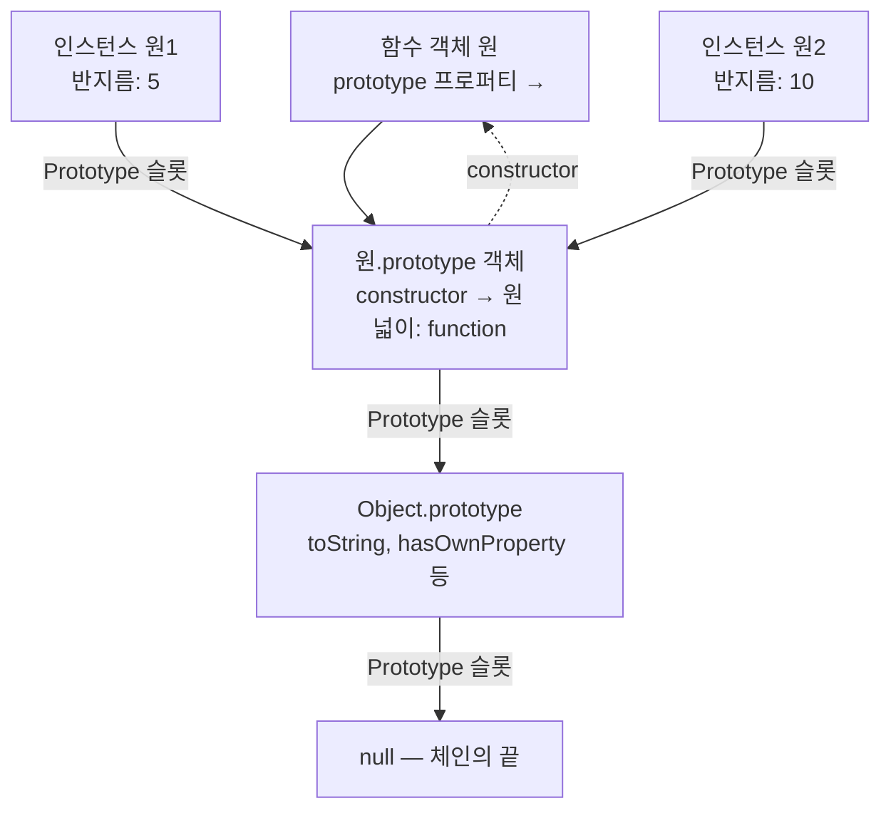
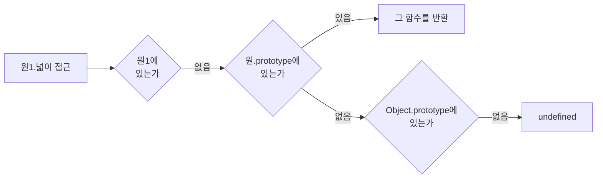
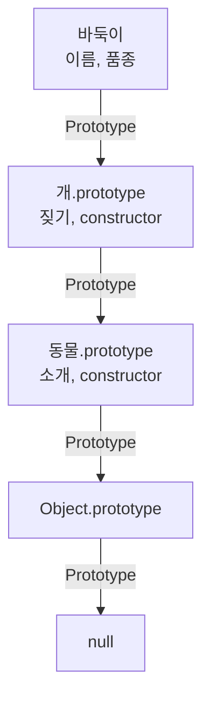

<Callout type="info">
  **이번 문서의 목표:** 이 파일을 다 읽으면 임의의 객체에서 어떤 프로퍼티를 읽을 때 엔진이 **어느 객체를 어떤 순서로 뒤지는지** 그림으로 그릴 수 있고, `prototype`과 `__proto__`를 헷갈리지 않게 된다.
</Callout>

## 1. 상속이라는 문제

11편 끝에서 남긴 문제부터 다시 봅시다.

```js
function 원(반지름) {
  this.반지름 = 반지름;
  this.넓이 = function () { return Math.PI * this.반지름 ** 2; };
}
const a = new 원(1);
const b = new 원(2);
console.log(a.넓이 === b.넓이); // false — 함수가 두 개 만들어졌다
```

인스턴스마다 똑같은 함수가 복제됩니다. 원을 1만 개 만들면 동일한 함수 객체가 1만 개입니다. 명백한 낭비입니다.

원하는 것은 이렇습니다. **데이터는 인스턴스마다 따로, 동작은 하나만 두고 모두가 빌려 쓰기.** 반지름은 개별로, 넓이 계산은 공유로 두자는 뜻입니다. 이 "빌려 쓰기"를 구현하는 JavaScript의 방식이 **프로토타입**(prototype)입니다.

> **쉽게 말하면:** 프로토타입은 "내가 못 하는 건 저 사람한테 물어봐"라고 적힌 쪽지입니다. 객체마다 이 쪽지가 하나씩 붙어 있고, 물어본 사람도 모르면 그 사람의 쪽지를 따라 또 물어봅니다.

prototype은 그리스어 뿌리에서 온 말로 proto(처음의)와 type(형태)이 합쳐진 "**원형, 시제품**"이라는 뜻입니다. 자동차 시제품 하나를 만들어 두고 양산차들이 그 설계를 따르는 이미지가 정확합니다.

## 2. 클래스 기반과 프로토타입 기반의 차이

Java, C++ 같은 언어는 **클래스 기반**(class-based)입니다. 클래스는 설계도이고 인스턴스는 그 설계도로 찍어낸 제품입니다. 설계도는 실행 중에 존재하는 물건이 아니라 컴파일 시점의 틀입니다.

JavaScript는 **프로토타입 기반**(prototype-based)입니다. 설계도가 따로 없고, **이미 존재하는 객체를 다른 객체가 참조**합니다.

| 구분 | 클래스 기반 | 프로토타입 기반 |
|---|---|---|
| 상속의 대상 | 설계도(클래스) | 실제 존재하는 객체 |
| 상속의 방식 | 멤버를 복사해서 새 타입 정의 | 객체끼리 연결 |
| 실행 중 변경 | 대체로 불가 | 언제든 연결과 내용 변경 가능 |
| 관계의 실체 | 타입 계층 | 참조 화살표 |

이 차이 때문에 JavaScript에서는 **상속이 "복사"가 아니라 "연결**"입니다. 이 한 문장을 붙잡고 가면 나머지가 술술 풀립니다.

## 3. 두 개의 이름을 반드시 구분하라

프로토타입에서 사람들이 무너지는 지점은 딱 하나입니다. **비슷하게 생긴 두 이름을 혼동하는 것**입니다.

| 이름 | 누구에게 있는가 | 무엇을 가리키는가 |
|---|---|---|
| `prototype` | **함수 객체**에만 있음 | 이 함수를 `new`로 만들 때 인스턴스가 참조할 객체 |
| `[[Prototype]]` 내부 슬롯 | **모든 객체**에 있음 | 자신이 상속받는 부모 객체 |
| `__proto__` | 모든 객체 – 접근자 프로퍼티 | `[[Prototype]]` 슬롯을 읽고 쓰는 통로 |

세 줄을 다시 강조합니다.

- **`prototype`은 "내가 만들 자식들이 볼 것"** – 함수만 갖는다.
- **`[[Prototype]]`은 "내가 보는 부모"** – 모든 객체가 갖는다.

`[[Prototype]]`처럼 대괄호 두 겹으로 감싼 이름은 명세가 **내부 슬롯**(internal slot)을 표기하는 방식입니다. 코드로 직접 쓸 수 없는, 엔진 내부의 숨은 칸을 뜻합니다.

### 그림으로 보기

```js
function 원(반지름) { this.반지름 = 반지름; }
원.prototype.넓이 = function () { return Math.PI * this.반지름 ** 2; };
const 원1 = new 원(5);
```



이 그림 하나가 프로토타입의 전부입니다. 화살표 방향을 눈으로 따라가 보세요.

- 함수 `원`은 `prototype` 프로퍼티로 아래쪽 객체를 가리킨다.
- 인스턴스들은 `[[Prototype]]` 슬롯으로 **같은** 객체를 가리킨다.
- 그 객체도 `[[Prototype]]`으로 `Object.prototype`을 가리킨다.
- `Object.prototype`의 `[[Prototype]]`은 `null`이다 – 여기가 끝이다.

### constructor 프로퍼티

`원.prototype` 객체에는 기본으로 `constructor`라는 프로퍼티가 하나 들어 있고, 그것이 다시 함수 `원`을 가리킵니다. 함수와 그 프로토타입 객체는 **서로를 가리키는 한 쌍**으로 태어납니다.

```js
console.log(원.prototype.constructor === 원); // true
console.log(원1.constructor === 원);          // true — 상속으로 찾아냄
```

### __proto__를 쓰지 말아야 하는 이유

`__proto__`(던더 프로토 — double underscore의 dunder에서 온 별명)는 원래 브라우저들이 비표준으로 만든 것이 나중에 호환성 때문에 표준 부록에 들어간 물건입니다. 지금은 다음 표준 메서드를 씁니다.

```js
Object.getPrototypeOf(원1);        // 읽기
Object.setPrototypeOf(원1, 다른것); // 쓰기 — 성능상 권장하지 않음
Object.create(부모객체);            // 프로토타입을 지정해 새 객체 만들기
```

## 4. 프로퍼티 탐색 알고리즘

### 규칙

`객체.이름`을 평가할 때 엔진이 하는 일은 9편의 스코프 체인 검색과 놀랍도록 닮았습니다.

1. 객체 **자신**이 `이름`을 **고유 프로퍼티**(own property)로 갖고 있는가? 있으면 그 값을 쓰고 끝.
2. 없으면 `[[Prototype]]` 슬롯을 따라 부모 객체로 이동해 1번을 반복.
3. `null`에 도달했는데도 없으면 → **`undefined`**를 반환한다.

3번이 중요합니다. 스코프 체인은 못 찾으면 `ReferenceError`를 던지지만, **프로토타입 체인은 못 찾으면 조용히 `undefined`**를 줍니다. 이 차이가 오타 버그를 잡기 어렵게 만드는 원인입니다.



### 쓰기는 다르게 동작한다

여기가 함정입니다. **읽기는 체인을 타지만, 쓰기는 타지 않습니다.**

```js
원1.넓이 = "내 것";
console.log(원1.넓이);              // "내 것"
console.log(원2.넓이);              // 여전히 원본 함수
console.log(원.prototype.넓이);     // 원본 그대로 — 안 바뀌었다
```

`원1.넓이 = ...`는 프로토타입에 있는 것을 고치지 않고, **원1 자신에게 같은 이름의 고유 프로퍼티를 새로 만듭니다.** 이제 원1에서 `넓이`를 읽으면 1단계에서 바로 찾히므로 프로토타입까지 가지 않습니다.

이 현상을 **섀도잉**(shadowing, 가리기)이라고 합니다. 앞에 선 사람이 뒷사람을 가려 안 보이게 하는 것과 같습니다. 프로토타입의 값은 사라지지 않고 **가려져 있을 뿐**이라, 인스턴스의 고유 프로퍼티를 지우면 다시 드러납니다.

```js
delete 원1.넓이;
console.log(typeof 원1.넓이); // "function" — 다시 프로토타입 것이 보인다
```

<Callout type="warning">
  **자주 틀리는 점:** "프로토타입 메서드를 인스턴스에서 수정했다"고 생각하는 실수가 흔합니다. 실제로는 수정이 아니라 **가리기**입니다. 프로토타입 자체를 바꾸려면 `원.prototype.넓이 = ...`처럼 프로토타입 객체를 직접 지목해야 합니다.
</Callout>

## 5. 실험 — 체인을 직접 걸어 보기

<CodePlayground
  template="vanilla"
  activeFile="/index.js"
  showConsole
  label="실험 1 — 프로토타입 체인 탐색과 섀도잉 관찰"
  files={{
    '/index.js': `function 원(반지름) { this.반지름 = 반지름; }
원.prototype.넓이 = function () {
  return Number((Math.PI * this.반지름 ** 2).toFixed(2));
};

const 원1 = new 원(5);
const 원2 = new 원(10);

// 1) 메서드가 공유되는지 확인
console.log("1) 메서드 공유:", 원1.넓이 === 원2.넓이);
console.log("   넓이 계산:", 원1.넓이(), 원2.넓이());

// 2) prototype과 Prototype 슬롯의 관계
console.log("2) getPrototypeOf(원1) === 원.prototype:",
  Object.getPrototypeOf(원1) === 원.prototype);
console.log("   원.prototype.constructor === 원:",
  원.prototype.constructor === 원);

// 3) 체인을 끝까지 걸어 보기
let 현재 = 원1;
let 단계 = 0;
while (현재 !== null) {
  const 이름 = 현재 === 원1 ? "인스턴스"
    : 현재 === 원.prototype ? "원.prototype"
    : 현재 === Object.prototype ? "Object.prototype" : "기타";
  console.log("3) 체인 " + 단계 + "단계:", 이름,
    "/ 고유 키:", Object.getOwnPropertyNames(현재).slice(0, 5).join(", "));
  현재 = Object.getPrototypeOf(현재);
  단계++;
}
console.log("   체인의 끝은 null");

// 4) 고유 프로퍼티인지 상속받은 것인지 구분
console.log("4) 반지름은 고유?:", 원1.hasOwnProperty("반지름"));
console.log("   넓이는 고유?:", 원1.hasOwnProperty("넓이"));
console.log("   넓이에 접근은 되는가?:", "넓이" in 원1);

// 5) 섀도잉 — 쓰기는 체인을 타지 않는다
원1.넓이 = "내가 가림";
console.log("5) 원1.넓이:", 원1.넓이);
console.log("   원2.넓이는 그대로:", typeof 원2.넓이);
console.log("   프로토타입은 무사한가:", typeof 원.prototype.넓이);
delete 원1.넓이;
console.log("   삭제 후 다시 드러남:", typeof 원1.넓이);

// 6) 없는 프로퍼티는 에러가 아니라 undefined
console.log("6) 없는 프로퍼티:", 원1.없는이름);`,
  }}
/>

3번 반복문의 출력이 이 편의 그림을 코드로 확인시켜 줍니다. 인스턴스 → `원.prototype` → `Object.prototype` → `null` 순으로 정확히 세 칸입니다.

## 6. 프로토타입 체인의 끝 — Object.prototype

모든 일반 객체는 체인을 거슬러 올라가면 결국 `Object.prototype`에 도달합니다. 이 객체가 **최상위 프로토타입**이고, 그 `[[Prototype]]`은 `null`입니다.

`Object.prototype`에 들어 있는 것들 덕분에 우리는 아무 객체에서나 이런 메서드를 쓸 수 있습니다.

- `hasOwnProperty(키)` – 그 키가 **고유 프로퍼티**인지 검사. 상속받은 것이면 `false`.
- `toString()` – 문자열 변환 시 호출됨. 5편의 ToPrimitive와 연결됩니다.
- `valueOf()` – 원시값 변환 시 호출됨.
- `isPrototypeOf(객체)` – 자신이 그 객체의 체인 위에 있는지 검사.

### 프로토타입이 없는 객체 만들기

```js
const 순수사전 = Object.create(null);
순수사전.키 = "값";
console.log(순수사전.toString); // undefined — 상속받은 것이 하나도 없다
```

`Object.create(null)`로 만든 객체는 체인이 아예 없습니다. 이를 **딕셔너리 객체**로 쓰면 `toString`, `constructor` 같은 상속된 이름과 사용자 키가 충돌하는 사고를 막을 수 있습니다. 다만 요즘은 이 용도로 `Map`(23편)을 쓰는 것이 더 일반적입니다.

## 7. in, hasOwnProperty, 그리고 열거

프로퍼티가 "있는지" 묻는 방법이 여러 개이고, 각각 **체인을 보는 범위가 다릅니다.**

| 방법 | 체인을 따라가는가 | 열거 불가능한 것도 보는가 |
|---|---|---|
| `키 in 객체` | 예 | 예 |
| `객체.hasOwnProperty(키)` | 아니오 – 고유만 | 예 |
| `Object.hasOwn(객체, 키)` | 아니오 – 고유만 | 예 |
| `for...in` 순회 | 예 | 아니오 – 열거 가능만 |
| `Object.keys(객체)` | 아니오 – 고유만 | 아니오 |

`for...in`이 체인을 따라간다는 점이 특히 사고를 냅니다.

```js
function 사람(이름) { this.이름 = 이름; }
사람.prototype.종 = "인간";
const 나 = new 사람("가나");

for (const 키 in 나) console.log(키); // "이름", "종" — 상속된 것까지 나온다
console.log(Object.keys(나));          // ["이름"] — 고유만
```

프로토타입에 붙인 메서드가 `for...in`에 섞여 나오는 것을 막으려고 예전에는 이렇게 썼습니다.

```js
for (const 키 in 나) {
  if (Object.hasOwn(나, 키)) console.log(키);
}
```

지금은 `Object.keys`, `Object.entries`, `for...of`(24편)를 쓰면 이 문제 자체가 생기지 않습니다.

<Callout type="warning">
  **자주 틀리는 점:** `Object.prototype`의 메서드는 **열거 불가능**(non-enumerable)으로 설정되어 있어서 `for...in`에 나오지 않습니다. 그래서 "체인을 따라가는데 왜 toString은 안 나오지?"라는 혼란이 생깁니다. 프로퍼티 어트리뷰트 이야기는 7편을 참고하세요.
</Callout>

## 8. instanceof — 무엇을 검사하는가

```js
console.log(원1 instanceof 원);      // true
console.log(원1 instanceof Object);  // true
```

`instanceof`는 이름 때문에 "타입 검사"처럼 보이지만, 실제로 하는 일은 다릅니다.

**`객체 instanceof 생성자`는, 생성자의 `prototype` 객체가 객체의 프로토타입 체인 어딘가에 있는지를 검사합니다.**

즉 타입을 보는 것이 아니라 **체인 위에 특정 객체가 있는지**를 보는 것입니다. 그래서 프로토타입을 바꿔치기하면 결과도 바뀝니다.

```js
function 원(r) { this.반지름 = r; }
const 원1 = new 원(5);
원.prototype = {}; // 프로토타입 객체를 통째로 교체
console.log(원1 instanceof 원); // false — 만들 때 쓴 객체와 달라졌다
```

`원1`은 여전히 옛 프로토타입 객체를 가리키고 있는데, `원.prototype`은 새 객체를 가리키니 둘이 만나지 않습니다.

같은 검사를 더 직접적으로 하려면 이렇게 씁니다.

```js
console.log(원.prototype.isPrototypeOf(원1));
```

## 9. 프로토타입으로 상속 계층 만들기

`class`(14편)가 없던 시절, 상속은 손으로 체인을 이어 붙여 만들었습니다. 지금은 직접 쓸 일이 드물지만, `class`가 무엇을 자동화해 주는지 알려면 한 번은 봐야 합니다.

```js
// 부모
function 동물(이름) {
  this.이름 = 이름;
}
동물.prototype.소개 = function () {
  return "저는 " + this.이름 + "입니다";
};

// 자식
function 개(이름, 품종) {
  동물.call(this, 이름); // ① 부모 생성자를 이 객체에 대고 실행
  this.품종 = 품종;
}
개.prototype = Object.create(동물.prototype); // ② 체인 연결
개.prototype.constructor = 개;                 // ③ constructor 복구
개.prototype.짖기 = function () {
  return "멍멍";
};

const 바둑이 = new 개("바둑이", "진돗개");
console.log(바둑이.소개()); // 부모에게서 상속
console.log(바둑이.짖기()); // 자기 것
```

세 단계 각각의 의미를 짚습니다.

- **①** 부모 생성자를 `call`로 호출해(12편의 명시적 바인딩) 부모가 만들던 인스턴스 프로퍼티를 지금 만드는 객체에 심습니다.
- **②** `Object.create`로 부모 프로토타입을 `[[Prototype]]`으로 삼는 새 객체를 만들어 자식의 `prototype`으로 둡니다. 여기서 `개.prototype = 동물.prototype`처럼 직접 대입하면 안 됩니다 — 자식에 메서드를 추가할 때 부모까지 오염됩니다.
- **③** ②에서 `prototype`을 통째로 갈아 끼웠기 때문에 원래 있던 `constructor`가 사라집니다. 수동으로 복구합니다.



이 세 줄짜리 의식을 `class 개 extends 동물`이라는 한 줄로 바꿔 준 것이 ES6의 `class`입니다. 14편에서 이 그림이 그대로 재현되는 것을 확인하게 됩니다.

## 10. 실험 — 상속과 instanceof

<CodePlayground
  template="vanilla"
  activeFile="/index.js"
  showConsole
  label="실험 2 — 상속 계층과 프로퍼티 검사 방법 비교"
  files={{
    '/index.js': `function 동물(이름) { this.이름 = 이름; }
동물.prototype.소개 = function () { return "저는 " + this.이름; };

function 개(이름, 품종) {
  동물.call(this, 이름);
  this.품종 = 품종;
}
개.prototype = Object.create(동물.prototype);
개.prototype.constructor = 개;
개.prototype.짖기 = function () { return "멍멍"; };

const 바둑이 = new 개("바둑이", "진돗개");

console.log("1) 상속 메서드:", 바둑이.소개());
console.log("   자기 메서드:", 바둑이.짖기());

console.log("2) instanceof 개:", 바둑이 instanceof 개);
console.log("   instanceof 동물:", 바둑이 instanceof 동물);
console.log("   instanceof Object:", 바둑이 instanceof Object);
console.log("   constructor 복구 확인:", 바둑이.constructor === 개);

console.log("3) 검사 방법별 결과 비교 — 키: 이름 / 소개 / 없음");
const 키들 = ["이름", "소개", "없음"];
키들.forEach(function (키) {
  console.log("  " + 키 +
    " | in:" + (키 in 바둑이) +
    " | hasOwn:" + Object.hasOwn(바둑이, 키) +
    " | keys포함:" + Object.keys(바둑이).includes(키));
});

console.log("4) for...in은 상속된 열거 가능 프로퍼티까지 본다");
const 나온키 = [];
for (const 키 in 바둑이) 나온키.push(키);
console.log("   for...in:", 나온키.join(", "));
console.log("   Object.keys:", Object.keys(바둑이).join(", "));
console.log("   toString은 왜 안 나오나 → 열거 불가능이라서");

console.log("5) 프로토타입 없는 객체");
const 순수 = Object.create(null);
순수.키 = "값";
console.log("   toString 상속 여부:", typeof 순수.toString);
console.log("   체인:", Object.getPrototypeOf(순수));

console.log("6) prototype을 교체하면 instanceof가 깨진다");
function 임시(){}
const 인스턴스 = new 임시();
임시.prototype = {};
console.log("   교체 후:", 인스턴스 instanceof 임시);`,
  }}
/>

## 핵심 정리

- JavaScript의 상속은 **복사가 아니라 연결**이다. 객체는 `[[Prototype]]` 내부 슬롯으로 부모 객체를 가리키고, 이 화살표들이 이어져 **프로토타입 체인**을 이룬다.
- **`prototype`은 함수만 갖는 프로퍼티**로 "내가 만들 인스턴스들이 참조할 객체"를 가리키고, **`[[Prototype]]`은 모든 객체가 갖는 슬롯**으로 "내가 상속받는 부모"를 가리킨다. 이 둘을 구분하는 것이 전부다.
- 프로퍼티 **읽기**는 자기 자신 → 부모 → 조부모 순으로 체인을 타고, 끝까지 없으면 에러가 아니라 `undefined`를 준다.
- 프로퍼티 **쓰기**는 체인을 타지 않고 항상 자기 자신에게 고유 프로퍼티를 만든다. 그 결과 프로토타입의 값이 **섀도잉**된다.
- 체인의 끝은 `Object.prototype`이며 그 부모는 `null`이다. `Object.create(null)`로 체인 없는 객체를 만들 수 있다.
- `in`과 `for...in`은 체인을 따라가고, `hasOwnProperty`·`Object.hasOwn`·`Object.keys`는 고유 프로퍼티만 본다.
- `instanceof`는 타입 검사가 아니라 **생성자의 `prototype` 객체가 체인 위에 있는지**를 검사한다.
- 생성자 함수로 상속 계층을 만들려면 부모 생성자 `call`, `Object.create`로 체인 연결, `constructor` 복구의 세 단계가 필요하며, 이를 한 줄로 줄인 것이 `class extends`다.

## 마무리 복습

<Quiz
  questionNumber={1}
  question="함수의 prototype 프로퍼티와 객체의 내부 슬롯 Prototype의 관계를 옳게 설명한 것은?"
  options={['둘 다 모든 객체가 갖는 같은 것이다', 'prototype은 함수만 갖고 자신이 만들 인스턴스가 참조할 객체를 가리키며, 내부 슬롯은 모든 객체가 갖고 자신의 부모를 가리킨다', 'prototype은 모든 객체가 갖고 내부 슬롯은 함수만 갖는다', '둘 다 항상 null이다']}
  correctAnswer={2}
  explanation="prototype은 함수 객체에만 있는 일반 프로퍼티로 앞으로 만들 인스턴스들이 부모로 삼을 객체를 가리킨다. 내부 슬롯은 모든 객체가 갖고 자신이 실제로 상속받는 부모를 가리킨다. new 연산자가 이 둘을 연결한다."
  optionExplanations={['서로 다른 것이며 소유자도 다르다', '정답 — 내가 만들 자식이 볼 것과 내가 보는 부모의 차이다', '설명이 뒤바뀌어 있다', 'null이 되는 것은 체인의 끝뿐이다']}
/>

<Quiz
  questionNumber={2}
  question="객체에서 어떤 프로퍼티를 읽으려 했는데 프로토타입 체인 끝까지 찾지 못했다면 결과는?"
  options={['ReferenceError가 발생한다', 'TypeError가 발생한다', 'undefined가 반환된다', 'null이 반환된다']}
  correctAnswer={3}
  explanation="스코프 체인 검색은 실패하면 ReferenceError를 던지지만, 프로토타입 체인 검색은 실패해도 조용히 undefined를 반환한다. 그래서 프로퍼티 이름 오타가 에러 없이 넘어가 버그를 늦게 발견하게 된다."
  optionExplanations={['그것은 스코프 체인 검색 실패 시의 동작이다', '이어서 그 값을 호출하면 TypeError가 나지만 읽기 자체는 성공한다', '정답 — 조용히 undefined가 나온다', 'null이 아니라 undefined다']}
/>

<Quiz
  questionNumber={3}
  question="인스턴스에서 프로토타입에 있는 메서드와 같은 이름으로 값을 할당하면 어떻게 되는가?"
  options={['프로토타입의 메서드가 수정된다', '인스턴스에 같은 이름의 고유 프로퍼티가 새로 생겨 프로토타입의 것을 가린다', 'TypeError가 발생한다', '다른 인스턴스들에도 함께 반영된다']}
  correctAnswer={2}
  explanation="프로퍼티 쓰기는 체인을 타지 않고 항상 대상 객체 자신에게 고유 프로퍼티를 만든다. 그 결과 프로토타입의 값이 가려지는데 이를 섀도잉이라고 한다. 그 고유 프로퍼티를 삭제하면 프로토타입의 값이 다시 보인다."
  optionExplanations={['프로토타입은 그대로다', '정답 — 섀도잉이며 가리는 것이지 고치는 것이 아니다', '에러는 나지 않는다', '다른 인스턴스에는 영향이 없다']}
/>

<Quiz
  questionNumber={4}
  question="instanceof 연산자가 실제로 검사하는 것은?"
  options={['객체의 typeof 결과가 생성자 이름과 같은지', '생성자의 prototype 객체가 대상 객체의 프로토타입 체인 위에 있는지', '객체가 그 생성자로 만들어졌다는 기록이 남아 있는지', '객체의 constructor 프로퍼티 값이 그 생성자인지']}
  correctAnswer={2}
  explanation="instanceof는 타입 정보를 보는 것이 아니라 체인을 따라 올라가며 생성자의 prototype 객체를 만나는지를 검사한다. 그래서 생성 이후 prototype을 교체하면 결과가 바뀐다."
  optionExplanations={['typeof와는 무관하다', '정답 — 체인 위에 있는지가 기준이다', '생성 기록을 보관하지 않는다', 'constructor는 상속으로 찾는 값일 뿐 판정 기준이 아니다']}
/>

<Quiz
  questionNumber={5}
  question="for...in 순회와 Object.keys의 차이로 옳은 것은?"
  options={['for...in은 프로토타입 체인의 열거 가능한 프로퍼티까지 포함하고, Object.keys는 고유 프로퍼티만 반환한다', '둘 다 고유 프로퍼티만 다룬다', 'for...in은 열거 불가능한 프로퍼티까지 포함한다', 'Object.keys는 체인을 따라간다']}
  correctAnswer={1}
  explanation="for...in은 체인을 따라 올라가며 열거 가능한 프로퍼티를 모두 방문하고, Object.keys는 대상 객체의 고유하면서 열거 가능한 프로퍼티만 배열로 준다. Object.prototype의 메서드들은 열거 불가능이라 for...in에도 나오지 않는다."
  optionExplanations={['정답 — 체인 포함 여부가 핵심 차이다', 'for...in은 상속된 것도 본다', '열거 불가능한 것은 for...in에도 나오지 않는다', 'Object.keys는 고유 프로퍼티만 본다']}
/>

<Quiz
  questionNumber={6}
  question="생성자 함수로 상속을 구현할 때 자식.prototype = 부모.prototype 처럼 직접 대입하면 안 되는 이유는?"
  options={['문법 에러가 발생하기 때문', '자식과 부모가 같은 객체를 공유하게 되어 자식에 메서드를 추가하면 부모까지 오염되기 때문', '부모의 생성자가 실행되지 않기 때문', 'instanceof가 항상 false가 되기 때문']}
  correctAnswer={2}
  explanation="직접 대입하면 두 생성자의 prototype이 동일한 객체를 가리키게 된다. 이후 자식 전용 메서드를 추가하면 부모 인스턴스에서도 그 메서드가 보인다. Object.create로 부모 프로토타입을 상속하는 새 객체를 만들어야 한다."
  optionExplanations={['문법상으로는 가능해서 더 위험하다', '정답 — 같은 객체를 공유해 부모가 오염된다', '부모 생성자 호출은 별개 문제이며 call로 해결한다', 'instanceof는 오히려 true가 나온다']}
/>

<Quiz
  questionNumber={7}
  question="Object.create(null)로 만든 객체의 특징으로 옳은 것은?"
  options={['어떤 프로퍼티도 추가할 수 없다', '프로토타입 체인이 없어 toString이나 hasOwnProperty를 상속받지 못한다', '자동으로 Object.prototype을 상속한다', '읽기 전용 객체가 된다']}
  correctAnswer={2}
  explanation="Object.create의 인수로 null을 주면 내부 슬롯이 null인 객체가 만들어져 상속받는 것이 하나도 없다. 사용자 키가 상속된 이름과 충돌하지 않는 순수한 딕셔너리로 쓸 수 있지만, 요즘은 같은 목적에 Map을 더 많이 쓴다."
  optionExplanations={['프로퍼티는 자유롭게 추가할 수 있다', '정답 — 상속받는 것이 전혀 없다', '오히려 상속하지 않는 것이 목적이다', '읽기 전용이 아니다']}
/>

<Quiz
  questionNumber={8}
  question="프로토타입에 메서드를 두는 방식이 생성자 몸통에서 this에 메서드를 붙이는 방식보다 나은 이유로 가장 적절한 것은?"
  options={['프로토타입 메서드가 더 빠르게 실행되기 때문', '인스턴스가 몇 개든 함수 객체는 하나만 존재해 메모리를 아끼고 수정 지점이 한 곳이기 때문', '프로토타입 메서드에서만 this를 쓸 수 있기 때문', '생성자 몸통에서는 함수를 정의할 수 없기 때문']}
  correctAnswer={2}
  explanation="생성자 몸통에서 함수를 할당하면 인스턴스마다 별개의 함수 객체가 만들어진다. 프로토타입에 두면 모든 인스턴스가 하나의 함수를 공유하므로 메모리를 아끼고, 동작을 고칠 때도 한 곳만 고치면 된다."
  optionExplanations={['실행 속도 자체가 본질적 이유는 아니다', '정답 — 데이터는 개별, 동작은 공유가 핵심이다', '두 경우 모두 this를 쓸 수 있다', '생성자 몸통에서도 함수를 정의할 수 있다']}
/>

## 참고 자료

- [MDN - Inheritance and the prototype chain](https://developer.mozilla.org/en-US/docs/Web/JavaScript/Guide/Inheritance_and_the_prototype_chain)
- [MDN - Object.getPrototypeOf](https://developer.mozilla.org/en-US/docs/Web/JavaScript/Reference/Global_Objects/Object/getPrototypeOf)
- [MDN - Object.create](https://developer.mozilla.org/en-US/docs/Web/JavaScript/Reference/Global_Objects/Object/create)
- [MDN - instanceof](https://developer.mozilla.org/en-US/docs/Web/JavaScript/Reference/Operators/instanceof)
- [ECMAScript Language Specification - Ordinary Object Internal Methods](https://262.ecma-international.org/)
