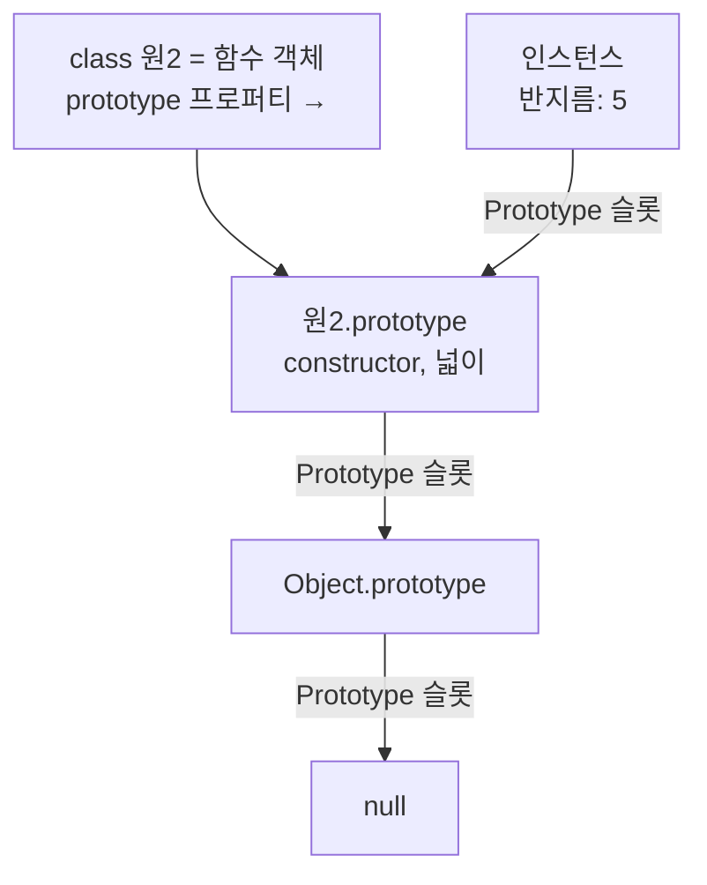
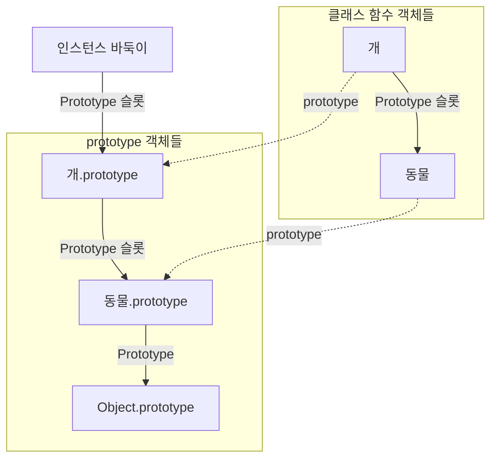
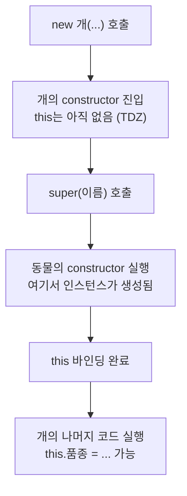

<Callout type="info">
  **이번 문서의 목표:** 이 파일을 다 읽으면 `class` 문법의 각 요소가 13편의 프로토타입 그림 어디에 대응되는지 짚을 수 있고, `super`가 왜 필요한지·private 필드가 클로저 은닉과 무엇이 다른지 설명할 수 있게 된다.
</Callout>

## 1. class는 새로운 객체 모델이 아니다

가장 먼저 못 박아야 할 문장이 있습니다.

> **쉽게 말하면:** `class`는 JavaScript에 **클래스 기반 상속을 새로 도입한 것이 아닙니다.** 13편에서 손으로 하던 프로토타입 연결 작업을 **문법으로 정비한 것**입니다.

이런 문법을 흔히 **문법적 설탕**(syntactic sugar, 신택틱 슈거 — 기능은 그대로인데 쓰기 달콤해진 문법)이라고 부릅니다. 다만 `class`는 완전한 설탕은 아닙니다. 생성자 함수로는 흉내 낼 수 없는 고유한 제약과 기능이 여럿 붙어 있어서, "설탕 그 이상"이라고 보는 것이 정확합니다. 이 편에서 그 차이를 하나씩 확인합니다.

### 같은 것을 두 문법으로

```js
// 생성자 함수 방식 (13편)
function 원(반지름) { this.반지름 = 반지름; }
원.prototype.넓이 = function () { return Math.PI * this.반지름 ** 2; };

// class 방식
class 원2 {
  constructor(반지름) { this.반지름 = 반지름; }
  넓이() { return Math.PI * this.반지름 ** 2; }
}
```

두 코드가 만드는 구조는 **거의 같습니다.** `넓이` 메서드는 `원2.prototype`에 올라가고, 인스턴스는 `[[Prototype]]` 슬롯으로 그 객체를 가리킵니다.



`typeof 원2`를 찍어 보면 `"function"`이 나옵니다. **class는 함수입니다.**

## 2. class만의 제약 — 설탕이 아닌 부분

`class`가 생성자 함수와 다르게 동작하는 지점이 다섯 군데 있습니다. 전부 **실수를 막기 위한 제약**입니다.

| 제약 | 생성자 함수 | class |
|---|---|---|
| `new` 없이 호출 | 가능 – 전역 오염 위험 | TypeError |
| 몸통의 실행 모드 | 선언한 곳을 따름 | 항상 strict mode |
| 호이스팅 | 함수 선언문은 미리 완성됨 | TDZ 적용 – 선언 전 접근 시 ReferenceError |
| 메서드의 열거 가능성 | 열거 가능 – `for...in`에 나옴 | 열거 불가능 |
| 메서드를 `new`로 호출 | 가능 | TypeError – 메서드는 생성자가 아님 |

세 번째 줄이 중요합니다. `class` 선언도 9편에서 배운 대로 **호이스팅은 됩니다.** 다만 `let`·`const`처럼 **TDZ**(Temporal Dead Zone, 일시적 사각지대)에 놓여 초기화 전에는 접근할 수 없습니다. "class는 호이스팅되지 않는다"는 흔한 설명은 부정확합니다.

<Callout type="warning">
  **자주 틀리는 점:** `class` 몸통이 항상 strict mode라는 사실 때문에, 안에서 일반 함수 호출을 하면 `this`가 전역 객체가 아니라 `undefined`가 됩니다. 12편에서 배운 바인딩 상실이 `class` 안에서는 `undefined` 접근 에러로 즉시 드러납니다 — 조용히 망가지지 않으니 오히려 좋은 일입니다.
</Callout>

## 3. class 몸통에 들어갈 수 있는 것들

```js
class 계좌 {
  은행이름 = "제로은행";      // ① 인스턴스 필드
  #잔액 = 0;                  // ② private 필드
  static 총계좌수 = 0;        // ③ static 필드
  static #비밀키 = "abc";     // ④ static private 필드

  constructor(주인) {          // ⑤ 생성자
    this.주인 = 주인;
    계좌.총계좌수 += 1;
  }

  입금(금액) {                 // ⑥ 프로토타입 메서드
    this.#잔액 += 금액;
    return this.#잔액;
  }

  get 잔액() { return this.#잔액; }        // ⑦ 접근자 프로퍼티
  set 잔액(값) { throw new Error("직접 수정 금지"); }

  static 안내() { return "계좌 클래스"; }  // ⑧ static 메서드

  #내부검증() { return this.#잔액 >= 0; }  // ⑨ private 메서드
}
```

각 요소가 **어디에 저장되는지**가 핵심입니다.

| 요소 | 저장 위치 |
|---|---|
| 인스턴스 필드 – `은행이름` | 인스턴스 자신 |
| 생성자에서 `this.주인 = ...` | 인스턴스 자신 |
| 프로토타입 메서드 – `입금` | `계좌.prototype` |
| 접근자 `get`·`set` | `계좌.prototype` |
| static 필드·메서드 | 클래스 함수 객체 자신 |
| private 필드·메서드 | 인스턴스 내부의 비공개 저장소 |

## 4. 인스턴스 필드 — 언제 만들어지는가

**클래스 필드**(class field)는 `constructor` 없이도 인스턴스 프로퍼티를 선언할 수 있게 해 줍니다.

```js
class 사용자 {
  이름 = "익명";
  로그인여부 = false;
}
console.log(new 사용자().이름); // "익명"
```

내부적으로는 **`constructor` 몸통이 실행되기 직전에 순서대로 초기화**됩니다. 그래서 생성자에서 필드 값을 덮어쓸 수 있습니다.

```js
class 사용자 {
  이름 = "익명";
  constructor(이름) {
    if (이름) this.이름 = 이름; // 필드가 먼저 세팅된 뒤 덮어씀
  }
}
```

필드 초기화식에서는 `this`를 쓸 수 있고, **위에 선언된 필드만** 참조할 수 있습니다. 아래에 있는 필드를 참조하면 아직 초기화되지 않아 `undefined`입니다.

### 화살표 함수 필드라는 관용구

```js
class 버튼 {
  이름 = "저장";
  클릭 = () => console.log(this.이름); // 인스턴스에 저장되는 화살표 함수
  클릭2() { console.log(this.이름); }   // prototype에 저장되는 일반 메서드
}
const b = new 버튼();
const 꺼낸1 = b.클릭;  const 꺼낸2 = b.클릭2;
꺼낸1(); // "저장" — this가 유지된다
꺼낸2(); // TypeError — this가 undefined
```

12편의 바인딩 상실을 막는 흔한 기법입니다. 화살표 함수 필드는 인스턴스 생성 시점에 만들어지고, 그때의 `this`는 인스턴스이므로 렉시컬 this가 인스턴스로 고정됩니다. 대가는 **인스턴스마다 함수가 하나씩 만들어진다**는 점입니다 — 프로토타입 공유의 이점을 포기하는 거래입니다.

## 5. private 필드 — 진짜 비공개

### 왜 필요했나

10편에서 클로저로 상태를 은닉했습니다. 잘 동작하지만 두 가지 불편이 있었습니다. 첫째, 은닉된 값은 프로토타입 메서드에서 접근할 수 없습니다(생성자 안의 함수만 그 환경을 공유하므로). 둘째, 인스턴스마다 메서드가 복제됩니다.

`#`으로 시작하는 **private 필드**는 이 문제를 언어 차원에서 해결합니다.

```js
class 계좌 {
  #잔액 = 0;
  입금(금액) { this.#잔액 += 금액; return this.#잔액; }
  get 잔액() { return this.#잔액; }
}
const 내계좌 = new 계좌();
내계좌.입금(1000);
console.log(내계좌.잔액);   // 1000 — 읽기만 허용
// console.log(내계좌.#잔액); // SyntaxError — 문법 차원에서 차단
```

### 관례가 아니라 문법이다

예전에는 `_잔액`처럼 밑줄을 붙여 "이건 건드리지 마세요"라고 **표시만** 했습니다. 아무 강제력이 없어서 마음만 먹으면 접근할 수 있었습니다. `#`은 다릅니다.

- 클래스 몸통 **바깥에서는 문법 오류**입니다. 런타임 에러가 아니라 파싱 단계에서 거부됩니다.
- `Object.keys`, `JSON.stringify`, `for...in` 어디에도 나타나지 않습니다.
- `in` 연산자로 존재 여부만 검사할 수 있습니다 — `#잔액 in 객체` 형태이며, 이것도 클래스 몸통 안에서만 가능합니다.

```js
class 계좌 {
  #잔액 = 0;
  static 계좌인가(대상) { return #잔액 in 대상; } // 브랜드 체크
}
```

이 기법을 **브랜드 체크**(brand check)라고 부릅니다. `instanceof`는 프로토타입을 바꿔치기하면 속일 수 있지만, private 필드의 존재는 위조할 수 없어서 더 신뢰할 수 있는 판별법입니다.

<Callout type="warning">
  **자주 틀리는 점:** private 필드 이름의 `#`은 이름의 **일부**입니다. `this.#잔액`은 되지만 `this["#잔액"]`은 전혀 다른 것이며 동작하지 않습니다. private 필드는 일반 프로퍼티 테이블에 저장되지 않기 때문입니다.
</Callout>

## 6. static — 클래스 자신에게 붙는 것

**static**(스태틱, "정적인")은 인스턴스가 아니라 **클래스 함수 객체 자체**에 붙습니다.

```js
class 수학 {
  static PI = 3.14159;
  static 제곱(x) { return x * x; }
}
console.log(수학.제곱(4)); // 16
// new 수학().제곱(4);     // TypeError — 인스턴스에는 없다
```

`Math.max`, `Object.keys`, `Array.isArray`, `Promise.all` 같은 표준 메서드가 전부 static 메서드입니다. 인스턴스 하나하나와 무관한 **유틸리티**나 **팩토리**를 둘 자리입니다.

```js
class 날짜 {
  constructor(연, 월, 일) { Object.assign(this, { 연, 월, 일 }); }
  static 오늘() { const d = new Date(); return new 날짜(d.getFullYear(), d.getMonth() + 1, d.getDate()); }
}
```

static 메서드 안에서 `this`는 **클래스 자신**을 가리킵니다. 그래서 위 코드에서 `new 날짜(...)` 대신 `new this(...)`라고 써도 되고, 상속 시 자식 클래스가 이 static 메서드를 물려받으면 `this`는 자식 클래스가 됩니다.

### static 초기화 블록

필드 하나로 표현하기 복잡한 초기화가 필요할 때 씁니다.

```js
class 설정 {
  static 목록;
  static {
    const 원본 = ["a", "b", "c"];
    설정.목록 = 원본.map((v) => v.toUpperCase());
  }
}
```

클래스가 평가될 때 딱 한 번 실행됩니다.

## 7. 실험 — class의 각 요소가 어디에 저장되는가

<CodePlayground
  template="vanilla"
  activeFile="/index.js"
  showConsole
  label="실험 1 — class 요소의 저장 위치와 제약 확인"
  files={{
    '/index.js': `class 계좌 {
  은행이름 = "제로은행";
  #잔액 = 0;
  static 총계좌수 = 0;

  constructor(주인) {
    this.주인 = 주인;
    계좌.총계좌수 += 1;
  }
  입금(금액) { this.#잔액 += 금액; return this.#잔액; }
  get 잔액() { return this.#잔액; }
  static 안내() { return "계좌 클래스입니다"; }
}

const a = new 계좌("가나");
a.입금(1000);

// 1) class는 함수다
console.log("1) typeof 계좌:", typeof 계좌);

// 2) 메서드는 prototype에, 필드는 인스턴스에
console.log("2) 인스턴스 고유 키:", Object.getOwnPropertyNames(a).join(", "));
console.log("   prototype의 키:", Object.getOwnPropertyNames(계좌.prototype).join(", "));

// 3) 메서드는 공유된다
const b = new 계좌("다라");
console.log("3) 메서드 공유:", a.입금 === b.입금);

// 4) class 메서드는 열거 불가능 — for...in에 안 나온다
const 나온키 = [];
for (const 키 in a) 나온키.push(키);
console.log("4) for...in 결과:", 나온키.join(", "));

// 5) private 필드는 어디에도 노출되지 않는다
console.log("5) JSON:", JSON.stringify(a));
console.log("   Object.keys:", Object.keys(a).join(", "));
console.log("   getter로만 읽기:", a.잔액);

// 6) static은 클래스에만 있다
console.log("6) 계좌.총계좌수:", 계좌.총계좌수);
console.log("   계좌.안내():", 계좌.안내());
console.log("   인스턴스에 안내가 있나:", a.안내);

// 7) new 없이 호출하면 TypeError
try { 계좌("실수"); } catch (e) { console.log("7) new 없이:", e.constructor.name); }

// 8) 메서드를 new로 호출할 수 없다
try { new a.입금(1); } catch (e) { console.log("8) 메서드 + new:", e.constructor.name); }

// 9) class는 TDZ에 놓인다
try { new 나중클래스(); } catch (e) { console.log("9) 선언 전 접근:", e.constructor.name); }
class 나중클래스 {}`,
  }}
/>

4번 결과에 주목하세요. `for...in`에 `입금`이 나오지 않습니다. `class` 메서드는 **열거 불가능**으로 정의되기 때문입니다. 생성자 함수에서 `원.prototype.넓이 = ...`로 붙인 메서드는 열거 가능이라 나왔던 것과 대조됩니다.

## 8. extends와 super — 상속의 문법화

### 13편의 세 단계가 한 줄로

13편에서 상속을 만들려면 세 가지가 필요했습니다. 부모 생성자 `call`, `Object.create`로 체인 연결, `constructor` 복구. `class`는 이것을 `extends` 한 단어로 처리합니다.

```js
class 동물 {
  constructor(이름) { this.이름 = 이름; }
  소개() { return "저는 " + this.이름; }
}

class 개 extends 동물 {
  constructor(이름, 품종) {
    super(이름);      // 부모 생성자 호출
    this.품종 = 품종;
  }
  소개() {
    return super.소개() + ", " + this.품종 + "입니다"; // 부모 메서드 호출
  }
}

const 바둑이 = new 개("바둑이", "진돗개");
console.log(바둑이.소개()); // "저는 바둑이, 진돗개입니다"
```

### 두 개의 체인이 만들어진다

`extends`가 연결하는 것은 하나가 아니라 **둘**입니다.



- **프로토타입 체인**: 인스턴스 → `개.prototype` → `동물.prototype` – 인스턴스 메서드 상속의 통로
- **클래스 체인**: `개` → `동물` – **static 멤버 상속**의 통로

두 번째 연결 덕분에 자식 클래스가 부모의 static 메서드를 물려받습니다. 생성자 함수 방식으로는 손으로 `Object.setPrototypeOf(개, 동물)`을 해 줘야 얻을 수 있던 것입니다.

### super의 두 가지 얼굴

`super`는 위치에 따라 전혀 다른 일을 합니다.

| 형태 | 쓰는 자리 | 의미 |
|---|---|---|
| `super(인수)` | 자식 `constructor` 안 | 부모 생성자를 호출 |
| `super.메서드()` | 메서드 안 | 부모 프로토타입의 메서드를 호출 |

### this보다 super가 먼저인 이유

`class`에는 강력한 규칙이 하나 있습니다.

```js
class 개 extends 동물 {
  constructor(이름) {
    this.품종 = "진돗개"; // ReferenceError!
    super(이름);
  }
}
```

**자식 생성자에서는 부모 생성자 호출문보다 앞에서 `this`를 쓸 수 없습니다.** 이유는 `class` 상속에서 인스턴스를 실제로 만드는 주체가 **부모**이기 때문입니다.

11편에서 `new`의 1단계는 "빈 객체 생성"이었습니다. 그런데 `extends`가 있는 클래스에서는 이 단계가 자식이 아니라 **가장 위쪽 부모 생성자**에서 수행되고, 만들어진 객체가 `super()` 호출을 통해 아래로 전달됩니다. 그래서 `super()`를 부르기 전에는 `this`가 아직 존재하지 않는 **TDZ 상태**입니다.



생성자를 아예 쓰지 않으면 엔진이 **기본 생성자**를 넣어 줍니다.

```js
class 개 extends 동물 {} // 내부적으로 constructor(...args) { super(...args); }
```

<Callout type="warning">
  **자주 틀리는 점:** 자식 생성자를 정의해 놓고 `super()` 호출을 빠뜨리면 `ReferenceError`가 납니다. "생성자에서 특별히 할 일이 없다면 생성자를 아예 쓰지 않는다"가 안전한 습관입니다.
</Callout>

### new.target과 추상 클래스

11편에서 배운 `new.target`이 여기서 쓰입니다. 상속 관계에서 `new.target`은 **처음 `new`가 붙은 클래스**를 가리킵니다.

```js
class 도형 {
  constructor() {
    if (new.target === 도형) throw new Error("도형은 직접 만들 수 없습니다");
  }
}
class 원 extends 도형 {}

new 원();   // 정상 — new.target은 원
// new 도형(); // Error
```

JavaScript에는 `abstract` 키워드가 없지만, 이 패턴으로 **추상 클래스**(abstract class, 직접 인스턴스화하면 안 되는 상위 클래스)를 흉내 낼 수 있습니다.

## 9. 실험 — 상속, super, static 상속

<CodePlayground
  template="vanilla"
  activeFile="/index.js"
  showConsole
  label="실험 2 — extends가 만드는 두 개의 체인 확인"
  files={{
    '/index.js': `class 동물 {
  constructor(이름) { this.이름 = 이름; }
  소개() { return "저는 " + this.이름; }
  static 종류() { return "동물 계열"; }
}

class 개 extends 동물 {
  constructor(이름, 품종) {
    super(이름);
    this.품종 = 품종;
  }
  소개() { return super.소개() + ", " + this.품종; }
}

const 바둑이 = new 개("바둑이", "진돗개");

console.log("1) 오버라이딩 + super:", 바둑이.소개());

// 2) 프로토타입 체인 — 인스턴스 메서드 상속 통로
console.log("2) 개.prototype의 부모 === 동물.prototype:",
  Object.getPrototypeOf(개.prototype) === 동물.prototype);

// 3) 클래스 체인 — static 상속 통로
console.log("3) 개의 부모 === 동물:", Object.getPrototypeOf(개) === 동물);
console.log("   자식이 부모 static을 물려받음:", 개.종류());

// 4) instanceof는 체인 전체를 본다
console.log("4) instanceof 개:", 바둑이 instanceof 개,
  "/ 동물:", 바둑이 instanceof 동물);

// 5) super() 전에 this를 쓰면 에러
class 잘못 extends 동물 {
  constructor(이름) {
    try { this.임시 = 1; }
    catch (e) { console.log("5) super 이전 this:", e.constructor.name); }
    super(이름);
  }
}
new 잘못("테스트");

// 6) 기본 생성자는 super를 자동 호출한다
class 고양이 extends 동물 {}
console.log("6) 기본 생성자:", new 고양이("나비").소개());

// 7) new.target으로 추상 클래스 흉내
class 도형 {
  constructor() {
    if (new.target === 도형) throw new Error("도형은 직접 생성 불가");
    this.종류 = new.target.name;
  }
}
class 사각형 extends 도형 {}
console.log("7) 자식 생성:", new 사각형().종류);
try { new 도형(); } catch (e) { console.log("   부모 직접 생성:", e.message); }

// 8) private 필드로 브랜드 체크
class 지갑 {
  #잔액 = 0;
  static 지갑인가(대상) {
    return #잔액 in 대상;
  }
}
console.log("8) 브랜드 체크 — 진짜 지갑:", 지갑.지갑인가(new 지갑()));
console.log("   가짜 객체:", 지갑.지갑인가({ 잔액: 0 }));`,
  }}
/>

## 10. 언제 class를 쓰고 언제 쓰지 않는가

`class`는 만능이 아닙니다. 판단 기준을 정리합니다.

| 상황 | 권장 |
|---|---|
| 같은 구조의 객체를 여럿 만들고 상태와 동작이 함께 간다 | `class` |
| 상속 계층이 실제로 필요하다 | `class` |
| 진짜 비공개 상태가 필요하다 | `class`의 private 필드 |
| 상태 없이 데이터를 변환하기만 한다 | 순수 함수 |
| 인스턴스를 하나만 만들 것이다 | 객체 리터럴 또는 모듈 |
| 단순한 키–값 묶음이다 | 객체 리터럴 또는 `Map` |

특히 마지막 세 줄이 중요합니다. 다른 언어에서 온 학습자는 모든 것을 `class`로 감싸려는 경향이 있는데, JavaScript에서는 **함수와 객체 리터럴만으로 충분한 경우가 훨씬 많습니다.**

## 핵심 정리

- `class`는 프로토타입 메커니즘을 문법으로 정비한 것이다. `typeof`는 `"function"`이고, 메서드는 여전히 `prototype`에 저장된다.
- 단순한 문법적 설탕은 아니다 – `new` 강제, 항상 strict mode, TDZ 적용, 메서드의 열거 불가능성, 메서드를 `new`로 못 쓰는 제약이 추가된다.
- **인스턴스 필드**는 `constructor` 실행 직전에 초기화되어 인스턴스에 저장되고, **화살표 함수 필드**는 `this`를 고정하는 대신 인스턴스마다 함수가 복제된다.
- `#`으로 시작하는 **private 필드**는 관례가 아니라 문법 차원의 비공개다. 바깥에서 접근하면 문법 오류이며, 열거·직렬화 어디에도 나타나지 않고 **브랜드 체크**에 쓸 수 있다.
- **static** 멤버는 클래스 함수 객체 자신에 붙으며, 인스턴스와 무관한 유틸리티·팩토리·상수를 둔다.
- `extends`는 **두 개의 체인**을 만든다 – `prototype`끼리 이어 인스턴스 메서드를 상속하고, 클래스 함수끼리 이어 static 멤버를 상속한다.
- 자식 생성자에서는 `super()` 호출 전에 `this`를 쓸 수 없다. `extends` 관계에서는 **인스턴스를 부모가 만들어 내려보내기** 때문이다.
- 모든 것을 `class`로 만들 필요는 없다. 상태 없는 변환은 함수, 단일 객체는 리터럴이 더 적절하다.

## 마무리 복습

<Quiz
  questionNumber={1}
  question="class에 대한 설명으로 가장 정확한 것은?"
  options={['JavaScript에 클래스 기반 상속 모델을 새로 도입한 문법이다', '프로토타입 메커니즘을 문법으로 정비한 것이며 내부적으로는 함수이고 메서드는 prototype에 저장된다', '객체 리터럴의 다른 표기법일 뿐이다', 'class로 만든 객체는 프로토타입 체인을 갖지 않는다']}
  correctAnswer={2}
  explanation="class는 typeof 결과가 function이고, 메서드는 prototype 객체에 저장되며, 인스턴스는 내부 슬롯으로 그 객체를 참조한다. 새로운 객체 모델이 도입된 것이 아니다."
  optionExplanations={['상속 모델은 여전히 프로토타입 기반이다', '정답 — 구조는 생성자 함수 방식과 거의 같다', '객체 리터럴과는 전혀 다른 문법이다', '체인은 그대로 만들어진다']}
/>

<Quiz
  questionNumber={2}
  question="다음 중 class가 생성자 함수와 다르게 동작하는 점이 아닌 것은?"
  options={['new 없이 호출하면 TypeError가 발생한다', '몸통이 항상 strict mode로 동작한다', '메서드가 열거 불가능하게 정의된다', '인스턴스 메서드가 인스턴스마다 복제된다']}
  correctAnswer={4}
  explanation="class의 일반 메서드도 prototype에 저장되어 모든 인스턴스가 공유하므로 복제되지 않는다. 다만 화살표 함수 필드로 정의하면 인스턴스마다 만들어진다. 나머지 세 가지는 class에만 있는 제약이다."
  optionExplanations={['class는 new를 강제한다', 'class 몸통은 항상 엄격 모드다', 'for...in에 나오지 않는다', '정답 — 메서드는 프로토타입에 하나만 존재한다']}
/>

<Quiz
  questionNumber={3}
  question="# 기호로 시작하는 private 필드에 대한 설명으로 옳지 않은 것은?"
  options={['클래스 몸통 바깥에서 접근하면 문법 오류가 발생한다', 'JSON.stringify나 Object.keys 결과에 나타나지 않는다', '대괄호 표기법으로 문자열 키를 써서 우회 접근할 수 있다', 'in 연산자를 이용한 브랜드 체크에 사용할 수 있다']}
  correctAnswer={3}
  explanation="# 은 이름의 일부이며 private 필드는 일반 프로퍼티 테이블에 저장되지 않는다. 따라서 대괄호에 문자열을 넣어 접근하는 방법은 통하지 않는다. 밑줄 관례와 달리 문법 차원에서 차단된다."
  optionExplanations={['파싱 단계에서 거부된다', '열거와 직렬화 어디에도 나오지 않는다', '정답(틀린 설명) — 문자열 키로는 접근할 수 없다', '클래스 몸통 안에서 브랜드 체크에 쓸 수 있다']}
/>

<Quiz
  questionNumber={4}
  question="static 멤버에 대한 설명으로 옳은 것은?"
  options={['인스턴스에 저장되며 인스턴스에서만 호출할 수 있다', '클래스 함수 객체 자신에 저장되며 인스턴스에서는 접근할 수 없다', 'prototype 객체에 저장된다', 'private 필드로는 만들 수 없다']}
  correctAnswer={2}
  explanation="static 멤버는 클래스 함수 객체 자체의 프로퍼티다. 인스턴스의 프로토타입 체인에는 클래스 함수가 없으므로 인스턴스에서는 접근할 수 없다. static private 필드도 만들 수 있다."
  optionExplanations={['인스턴스에서는 접근되지 않는다', '정답 — 유틸리티와 팩토리를 두는 자리다', 'prototype이 아니라 클래스 함수 객체에 붙는다', 'static과 private을 함께 쓸 수 있다']}
/>

<Quiz
  questionNumber={5}
  question="extends 키워드가 만드는 연결에 대한 설명으로 옳은 것은?"
  options={['prototype 객체끼리만 연결한다', '클래스 함수끼리만 연결한다', 'prototype 객체끼리와 클래스 함수끼리 두 갈래로 연결하여, 각각 인스턴스 메서드와 static 멤버를 상속시킨다', '아무것도 연결하지 않고 코드를 복사한다']}
  correctAnswer={3}
  explanation="extends는 자식 prototype의 부모를 부모 prototype으로 설정해 인스턴스 메서드를 상속시키고, 동시에 자식 클래스 함수의 부모를 부모 클래스 함수로 설정해 static 멤버를 상속시킨다. 생성자 함수 방식에서는 두 번째 연결을 수동으로 해 줘야 했다."
  optionExplanations={['static 상속이 설명되지 않는다', '인스턴스 메서드 상속이 설명되지 않는다', '정답 — 두 개의 체인이 만들어진다', '복사가 아니라 연결이다']}
/>

<Quiz
  questionNumber={6}
  question="자식 클래스의 생성자에서 super() 호출 전에 this를 사용하면 ReferenceError가 나는 이유는?"
  options={['this 예약어는 생성자에서 쓸 수 없기 때문', 'extends 관계에서는 인스턴스를 부모 생성자가 만들어 super 호출을 통해 전달하므로 그전에는 this가 존재하지 않기 때문', 'super가 this의 이름을 바꾸기 때문', 'strict mode에서는 this를 쓸 수 없기 때문']}
  correctAnswer={2}
  explanation="상속 관계에서 실제 인스턴스 생성은 가장 위쪽 부모 생성자에서 이루어지고, 그 객체가 super 호출을 통해 아래로 내려온다. 따라서 super를 부르기 전 this는 아직 바인딩되지 않은 TDZ 상태다."
  optionExplanations={['생성자에서 this는 정상적으로 쓴다', '정답 — 인스턴스를 부모가 만들어 내려보낸다', '이름을 바꾸는 것이 아니다', 'strict mode에서도 this는 쓸 수 있다']}
/>

<Quiz
  questionNumber={7}
  question="class 선언의 호이스팅에 대한 설명으로 옳은 것은?"
  options={['호이스팅되지 않으므로 선언 전에 참조하면 이름이 없다는 에러가 난다', '함수 선언문처럼 미리 완성되어 선언 전에도 new로 만들 수 있다', '호이스팅은 되지만 TDZ에 놓여 선언 전에 접근하면 ReferenceError가 난다', 'var처럼 undefined로 초기화된다']}
  correctAnswer={3}
  explanation="class 선언도 생성 단계에 환경 레코드에 등록되지만 let·const처럼 초기화 전에는 접근할 수 없다. 그래서 클래스는 호이스팅되지 않는다는 흔한 설명은 부정확하다."
  optionExplanations={['등록 자체는 되므로 초기화 전 접근이라는 메시지가 나온다', '함수 선언문과 달리 미리 완성되지 않는다', '정답 — 등록은 되고 초기화만 늦다', 'undefined로 초기화되지 않는다']}
/>

<Quiz
  questionNumber={8}
  question="클래스 필드를 화살표 함수로 정의하는 기법에 대한 설명으로 옳은 것은?"
  options={['prototype에 저장되어 모든 인스턴스가 공유한다', '인스턴스마다 만들어지며 this가 인스턴스로 고정되어 콜백으로 넘겨도 바인딩이 유지된다', 'this가 항상 전역 객체가 된다', '문법 오류이므로 사용할 수 없다']}
  correctAnswer={2}
  explanation="화살표 함수 필드는 인스턴스 생성 시점에 인스턴스 프로퍼티로 만들어지고, 렉시컬 this가 인스턴스로 고정된다. 덕분에 콜백으로 넘겨도 바인딩이 유지되지만 프로토타입 공유의 이점은 포기하게 된다."
  optionExplanations={['필드는 인스턴스에 저장된다', '정답 — 편의와 메모리를 맞바꾸는 거래다', '인스턴스가 this가 된다', '유효한 문법이며 널리 쓰인다']}
/>

## 참고 자료

- [MDN - Classes](https://developer.mozilla.org/en-US/docs/Web/JavaScript/Reference/Classes)
- [MDN - Private properties](https://developer.mozilla.org/en-US/docs/Web/JavaScript/Reference/Classes/Private_properties)
- [MDN - static](https://developer.mozilla.org/en-US/docs/Web/JavaScript/Reference/Classes/static)
- [MDN - super](https://developer.mozilla.org/en-US/docs/Web/JavaScript/Reference/Operators/super)
- [ECMAScript Language Specification - Class Definitions](https://262.ecma-international.org/)
