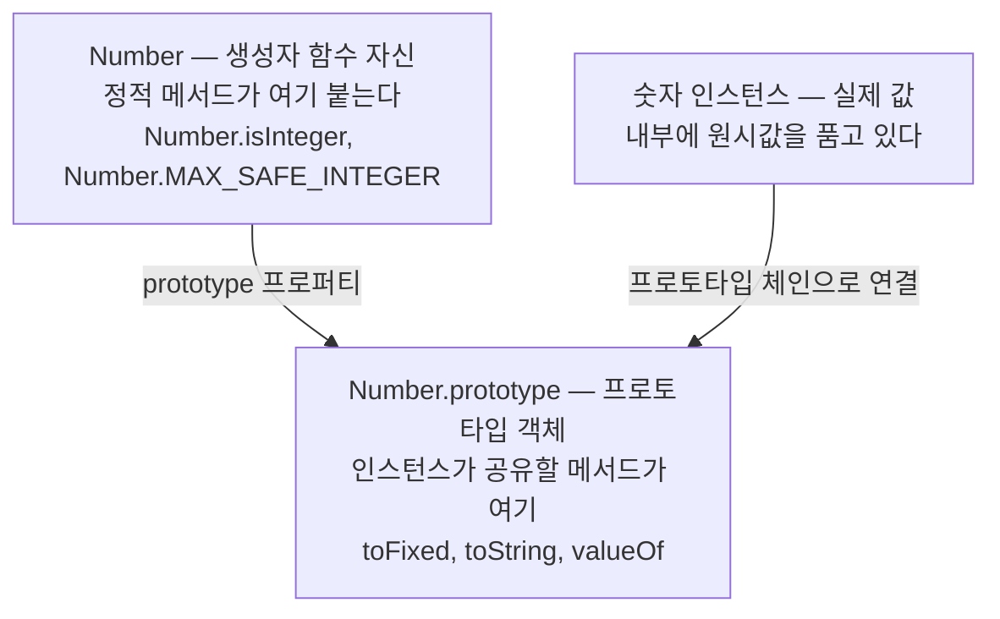
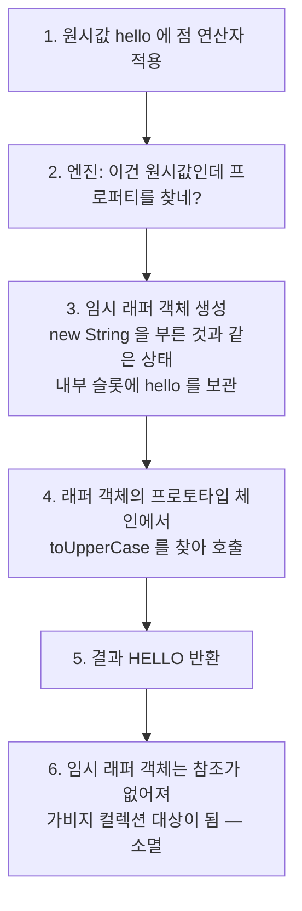
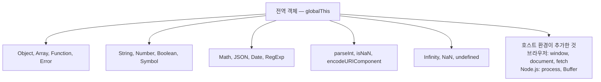

<Callout type="info">
  **이번 문서의 목표:** `"hello".toUpperCase()`가 동작하는 이유를 명세 수준의 단계로 설명하고, 표준 빌트인 객체·전역 객체·전역 프로퍼티가 각각 어디에 살고 어떻게 연결돼 있는지 지도를 그릴 수 있게 된다.
</Callout>

## 왜 이 질문부터 시작하는가

3편에서 우리는 값의 세계가 둘로 나뉜다고 배웠습니다. **원시값**(primitive value)과 **객체**(object). 원시값은 문자열(string), 숫자(number), 불리언(boolean), 심볼(symbol), 빅인트(bigint), 그리고 `null`과 `undefined` — 이 일곱 가지입니다. 원시값은 **더 쪼갤 수 없는 값 그 자체**라서 프로퍼티(property, 속성)를 가질 수 없습니다.

그런데 이상합니다.

```js
const 인사 = "hello";
console.log(인사.length);        // 5
console.log(인사.toUpperCase()); // "HELLO"
```

`인사`는 분명 원시값인 문자열인데, 점(`.`)을 찍으니 `length`라는 프로퍼티가 나오고 `toUpperCase`라는 메서드(method, 객체에 붙은 함수)까지 호출됩니다. **프로퍼티를 가질 수 없다는 원시값이 프로퍼티를 가진 것처럼 굴고 있습니다.**

이 모순을 푸는 열쇠가 **래퍼 객체**(wrapper object, 감싸는 객체)이고, 그 래퍼 객체를 제공하는 것이 **표준 빌트인 객체**(standard built-in object)입니다. 이 문서는 그 두 가지 — 그리고 그것들이 전부 어디에 매달려 있는지(전역 객체) — 를 다룹니다.

## 1. 표준 빌트인 객체 — 엔진이 미리 만들어두는 것들

### 왜 필요한가

JavaScript 코드를 한 줄도 쓰지 않은 빈 파일에서도 `Math.random()`이나 `JSON.parse()`는 바로 동작합니다. 누가 이것들을 만들어 놨을까요?

**엔진**(engine, JavaScript 코드를 실제로 실행하는 프로그램 — V8, SpiderMonkey 등)이 **프로그램이 시작되기 전에 미리 만들어 놓습니다.** 이렇게 언어 명세(ECMA-262)가 "모든 구현체는 이것들을 반드시 제공해야 한다"고 못박은 객체들을 **표준 빌트인 객체**(standard built-in object)라고 부릅니다. built-in은 "안에(built) 지어진(in)", 즉 **언어에 붙박이로 들어 있는**이라는 뜻입니다.

> **쉽게 말하면:** 표준 빌트인 객체는 새 집에 이미 설치돼 있는 붙박이장입니다. 이사 오자마자 쓸 수 있고, 어느 집(어느 엔진)에 가도 같은 자리에 같은 규격으로 있습니다.

### 빌트인 객체의 지도

전부 외울 필요는 없지만, **어떤 갈래로 나뉘는지**는 알아야 합니다. 갈래를 알면 새 빌트인을 만났을 때 어디에 넣을지 감이 잡히기 때문입니다.

| 갈래 | 대표 빌트인 | 이 갈래의 성격 |
|------|------------|----------------|
| 값 프로퍼티 | `globalThis`, `Infinity`, `NaN`, `undefined` | 함수가 아니라 값 자체 |
| 함수 프로퍼티 | `parseInt`, `parseFloat`, `isNaN`, `encodeURIComponent` | 어디서든 부르는 전역 함수 |
| 원시값 래퍼 | `String`, `Number`, `Boolean`, `Symbol`, `BigInt` | 원시값에 메서드를 빌려주는 생성자 |
| 기본 객체 | `Object`, `Function`, `Array`, `Error` | 언어의 뼈대를 이루는 객체 |
| 값 도구 | `Math`, `JSON`, `Date`, `RegExp` | 특정 작업을 위한 도구 모음 |
| 컬렉션 | `Map`, `Set`, `WeakMap`, `WeakSet` | 자료구조 (23편) |
| 비동기 | `Promise` | 비동기 상태 기계 (25편) |
| 반영·가로채기 | `Reflect`, `Proxy` | 객체 동작 자체를 다루는 도구 |

여기서 **성격이 다른 두 종류**가 섞여 있다는 점이 중요합니다.

1. **생성자 함수**(constructor function)인 빌트인 — `String`, `Number`, `Array`, `Date`, `RegExp`, `Map` 등. `new`를 붙여 인스턴스를 만들 수 있고, `프로토타입` 프로퍼티를 통해 인스턴스가 쓸 메서드를 나눠줍니다.
2. **생성자가 아닌** 빌트인 — `Math`와 `JSON`. 이 둘은 그냥 **함수를 담아둔 서랍**입니다. `new Math()`는 에러가 납니다.

```js
console.log(typeof Array);  // "function" — 생성자다
console.log(typeof Math);   // "object"   — 그냥 객체(서랍)다

new Array(3);   // 정상
// new Math();  // TypeError: Math is not a constructor
```

<Callout type="warning">
  **자주 틀리는 점:** `Math`와 `JSON`을 다른 빌트인처럼 `new`로 만들려는 실수가 흔합니다. 이 둘은 **인스턴스를 만들 이유가 없는 도구 모음**이라 생성자로 정의되지 않았습니다. "상태를 가진 개체가 필요한가?"를 스스로 물어보면 구분됩니다 — 날짜는 개체마다 다른 시각을 담아야 하니 `new Date()`, 원주율 계산은 개체가 필요 없으니 `Math.PI`입니다.
</Callout>

### 생성자 빌트인의 구조 — 세 층으로 보기

생성자인 빌트인은 항상 같은 3층 구조를 갖습니다. `Number`를 예로 보겠습니다.



- **정적 메서드**(static method)는 생성자 자신에 붙습니다. 인스턴스 없이도 쓸 수 있어야 하는 도구입니다. `Number.isInteger(3.5)`처럼요.
- **프로토타입 메서드**(prototype method)는 `프로토타입` 객체에 붙습니다. 인스턴스가 프로토타입 체인(13편)을 타고 찾아 씁니다. `(3.14).toFixed(1)`처럼요.

이 구분을 몸에 익히면 "이 메서드는 어디서 부르는 거지?"로 헤매는 일이 사라집니다. `Array.isArray`는 정적(배열이 아닐 수도 있는 값을 검사해야 하니 인스턴스가 없음), `배열.map`은 프로토타입(이미 배열이 손에 있음)입니다.

## 2. 래퍼 객체 — 원시값이 잠깐 객체가 되는 순간

### 왜 필요한가

다시 처음 질문으로 돌아옵니다. 문자열 원시값에는 프로퍼티가 없는데 `"hello".length`는 왜 5를 줄까요?

언어 설계자에게는 두 갈래 선택지가 있었습니다.

- **A안**: 문자열을 아예 객체로 만든다 → 모든 문자열이 무겁고, 값 비교(`===`)가 참조 비교가 되어 `"a" === "a"`가 `false`가 되는 참사가 생깁니다.
- **B안**: 문자열은 가벼운 원시값으로 두고, **점을 찍는 그 순간에만 잠깐 객체로 감싼다.**

JavaScript는 B안을 택했습니다. 이 "잠깐 감싸주는 객체"가 **래퍼 객체**(wrapper object)입니다. wrap은 "감싸다"라는 뜻으로, 선물 포장(wrapping)의 그 wrap입니다.

> **쉽게 말하면:** 원시값은 맨몸의 값입니다. 메서드를 쓰려는 순간 엔진이 임시 작업복(래퍼 객체)을 입혀서 일을 시키고, 일이 끝나면 작업복을 벗겨 버립니다. 값 자신은 그대로입니다.

### 무슨 일이 일어나는가 — 단계별로

`"hello".toUpperCase()` 한 줄이 실행될 때 엔진 안에서 벌어지는 일을 단계로 쪼개면 이렇습니다.



핵심은 **6단계**입니다. 래퍼 객체는 그 표현식 하나를 처리하려고 만들어졌다가 곧바로 버려집니다. 어디에도 저장되지 않으므로 다음 줄에서는 존재하지 않습니다.

### 실험 — 래퍼 객체가 정말 사라지는지 확인하기

말로만 들으면 믿기 어렵습니다. 직접 확인해 봅시다. 아래 코드에서 값을 바꿔가며 결과를 관찰하세요.

<CodePlayground
  template="vanilla"
  activeFile="/index.js"
  showConsole
  label="래퍼 객체의 생성과 소멸을 눈으로 확인하기"
  files={{
    '/index.js': `// 실험 1 — 래퍼 객체에 프로퍼티를 심어보면?
const 인사 = "hello";
인사.나이 = 100;              // 임시 래퍼에 심었다가... 래퍼가 사라짐
console.log("심은 값:", 인사.나이);   // undefined — 래퍼가 이미 소멸했다

// 왜 undefined인가?
// 3행에서 래퍼A를 만들어 거기에 나이를 심고 래퍼A는 버려짐.
// 4행에서 래퍼B를 새로 만들어 나이를 찾으니 당연히 없음.

// 실험 2 — 원시값과 래퍼 객체는 다른 존재다
const 원시문자열 = "hello";
const 객체문자열 = new String("hello");

console.log("typeof 원시:", typeof 원시문자열);   // "string"
console.log("typeof 객체:", typeof 객체문자열);   // "object"
console.log("=== 비교:", 원시문자열 === 객체문자열); // false! 타입이 다르다
console.log("값 꺼내서 비교:", 원시문자열 === 객체문자열.valueOf()); // true

// 실험 3 — 래퍼 객체는 불리언 문맥에서 항상 참이다 (치명적 함정)
const 거짓원시 = false;
const 거짓객체 = new Boolean(false);

if (거짓원시) console.log("원시 false가 참으로 취급됨");
if (거짓객체) console.log("객체 false가 참으로 취급됨!! 바로 이 줄이 출력된다");
// 객체는 어떤 객체든 truthy(참 같은 값)이기 때문 — 5편 ToBoolean 참고

// 실험 4 — 어떤 원시값이 래퍼를 갖는가
console.log("문자열 메서드:", "abc".at(0));
console.log("숫자 메서드:", (255).toString(16));
console.log("불리언 메서드:", true.toString());
console.log("심볼 메서드:", Symbol("id").description);

// null과 undefined는 래퍼가 없다 — 아래 주석을 풀면 TypeError
// console.log(null.length);
// console.log(undefined.length);

// [바꿔보기] 위 실험 1의 "인사"를 new String("hello")로 바꾸면
// 나이가 100으로 남습니다. 왜 그럴까요?`,
  }}
/>

실험 1의 결과가 이 문서의 전부라고 해도 좋습니다. `인사.나이 = 100`은 **에러도 나지 않고, 저장도 되지 않습니다.** 조용히 사라집니다. 엄격 모드(strict mode, 4편)에서는 이마저도 `TypeError`로 막아줍니다 — 실수를 조용히 넘기지 않으려는 설계입니다.

### 래퍼를 갖는 원시값과 갖지 못하는 원시값

| 원시 타입 | 래퍼 생성자 | 점 연산자 사용 | 비고 |
|-----------|------------|----------------|------|
| string | `String` | 가능 | `length`, `at`, `slice` 등 |
| number | `Number` | 가능 | `(1).toFixed(2)` — 괄호 필요 |
| boolean | `Boolean` | 가능 | 쓸 일은 거의 없음 |
| symbol | `Symbol` | 가능 | `new Symbol()`은 금지 (16편) |
| bigint | `BigInt` | 가능 | `new BigInt()`도 금지 |
| null | 없음 | 불가 – TypeError | 값 자체가 "없음"을 뜻함 |
| undefined | 없음 | 불가 – TypeError | 값 자체가 "미정"을 뜻함 |

`null`과 `undefined`에 점을 찍으면 그 유명한 `TypeError: Cannot read properties of null`이 터집니다. **감쌀 대상 자체가 없기 때문**입니다. 이 에러를 피하려고 만들어진 문법이 옵셔널 체이닝 `?.`(6편)입니다.

<Callout type="warning">
  **자주 틀리는 점 세 가지**

  1. **숫자 리터럴에 바로 점 찍기**: `1.toFixed(2)`는 문법 에러입니다. 엔진이 `1.`을 소수점으로 읽어버리기 때문입니다. `(1).toFixed(2)` 또는 `1..toFixed(2)`처럼 써야 합니다.
  2. **`new`로 래퍼를 직접 만들기**: `new String("a")`, `new Number(1)`, `new Boolean(false)`는 실무에서 쓸 이유가 사실상 없습니다. `typeof`가 `"object"`가 되고, `===` 비교가 깨지고, `new Boolean(false)`가 참이 되는 함정만 생깁니다.
  3. **`new` 없는 호출과 혼동**: `String(123)`, `Number("42")`, `Boolean(0)`처럼 `new` 없이 부르면 **객체가 아니라 원시값으로 변환**해 줍니다. 이건 아주 유용하고 실무에서 권장되는 사용법입니다. `new`가 있느냐 없느냐로 완전히 다른 일을 한다는 점을 기억하세요.
</Callout>

```js
// new 없이 = 타입 변환 함수 (권장)
console.log(Number("42"), typeof Number("42"));    // 42 "number"
console.log(String(42), typeof String(42));        // "42" "string"

// new 있으면 = 래퍼 객체 생성 (피할 것)
console.log(typeof new Number("42"));              // "object"
```

## 3. 전역 객체 — 모든 빌트인이 매달린 뿌리

### 왜 필요한가

`Math`, `JSON`, `parseInt`… 이것들은 어디에 있길래 어느 파일, 어느 함수 안에서든 이름만 쓰면 찾아지는 걸까요? 변수 이름이 해석되려면 스코프 체인(9편)의 어딘가에 그 이름이 있어야 하는데 말입니다.

답은 **전역 객체**(global object)입니다. 코드가 실행되기 전에 엔진이 가장 먼저 만드는 **최상위 객체**로, 스코프 체인의 가장 끝에 놓입니다. 표준 빌트인 객체들은 전부 이 전역 객체의 프로퍼티로 등록됩니다.

> **쉽게 말하면:** 전역 객체는 프로그램이라는 건물의 1층 로비입니다. 어느 층(스코프)에서 이름을 찾다가 못 찾으면 결국 로비까지 내려오고, 로비에는 모두가 쓰는 공용 시설(빌트인 객체)이 비치돼 있습니다.



### 환경마다 이름이 달랐던 문제

전역 객체는 언어 명세가 아니라 **호스트 환경**(host environment, JavaScript를 실행시켜 주는 프로그램 — 2편)이 이름을 정했습니다. 그래서 이름이 제각각이었습니다.

| 환경 | 전역 객체 이름 | 
|------|----------------|
| 브라우저 | `window` (워커에서는 `self`) |
| Node.js | `global` |
| 그 외 런타임 | 제각각 |

같은 코드를 브라우저와 Node.js에서 모두 돌리려면 "지금 환경의 전역 객체가 뭐지?"를 매번 알아내는 지저분한 코드를 써야 했습니다. 이 문제를 끝내려고 ES2020에서 **`globalThis`**가 표준으로 추가됐습니다. 이름을 그대로 읽으면 "전역(global)의 this" — 어느 환경에서든 전역 객체를 가리키는 하나의 이름입니다.

```js
// 옛날 방식 — 환경마다 분기
const 전역 = typeof window !== "undefined" ? window : global;

// 지금 — 어디서나 동일
console.log(typeof globalThis);        // "object"
console.log(globalThis.Math === Math); // true — Math는 전역 객체의 프로퍼티였다
```

### 전역 프로퍼티와 전역 함수

전역 객체에는 빌트인 생성자 말고도 **값 프로퍼티**와 **함수 프로퍼티**가 있습니다. 자주 쓰이면서 함정이 많은 것들만 짚습니다.

`parseInt`는 문자열 앞부분을 정수로 해석합니다. 두 번째 인수인 **진법**(radix, 래딕스)을 반드시 넘기는 습관을 들여야 합니다.

```js
console.log(parseInt("42px"));        // 42   — 숫자가 아닌 곳에서 멈춘다
console.log(parseInt("0x1f"));        // 31   — 0x를 16진수로 자동 해석
console.log(parseInt("08"));          // 8
console.log(parseInt("1010", 2));     // 10   — 진법을 명시하면 안전
console.log(Number("42px"));          // NaN  — Number는 전체가 숫자여야 함
```

`parseInt`와 `Number`의 차이가 보이시나요? `parseInt`는 **읽을 수 있는 데까지 읽는 관대한 파서**이고, `Number`는 **전부가 숫자여야 통과시키는 엄격한 변환기**입니다. 사용자 입력을 검증할 때 `parseInt`를 쓰면 `"42px"`가 42로 통과해 버립니다.

`isNaN`도 함정이 있습니다. 전역 `isNaN`은 인수를 먼저 숫자로 강제 변환한 뒤 검사하기 때문에 엉뚱한 결과를 냅니다.

```js
console.log(isNaN("hello"));        // true  — "hello"를 숫자로 바꾸니 NaN이라서
console.log(isNaN(undefined));      // true
console.log(Number.isNaN("hello")); // false — 변환 없이 "정말 NaN인가?"만 검사
```

**규칙**: 값이 진짜 `NaN`인지 알고 싶으면 항상 `Number.isNaN`을 쓰세요. 전역 `isNaN`은 "숫자로 변환할 수 없는가?"를 묻는 다른 질문입니다. (19편에서 더 다룹니다.)

### 전역 변수와 전역 객체의 위험한 관계

`var`로 선언한 전역 변수와 함수 선언문은 **전역 객체의 프로퍼티가 됩니다.** 반면 `let`과 `const`는 그렇지 않습니다.

```js
var 옛변수 = 1;
let 새변수 = 2;
const 상수 = 3;

console.log(globalThis.옛변수); // 1
console.log(globalThis.새변수); // undefined — 전역 객체에 안 붙는다
console.log(globalThis.상수);   // undefined
```

`let`과 `const`로 선언한 전역 변수는 **선언적 환경 레코드**라는 별도의 공간에 저장됩니다(9편에서 자세히). 이렇게 분리한 이유는 명확합니다 — `var`가 전역 객체를 오염시키면서, 내가 만든 변수 이름이 브라우저의 기존 프로퍼티를 덮어써 버리는 사고가 잦았기 때문입니다.

```js
// 위험한 예 — 브라우저에서 var name은 window.name을 덮어쓴다
var name = 42;
console.log(typeof name); // "string" — window.name은 문자열만 담아서 강제 변환됨!
```

<Callout type="warning">
  **자주 틀리는 점:** "전역이니까 어디서나 쓸 수 있어 편하다"고 전역 변수를 남발하면, 파일이 여러 개가 되는 순간 **이름 충돌**로 무너집니다. ES 모듈(29편)에서는 최상위 스코프가 전역이 아니라 **모듈 스코프**이므로 이 문제가 구조적으로 사라집니다. 모듈을 기본으로 쓰는 것이 근본 해법입니다.
</Callout>

## 4. 세 가지가 하나로 이어지는 그림

이제 지금까지의 조각을 하나로 붙입니다. `"hello".toUpperCase()`가 동작하려면 다음이 전부 필요합니다.

1. 엔진이 시작 시 **전역 객체**를 만든다.
2. 전역 객체에 **표준 빌트인 객체**인 `String` 생성자를 등록한다.
3. `String` 생성자는 `String.prototype`을 갖고, 거기에 `toUpperCase`가 붙어 있다.
4. 원시 문자열에 점을 찍는 순간 **래퍼 객체**가 임시로 만들어지고, 그 객체의 프로토타입이 `String.prototype`으로 연결된다.
5. 프로토타입 체인을 타고 `toUpperCase`를 찾아 호출한다.
6. 래퍼 객체는 버려지고, 원시값은 처음 그대로 남는다.

```js
// 4~5단계를 직접 증명해 보기
console.log(Object.getPrototypeOf(Object("hi")) === String.prototype); // true
console.log("hi".toUpperCase === String.prototype.toUpperCase);        // true
```

두 번째 줄이 특히 흥미롭습니다. `"hi"`에서 꺼낸 함수와 `String.prototype`에 붙어 있는 함수가 **완전히 같은 함수 객체**입니다. 문자열마다 메서드가 복사되는 게 아니라, **모든 문자열이 하나의 메서드를 공유**하고 있다는 뜻입니다. 이것이 프로토타입 방식의 메모리 효율입니다 — 문자열이 백만 개여도 `toUpperCase` 함수는 딱 하나뿐입니다.

## 핵심 정리

- **표준 빌트인 객체**는 엔진이 프로그램 시작 전에 미리 만들어 두는 객체다. 생성자인 것(`String`, `Array`, `Date`)과 도구 서랍인 것(`Math`, `JSON`)으로 나뉜다.
- 생성자 빌트인은 **정적 메서드**(생성자 자신에 붙음)와 **프로토타입 메서드**(인스턴스가 공유)의 3층 구조를 갖는다.
- **래퍼 객체**는 원시값에 점을 찍는 순간 임시로 생겼다가 곧바로 소멸한다. 그래서 원시값에 프로퍼티를 심으면 조용히 사라진다.
- `new String()` 같은 명시적 래퍼 생성은 피한다. `typeof`가 `"object"`가 되고 `new Boolean(false)`가 참이 되는 함정이 있다. `new` 없는 `String()`, `Number()`는 타입 변환 함수로 유용하다.
- **전역 객체**는 모든 빌트인이 매달린 뿌리이며, ES2020의 `globalThis`로 환경에 상관없이 접근한다. `var`는 전역 객체를 오염시키지만 `let`과 `const`는 그렇지 않다.

## 마무리 복습

<Quiz
  questionNumber={1}
  question="원시 문자열에 프로퍼티를 대입하는 코드가 있다. 다음 줄에서 그 프로퍼티를 읽으면 결과는 무엇이며 이유는?"
  options={['대입한 값이 그대로 남는다 — 문자열도 객체이기 때문', 'undefined — 임시 래퍼 객체가 생성 후 곧바로 소멸했기 때문', 'TypeError가 발생한다 — 원시값에는 점 연산자를 쓸 수 없기 때문', 'null — 프로퍼티는 항상 null로 초기화되기 때문']}
  correctAnswer={2}
  explanation="점 연산자를 쓸 때 임시 래퍼 객체가 만들어지고 그 객체에 프로퍼티가 심긴다. 표현식이 끝나면 래퍼는 버려지고, 다음 줄에서는 새 래퍼가 만들어지므로 심은 값을 찾을 수 없어 undefined가 된다."
  optionExplanations={['문자열 원시값은 객체가 아니며 프로퍼티를 보관할 수 없다', '정답 — 래퍼 객체는 표현식 하나를 처리하고 소멸한다', '점 연산자 자체는 정상 동작한다. 에러가 나는 것은 null과 undefined뿐이다', '값이 저장되지 않았으므로 undefined이지 null이 아니다']}
/>

<Quiz
  questionNumber={2}
  question="Math와 JSON이 다른 빌트인 객체와 구별되는 가장 중요한 특징은?"
  options={['생성자 함수가 아니어서 new로 인스턴스를 만들 수 없다', '전역 객체의 프로퍼티가 아니다', '프로토타입 체인을 갖지 않는다', '표준 빌트인 객체가 아니라 호스트 객체다']}
  correctAnswer={1}
  explanation="Math와 JSON은 typeof 결과가 object인 단순한 함수 모음 객체다. 인스턴스마다 다른 상태를 가질 이유가 없어 생성자로 정의되지 않았다."
  optionExplanations={['정답 — new Math()는 TypeError가 난다', '둘 다 전역 객체의 프로퍼티가 맞다', '모든 객체와 마찬가지로 Object.prototype으로 이어지는 체인을 갖는다', '둘 다 ECMA-262가 정의한 표준 빌트인 객체다']}
/>

<Quiz
  questionNumber={3}
  question="new Boolean(false)를 if 조건문에 넣으면 어떻게 되는가?"
  options={['조건이 거짓이므로 블록이 실행되지 않는다', '조건이 참으로 평가되어 블록이 실행된다', 'TypeError가 발생한다', '원시값 false로 자동 변환되어 실행되지 않는다']}
  correctAnswer={2}
  explanation="new Boolean(false)는 원시값이 아니라 객체다. 불리언 문맥에서 객체는 내용과 무관하게 항상 참으로 평가되므로 블록이 실행된다. 이것이 래퍼 객체를 직접 만들면 안 되는 대표적 이유다."
  optionExplanations={['담긴 값은 false지만 평가 대상은 객체 자체다', '정답 — 모든 객체는 truthy이므로 블록이 실행된다', '문법적으로 문제가 없어 에러는 나지 않는다', '불리언 문맥에서 객체는 valueOf를 거치지 않고 곧바로 참이 된다']}
/>

<Quiz
  questionNumber={4}
  question="globalThis가 ES2020에 도입된 이유로 가장 알맞은 것은?"
  options={['전역 변수 사용을 금지하기 위해', '환경마다 window, global 등으로 다르던 전역 객체 이름을 하나로 통일하기 위해', '전역 객체의 프로퍼티를 읽기 전용으로 만들기 위해', 'var로 선언한 전역 변수를 전역 객체에서 분리하기 위해']}
  correctAnswer={2}
  explanation="브라우저는 window, Node.js는 global처럼 전역 객체 이름이 환경마다 달라 이식 가능한 코드를 쓰기 어려웠다. globalThis는 어느 환경에서든 전역 객체를 가리키는 표준 이름이다."
  optionExplanations={['globalThis는 오히려 전역 객체 접근을 쉽게 한다', '정답 — 환경 독립적인 하나의 이름을 제공한다', '읽기 전용화와는 무관하다', 'var가 전역 객체에 붙는 동작은 그대로 유지된다']}
/>

<Quiz
  questionNumber={5}
  question="전역 isNaN 대신 Number.isNaN을 써야 하는 이유는?"
  options={['전역 isNaN이 더 느리기 때문', '전역 isNaN은 인수를 숫자로 강제 변환한 뒤 검사해서 문자열도 true를 반환하기 때문', '전역 isNaN은 최신 브라우저에서 제거되었기 때문', 'Number.isNaN이 문자열도 검사할 수 있기 때문']}
  correctAnswer={2}
  explanation="전역 isNaN은 인수를 먼저 숫자로 변환하므로 숫자로 바꿀 수 없는 문자열에 대해서도 true를 반환한다. Number.isNaN은 변환 없이 값이 정말 NaN인지만 검사한다."
  optionExplanations={['속도가 아니라 판정 결과 자체가 다르다', '정답 — 강제 변환이 끼어들어 질문이 달라져 버린다', '전역 isNaN은 지금도 표준으로 존재한다', 'Number.isNaN은 오히려 숫자가 아니면 무조건 false를 반환한다']}
/>

<Quiz
  questionNumber={6}
  question="원시값 중 래퍼 객체를 가지지 않아 점 연산자 사용 시 TypeError가 나는 것끼리 묶은 것은?"
  options={['null 과 undefined', 'symbol 과 bigint', 'boolean 과 undefined', 'null 과 NaN']}
  correctAnswer={1}
  explanation="null과 undefined는 대응하는 래퍼 생성자가 없어 감쌀 수 없으므로 프로퍼티 접근 시 TypeError가 발생한다. symbol과 bigint는 각각 Symbol, BigInt 래퍼를 갖는다."
  optionExplanations={['정답 — 값 자체가 없음 또는 미정을 뜻해 감쌀 대상이 없다', 'Symbol과 BigInt 래퍼가 있어 메서드 접근이 가능하다', 'boolean은 Boolean 래퍼를 가진다', 'NaN은 별도 타입이 아니라 number 타입의 값이므로 Number 래퍼를 쓴다']}
/>

<Quiz
  questionNumber={7}
  question="Array.isArray와 배열 인스턴스의 map 메서드가 서로 다른 위치에 정의된 이유로 알맞은 것은?"
  options={['isArray는 정적 메서드로, 배열이 아닐 수도 있는 값을 검사해야 해서 인스턴스가 전제되지 않기 때문', 'isArray가 map보다 나중에 추가된 문법이라서', '정적 메서드가 프로토타입 메서드보다 항상 빠르기 때문', 'map은 배열에만 있고 isArray는 모든 객체에 있기 때문']}
  correctAnswer={1}
  explanation="정적 메서드는 인스턴스 없이 호출해야 하는 도구에, 프로토타입 메서드는 이미 그 타입의 인스턴스를 손에 쥐고 있을 때 쓰는 기능에 배치한다. isArray는 검사 대상이 배열이 아닐 수 있으므로 정적이어야 한다."
  optionExplanations={['정답 — 인스턴스 전제 여부가 배치 기준이다', '도입 시기는 배치 기준과 무관하다', '속도 때문이 아니라 호출 맥락 때문이다', 'isArray는 Array 생성자에만 있고 모든 객체에 있지 않다']}
/>

## 참고 자료

- [MDN - Standard built-in objects](https://developer.mozilla.org/en-US/docs/Web/JavaScript/Reference/Global_Objects)
- [MDN - globalThis](https://developer.mozilla.org/en-US/docs/Web/JavaScript/Reference/Global_Objects/globalThis)
- [ECMAScript Language Specification - Fundamental Objects](https://262.ecma-international.org/)
