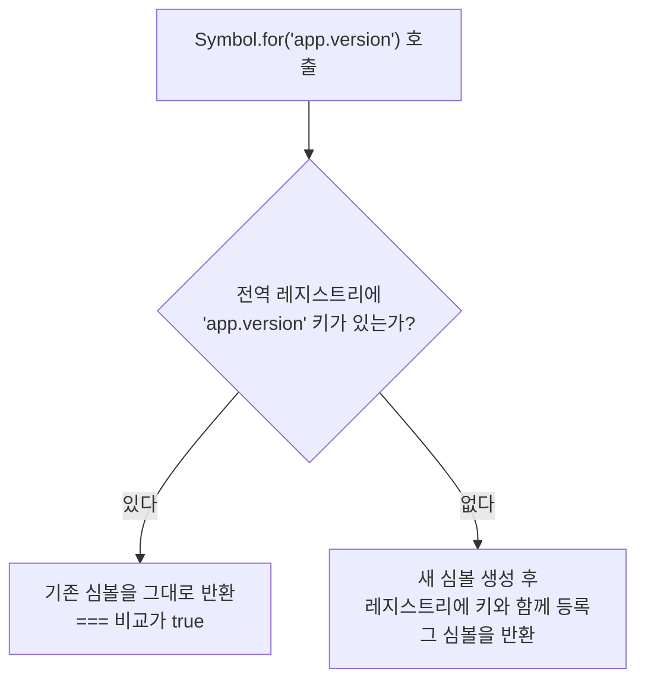

<Callout type="info">
  **이번 문서의 목표:** 심볼이 해결하는 "키 충돌" 문제를 직접 재현해 보고, 심볼 키 프로퍼티가 왜 일반 순회에서 보이지 않는지, 그리고 `Symbol.iterator`를 직접 구현해 내 객체를 `for...of`로 순회시킬 수 있게 된다.
</Callout>

## 왜 새로운 원시 타입이 필요했나

ES6(ES2015) 이전까지 JavaScript의 원시 타입(primitive type)은 여섯 개였습니다. 문자열, 숫자, 불리언, `null`, `undefined`, 그리고… 사실 다섯 개였죠. 여기에 **일곱 번째 원시 타입**으로 심볼(symbol)이 추가됐고, 나중에 빅인트(bigint)까지 붙었습니다.

새로운 **타입**을 언어에 추가하는 것은 엄청난 사건입니다. 문법 하나 추가하는 것과 차원이 다릅니다. 그만한 이유가 있어야 합니다. 그 이유를 이해하려면 먼저 문제를 겪어봐야 합니다.

### 문제 상황 — 키 충돌

당신이 다른 사람이 만든 객체에 기능을 하나 얹는 라이브러리를 만든다고 해봅시다. 객체가 마지막으로 수정된 시각을 기록하고 싶습니다.

```js
// 남이 만든 객체 — 내가 내용을 통제할 수 없다
const 사용자 = { 이름: "지민", 나이: 28 };

// 내 라이브러리가 기록을 남긴다
사용자.수정시각 = Date.now();
```

이 코드는 세 가지 방식으로 무너질 수 있습니다.

1. **덮어쓰기**: 원래 객체에 이미 `수정시각`이 있었다면 남의 데이터를 파괴합니다.
2. **덮어써짐**: 나중에 다른 라이브러리가 같은 이름을 쓰면 내 값이 사라집니다.
3. **누출**: `for...in`이나 `Object.keys`, `JSON.stringify`로 객체를 순회하면 내부용 기록이 그대로 노출됩니다. 서버로 전송되는 JSON에 `수정시각`이 끼어들어 API가 400 에러를 뱉는 식이죠.

관례로 피해 보려던 시절도 있었습니다. `_수정시각`처럼 밑줄을 붙이거나, `__myLib_수정시각__`처럼 길고 흉한 이름을 짓거나. 하지만 **관례는 보장이 아닙니다.** 두 라이브러리가 우연히 같은 관례를 쓰면 그대로 충돌합니다.

> **쉽게 말하면:** 문자열 키는 이름표입니다. 이름표가 같으면 서로 다른 물건이라도 같은 서랍에 들어가 뒤엉킵니다. 심볼은 **같은 글자를 써 넣어도 절대 같아지지 않는 지문**입니다.

## 1. 심볼의 정체 — 유일성이 전부다

### 정의와 생성

**심볼**(symbol, 기호)은 **생성될 때마다 이 세상 어떤 값과도 같지 않은, 유일한 값**을 만들어내는 원시 타입입니다.

```js
const 심볼A = Symbol();
const 심볼B = Symbol();

console.log(심볼A === 심볼B); // false — 인수 없이 만들어도 서로 다르다
console.log(typeof 심볼A);    // "symbol" — 객체가 아니라 원시값이다
```

인수로 문자열을 넘길 수 있습니다. 이것을 **설명**(description, 디스크립션)이라고 부릅니다.

```js
const 아이디1 = Symbol("id");
const 아이디2 = Symbol("id");

console.log(아이디1 === 아이디2);   // false! 설명이 같아도 다른 값이다
console.log(아이디1.description);  // "id"
console.log(아이디1.toString());   // "Symbol(id)"
```

**설명은 디버깅용 이름표일 뿐, 값의 정체성과는 무관합니다.** 이것이 심볼의 전부이자 핵심입니다. 사람 이름이 같아도 다른 사람인 것과 같습니다 — 이름은 부르기 위한 것이지 신원을 정하는 것이 아닙니다.

### `new`를 쓸 수 없다

15편에서 배운 래퍼 객체(wrapper object) 이야기가 여기서 이어집니다. 심볼도 래퍼를 갖지만, **생성자로는 호출할 수 없습니다.**

```js
const 정상 = Symbol("ok");
// const 에러 = new Symbol("no"); // TypeError: Symbol is not a constructor

console.log(정상.description);  // "ok" — 래퍼를 통한 프로퍼티 접근은 정상 동작
```

왜 막았을까요? 심볼의 존재 이유가 **유일성**인데, `new Symbol()`로 객체를 만들면 그 객체는 감싼 심볼과 다른 존재가 되어 버립니다. 그러면 `키 === 키` 비교가 깨지고, 심볼의 목적 자체가 무너집니다. 설계자가 아예 문을 잠근 것입니다.

### 심볼은 암묵적으로 문자열이 되지 않는다

```js
const 아이디 = Symbol("id");

// console.log("아이디: " + 아이디);   // TypeError!
// console.log(`아이디: ${아이디}`);   // TypeError!

console.log("아이디: " + String(아이디));  // "아이디: Symbol(id)" — 명시적 변환은 OK
console.log(아이디.description);          // "id"
```

문자열 연결이 에러가 나는 것은 **의도된 설계**입니다. 5편에서 배운 암묵적 타입 변환(implicit type coercion)의 함정을 심볼에는 적용하지 않겠다는 뜻입니다. 심볼은 조용히 문자열이 되어 로그에 이상한 값이 찍히느니, 시끄럽게 에러를 내는 편을 택했습니다.

## 2. 심볼 키 프로퍼티 — 충돌하지 않고, 눈에 띄지 않는다

이제 처음의 문제를 심볼로 풀어봅시다.

```js
const 수정시각키 = Symbol("수정시각");
const 사용자 = { 이름: "지민", 나이: 28 };

사용자[수정시각키] = Date.now();   // 대괄호 표기법 필수

console.log(사용자[수정시각키]);   // 타임스탬프
console.log(Object.keys(사용자));  // ["이름", "나이"] — 심볼 키는 안 보인다!
console.log(JSON.stringify(사용자)); // {"이름":"지민","나이":28} — 누출 없음
```

세 가지 문제가 전부 해결됐습니다. 이름이 절대 충돌하지 않고, 순회에도 나타나지 않고, JSON 직렬화에도 끼어들지 않습니다.

<Callout type="warning">
  **자주 틀리는 점:** 심볼을 키로 쓸 때는 반드시 **대괄호 표기법**을 써야 합니다. `사용자.수정시각키 = ...`라고 쓰면 `"수정시각키"`라는 **문자열 키**가 만들어져 심볼이 전혀 사용되지 않습니다. 객체 리터럴 안에서도 마찬가지로 `{ [수정시각키]: 값 }`처럼 대괄호로 감싸야 합니다 — 이를 계산된 프로퍼티 이름(computed property name)이라고 합니다.
</Callout>

### 어떤 순회에서 보이고 안 보이는가

"안 보인다"는 말이 "완전히 숨겨진다"는 뜻은 아닙니다. 정확한 경계를 알아야 합니다.

| 방법 | 심볼 키가 보이는가 | 용도 |
|------|-------------------|------|
| `Object.keys` | 안 보임 | 문자열 키만 |
| `Object.values` / `Object.entries` | 안 보임 | 문자열 키만 |
| `for...in` | 안 보임 | 상속된 문자열 키까지 |
| `JSON.stringify` | 안 보임 | 직렬화 제외 |
| 스프레드 `...` / `Object.assign` | 보임 – 복사됨 | 심볼도 함께 복사 |
| `Object.getOwnPropertySymbols` | 보임 | 심볼 키만 뽑는 전용 함수 |
| `Reflect.ownKeys` | 보임 | 문자열 + 심볼 전부 |

마지막 세 줄이 중요합니다. **심볼은 비공개가 아닙니다** — private이 아닙니다. 숨기려고 만든 게 아니라 **충돌을 막으려고** 만든 것이고, 순회에서 빠지는 것은 "이건 내부용 메타데이터니 일반 데이터 순회에 섞이지 마라"는 신호일 뿐입니다. 진짜 비공개가 필요하면 클래스의 `#` 필드(14편)를 써야 합니다.

### 실험 — 심볼 키의 정체 확인하기

<CodePlayground
  template="vanilla"
  activeFile="/index.js"
  showConsole
  label="심볼 키가 어디서 보이고 어디서 숨는지 직접 확인하기"
  files={{
    '/index.js': `// --- 실험 1: 유일성 ---
const a = Symbol("id");
const b = Symbol("id");
console.log("설명이 같아도 다른 값:", a === b);        // false
console.log("설명 꺼내기:", a.description, b.description);

// --- 실험 2: 두 라이브러리의 충돌 시뮬레이션 ---
const 사용자 = { 이름: "지민" };

// 라이브러리 A와 B가 각자 캐시 키를 심는다
const 캐시키A = Symbol("cache");
const 캐시키B = Symbol("cache");   // 이름이 똑같다!
사용자[캐시키A] = "A의 데이터";
사용자[캐시키B] = "B의 데이터";

console.log("A의 값:", 사용자[캐시키A]);  // "A의 데이터" — 살아있다
console.log("B의 값:", 사용자[캐시키B]);  // "B의 데이터" — 살아있다
// 문자열 키였다면 나중 것이 앞 것을 덮어썼을 것이다

// --- 실험 3: 순회에서의 가시성 ---
console.log("Object.keys:", Object.keys(사용자));
console.log("JSON:", JSON.stringify(사용자));
console.log("심볼 전용 조회:", Object.getOwnPropertySymbols(사용자));
console.log("전부 조회:", Reflect.ownKeys(사용자));

// 스프레드는 심볼도 복사한다 — 자주 오해하는 지점
const 복사본 = { ...사용자 };
console.log("복사본에도 A 값이:", 복사본[캐시키A]);

// --- 실험 4: 전역 심볼 레지스트리 ---
const 전역1 = Symbol.for("app.version");
const 전역2 = Symbol.for("app.version");
console.log("Symbol.for는 같은 값:", 전역1 === 전역2);   // true!
console.log("키 되찾기:", Symbol.keyFor(전역1));         // "app.version"
console.log("일반 심볼의 키:", Symbol.keyFor(a));        // undefined

// [바꿔보기] 실험 2에서 캐시키A, 캐시키B를 문자열 "cache"로 바꿔보세요.
// 두 라이브러리 중 하나의 데이터가 사라지는 것을 볼 수 있습니다.`,
  }}
/>

## 3. 전역 심볼 레지스트리 — 유일하되 공유하고 싶을 때

### 왜 필요한가

심볼의 유일성은 축복이지만 저주이기도 합니다. **같은 심볼을 다시 얻을 방법이 없기 때문입니다.** 파일 A에서 만든 심볼을 파일 B에서 쓰려면 변수로 넘겨야 하는데, 서로 모듈을 공유할 수 없는 상황(예: 브라우저의 서로 다른 스크립트, iframe 사이)에서는 곤란합니다.

그래서 ES6은 **전역 심볼 레지스트리**(global symbol registry)라는 별도의 저장소를 뒀습니다. `Symbol.for(키)`는 이 저장소를 먼저 뒤져서, 그 키의 심볼이 있으면 **기존 것을 돌려주고**, 없으면 새로 만들어 등록한 뒤 돌려줍니다.



```js
const 버전키1 = Symbol.for("app.version");
const 버전키2 = Symbol.for("app.version");
console.log(버전키1 === 버전키2);        // true — 같은 심볼!
console.log(Symbol.keyFor(버전키1));     // "app.version"

const 일반심볼 = Symbol("app.version");
console.log(일반심볼 === 버전키1);        // false — 레지스트리와 무관
console.log(Symbol.keyFor(일반심볼));    // undefined
```

`Symbol()`과 `Symbol.for()`의 차이를 정리하면 이렇습니다.

| 구분 | `Symbol("x")` | `Symbol.for("x")` |
|------|---------------|-------------------|
| 호출할 때마다 | 매번 새 심볼 | 같은 심볼 |
| 저장 위치 | 어디에도 등록 안 됨 | 전역 레지스트리 |
| `Symbol.keyFor` 결과 | `undefined` | 등록한 키 문자열 |
| 언제 쓰나 | 내 코드 안에서만 쓸 내부 키 | 여러 코드가 공유해야 할 약속된 키 |

> **쉽게 말하면:** `Symbol()`은 내가 만들어 내 주머니에 넣는 열쇠이고, `Symbol.for()`는 관리사무소에 이름표를 붙여 맡겨 둔 공용 열쇠입니다. 이름만 알면 누구나 같은 열쇠를 받아갈 수 있습니다.

<Callout type="warning">
  **자주 틀리는 점:** 전역 레지스트리는 **전역**이므로 다시 이름 충돌 위험이 생깁니다. 심볼로 충돌을 피하려다 레지스트리에서 충돌하면 본전도 못 찾는 셈이죠. 그래서 `Symbol.for`의 키에는 `"내라이브러리이름.용도"`처럼 **네임스페이스를 접두어로 붙이는 관례**를 씁니다. 대부분의 경우에는 그냥 `Symbol()`을 쓰고 모듈로 내보내는 편이 더 안전합니다.
</Callout>

## 4. 웰노운 심볼 — 언어의 동작을 바꾸는 후크

### 왜 필요한가

여기서 심볼의 진짜 힘이 나옵니다. 지금까지는 "내가 만든 키" 이야기였지만, **언어 자신도 심볼을 키로 쓰고 있습니다.**

`for...of`가 배열을 순회할 때, 엔진은 배열에서 `Symbol.iterator`라는 **심볼 키의 메서드**를 찾아 호출합니다. `console.log(typeof x)`가 아니라, 언어가 객체에게 "너 순회 방법 갖고 있니?"를 묻는 **약속된 창구**가 심볼 키인 것입니다.

이렇게 **명세가 미리 정해 둔, 언어 내부 동작에 연결된 심볼들**을 **웰노운 심볼**(well-known symbol, 널리 알려진 심볼)이라고 부릅니다. 명세에서는 이들을 `@@iterator`처럼 골뱅이 두 개를 붙여 표기합니다.

> **쉽게 말하면:** 웰노운 심볼은 언어가 객체 옆구리에 뚫어 둔 표준 규격 콘센트입니다. 내가 그 규격에 맞는 플러그(메서드)를 꽂으면, `for...of`나 `instanceof` 같은 언어 기능이 내 객체를 인식하기 시작합니다.

### 대표적인 웰노운 심볼

| 웰노운 심볼 | 언제 호출되는가 | 무엇을 바꾸는가 |
|------------|----------------|----------------|
| `Symbol.iterator` | `for...of`, 스프레드, 디스트럭처링 | 객체를 순회 가능하게 만듦 |
| `Symbol.asyncIterator` | `for await...of` | 비동기 순회 |
| `Symbol.toPrimitive` | 객체가 원시값으로 변환될 때 | 5편의 ToPrimitive 동작을 직접 정의 |
| `Symbol.toStringTag` | `Object.prototype.toString` 호출 시 | 태그 문자열을 지정 |
| `Symbol.hasInstance` | `instanceof` 연산자 | 인스턴스 판정 규칙을 재정의 |
| `Symbol.species` | 파생 객체 생성 시 | `map` 등이 만들 결과의 생성자 지정 |

### 실험 — 내 객체를 for...of로 순회시키기

<CodePlayground
  template="vanilla"
  activeFile="/index.js"
  showConsole
  label="웰노운 심볼로 언어 동작을 직접 바꿔 보기"
  files={{
    '/index.js': `// --- Symbol.iterator: 순회 가능하게 만들기 ---
const 범위 = {
  시작: 1,
  끝: 5,
  [Symbol.iterator]() {
    let 현재 = this.시작;
    const 끝 = this.끝;
    // 이터레이터 객체: next 메서드를 가진 객체 (24편에서 자세히)
    return {
      next() {
        return 현재 <= 끝
          ? { value: 현재++, done: false }
          : { value: undefined, done: true };
      }
    };
  }
};

for (const n of 범위) console.log("순회:", n);      // 1,2,3,4,5
console.log("스프레드도 동작:", [...범위]);           // [1,2,3,4,5]
const [첫째, 둘째] = 범위;
console.log("디스트럭처링도 동작:", 첫째, 둘째);      // 1 2

// --- Symbol.toPrimitive: 변환 규칙 직접 정하기 ---
const 돈 = {
  금액: 1500,
  [Symbol.toPrimitive](힌트) {
    console.log("  (변환 힌트:", 힌트 + ")");
    if (힌트 === "number") return this.금액;
    if (힌트 === "string") return this.금액 + "원";
    return "돈 객체";   // 힌트가 default일 때
  }
};

console.log("숫자 연산:", 돈 * 2);          // 힌트 number -> 3000
console.log("문자열화:", \`\${돈}\`);        // 힌트 string -> "1500원"
console.log("덧셈:", 돈 + "");             // 힌트 default -> "돈 객체"

// --- Symbol.toStringTag: 타입 태그 바꾸기 ---
class 지갑 {
  get [Symbol.toStringTag]() { return "지갑"; }
}
console.log(Object.prototype.toString.call(new 지갑()));  // [object 지갑]
console.log(Object.prototype.toString.call([]));          // [object Array]

// --- Symbol.hasInstance: instanceof 규칙 바꾸기 ---
class 짝수 {
  static [Symbol.hasInstance](값) {
    return typeof 값 === "number" && 값 % 2 === 0;
  }
}
console.log("4는 짝수인가:", 4 instanceof 짝수);   // true
console.log("7은 짝수인가:", 7 instanceof 짝수);   // false

// [바꿔보기] 범위 객체의 끝을 10으로 바꾸면 순회 결과가 어떻게 되나요?
// [바꿔보기] 돈 객체에서 Symbol.toPrimitive를 지우면 어떤 값이 나올까요?`,
  }}
/>

### 실험 결과 해석

`범위` 객체는 배열이 아닙니다. 그런데 `for...of`, 스프레드(`...`), 디스트럭처링이 전부 동작합니다. **왜 그럴까요?**

이 세 문법은 전부 내부적으로 같은 일을 하기 때문입니다 — 대상 객체에서 `Symbol.iterator` 키의 메서드를 찾아 호출하고, 반환된 이터레이터의 `next()`를 반복해서 부릅니다. 문법이 셋이지만 **관문은 하나**입니다. 그래서 심볼 하나만 구현하면 셋이 동시에 열립니다.

`돈 * 2`에서 힌트가 `"number"`로, 템플릿 리터럴에서는 `"string"`으로, `돈 + ""`에서는 `"default"`로 넘어온 것도 관찰하세요. 5편에서 배운 `ToPrimitive` 추상 연산이 실제로 **힌트**(hint)를 넘기며 동작한다는 증거입니다. `Symbol.toPrimitive`가 없으면 엔진은 `valueOf`와 `toString`을 힌트에 따른 순서로 시도합니다.

<Callout type="warning">
  **자주 틀리는 점:** 웰노운 심볼은 `Symbol.iterator`처럼 **`Symbol` 생성자의 정적 프로퍼티**로 이미 존재하는 값입니다. `Symbol("iterator")`나 `Symbol.for("iterator")`로 만든 심볼은 전혀 다른 값이라 아무 효과가 없습니다. 반드시 `Symbol.iterator`를 그대로 가져다 대괄호 키로 써야 합니다.
</Callout>

## 5. 그래서 언제 쓰는가

심볼은 매일 쓰는 문법이 아닙니다. 정직하게 말하면 **애플리케이션 코드를 쓰는 동안 직접 심볼을 만들 일은 드뭅니다.** 하지만 아래 세 상황에서는 대체재가 없습니다.

1. **남의 객체에 메타데이터를 심을 때** — 라이브러리·프레임워크 저자의 필수 도구입니다. React, Vue 같은 라이브러리의 내부 코드를 열어 보면 심볼 키가 곳곳에 있습니다.
2. **언어 동작에 참여할 때** — 내 클래스를 `for...of`로 돌게 하거나, 원시값 변환 규칙을 정의할 때. 웰노운 심볼 없이는 불가능합니다.
3. **상수 값의 정체성이 중요할 때** — 상태 값을 `"loading"` 같은 문자열 대신 `Symbol("loading")`으로 두면, 우연히 같은 문자열을 쓴 다른 코드와 절대 섞이지 않습니다.

반대로 **쓰면 안 되는 곳**도 분명합니다. 진짜 비공개가 목적이면 `#` private 필드를, 서버로 보낼 데이터에는 심볼 키를 쓰면 안 됩니다(JSON에서 사라집니다). 그리고 "숨겨진다"는 성질에 기대어 중요한 데이터를 심볼 키에 넣는 것은 위험합니다 — `Reflect.ownKeys`로 누구나 볼 수 있으니까요.

## 핵심 정리

- **심볼**은 생성될 때마다 유일한 값을 만드는 일곱 번째 원시 타입이다. 설명 문자열은 디버깅용 이름표일 뿐 정체성과 무관하다.
- 심볼 키 프로퍼티는 **대괄호 표기법**으로만 접근하며, `Object.keys`, `for...in`, `JSON.stringify`에 나타나지 않는다. 하지만 스프레드로는 복사되고 `Reflect.ownKeys`로 조회되므로 **비공개가 아니다**.
- `Symbol()`은 매번 새 값을, `Symbol.for()`는 전역 레지스트리에서 같은 값을 준다. 후자는 다시 이름 충돌 위험이 있으므로 네임스페이스 접두어를 붙인다.
- **웰노운 심볼**은 언어가 미리 정해 둔 후크다. `Symbol.iterator`를 구현하면 `for...of`, 스프레드, 디스트럭처링이 한꺼번에 열린다.
- 심볼은 은닉이 아니라 **충돌 방지**를 위한 도구다. 진짜 비공개는 클래스의 `#` 필드를 쓴다.

## 마무리 복습

<Quiz
  questionNumber={1}
  question="설명 문자열이 동일한 두 심볼을 각각 생성해 === 로 비교하면 결과는?"
  options={['true — 설명이 같으면 같은 심볼이다', 'false — 설명은 디버깅용 이름표일 뿐 정체성과 무관하다', 'TypeError — 심볼끼리는 비교할 수 없다', '설명 문자열의 길이에 따라 달라진다']}
  correctAnswer={2}
  explanation="Symbol 함수는 호출될 때마다 세상 어떤 값과도 같지 않은 새 값을 만든다. 설명은 사람이 알아보기 위한 라벨일 뿐이며, 값의 동일성 판정에 전혀 관여하지 않는다."
  optionExplanations={['같은 값을 다시 얻으려면 Symbol.for를 써야 한다', '정답 — 유일성이 심볼의 존재 이유다', '심볼도 === 비교가 정상 동작한다', '길이는 아무 관련이 없다']}
/>

<Quiz
  questionNumber={2}
  question="심볼을 키로 하는 프로퍼티가 나타나지 않는 곳은?"
  options={['스프레드 문법으로 객체를 복사할 때', 'Reflect.ownKeys로 조회할 때', 'JSON.stringify로 직렬화할 때', 'Object.getOwnPropertySymbols로 조회할 때']}
  correctAnswer={3}
  explanation="JSON.stringify는 문자열 키만 직렬화하므로 심볼 키는 결과에 포함되지 않는다. 반면 스프레드는 심볼 키도 복사하고, Reflect.ownKeys와 getOwnPropertySymbols는 심볼 키를 조회할 수 있다."
  optionExplanations={['스프레드와 Object.assign은 심볼 키도 복사한다', 'Reflect.ownKeys는 문자열과 심볼 키를 모두 반환한다', '정답 — 그래서 서버 전송 데이터에는 심볼 키를 쓰면 안 된다', '이 함수는 심볼 키만 뽑기 위해 존재한다']}
/>

<Quiz
  questionNumber={3}
  question="Symbol.for에 대한 설명으로 옳은 것은?"
  options={['같은 키 문자열로 호출하면 항상 동일한 심볼을 반환한다', 'Symbol과 완전히 같지만 이름만 다르다', '반드시 new와 함께 호출해야 한다', '생성된 심볼은 Symbol.keyFor로 조회할 수 없다']}
  correctAnswer={1}
  explanation="Symbol.for는 전역 심볼 레지스트리를 먼저 검색해 해당 키의 심볼이 있으면 그것을 반환하고 없으면 새로 만들어 등록한다. 그래서 같은 키로 여러 번 호출해도 동일한 심볼을 얻는다."
  optionExplanations={['정답 — 공유가 필요할 때 쓰는 방식이다', 'Symbol은 매번 새 값을, Symbol.for는 같은 값을 준다', 'Symbol은 어떤 형태로도 new와 함께 호출할 수 없다', 'Symbol.for로 만든 심볼만 keyFor로 키를 되찾을 수 있다']}
/>

<Quiz
  questionNumber={4}
  question="일반 객체를 for...of로 순회할 수 있게 만들려면 무엇을 구현해야 하는가?"
  options={['next라는 이름의 문자열 키 메서드', 'Symbol.iterator를 키로 하는 메서드', 'length 프로퍼티', 'Symbol.for(iterator)를 키로 하는 메서드']}
  correctAnswer={2}
  explanation="for...of는 대상 객체에서 웰노운 심볼 Symbol.iterator를 키로 하는 메서드를 찾아 호출하고, 반환된 이터레이터의 next를 반복 호출한다. 스프레드와 디스트럭처링도 같은 관문을 사용한다."
  optionExplanations={['next는 이터레이터 객체가 갖는 메서드이지 순회 대상이 갖는 키가 아니다', '정답 — 이 심볼 하나로 세 가지 문법이 동시에 열린다', 'length만으로는 for...of가 동작하지 않는다', 'Symbol.for로 만든 심볼은 웰노운 심볼과 다른 값이라 효과가 없다']}
/>

<Quiz
  questionNumber={5}
  question="심볼과 문자열을 더하려 하면 TypeError가 발생하는 이유로 가장 알맞은 것은?"
  options={['심볼이 객체 타입이라서 연산에 참여할 수 없기 때문', '암묵적 문자열 변환을 의도적으로 막아 조용한 버그를 예방하려는 설계이기 때문', '심볼에는 toString 메서드가 없기 때문', '심볼은 항상 undefined로 평가되기 때문']}
  correctAnswer={2}
  explanation="심볼이 암묵적으로 문자열이 되면 의도치 않은 값이 조용히 섞여 들어가는 버그가 생긴다. 설계자는 이를 막고 명시적 변환인 String이나 description 사용을 강제했다."
  optionExplanations={['심볼은 객체가 아니라 원시 타입이다', '정답 — 조용한 실패 대신 시끄러운 에러를 택한 설계다', 'toString은 존재하며 직접 호출하면 정상 동작한다', '심볼은 undefined가 아닌 고유한 값이다']}
/>

<Quiz
  questionNumber={6}
  question="심볼 키 프로퍼티를 사용하는 목적으로 적절하지 않은 것은?"
  options={['남이 만든 객체에 라이브러리 내부 메타데이터를 안전하게 심기', '언어 기능이 인식하도록 웰노운 심볼 메서드를 구현하기', '외부에서 절대 접근할 수 없는 완전한 비공개 데이터 보관하기', '문자열 상수 대신 절대 겹치지 않는 상태 값 만들기']}
  correctAnswer={3}
  explanation="심볼 키는 일반 순회에서 빠질 뿐 Object.getOwnPropertySymbols나 Reflect.ownKeys로 누구나 조회할 수 있으므로 비공개가 아니다. 진짜 비공개가 필요하면 클래스의 # private 필드를 사용해야 한다."
  optionExplanations={['심볼이 만들어진 가장 대표적인 이유다', 'Symbol.iterator 등을 구현하는 정당한 용도다', '정답 — 심볼은 은닉이 아니라 충돌 방지를 위한 도구다', '문자열 상수의 우연한 충돌을 없애는 좋은 용법이다']}
/>

<Quiz
  questionNumber={7}
  question="객체에 심볼을 키로 값을 저장하려 할 때 반드시 지켜야 하는 문법은?"
  options={['점 표기법으로 접근한다', '대괄호 표기법으로 접근한다', 'Object.defineProperty로만 정의할 수 있다', '먼저 문자열로 변환한 뒤 저장한다']}
  correctAnswer={2}
  explanation="점 표기법은 뒤에 오는 식별자를 문자열 키로 해석하므로 심볼 변수를 점 뒤에 쓰면 그 변수 이름 문자열이 키가 되어 버린다. 심볼 키는 대괄호 표기법이나 객체 리터럴의 계산된 프로퍼티 이름으로만 지정할 수 있다."
  optionExplanations={['점 뒤 이름은 변수가 아니라 문자열 키로 해석된다', '정답 — 계산된 프로퍼티 이름 문법이 필요하다', 'defineProperty로도 가능하지만 필수는 아니다', '문자열로 변환하면 심볼의 유일성이 사라진다']}
/>

## 참고 자료

- [MDN - Symbol](https://developer.mozilla.org/en-US/docs/Web/JavaScript/Reference/Global_Objects/Symbol)
- [MDN - Well-known symbols](https://developer.mozilla.org/en-US/docs/Web/JavaScript/Reference/Global_Objects/Symbol#well-known_symbols)
- [ECMAScript Language Specification - Symbol Objects](https://262.ecma-international.org/)
