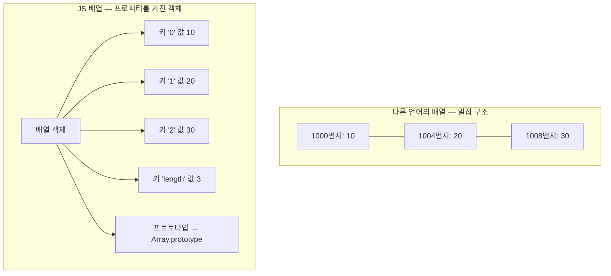

<Callout type="info">
  **이번 문서의 목표:** JavaScript 배열이 왜 "진짜 배열"이 아닌지 설명하고, `length` 조작·희소 배열·원본 변경 여부라는 세 가지 함정을 스스로 진단해 피할 수 있게 된다.
</Callout>

## 1. JavaScript 배열의 정체 — 배열이 아니라 객체다

### 다른 언어의 배열은 어떻게 생겼나

C나 Java 같은 언어에서 **배열**(array)은 아주 엄격한 약속입니다.

- 모든 요소가 **같은 타입**이다.
- 요소가 메모리에 **빈틈없이 연속으로** 놓인다.
- 요소 하나의 크기가 고정이므로, 인덱스로 접근할 때 주소를 **계산**할 수 있다.

세 번째가 핵심입니다. 요소 하나가 4바이트이고 배열이 주소 1000번지에서 시작한다면, 5번 인덱스의 주소는 계산 한 번으로 나옵니다.

$$
주소 = 시작주소 + (인덱스 \times 요소크기)
$$

- $시작주소$ : 배열의 첫 요소가 놓인 메모리 위치
- $인덱스$ : 몇 번째 요소인지 (0부터 시작)
- $요소크기$ : 요소 하나가 차지하는 바이트 수

$$
주소 = 1000 + (5 \times 4) = 1020
$$

계산 한 번으로 위치를 알아내므로, 배열의 길이가 100만이든 1억이든 **접근 시간이 똑같습니다.** 이것을 시간 복잡도 $O(1)$, 읽는 법은 "빅오 원" 또는 "상수 시간"이라고 합니다.

### JavaScript 배열은 이 약속을 하나도 지키지 않는다

```js
const 뒤죽박죽 = [1, "둘", true, { 넷: 4 }, [5], null, function () {}];
console.log(뒤죽박죽.length); // 7 — 전부 다른 타입인데 문제없다
```

타입이 제각각입니다. 그러면 요소 크기가 다르니 주소 계산이 불가능하죠. 그럼 JavaScript 배열의 정체는 뭘까요?

```js
const 배열 = [10, 20, 30];
console.log(typeof 배열);                    // "object" — 객체다!
console.log(Object.getOwnPropertyNames(배열)); // ["0", "1", "2", "length"]
```

**JavaScript의 배열은 객체입니다.** 정확히는 **인덱스를 문자열 키로 갖고, `length` 프로퍼티를 가지며, `Array.prototype`을 상속하는 특수한 객체**입니다.

> **쉽게 말하면:** 다른 언어의 배열이 번호가 찍힌 사물함 한 줄이라면, JavaScript 배열은 **"0번", "1번" 같은 이름표를 붙인 서랍이 든 캐비닛**입니다. 이름표만 붙어 있으면 되니 서랍 크기가 제각각이어도 상관없고, 3번을 건너뛰고 4번을 만들어도 됩니다.



### 그런데 왜 느리지 않은가

객체라면 해시 테이블 탐색이 필요하니 느려야 할 텐데, 실제로는 대부분의 상황에서 충분히 빠릅니다. **현대 엔진이 최적화를 하기 때문**입니다.

V8 같은 엔진은 배열이 다음 조건을 만족하면 내부적으로 **밀집 배열**(packed array) 표현으로 바꿔 진짜 연속 메모리처럼 다룹니다.

- 인덱스가 0부터 빈틈없이 채워져 있다 (구멍이 없다)
- 요소 타입이 균일하다 (전부 숫자, 또는 전부 객체 등)

반대로 **구멍이 생기거나 타입이 섞이면** 엔진은 최적화를 포기하고 느린 딕셔너리 표현으로 되돌립니다. 이 사실이 다음 절의 "희소 배열을 피해야 하는 이유"로 이어집니다.

## 2. 배열 생성 — 네 가지 방법과 하나의 함정

### 배열 리터럴 — 기본이자 최선

```js
const 빈배열 = [];
const 숫자들 = [1, 2, 3];
```

99퍼센트의 경우 이것으로 충분합니다.

### `Array` 생성자 — 인수 개수에 따라 동작이 달라지는 함정

```js
console.log(Array(1, 2, 3));  // [1, 2, 3]  — 인수가 여러 개면 요소로
console.log(Array(3));        // [비어있음 × 3] — 인수가 숫자 하나면 길이로!
console.log(Array("3"));      // ["3"]      — 숫자가 아니면 요소로
```

**인수가 숫자 하나일 때만 "길이"로 해석**됩니다. 이 일관성 없는 규칙이 유명한 버그의 원천입니다.

```js
const 잘못 = Array(3);
console.log(잘못.length);        // 3
console.log(잘못[0]);            // undefined
console.log(잘못.map(x => 1));   // [비어있음 × 3] — map이 아무것도 안 한다!
```

마지막 줄이 충격적입니다. 길이가 3인 배열에 `map`을 돌렸는데 결과가 그대로입니다. 이유는 다음 절의 **희소 배열**에 있습니다.

### `Array.of` — 생성자 함정의 해결책

```js
console.log(Array.of(3));       // [3]   — 항상 인수를 요소로 취급
console.log(Array.of(1, 2, 3)); // [1, 2, 3]
```

`Array.of`는 ES6에서 딱 이 문제를 없애려고 추가된 정적 메서드입니다.

### `Array.from` — 유사 배열과 이터러블을 배열로

**유사 배열 객체**(array-like object)는 `length` 프로퍼티와 인덱스 키를 갖지만 `Array.prototype`을 상속하지 않은 객체입니다. 배열처럼 생겼지만 `map`이나 `filter`가 없습니다.

```js
const 유사배열 = { 0: "가", 1: "나", 2: "다", length: 3 };
// 유사배열.map(...)  // TypeError — map이 없다

console.log(Array.from(유사배열));   // ["가", "나", "다"] — 진짜 배열이 됨
console.log(Array.from("hello"));   // ["h","e","l","l","o"] — 이터러블도 OK
console.log(Array.from({ length: 3 }, (_, i) => i * 10)); // [0, 10, 20]
```

세 번째 줄이 특히 유용합니다. `Array.from`의 두 번째 인수는 **매핑 함수**로, `map`을 한 번 더 도는 대신 생성과 동시에 값을 채워 줍니다. `Array(3)` 대신 `Array.from({ length: 3 }, ...)`을 쓰면 구멍 없는 배열을 얻습니다.

| 만들고 싶은 것 | 권장 방법 |
|----------------|-----------|
| 값이 정해진 배열 | 리터럴 `[1, 2, 3]` |
| 길이 n의 빈 슬롯 | `Array.from({ length: n })` 또는 `Array(n).fill()` |
| 길이 n을 규칙으로 채우기 | `Array.from({ length: n }, (_, i) => 식)` |
| 문자열·Set·Map을 배열로 | `Array.from(대상)` 또는 스프레드 |
| 인수 하나를 요소로 확실히 | `Array.of(값)` |

## 3. length 프로퍼티 — 읽기만 하는 값이 아니다

배열의 `length`는 **가장 큰 인덱스보다 1 큰 값**으로 자동 유지됩니다. 그런데 이 값은 **쓸 수도 있습니다.**

```js
const 목록 = [1, 2, 3, 4, 5];

목록.length = 3;
console.log(목록);        // [1, 2, 3] — 뒤가 잘렸다!

목록.length = 5;
console.log(목록);        // [1, 2, 3, 비어있음 × 2] — 늘리면 구멍이 생긴다
console.log(목록[4]);     // undefined
```

`length`를 줄이면 **뒤쪽 요소가 실제로 삭제**됩니다. 이것을 이용해 배열을 통째로 비우는 관용구가 있습니다.

```js
목록.length = 0;   // 배열 비우기 (원본 객체는 그대로 유지)
```

`목록 = []`과 다른 점에 주의하세요. 후자는 **새 배열을 만들어 변수만 갈아 끼우는 것**이라, 그 배열을 참조하던 다른 변수는 옛 배열을 계속 봅니다. `length = 0`은 원본 객체 자체를 비웁니다.

<Callout type="warning">
  **자주 틀리는 점:** 인덱스가 아닌 키로 값을 넣으면 `length`가 변하지 않습니다.

  ```js
  const a = [1, 2];
  a[10] = 3;      // 인덱스 → length가 11로 늘어남
  a["이름"] = 4;   // 인덱스 아님 → length 그대로, 그냥 객체 프로퍼티
  console.log(a.length); // 11
  ```

  `a["이름"]`은 배열 요소가 아니라 **배열 객체에 붙은 일반 프로퍼티**입니다. `for...of`나 `map`에서도 무시됩니다. 배열에 이름 붙은 데이터를 넣고 싶다면 객체나 `Map`(23편)을 쓰세요.
</Callout>

## 4. 희소 배열 — 구멍이 뚫린 배열

### 정의와 발생 경로

**희소 배열**(sparse array, 성기게 흩어진 배열)은 **인덱스가 연속으로 채워져 있지 않은 배열**입니다. 빠진 자리를 **구멍**(hole)이라고 부릅니다. 반대말은 **밀집 배열**(dense array)입니다.

구멍은 세 가지 경로로 생깁니다.

```js
const 경로1 = [1, , 3];        // 리터럴에서 값을 비움
const 경로2 = Array(3);        // Array 생성자에 숫자 하나
const 경로3 = [1, 2, 3];
경로3[10] = 11;                // 범위를 건너뛰고 대입
delete 경로3[1];               // delete로 요소 제거 — 가장 흔한 실수
```

마지막 `delete`가 특히 위험합니다. **요소를 지워도 `length`는 그대로**라서 배열에 구멍만 남습니다.

### 구멍과 undefined는 다르다

이것이 이 절의 핵심입니다. 두 배열을 비교해 봅시다.

```js
const 구멍있음 = [1, , 3];
const 언디파인드 = [1, undefined, 3];

console.log(구멍있음[1]);      // undefined
console.log(언디파인드[1]);    // undefined  ← 읽으면 똑같다
```

읽을 때는 구별이 안 됩니다. 하지만 **프로퍼티가 존재하는지**를 물으면 다릅니다.

```js
console.log(1 in 구멍있음);    // false — 키 자체가 없다
console.log(1 in 언디파인드);  // true  — 키가 있고 값이 undefined다
```

구멍은 **값이 undefined인 게 아니라, 프로퍼티가 아예 없는 것**입니다. 그래서 메서드마다 처리가 달라집니다.

### 실험 — 메서드별 구멍 처리 확인하기

<CodePlayground
  template="vanilla"
  activeFile="/index.js"
  showConsole
  label="구멍 뚫린 배열에서 각 메서드가 어떻게 다르게 동작하는지"
  files={{
    '/index.js': `const 구멍 = [1, , 3];        // 인덱스 1이 구멍
const 언디 = [1, undefined, 3];

console.log("=== 겉보기는 같다 ===");
console.log("구멍[1]:", 구멍[1], "/ 언디[1]:", 언디[1]);
console.log("length:", 구멍.length, 언디.length);

console.log("=== 존재 여부는 다르다 ===");
console.log("1 in 구멍:", 1 in 구멍);      // false
console.log("1 in 언디:", 1 in 언디);      // true
console.log("hasOwn 구멍:", Object.hasOwn(구멍, 1));

console.log("=== 구멍을 건너뛰는 메서드 (옛 메서드) ===");
let 센횟수 = 0;
구멍.forEach(() => 센횟수++);
console.log("forEach 호출 횟수:", 센횟수);            // 2 — 구멍은 건너뜀
console.log("map 결과:", 구멍.map(x => x * 10));     // [10, 비어있음, 30]
console.log("filter 결과:", 구멍.filter(() => true)); // [1, 3] — 구멍 사라짐

console.log("=== 구멍을 undefined로 다루는 메서드 (새 메서드) ===");
console.log("join:", 구멍.join("-"));                 // "1--3"
console.log("includes undefined:", 구멍.includes(undefined)); // true
console.log("indexOf undefined:", 구멍.indexOf(undefined));   // -1  (!!)
console.log("Array.from:", Array.from(구멍));         // [1, undefined, 3]
console.log("스프레드:", [...구멍]);                   // [1, undefined, 3]

console.log("=== 왜 Array(3).map이 안 먹히는가 ===");
console.log("Array(3).map:", Array(3).map(() => 1));  // 전부 구멍 — 변화 없음
console.log("fill 후 map:", Array(3).fill().map((_, i) => i)); // [0,1,2]
console.log("from이 정석:", Array.from({ length: 3 }, (_, i) => i));

console.log("=== delete는 구멍을 만든다 ===");
const 삭제테스트 = ["가", "나", "다"];
delete 삭제테스트[1];
console.log("delete 후:", 삭제테스트, "length:", 삭제테스트.length);
const 정석 = ["가", "나", "다"];
정석.splice(1, 1);
console.log("splice 후:", 정석, "length:", 정석.length);

// [바꿔보기] 구멍 배열을 [1, , , 4]로 바꾸면 forEach 호출 횟수는 몇일까요?
// [바꿔보기] includes는 true인데 indexOf는 -1인 이유를 생각해 보세요.`,
  }}
/>

### 실험 결과 해석

`includes`는 `true`인데 `indexOf`는 `-1`입니다. 이 불일치는 두 메서드가 **다른 비교 알고리즘**을 쓰기 때문입니다.

- `indexOf`는 엄격 동등 비교(`===`)를 씁니다. 그런데 구멍에는 프로퍼티 자체가 없어 비교 대상이 되지 못하고 건너뛰어집니다.
- `includes`는 SameValueZero라는 알고리즘을 쓰고, **구멍을 `undefined`로 취급**합니다. (이 차이는 `NaN` 검색에서도 드러납니다 — `[NaN].indexOf(NaN)`은 `-1`, `[NaN].includes(NaN)`은 `true`입니다.)

큰 그림에서 규칙은 이렇습니다.

| 메서드 세대 | 구멍 처리 | 예 |
|-------------|-----------|-----|
| ES5 이전 순회 메서드 | 건너뜀 | `forEach`, `map`, `filter`, `some`, `every`, `reduce` |
| ES6 이후 메서드 | `undefined`로 취급 | `find`, `findIndex`, `includes`, `fill`, `copyWithin`, `Array.from`, 스프레드, `for...of` |

<Callout type="warning">
  **자주 틀리는 점:** **희소 배열은 만들지 마세요.** 메서드마다 동작이 다르고, 엔진 최적화도 깨지고, 코드를 읽는 사람이 구멍을 예상하지 못합니다. 요소를 제거할 때는 `delete` 대신 `splice`를, 길이만 정한 배열이 필요하면 `Array(n)` 대신 `Array.from({ length: n })`을 쓰세요. 규칙은 하나입니다 — **구멍을 만들지 말고, 남의 배열에 구멍이 있을 수 있다는 가정도 하지 말자.**
</Callout>

## 5. 요소 조작 메서드 — 원본을 바꾸는가

배열 메서드를 외울 때 이름보다 중요한 질문이 있습니다. **"이 메서드는 원본을 바꾸는가?"**

원본을 바꾸는 것을 **파괴적 메서드**(mutator method) 또는 뮤테이터, 새 배열을 반환하는 것을 **비파괴적 메서드**(non-mutating method)라고 합니다. 이 구분을 놓치면 "왜 원본이 바뀌었지?" 또는 "왜 안 바뀌었지?" 하는 버그를 반복하게 됩니다.

> **쉽게 말하면:** 파괴적 메서드는 원본 노트에 직접 낙서하는 것이고, 비파괴적 메서드는 원본을 복사해서 복사본에 쓰고 그 복사본을 건네주는 것입니다.

### 파괴적 메서드 — 원본을 바꾼다

| 메서드 | 하는 일 | 반환값 |
|--------|---------|--------|
| `push(값…)` | 끝에 추가 | 새 `length` |
| `pop()` | 끝에서 제거 | 제거된 요소 |
| `unshift(값…)` | 앞에 추가 | 새 `length` |
| `shift()` | 앞에서 제거 | 제거된 요소 |
| `splice(시작, 개수, 값…)` | 임의 위치에서 제거·삽입 | 제거된 요소들의 배열 |
| `sort(비교함수)` | 정렬 (18편) | 정렬된 원본 |
| `reverse()` | 순서 뒤집기 | 뒤집힌 원본 |
| `fill(값, 시작, 끝)` | 구간을 값으로 채움 | 원본 |

여기서 **반환값에 주의**해야 합니다. `push`는 배열이 아니라 **새 길이**, 즉 숫자를 반환합니다. 그래서 아래 코드는 흔한 실수입니다.

```js
const 목록 = [1, 2];
const 결과 = 목록.push(3);
console.log(결과);   // 3 — 배열이 아니라 길이!
console.log(목록);   // [1, 2, 3] — 원본이 바뀐 것
```

`unshift`와 `shift`도 이름이 헷갈립니다. 기억법: **`shift`는 앞을 다루고 `pop`/`push`는 뒤를 다룹니다.** `un-shift`는 shift의 반대(앞에 넣기)라고 읽으면 됩니다. 성능상 `shift`/`unshift`는 **모든 요소의 인덱스를 다시 매겨야 하므로** `push`/`pop`보다 느립니다. 큐(queue)를 대량으로 다뤄야 한다면 이 점을 고려해야 합니다.

### `splice` — 가장 강력하고 가장 헷갈리는 메서드

```js
const 알파벳 = ["가", "나", "다", "라", "마"];

// splice(시작 인덱스, 삭제할 개수, 삽입할 요소들...)
const 제거됨 = 알파벳.splice(1, 2, "X", "Y", "Z");

console.log(제거됨);   // ["나", "다"] — 제거된 것들이 반환된다
console.log(알파벳);   // ["가", "X", "Y", "Z", "라", "마"]
```

세 가지 용도를 한 메서드가 다 합니다.

```js
배열.splice(2, 1);           // 삭제만 — 인덱스 2에서 1개 제거
배열.splice(2, 0, "새값");    // 삽입만 — 0개 제거하고 끼워 넣기
배열.splice(2, 1, "교체");    // 교체 — 1개 빼고 1개 넣기
```

<Callout type="warning">
  **자주 틀리는 점:** `slice`와 `splice`는 이름이 한 글자 차이인데 성격이 정반대입니다.

  - `slice(시작, 끝)` — **원본을 건드리지 않고** 잘라낸 **복사본**을 반환합니다. 끝 인덱스는 포함되지 않습니다.
  - `splice(시작, 개수, …)` — **원본을 바꾸고** 제거된 요소를 반환합니다.

  헷갈릴 때: `splice`에는 `p`가 있고, `p`는 파괴(destructive)의 신호라고 외우면 편합니다.
</Callout>

### 비파괴적 메서드 — 새 배열을 준다

| 메서드 | 하는 일 |
|--------|---------|
| `slice(시작, 끝)` | 구간을 복사 (끝 인덱스 제외) |
| `concat(값…)` | 이어붙인 새 배열 |
| `flat(깊이)` | 중첩 배열을 평탄화 |
| `join(구분자)` | 문자열로 합침 |
| `toSorted()` / `toReversed()` / `toSpliced()` / `with()` | ES2023 – 파괴적 메서드의 비파괴 버전 |

마지막 줄이 반가운 소식입니다. ES2023에서 `sort`, `reverse`, `splice`, 인덱스 대입의 **비파괴 버전**이 추가됐습니다.

```js
const 원본 = [3, 1, 2];

const 옛방식 = [...원본].sort();   // 복사 후 정렬 — 지금까지의 관용구
const 새방식 = 원본.toSorted();    // 한 번에

console.log(원본);   // [3, 1, 2] — 둘 다 원본 보존
console.log(새방식); // [1, 2, 3]

console.log(원본.with(0, 99));  // [99, 1, 2] — 인덱스 0을 바꾼 새 배열
```

### 검색 메서드

```js
const 과일 = ["사과", "바나나", "사과", "포도"];

console.log(과일.indexOf("사과"));       // 0  — 앞에서부터 첫 위치
console.log(과일.lastIndexOf("사과"));   // 2  — 뒤에서부터 첫 위치
console.log(과일.indexOf("수박"));       // -1 — 없으면 -1
console.log(과일.includes("포도"));      // true — 있는지만 물을 때
console.log(과일.at(-1));               // "포도" — 음수 인덱스 지원 (ES2022)
```

`at(-1)`은 작지만 반가운 추가입니다. 그전에는 마지막 요소를 얻으려면 `배열[배열.length - 1]`이라고 써야 했는데, 배열 이름이 길면 한 줄이 흉해졌습니다.

<Callout type="warning">
  **자주 틀리는 점:** `indexOf`가 `-1`을 반환한다는 점 때문에 `if (배열.indexOf(x))`라고 쓰면 안 됩니다. 인덱스 0에서 찾았을 때 `0`은 거짓 같은 값(falsy)이라 조건이 거짓이 되어 버립니다. 존재 여부만 알고 싶으면 `includes`를, `indexOf`를 써야 한다면 반드시 `!== -1`로 비교하세요.
</Callout>

## 핵심 정리

- JavaScript 배열은 **인덱스를 키로 갖는 객체**다. 타입이 섞여도 되고 구멍이 있어도 되는 대신, 엔진의 최적화(밀집 표현)를 유지해야 빠르다.
- `Array(3)`은 요소 3개가 아니라 **구멍 3개**를 만든다. `Array.of`와 `Array.from({ length: n }, …)`이 안전한 대안이다.
- `length`는 **쓸 수 있는 프로퍼티**다. 줄이면 뒤가 잘리고, 늘리면 구멍이 생긴다.
- **구멍은 `undefined`가 아니다.** 프로퍼티 자체가 없다. 옛 순회 메서드는 건너뛰고 ES6 이후 메서드는 `undefined`로 취급하므로, 애초에 구멍을 만들지 않는 것이 정답이다. 요소 제거는 `delete`가 아니라 `splice`.
- 메서드는 **원본을 바꾸는 것과 새 배열을 주는 것**으로 나뉜다. `slice`는 비파괴, `splice`는 파괴. ES2023의 `toSorted`, `toReversed`, `with`로 비파괴 버전을 쓸 수 있다.

## 마무리 복습

<Quiz
  questionNumber={1}
  question="JavaScript 배열이 다른 언어의 배열과 근본적으로 다른 점은?"
  options={['요소를 인덱스로 접근할 수 없다', '인덱스를 키로 갖는 객체이므로 타입이 섞이거나 인덱스가 비어 있어도 된다', '길이를 미리 정해야만 사용할 수 있다', '반드시 숫자만 담을 수 있다']}
  correctAnswer={2}
  explanation="JS 배열은 typeof 결과가 object인 특수한 객체로, 인덱스를 문자열 키로 갖고 length 프로퍼티와 Array.prototype을 가진다. 그래서 타입 혼합과 구멍이 허용된다."
  optionExplanations={['인덱스 접근은 정상적으로 가능하다', '정답 — 객체라는 사실이 모든 특이 동작의 근원이다', '길이를 미리 정할 필요가 없고 동적으로 늘어난다', '어떤 타입이든 담을 수 있다']}
/>

<Quiz
  questionNumber={2}
  question="Array(3)에 map을 호출해도 콜백이 한 번도 실행되지 않는 이유는?"
  options={['map은 길이가 3 이상인 배열에서만 동작하기 때문', 'Array(3)이 만든 것은 값이 아니라 구멍이고 map은 구멍을 건너뛰기 때문', 'Array 생성자로 만든 배열에는 프로토타입 메서드가 없기 때문', 'map은 원본을 바꾸는 메서드라서 반환값이 없기 때문']}
  correctAnswer={2}
  explanation="Array(3)은 length가 3이지만 인덱스 프로퍼티가 하나도 없는 희소 배열을 만든다. map, forEach 등 ES5 이전 순회 메서드는 존재하지 않는 프로퍼티를 건너뛰므로 콜백이 호출되지 않는다."
  optionExplanations={['길이 조건 같은 것은 없다', '정답 — 구멍은 프로퍼티가 없는 상태다', '프로토타입 메서드는 정상적으로 상속된다', 'map은 새 배열을 반환하는 비파괴 메서드다']}
/>

<Quiz
  questionNumber={3}
  question="배열 요소를 안전하게 제거하는 방법으로 알맞은 것은?"
  options={['delete 연산자로 해당 인덱스를 지운다', 'splice로 해당 인덱스에서 제거한다', '해당 인덱스에 undefined를 대입한다', 'length를 1 줄인다']}
  correctAnswer={2}
  explanation="delete는 프로퍼티만 지우고 length를 그대로 두어 구멍을 만든다. splice는 요소를 제거하고 뒤 요소를 당겨 length까지 정확히 줄여 주므로 밀집 배열이 유지된다."
  optionExplanations={['구멍이 생기고 length가 변하지 않아 배열 상태가 어긋난다', '정답 — 제거 후 인덱스가 재정렬되고 length가 갱신된다', '값만 undefined가 될 뿐 요소 개수는 그대로다', '항상 마지막 요소만 사라지므로 임의 위치 제거에 쓸 수 없다']}
/>

<Quiz
  questionNumber={4}
  question="slice와 splice의 차이로 옳은 것은?"
  options={['slice는 원본을 유지하고 복사본을 반환하며 splice는 원본을 변경한다', '둘 다 원본을 변경하지만 반환값만 다르다', 'slice는 삽입도 가능하고 splice는 추출만 가능하다', '둘은 완전히 동일하며 이름만 다르다']}
  correctAnswer={1}
  explanation="slice는 지정 구간의 복사본을 반환하는 비파괴 메서드이고, splice는 원본에서 요소를 제거하거나 삽입하는 파괴적 메서드로 제거된 요소들의 배열을 반환한다."
  optionExplanations={['정답 — 이름이 비슷하지만 성격은 정반대다', 'slice는 원본을 전혀 건드리지 않는다', '삽입이 가능한 쪽은 splice다', '동작이 근본적으로 다르다']}
/>

<Quiz
  questionNumber={5}
  question="배열의 length에 0보다 작은 값이 아닌 기존보다 작은 값을 대입하면 어떻게 되는가?"
  options={['아무 일도 일어나지 않는다', '새 length를 넘어서는 뒤쪽 요소들이 실제로 삭제된다', '에러가 발생한다', '앞쪽 요소들이 삭제된다']}
  correctAnswer={2}
  explanation="length는 읽기 전용이 아니라 쓰기 가능한 프로퍼티다. 현재보다 작은 값을 대입하면 그 인덱스 이상의 요소들이 실제로 제거된다. length를 0으로 두면 배열이 비워진다."
  optionExplanations={['length 대입은 실제 요소에 영향을 준다', '정답 — 배열 비우기 관용구가 여기서 나온다', '정상적인 동작이며 에러가 아니다', '잘리는 쪽은 뒤쪽이다']}
/>

<Quiz
  questionNumber={6}
  question="구멍이 있는 배열에서 includes는 true를 반환하는데 indexOf는 -1을 반환하는 이유는?"
  options={['includes가 더 최신 메서드라서 항상 true를 반환하기 때문', 'includes는 구멍을 undefined로 취급하지만 indexOf는 존재하지 않는 프로퍼티를 건너뛰기 때문', 'indexOf는 문자열만 검색할 수 있기 때문', 'includes는 원본을 변경하기 때문']}
  correctAnswer={2}
  explanation="ES6 이후 추가된 includes는 구멍을 undefined 값으로 간주해 검색하지만, ES5 이전의 indexOf는 엄격 동등 비교를 사용하면서 존재하지 않는 인덱스를 건너뛴다. 같은 이유로 NaN 검색 결과도 두 메서드가 다르다."
  optionExplanations={['최신 여부가 아니라 구멍 처리 규칙의 차이다', '정답 — 메서드 세대에 따라 구멍 처리가 갈린다', 'indexOf는 모든 타입을 검색할 수 있다', 'includes는 비파괴 메서드다']}
/>

<Quiz
  questionNumber={7}
  question="길이가 5이고 0부터 4까지의 값이 채워진 배열을 만드는 가장 안전한 방법은?"
  options={['Array(5).map((_, i) => i)', 'Array.from({ length: 5 }, (_, i) => i)', 'Array.of(5)', 'new Array(0, 1, 2, 3, 4).length = 5']}
  correctAnswer={2}
  explanation="Array.from은 length 프로퍼티를 가진 유사 배열 객체를 받아 각 인덱스마다 매핑 함수를 호출하므로 구멍 없는 밀집 배열을 만든다. Array(5)는 구멍만 만들어 map이 동작하지 않는다."
  optionExplanations={['Array(5)는 구멍 배열이라 map 콜백이 실행되지 않는다', '정답 — 생성과 채우기를 한 번에 처리한다', 'Array.of(5)는 요소가 5 하나뿐인 배열을 만든다', 'length 대입은 값을 채우지 못한다']}
/>

## 참고 자료

- [MDN - Array](https://developer.mozilla.org/en-US/docs/Web/JavaScript/Reference/Global_Objects/Array)
- [MDN - Indexed collections](https://developer.mozilla.org/en-US/docs/Web/JavaScript/Guide/Indexed_collections)
- [MDN - Array.from](https://developer.mozilla.org/en-US/docs/Web/JavaScript/Reference/Global_Objects/Array/from)
