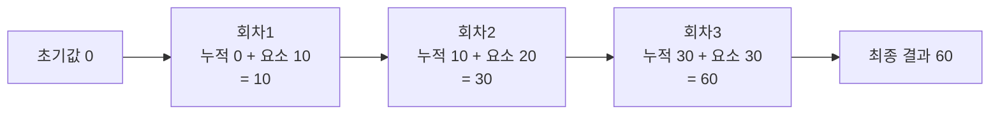
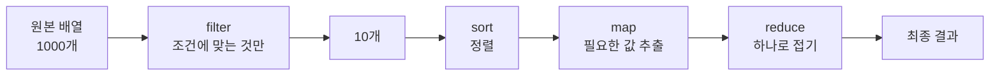

<Callout type="info">
  **이번 문서의 목표:** 반복문 대신 고차 함수로 데이터를 변환하는 사고방식을 익히고, `reduce`를 직접 구현해 원리를 이해하며, `sort`의 기본 정렬이 왜 숫자를 뒤죽박죽으로 만드는지 설명할 수 있게 된다.
</Callout>

## 왜 고차 함수인가

배열의 모든 요소를 두 배로 만드는 코드를 `for` 문으로 써 봅시다.

```js
const 원본 = [1, 2, 3];
const 결과 = [];
for (let i = 0; i < 원본.length; i++) {
  결과.push(원본[i] * 2);
}
```

동작에는 문제가 없습니다. 그런데 이 5줄에서 **정말 하고 싶었던 말**은 `원본[i] * 2` 하나뿐입니다. 나머지 — 카운터 변수 `i`를 만들고, 조건을 걸고, 증가시키고, 빈 배열을 준비하고, `push`하는 일 — 은 전부 **어떻게 반복할지에 관한 부수적인 절차**입니다.

이 절차는 반복해서 쓰이면서 반복해서 실수를 부릅니다. `i <= 원본.length`라고 잘못 쓰거나, `i++`를 빠뜨려 무한 루프를 만들거나, 결과 배열 초기화를 잊거나.

**고차 함수**(higher-order function)는 이 절차를 라이브러리 쪽으로 밀어 넣습니다. 고차(higher-order)란 "차수가 더 높은"이라는 뜻으로, **함수를 인수로 받거나 함수를 반환하는 함수**를 말합니다. 8편에서 배운 "함수는 일급 객체"라는 사실이 있기에 가능한 설계입니다.

```js
const 결과 = 원본.map(값 => 값 * 2);
```

> **쉽게 말하면:** `for` 문은 "재료를 하나씩 꺼내서, 자르고, 그릇에 담고, 다음 재료로 넘어가라"고 절차를 부르는 것이고, 고차 함수는 요리사에게 "이 레시피대로 전부 해 주세요"라고 **레시피만 건네는 것**입니다.

## 1. 모든 순회 메서드의 공통 구조

먼저 뼈대를 잡습니다. `forEach`, `map`, `filter`, `some`, `every`, `find`는 전부 **똑같은 모양의 콜백**을 받습니다.

```js
배열.메서드((요소, 인덱스, 원본배열) => { /* ... */ }, this로쓸값);
```

- **첫 번째 인수**: 현재 요소의 값
- **두 번째 인수**: 현재 인덱스 (필요 없으면 생략 가능)
- **세 번째 인수**: 메서드를 호출한 배열 자체 (거의 안 씀)
- **메서드의 두 번째 인수**: 콜백 안에서 `this`로 쓸 값 (12편)

이 규칙을 알면 **인수를 몇 개까지 쓸지 스스로 정할 수 있다**는 것이 중요합니다. 그리고 여기서 유명한 함정이 하나 나옵니다.

```js
console.log(["1", "2", "3"].map(parseInt));
// 예상: [1, 2, 3]
// 실제: [1, NaN, NaN]
```

왜일까요? `map`은 콜백에 **인수를 세 개 넘깁니다.** `parseInt`는 두 번째 인수를 **진법**(radix)으로 받습니다. 그래서 실제로는 이렇게 호출됩니다.

```js
parseInt("1", 0);  // 진법 0은 기본값 취급 → 1
parseInt("2", 1);  // 1진법은 존재하지 않음 → NaN
parseInt("3", 2);  // 2진법에 3이라는 숫자는 없음 → NaN
```

**교훈**: 콜백 자리에 인수를 여러 개 받는 기존 함수를 그대로 넣지 마세요. `map(문자 => parseInt(문자, 10))`처럼 화살표 함수로 감싸 **넘길 인수를 명시**해야 합니다.

## 2. forEach — 순회만 하고 아무것도 돌려주지 않는다

```js
const 이름들 = ["지민", "서연", "도윤"];
이름들.forEach((이름, 순번) => {
  console.log(`${순번 + 1}번: ${이름}`);
});
```

`forEach`의 반환값은 **항상 `undefined`**입니다. 값을 만들어내는 게 아니라 **부수 효과**(side effect, 화면 출력·서버 전송 등 함수 바깥에 영향을 주는 일)를 일으키는 용도입니다.

<Callout type="warning">
  **자주 틀리는 점 두 가지**

  1. **`forEach`로 값을 모으려 하기**: `const r = 배열.forEach(x => x * 2)`는 `undefined`입니다. 새 배열이 필요하면 `map`을 쓰세요.
  2. **`forEach` 중간에 멈추려 하기**: `break`나 `continue`를 쓸 수 없고, `return`은 그 회차의 콜백만 끝낼 뿐 순회는 계속됩니다. 중간에 멈춰야 한다면 `for...of`(24편)나 `some`/`every`를 쓰세요 — `some`은 `true`를 반환하는 순간, `every`는 `false`를 반환하는 순간 순회를 중단합니다.
</Callout>

## 3. map — 하나를 하나로 바꾼다

**`map`은 요소 개수를 절대 바꾸지 않습니다.** 입력이 5개면 출력도 5개입니다. 각 요소를 **다른 값으로 갈아 끼우는** 것이 전부입니다.

```js
const 사용자들 = [
  { 이름: "지민", 나이: 28 },
  { 이름: "서연", 나이: 34 },
];

const 이름만 = 사용자들.map(u => u.이름);      // ["지민", "서연"]
const 한살더 = 사용자들.map(u => ({ ...u, 나이: u.나이 + 1 }));
```

두 번째 예제의 괄호를 눈여겨보세요. 화살표 함수에서 **객체 리터럴을 바로 반환하려면 소괄호로 감싸야 합니다.** `u => { ...u }`라고 쓰면 중괄호가 객체가 아니라 **함수 본문 블록**으로 해석되어 `undefined`가 반환됩니다.

> **쉽게 말하면:** `map`은 컨베이어 벨트 위 물건을 하나씩 집어 가공한 뒤 **같은 자리에** 다시 올려놓는 기계입니다. 개수도 순서도 그대로, 내용만 바뀝니다.

## 4. filter — 조건에 맞는 것만 남긴다

**`filter`는 값을 바꾸지 않고 개수만 줄입니다.** `map`과 정확히 반대되는 성격입니다.

```js
const 숫자들 = [1, 2, 3, 4, 5, 6];
const 짝수 = 숫자들.filter(n => n % 2 === 0);  // [2, 4, 6]
```

콜백은 **참 같은 값**(truthy)을 반환하면 그 요소를 남기고, 거짓 같은 값(falsy)이면 버립니다. 그래서 이런 관용구가 성립합니다.

```js
const 잡동사니 = [0, "가", "", null, "나", undefined, 3, NaN];
console.log(잡동사니.filter(Boolean));  // ["가", "나", 3]
```

`filter(Boolean)`은 "거짓 같은 값 전부 제거"라는 뜻의 유명한 관용구입니다. `Boolean` 함수가 그대로 콜백 자리에 들어갔는데, 앞서 본 `parseInt` 함정과 달리 `Boolean`은 **인수를 하나만 보므로** 안전합니다.

<Callout type="warning">
  **자주 틀리는 점:** `filter`는 조건에 맞는 것이 하나도 없어도 `undefined`가 아니라 **빈 배열 `[]`**을 반환합니다. 하나만 찾고 싶을 때 `filter(...)[0]`이라고 쓰면 배열을 다 순회하는 낭비가 생기고, 없을 때 `undefined`가 되는 것도 헷갈립니다. 하나만 필요하면 **`find`**를 쓰세요 — 찾는 즉시 순회를 멈추고, 없으면 `undefined`를 반환합니다.
</Callout>

## 5. reduce — 여러 개를 하나로 접는다

### 왜 필요한가

`map`은 개수를 유지하고 `filter`는 개수를 줄입니다. 그런데 **배열 전체를 값 하나로 압축**하고 싶을 때가 있습니다. 합계, 평균, 최댓값, 개수 세기, 그룹으로 묶기 같은 것들이죠.

`reduce`는 **줄이다**(reduce)라는 이름 그대로, 배열을 **하나의 값으로 접는** 메서드입니다. 함수형 프로그래밍에서는 이 연산을 **fold**(접기)라고 부르기도 합니다.

### 구조 해부

```js
배열.reduce((누적값, 현재요소, 인덱스, 원본) => 새누적값, 초기값);
```

- **누적값**(accumulator, 어큐뮬레이터): 지금까지 접어온 결과. 다음 회차의 첫 인수가 됩니다.
- **현재요소**: 이번에 처리할 요소.
- **초기값**(initial value): 첫 회차의 누적값. **생략하면 배열의 첫 요소가 초기값이 되고 순회는 인덱스 1부터 시작합니다.**

핵심은 "**콜백이 반환한 값이 다음 회차의 누적값이 된다**"는 한 문장입니다.



### 손으로 따라가기

`[10, 20, 30].reduce((합, 값) => 합 + 값, 0)`의 실행을 표로 펼치면 이렇습니다.

| 회차 | 누적값(들어올 때) | 현재요소 | 콜백 반환값 |
|------|------------------|----------|-------------|
| 1 | 0 (초기값) | 10 | 10 |
| 2 | 10 | 20 | 30 |
| 3 | 30 | 30 | 60 |

마지막 콜백의 반환값 60이 `reduce`의 최종 결과입니다.

> **쉽게 말하면:** `reduce`는 눈덩이를 굴리는 것입니다. 초기값이 처음 눈덩이이고, 요소를 하나씩 만날 때마다 눈을 붙여 더 큰 눈덩이를 만듭니다. 마지막에 남은 눈덩이가 결과입니다.

### 실험 — reduce를 직접 만들어 보고 활용하기

<CodePlayground
  template="vanilla"
  activeFile="/index.js"
  showConsole
  label="reduce의 원리를 직접 구현하고 다양하게 활용하기"
  files={{
    '/index.js': `// --- 1. reduce를 직접 만들어 원리 확인 ---
function 내reduce(배열, 콜백, ...초기값들) {
  let 시작인덱스 = 0;
  let 누적;
  if (초기값들.length > 0) {
    누적 = 초기값들[0];
  } else {
    if (배열.length === 0) throw new TypeError("빈 배열에 초기값 없음");
    누적 = 배열[0];       // 첫 요소를 초기값으로
    시작인덱스 = 1;        // 순회는 1부터
  }
  for (let i = 시작인덱스; i < 배열.length; i++) {
    누적 = 콜백(누적, 배열[i], i, 배열);   // 반환값이 다음 누적값
  }
  return 누적;
}

const 점수 = [10, 20, 30];
console.log("내구현:", 내reduce(점수, (a, b) => a + b, 0));
console.log("진짜  :", 점수.reduce((a, b) => a + b, 0));

// --- 2. 각 회차를 눈으로 보기 ---
점수.reduce((누적, 값, i) => {
  console.log(\`  회차\${i}: 누적 \${누적} + 값 \${값} = \${누적 + 값}\`);
  return 누적 + 값;
}, 0);

// --- 3. 초기값을 빼면 무슨 일이 일어나는가 ---
console.log("초기값 있음:", [1, 2, 3].reduce((a, b) => a + b, 0));
console.log("초기값 없음:", [1, 2, 3].reduce((a, b) => a + b));
console.log("타입이 섞이면:", [1, 2, 3].reduce((a, b) => a + b, ""));  // "123"!
try {
  [].reduce((a, b) => a + b);      // 초기값 없이 빈 배열
} catch (e) {
  console.log("빈 배열 + 초기값 없음:", e.constructor.name);
}

// --- 4. 합계 말고 다른 용도들 ---
const 사람들 = [
  { 이름: "지민", 팀: "개발" },
  { 이름: "서연", 팀: "디자인" },
  { 이름: "도윤", 팀: "개발" },
];

// 그룹으로 묶기 — 누적값이 객체
const 팀별 = 사람들.reduce((묶음, 사람) => {
  (묶음[사람.팀] ||= []).push(사람.이름);
  return 묶음;
}, {});
console.log("팀별:", 팀별);

// 개수 세기
const 글자수 = [..."바나나"].reduce((세기, 글자) => {
  세기[글자] = (세기[글자] || 0) + 1;
  return 세기;
}, {});
console.log("글자수:", 글자수);

// 최댓값 — 누적값이 숫자
console.log("최댓값:", [3, 9, 2, 7].reduce((큰값, n) => (n > 큰값 ? n : 큰값)));

// map과 filter를 reduce로 흉내내기 (reduce가 더 일반적인 도구임을 확인)
console.log("map 흉내:", [1,2,3].reduce((r, n) => [...r, n * 2], []));
console.log("filter 흉내:", [1,2,3,4].reduce((r, n) => n % 2 ? r : [...r, n], []));

// [바꿔보기] 3번 실험에서 초기값 ""를 0으로 바꾸면 결과가 어떻게 달라지나요?
// [바꿔보기] 팀별 묶기에서 초기값 {}를 빼면 어떤 일이 벌어질까요?`,
  }}
/>

### 실험 결과 해석

세 번째 실험이 **초기값의 중요성**을 보여줍니다. 같은 콜백인데 초기값을 `""`로 주면 결과가 `"123"`이라는 문자열이 됩니다. 첫 회차에서 `"" + 1`이 문자열 연결로 해석되기 때문입니다(5편의 강제 변환).

<Callout type="warning">
  **자주 틀리는 점:** **초기값을 항상 넘기세요.** 생략했을 때의 위험이 세 가지입니다.

  1. **빈 배열에서 `TypeError`**: 초기값이 없으면 첫 요소를 쓰는데, 빈 배열에는 첫 요소가 없습니다.
  2. **누적값의 타입이 요소 타입에 끌려감**: 객체 배열에서 합계를 구하려는데 첫 회차 누적값이 객체가 되어 버립니다.
  3. **콜백의 인수 의미가 회차마다 달라짐**: 초기값이 없으면 1회차의 누적값이 "요소"이고, 2회차부터는 "누적값"입니다. 코드를 읽는 사람이 헷갈립니다.
</Callout>

`reduce`가 만능이라는 사실도 확인했습니다 — `map`과 `filter`를 `reduce`로 흉내 낼 수 있죠. 하지만 **할 수 있다고 해야 하는 것은 아닙니다.** 합계를 `reduce`로 쓰면 읽는 사람이 "아, 접는구나"라고 바로 알지만, 매핑을 `reduce`로 쓰면 "이게 뭘 하는 거지?"부터 시작합니다. **의도가 가장 잘 드러나는 메서드를 고르는 것**이 좋은 코드입니다.

## 6. sort — 가장 악명 높은 함정

### 기본 정렬은 숫자를 문자열로 취급한다

```js
const 숫자 = [10, 9, 100, 1];
숫자.sort();
console.log(숫자);   // [1, 10, 100, 9]  ← 뭐?
```

10이 9보다 앞에 있습니다. 버그가 아니라 **명세대로의 동작**입니다.

`sort`는 비교 함수를 넘기지 않으면, **모든 요소를 문자열로 변환한 뒤 유니코드 코드 포인트 순서로 비교**합니다. 그래서 `"10"`과 `"9"`를 비교할 때 첫 글자 `"1"`과 `"9"`를 견주고, `"1"`(코드 49)이 `"9"`(코드 57)보다 작으므로 10이 앞에 옵니다. 사전에서 "apple"이 "banana"보다 앞에 오는 것과 같은 원리입니다.

왜 이렇게 만들었을까요? JavaScript 초기에는 배열에 어떤 타입이든 들어갈 수 있으니 **모든 타입에 통하는 유일한 기준이 문자열 비교**였기 때문입니다. 지금 보면 나쁜 기본값이지만, 이미 수많은 코드가 의존하고 있어 바꿀 수 없습니다.

### 비교 함수의 계약

숫자를 제대로 정렬하려면 **비교 함수**(comparator, 컴패러터)를 직접 넘겨야 합니다. 계약은 이렇습니다.

```js
숫자.sort((a, b) => {
  // 음수 반환 → a를 b보다 앞에
  // 양수 반환 → a를 b보다 뒤에
  // 0 반환   → 순서 유지
});
```

가장 흔한 두 형태는 외워 두면 편합니다.

```js
숫자.sort((a, b) => a - b);   // 오름차순 (작은 것부터)
숫자.sort((a, b) => b - a);   // 내림차순 (큰 것부터)
```

`a - b`가 왜 오름차순인지 논리를 따라가 봅시다. `a`가 `b`보다 작으면 `a - b`는 음수 → "a를 앞으로" → 작은 값이 앞 → 오름차순. 뺄셈 한 번으로 세 가지 경우가 전부 처리됩니다.

<Callout type="warning">
  **자주 틀리는 점:** 문자열을 `a - b`로 비교하면 `NaN`이 나와 정렬이 무의미해집니다. 문자열은 `a.localeCompare(b)`를 쓰세요 — 한글 자모 순서나 언어별 관례(독일어 움라우트 등)까지 고려해 줍니다. 불리언 비교는 `(a === b) ? 0 : a ? -1 : 1` 같은 식으로 명시해야 합니다.
</Callout>

### 안정 정렬과 원본 변경

두 가지를 더 알아야 합니다.

**첫째, `sort`는 원본을 바꿉니다.** 17편의 파괴적 메서드입니다. 원본을 지키려면 `[...배열].sort(...)`로 복사하거나 ES2023의 `toSorted(...)`를 쓰세요.

**둘째, `sort`는 안정 정렬입니다.** **안정 정렬**(stable sort)이란 **비교 결과가 같은 요소들**, 즉 0을 반환한 요소들의 **원래 순서가 보존되는 정렬**을 말합니다. ES2019부터 명세가 이를 보장합니다. 이 성질 덕분에 다단계 정렬이 가능합니다.

```js
// 1) 이름으로 먼저 정렬 → 2) 점수로 정렬
// 점수가 같은 사람들끼리는 이름 순서가 유지된다
데이터.sort((a, b) => a.이름.localeCompare(b.이름))
     .sort((a, b) => b.점수 - a.점수);
```

### 실험 — sort의 함정을 전부 확인하기

<CodePlayground
  template="vanilla"
  activeFile="/index.js"
  showConsole
  label="sort의 기본 동작과 비교 함수, 그리고 체이닝 설계"
  files={{
    '/index.js': `// --- 1. 기본 정렬은 문자열 정렬이다 ---
console.log("기본:", [10, 9, 100, 1].sort());
console.log("올바른 오름차순:", [10, 9, 100, 1].sort((a, b) => a - b));
console.log("내림차순:", [10, 9, 100, 1].sort((a, b) => b - a));

// 왜 그런지 직접 확인
console.log("문자열 비교 결과:", "10" < "9");   // true — 사전순이라 그렇다

// --- 2. 문자열은 localeCompare ---
const 한글 = ["하늘", "가방", "나무", "다리"];
console.log("한글 정렬:", [...한글].sort((a, b) => a.localeCompare(b)));
console.log("숫자식 비교 시도:", [...한글].sort((a, b) => a - b)); // 전부 NaN, 순서 그대로

// --- 3. sort는 원본을 바꾼다 ---
const 원본 = [3, 1, 2];
const 정렬됨 = 원본.sort((a, b) => a - b);
console.log("원본도 바뀜:", 원본, "/ 같은 객체인가:", 원본 === 정렬됨);

const 원본2 = [3, 1, 2];
console.log("toSorted 사용:", 원본2.toSorted((a,b) => a-b), "/ 원본:", 원본2);

// --- 4. 안정 정렬 확인: 점수 같은 사람의 순서 ---
const 학생 = [
  { 이름: "가영", 점수: 90 },
  { 이름: "나준", 점수: 85 },
  { 이름: "다희", 점수: 90 },
  { 이름: "라온", 점수: 85 },
];
const 점수순 = [...학생].sort((a, b) => b.점수 - a.점수);
console.log("점수순:", 점수순.map(s => s.이름 + s.점수).join(" "));
// 90점끼리는 가영-다희 순서가, 85점끼리는 나준-라온 순서가 유지된다

// --- 5. 체이닝 설계: filter -> map -> reduce 순서가 중요하다 ---
const 주문 = [
  { 상품: "노트북", 가격: 1200000, 취소됨: false },
  { 상품: "마우스", 가격: 30000,  취소됨: true  },
  { 상품: "키보드", 가격: 90000,  취소됨: false },
  { 상품: "모니터", 가격: 400000, 취소됨: false },
];

const 총매출 = 주문
  .filter(o => !o.취소됨)          // 1) 먼저 줄인다 (뒤 연산의 비용 감소)
  .map(o => o.가격)                // 2) 필요한 값만 뽑는다
  .reduce((합, 가격) => 합 + 가격, 0);  // 3) 하나로 접는다
console.log("총매출:", 총매출.toLocaleString(), "원");

// 순서를 바꾸면? map을 먼저 하면 취소 여부 정보가 사라져 filter 불가
const 비싼순이름 = 주문
  .filter(o => !o.취소됨)
  .sort((a, b) => b.가격 - a.가격)
  .map(o => o.상품);
console.log("비싼 순:", 비싼순이름);

// [바꿔보기] 총매출 계산에서 filter와 map의 순서를 바꾸면 왜 실패할까요?
// [바꿔보기] 4번의 학생 배열에 점수 90인 사람을 더 추가하면 어디에 놓이나요?`,
  }}
/>

## 7. find 계열과 판정 계열

| 메서드 | 반환 | 언제 멈추나 |
|--------|------|-------------|
| `find(fn)` | 조건을 만족하는 첫 요소 (없으면 `undefined`) | 찾는 즉시 |
| `findIndex(fn)` | 첫 요소의 인덱스 (없으면 `-1`) | 찾는 즉시 |
| `findLast(fn)` / `findLastIndex(fn)` | 뒤에서부터 첫 요소 – ES2023 | 찾는 즉시 |
| `some(fn)` | 하나라도 만족하면 `true` | `true`가 나오는 즉시 |
| `every(fn)` | 전부 만족해야 `true` | `false`가 나오는 즉시 |

`some`과 `every`의 **빈 배열 동작**은 꼭 기억해야 합니다.

```js
console.log([].some(x => true));    // false — "하나라도 있나?" 없으니 false
console.log([].every(x => false));  // true  — "전부 만족하나?" 반례가 없으니 true
```

`[].every(...)`가 `true`인 것이 이상해 보이지만, 논리학의 **공허한 참**(vacuous truth)이라는 개념입니다. "이 방의 모든 코끼리는 분홍색이다"는 방에 코끼리가 없으면 참입니다 — 반례를 하나도 댈 수 없으니까요. 실무에서는 "빈 배열도 유효성 검사를 통과해 버리는" 버그로 나타나므로, 길이 검사를 따로 붙여야 할 때가 있습니다.

## 8. 체이닝 설계 원칙

메서드를 이어 붙이는 **체이닝**(chaining, 사슬처럼 잇기)은 강력하지만 아무렇게나 이으면 느리고 읽기 어려워집니다. 세 가지 원칙을 지키세요.

**원칙 1 — 줄이는 연산을 먼저.** `filter`를 앞에 두면 뒤의 `map`, `sort`가 처리할 요소가 줄어듭니다. 요소 1000개 중 10개만 남길 거라면, `map`을 먼저 하면 990번의 헛수고를 합니다.

**원칙 2 — 정보를 잃기 전에 쓴다.** `map(o => o.가격)`을 하는 순간 다른 필드는 사라집니다. 그 필드가 필요한 `filter`나 `sort`는 반드시 `map` **앞에** 와야 합니다.

**원칙 3 — 파괴적 메서드를 체인에 넣지 않는다.** `sort`와 `reverse`는 원본을 바꿉니다. `데이터.filter(...).sort(...)`는 `filter`가 새 배열을 만들었으니 안전하지만, `데이터.sort(...).map(...)`은 **`데이터` 자체를 정렬해 버립니다.** 체인 첫머리에 `sort`가 오면 `[...데이터].sort(...)`나 `toSorted(...)`로 바꾸세요.



<Callout type="warning">
  **자주 틀리는 점:** 체이닝은 단계마다 **새 배열을 만듭니다.** 요소 10만 개짜리 배열에 `.map().filter().map()`을 이으면 중간 배열이 세 개 생깁니다. 대부분의 웹 애플리케이션에서는 문제가 되지 않지만, 대량 데이터를 다룬다면 `reduce` 한 번으로 합치거나 `for...of` 루프를 쓰는 편이 나을 수 있습니다. **먼저 읽기 쉽게 쓰고, 실제로 느릴 때만 최적화하세요.**
</Callout>

## 핵심 정리

- 순회 메서드의 콜백은 모두 `(요소, 인덱스, 원본배열)`을 받는다. 이 때문에 `map(parseInt)`처럼 다인수 함수를 그대로 넘기면 진법 인수가 끼어들어 `NaN`이 나온다.
- **`forEach`는 `undefined`를 반환**하고 중간에 멈출 수 없다. 값을 만들려면 `map`, 중간 종료가 필요하면 `some`/`every`/`for...of`.
- `map`은 개수를 유지하고, `filter`는 값을 유지하며 개수를 줄이고, **`reduce`는 여러 값을 하나로 접는다.** `reduce`의 초기값은 항상 명시한다.
- **`sort`는 기본적으로 문자열 비교**라 숫자를 뒤죽박죽으로 만든다. 반드시 `(a, b) => a - b` 같은 비교 함수를 넘기고, 문자열은 `localeCompare`를 쓴다. `sort`는 원본을 바꾸는 안정 정렬이다.
- 체이닝은 **줄이는 연산을 먼저, 정보를 잃는 연산을 나중에**, 파괴적 메서드는 복사 후 사용한다.

## 마무리 복습

<Quiz
  questionNumber={1}
  question="문자열 배열에 map을 걸면서 콜백 자리에 parseInt를 그대로 넘겼더니 결과에 NaN이 섞였다. 원인은?"
  options={['parseInt가 문자열을 처리하지 못하기 때문', 'map이 콜백에 인덱스를 두 번째 인수로 넘기는데 parseInt는 그것을 진법으로 해석하기 때문', 'map은 숫자 배열에서만 동작하기 때문', 'parseInt의 반환값이 항상 NaN이기 때문']}
  correctAnswer={2}
  explanation="map은 콜백에 요소, 인덱스, 원본 배열 세 인수를 넘긴다. parseInt의 두 번째 매개변수는 진법이므로 인덱스가 진법으로 전달되어 1진법 같은 잘못된 값이 되고 NaN이 나온다. 화살표 함수로 감싸 인수를 명시해야 한다."
  optionExplanations={['parseInt는 문자열 처리가 본업이다', '정답 — 콜백 시그니처를 모르면 반드시 만나는 함정이다', 'map은 어떤 타입의 배열에서도 동작한다', 'parseInt 자체는 정상적으로 숫자를 반환한다']}
/>

<Quiz
  questionNumber={2}
  question="숫자가 담긴 배열에 비교 함수 없이 sort를 호출했을 때의 동작으로 옳은 것은?"
  options={['숫자 크기 순으로 오름차순 정렬된다', '요소를 문자열로 변환한 뒤 사전순으로 정렬한다', '정렬이 일어나지 않고 원본 순서가 유지된다', 'TypeError가 발생한다']}
  correctAnswer={2}
  explanation="비교 함수를 생략하면 sort는 각 요소를 문자열로 변환해 유니코드 코드 포인트 순서로 비교한다. 그래서 10이 9보다 앞에 오는 결과가 나온다. 숫자 정렬에는 반드시 비교 함수를 넘겨야 한다."
  optionExplanations={['크기 비교가 아니라 문자열 비교다', '정답 — 모든 타입에 통하는 기준으로 문자열을 택한 초기 설계다', '정렬 자체는 수행된다', '정상 동작이며 에러가 아니다']}
/>

<Quiz
  questionNumber={3}
  question="reduce 호출에서 초기값을 항상 넘기라고 권장하는 이유로 옳지 않은 것은?"
  options={['빈 배열에서 초기값이 없으면 TypeError가 발생한다', '초기값이 없으면 누적값의 타입이 첫 요소 타입에 끌려간다', '초기값이 없으면 첫 회차의 인수 의미가 달라져 읽기 어렵다', '초기값이 없으면 reduce가 원본 배열을 변경한다']}
  correctAnswer={4}
  explanation="reduce는 초기값 유무와 관계없이 비파괴 메서드로 원본을 변경하지 않는다. 나머지 세 가지는 초기값을 생략했을 때 실제로 생기는 문제다."
  optionExplanations={['첫 요소를 초기값으로 쓰려는데 요소가 없어 에러가 난다', '객체 배열에서 합계를 구할 때 실제로 겪는 문제다', '1회차 누적값이 요소이고 2회차부터 누적값이라 혼란스럽다', '정답(틀린 설명) — reduce는 원본을 변경하지 않는다']}
/>

<Quiz
  questionNumber={4}
  question="빈 배열에 some과 every를 각각 호출했을 때의 반환값 조합으로 옳은 것은?"
  options={['some은 false, every는 true', 'some은 true, every는 false', '둘 다 false', '둘 다 true']}
  correctAnswer={1}
  explanation="some은 조건을 만족하는 요소를 하나라도 찾아야 true인데 요소가 없으니 false다. every는 조건을 어기는 반례가 하나도 없으면 true인데 요소가 없으니 반례도 없어 true가 된다. 이를 공허한 참이라고 부른다."
  optionExplanations={['정답 — 빈 배열 유효성 검사에서 자주 문제가 되는 지점이다', 'some과 every의 결과가 뒤바뀌었다', 'every는 공허한 참으로 true다', 'some은 만족하는 요소가 없으므로 false다']}
/>

<Quiz
  questionNumber={5}
  question="forEach로는 할 수 없고 map으로만 할 수 있는 일은?"
  options={['각 요소를 콘솔에 출력하기', '각 요소를 변환한 값들로 이루어진 새 배열 얻기', '인덱스를 사용해 순회하기', '원본 배열의 객체 요소 속성 수정하기']}
  correctAnswer={2}
  explanation="forEach의 반환값은 항상 undefined이므로 변환 결과를 모을 수 없다. 새 배열이 필요하면 map을 써야 한다. 출력, 인덱스 사용, 객체 요소 수정은 둘 다 가능하다."
  optionExplanations={['출력은 forEach의 대표적인 용도다', '정답 — forEach는 undefined를 반환한다', '두 메서드 모두 인덱스를 두 번째 인수로 받는다', '요소가 객체면 참조를 통해 둘 다 수정할 수 있다']}
/>

<Quiz
  questionNumber={6}
  question="다음 중 체이닝 설계 원칙에 어긋나는 것은?"
  options={['filter로 요소를 줄인 뒤 map으로 변환한다', 'map으로 값을 추출한 뒤 그 값에 없는 필드로 filter를 시도한다', 'sort 전에 스프레드로 배열을 복사한다', 'sort로 정렬한 뒤 map으로 이름만 뽑는다']}
  correctAnswer={2}
  explanation="map으로 특정 필드만 추출하면 다른 필드 정보가 사라지므로 그 뒤에서 사라진 필드로 filter를 걸 수 없다. 정보를 잃는 연산은 그 정보를 쓰는 연산보다 뒤에 놓아야 한다."
  optionExplanations={['줄이는 연산을 먼저 두는 올바른 순서다', '정답 — 정보를 잃은 뒤에 그 정보를 쓰려는 실수다', 'sort는 원본을 바꾸므로 복사 후 정렬이 안전하다', '정렬 후 추출은 문제없는 순서다']}
/>

<Quiz
  questionNumber={7}
  question="ES2019부터 명세가 보장하는 sort의 안정성(stability)이 의미하는 것은?"
  options={['정렬 도중 에러가 발생하지 않는다', '비교 결과가 같은 요소들의 원래 순서가 보존된다', '항상 같은 시간 안에 정렬이 끝난다', '원본 배열이 변경되지 않는다']}
  correctAnswer={2}
  explanation="안정 정렬은 비교 함수가 0을 반환한 요소들의 상대적 순서를 원래대로 유지하는 성질이다. 이 덕분에 이름으로 정렬한 뒤 점수로 다시 정렬하는 다단계 정렬이 의도대로 동작한다."
  optionExplanations={['에러 발생 여부와는 무관한 개념이다', '정답 — 다단계 정렬을 가능하게 하는 성질이다', '수행 시간에 관한 보장이 아니다', 'sort는 여전히 원본을 변경하는 파괴적 메서드다']}
/>

## 참고 자료

- [MDN - Array 인스턴스 메서드](https://developer.mozilla.org/en-US/docs/Web/JavaScript/Reference/Global_Objects/Array)
- [MDN - Array.prototype.reduce](https://developer.mozilla.org/en-US/docs/Web/JavaScript/Reference/Global_Objects/Array/reduce)
- [MDN - Array.prototype.sort](https://developer.mozilla.org/en-US/docs/Web/JavaScript/Reference/Global_Objects/Array/sort)
