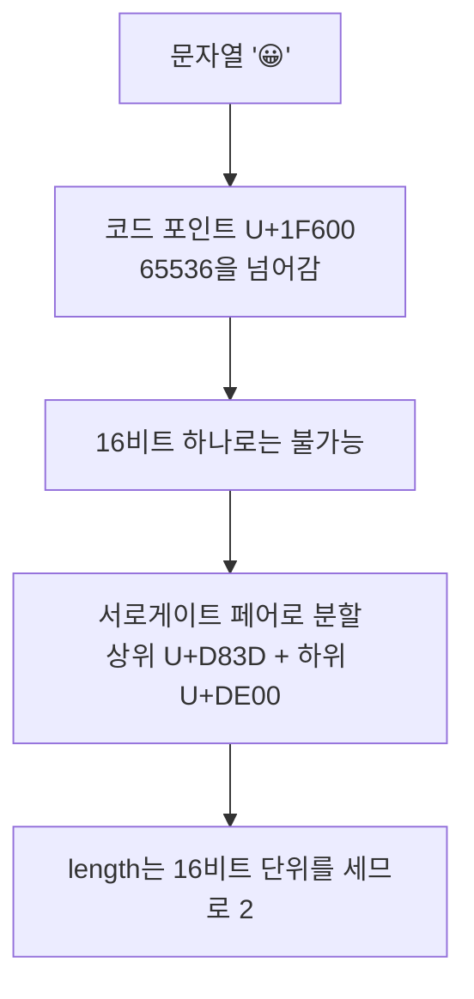

<Callout type="info">
  **이번 문서의 목표:** 문자열 불변성이 메서드 설계에 어떤 영향을 주는지 이해하고, 이모지나 한글 조합 문자에서 `length`와 `slice`가 왜 깨지는지 진단해 유니코드에 안전한 코드를 쓸 수 있게 된다.
</Callout>

## 1. 문자열은 절대 변하지 않는다

### 불변성의 증거

```js
const 인사 = "hello";
인사[0] = "H";
console.log(인사);   // "hello" — 바뀌지 않는다. 에러도 안 난다.
```

`const`라서가 아닙니다. `let`으로 선언해도 똑같습니다.

```js
let 인사2 = "hello";
인사2[0] = "H";
console.log(인사2);  // "hello"
```

**문자열 값 자체가 변경 불가능**하기 때문입니다. 이 성질을 **불변성**(immutability, 이뮤터빌리티)이라고 합니다. `im-`은 부정 접두사, `mutable`은 "변할 수 있는"이라는 뜻이므로 immutable은 "변할 수 없는"입니다.

15편에서 배운 래퍼 객체(wrapper object)를 떠올리면 왜 에러조차 나지 않는지 알 수 있습니다. `인사[0] = "H"`는 임시 래퍼 객체에 프로퍼티를 대입하는 것이고, 그 래퍼는 곧바로 사라집니다. 엄격 모드(strict mode)에서는 이마저도 `TypeError`로 막아 줍니다.

> **쉽게 말하면:** 문자열은 도장으로 찍어낸 글자입니다. 찍힌 글자를 고칠 수는 없고, 고치고 싶으면 **새 종이에 새로 찍는 수밖에** 없습니다.

### 불변성이 만든 규칙 — 모든 메서드는 새 문자열을 반환한다

배열에는 원본을 바꾸는 메서드(`push`, `sort`)와 안 바꾸는 메서드(`map`, `slice`)가 섞여 있었습니다. 문자열에는 **그런 구분이 아예 없습니다.**

```js
const 원본 = "Hello World";
const 대문자 = 원본.toUpperCase();
const 잘린것 = 원본.slice(0, 5);
const 바뀐것 = 원본.replace("World", "JS");

console.log(원본);     // "Hello World" — 무엇을 해도 원본은 그대로
console.log(대문자);   // "HELLO WORLD"
console.log(잘린것);   // "Hello"
console.log(바뀐것);   // "Hello JS"
```

**문자열 메서드는 예외 없이 전부 새 문자열을 반환합니다.** 그래서 "이 메서드가 원본을 바꾸나?"를 고민할 필요가 없습니다. 다만 **반환값을 받지 않으면 아무 일도 일어나지 않는다**는 실수는 여전히 흔합니다.

```js
let 문장 = "  공백 많음  ";
문장.trim();              // 반환값을 버렸다 — 아무 효과 없음
console.log(문장);        // "  공백 많음  "

문장 = 문장.trim();        // 이렇게 다시 대입해야 한다
```

### 불변성의 대가 — 반복 연결의 비용

문자열을 반복해서 이어붙이면 매번 새 문자열이 만들어집니다. 이론적으로는 요소 $n$개를 이을 때 총 복사량이 $n^2$에 비례해 커집니다.

```js
// 비효율적일 수 있는 방식
let 결과 = "";
for (const 단어 of 단어들) 결과 += 단어 + " ";

// 권장 방식 — 배열에 모았다가 한 번에 join
const 결과2 = 단어들.join(" ");
```

현대 엔진은 `+=` 연결을 내부적으로 최적화(rope 자료구조 등)하므로 대부분의 경우 체감 차이가 없습니다. 하지만 **의도를 드러낸다는 면에서 `join`이 더 나은 코드**입니다. "조각들을 모아 구분자로 잇는다"는 뜻이 한눈에 보이니까요.

## 2. 검색 — 무엇을 묻느냐에 따라 메서드가 다르다

| 알고 싶은 것 | 메서드 | 반환값 |
|--------------|--------|--------|
| 들어 있나? | `includes(찾을것)` | `true` / `false` |
| 어디에 있나? | `indexOf(찾을것)` | 인덱스 또는 `-1` |
| 마지막 위치는? | `lastIndexOf(찾을것)` | 인덱스 또는 `-1` |
| 이걸로 시작하나? | `startsWith(찾을것, 시작위치)` | `true` / `false` |
| 이걸로 끝나나? | `endsWith(찾을것, 끝위치)` | `true` / `false` |
| 패턴에 맞나? | `match`, `matchAll`, `search` | 21편의 정규표현식 |

```js
const 파일명 = "보고서_최종_v2.pdf";

console.log(파일명.includes("최종"));      // true
console.log(파일명.indexOf("최종"));       // 4
console.log(파일명.endsWith(".pdf"));      // true
console.log(파일명.startsWith("보고서"));   // true
```

<Callout type="warning">
  **자주 틀리는 점:** `if (문자열.indexOf("x"))`라고 쓰면 안 됩니다. 인덱스 0에서 찾았을 때 `0`은 거짓 같은 값(falsy)이라 조건이 거짓이 됩니다. 존재 여부만 알고 싶으면 **`includes`**를 쓰세요. `indexOf`를 써야 한다면 반드시 `!== -1`로 비교합니다. `includes`는 ES2015에 추가됐는데, 딱 이 실수를 없애려고 들어온 메서드입니다.
</Callout>

## 3. 추출 — slice, substring, substr의 삼국지

세 메서드가 비슷한 일을 하는데 미묘하게 다릅니다. 역사적 이유로 중복이 생긴 것이라 이유를 알면 선택이 쉬워집니다.

| 메서드 | 인수 의미 | 음수 인덱스 | 인수 순서가 반대면 |
|--------|----------|------------|-------------------|
| `slice(시작, 끝)` | 시작 인덱스, 끝 인덱스 | 뒤에서부터 셈 | 빈 문자열 반환 |
| `substring(시작, 끝)` | 시작 인덱스, 끝 인덱스 | 0으로 취급 | 자동으로 맞바꿈 |
| `substr(시작, 길이)` | 시작 인덱스, 길이 | 뒤에서부터 셈 | 해당 없음 |

```js
const 글자 = "JavaScript";

console.log(글자.slice(4));         // "Script"
console.log(글자.slice(0, 4));      // "Java"  — 끝 인덱스는 포함 안 됨
console.log(글자.slice(-6));        // "Script" — 뒤에서 6글자
console.log(글자.slice(4, 0));      // ""      — 순서가 반대면 빈 문자열

console.log(글자.substring(4, 0));  // "Java"  — 알아서 바꿔 준다
console.log(글자.substring(-6));    // "JavaScript" — 음수를 0으로 본다
```

**결론: `slice`를 쓰세요.** 이유는 세 가지입니다.

1. 배열의 `slice`와 인수 의미가 같아 헷갈리지 않습니다.
2. 음수 인덱스를 "뒤에서부터"로 자연스럽게 처리합니다.
3. `substr`은 명세의 부록 B(Annex B, 웹 호환성을 위해 남겨둔 폐기 예정 기능 모음)에 있는 **비권장 기능**입니다.

`substring`의 자동 맞바꿈은 친절해 보이지만 실은 위험합니다. 인수 순서를 잘못 넘긴 버그가 **에러 없이 그럴듯한 결과를 내며 숨어 버리기** 때문입니다.

### 위치로 한 글자 꺼내기

```js
const s = "hello";
console.log(s[0]);          // "h" — 범위 밖이면 undefined
console.log(s.charAt(0));   // "h" — 범위 밖이면 "" (빈 문자열)
console.log(s.at(-1));      // "o" — 음수 지원 (ES2022)
```

`at(-1)`은 마지막 글자를 꺼내는 가장 깔끔한 방법입니다. 그전에는 `s[s.length - 1]`을 써야 했습니다.

## 4. 변환과 치환

### 대소문자, 공백

```js
console.log("Hello".toLowerCase());     // "hello"
console.log("Hello".toUpperCase());     // "HELLO"
console.log("  가운데  ".trim());        // "가운데"
console.log("  가운데  ".trimStart());   // "가운데  "
console.log("  가운데  ".trimEnd());     // "  가운데"
console.log("5".padStart(3, "0"));      // "005" — 자릿수 맞추기
console.log("ab".padEnd(5, "."));       // "ab..."
console.log("하".repeat(3));            // "하하하"
```

`padStart`는 시각 표시(`"09:05"`)나 번호 매기기에서 자주 씁니다.

<Callout type="warning">
  **자주 틀리는 점:** `toLowerCase`로 문자열을 비교하면 언어에 따라 틀립니다. 터키어에서 대문자 I의 소문자는 점이 없는 문자라 영어와 다르게 변환됩니다. 사용자 입력을 비교할 때는 `toLocaleLowerCase()`를 쓰거나, 더 확실하게는 `localeCompare(다른값, undefined, { sensitivity: "base" })`로 비교하세요.
</Callout>

### replace와 replaceAll

```js
const 문장 = "고양이는 고양이다";

console.log(문장.replace("고양이", "개"));      // "개는 고양이다" — 첫 개만!
console.log(문장.replaceAll("고양이", "개"));   // "개는 개다"
console.log(문장.replace(/고양이/g, "개"));     // "개는 개다" — 옛 방식
```

`replace`가 **첫 번째 일치만 바꾼다**는 것이 가장 흔한 함정입니다. ES2021 이전에는 전역 플래그 `g`를 붙인 정규표현식(21편)을 써야 했고, 이제는 `replaceAll`이 있습니다.

두 번째 인수로 **함수**를 넘길 수도 있습니다. 정적인 문자열로는 불가능한 변환이 가능해집니다.

```js
const 가격표 = "사과 1000원, 배 2000원";
console.log(가격표.replace(/\d+/g, 숫자 => Number(숫자) * 2));
// "사과 2000원, 배 4000원"
```

### 분해와 결합

```js
const 목록 = "사과,배,감";
console.log(목록.split(","));        // ["사과", "배", "감"]
console.log(목록.split(",", 2));     // ["사과", "배"] — 개수 제한
console.log("abc".split(""));        // ["a", "b", "c"] — 한 글자씩
console.log("a b  c".split(/\s+/));  // ["a", "b", "c"] — 정규식 구분자

console.log(["사과", "배"].join(" / "));  // "사과 / 배"
```

`split("")`으로 한 글자씩 쪼개는 방식은 **유니코드에서 깨집니다.** 다음 절에서 이유를 봅니다.

## 5. 템플릿 리터럴 — 문법 이상의 것

### 기본 기능

```js
const 이름 = "지민";
const 나이 = 28;

console.log(`${이름}님은 ${나이}살, 내년엔 ${나이 + 1}살`);
console.log(`여러 줄도
그대로 줄바꿈됩니다`);
```

백틱(`` ` ``)으로 감싸고 `${}` 안에 **표현식**을 넣습니다. 문(statement)이 아니라 표현식이라는 점이 중요합니다 — `if` 문은 못 넣지만 삼항 연산자는 됩니다.

```js
const 점수 = 85;
console.log(`결과: ${점수 >= 60 ? "합격" : "불합격"}`);
```

`${}` 안의 값은 자동으로 문자열이 됩니다. 정확히는 5편의 `ToString` 추상 연산이 적용되며, 객체는 `toString()`을 거칩니다.

```js
console.log(`${[1, 2, 3]}`);     // "1,2,3" — 배열은 join(",")과 같다
console.log(`${{ a: 1 }}`);      // "[object Object]" — 객체는 이 꼴이 됨
console.log(`${null} ${undefined}`); // "null undefined"
```

### 태그드 템플릿 — 문자열을 가로채는 함수

여기서부터가 진짜 흥미로운 부분입니다. 템플릿 리터럴 앞에 **함수 이름을 붙이면**, 그 함수가 문자열 조립을 대신 맡습니다. 이를 **태그드 템플릿**(tagged template, 태그가 붙은 템플릿)이라고 합니다.

```js
function 태그(문자조각들, ...값들) {
  console.log(문자조각들);  // ["이름: ", ", 나이: ", ""]
  console.log(값들);        // ["지민", 28]
  return "가공된 결과";
}

const 결과 = 태그`이름: ${"지민"}, 나이: ${28}`;
```

- **첫 번째 인수**는 `${}`로 잘린 **문자 조각들의 배열**입니다. 조각 개수는 항상 값 개수보다 하나 많습니다(양 끝이 빈 문자열이라도).
- **나머지 인수들**은 `${}` 안 표현식들의 **평가 결과**입니다.

이 구조 덕분에 삽입되는 값을 **가로채서 검사하거나 변환**할 수 있습니다. 실무에서 쓰이는 대표적 용도가 **HTML 이스케이프**입니다.

```js
function 안전(조각들, ...값들) {
  return 조각들.reduce((결과, 조각, i) => {
    const 값 = 값들[i - 1];
    const 안전한값 = String(값)
      .replaceAll("&", "&amp;")
      .replaceAll("<", "&lt;")
      .replaceAll(">", "&gt;");
    return 결과 + 안전한값 + 조각;
  });
}
```

사용자가 입력한 스크립트 태그가 그대로 삽입되는 공격(XSS)을 태그 함수 하나로 막을 수 있습니다. 스타일드 컴포넌트, GraphQL 쿼리 등 여러 라이브러리가 이 문법을 쓰는 이유입니다.

## 6. 유니코드 — length가 거짓말하는 이유

### 왜 이 문제가 생기는가

```js
console.log("가".length);      // 1
console.log("a".length);       // 1
console.log("😀".length);      // 2  ← 글자 하나인데 2?
console.log("👨‍👩‍👧".length);   // 8  ← 가족 이모지 하나가 8?
```

이유를 이해하려면 **문자 인코딩의 역사**를 알아야 합니다.

**유니코드**(Unicode)는 세상 모든 문자에 고유한 번호를 붙인 표준입니다. 그 번호를 **코드 포인트**(code point)라고 하며 `U+0041`(A), `U+AC00`(가) 처럼 씁니다.

JavaScript가 만들어진 1995년, 유니코드는 문자가 **최대 65536개**(16비트로 표현 가능한 수)면 충분하다고 봤습니다. 그래서 JavaScript는 문자열을 **UTF-16**, 즉 **16비트 단위의 나열**로 저장하기로 했습니다.

그런데 문자가 65536개를 넘어섰습니다. 이모지, 고대 문자, 희귀 한자… 이들을 담으려면 16비트로는 부족합니다. 해결책은 **16비트 두 개를 짝지어 하나의 문자를 표현하는 것**이었고, 이 짝을 **서로게이트 페어**(surrogate pair, 대리 쌍)라고 부릅니다.



**`length`는 글자 수가 아니라 16비트 단위의 개수**입니다. 이것이 모든 유니코드 함정의 뿌리입니다.

### 무엇이 깨지는가

```js
const 이모지 = "😀";
console.log(이모지.length);        // 2
console.log(이모지[0]);            // "\uD83D" — 반쪽짜리, 깨진 문자
console.log(이모지.slice(0, 1));   // 깨진 문자
console.log(이모지.split(""));     // 반쪽 두 개
console.log([..."안녕😀"].length); // 3 — 스프레드는 제대로 센다!
```

**스프레드가 제대로 세는 이유**는 문자열의 `Symbol.iterator`(16편)가 **코드 포인트 단위로 순회**하도록 정의돼 있기 때문입니다. `for...of`, 스프레드, `Array.from`이 전부 이 이터레이터를 씁니다. 반면 `length`, 대괄호 인덱스, `slice`, `split("")`은 16비트 단위로 동작합니다.

| 안전한 방법 (코드 포인트 단위) | 위험한 방법 (16비트 단위) |
|-------------------------------|--------------------------|
| `[...문자열]` | `문자열.split("")` |
| `Array.from(문자열)` | `문자열.length` |
| `for...of` 순회 | `for` 문 + 인덱스 |
| `codePointAt(i)` | `charCodeAt(i)` |
| `String.fromCodePoint(n)` | `String.fromCharCode(n)` |

### 그마저도 부족한 경우 — 결합 문자

서로게이트 페어를 해결해도 끝이 아닙니다.

```js
console.log([..."👨‍👩‍👧"].length);   // 5 — 스프레드로도 1이 아니다
console.log([..."한"].length);      // 1 또는 2 — 입력 방식에 따라!
```

가족 이모지는 사람 이모지 세 개를 **ZWJ**(Zero Width Joiner, 폭 없는 결합 문자)로 이어 붙인 것입니다. 눈에는 하나로 보이지만 **여러 코드 포인트의 조합**입니다.

한글도 마찬가지입니다. "한"은 완성형 코드 포인트 하나로도 쓸 수 있고, 초성 ㅎ + 중성 ㅏ + 종성 ㄴ의 조합형으로도 쓸 수 있습니다. 눈에는 같아 보이지만 `===` 비교가 `false`입니다.

```js
const 완성형 = "한";                 // 완성형 "한" 코드 포인트 하나
const 조합형 = "한";  // 초성 + 중성 + 종성 세 개
console.log(완성형, 조합형);            // 둘 다 화면에는 한 으로 보인다
console.log(완성형.length, 조합형.length);  // 1  3
console.log(완성형 === 조합형);                  // false
console.log(완성형.normalize() === 조합형.normalize()); // true
```

`normalize()` 메서드는 이런 표현 차이를 표준 형식으로 통일해 줍니다. macOS는 파일 이름에 조합형을, Windows는 완성형을 쓰는 경향이 있어 **두 OS 사이에서 파일명 비교가 실패하는 유명한 버그**의 해법이기도 합니다.

사람이 인식하는 "글자 하나"를 정확히 세려면 `Intl.Segmenter`를 씁니다.

```js
const 분절기 = new Intl.Segmenter("ko", { granularity: "grapheme" });
console.log([...분절기.segment("👨‍👩‍👧 한글")].length);  // 사람 기준 글자 수
```

### 실험 — 유니코드 함정 전부 확인하기

<CodePlayground
  template="vanilla"
  activeFile="/index.js"
  showConsole
  label="이모지와 한글에서 문자열 메서드가 어떻게 깨지는지"
  files={{
    '/index.js': `console.log("=== 1. length는 글자 수가 아니다 ===");
["a", "가", "😀", "👨‍👩‍👧", "é"].forEach(s => {
  console.log(\`"\${s}" length=\${s.length} 스프레드=\${[...s].length}\`);
});

console.log("=== 2. 인덱스 접근이 문자를 반으로 쪼갠다 ===");
const 이모지 = "안녕😀하세요";
console.log("전체:", 이모지, "length:", 이모지.length);
console.log("slice(0,3):", 이모지.slice(0, 3));   // 😀의 앞 반쪽까지
console.log("slice(0,4):", 이모지.slice(0, 4));   // 온전한 😀
console.log("split(''):", 이모지.split("").length, "조각");
console.log("스프레드:", [...이모지].length, "조각");

console.log("=== 3. 안전하게 자르기 ===");
function 안전하게자르기(문자열, 개수) {
  return [...문자열].slice(0, 개수).join("");
}
console.log("위험:", 이모지.slice(0, 3));
console.log("안전:", 안전하게자르기(이모지, 3));

console.log("=== 4. 뒤집기가 깨지는 고전 사례 ===");
console.log("split 방식:", 이모지.split("").reverse().join(""));
console.log("스프레드 방식:", [...이모지].reverse().join(""));

console.log("=== 5. 코드 포인트 직접 보기 ===");
console.log("charCodeAt(0):", "😀".charCodeAt(0).toString(16));   // d83d — 반쪽
console.log("codePointAt(0):", "😀".codePointAt(0).toString(16)); // 1f600 — 전체
console.log("fromCodePoint:", String.fromCodePoint(0x1f600));

console.log("=== 6. 겉보기가 같은데 다른 문자열 ===");
const 완성형 = "한";
const 조합형 = "\\u1112\\u1161\\u11AB";
console.log("보이는 모습:", 완성형, 조합형);
console.log("길이:", 완성형.length, 조합형.length);
console.log("=== 비교:", 완성형 === 조합형);
console.log("normalize 후:", 완성형.normalize() === 조합형.normalize());

console.log("=== 7. 사람 기준 글자 수 세기 ===");
const 분절기 = new Intl.Segmenter("ko", { granularity: "grapheme" });
const 대상 = "👨‍👩‍👧 한글";
console.log("length:", 대상.length);
console.log("스프레드:", [...대상].length);
console.log("Segmenter:", [...분절기.segment(대상)].length);

// [바꿔보기] 2번에서 slice(0, 3)을 slice(0, 5)로 바꾸면 어떻게 되나요?
// [바꿔보기] 4번에 한글 조합형을 넣고 뒤집으면 어떤 결과가 나오나요?`,
  }}
/>

<Callout type="warning">
  **자주 틀리는 점 정리**

  1. **글자 수 세기**: `문자열.length`는 16비트 단위 수입니다. 사람이 세는 글자 수가 필요하면 `[...문자열].length`(코드 포인트) 또는 `Intl.Segmenter`(그래핌)를 쓰세요.
  2. **자르기**: `slice`로 자르면 이모지가 반쪽으로 깨져 깨진 문자가 화면에 나옵니다. 미리보기 텍스트 자르기 같은 곳에서 자주 터집니다.
  3. **뒤집기**: `split("").reverse().join("")`은 유니코드를 파괴합니다. 최소한 스프레드를 쓰세요.
  4. **비교**: 겉보기가 같아도 `===`가 `false`일 수 있습니다. 사용자 입력을 비교하기 전에 `normalize()`를 거치세요.
</Callout>

## 핵심 정리

- 문자열은 **불변**이다. 인덱스 대입은 에러 없이 무시되고, 모든 메서드는 예외 없이 **새 문자열을 반환**한다. 반환값을 받지 않으면 아무 일도 일어나지 않는다.
- 존재 여부는 `includes`, 위치는 `indexOf`. `indexOf`의 0이 falsy라는 점 때문에 조건문에 그대로 쓰면 안 된다.
- 추출은 **`slice`를 표준으로** 쓴다. `substring`은 인수를 자동으로 맞바꿔 버그를 숨기고, `substr`은 폐기 예정이다.
- `replace`는 **첫 일치만** 바꾼다. 전부 바꾸려면 `replaceAll` 또는 `g` 플래그. 두 번째 인수로 함수를 넘기면 동적 치환이 가능하다.
- **태그드 템플릿**은 문자 조각 배열과 값 배열을 함수가 받아 조립을 대신하는 문법으로, HTML 이스케이프 같은 안전 장치를 만들 수 있다.
- **`length`는 글자 수가 아니라 16비트 단위 수**다. 이모지는 서로게이트 페어라 2, 결합 이모지는 더 크다. 순회는 스프레드나 `for...of`로, 사람 기준 글자는 `Intl.Segmenter`로, 겉보기가 같은 문자열 비교는 `normalize()` 후에 한다.

## 마무리 복습

<Quiz
  questionNumber={1}
  question="문자열의 인덱스에 값을 대입해도 아무 일이 일어나지 않는 이유는?"
  options={['const로 선언했기 때문', '문자열 값이 불변이며 대입은 곧 소멸할 임시 래퍼 객체에 이루어지기 때문', '인덱스가 0부터 시작하지 않기 때문', '대입 연산자가 문자열을 지원하지 않기 때문']}
  correctAnswer={2}
  explanation="문자열은 값 자체가 변경 불가능하다. 점이나 대괄호로 접근하는 순간 임시 래퍼 객체가 만들어지고 대입은 그 래퍼에 이루어지는데, 래퍼는 표현식이 끝나면 사라지므로 흔적이 남지 않는다. let으로 선언해도 결과는 같다."
  optionExplanations={['let으로 선언해도 동일하게 무시된다', '정답 — 불변성과 래퍼 객체가 함께 만든 결과다', '문자열 인덱스도 0부터 시작한다', '대입 연산 자체는 정상적으로 수행되고 버려질 뿐이다']}
/>

<Quiz
  questionNumber={2}
  question="문자열 추출에 substring보다 slice를 권장하는 이유로 옳지 않은 것은?"
  options={['배열의 slice와 인수 의미가 같아 일관성이 있다', '음수 인덱스를 뒤에서부터 세는 방식으로 지원한다', '인수 순서가 잘못되었을 때 자동으로 맞바꿔 주어 버그를 예방한다', '인수 순서가 잘못되면 빈 문자열을 반환해 실수가 드러난다']}
  correctAnswer={3}
  explanation="인수를 자동으로 맞바꾸는 쪽은 substring이며, 이는 장점이 아니라 잘못된 인수 순서를 에러 없이 감춰 버리는 단점이다. slice는 빈 문자열을 반환해 실수가 드러난다."
  optionExplanations={['배열 slice와 동일해 인지 부담이 적다', 'slice의 실제 장점이다', '정답(slice의 특징 아님) — 그것은 substring의 동작이며 버그를 숨긴다', 'slice의 실제 동작이자 장점이다']}
/>

<Quiz
  questionNumber={3}
  question="이모지 한 글자의 length가 2인 이유는?"
  options={['이모지는 항상 두 글자로 저장되도록 정해져 있기 때문', 'JS 문자열이 UTF-16 기반이라 코드 포인트가 65536을 넘는 문자는 서로게이트 페어 두 단위로 저장되기 때문', 'length가 바이트 수를 세기 때문', '이모지에 항상 결합 문자가 붙기 때문']}
  correctAnswer={2}
  explanation="JS 문자열은 16비트 단위의 나열이고 length는 그 단위 수를 센다. 코드 포인트가 16비트로 표현할 수 없는 범위의 문자는 상위와 하위 두 개의 서로게이트로 나뉘어 저장되므로 length가 2가 된다."
  optionExplanations={['이모지라서가 아니라 코드 포인트 크기 때문이다', '정답 — UTF-16과 서로게이트 페어가 원인이다', 'length는 바이트가 아니라 16비트 단위 수를 센다', '결합 문자는 가족 이모지처럼 별개의 사례다']}
/>

<Quiz
  questionNumber={4}
  question="이모지가 포함된 문자열을 사람이 보는 글자 단위로 안전하게 순회하는 방법은?"
  options={['문자열을 split 빈 문자열로 쪼갠다', 'for 문과 대괄호 인덱스로 접근한다', '스프레드 문법이나 for...of로 순회한다', 'charCodeAt으로 하나씩 읽는다']}
  correctAnswer={3}
  explanation="문자열의 Symbol.iterator는 코드 포인트 단위로 순회하도록 정의되어 있어 서로게이트 페어를 온전한 한 글자로 다룬다. 스프레드, for...of, Array.from이 모두 이 이터레이터를 사용한다. 반면 split 빈 문자열과 인덱스 접근은 16비트 단위로 쪼갠다."
  optionExplanations={['서로게이트를 반으로 쪼개 깨진 문자를 만든다', '대괄호 인덱스는 16비트 단위 접근이다', '정답 — 이터레이터가 코드 포인트 단위로 동작한다', 'charCodeAt은 16비트 값을 반환해 반쪽만 읽는다']}
/>

<Quiz
  questionNumber={5}
  question="replace에 대한 설명으로 옳은 것은?"
  options={['모든 일치 항목을 한 번에 치환한다', '문자열을 첫 번째 인수로 주면 첫 번째 일치만 치환한다', '원본 문자열을 직접 수정한다', '두 번째 인수로 함수를 넘길 수 없다']}
  correctAnswer={2}
  explanation="replace에 문자열을 넘기면 첫 번째 일치만 바뀐다. 전부 바꾸려면 replaceAll을 쓰거나 전역 플래그가 붙은 정규표현식을 넘겨야 한다. 문자열 메서드이므로 원본은 변경되지 않고 새 문자열이 반환된다."
  optionExplanations={['전부 치환하는 것은 replaceAll이나 g 플래그다', '정답 — 가장 흔한 함정 중 하나다', '문자열은 불변이므로 원본은 변하지 않는다', '함수를 넘겨 동적 치환이 가능하다']}
/>

<Quiz
  questionNumber={6}
  question="태그드 템플릿에서 태그 함수가 받는 첫 번째 인수는?"
  options={['템플릿 안 표현식들의 평가 결과 배열', '값 자리로 잘린 문자 조각들의 배열', '조립이 끝난 완성된 문자열', '템플릿 리터럴 원본 소스 코드 문자열']}
  correctAnswer={2}
  explanation="첫 번째 인수는 값 자리를 기준으로 잘린 문자 조각들의 배열이고, 두 번째 인수부터는 각 표현식의 평가 결과가 차례로 전달된다. 조각 개수는 항상 값 개수보다 하나 많다."
  optionExplanations={['평가 결과는 두 번째 인수부터 전달된다', '정답 — 조각 배열과 값들을 함수가 직접 조립한다', '조립을 함수가 대신하므로 완성 문자열은 전달되지 않는다', '소스 코드가 아니라 잘린 조각들이다']}
/>

<Quiz
  questionNumber={7}
  question="화면에 똑같이 보이는 두 한글 문자열의 === 비교가 false일 때의 원인과 해법으로 옳은 것은?"
  options={['한글은 비교할 수 없으므로 localeCompare만 써야 한다', '완성형과 조합형처럼 코드 포인트 구성이 달라서이며 normalize로 통일한 뒤 비교한다', '문자열 길이가 달라서이며 trim으로 해결한다', '대소문자 차이 때문이며 toLowerCase로 해결한다']}
  correctAnswer={2}
  explanation="같은 글자를 완성형 코드 포인트 하나로 표현할 수도 있고 자모 조합으로 표현할 수도 있어 코드 포인트 구성이 달라진다. normalize를 호출해 표준 형식으로 통일하면 비교가 정상 동작한다. macOS와 Windows의 파일명 비교 문제도 같은 원인이다."
  optionExplanations={['한글도 === 비교가 가능하며 정규화가 관건이다', '정답 — 유니코드 정규화가 해법이다', '공백 문제가 아니라 표현 방식의 차이다', '한글에는 대소문자가 없다']}
/>

## 참고 자료

- [MDN - String](https://developer.mozilla.org/en-US/docs/Web/JavaScript/Reference/Global_Objects/String)
- [MDN - Template literals](https://developer.mozilla.org/en-US/docs/Web/JavaScript/Reference/Template_literals)
- [MDN - String.prototype.normalize](https://developer.mozilla.org/en-US/docs/Web/JavaScript/Reference/Global_Objects/String/normalize)
- [MDN - Intl.Segmenter](https://developer.mozilla.org/en-US/docs/Web/JavaScript/Reference/Global_Objects/Intl/Segmenter)
