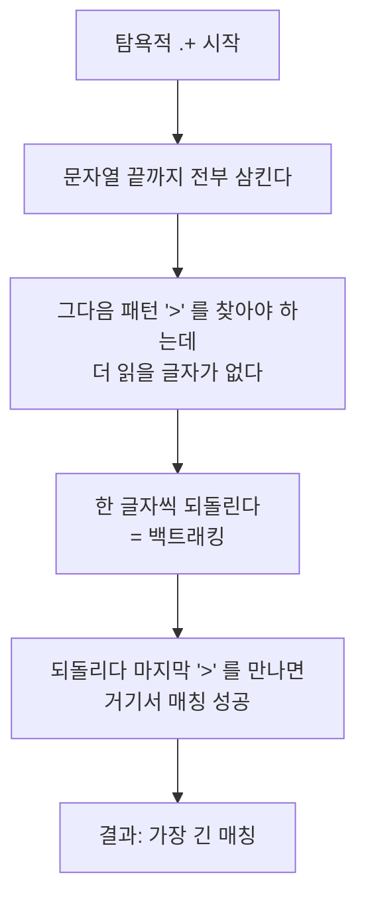
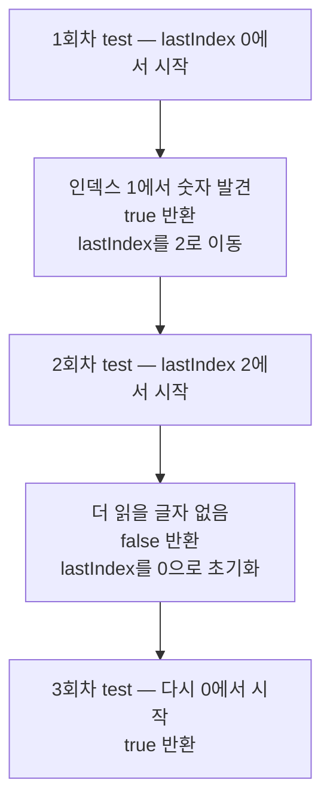

<Callout type="info">
  **이번 문서의 목표:** 처음 보는 정규식을 조각으로 분해해 읽을 수 있고, 이메일·전화번호 같은 실전 패턴을 직접 설계하며, `g` 플래그와 `lastIndex`가 만드는 유명한 버그를 진단할 수 있게 된다.
</Callout>

## 1. 왜 정규표현식인가

전화번호가 올바른 형식인지 검사하는 코드를 정규식 없이 써 봅시다.

```js
function 전화번호인가(값) {
  const 조각 = 값.split("-");
  if (조각.length !== 3) return false;
  if (조각[0].length !== 3) return false;
  if (조각[1].length < 3 || 조각[1].length > 4) return false;
  if (조각[2].length !== 4) return false;
  return 조각.every(c => [...c].every(글자 => 글자 >= "0" && 글자 <= "9"));
}
```

7줄이고, 조건 하나만 바뀌어도 여러 줄을 고쳐야 합니다. 같은 일을 정규식으로 쓰면 이렇습니다.

```js
const 전화번호 = /^\d{3}-\d{3,4}-\d{4}$/;
console.log(전화번호.test("010-1234-5678"));  // true
```

**정규표현식**(regular expression, 정규식)은 **문자열의 패턴을 기술하는 작은 언어**입니다. JavaScript 안에 들어 있는 또 하나의 언어라고 봐도 좋습니다. 문법이 낯설어 암호처럼 보이지만, **조각으로 나눠 읽으면 자연어 문장으로 번역됩니다.**

위 패턴을 번역해 보겠습니다.

| 조각 | 뜻 |
|------|-----|
| `^` | 문자열이 여기서 시작해서 |
| `\d` | 숫자 한 글자가 |
| `{3}` | 정확히 3개 |
| `-` | 그다음 하이픈 하나 |
| `\d{3,4}` | 숫자 3개 또는 4개 |
| `-` | 하이픈 하나 |
| `\d{4}` | 숫자 4개 |
| `$` | 그리고 문자열이 끝난다 |

> **쉽게 말하면:** 정규식은 문자열을 찾을 때 쓰는 **수배 전단**입니다. "키 180 이상, 검은 옷, 모자 착용"처럼 조건을 적어 두면, 엔진이 그 조건에 맞는 사람을 찾아 줍니다.

## 2. 만들기와 기본 메서드

### 두 가지 생성 방법

```js
const 리터럴 = /고양이/g;                     // 정규식 리터럴
const 생성자 = new RegExp("고양이", "g");      // 생성자 함수
const 변수로 = new RegExp(`^${검색어}$`, "i"); // 패턴이 동적일 때
```

리터럴이 기본입니다. 슬래시(`/`) 사이에 패턴을 쓰고, 닫는 슬래시 뒤에 **플래그**(flag, 깃발)를 붙입니다. 패턴을 **변수로 조립해야 할 때만** 생성자를 씁니다. 생성자를 쓸 때는 백슬래시를 두 번 써야 한다는 점에 주의하세요 — 문자열 안에서 `\d`는 `\\d`로 써야 정규식에 `\d`가 전달됩니다.

### 플래그

| 플래그 | 이름 | 하는 일 |
|--------|------|---------|
| `g` | global | 첫 일치에서 멈추지 않고 전부 찾는다 |
| `i` | ignore case | 대소문자를 구분하지 않는다 |
| `m` | multiline | `^`와 `$`가 각 줄의 시작·끝에도 맞는다 |
| `s` | dotAll | `.`이 줄바꿈 문자에도 맞는다 |
| `u` | unicode | 유니코드 코드 포인트 단위로 다룬다 |
| `y` | sticky | `lastIndex` 위치에서만 정확히 맞춘다 |
| `d` | indices | 일치 위치의 시작·끝 인덱스를 함께 준다 |

### 메서드 선택 기준

정규식으로 뭔가를 하는 메서드는 `RegExp` 쪽에 둘, `String` 쪽에 다섯 개가 있습니다. **무엇을 알고 싶은가**로 고르면 됩니다.

| 알고 싶은 것 | 메서드 | 반환값 |
|--------------|--------|--------|
| 맞는 게 있나 | `정규식.test(문자열)` | `true` / `false` |
| 어디에 있나 | `문자열.search(정규식)` | 인덱스 또는 `-1` |
| 무엇이 맞았나 (하나) | `문자열.match(정규식)` | 일치 정보 배열 |
| 무엇이 맞았나 (전부, 그룹 포함) | `문자열.matchAll(정규식)` | 이터레이터 |
| 바꾸기 | `문자열.replace` / `replaceAll` | 새 문자열 |
| 쪼개기 | `문자열.split(정규식)` | 배열 |
| 반복해서 하나씩 | `정규식.exec(문자열)` | 일치 정보 또는 `null` |

<Callout type="warning">
  **자주 틀리는 점:** `match`는 `g` 플래그 유무에 따라 **반환 구조가 완전히 달라집니다.**

  - `g` 없음 → 첫 일치의 **상세 정보** (캡처 그룹, `index`, `input` 포함)
  - `g` 있음 → 일치한 **문자열들만 담긴 단순 배열** (그룹 정보 없음!)

  전부 찾으면서 그룹 정보도 필요하면 `matchAll`을 쓰세요. 이 혼란을 없애려고 ES2020에 추가된 메서드입니다.
</Callout>

## 3. 패턴 문법 해부

### 문자 클래스 — 어떤 종류의 글자인가

**문자 클래스**(character class)는 "이 자리에 올 수 있는 글자의 집합"을 뜻합니다.

| 표기 | 뜻 | 같은 의미 |
|------|-----|-----------|
| `[abc]` | a 또는 b 또는 c | – |
| `[a-z]` | 소문자 하나 | – |
| `[0-9]` | 숫자 하나 | `\d` |
| `[^abc]` | a, b, c가 아닌 글자 | – |
| `\d` | 숫자 | `[0-9]` |
| `\D` | 숫자가 아닌 것 | `[^0-9]` |
| `\w` | 단어 문자 – 영문자, 숫자, 밑줄 | `[A-Za-z0-9_]` |
| `\W` | 단어 문자가 아닌 것 | – |
| `\s` | 공백류 – 스페이스, 탭, 줄바꿈 | – |
| `\S` | 공백이 아닌 것 | – |
| `.` | 줄바꿈을 제외한 아무 글자 | – |

두 가지 규칙만 기억하면 절반은 외운 셈입니다.

1. **대문자는 부정**입니다. `\d`가 숫자면 `\D`는 숫자 아닌 것, `\w`가 단어 문자면 `\W`는 그 반대입니다.
2. **대괄호 안 맨 앞의 `^`는 부정**입니다. 대괄호 밖의 `^`는 "시작"이지만 안에서는 뜻이 다릅니다.

<Callout type="warning">
  **자주 틀리는 점:** `\w`는 **영문자만** 포함합니다. `"한글"`은 `\w`에 맞지 않습니다. 한글을 다루려면 문자 클래스로 범위를 직접 쓰거나(`[가-힣]`), 유니코드 속성 이스케이프를 씁니다.

  ```js
  console.log(/^\w+$/.test("hello"));   // true
  console.log(/^\w+$/.test("한글"));     // false!
  console.log(/^[가-힣]+$/.test("한글")); // true
  console.log(/^\p{Script=Hangul}+$/u.test("한글")); // true (u 플래그 필수)
  ```
</Callout>

### 수량자 — 몇 번 반복되는가

| 표기 | 뜻 |
|------|-----|
| `?` | 0개 또는 1개 – 있어도 되고 없어도 됨 |
| `*` | 0개 이상 – 없어도 됨 |
| `+` | 1개 이상 – 최소 하나는 있어야 함 |
| `{n}` | 정확히 n개 |
| `{n,}` | n개 이상 |
| `{n,m}` | n개 이상 m개 이하 |

`*`와 `+`의 차이를 정확히 알아야 합니다. `\d*`는 숫자가 하나도 없어도 통과하지만 `\d+`는 최소 하나를 요구합니다. 빈 입력이 검증을 통과해 버리는 버그의 단골 원인입니다.

### 탐욕적 매칭과 게으른 매칭

수량자는 기본적으로 **탐욕적**(greedy, 그리디)입니다. **가능한 한 많이** 먹으려 듭니다.

```js
const html = "<b>굵게</b> 그리고 <i>기울임</i>";

console.log(html.match(/<.+>/)[0]);
// "<b>굵게</b> 그리고 <i>기울임</i>"  ← 전부 먹었다

console.log(html.match(/<.+?>/)[0]);
// "<b>"  ← 최소한만 먹었다
```

수량자 뒤에 `?`를 붙이면 **게으른**(lazy, 레이지) 또는 비탐욕적 매칭이 되어 **가능한 한 적게** 먹습니다. `+?`, `*?`, `{2,5}?` 전부 가능합니다.

이 차이가 왜 생기는지는 **매칭 엔진의 동작**을 봐야 이해됩니다.



이 되돌리는 과정을 **백트래킹**(backtracking, 역추적)이라고 합니다. 엔진은 "일단 최대한 먹고, 안 되면 하나씩 뱉으며 재시도"합니다. 게으른 매칭은 반대로 "일단 최소로 먹고, 안 되면 하나씩 더 먹으며 재시도"합니다.

<Callout type="warning">
  **자주 틀리는 점 – 치명적 백트래킹**: 중첩된 수량자는 백트래킹 경우의 수를 폭발시킵니다.

  ```js
  // 위험한 패턴 — (a+)+ 처럼 수량자 안에 수량자
  const 위험 = /^(a+)+$/;
  위험.test("aaaaaaaaaaaaaaaaaaaaaaaaaaaaX");  // 사실상 멈추지 않음
  ```

  입력 길이에 따라 시도 횟수가 지수적으로 늘어나 서버가 멈춥니다. 이를 노린 공격이 **ReDoS**(Regular expression Denial of Service, 정규식을 이용한 서비스 거부)입니다. 사용자 입력을 검사하는 정규식에는 중첩 수량자를 쓰지 말고, 가능하면 문자 클래스를 좁게 잡으세요.
</Callout>

### 위치를 뜻하는 기호 — 앵커

| 표기 | 뜻 |
|------|-----|
| `^` | 문자열의 시작 – `m` 플래그가 있으면 각 줄의 시작 |
| `$` | 문자열의 끝 – `m` 플래그가 있으면 각 줄의 끝 |
| `\b` | 단어 경계 – 단어 문자와 비단어 문자 사이 |
| `\B` | 단어 경계가 아닌 곳 |

**앵커**(anchor, 닻)는 글자를 소비하지 않고 **위치만 가리킵니다.** 이 성질이 중요합니다.

```js
console.log(/^\d+$/.test("123"));      // true  — 전체가 숫자여야
console.log(/^\d+$/.test("123abc"));   // false
console.log(/\d+/.test("123abc"));     // true  — 앵커가 없으면 일부만 맞아도 통과
```

`test`로 형식을 검증할 때 **앵커를 빠뜨리면 부분 일치로 통과해 버립니다.** 유효성 검사 정규식에는 거의 항상 `^`와 `$`가 필요합니다.

`\b`는 단어 단위 검색에 씁니다.

```js
const 글 = "cat category concat";
console.log(글.replace(/cat/g, "X"));    // "X Xegory conX"  — 원치 않는 치환
console.log(글.replace(/\bcat\b/g, "X")); // "X category concat" — 단어만
```

### 그룹과 캡처

소괄호는 두 가지 일을 합니다. **묶기**와 **기억하기**입니다.

```js
console.log(/^(ab)+$/.test("ababab"));  // true — ab 전체를 묶어서 반복

const 날짜 = "2026-08-30";
const 결과 = 날짜.match(/(\d{4})-(\d{2})-(\d{2})/);
console.log(결과[0]);  // "2026-08-30" — 전체 일치
console.log(결과[1]);  // "2026" — 첫 번째 그룹
console.log(결과[2]);  // "08"
```

`match`의 결과 배열은 **0번이 전체 일치, 1번부터가 캡처 그룹**입니다.

그룹이 많아지면 번호를 세는 게 고통스러워집니다. **이름 붙은 그룹**(named capture group)을 쓰면 해결됩니다.

```js
const 결과2 = "2026-08-30".match(/(?<년>\d{4})-(?<월>\d{2})-(?<일>\d{2})/);
console.log(결과2.groups.년);  // "2026"
console.log(결과2.groups.월);  // "08"
```

묶기만 하고 기억은 필요 없다면 **비캡처 그룹** `(?:...)`을 씁니다. 캡처를 줄이면 성능도 좋아지고 그룹 번호도 흐트러지지 않습니다.

```js
console.log("2026-08".match(/(?:20)(\d{2})-(\d{2})/)[1]);  // "26" — (?:20)은 세지 않음
```

### 전방 탐색과 후방 탐색

**전방 탐색**(lookahead)은 "뒤에 이것이 오는(또는 오지 않는) 자리"를 뜻하되, **그 부분을 소비하지 않습니다.**

| 표기 | 이름 | 뜻 |
|------|------|-----|
| `X(?=Y)` | 긍정 전방 탐색 | 뒤에 Y가 오는 X |
| `X(?!Y)` | 부정 전방 탐색 | 뒤에 Y가 오지 않는 X |
| `(?<=Y)X` | 긍정 후방 탐색 | 앞에 Y가 있는 X |
| `(?<!Y)X` | 부정 후방 탐색 | 앞에 Y가 없는 X |

```js
console.log("100원 200달러".match(/\d+(?=원)/g));    // ["100"] — 원 앞의 숫자만
console.log("100원 200달러".match(/\d+(?!원)/g));    // ["10", "200"] — 주의!
console.log("$50 €70".match(/(?<=\$)\d+/g));        // ["50"] — 달러 뒤 숫자만
```

두 번째 줄의 `["10", "200"]`이 의외입니다. `100`의 `10`까지는 "뒤에 원이 안 오는 숫자열"이라 통과하기 때문입니다. 부정 전방 탐색은 이렇게 직관을 벗어나는 경우가 많아, 결과를 반드시 실험으로 확인해야 합니다.

전방 탐색의 실전 용도는 **비밀번호 규칙 검사**입니다.

```js
// 8자 이상, 영문/숫자/특수문자를 각각 하나 이상 포함
const 비밀번호 = /^(?=.*[A-Za-z])(?=.*\d)(?=.*[!@#$%^&*]).{8,}$/;
```

조건마다 전방 탐색을 하나씩 붙이는 구조입니다. 전방 탐색은 글자를 소비하지 않으므로 **같은 위치에서 여러 조건을 겹쳐 검사**할 수 있습니다. 정규식만으로 다중 조건 검증이 가능한 이유입니다.

## 4. lastIndex — 가장 악명 높은 버그

### 재현

```js
const 패턴 = /\d/g;

console.log(패턴.test("a1"));  // true
console.log(패턴.test("a1"));  // false  ← 같은 코드인데 결과가 다르다!
console.log(패턴.test("a1"));  // true   ← 다시 true
```

**같은 함수를 같은 인수로 세 번 불렀는데 결과가 다릅니다.** 순수 함수라면 있을 수 없는 일이죠.

### 원인

`g`(또는 `y`) 플래그가 붙은 정규식 객체는 **`lastIndex`라는 상태를 들고 다닙니다.** `test`와 `exec`는 이 위치에서 검색을 시작하고, 찾으면 그 다음 위치로 `lastIndex`를 옮깁니다.

```js
const 패턴 = /\d/g;
console.log(패턴.lastIndex);   // 0
패턴.test("a1");
console.log(패턴.lastIndex);   // 2 — 찾은 뒤 다음 위치로 이동
패턴.test("a1");               // 인덱스 2부터 찾으니 없음 → false
console.log(패턴.lastIndex);   // 0 — 실패하면 0으로 초기화
```

이 상태 때문에 **정규식 객체를 재사용하면 결과가 호출 순서에 의존**하게 됩니다.



### 해법

1. **검사용 정규식에는 `g`를 붙이지 않는다.** `test`로 형식만 검사할 때 `g`는 아무 이득이 없습니다.
2. **매번 새 정규식을 만든다.** 함수 안에서 리터럴을 쓰면 호출마다 새 객체가 만들어져 상태가 초기화됩니다.
3. **`lastIndex`를 직접 0으로 되돌린다.** 재사용이 불가피할 때의 방법입니다.
4. **`matchAll`을 쓴다.** 내부적으로 정규식을 복제하므로 원본의 `lastIndex`를 건드리지 않습니다.

<Callout type="warning">
  **자주 틀리는 점:** 정규식을 모듈 최상위에 `const 이메일패턴 = /.../g`처럼 상수로 두고 여러 곳에서 `test`를 부르는 코드는 **재현하기 어려운 간헐적 버그**를 만듭니다. 같은 입력에 대해 어떤 때는 통과하고 어떤 때는 실패하죠. 상수로 둘 거라면 `g` 플래그를 빼세요.
</Callout>

### 실험 — 정규식의 함정 종합

<CodePlayground
  template="vanilla"
  activeFile="/index.js"
  showConsole
  label="lastIndex, 탐욕적 매칭, 캡처 그룹을 직접 확인하기"
  files={{
    '/index.js': `console.log("=== 1. lastIndex 버그 재현 ===");
const 전역패턴 = /\\d/g;
console.log("1회:", 전역패턴.test("a1"), "lastIndex:", 전역패턴.lastIndex);
console.log("2회:", 전역패턴.test("a1"), "lastIndex:", 전역패턴.lastIndex);
console.log("3회:", 전역패턴.test("a1"), "lastIndex:", 전역패턴.lastIndex);

const 안전패턴 = /\\d/;    // g 없음
console.log("g 없이 1회:", 안전패턴.test("a1"));
console.log("g 없이 2회:", 안전패턴.test("a1"));

console.log("=== 2. 탐욕적 vs 게으른 ===");
const 태그문자열 = "[굵게] 그리고 [기울임]";
console.log("탐욕적:", 태그문자열.match(/\\[.+\\]/)[0]);
console.log("게으른:", 태그문자열.match(/\\[.+?\\]/)[0]);
console.log("전부(게으른+g):", 태그문자열.match(/\\[.+?\\]/g));

console.log("=== 3. 앵커를 빠뜨리면 ===");
console.log("앵커 있음, 정상 입력:", /^\\d{3}$/.test("123"));
console.log("앵커 있음, 이상 입력:", /^\\d{3}$/.test("abc123xyz"));
console.log("앵커 없음, 이상 입력:", /\\d{3}/.test("abc123xyz"), "<- 통과해 버림");

console.log("=== 4. match와 matchAll의 차이 ===");
const 로그 = "2026-08-30 오류, 2026-09-01 경고";
console.log("g 없는 match:", 로그.match(/(\\d{4})-(\\d{2})-(\\d{2})/));
console.log("g 있는 match:", 로그.match(/(\\d{4})-(\\d{2})-(\\d{2})/g));
for (const m of 로그.matchAll(/(?<년>\\d{4})-(?<월>\\d{2})-(?<일>\\d{2})/g)) {
  console.log("  matchAll:", m[0], "년:", m.groups.년, "월:", m.groups.월, "위치:", m.index);
}

console.log("=== 5. replace에 함수 넘기기 ===");
const 가격 = "노트북 1200000원, 마우스 30000원";
console.log(가격.replace(/\\d+/g, n => Number(n).toLocaleString()));
console.log(
  "2026-08-30".replace(/(?<년>\\d+)-(?<월>\\d+)-(?<일>\\d+)/, "$<년>년 $<월>월 $<일>일")
);

console.log("=== 6. 전방 탐색으로 다중 조건 ===");
const 비번규칙 = /^(?=.*[A-Za-z])(?=.*\\d)(?=.*[!@#]).{8,}\$/;
["abc", "abcdefgh", "abcdefg1", "abcdefg1!"].forEach(p => {
  console.log(\`  "\${p}" -> \${비번규칙.test(p)}\`);
});

console.log("=== 7. 한글은 \\\\w에 안 걸린다 ===");
console.log("영문:", /^\\w+\$/.test("hello"));
console.log("한글 w:", /^\\w+\$/.test("한글"));
console.log("한글 범위:", /^[가-힣]+\$/.test("한글"));
console.log("유니코드 속성:", /^\\p{Script=Hangul}+\$/u.test("한글"));

// [바꿔보기] 2번의 게으른 패턴에서 ? 를 빼면 결과가 어떻게 달라지나요?
// [바꿔보기] 6번의 비번규칙에서 전방 탐색 하나를 지우면 어떤 입력이 통과하나요?`,
  }}
/>

## 5. 실전 패턴 설계

### 이메일 — 완벽한 정규식은 없다

인터넷에는 수백 자짜리 "완벽한 이메일 정규식"이 떠돕니다. 그런데 공식 표준(RFC 5322)을 완전히 따르는 정규식은 **읽을 수 없을 만큼 길고**, 그렇게 해도 그 주소가 실제로 존재하는지는 알 수 없습니다.

```js
// 실무에서 충분한 수준
const 이메일 = /^[^\s@]+@[^\s@]+\.[^\s@]+$/;
```

읽어 보면 "공백과 골뱅이가 아닌 글자들 + 골뱅이 + 공백과 골뱅이가 아닌 글자들 + 점 + 나머지"입니다. 명백한 오타를 걸러내는 것이 정규식의 역할이고, **진짜 검증은 인증 메일 발송**으로 합니다. 도구의 한계를 아는 것도 실력입니다.

### 자주 쓰는 패턴 모음

```js
const 패턴들 = {
  전화번호: /^0\d{1,2}-\d{3,4}-\d{4}$/,
  우편번호: /^\d{5}$/,
  한글이름: /^[가-힣]{2,6}$/,
  URL:      /^https?:\/\/[^\s]+$/,
  숫자만:    /^\d+$/,
  공백여러개: /\s+/g,
  HTML태그:  /<[^>]*>/g,
};

// 활용 예
console.log("여러   공백  정리".replace(패턴들.공백여러개, " "));
```

`URL` 패턴의 `https?:\/\/`를 보세요. 정규식 리터럴 안에서 슬래시는 **패턴의 끝**으로 해석되므로 `\/`처럼 이스케이프해야 합니다. `s?`는 "s가 있어도 되고 없어도 된다"는 뜻이라 http와 https를 모두 받습니다.

### 사용자 입력을 패턴에 넣을 때

검색어를 정규식으로 만들 때는 **이스케이프가 필수**입니다.

```js
const 검색어 = "1+1";           // 사용자 입력
// const 위험 = new RegExp(검색어);  // + 가 수량자로 해석돼 오작동

function 이스케이프(문자열) {
  return 문자열.replace(/[.*+?^${}()|[\]\\]/g, "\\$&");
}
const 안전 = new RegExp(이스케이프(검색어));
console.log(안전.test("1+1 행사"));  // true
```

`$&`는 replace의 치환 문자열에서 **일치한 전체 문자열**을 뜻하는 특수 표기입니다. 즉 "특수문자를 만나면 그 앞에 백슬래시를 붙여라"가 됩니다.

<Callout type="info">
  **읽기 좋은 정규식을 위한 세 가지 습관**

  1. **이름 붙은 그룹을 쓴다.** `결과[3]`보다 `결과.groups.월`이 여섯 달 뒤의 나에게 훨씬 친절합니다.
  2. **긴 패턴에는 주석을 단다.** JavaScript 정규식에는 `x` 플래그(자유 간격 모드)가 없으므로, 패턴 위에 주석으로 조각별 설명을 남기거나 문자열로 조립합니다.
  3. **정규식으로 못 할 일은 하지 않는다.** 중첩 구조(HTML, JSON, 괄호 짝 맞추기)는 정규식의 능력 범위 밖입니다. 전용 파서를 쓰세요.
</Callout>

## 핵심 정리

- 정규식은 **문자열 패턴을 기술하는 작은 언어**다. 조각으로 나눠 읽으면 자연어 문장으로 번역된다.
- 대문자 이스케이프는 부정이고, 대괄호 안 맨 앞의 `^`도 부정이다. `\w`에는 **한글이 포함되지 않는다**.
- 수량자는 기본이 **탐욕적**이라 최대한 먹고 백트래킹으로 되돌린다. `?`를 붙이면 게으른 매칭이 된다. 중첩 수량자는 ReDoS 위험이 있다.
- 형식 검증에는 **`^`와 `$` 앵커가 거의 항상 필요**하다. 없으면 부분 일치로 통과한다.
- **`g` 플래그가 붙은 정규식은 `lastIndex` 상태를 갖는다.** 같은 객체로 `test`를 반복하면 결과가 번갈아 나온다. 검사용 정규식에는 `g`를 붙이지 않는다.
- `match`는 `g` 유무로 반환 구조가 달라진다. 전부 찾으면서 그룹 정보가 필요하면 **`matchAll`**을 쓴다.

## 마무리 복습

<Quiz
  questionNumber={1}
  question="g 플래그가 붙은 같은 정규식 객체로 test를 연달아 호출했더니 결과가 true와 false로 번갈아 나왔다. 원인은?"
  options={['test 메서드에 캐시 기능이 있기 때문', 'g 플래그가 붙은 정규식은 lastIndex 상태를 유지하며 그 위치부터 검색을 이어가기 때문', '문자열이 매번 다르게 해석되기 때문', 'test가 무작위 결과를 반환하기 때문']}
  correctAnswer={2}
  explanation="g 또는 y 플래그가 붙은 정규식 객체는 lastIndex 프로퍼티를 들고 다니며 그 위치에서 검색을 시작한다. 성공하면 다음 위치로 옮기고 실패하면 0으로 되돌리므로 결과가 번갈아 나온다. 검사용 정규식에는 g를 붙이지 않는 것이 해법이다."
  optionExplanations={['캐시가 아니라 검색 시작 위치가 이동하는 것이다', '정답 — 정규식 객체가 상태를 갖는다는 사실이 핵심이다', '문자열은 매번 동일하다', '동작은 완전히 결정적이며 무작위가 아니다']}
/>

<Quiz
  questionNumber={2}
  question="형식 검증용 정규식에 앵커를 붙이지 않으면 생기는 문제는?"
  options={['정규식이 아예 동작하지 않는다', '부분만 일치해도 통과하므로 잘못된 입력이 유효하다고 판정된다', '대소문자를 구분하지 못한다', '캡처 그룹을 사용할 수 없다']}
  correctAnswer={2}
  explanation="앵커가 없으면 문자열 어딘가에 패턴이 포함되기만 해도 일치로 판정된다. 예를 들어 숫자 세 자리 패턴에 앵커가 없으면 문자가 섞인 문자열도 통과한다. 전체 일치를 요구하려면 시작과 끝 앵커를 모두 붙여야 한다."
  optionExplanations={['앵커가 없어도 정규식은 동작한다', '정답 — 유효성 검사에서 가장 흔한 실수다', '대소문자는 i 플래그의 영역이다', '그룹 사용과 앵커는 무관하다']}
/>

<Quiz
  questionNumber={3}
  question="수량자 뒤에 물음표를 붙였을 때의 효과는?"
  options={['해당 부분을 선택 사항으로 만든다', '탐욕적 매칭을 게으른 매칭으로 바꿔 가능한 한 적게 일치시킨다', '캡처를 비활성화한다', '대소문자를 무시한다']}
  correctAnswer={2}
  explanation="수량자 뒤의 물음표는 게으른 수량자를 만들어 최소 개수부터 시도하고 필요할 때만 늘려간다. 물음표가 단독으로 쓰이면 0개 또는 1개를 뜻하지만 수량자 뒤에 붙으면 의미가 달라진다."
  optionExplanations={['선택 사항은 물음표가 단독으로 쓰일 때의 의미다', '정답 — 태그 하나만 뽑아낼 때 필요하다', '캡처 비활성화는 물음표와 콜론을 함께 쓴 비캡처 그룹이다', '대소문자 무시는 i 플래그다']}
/>

<Quiz
  questionNumber={4}
  question="match와 matchAll의 차이로 옳은 것은?"
  options={['match는 g 플래그가 있으면 일치 문자열만 담긴 배열을 주고 그룹 정보가 사라지지만 matchAll은 모든 일치의 상세 정보를 준다', 'matchAll은 첫 번째 일치만 반환한다', 'match는 정규식을 인수로 받지 못한다', '둘 다 동일하며 이름만 다르다']}
  correctAnswer={1}
  explanation="match는 g 플래그 유무에 따라 반환 구조가 완전히 달라져, g가 있으면 캡처 그룹과 인덱스 정보가 사라진 단순 문자열 배열이 된다. matchAll은 각 일치마다 그룹과 인덱스를 포함한 상세 정보를 이터레이터로 제공한다."
  optionExplanations={['정답 — 이 혼란을 없애려고 matchAll이 추가되었다', 'matchAll은 모든 일치를 순회한다', 'match의 인수가 곧 정규식이다', '반환 구조가 근본적으로 다르다']}
/>

<Quiz
  questionNumber={5}
  question="정규식에서 소괄호와 물음표 콜론을 함께 쓴 비캡처 그룹을 사용하는 이유는?"
  options={['패턴을 묶기만 하고 결과에 기억하지 않아 그룹 번호가 흐트러지지 않기 때문', '그 부분을 선택 사항으로 만들기 위해', '대소문자를 구분하기 위해', '그 부분만 전역으로 검색하기 위해']}
  correctAnswer={1}
  explanation="소괄호는 묶기와 기억하기 두 역할을 하는데, 반복이나 선택을 위해 묶기만 필요할 때가 많다. 비캡처 그룹을 쓰면 불필요한 캡처가 생기지 않아 그룹 번호가 의도대로 유지되고 처리 비용도 줄어든다."
  optionExplanations={['정답 — 묶기와 기억하기를 분리하는 문법이다', '선택 사항은 물음표 수량자의 역할이다', '대소문자는 플래그로 제어한다', '전역 검색은 g 플래그의 역할이다']}
/>

<Quiz
  questionNumber={6}
  question="중첩된 수량자가 포함된 정규식이 위험한 이유는?"
  options={['문법 오류가 발생하기 때문', '백트래킹 경우의 수가 지수적으로 늘어나 처리가 사실상 멈출 수 있기 때문', '캡처 그룹을 사용할 수 없기 때문', '유니코드 문자를 처리하지 못하기 때문']}
  correctAnswer={2}
  explanation="수량자 안에 수량자가 들어가면 같은 문자열을 나누는 방법의 가짓수가 입력 길이에 따라 폭발적으로 늘어난다. 일치에 실패하는 입력이 들어오면 엔진이 모든 경우를 시도하느라 멈추며, 이를 노린 공격을 ReDoS라고 한다."
  optionExplanations={['문법적으로는 정상인 패턴이다', '정답 — 실패하는 입력에서 특히 치명적이다', '캡처는 정상적으로 동작한다', '유니코드 처리와는 무관하다']}
/>

<Quiz
  questionNumber={7}
  question="사용자가 입력한 검색어로 정규식을 만들 때 반드시 해야 하는 처리는?"
  options={['소문자로 변환한다', '정규식 특수문자를 이스케이프한다', '공백을 모두 제거한다', '길이를 10자로 제한한다']}
  correctAnswer={2}
  explanation="사용자 입력에 더하기나 별표 같은 문자가 들어 있으면 수량자로 해석되어 의도치 않은 패턴이 되거나 처리가 폭주할 수 있다. 특수문자 앞에 백슬래시를 붙여 문자 그대로 취급되게 만들어야 한다."
  optionExplanations={['대소문자는 i 플래그로 다루면 되고 필수 처리가 아니다', '정답 — 오작동과 ReDoS를 함께 막는다', '공백 제거는 검색 의미를 바꿔 버린다', '길이 제한은 보조 수단일 뿐 근본 해법이 아니다']}
/>

<Quiz
  questionNumber={8}
  question="한글 문자열이 단어 문자 이스케이프에 일치하지 않는 이유와 대안으로 옳은 것은?"
  options={['단어 문자 이스케이프는 영문자와 숫자와 밑줄만 포함하므로 한글 범위 문자 클래스나 유니코드 속성 이스케이프를 쓴다', '한글은 정규식으로 다룰 수 없으므로 문자열 메서드만 써야 한다', '단어 문자 이스케이프는 대문자로 바꿔 쓰면 한글도 포함된다', 'g 플래그를 붙이면 한글도 일치한다']}
  correctAnswer={1}
  explanation="단어 문자 이스케이프는 ASCII 기준의 영문자, 숫자, 밑줄만 뜻한다. 한글을 다루려면 가부터 힣까지의 범위를 문자 클래스로 쓰거나 u 플래그와 함께 유니코드 스크립트 속성을 사용해야 한다."
  optionExplanations={['정답 — 두 가지 대안 모두 실무에서 쓰인다', '한글도 정규식으로 얼마든지 다룰 수 있다', '대문자 형태는 부정을 뜻해 오히려 반대가 된다', 'g는 검색 범위 플래그일 뿐 문자 집합과 무관하다']}
/>

## 참고 자료

- [MDN - Regular expressions 가이드](https://developer.mozilla.org/en-US/docs/Web/JavaScript/Guide/Regular_expressions)
- [MDN - RegExp](https://developer.mozilla.org/en-US/docs/Web/JavaScript/Reference/Global_Objects/RegExp)
- [MDN - String.prototype.matchAll](https://developer.mozilla.org/en-US/docs/Web/JavaScript/Reference/Global_Objects/String/matchAll)
