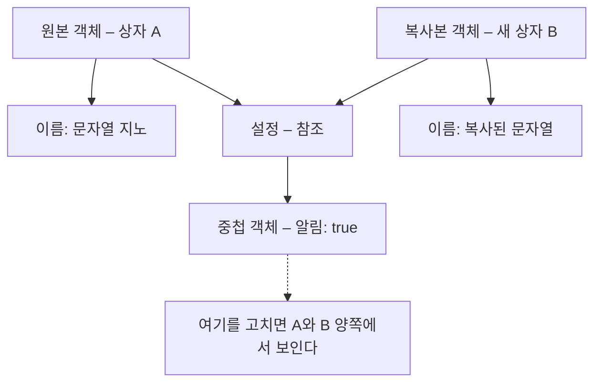

<Callout type="info">
  **이번 문서의 목표:** 이 파일을 다 읽으면 스프레드 문법이 "값을 펼친다"가 아니라 **어떤 규칙으로** 펼치는지를 설명할 수 있고, 디스트럭처링의 기본값·중첩·레스트를 조합해 복잡한 데이터를 안전하게 뽑아낼 수 있으며, 얕은 복사로 생기는 버그를 스스로 재현하고 고칠 수 있습니다.
</Callout>

## 왜 이 문법이 태어났는가

ES6 이전의 JavaScript 코드는 데이터를 **옮겨 담는 잡일**로 가득했습니다. 배열 두 개를 이어 붙이려면 `concat`, 함수에 배열을 인수로 흩뿌리려면 `Function.prototype.apply`, 객체에서 필요한 값 세 개를 꺼내려면 대입문 세 줄. 하는 일은 "이 값을 저기로 옮긴다" 하나인데, 표현하는 방법이 제각각이었습니다.

```js
// ES5 시절 — 하는 일은 단순한데 문법이 제각각
var 좌표 = { x: 10, y: 20 };
var x = 좌표.x;
var y = 좌표.y;

var 앞부분 = [1, 2];
var 뒷부분 = [3, 4];
var 전체 = 앞부분.concat(뒷부분);

var 숫자들 = [5, 1, 9];
var 최댓값 = Math.max.apply(null, 숫자들); // null은 왜 넣는지도 설명이 필요
```

ES6은 이 잡일을 **두 방향의 점 세 개**와 **패턴 매칭**으로 통일했습니다.

- **펼치기 방향**: 뭉쳐 있는 값을 흩뿌린다 → 스프레드(spread) 문법
- **모으기 방향**: 흩어진 값을 뭉친다 → 레스트(rest) 문법
- **뽑아내기**: 구조가 이렇게 생겼으니 여기 있는 값을 이 이름으로 달라 → 디스트럭처링(destructuring, 구조 분해 할당)

> **쉽게 말하면:** 스프레드는 상자를 열어 내용물을 바닥에 쏟는 것, 레스트는 바닥에 흩어진 것을 상자에 쓸어 담는 것, 디스트럭처링은 상자 모양을 보고 "여기 든 것 주세요"라고 지목하는 것입니다.

세 문법은 문법적으로 형제지만 **동작 규칙이 서로 다릅니다.** 이 차이를 모르고 쓰면 "왜 여기선 되고 저기선 안 되지?"에서 막힙니다. 그래서 이 문서는 문법 나열이 아니라 **각각이 내부에서 무엇을 호출하는지**부터 시작합니다.

## 1. 스프레드 문법 — 무엇을 어떻게 펼치는가

### 배열 스프레드는 이터레이션 프로토콜을 쓴다

배열 리터럴이나 함수 호출 인수 자리에서 쓰는 `...`은 대상의 **이터레이터**(iterator, 반복자)를 꺼내 끝까지 돌립니다. 즉 `[...대상]`이 성립하려면 대상이 **이터러블**(iterable, 반복 가능한 값)이어야 합니다. 이터러블이란 `Symbol.iterator`라는 특수한 키에 함수를 갖고 있어서 "나를 어떻게 하나씩 꺼내는지"를 스스로 알려주는 값을 말합니다. 자세한 프로토콜 구조는 24편에서 다루고, 여기서는 **스프레드가 이 프로토콜 위에 서 있다**는 사실만 붙잡으면 됩니다.

```js
console.log([...'가나다']);          // ['가', '나', '다']  — 문자열은 이터러블
console.log([...new Set([1, 1, 2])]); // [1, 2]             — Set도 이터러블
console.log([...new Map([['a', 1]])]); // [['a', 1]]        — Map도 이터러블

console.log([...{ x: 1 }]);
// TypeError: {} is not iterable  — 일반 객체는 이터러블이 아니다
```

마지막 줄이 핵심입니다. **일반 객체는 배열 스프레드로 펼칠 수 없습니다.** 객체에는 `Symbol.iterator`가 없기 때문입니다. 그런데 조금 뒤에 나오는 **객체 스프레드**는 객체를 잘만 펼칩니다. 같은 점 세 개인데 왜 다를까요? 규칙 자체가 다르기 때문입니다. 이 차이는 표로 정리해 두겠습니다.

### 세 자리에서 쓰이는 스프레드

스프레드가 등장할 수 있는 자리는 크게 세 곳입니다.

```js
// (1) 배열 리터럴 안 — 이어 붙이기, 끼워 넣기
const 앞 = [1, 2];
const 뒤 = [5, 6];
console.log([...앞, 3, 4, ...뒤]);   // [1, 2, 3, 4, 5, 6]

// (2) 함수 호출 인수 자리 — apply를 대체
const 점수들 = [88, 92, 75];
console.log(Math.max(...점수들));     // 92

// (3) 객체 리터럴 안 — 프로퍼티 복사 (ES2018)
const 기본설정 = { 테마: 'dark', 크기: 14 };
console.log({ ...기본설정, 크기: 16 }); // { 테마: 'dark', 크기: 16 }
```

(2)번이 특히 인상적입니다. 예전에는 `Math.max.apply(null, 점수들)`이라고 써야 했는데, 여기서 `null`은 "this는 아무거나"라는 뜻일 뿐 계산과 아무 상관이 없는 노이즈였습니다. 스프레드는 그 노이즈를 지웠습니다.

### 객체 스프레드는 프로토콜을 쓰지 않는다

객체 리터럴 안의 `...`은 이터레이터를 부르지 않습니다. 대신 **자신의**(own) **열거 가능한**(enumerable) 프로퍼티를 골라 새 객체로 복사합니다. 여기서 두 단어가 중요합니다.

- **자신의**(own): 프로토타입 체인에서 물려받은 프로퍼티는 복사되지 않습니다. `obj.toString`은 Object.prototype에서 온 상속 프로퍼티라 스프레드 결과에 들어가지 않습니다.
- **열거 가능한**(enumerable): 프로퍼티 어트리뷰트 중 `enumerable`이 `true`인 것만 복사됩니다. 7편에서 본 `Object.defineProperty`로 `enumerable: false`를 준 프로퍼티는 조용히 빠집니다.

```js
const 부모 = { 인사() { return '안녕'; } };
const 자식 = Object.create(부모);       // 부모를 프로토타입으로 삼는 객체
자식.이름 = '지노';
Object.defineProperty(자식, '비밀', { value: 42, enumerable: false });

console.log({ ...자식 });   // { 이름: '지노' }
// 인사는 상속이라 제외, 비밀은 enumerable:false라 제외
```

| 비교 항목 | 배열 스프레드 `[...x]` | 객체 스프레드 `{ ...x }` |
|-----------|----------------------|------------------------|
| 내부 규칙 | 이터레이션 프로토콜 – Symbol.iterator 호출 | 자신의 열거 가능한 프로퍼티 복사 |
| 일반 객체 대상 | TypeError – 이터러블 아님 | 정상 동작 |
| 문자열 대상 | 글자 단위로 펼침 | 인덱스를 키로 삼는 객체 |
| 상속 프로퍼티 | 해당 없음 | 복사되지 않음 |
| 도입 버전 | ES6(ES2015) | ES2018 |

문자열을 두 방식으로 펼쳐 보면 차이가 확 드러납니다.

```js
console.log([...'abc']);   // ['a', 'b', 'c']
console.log({ ...'abc' }); // { 0: 'a', 1: 'b', 2: 'c' }
```

<Callout type="warning">
  **자주 틀리는 점:** "스프레드는 복사다"까지는 맞지만 **얕은 복사**(shallow copy)라는 단서가 빠지면 위험합니다. 스프레드는 프로퍼티 값을 그대로 옮길 뿐이라, 값이 객체면 **같은 객체를 가리키는 참조**가 복사됩니다. 겉껍데기만 새것이고 속은 공유됩니다. 바로 아래에서 실험합니다.
</Callout>

### 얕은 복사를 눈으로 확인하기

아래 실습기의 실행 버튼을 눌러, 새로 만든 객체를 고쳤을 뿐인데 원본까지 바뀌는 순간을 직접 확인하세요. 그리고 마지막 줄의 주석을 풀어 깊은 복사와 비교해 보세요.

<CodePlayground
  template="vanilla"
  activeFile="/index.js"
  showConsole
  label="스프레드는 얕은 복사 — 한 겹만 새것이다"
  files={{
    '/index.js': `const 원본 = {
  이름: "지노",
  설정: { 알림: true },   // 값이 객체 = 참조
};

const 복사본 = { ...원본 };

// 1단계 프로퍼티는 독립적이다
복사본.이름 = "바뀐이름";
console.log("원본 이름:", 원본.이름);       // 지노 — 영향 없음

// 2단계(중첩) 프로퍼티는 같은 객체를 공유한다
복사본.설정.알림 = false;
console.log("원본 설정:", 원본.설정.알림);  // false — 원본까지 바뀜!

console.log("같은 객체인가?", 원본.설정 === 복사본.설정); // true

// 깊은 복사로 해결하기
const 깊은복사 = structuredClone(원본);
깊은복사.설정.알림 = true;
console.log("깊은 복사 후 원본:", 원본.설정.알림); // false 유지 — 독립
console.log("같은 객체인가?", 원본.설정 === 깊은복사.설정); // false`,
  }}
/>

결과를 말로 해석하면 이렇습니다. 스프레드는 **상자를 새로 만들고 안의 물건들을 그대로 옮겨 담습니다.** 물건이 숫자·문자열 같은 원시값이면 물건 자체가 복제되지만, 물건이 또 다른 상자(객체)라면 복제되는 것은 "그 상자로 가는 주소"뿐입니다. 주소가 같으니 어느 쪽에서 열어도 같은 상자입니다. 원시값과 객체의 복사 차이는 3편의 값과 참조 모델 그대로이며, 스프레드는 그 모델의 예외가 아니라 충실한 사례입니다.

그림으로 보면 무엇이 새로 생기고 무엇이 공유되는지 한눈에 들어옵니다.



원본과 복사본은 서로 다른 상자지만, `설정` 화살표는 **같은 중첩 객체 하나를 함께 가리킵니다.** 얕은 복사가 만드는 버그는 전부 이 공유 화살표에서 나옵니다.

깊은 복사가 필요하면 최신 환경에서는 `structuredClone`이 표준 해법입니다. 흔히 쓰던 `JSON.parse(JSON.stringify(obj))`는 Date를 문자열로 바꾸고 함수·undefined·Symbol을 지워버리며 순환 참조에서 에러가 나므로, 데이터 모양을 아는 경우에만 쓰는 임시방편으로 취급하세요.

### 순서가 결과를 바꾼다 — 객체 스프레드의 덮어쓰기 규칙

객체 리터럴은 위에서 아래로, 왼쪽에서 오른쪽으로 프로퍼티를 채웁니다. 같은 키가 다시 나오면 **나중 것이 이깁니다.**

```js
const 기본값 = { 크기: 14, 색상: 'black', 굵기: 400 };
const 사용자설정 = { 색상: 'red' };

console.log({ ...기본값, ...사용자설정 }); // { 크기: 14, 색상: 'red', 굵기: 400 }
console.log({ ...사용자설정, ...기본값 }); // { 크기: 14, 색상: 'black', 굵기: 400 }
```

두 번째 줄은 사용자 설정이 기본값에 덮여버린 흔한 버그입니다. **"기본값을 먼저 깔고, 덮어쓸 값을 나중에"** 라는 순서를 관용구로 외워두면 안전합니다. 페인트를 여러 겹 칠할 때 마지막에 칠한 색이 보이는 것과 같습니다.

## 2. 레스트 문법 — 남는 것을 모으기

같은 점 세 개인데 **할당의 왼쪽이나 매개변수 자리**에 오면 의미가 정반대가 됩니다. 펼치는 게 아니라 **남은 것을 하나로 모읍니다.**

```js
// 매개변수 자리 — 인수가 몇 개든 배열 하나로 받는다
function 합계(...숫자들) {
  return 숫자들.reduce((누적, 값) => 누적 + 값, 0);
}
console.log(합계(1, 2, 3, 4)); // 10
```

`숫자들`은 **진짜 배열**입니다. 예전에 쓰던 `arguments` 객체는 배열처럼 생겼지만 배열이 아닌 유사 배열(array-like)이라 `map`이나 `reduce`를 바로 쓸 수 없었고, 화살표 함수에는 아예 존재하지 않습니다. 레스트 파라미터는 그 모든 불편을 없앱니다.

레스트 파라미터에는 두 가지 규칙이 있습니다.

1. **반드시 마지막 매개변수**여야 합니다. "남은 것을 다 모은다"는 뜻이므로 뒤에 다른 매개변수가 올 수 없습니다.
2. `function.length`(함수가 선언한 매개변수 개수)에 포함되지 않습니다.

```js
function 로그(수준, ...메시지들) { /* ... */ }
console.log(로그.length); // 1 — 수준만 센다

// function 잘못(...앞, 뒤) {}
// SyntaxError: Rest parameter must be last formal parameter
```

<Callout type="info">
  **점 세 개를 구분하는 한 줄 기준:** 값이 만들어지는 쪽(오른쪽·인수 자리)에 있으면 **펼치기**, 값을 받는 쪽(왼쪽·매개변수 자리)에 있으면 **모으기**입니다.
</Callout>

## 3. 디스트럭처링 — 구조를 적어 값을 꺼내기

### 배열 디스트럭처링은 순서로 뽑는다

> **쉽게 말하면:** 값이 든 상자와 **똑같이 생긴 빈 상자**를 왼쪽에 그려두면, JavaScript가 자리마다 값을 채워 넣어 줍니다.

배열 디스트럭처링은 **위치**를 기준으로 값을 가져오고, 내부적으로는 스프레드와 마찬가지로 **이터레이션 프로토콜**을 사용합니다. 그래서 배열뿐 아니라 문자열·Set·제너레이터에도 그대로 통합니다.

```js
const [첫째, 둘째] = [10, 20, 30];
console.log(첫째, 둘째);            // 10 20 — 남는 30은 버려짐

const [, , 셋째] = [10, 20, 30];    // 쉼표로 자리 건너뛰기
console.log(셋째);                  // 30

const [머리, ...꼬리] = [1, 2, 3, 4];
console.log(머리, 꼬리);            // 1 [2, 3, 4]

const [ㄱ, ㄴ] = '한글';            // 문자열도 이터러블
console.log(ㄱ, ㄴ);                // 한 글

// 값 교환 — 임시 변수가 필요 없다
let a = 1, b = 2;
[a, b] = [b, a];
console.log(a, b);                  // 2 1
```

### 객체 디스트럭처링은 이름으로 뽑는다

객체는 순서가 아니라 **키 이름**으로 값을 찾습니다. 그래서 왼쪽에 적는 순서는 아무 의미가 없습니다.

```js
const 사용자 = { 이름: '지노', 나이: 30, 도시: '서울' };

const { 나이, 이름 } = 사용자;      // 순서 무관
console.log(이름, 나이);            // 지노 30

// 다른 이름으로 받기 — 콜론 오른쪽이 "새 변수명"
const { 이름: 표시이름 } = 사용자;
console.log(표시이름);              // 지노
// console.log(이름);               // 위 줄과 별개 스코프라면 ReferenceError
```

콜론의 방향이 헷갈리기 쉽습니다. `{ 원래키: 새변수명 }` — **왼쪽이 찾을 키, 오른쪽이 만들 변수**입니다. 객체 리터럴에서 `{ 키: 값 }`을 쓸 때와 방향이 같다고 생각하면 됩니다. 리터럴은 "이 키에 이 값을 넣어라", 디스트럭처링은 "이 키에서 꺼내 이 이름에 넣어라"입니다.

### 기본값 — undefined일 때만 작동한다

값이 없을 때를 대비해 기본값을 줄 수 있습니다. 여기에 아주 중요한 함정이 하나 있습니다.

```js
const { 크기 = 14, 색상 = 'black' } = { 색상: undefined };
console.log(크기, 색상);   // 14 black — 둘 다 기본값 적용

const { 개수 = 10 } = { 개수: null };
console.log(개수);         // null — 기본값이 적용되지 않음!

const [값 = 5] = [0];
console.log(값);           // 0 — 0도 기본값을 밀어내지 못함
```

**기본값은 오직 `undefined`일 때만 적용됩니다.** `null`, `0`, `''`, `false`는 모두 "값이 있는 것"으로 취급되어 그대로 들어옵니다. 이는 논리 OR 연산자를 쓰던 옛 관용구 `const 크기 = 옵션.크기 || 14`와 결정적으로 다른 점입니다. OR 방식은 `0`이 falsy라서 기본값 14로 바뀌어 버리는 버그를 만들었지만, 디스트럭처링 기본값은 `0`을 존중합니다. 6편에서 다룬 널 병합 연산자 `??`와 같은 판정 기준이라고 보면 정확합니다.

기본값에는 표현식도 쓸 수 있고, **앞에서 이미 뽑은 변수를 참조**할 수도 있습니다. 왼쪽에서 오른쪽으로 순서대로 평가되기 때문입니다.

```js
function 사각형({ 너비, 높이 = 너비 }) {   // 높이 생략 시 정사각형
  return 너비 * 높이;
}
console.log(사각형({ 너비: 5 }));          // 25
console.log(사각형({ 너비: 5, 높이: 2 })); // 10
```

### 중첩 패턴과 객체 레스트

실무 데이터는 대체로 여러 겹입니다. 디스트럭처링 패턴은 데이터 모양을 그대로 베껴 쓰면 됩니다.

```js
const 응답 = {
  상태: 200,
  본문: {
    사용자: { 이름: '지노', 주소: { 도시: '서울' } },
    태그: ['js', 'es6'],
  },
};

const {
  본문: {
    사용자: { 이름, 주소: { 도시 } },
    태그: [첫태그],
  },
} = 응답;

console.log(이름, 도시, 첫태그); // 지노 서울 js
```

여기서 놓치기 쉬운 점: `본문`, `사용자`, `주소`는 **변수로 만들어지지 않습니다.** 이들은 "더 깊이 들어가기 위한 경유지"일 뿐입니다. 실제로 선언되는 변수는 `이름`, `도시`, `첫태그` 세 개뿐입니다. 경유지 값도 함께 쓰고 싶다면 `본문: 본문` 같은 별도 항목을 추가해야 합니다.

객체에도 레스트를 쓸 수 있습니다. **뽑고 남은 프로퍼티**를 새 객체로 모읍니다. 이 패턴은 "특정 키만 제외한 사본"을 만드는 데 자주 쓰입니다.

```js
const 계정 = { 아이디: 'zeno', 비밀번호: 'secret', 이메일: 'z@x.com' };
const { 비밀번호, ...공개정보 } = 계정;
console.log(공개정보); // { 아이디: 'zeno', 이메일: 'z@x.com' }
```

주의할 점은 객체 레스트도 **얕은 복사**라는 것, 그리고 뽑아낸 `비밀번호` 변수는 여전히 스코프에 남아 있다는 것입니다. 민감한 값을 "지웠다"고 착각하지 마세요. 지운 것은 새 객체에 안 담은 것일 뿐입니다.

### 함수 매개변수에서의 디스트럭처링

디스트럭처링이 가장 큰 값을 하는 자리는 함수의 매개변수입니다. 인수를 객체로 받으면 **순서를 외울 필요가 없고, 호출부만 봐도 각 값의 의미가 드러납니다.**

```js
// 이전 방식 — 호출부만 보면 true, false가 뭔지 알 수 없다
function 그리기(너비, 높이, 테두리, 그림자) { /* ... */ }
그리기(100, 50, true, false);

// 디스트럭처링 + 기본값 — 이름이 곧 문서
function 그리기2({ 너비 = 100, 높이 = 50, 테두리 = false, 그림자 = false } = {}) {
  return `${너비}x${높이}, 테두리:${테두리}`;
}
console.log(그리기2({ 높이: 200, 테두리: true })); // 100x200, 테두리:true
console.log(그리기2());                            // 인수 없이 호출해도 안전
```

매개변수 목록 끝의 `= {}`가 결정적입니다. 이게 없으면 `그리기2()`처럼 인수 없이 부를 때 `undefined`에서 프로퍼티를 꺼내려다 TypeError가 납니다. 상자 안을 열어보려면 최소한 빈 상자라도 있어야 하는 셈입니다.

### 잘 틀리는 문법 함정 두 가지

첫째, **선언 없이 객체 디스트럭처링을 하려면 괄호가 필요합니다.**

```js
let 이름;
// { 이름 } = { 이름: '지노' };   // SyntaxError
({ 이름 } = { 이름: '지노' });     // 정상 — 소괄호로 감싸기
```

문장이 중괄호로 시작하면 JavaScript는 그것을 객체 리터럴이 아니라 **블록문**으로 읽습니다. 소괄호는 "이건 문장이 아니라 표현식이다"라고 알려주는 신호입니다.

둘째, **디스트럭처링 대상이 `null` 또는 `undefined`면 TypeError입니다.**

```js
// const { a } = null;      // TypeError: Cannot destructure property 'a' of null
const { a } = null ?? {};   // 안전 — 널 병합으로 빈 객체 대체
console.log(a);             // undefined
```

<Callout type="warning">
  **자주 틀리는 점 모음:** ① 기본값은 `undefined`에만 적용된다 – `null`은 그대로 들어온다. ② 객체 스프레드의 순서에 따라 덮어쓰기 방향이 뒤집힌다. ③ 스프레드·레스트는 모두 얕은 복사다. ④ 중첩 패턴의 중간 이름은 변수가 되지 않는다. ⑤ 배열 디스트럭처링은 이터러블만 가능하므로 일반 객체에 쓰면 TypeError다.
</Callout>

## 4. 종합 실습 — 설정 병합기 만들기

지금까지의 규칙이 한 자리에서 어떻게 맞물리는지 확인해 봅시다. 실행해서 출력 순서를 보고, `사용자설정`의 값을 `null`이나 `0`으로 바꿔가며 기본값이 언제 적용되는지 직접 실험해 보세요.

<CodePlayground
  template="vanilla"
  activeFile="/index.js"
  showConsole
  label="스프레드·레스트·디스트럭처링 종합 — 값을 바꿔가며 실험하기"
  files={{
    '/index.js': `const 기본설정 = {
  테마: "light",
  글자크기: 14,
  여백: 0,
  알림: { 소리: true, 진동: false },
};

// 사용자설정의 값을 null, 0, undefined로 바꿔가며 실험해 보세요
const 사용자설정 = { 글자크기: 0, 여백: undefined, 테마: "dark" };

// (1) 객체 스프레드 병합 — 나중 것이 이긴다
const 병합 = { ...기본설정, ...사용자설정 };
console.log("1. 스프레드 병합:", 병합.글자크기, 병합.여백);
// 여백이 undefined로 덮인다! 스프레드는 undefined도 값으로 취급

// (2) 디스트럭처링 기본값 — undefined에만 적용
const { 글자크기 = 14, 여백 = 0, 알림: { 소리 } } = 병합;
console.log("2. 디스트럭처링 기본값:", 글자크기, 여백, 소리);

// (3) 레스트로 특정 키 제외한 사본 만들기
const { 알림, ...알림뺀설정 } = 병합;
console.log("3. 알림 제외:", Object.keys(알림뺀설정));

// (4) 얕은 복사 확인
병합.알림.소리 = false;
console.log("4. 원본까지 바뀌는가:", 기본설정.알림.소리);

// (5) 레스트 파라미터 + 배열 스프레드
const 적용 = (기준, ...추가들) => 추가들.reduce((누적, 다음) => ({ ...누적, ...다음 }), 기준);
console.log("5. 다중 병합:", 적용({ a: 1 }, { b: 2 }, { a: 9 }));`,
  }}
/>

(1)번의 결과가 이 실습의 핵심 교훈입니다. **스프레드 병합은 `undefined`도 하나의 값으로 취급해 덮어씁니다.** 반면 디스트럭처링 기본값은 그 `undefined`를 보고 기본값을 되살립니다. 그래서 "스프레드로 병합한 뒤 디스트럭처링으로 기본값을 채우는" 두 단계 조합이 실무에서 튼튼한 패턴이 됩니다.

## 핵심 정리

- **배열 스프레드**는 이터레이션 프로토콜을 쓰고, **객체 스프레드**는 자신의 열거 가능한 프로퍼티를 복사한다 — 같은 점 세 개지만 규칙이 다르다.
- 스프레드·레스트로 만드는 복사는 전부 **얕은 복사**다. 중첩 객체는 참조가 공유되므로 깊은 복사가 필요하면 `structuredClone`을 쓴다.
- 점 세 개가 **값을 만드는 자리**에 있으면 펼치기, **값을 받는 자리**에 있으면 모으기다. 레스트 파라미터는 항상 마지막이어야 한다.
- 디스트럭처링 **기본값은 `undefined`에만 적용된다.** `null`·`0`·`''`은 그대로 들어오므로 `||` 관용구와 결과가 다르다.
- 객체 스프레드 병합은 **나중 것이 이긴다.** 기본값을 앞에, 덮어쓸 값을 뒤에 두는 순서를 관용구로 삼는다.

## 마무리 복습

<Quiz
  questionNumber={1}
  question="배열 스프레드와 객체 스프레드의 내부 동작 차이로 옳은 것은?"
  options={['둘 다 Symbol.iterator를 호출한다', '배열 스프레드는 이터레이션 프로토콜을 쓰고, 객체 스프레드는 자신의 열거 가능한 프로퍼티를 복사한다', '배열 스프레드는 깊은 복사, 객체 스프레드는 얕은 복사다', '객체 스프레드는 상속받은 프로퍼티까지 모두 복사한다']}
  correctAnswer={2}
  explanation="배열 스프레드는 대상이 이터러블이어야 하므로 일반 객체에 쓰면 TypeError가 나지만, 객체 스프레드는 프로퍼티 복사 규칙을 쓰므로 이터러블 여부와 무관하다. 둘 다 얕은 복사이며, 객체 스프레드는 상속 프로퍼티를 제외한다."
  optionExplanations={['객체 스프레드는 Symbol.iterator를 부르지 않는다', '정답 — 규칙이 서로 다르기에 대상 제약도 다르다', '둘 다 얕은 복사다', '자신의 프로퍼티만 복사하며 상속분은 빠진다']}
/>

<Quiz
  questionNumber={2}
  question="const 결과 = 부분값 배열에서 개수 기본값 10을 주고 실제 값이 null일 때, 개수에 담기는 값은?"
  options={['10', 'null', 'undefined', 'TypeError 발생']}
  correctAnswer={2}
  explanation="디스트럭처링 기본값은 값이 undefined일 때만 적용된다. null은 값이 존재하는 것으로 판정되어 그대로 할당된다."
  optionExplanations={['undefined였다면 10이 되지만 null은 아니다', '정답 — null은 기본값을 발동시키지 않는다', 'null이 그대로 들어오므로 undefined가 아니다', '값이 null인 프로퍼티를 꺼내는 것은 에러가 아니다']}
/>

<Quiz
  questionNumber={3}
  question="객체 스프레드로 기본값과 사용자값을 병합할 때 사용자값이 항상 이기게 하려면?"
  options={['기본값을 뒤에 둔다', '사용자값을 뒤에 둔다', '순서와 무관하게 항상 사용자값이 이긴다', 'Object.freeze로 기본값을 얼린다']}
  correctAnswer={2}
  explanation="객체 리터럴은 왼쪽에서 오른쪽으로 프로퍼티를 채우고 같은 키는 나중 것이 덮어쓴다. 따라서 덮어쓰고 싶은 값을 뒤에 두어야 한다."
  optionExplanations={['기본값이 뒤에 오면 사용자값이 덮인다', '정답 — 나중에 쓴 값이 최종값이 된다', '순서가 결과를 결정한다', '동결은 병합 결과 순서와 무관하다']}
/>

<Quiz
  questionNumber={4}
  question="레스트 파라미터에 대한 설명으로 틀린 것은?"
  options={['진짜 배열이므로 map, reduce를 바로 쓸 수 있다', '매개변수 목록의 마지막에만 올 수 있다', '함수의 length 값에 포함된다', '화살표 함수에서도 사용할 수 있다']}
  correctAnswer={3}
  explanation="레스트 파라미터는 function.length에 포함되지 않는다. length는 레스트 앞의 일반 매개변수 개수만 센다."
  optionExplanations={['유사 배열인 arguments와 달리 진짜 배열이 맞다', '남은 것을 모으므로 뒤에 다른 매개변수가 올 수 없다', '정답(틀린 설명) — length에서 제외된다', 'arguments가 없는 화살표 함수에서 특히 유용하다']}
/>

<Quiz
  questionNumber={5}
  question="중첩 디스트럭처링에서 본문 안의 사용자 안의 이름을 꺼냈을 때, 실제로 선언되는 변수는?"
  options={['본문, 사용자, 이름 세 개 모두', '이름 하나만', '본문과 이름 두 개', '아무 변수도 선언되지 않는다']}
  correctAnswer={2}
  explanation="중첩 패턴에서 중간 단계 키는 더 깊이 들어가기 위한 경유지일 뿐 변수로 선언되지 않는다. 최종적으로 이름이 붙은 자리만 변수가 된다."
  optionExplanations={['중간 키는 변수가 되지 않는다', '정답 — 경유지는 변수를 만들지 않는다', '본문은 경유지라 변수가 아니다', '최종 위치의 이름은 변수로 선언된다']}
/>

<Quiz
  questionNumber={6}
  question="다음 중 스프레드 복사 후에도 원본이 함께 바뀔 수 있는 경우는?"
  options={['복사본의 문자열 프로퍼티를 다른 문자열로 바꿀 때', '복사본의 숫자 프로퍼티를 증가시킬 때', '복사본의 중첩 객체 안 프로퍼티를 바꿀 때', '복사본에 새로운 키를 추가할 때']}
  correctAnswer={3}
  explanation="스프레드는 얕은 복사이므로 중첩 객체는 참조가 공유된다. 원시값 프로퍼티 교체나 키 추가는 복사본에만 영향을 준다."
  optionExplanations={['원시값은 값 자체가 복사되어 독립적이다', '숫자도 원시값이라 독립적이다', '정답 — 참조가 공유되어 양쪽에서 같은 객체를 본다', '새 키 추가는 복사본의 자체 프로퍼티일 뿐이다']}
/>

<Quiz
  questionNumber={7}
  question="선언 없이 이미 있는 변수에 객체 디스트럭처링으로 값을 할당하려 할 때 반드시 필요한 것은?"
  options={['전체 식을 소괄호로 감싼다', 'let 키워드를 다시 쓴다', '세미콜론을 생략한다', '대괄호로 바꿔 쓴다']}
  correctAnswer={1}
  explanation="문장이 중괄호로 시작하면 블록문으로 해석되어 문법 에러가 난다. 소괄호로 감싸 표현식임을 알려야 한다."
  optionExplanations={['정답 — 소괄호가 표현식임을 알리는 신호다', '재선언은 오히려 에러를 만든다', '세미콜론 생략은 해결책이 아니다', '대괄호는 배열 패턴이라 의미가 달라진다']}
/>

## 참고 자료

- [MDN - Spread syntax](https://developer.mozilla.org/en-US/docs/Web/JavaScript/Reference/Operators/Spread_syntax)
- [MDN - Destructuring assignment](https://developer.mozilla.org/en-US/docs/Web/JavaScript/Reference/Operators/Destructuring_assignment)
- [MDN - Rest parameters](https://developer.mozilla.org/en-US/docs/Web/JavaScript/Reference/Functions/rest_parameters)
- [ECMAScript Language Specification](https://262.ecma-international.org/)
