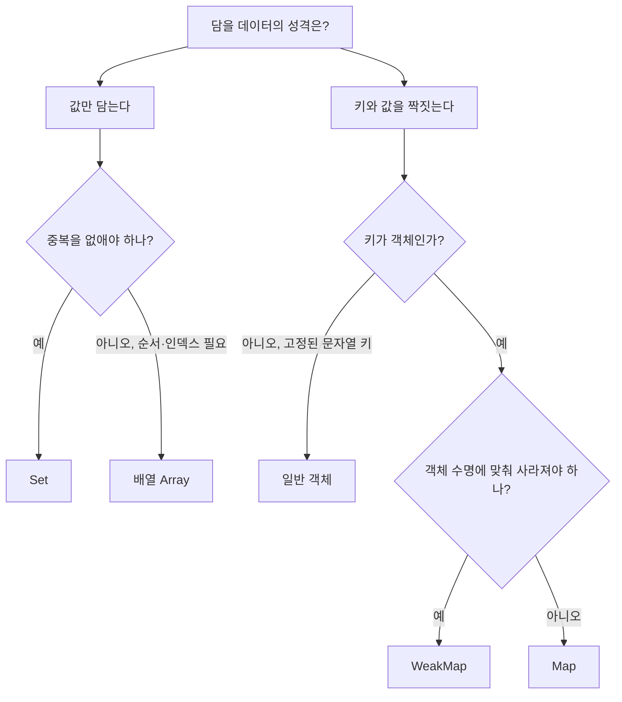

<Callout type="info">
  **이번 문서의 목표:** 이 파일을 다 읽으면 언제 배열 대신 Set을, 객체 대신 Map을 써야 하는지 성능과 의미 양쪽에서 근거를 대어 설명할 수 있고, 키 동일성 판정 규칙 때문에 생기는 버그를 재현하고 피할 수 있으며, WeakMap이 왜 순회 불가능한지 이유를 말할 수 있습니다.
</Callout>

## 왜 새 자료구조가 필요했는가

ES6 이전의 JavaScript에는 **컬렉션**(collection, 값을 여러 개 담는 그릇)이 사실상 배열과 객체 둘뿐이었습니다. 그래서 개발자들은 이 둘을 원래 용도가 아닌 일에 억지로 썼습니다.

첫 번째 억지: **중복 없는 값의 모음**을 배열로 흉내 내기.

```js
const 방문자 = [];
function 방문(이름) {
  if (방문자.indexOf(이름) === -1) 방문자.push(이름);
}
```

`indexOf`는 배열을 처음부터 훑어 값을 찾습니다. 원소가 $n$개면 최악의 경우 $n$번 비교합니다. 방문자가 1만 명이면 한 번 추가할 때마다 최대 1만 번 비교하고, 1만 명을 추가하면 비교 횟수는 대략 5천만 번이 됩니다. 이렇게 데이터 개수 $n$에 비례해 작업량이 늘어나는 성질을 **선형 시간**(linear time, $O(n)$)이라 부르고, 개수와 무관하게 거의 일정한 성질을 **상수 시간**(constant time, $O(1)$)이라 부릅니다. 기호 $O$는 "대략 이 정도로 커진다"를 나타내는 표기이며, $n$은 담긴 원소의 개수입니다.

두 번째 억지: **키–값 사전**을 일반 객체로 흉내 내기.

```js
const 점수판 = {};
점수판[사용자객체] = 100;   // 키가 문자열로 강제 변환된다
console.log(Object.keys(점수판)); // ['[object Object]'] — 모든 객체가 같은 키가 된다!
```

객체의 프로퍼티 키는 **문자열 또는 심볼만** 될 수 있습니다. 숫자 `1`도 문자열 `'1'`이 되고, 서로 다른 객체 두 개도 전부 `'[object Object]'`라는 똑같은 문자열이 되어 충돌합니다. 게다가 일반 객체는 `Object.prototype`을 상속하므로 `toString`, `constructor` 같은 이름이 이미 "있는 것처럼" 보여, `'toString' in 점수판`이 `true`가 되는 함정도 있습니다.

> **쉽게 말하면:** 배열은 순서 있는 줄 세우기, 객체는 이름표 붙은 서랍장입니다. 그런데 "중복 없는 명단"과 "무엇이든 열쇠로 쓸 수 있는 사물함"은 이 둘로 만들면 삐걱거립니다. Set과 Map은 정확히 그 두 자리를 위해 표준에 추가되었습니다.

## 1. Set — 중복 없는 값의 모음

### 기본 동작

**Set**(셋, 집합)은 **같은 값을 두 번 담지 않는** 컬렉션입니다. 수학의 집합과 같은 개념이고, 삽입 순서를 기억한다는 점만 다릅니다.

```js
const 태그 = new Set(['js', 'es6', 'js']);
console.log(태그.size);          // 2 — 중복 js는 한 번만
console.log(태그.has('js'));     // true
태그.add('web');                 // 추가 — 자기 자신을 반환하므로 체이닝 가능
태그.delete('es6');              // 삭제 — 성공 여부를 boolean으로 반환
console.log([...태그]);          // ['js', 'web'] — 삽입 순서 유지
```

Set의 조회(`has`)와 추가(`add`)는 내부적으로 **해시 기반 구조**를 써서 원소 개수와 거의 무관한 시간에 끝납니다. 명세는 구체적 자료구조를 강제하지 않지만, "선형 탐색보다 나은 성능이어야 한다"는 취지를 명시합니다. 앞의 방문자 예제를 Set으로 바꾸면 1만 명이든 100만 명이든 한 번 확인에 드는 비용이 거의 같습니다.

```js
const 방문자 = new Set();
function 방문(이름) { 방문자.add(이름); }   // 중복 검사 코드 자체가 사라짐
```

코드가 짧아진 것보다 중요한 것은 **의도가 드러났다**는 점입니다. `new Set()`이라고 쓰는 순간 "여긴 중복이 없어야 한다"가 코드에 선언됩니다. 배열 + `indexOf` 조합은 그 의도를 읽는 사람이 추론해야 했습니다.

### 배열과 Set 비교

| 비교 항목 | 배열 – Array | 집합 – Set |
|-----------|-------------|-----------|
| 중복 | 허용 | 자동 제거 |
| 값 포함 확인 | `includes` – 선형 시간 | `has` – 거의 상수 시간 |
| 인덱스 접근 | `arr[0]` 가능 | 불가능 – 순번 개념 없음 |
| 순서 | 인덱스 순 | 삽입 순 |
| 크기 | `length` | `size` |
| 정렬·map·filter | 메서드 존재 | 없음 – 배열로 변환 후 사용 |

Set에는 `map`이나 `filter`가 없습니다. 필요하면 스프레드로 배열에 옮겨 처리하고 다시 Set으로 되돌리는 것이 관용구입니다.

```js
const 숫자집합 = new Set([1, 2, 3, 4]);
const 짝수집합 = new Set([...숫자집합].filter((n) => n % 2 === 0));
console.log([...짝수집합]); // [2, 4]
```

### 집합 연산 직접 구현하기

교집합·합집합·차집합은 최신 명세에 메서드로 추가되었지만, 원리를 이해하려면 직접 만들어 보는 편이 낫습니다. 각 연산의 정의를 그대로 코드로 옮기면 됩니다.

```js
const A = new Set([1, 2, 3]);
const B = new Set([2, 3, 4]);

// 합집합 — A에 있거나 B에 있는 것
const 합집합 = new Set([...A, ...B]);          // {1, 2, 3, 4}

// 교집합 — A에 있으면서 B에도 있는 것
const 교집합 = new Set([...A].filter((v) => B.has(v)));   // {2, 3}

// 차집합 — A에 있지만 B에는 없는 것
const 차집합 = new Set([...A].filter((v) => !B.has(v)));  // {1}
```

교집합 구현에서 `B.has(v)`가 상수 시간이라는 점이 핵심입니다. 만약 B가 배열이었다면 `B.includes(v)`가 매번 선형 탐색이라, 전체 비용이 $n \times m$으로 불어납니다. **"안쪽 루프의 조회를 Set으로 바꾸는 것"** 은 성능 개선의 대표적 관용구입니다.

### 동일성 판정 — SameValueZero

Set이 "같은 값"을 판정하는 기준은 `===`와 미묘하게 다른 **SameValueZero**(세임밸류제로)라는 알고리즘입니다. `===`와 딱 두 군데가 다릅니다.

- `NaN`(Not a Number, 숫자가 아님)은 **자기 자신과 같다고 봅니다.** `NaN === NaN`은 `false`지만 Set은 NaN을 하나만 담습니다.
- `+0`과 `-0`을 **같다고 봅니다.**

```js
const s = new Set([NaN, NaN, 0, -0]);
console.log(s.size);           // 2 — NaN 하나, 0 하나
console.log(NaN === NaN);      // false — 연산자와는 결과가 다르다
```

객체는 **참조가 같아야만** 같은 값입니다. 내용이 똑같아도 별개의 객체면 둘 다 담깁니다. 이 규칙 하나가 초보자를 가장 많이 걸려 넘어뜨립니다.

```js
const 좌표집합 = new Set();
좌표집합.add({ x: 1 });
좌표집합.add({ x: 1 });        // 겉보기엔 같지만 다른 객체
console.log(좌표집합.size);    // 2 — 중복 제거가 되지 않는다!
```

<Callout type="warning">
  **자주 틀리는 점:** "Set에 넣으면 중복이 사라진다"를 객체 배열에 그대로 적용하면 실패합니다. Set은 **값의 동일성**이 아니라 **참조의 동일성**으로 판정합니다. 객체를 중복 제거하려면 `JSON.stringify` 같은 문자열 키나 고유 id를 기준으로 삼아야 합니다.
</Callout>

## 2. Map — 무엇이든 키가 되는 사전

### 객체가 하지 못하던 일

**Map**(맵, 대응표)은 키와 값을 짝지어 저장하는 컬렉션입니다. 객체와 비슷해 보이지만 결정적 차이가 셋 있습니다.

```js
const 키객체 = { id: 1 };
const 점수 = new Map();

점수.set(키객체, 100);      // 객체를 키로!
점수.set(42, '숫자키');      // 숫자가 문자열로 변하지 않음
점수.set('42', '문자열키');  // 42와 '42'는 다른 키

console.log(점수.get(키객체)); // 100
console.log(점수.get(42));     // 숫자키
console.log(점수.size);        // 3
```

1. **키 타입 자유**: 객체·함수·NaN·숫자 무엇이든 키가 됩니다. 객체는 키를 문자열·심볼로 강제 변환합니다.
2. **순서 보장**: Map은 삽입 순서를 그대로 유지합니다. 일반 객체는 정수처럼 생긴 키가 앞으로 정렬되는 규칙이 있어, `{ '2': 'b', '1': 'a' }`의 순회 순서가 삽입 순서와 달라집니다.
3. **오염 없음**: Map은 프로토타입에서 물려받은 이름이 키로 보이지 않습니다. `점수.has('toString')`은 확실하게 `false`입니다.

여기에 실용적 차이가 하나 더 있습니다. 크기를 알려면 객체는 `Object.keys(obj).length`처럼 배열을 새로 만들어 세어야 하지만, Map은 `size` 하나면 됩니다.

| 비교 항목 | 일반 객체 | Map |
|-----------|----------|-----|
| 키로 쓸 수 있는 값 | 문자열·심볼만 | 모든 값 |
| 키 순서 | 정수형 키가 앞으로 정렬됨 | 삽입 순서 유지 |
| 크기 확인 | 키 배열을 만들어 세야 함 | `size` 프로퍼티 |
| 프로토타입 오염 | `toString` 등이 보임 | 없음 |
| 순회 | `Object.entries` 등을 거쳐야 함 | 자체가 이터러블 |
| JSON 직렬화 | 바로 가능 | 별도 변환 필요 |

마지막 행은 Map의 약점입니다. `JSON.stringify(new Map([['a', 1]]))`는 `{}`를 내놓습니다. 저장이나 통신이 목적이면 배열로 바꿔 담아야 합니다.

### 순회와 변환

Map은 그 자체로 이터러블이라 `for...of`에 바로 넣을 수 있고, 각 원소는 **`[키, 값]` 두 칸짜리 배열**로 나옵니다. 여기서 22편의 디스트럭처링이 자연스럽게 이어집니다.

```js
const 재고 = new Map([['사과', 3], ['배', 0], ['감', 7]]);

for (const [이름, 수량] of 재고) {          // 배열 디스트럭처링
  console.log(`${이름}: ${수량}개`);
}

console.log([...재고.keys()]);    // ['사과', '배', '감']
console.log([...재고.values()]);  // [3, 0, 7]
console.log([...재고.entries()]); // [['사과',3], ['배',0], ['감',7]]

// 객체 ↔ Map 상호 변환
const 객체로 = Object.fromEntries(재고);
const 다시맵 = new Map(Object.entries(객체로));
```

`keys`, `values`, `entries`가 돌려주는 것은 배열이 아니라 **이터레이터**입니다. 그래서 `.length`가 없고, 배열 메서드를 쓰려면 스프레드로 펼쳐야 합니다. 이 구분은 24편에서 프로토콜 차원으로 다시 다룹니다.

### 실행해서 확인하는 키 동일성

아래 실습기는 이번 편에서 가장 헷갈리는 지점 — 어떤 값이 "같은 키"로 취급되는가 — 를 한 번에 보여줍니다. 실행 버튼을 누르고, 값을 바꿔가며 예상과 결과가 어긋나는 자리를 찾아보세요.

<CodePlayground
  template="vanilla"
  activeFile="/index.js"
  showConsole
  label="Set과 Map의 키 동일성 — 예상과 결과를 대조해 보세요"
  files={{
    '/index.js': `// 1. 원시값은 값으로 비교된다
const s1 = new Set([1, "1", 1, true, 1]);
console.log("1. size:", s1.size, [...s1]);   // 1, "1", true → 3

// 2. NaN은 자기 자신과 같다고 본다 (SameValueZero)
const s2 = new Set([NaN, NaN]);
console.log("2. NaN 개수:", s2.size, "| NaN === NaN 은", NaN === NaN);

// 3. +0과 -0도 같은 값으로 본다
const s3 = new Set([0, -0]);
console.log("3. 0과 -0:", s3.size, "| Object.is 비교:", Object.is(0, -0));

// 4. 객체는 참조로 비교된다 — 내용이 같아도 별개
const 같은모양1 = { x: 1 };
const 같은모양2 = { x: 1 };
const s4 = new Set([같은모양1, 같은모양2, 같은모양1]);
console.log("4. 객체 개수:", s4.size);   // 2 — 중복 제거 실패처럼 보이는 정상 동작

// 5. 객체 중복 제거는 문자열 키로 우회한다
const 목록 = [{ id: 1 }, { id: 2 }, { id: 1 }];
const 중복제거 = [...new Map(목록.map((o) => [o.id, o])).values()];
console.log("5. id 기준 제거:", 중복제거.length);

// 6. Map은 키 타입을 구분한다
const m = new Map();
m.set(1, "숫자").set("1", "문자열").set(true, "불리언");
console.log("6. Map size:", m.size, "| get(1):", m.get(1), "| get('1'):", m.get("1"));

// 7. 객체는 키를 문자열로 뭉갠다 — 비교용
const o = {};
o[1] = "숫자"; o["1"] = "문자열";
console.log("7. 객체 키 개수:", Object.keys(o).length, "| 값:", o[1]);`,
  }}
/>

5번이 실무에서 가장 자주 쓰는 패턴입니다. `목록.map((o) => [o.id, o])`로 `[키, 값]` 쌍 배열을 만들고 Map 생성자에 넘기면, **같은 id는 나중 것이 앞의 것을 덮어쓰며 자동으로 하나만 남습니다.** 그다음 `values()`를 펼치면 중복 제거된 객체 배열이 나옵니다. Set으로는 불가능했던 "객체 중복 제거"를 Map의 키 규칙으로 해결한 것입니다.

7번의 결과가 `1`이라는 점도 눈여겨보세요. 객체에서는 `o[1]`과 `o["1"]`이 같은 서랍이라 나중 값이 앞 값을 지웠습니다. Map을 쓸 이유가 여기에 있습니다.

## 3. WeakMap과 WeakSet — 메모리를 붙잡지 않는 컬렉션

### 왜 "약한" 컬렉션이 필요한가

JavaScript의 **가비지 컬렉터**(garbage collector, 쓰레기 수집기)는 "어디에서도 닿을 수 없게 된 객체"를 자동으로 회수합니다. 여기서 "닿을 수 있다"를 **도달 가능성**(reachability)이라 부릅니다. 30편에서 본격적으로 다루지만, 지금 필요한 만큼만 말하면 이렇습니다. **어떤 컬렉션이 객체를 담고 있으면, 그 객체는 계속 도달 가능하므로 회수되지 않습니다.**

이게 문제가 되는 상황이 있습니다. DOM 요소나 객체 인스턴스에 **부가 정보를 붙여두고 싶은데**, 그 객체가 사라질 때 부가 정보도 같이 사라지길 원하는 경우입니다.

```js
const 메타 = new Map();
let 요소 = { 이름: '버튼' };
메타.set(요소, { 클릭수: 0 });

요소 = null;   // 요소를 놓아줬다고 생각하지만...
// 메타가 여전히 그 객체를 키로 붙잡고 있어 절대 회수되지 않는다 = 메모리 누수
```

**WeakMap**(위크맵, 약한 맵)은 키로 잡은 객체를 **약하게**(weakly) 참조합니다. 다른 곳에서 아무도 그 객체를 참조하지 않으면, WeakMap이 키로 갖고 있어도 회수 대상이 되고 해당 항목은 조용히 사라집니다.

> **쉽게 말하면:** Map이 객체의 손목을 꽉 붙잡고 있다면, WeakMap은 객체 사진만 들고 있습니다. 본인이 떠나면 사진도 버립니다.

### 대신 잃는 것

이 성질 때문에 WeakMap·WeakSet에는 강한 제약이 붙습니다.

```js
const wm = new WeakMap();
const 키 = {};
wm.set(키, '값');
console.log(wm.get(키), wm.has(키));  // 값 true

// wm.set('문자열', 1);   // TypeError — 키는 객체(와 심볼)만 가능
// console.log(wm.size);   // undefined — size 없음
// for (const x of wm) {}  // TypeError — 이터러블 아님
```

- **키는 객체여야 합니다.** 원시값은 회수 대상이 아니므로 약한 참조의 의미가 없습니다.
- **`size`가 없고 순회할 수 없습니다.** 이유가 중요합니다. 언제 가비지 컬렉션이 일어날지는 엔진 마음이라, 순회를 허용하면 **같은 코드가 실행 시점에 따라 다른 결과를 내게 됩니다.** 관측 가능한 비결정성을 만들지 않으려고 명세가 순회 자체를 막았습니다.
- 사용 가능한 메서드는 `get`, `set`, `has`, `delete` 넷뿐입니다. WeakSet은 `add`, `has`, `delete` 셋입니다.

대표적 용도는 **private 데이터 보관**입니다. 14편에서 본 `#` private 필드가 표준화되기 전에는 이 패턴이 사실상 유일한 해법이었고, 지금도 클래스 외부에서 인스턴스에 정보를 덧붙일 때 쓰입니다.

```js
const 잔액 = new WeakMap();

class 계좌 {
  constructor(초기값) { 잔액.set(this, 초기값); }
  조회() { return 잔액.get(this); }
}

const 내계좌 = new 계좌(1000);
console.log(내계좌.조회());        // 1000
console.log(Object.keys(내계좌));  // [] — 밖에서 잔액이 보이지 않는다
```

인스턴스가 버려지면 WeakMap의 해당 항목도 자동으로 정리됩니다. 이것을 Map으로 만들었다면 인스턴스를 아무리 버려도 잔액 테이블이 계속 부풀어 오릅니다.

## 4. 무엇을 언제 쓸까

선택 기준을 한 장의 흐름도로 정리합니다.



실무 판단 요령을 몇 줄로 덧붙입니다. 키가 **미리 정해진 소수의 문자열**이고 JSON으로 주고받는다면 일반 객체가 여전히 최선입니다. 키가 **런타임에 계속 늘어나는 임의의 값**이거나 순서가 중요하면 Map입니다. **포함 여부만 빠르게 확인**하면 되면 Set이고, 그 판정 대상이 객체이고 대상의 수명을 늘리고 싶지 않다면 WeakSet입니다.

<Callout type="warning">
  **자주 틀리는 점:** ① Set으로 객체 배열의 중복을 없애려다 실패한다 – 참조 비교이기 때문. ② Map을 `JSON.stringify`로 저장하려다 빈 객체를 얻는다. ③ WeakMap을 캐시로 쓰면서 크기를 재려 한다 – `size`가 없다. ④ `set`은 Map 자신을 반환하므로 체이닝되지만, Set의 `delete`는 boolean을 반환해 체이닝되지 않는다.
</Callout>

## 핵심 정리

- **Set**은 중복 없는 값의 모음이며, 포함 확인이 배열의 선형 탐색과 달리 개수와 거의 무관하게 빠르다. 의도까지 코드에 드러난다.
- Set과 Map의 키 동일성 기준은 **SameValueZero**다. `NaN`은 자기 자신과 같고 `+0`과 `-0`은 같으며, 객체는 **참조가 같아야만** 같다.
- **Map**은 모든 값을 키로 쓸 수 있고 삽입 순서를 보장하며 프로토타입 오염이 없다. 대신 JSON 직렬화는 직접 변환해야 한다.
- 객체 배열의 중복 제거는 Set이 아니라 **id를 키로 삼는 Map**으로 해결한다.
- **WeakMap·WeakSet**은 키 객체를 약하게 참조해 메모리 누수를 막는 대신, 순회와 `size`를 포기한다 – GC 시점이 관측 가능해지는 것을 막기 위한 의도적 제약이다.

## 마무리 복습

<Quiz
  questionNumber={1}
  question="Set에 내용이 동일한 두 객체 리터럴을 각각 추가했을 때 size 값은?"
  options={['1 – 내용이 같으므로 중복 제거된다', '2 – 참조가 다르므로 별개의 값이다', '0 – 객체는 Set에 담기지 않는다', '실행 환경에 따라 달라진다']}
  correctAnswer={2}
  explanation="Set의 동일성 판정은 SameValueZero이며, 객체는 참조가 같을 때만 같은 값으로 본다. 내용이 같아도 서로 다른 객체이면 둘 다 저장된다."
  optionExplanations={['내용 비교가 아니라 참조 비교다', '정답 — 별개의 참조라 각각 저장된다', '객체도 문제없이 담긴다', '명세로 정해진 결정적 동작이다']}
/>

<Quiz
  questionNumber={2}
  question="SameValueZero가 일치 연산자와 다른 지점으로 옳은 것은?"
  options={['문자열과 숫자를 같다고 본다', 'NaN을 자기 자신과 같다고 본다', 'null과 undefined를 같다고 본다', '객체의 내용이 같으면 같다고 본다']}
  correctAnswer={2}
  explanation="SameValueZero는 일치 연산자와 거의 같지만 NaN을 자기 자신과 같게 보고, +0과 -0을 같게 본다. 타입 변환이나 내용 비교는 하지 않는다."
  optionExplanations={['타입 변환은 전혀 하지 않는다', '정답 — 그래서 Set에 NaN은 하나만 담긴다', 'null과 undefined는 서로 다른 값이다', '객체는 여전히 참조로 비교한다']}
/>

<Quiz
  questionNumber={3}
  question="일반 객체 대신 Map을 선택해야 할 이유로 보기 어려운 것은?"
  options={['객체나 함수를 키로 써야 한다', '삽입 순서를 그대로 유지해야 한다', 'JSON으로 그대로 직렬화해 저장해야 한다', '키 개수를 자주 확인해야 한다']}
  correctAnswer={3}
  explanation="Map은 JSON.stringify로 바로 직렬화되지 않아 배열 등으로 변환해야 한다. 직렬화가 목적이라면 오히려 일반 객체가 유리하다."
  optionExplanations={['객체 키는 Map의 대표 장점이다', 'Map은 삽입 순서를 보장한다', '정답(이유 아님) — Map은 직렬화에 불리하다', 'size 프로퍼티로 즉시 알 수 있다']}
/>

<Quiz
  questionNumber={4}
  question="WeakMap에 size 프로퍼티와 순회 기능이 없는 근본적인 이유는?"
  options={['성능이 느려지기 때문', '가비지 컬렉션 시점이 코드에서 관측 가능해지는 것을 막기 위해', '키가 문자열이 아니어서 정렬할 수 없기 때문', '표준화가 아직 완료되지 않았기 때문']}
  correctAnswer={2}
  explanation="언제 회수가 일어날지는 엔진이 결정하므로, 순회나 크기 조회를 허용하면 같은 코드가 시점에 따라 다른 결과를 내게 된다. 명세는 이 비결정성을 드러내지 않으려고 기능 자체를 제외했다."
  optionExplanations={['성능이 이유였다면 다른 제약 형태였을 것이다', '정답 — 관측 가능한 비결정성을 차단하기 위한 설계다', '정렬 문제와는 무관하다', 'WeakMap은 ES6에서 이미 표준이다']}
/>

<Quiz
  questionNumber={5}
  question="객체 배열에서 id 기준으로 중복을 제거하려 할 때 가장 적절한 방법은?"
  options={['배열을 그대로 Set 생성자에 넣는다', 'id를 키로 하는 Map을 만든 뒤 values를 펼친다', 'WeakSet에 모두 add 한다', '배열을 정렬한 뒤 인접 원소를 비교한다']}
  correctAnswer={2}
  explanation="Set은 참조로 비교하므로 객체 배열의 중복을 제거하지 못한다. id를 키로 한 Map은 같은 키가 덮어써지므로 자연스럽게 하나만 남는다."
  optionExplanations={['참조가 달라 전부 남는다', '정답 — 키 덮어쓰기 성질을 이용한 관용구다', 'WeakSet 역시 참조로 비교하며 순회도 불가능하다', '동작은 하지만 정렬 비용이 들고 코드가 복잡하다']}
/>

<Quiz
  questionNumber={6}
  question="Map을 for...of로 순회할 때 각 반복에서 얻는 값의 형태는?"
  options={['키만 담긴 값', '값만 담긴 값', '키와 값이 든 두 칸짜리 배열', '키와 값을 담은 객체']}
  correctAnswer={3}
  explanation="Map의 기본 이터레이터는 entries와 같아서 키와 값이 담긴 두 칸 배열을 내놓는다. 그래서 배열 디스트럭처링으로 바로 받을 수 있다."
  optionExplanations={['키만 얻으려면 keys를 써야 한다', '값만 얻으려면 values를 써야 한다', '정답 — 배열 디스트럭처링과 짝을 이룬다', '객체가 아니라 배열이다']}
/>

<Quiz
  questionNumber={7}
  question="배열의 includes 대신 Set의 has를 쓰면 유리한 상황으로 가장 알맞은 것은?"
  options={['원소가 3개 정도인 작은 목록에서 한 번 확인할 때', '큰 목록에 대해 포함 여부를 반복문 안에서 수없이 확인할 때', '원소들의 순서를 정렬해야 할 때', '각 원소를 변형해 새 배열을 만들 때']}
  correctAnswer={2}
  explanation="Set의 조회는 원소 개수와 거의 무관한 시간에 끝나므로, 반복문 안에서 조회가 반복될수록 배열의 선형 탐색 대비 이득이 커진다."
  optionExplanations={['원소가 적으면 차이가 사실상 없다', '정답 — 조회 횟수가 많을수록 격차가 벌어진다', 'Set에는 정렬 개념이 없다', 'Set에는 map이 없어 배열로 변환해야 한다']}
/>

## 참고 자료

- [MDN - Map](https://developer.mozilla.org/en-US/docs/Web/JavaScript/Reference/Global_Objects/Map)
- [MDN - Set](https://developer.mozilla.org/en-US/docs/Web/JavaScript/Reference/Global_Objects/Set)
- [MDN - WeakMap](https://developer.mozilla.org/en-US/docs/Web/JavaScript/Reference/Global_Objects/WeakMap)
- [MDN - Equality comparisons and sameness](https://developer.mozilla.org/en-US/docs/Web/JavaScript/Guide/Equality_comparisons_and_sameness)
- [ECMAScript Language Specification](https://262.ecma-international.org/)
