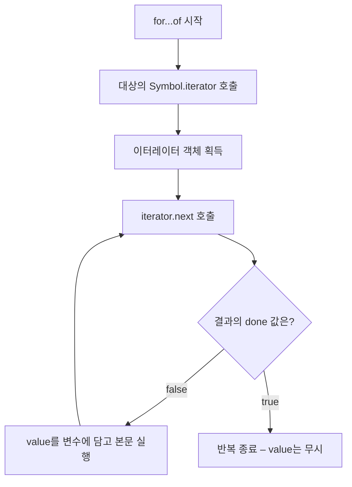

<Callout type="info">
  **이번 문서의 목표:** 이 파일을 다 읽으면 `for...of` 한 줄이 내부에서 어떤 메서드를 몇 번 호출하는지 그림으로 그릴 수 있고, 직접 만든 객체를 이터러블로 만들 수 있으며, 제너레이터로 무한 수열을 안전하게 다루는 지연 평가 코드를 작성할 수 있습니다.
</Callout>

## 왜 "프로토콜"이라는 말을 쓰는가

지금까지 여러 값을 `for...of`로 돌려 봤습니다. 배열도 되고, 문자열도 되고, 23편의 Set·Map도 됩니다. 그런데 일반 객체는 안 됩니다.

```js
for (const x of [1, 2]) {}        // 정상
for (const x of '가나') {}         // 정상
for (const x of new Set([1])) {}  // 정상
for (const x of { a: 1 }) {}      // TypeError: {} is not iterable
```

여기서 자연스러운 질문이 나옵니다. **`for...of`는 이 값들이 서로 다른 타입인 걸 어떻게 알고 다 돌릴까요?** 배열용 코드, 문자열용 코드를 각각 갖고 있는 걸까요?

아닙니다. `for...of`는 값의 타입을 전혀 모릅니다. 대신 **"당신을 순회하려면 어떻게 해야 하는지 알려주는 약속된 메서드"** 를 부를 뿐입니다. 이렇게 "이 규격만 지키면 언어 기능을 쓸 수 있다"는 약속을 **프로토콜**(protocol, 규약)이라고 부릅니다.

> **쉽게 말하면:** 프로토콜은 콘센트 규격입니다. 콘센트는 냉장고인지 선풍기인지 모릅니다. 220V 플러그 모양만 맞으면 꽂힙니다. 이터레이션 프로토콜은 JavaScript 세계의 플러그 규격이고, 그걸 지키는 값은 무엇이든 `for...of`·스프레드·디스트럭처링에 꽂힙니다.

이 한 가지 규격 덕분에 22편의 스프레드, 23편의 Map 순회, 25편 이후의 `Promise.all` 인수 처리까지 전부 같은 원리로 굴러갑니다. 프로토콜을 이해하는 것은 문법 하나를 배우는 게 아니라, **여러 문법이 공유하는 뿌리 하나**를 손에 넣는 일입니다.

## 1. 두 개의 프로토콜

이터레이션은 하나가 아니라 **두 개의 프로토콜이 맞물린 구조**입니다. 이름이 비슷해 헷갈리기 쉬우니 역할로 구분하세요.

**이터러블 프로토콜**(iterable protocol) — "나는 순회될 수 있다"는 자격.
- 조건: `Symbol.iterator`라는 키에 함수를 갖고 있을 것.
- 그 함수는 호출되면 **이터레이터를 반환**해야 합니다.

**이터레이터 프로토콜**(iterator protocol) — "나는 값을 하나씩 꺼내주는 담당자다"라는 자격.
- 조건: `next`라는 메서드를 갖고 있을 것.
- `next()`는 호출될 때마다 `value`와 `done` 두 프로퍼티를 가진 객체를 반환해야 합니다. 이 객체를 **이터레이터 리절트**(iterator result)라고 부릅니다.
  - `value`: 이번에 꺼낸 값
  - `done`: 순회가 끝났는지 여부. `false`면 더 남았고, `true`면 끝입니다.

역할 비유를 붙이면 명확해집니다. **이터러블은 책이고, 이터레이터는 책갈피입니다.** 책 자체는 "지금 몇 쪽을 읽는 중"을 모릅니다. 진행 상태를 기억하는 것은 책갈피이고, `Symbol.iterator`는 "새 책갈피를 하나 만들어 주세요"라는 요청입니다. 그래서 같은 배열을 두 번 순회해도 서로 간섭하지 않습니다. 매번 새 책갈피가 생기니까요.



이 그림이 이번 편의 뼈대입니다. `for...of`, 스프레드, 배열 디스트럭처링, `Promise.all`, `yield*` — 전부 이 그림대로 움직입니다.

## 2. 손으로 프로토콜 밟아보기

말로만 들으면 추상적이니, `for...of` 없이 직접 손으로 돌려 봅시다.

```js
const 배열 = ['가', '나'];

const 이터레이터 = 배열[Symbol.iterator]();   // 책갈피 하나 발급
console.log(이터레이터.next()); // { value: '가', done: false }
console.log(이터레이터.next()); // { value: '나', done: false }
console.log(이터레이터.next()); // { value: undefined, done: true }
console.log(이터레이터.next()); // { value: undefined, done: true } — 끝난 뒤에도 안전
```

주목할 점 세 가지입니다.

1. **마지막 값과 종료 신호는 별개의 호출**입니다. `'나'`를 받을 때 `done`은 아직 `false`이고, 한 번 더 호출해야 `done: true`가 옵니다. 그래서 원소가 2개인 배열을 다 도는 데 `next` 호출은 3번 필요합니다.
2. 배열 자신이 이터레이터인 게 아니라, `Symbol.iterator`를 호출해 **별도의 이터레이터 객체**를 받았습니다.
3. 소진된 이터레이터는 다시 쓸 수 없습니다. 계속 `done: true`만 돌려줍니다.

여기서 `for...of`가 하는 일을 코드로 재현하면 이렇게 됩니다.

```js
// for (const 값 of 배열) { console.log(값); } 과 동등한 코드
const it = 배열[Symbol.iterator]();
let 결과 = it.next();
while (!결과.done) {
  const 값 = 결과.value;
  console.log(값);
  결과 = it.next();
}
```

<Callout type="warning">
  **자주 틀리는 점:** 이터러블과 이터레이터를 같은 말로 쓰면 반드시 혼란이 옵니다. 배열은 **이터러블이지 이터레이터가 아닙니다** – `배열.next`는 `undefined`입니다. 반대로 `Map.prototype.keys()`가 돌려주는 것은 **이터레이터**인데, 이 값은 자기 자신을 반환하는 `Symbol.iterator`도 갖고 있어 `for...of`에 바로 넣을 수 있습니다. 이렇게 둘 다인 값을 **이터러블 이터레이터**라고 부릅니다.
</Callout>

## 3. 내 객체를 이터러블로 만들기

프로토콜을 이해했다는 것은 **직접 구현할 수 있다**는 뜻입니다. 1부터 지정한 수까지 세는 객체를 만들어 봅시다.

```js
const 카운터 = {
  끝: 3,
  [Symbol.iterator]() {           // 계산된 프로퍼티 키 문법 — 16편 참고
    let 현재 = 0;
    const 한계 = this.끝;
    return {                       // 이터레이터 반환
      next() {
        현재 += 1;
        return 현재 <= 한계
          ? { value: 현재, done: false }
          : { value: undefined, done: true };
      },
    };
  },
};

console.log([...카운터]);          // [1, 2, 3] — 스프레드도 즉시 동작
const [첫, 둘] = 카운터;           // 디스트럭처링도 동작
console.log(첫, 둘);               // 1 2
for (const n of 카운터) console.log(n); // 1 2 3
```

메서드 하나를 붙였을 뿐인데 `for...of`, 스프레드, 디스트럭처링이 **한꺼번에** 동작합니다. 이것이 프로토콜의 힘입니다. 상속이나 특별한 부모 클래스가 필요 없고, 규격만 맞으면 됩니다.

`현재` 변수가 `Symbol.iterator` 함수 안에 선언되어 있다는 점도 중요합니다. 이 변수는 반환된 이터레이터의 `next`가 붙잡고 있는 **클로저**(closure, 10편)입니다. 호출할 때마다 새 `현재`가 생기므로, 같은 카운터를 두 번 순회해도 각각 1부터 시작합니다. 만약 `현재`를 바깥에 두었다면 두 번째 순회는 아무것도 내놓지 않았을 것입니다.

그런데 이 코드는 눈에 띄게 장황합니다. 상태 변수, 반환 객체, `value`/`done` 조립 — 전부 손으로 써야 합니다. 이 장황함을 언어 차원에서 없애려고 나온 것이 **제너레이터**입니다.

## 4. 제너레이터 — 멈췄다 이어지는 함수

### 함수에 대한 상식 하나를 깬다

보통의 함수는 **한 번 시작하면 끝까지, 또는 return을 만날 때까지 달립니다.** 중간에 멈추고 호출한 쪽에 제어를 돌려줬다가 나중에 그 자리에서 이어서 실행할 방법은 없었습니다.

**제너레이터**(generator, 생성기)는 그 상식을 깹니다. `function*`로 선언하고 몸통에서 `yield`(일드, 양보하다)를 쓰면, 그 지점에서 **실행이 일시정지**되고 값이 호출자에게 넘어갑니다. 다음 `next()` 호출이 오면 멈춘 자리 바로 다음 줄부터 재개됩니다.

> **쉽게 말하면:** 일반 함수가 "한 번 눌러 끝까지 돌아가는 세탁기"라면, 제너레이터는 **일시정지 버튼이 달린 동영상**입니다. `yield`가 정지 지점이고, `next()`가 재생 버튼입니다.

```js
function* 인사() {
  console.log('A 구간 실행');
  yield '안녕';
  console.log('B 구간 실행');
  yield '반가워';
  console.log('C 구간 실행');
  return '끝';
}

const g = 인사();          // 함수 몸통은 아직 한 줄도 실행되지 않는다!
console.log(g.next());     // A 구간 실행 → { value: '안녕', done: false }
console.log(g.next());     // B 구간 실행 → { value: '반가워', done: false }
console.log(g.next());     // C 구간 실행 → { value: '끝', done: true }
console.log(g.next());     // { value: undefined, done: true }
```

두 가지가 핵심입니다.

첫째, **제너레이터 함수를 호출해도 몸통이 실행되지 않습니다.** 반환되는 것은 값이 아니라 **제너레이터 객체**이고, 첫 `next()`가 와야 첫 줄부터 첫 `yield`까지 달립니다.

둘째, **`return` 값은 `done: true`와 함께 나옵니다.** 그런데 `for...of`와 스프레드는 `done: true`인 순간의 `value`를 무시합니다. 그래서 위 제너레이터를 `[...인사()]`로 펼치면 `['안녕', '반가워']`만 나오고 `'끝'`은 사라집니다. 제너레이터에서 `return`을 값 전달용으로 쓰면 안 되는 이유입니다.

### 제너레이터 객체는 이터러블 이터레이터다

제너레이터 객체는 `next`를 갖고 있으니 이터레이터이고, 동시에 **자기 자신을 반환하는 `Symbol.iterator`** 도 갖고 있어 이터러블입니다. 그래서 앞의 카운터를 이렇게 다시 쓸 수 있습니다.

```js
const 카운터 = {
  끝: 3,
  *[Symbol.iterator]() {        // 제너레이터 메서드 문법
    for (let i = 1; i <= this.끝; i += 1) yield i;
  },
};
console.log([...카운터]);       // [1, 2, 3]
```

수동 구현의 12줄이 3줄로 줄었습니다. 상태 변수도, `value`/`done` 객체 조립도 사라졌습니다. **제너레이터는 이터레이터를 만드는 가장 짧은 방법**입니다.

### yield* — 다른 이터러블에게 넘기기

`yield*`(일드 스타)는 **다른 이터러블을 대신 순회해 그 값들을 모두 내보냅니다.** 위임(delegation)이라고 부릅니다.

```js
function* 앞부분() { yield 1; yield 2; }
function* 전체() {
  yield* 앞부분();       // 앞부분의 값들을 그대로 흘려보냄
  yield* [3, 4];         // 배열도 이터러블이므로 가능
  yield 5;
}
console.log([...전체()]); // [1, 2, 3, 4, 5]
```

이 문법 덕분에 트리 구조처럼 재귀적인 데이터를 평평하게 펴는 코드가 대단히 짧아집니다.

```js
function* 펼치기(배열) {
  for (const 원소 of 배열) {
    if (Array.isArray(원소)) yield* 펼치기(원소);  // 재귀 위임
    else yield 원소;
  }
}
console.log([...펼치기([1, [2, [3, [4]]]])]); // [1, 2, 3, 4]
```

### next에 값을 넣는 양방향 통신

`yield`는 값을 내보내기만 하는 게 아니라, **`next` 호출에 실린 인수를 받는 표현식이기도 합니다.** `yield 표현식`의 평가 결과는 "다음 `next` 호출에 전달된 인수"입니다.

```js
function* 대화() {
  const 이름 = yield '이름이 뭐예요?';
  const 나이 = yield `${이름}님, 나이는요?`;
  return `${이름}/${나이}`;
}

const c = 대화();
console.log(c.next().value);        // 이름이 뭐예요?   (첫 next 인수는 버려짐)
console.log(c.next('지노').value);  // 지노님, 나이는요?
console.log(c.next(30).value);      // 지노/30
```

첫 `next()`의 인수가 버려지는 이유가 중요합니다. 첫 호출 시점에는 **아직 값을 받을 `yield`가 없기** 때문입니다. 첫 호출은 함수를 시작해 첫 `yield`까지 데려가는 역할만 합니다. 이 양방향 통신 구조는 훗날 async/await의 밑그림이 되었습니다 — 26편에서 이 연결고리를 다시 꺼냅니다.

### 조기 종료 — return과 throw

이터레이터에는 `next` 외에 선택적 메서드가 둘 더 있습니다. `for...of`가 `break`, `return`, 예외로 **중간에 빠져나갈 때 이터레이터의 `return` 메서드를 호출**해 정리할 기회를 줍니다.

```js
function* 자원사용() {
  try {
    yield 1;
    yield 2;
    yield 3;
  } finally {
    console.log('정리 완료 — 파일 닫기 등');
  }
}

for (const n of 자원사용()) {
  if (n === 2) break;    // 중간 이탈
  console.log(n);
}
// 출력: 1 → 정리 완료 — 파일 닫기 등
```

`finally` 블록이 실행된다는 점이 인상적입니다. 제너레이터는 중단된 상태에서도 자신의 `try...finally`를 기억하고 있다가, 종료 신호를 받으면 정리 코드를 돌려줍니다. 28편의 에러 처리와도 직접 이어지는 성질입니다.

## 5. 지연 평가 — 무한을 다루는 사고방식

제너레이터의 진짜 가치는 문법 단축이 아니라 **필요할 때 필요한 만큼만 계산한다**는 실행 모델에 있습니다. 이를 **지연 평가**(lazy evaluation, 게으른 계산)라고 합니다. 반대말은 배열처럼 전부 미리 만들어 두는 **즉시 평가**(eager evaluation)입니다.

배열은 무한 수열을 표현할 수 없습니다. `[1, 2, 3, ...]`을 끝없이 만들면 메모리가 터집니다. 제너레이터는 **"다음 값을 만드는 방법"만 갖고 있으므로** 무한 수열을 문제없이 표현합니다.

아래 실습기에서 무한 수열을 만들고 앞의 몇 개만 꺼내 보세요. 그리고 `take`의 개수를 늘려가며 "계산 횟수" 로그가 정확히 필요한 만큼만 찍히는 것을 확인해 보세요.

<CodePlayground
  template="vanilla"
  activeFile="/index.js"
  showConsole
  label="지연 평가 — 필요한 만큼만 계산되는 것을 로그로 증명하기"
  files={{
    '/index.js': `let 계산횟수 = 0;

// 끝이 없는 자연수 수열 — 배열로는 표현 불가능
function* 자연수() {
  let n = 1;
  while (true) {
    계산횟수 += 1;
    yield n;
    n += 1;
  }
}

// 이터러블을 받아 조건에 맞는 값만 흘려보내는 필터
function* 걸러내기(이터러블, 판정) {
  for (const v of 이터러블) if (판정(v)) yield v;
}

// 앞에서 개수만큼만 꺼내고 멈추는 take
function* 앞에서(이터러블, 개수) {
  let 센횟수 = 0;
  for (const v of 이터러블) {
    if (센횟수 >= 개수) return;
    센횟수 += 1;
    yield v;
  }
}

// 개수를 3, 5, 10으로 바꿔가며 계산횟수를 관찰해 보세요
const 결과 = [...앞에서(걸러내기(자연수(), (n) => n % 3 === 0), 3)];

console.log("결과:", 결과);            // [3, 6, 9]
console.log("계산횟수:", 계산횟수);     // 9 — 딱 필요한 만큼만

// 비교: 즉시 평가라면 어떻게 되나
const 배열방식 = [];
for (let i = 1; i <= 1000; i += 1) 배열방식.push(i);   // 1000개를 먼저 만들고
console.log("배열 방식 계산 개수:", 배열방식.length, "→ 필요한 건 9개뿐");`,
  }}
/>

출력된 "계산횟수: 9"가 지연 평가의 증거입니다. 1부터 9까지만 생성됐고, 3의 배수 세 개를 채우는 순간 `앞에서`가 `return`하며 전체 파이프라인이 멈췄습니다. 즉시 평가 방식이라면 "얼마나 만들어야 충분할지"를 미리 추측해서 1000개쯤 만들어 두고 그중 9개만 쓰는, 낭비가 구조에 박힌 코드가 됩니다.

이 사고방식의 실제 이득을 정리하면 이렇습니다.

- **메모리**: 중간 배열을 만들지 않습니다. `걸러내기`는 값을 모아두지 않고 통과시킵니다.
- **조기 종료**: 소비자가 그만 받으면 생산이 즉시 멈춥니다.
- **무한 표현**: 끝을 정하지 않고도 수열을 기술할 수 있습니다.
- **관심사 분리**: "무엇을 만들지"(자연수)와 "얼마나 쓸지"(앞에서)를 따로 쓸 수 있습니다.

<Callout type="warning">
  **자주 틀리는 점:** ① 제너레이터 함수 호출만으로 몸통이 실행된다고 착각한다 – 첫 `next()`가 있어야 시작한다. ② `return` 값이 `for...of`나 스프레드에 포함될 거라 기대한다 – `done: true`와 함께 나오므로 버려진다. ③ 소진된 제너레이터를 재사용하려 한다 – 다시 돌리려면 함수를 새로 호출해 새 객체를 만들어야 한다. ④ 무한 제너레이터를 스프레드로 펼친다 – `[...자연수()]`는 브라우저를 멈춘다.
</Callout>

## 6. 어디에 이 프로토콜이 쓰이는가

이터레이션 프로토콜을 소비하는 문법·API를 한자리에 모으면, 왜 이 편이 뒷 편들의 선행 조건인지 분명해집니다.

| 소비하는 곳 | 하는 일 | 종료 신호 처리 |
|-------------|--------|---------------|
| `for...of` | 값을 하나씩 순회 | `done: true`면 반복 종료 |
| 스프레드 `[...x]` | 전부 꺼내 배열로 | 끝까지 소진 – 무한이면 멈추지 않음 |
| 배열 디스트럭처링 | 앞에서부터 필요한 만큼 | 필요한 개수만 꺼내고 중단 |
| `yield*` | 다른 이터러블에 위임 | 위임 대상이 끝나면 복귀 |
| `Array.from` | 배열로 변환 – 유사 배열도 지원 | 끝까지 소진 |
| `new Set`, `new Map` | 초기 원소 채우기 | 끝까지 소진 |
| `Promise.all` 등 | 프라미스 목록 순회 | 끝까지 소진 |

마지막 행이 다음 편으로 가는 다리입니다. `Promise.all([p1, p2])`가 배열만 받는 게 아니라 **모든 이터러블을 받는** 이유는, 그 내부가 이터레이션 프로토콜로 인수를 훑기 때문입니다. 25편에서 만날 비동기 조합 메서드들은 전부 이 규격 위에 서 있습니다.

## 핵심 정리

- 이터레이션은 두 프로토콜의 조합이다. **이터러블**은 `Symbol.iterator`로 이터레이터를 발급하고, **이터레이터**는 `next()`로 `value`와 `done`을 내놓는다.
- 이터러블은 책, 이터레이터는 책갈피다. 순회할 때마다 새 책갈피가 발급되므로 같은 값을 여러 번 순회해도 서로 간섭하지 않는다.
- `Symbol.iterator` 하나만 구현하면 `for...of`·스프레드·디스트럭처링이 **동시에** 동작한다. 상속이 아니라 규격이 자격을 만든다.
- **제너레이터**는 `yield`에서 멈췄다 `next()`로 재개되는 함수이며, 이터레이터를 만드는 가장 짧은 수단이자 양방향 통신 창구다.
- 제너레이터의 실행 모델은 **지연 평가**다 – 필요한 만큼만 계산하므로 무한 수열을 표현할 수 있고 중간 배열을 만들지 않는다.

## 마무리 복습

<Quiz
  questionNumber={1}
  question="어떤 값이 for...of로 순회 가능하려면 반드시 갖춰야 하는 조건은?"
  options={['length 프로퍼티를 가진다', 'Symbol.iterator 키에 이터레이터를 반환하는 함수를 가진다', 'Array.prototype을 상속한다', 'next 메서드를 직접 가진다']}
  correctAnswer={2}
  explanation="for...of는 대상의 Symbol.iterator를 호출해 이터레이터를 얻은 뒤 next를 반복 호출한다. length나 상속 관계는 조건이 아니며, next를 직접 갖는 것은 이터레이터의 조건이다."
  optionExplanations={['유사 배열은 length가 있어도 순회되지 않는다', '정답 — 이터러블 프로토콜의 유일한 조건이다', '상속이 아니라 규격 준수가 자격을 만든다', '그것은 이터레이터의 조건이며 이터러블의 조건이 아니다']}
/>

<Quiz
  questionNumber={2}
  question="원소가 2개인 배열의 이터레이터에서 next를 몇 번 호출해야 done이 true인 결과를 받는가?"
  options={['1번', '2번', '3번', '호출 횟수와 무관하게 첫 결과에 포함된다']}
  correctAnswer={3}
  explanation="두 번의 호출로 두 값을 받고, 그때까지 done은 false다. 종료 신호는 별도의 세 번째 호출에서 나온다."
  optionExplanations={['첫 호출은 첫 값만 준다', '두 번째 호출까지도 done은 false다', '정답 — 마지막 값과 종료 신호는 별개의 호출이다', '종료 신호는 소진 후에만 나온다']}
/>

<Quiz
  questionNumber={3}
  question="제너레이터 함수를 호출한 직후의 상태로 옳은 것은?"
  options={['몸통이 끝까지 실행되고 마지막 값이 반환된다', '첫 yield까지 실행되고 그 값이 반환된다', '몸통은 실행되지 않고 제너레이터 객체가 반환된다', '즉시 에러가 발생한다']}
  correctAnswer={3}
  explanation="제너레이터 함수 호출은 객체만 만들고 몸통을 실행하지 않는다. 첫 next 호출이 있어야 첫 줄부터 첫 yield까지 실행된다."
  optionExplanations={['일반 함수의 동작이다', '첫 yield까지 가려면 next 호출이 필요하다', '정답 — 실행은 next가 시작시킨다', '에러가 아니라 정상적인 지연 시작이다']}
/>

<Quiz
  questionNumber={4}
  question="yield 두 개와 return 하나를 가진 제너레이터를 스프레드로 펼쳤을 때 배열에 담기는 원소 개수는?"
  options={['1개', '2개', '3개', '0개']}
  correctAnswer={2}
  explanation="스프레드는 done이 true가 되는 순간의 value를 무시한다. return 값은 done true와 함께 나오므로 결과 배열에 포함되지 않는다."
  optionExplanations={['yield 두 개가 모두 포함된다', '정답 — yield 값만 담기고 return 값은 버려진다', 'return 값은 포함되지 않는다', '두 개의 yield 값이 담긴다']}
/>

<Quiz
  questionNumber={5}
  question="제너레이터에서 next에 인수를 전달할 때, 그 인수가 사용되는 위치는?"
  options={['제너레이터 함수의 매개변수', '직전에 멈춰 있던 yield 표현식의 평가 결과', '항상 무시된다', 'return 문의 반환값']}
  correctAnswer={2}
  explanation="yield는 값을 내보내는 동시에 다음 next 호출의 인수를 결과값으로 받는 표현식이다. 다만 첫 next의 인수는 받을 yield가 아직 없어 버려진다."
  optionExplanations={['매개변수는 함수 호출 시점에 전달한다', '정답 — 이 성질이 양방향 통신을 만든다', '첫 호출을 제외하면 사용된다', 'return 값과는 무관하다']}
/>

<Quiz
  questionNumber={6}
  question="무한 수열 제너레이터를 안전하게 사용하는 방법으로 옳은 것은?"
  options={['스프레드로 배열에 담아 둔 뒤 slice로 자른다', 'take 역할을 하는 제너레이터로 앞에서 필요한 개수만 꺼낸다', 'Array.from으로 변환한 뒤 filter를 적용한다', 'new Set에 넣어 중복을 제거한다']}
  correctAnswer={2}
  explanation="스프레드, Array.from, Set 생성자는 모두 이터러블을 끝까지 소진하려 하므로 무한 수열에서 멈추지 않는다. 소비 쪽에서 조기 종료하는 제너레이터로 감싸야 한다."
  optionExplanations={['스프레드가 끝나지 않아 멈춘다', '정답 — 소비자가 멈추면 생산도 멈추는 지연 평가의 핵심이다', 'Array.from도 끝까지 소진한다', 'Set 생성자 역시 끝까지 소진한다']}
/>

<Quiz
  questionNumber={7}
  question="for...of 도중 break로 빠져나올 때 제너레이터에서 일어나는 일은?"
  options={['아무 일도 일어나지 않고 상태가 그대로 유지된다', '이터레이터의 return이 호출되어 finally 블록이 실행된다', '제너레이터가 처음 상태로 되감긴다', '자동으로 예외가 발생한다']}
  correctAnswer={2}
  explanation="for...of는 중간 이탈 시 이터레이터의 return 메서드를 호출해 정리 기회를 준다. 제너레이터는 이때 멈춰 있던 지점의 finally 블록을 실행한다."
  optionExplanations={['정리 절차가 실행된다', '정답 — 자원 해제 코드를 finally에 둘 수 있는 이유다', '되감기 기능은 없다', '정상적인 종료 절차이며 예외가 아니다']}
/>

<Quiz
  questionNumber={8}
  question="지연 평가 방식이 즉시 평가 대비 갖는 이점으로 보기 어려운 것은?"
  options={['중간 결과 배열을 만들지 않아 메모리를 아낀다', '소비자가 멈추면 생산도 즉시 멈춘다', '끝이 정해지지 않은 수열을 표현할 수 있다', '전체 원소 개수를 미리 알 수 있다']}
  correctAnswer={4}
  explanation="지연 평가는 값을 만들어 두지 않으므로 전체 개수를 미리 알 수 없다. 개수를 알아야 한다면 오히려 즉시 평가된 배열이 유리하다."
  optionExplanations={['파이프라인이 값을 통과시키므로 중간 배열이 없다', '조기 종료가 지연 평가의 대표 이점이다', '무한 수열 표현이 가능하다', '정답(이점 아님) — 미리 세어둔 개수가 존재하지 않는다']}
/>

## 참고 자료

- [MDN - Iterators and generators](https://developer.mozilla.org/en-US/docs/Web/JavaScript/Guide/Iterators_and_generators)
- [MDN - Iteration protocols](https://developer.mozilla.org/en-US/docs/Web/JavaScript/Reference/Iteration_protocols)
- [MDN - 제너레이터 함수 선언](https://developer.mozilla.org/en-US/docs/Web/JavaScript/Reference/Statements/function*)
- [MDN - Symbol.iterator](https://developer.mozilla.org/en-US/docs/Web/JavaScript/Reference/Global_Objects/Symbol/iterator)
- [ECMAScript Language Specification](https://262.ecma-international.org/)
