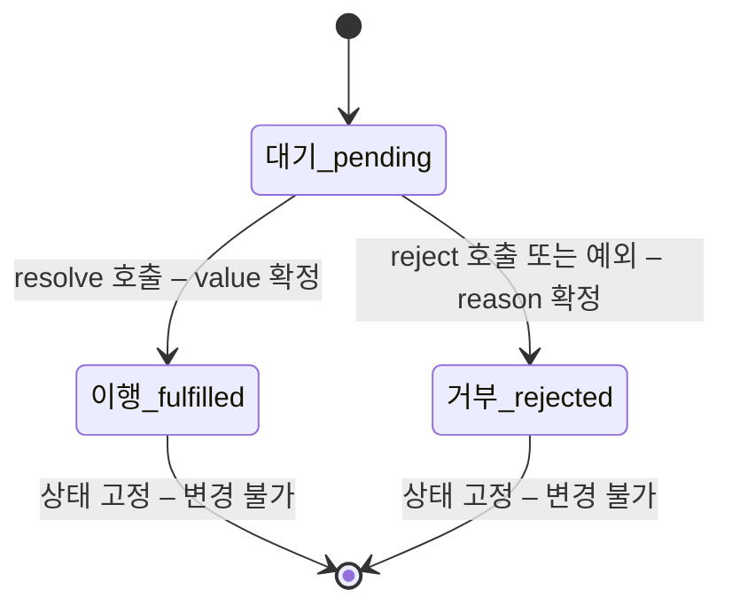
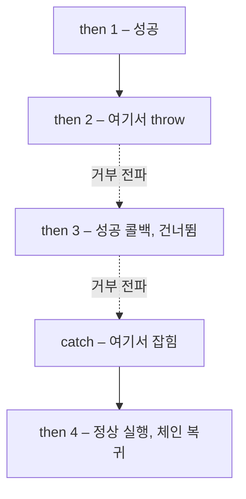

<Callout type="info">
  **이번 문서의 목표:** 이 파일을 다 읽으면 Promise를 "나중에 값이 오는 상자"가 아니라 **한 번만 상태가 바뀌는 기계**로 설명할 수 있고, `then` 체인에서 값과 에러가 어디로 흘러가는지 추적할 수 있으며, 조합 메서드 네 가지를 상황에 맞게 골라 쓸 수 있습니다.
</Callout>

## 1. 콜백이 감당하지 못한 것

### 비동기가 필요한 이유부터

JavaScript는 하나의 **호출 스택**(call stack)으로 코드를 실행합니다. 한 번에 한 가지 일만 합니다. 그런데 서버에서 데이터를 받아오는 일은 수백 밀리초가 걸립니다. 그동안 스택을 붙잡고 기다리면 화면 전체가 얼어붙습니다.

그래서 오래 걸리는 일은 **"끝나면 이 함수를 불러줘"** 라고 부탁하고 즉시 다음 줄로 넘어갑니다. 이때 맡기는 함수를 **콜백**(callback, 되부름 함수)이라 부릅니다.

```js
setTimeout(function () {
  console.log('2초 뒤');
}, 2000);
console.log('먼저 찍힘');
// 출력: 먼저 찍힘 → (2초 후) 2초 뒤
```

동작은 합니다. 문제는 **일이 여러 개 이어질 때** 생깁니다.

### 문제 1 — 중첩의 폭발

```js
사용자조회(1, function (사용자) {
  게시글조회(사용자.id, function (글목록) {
    댓글조회(글목록[0].id, function (댓글들) {
      작성자조회(댓글들[0].작성자id, function (작성자) {
        console.log(작성자.이름);
        // 오른쪽으로 계속 밀려난다...
      });
    });
  });
});
```

절차는 "조회 → 조회 → 조회 → 조회"라는 **직선**인데, 코드 모양은 **오른쪽으로 기울어진 삼각형**입니다. 이 불일치가 콜백 지옥(callback hell) 혹은 **파멸의 피라미드**(pyramid of doom)라 불리는 상태입니다. 게다가 각 단계마다 에러 처리를 붙이면 분기가 두 배로 늘어 읽기가 더 어려워집니다.

### 문제 2 — 제어권을 남에게 넘기는 신뢰성 문제

더 근본적인 문제는 **콜백을 넘기는 순간 호출 시점의 통제권을 상대에게 넘긴다**는 것입니다. 내가 넘긴 함수를 그 라이브러리가 두 번 부를지, 한 번도 안 부를지, 동기적으로 즉시 부를지 나는 알 수 없습니다.

```js
결제요청(주문, function (결과) {
  주문확정();   // 이 함수가 두 번 호출되면 결제가 두 번 확정된다
});
```

이 문제를 방어하려면 "이미 호출됐는지" 플래그를 직접 관리해야 했습니다. 매번, 모든 콜백마다.

> **쉽게 말하면:** 콜백은 "일이 끝나면 나한테 연락해"라고 상대의 손에 내 전화번호를 쥐여주는 방식입니다. 상대가 성실할지, 두 번 걸지, 아예 안 걸지는 내 통제 밖입니다. Promise는 반대로 **내가 번호표를 손에 쥐고 있다가 결과가 나오면 내 쪽에서 확인하는** 방식입니다.

## 2. Promise를 상태 기계로 보기

### 세 가지 상태와 두 번의 전이

**Promise**(프라미스, 약속)는 **비동기 작업의 최종 결과를 나타내는 객체**입니다. 값 자체가 아니라 "값이 언젠가 여기 담긴다"는 **번호표**에 가깝습니다.

이 번호표에는 세 가지 상태(state)가 있습니다.

- **대기**(pending, 펜딩): 아직 결과가 없는 초기 상태.
- **이행**(fulfilled, 풀필드): 작업이 성공해 **결과값**(value)을 갖게 된 상태.
- **거부**(rejected, 리젝티드): 작업이 실패해 **사유**(reason)를 갖게 된 상태.

이행과 거부를 묶어 **처리됨**(settled, 세틀드)이라고 부릅니다. 여기에 Promise 전체를 지탱하는 두 가지 불변 규칙이 붙습니다.

1. **전이는 한 방향으로 단 한 번뿐입니다.** 대기에서 이행 또는 거부로 갈 수 있고, 처리된 뒤에는 절대 바뀌지 않습니다. 이행에서 거부로 넘어가는 일도 없습니다.
2. **결과값도 한 번 정해지면 변하지 않습니다.**



이 두 규칙이 앞서 본 신뢰성 문제를 구조적으로 해결합니다. `resolve`를 두 번 불러도 두 번째 호출은 **조용히 무시됩니다.** 결제가 두 번 확정될 수 없습니다.

```js
const p = new Promise((resolve, reject) => {
  resolve('첫 번째');
  resolve('두 번째');   // 무시됨
  reject(new Error('실패'));  // 역시 무시됨
});
p.then((v) => console.log(v)); // 첫 번째
```

### 생성과 소비

Promise를 직접 만들 때는 **실행자 함수**(executor)를 넘깁니다. 이 함수는 `resolve`와 `reject` 두 개의 함수를 인수로 받으며, **생성자 호출 시점에 즉시 동기적으로 실행됩니다.**

```js
function 지연(밀리초, 값) {
  return new Promise((resolve) => {
    setTimeout(() => resolve(값), 밀리초);
  });
}

지연(1000, '완료').then((결과) => console.log(결과)); // 1초 뒤 완료
```

소비 쪽 메서드는 셋입니다.

- `then(성공콜백, 실패콜백)` — 이행 시 첫 번째, 거부 시 두 번째 콜백을 실행합니다.
- `catch(실패콜백)` — `then(undefined, 실패콜백)`의 축약입니다.
- `finally(콜백)` — 성공·실패와 무관하게 실행되며, **인수를 받지 않고 값도 바꾸지 않습니다.** 로딩 표시를 끄는 것 같은 정리 작업 전용입니다.

<Callout type="warning">
  **자주 틀리는 점:** 실행자 함수는 **즉시 실행**됩니다. `new Promise(...)`를 쓰는 순간 안의 코드가 바로 돌아갑니다. "나중에 실행되는 것"은 실행자가 아니라 **`then`에 등록한 콜백**입니다. 이 구분을 놓치면 출력 순서 예측이 전부 어긋납니다.
</Callout>

## 3. 체이닝 — then은 항상 새 Promise를 반환한다

### 피라미드가 직선으로 펴지는 원리

`then`의 핵심 성질은 하나입니다. **`then`은 언제나 새로운 Promise를 반환합니다.** 그래서 `then`을 계속 이어 붙일 수 있고, 콜백 지옥의 중첩이 평평한 직선이 됩니다.

```js
사용자조회(1)
  .then((사용자) => 게시글조회(사용자.id))
  .then((글목록) => 댓글조회(글목록[0].id))
  .then((댓글들) => 작성자조회(댓글들[0].작성자id))
  .then((작성자) => console.log(작성자.이름))
  .catch((에러) => console.error('어디서든 실패하면 여기로:', 에러));
```

절차의 순서와 코드의 순서가 다시 일치했습니다. 그리고 에러 처리가 **네 군데가 아니라 한 군데**입니다.

### 반환값이 다음 단계를 결정하는 규칙

`then` 콜백이 무엇을 반환하느냐에 따라 새 Promise의 운명이 갈립니다. 이 세 가지 규칙이 체이닝의 전부입니다.

1. **일반 값을 반환**하면 → 새 Promise는 그 값으로 **이행**됩니다.
2. **Promise를 반환**하면 → 새 Promise는 그 Promise가 처리될 때까지 기다렸다가 **같은 결과를 따라갑니다.** 이것을 **채택**(adoption)이라고 부릅니다.
3. **예외를 던지면** → 새 Promise는 그 에러로 **거부**됩니다.

```js
Promise.resolve(1)
  .then((v) => v + 1)                       // 규칙 1 → 2로 이행
  .then((v) => Promise.resolve(v * 10))     // 규칙 2 → 20을 기다려 채택
  .then((v) => { throw new Error(`실패:${v}`); }) // 규칙 3 → 거부
  .then((v) => console.log('건너뜀', v))     // 거부 상태라 실행되지 않음
  .catch((e) => console.log('잡음:', e.message)) // 잡음: 실패:20
  .then(() => console.log('catch 이후에도 체인은 계속된다'));
```

마지막 두 줄이 중요합니다. **`catch`도 새 Promise를 반환하며, 에러를 처리한 뒤에는 체인이 이행 상태로 복귀합니다.** 그래서 `catch` 뒤의 `then`이 실행됩니다. 에러를 잡았다는 것은 "문제를 해결했다"는 선언과 같습니다.

### 흔한 실수: return을 빼먹기

체이닝에서 가장 자주 나오는 버그는 **콜백 안에서 Promise를 만들어 놓고 반환하지 않는 것**입니다.

```js
// 잘못된 코드
조회()
  .then((v) => { 저장(v); })      // 저장이 Promise를 반환해도 무시된다
  .then(() => console.log('저장 완료'));  // 저장이 끝나기 전에 찍힘!

// 올바른 코드
조회()
  .then((v) => 저장(v))           // 반환 → 다음 then이 기다린다
  .then(() => console.log('저장 완료'));
```

화살표 함수에서 중괄호를 쓰면 `return`이 필요하다는 8편의 규칙이 여기서 버그로 나타납니다. `(v) => 저장(v)`는 반환하고, `(v) => { 저장(v); }`는 반환하지 않습니다. 이 한 글자 차이가 "완료 로그가 실제 완료보다 먼저 찍히는" 현상을 만듭니다.

## 4. 에러 전파 경로 추적하기

### 아래로만 흐른다

Promise 체인에서 에러는 **아래로만** 흐릅니다. 어느 단계에서 거부가 발생하면, 그 아래의 성공 콜백들은 전부 건너뛰고 **가장 가까운 실패 처리기**를 찾아 내려갑니다.



### then의 두 번째 인수와 catch는 다르다

둘 다 실패를 처리하지만 **잡을 수 있는 범위가 다릅니다.**

```js
// (A) then의 두 번째 인수 — 같은 then의 성공 콜백에서 난 에러는 못 잡는다
Promise.resolve(1).then(
  () => { throw new Error('성공 콜백 안의 에러'); },
  (e) => console.log('여기서는 안 잡힘')     // 실행되지 않음
);
// 처리되지 않은 거부로 남는다

// (B) catch — 앞선 then의 성공 콜백 에러까지 잡는다
Promise.resolve(1)
  .then(() => { throw new Error('성공 콜백 안의 에러'); })
  .catch((e) => console.log('잡힘:', e.message));  // 잡힘
```

이유는 단순합니다. `then(성공, 실패)`에서 두 실패 처리기는 **같은 단계의 형제**입니다. 형제는 서로의 에러를 볼 수 없습니다. `catch`는 **다음 단계**이므로 앞 단계에서 발생한 모든 거부를 받습니다. 그래서 **체인 끝에 `catch`를 두는 것**이 표준 관용구입니다.

### 처리되지 않은 거부

`catch`가 없는 체인에서 거부가 발생하면 에러가 조용히 사라지지 않고 **처리되지 않은 거부**(unhandled rejection)로 보고됩니다. 브라우저 콘솔에 경고가 뜨고, Node.js 환경에서는 기본적으로 프로세스가 종료됩니다. Promise가 콜백보다 나은 또 하나의 지점입니다 — 콜백 시절에는 에러가 정말로 증발할 수 있었습니다.

<Callout type="warning">
  **자주 틀리는 점:** `finally`는 값을 통과시킬 뿐 바꾸지 않습니다. `finally` 콜백에서 새 값을 반환해도 무시되고, 앞 단계의 값이 그대로 다음으로 갑니다. 다만 `finally` 안에서 **예외를 던지면** 그 에러는 체인을 거부시킵니다. 정리 작업은 실패하지 않게 작성하세요.
</Callout>

## 5. 마이크로태스크 — then 콜백은 언제 실행되는가

Promise를 제대로 쓰려면 **콜백이 언제 실행되는지**를 알아야 합니다. 결론부터 말하면, `then` 콜백은 **현재 실행 중인 동기 코드가 전부 끝난 직후, 그러나 `setTimeout` 같은 타이머보다는 먼저** 실행됩니다.

이 "동기 코드 직후"의 대기줄을 **마이크로태스크 큐**(microtask queue, 잡 큐)라고 부릅니다. `setTimeout`이 들어가는 줄은 **매크로태스크 큐**(macrotask queue, 태스크 큐)이고, 엔진은 **한 번의 태스크가 끝날 때마다 마이크로태스크 큐를 완전히 비웁니다.** 이 우선순위 구조는 27편에서 본격적으로 해부하고, 여기서는 **"then은 즉시가 아니지만 타이머보다는 빠르다"** 만 확실히 잡아 둡시다.

아래 실습기를 **직접 실행해서 출력 순서를 확인**하세요. 예측한 순서와 실제 순서가 다르다면, 그 지점이 바로 당신의 모델에 구멍이 있는 자리입니다.

<CodePlayground
  template="vanilla"
  activeFile="/index.js"
  showConsole
  label="출력 순서 실험 ① — 동기 코드, then, setTimeout의 순서를 직접 확인"
  files={{
    '/index.js': `console.log("1. 동기 시작");

setTimeout(() => console.log("6. setTimeout 콜백 (매크로태스크)"), 0);

const p = new Promise((resolve) => {
  console.log("2. 실행자 함수는 즉시 실행된다");
  resolve("값");
});

p.then((v) => console.log("4. then 콜백 (마이크로태스크)", v));
p.then(() => console.log("5. 두 번째 then도 마이크로태스크"));

console.log("3. 동기 끝");

// 예상 순서를 적어보고 실행해 보세요.
// 실제: 1 → 2 → 3 → 4 → 5 → 6
// 핵심 1: 실행자는 즉시 실행 (2번이 3번보다 먼저)
// 핵심 2: then 콜백은 동기 코드가 끝난 뒤 (4,5번이 3번보다 뒤)
// 핵심 3: 마이크로태스크가 타이머보다 우선 (4,5번이 6번보다 앞)`,
  }}
/>

번호를 붙여 둔 이유는, 실행 결과의 숫자가 **1부터 순서대로 찍히는지** 눈으로 검증하기 위해서입니다. `setTimeout`에 지연 시간을 `0`으로 줬는데도 가장 마지막에 실행된다는 사실이 이 실험의 핵심 결과입니다. "0초 뒤"는 "즉시"가 아니라 **"다음 태스크 차례에"** 라는 뜻입니다.

## 6. 조합 메서드 — 여러 Promise 다루기

Promise 여러 개를 함께 다루는 정적 메서드가 넷 있습니다. **언제 처리되는가**와 **무엇을 돌려주는가**가 각각 다릅니다.

| 메서드 | 완료 시점 | 결과 | 실패 시 |
|--------|----------|------|--------|
| `Promise.all` | 전부 이행되면 | 결과값 배열 – 입력 순서 유지 | 하나라도 거부되면 **즉시** 거부 |
| `Promise.allSettled` | 전부 처리되면 | 상태 객체 배열 | 거부되지 않음 – 실패도 결과에 담김 |
| `Promise.race` | **가장 먼저** 처리되면 | 그 하나의 결과 | 먼저 온 것이 거부면 거부 |
| `Promise.any` | 가장 먼저 **이행**되면 | 그 하나의 값 | 전부 거부되면 AggregateError |

선택 기준을 말로 정리하면 이렇습니다. **모두 성공해야만 의미가 있는 일**이면 `all`입니다. 사용자 정보와 권한 정보를 둘 다 받아야 화면을 그릴 수 있다면 하나가 실패한 순간 기다릴 이유가 없습니다. 반대로 **일부가 실패해도 나머지는 쓸 수 있는 일**이면 `allSettled`입니다. 10개 위젯 중 2개가 실패해도 8개는 보여주는 대시보드가 그 예입니다. `race`는 **타임아웃**을 붙일 때 쓰고, `any`는 **여러 후보 중 가장 빨리 성공한 하나**면 충분할 때 씁니다.

`Promise.all`에서 자주 오해되는 점 하나. **`all`은 작업을 병렬로 실행시키는 도구가 아닙니다.** 배열에 넣는 순간 각 Promise는 이미 시작되어 있습니다. `all`은 그저 "전부 끝나기를 기다리는 문지기"일 뿐입니다. 이 구분은 26편의 순차·병렬 처리에서 결정적으로 중요해집니다.

아래 실습기로 네 메서드의 차이를 한 번에 관찰하세요. 각 지연 시간과 성공·실패 여부를 바꿔가며 결과가 어떻게 달라지는지 실험해 보세요.

<CodePlayground
  template="vanilla"
  activeFile="/index.js"
  showConsole
  label="출력 순서 실험 ② — 조합 메서드 네 가지의 동작 차이"
  files={{
    '/index.js': `// 밀리초 뒤에 성공하는 프라미스
const 성공 = (ms, 이름) =>
  new Promise((resolve) => setTimeout(() => resolve(이름), ms));

// 밀리초 뒤에 실패하는 프라미스
const 실패 = (ms, 이름) =>
  new Promise((_, reject) => setTimeout(() => reject(new Error(이름)), ms));

// 시간과 성공/실패를 바꿔가며 실험해 보세요
Promise.all([성공(100, "A"), 성공(50, "B")])
  .then((r) => console.log("all 성공:", r))       // 순서는 입력 순서 유지
  .catch((e) => console.log("all 실패:", e.message));

Promise.all([성공(100, "A"), 실패(30, "B")])
  .then((r) => console.log("all2 성공:", r))
  .catch((e) => console.log("all2 실패(즉시):", e.message));

Promise.allSettled([성공(100, "A"), 실패(30, "B")])
  .then((r) => console.log("allSettled:", r.map((x) => x.status).join(",")));

Promise.race([성공(100, "느림"), 실패(30, "빠른실패")])
  .then((r) => console.log("race 성공:", r))
  .catch((e) => console.log("race 실패:", e.message));  // 먼저 온 게 실패라 실패

Promise.any([실패(30, "실패1"), 성공(100, "늦은성공")])
  .then((r) => console.log("any 성공:", r));           // 실패는 무시, 성공을 기다림

// race와 any의 결정적 차이: race는 먼저 처리된 것,
// any는 먼저 이행된 것. 위 두 결과를 비교해 보세요.`,
  }}
/>

`race`와 `any`의 차이가 이 실험의 핵심입니다. 같은 입력에서 `race`는 30밀리초에 온 **실패**를 결과로 채택하고, `any`는 그 실패를 무시하고 100밀리초의 **성공**을 기다립니다. "가장 빠른 것"과 "가장 빠른 성공"은 전혀 다른 요구사항입니다.

타임아웃 패턴은 `race`의 대표 용도입니다.

```js
function 시간제한(작업, 밀리초) {
  const 시간초과 = new Promise((_, reject) =>
    setTimeout(() => reject(new Error('시간 초과')), 밀리초)
  );
  return Promise.race([작업, 시간초과]);
}
```

여기서 한 가지 유의점이 있습니다. `race`가 끝나도 **진 쪽의 작업이 취소되지는 않습니다.** Promise에는 취소 기능이 없기 때문입니다. 진 작업은 계속 돌다가 결과를 내놓고, 아무도 그 결과를 보지 않을 뿐입니다.

## 핵심 정리

- Promise는 **대기·이행·거부** 세 상태를 갖는 기계이며, 전이는 **단 한 번, 한 방향**이다. 이 불변 규칙이 콜백의 신뢰성 문제를 구조적으로 없앤다.
- `new Promise`의 **실행자 함수는 즉시 동기 실행**되고, 나중에 실행되는 것은 `then`에 등록한 콜백이다.
- `then`은 항상 **새 Promise를 반환**한다. 값을 반환하면 이행, Promise를 반환하면 그 결과를 채택, 예외를 던지면 거부다. **반환을 빠뜨리면 다음 단계가 기다리지 않는다.**
- 에러는 아래로만 흐르며, `then`의 두 번째 인수는 같은 단계의 에러를 못 잡는다. **체인 끝의 `catch`**가 표준이고, `catch` 이후 체인은 정상 상태로 복귀한다.
- `then` 콜백은 **마이크로태스크**로 예약되어 동기 코드 직후, 타이머보다 먼저 실행된다.
- 조합 메서드는 `all`(전부 성공), `allSettled`(전부 완료), `race`(가장 먼저 처리), `any`(가장 먼저 성공)로 목적이 다르다.

## 마무리 복습

<Quiz
  questionNumber={1}
  question="Promise 실행자 함수 안에서 resolve를 호출한 뒤 다시 reject를 호출하면 어떻게 되는가?"
  options={['거부 상태로 바뀐다', '에러가 발생한다', '두 번째 호출은 무시되고 이행 상태가 유지된다', '대기 상태로 되돌아간다']}
  correctAnswer={3}
  explanation="Promise의 상태 전이는 단 한 번만 일어난다. 이미 처리된 뒤의 resolve나 reject 호출은 조용히 무시된다. 이 규칙이 콜백의 중복 호출 문제를 해결한다."
  optionExplanations={['처리된 상태는 되돌릴 수 없다', '에러가 아니라 무시다', '정답 — 단 한 번의 전이라는 불변 규칙 때문이다', '대기 상태로 되돌아가는 경로는 존재하지 않는다']}
/>

<Quiz
  questionNumber={2}
  question="then 콜백이 중괄호 블록 안에서 다른 Promise를 만들고 반환하지 않았을 때 생기는 현상은?"
  options={['다음 then이 그 작업의 완료를 기다리지 않고 먼저 실행된다', '즉시 TypeError가 발생한다', '체인 전체가 거부된다', '반환 여부와 무관하게 항상 기다린다']}
  correctAnswer={1}
  explanation="then은 콜백의 반환값으로 다음 Promise의 운명을 결정한다. 반환하지 않으면 undefined를 반환한 것이 되어 즉시 이행되고, 다음 단계가 앞질러 실행된다."
  optionExplanations={['정답 — 완료 로그가 실제 완료보다 먼저 찍히는 전형적 버그다', '문법적으로 정상이라 에러가 아니다', '거부가 아니라 undefined로 이행된다', '반환해야만 기다린다']}
/>

<Quiz
  questionNumber={3}
  question="then의 두 번째 인수로 준 실패 콜백이 잡지 못하는 에러는?"
  options={['이전 단계에서 발생한 거부', '같은 then의 첫 번째 성공 콜백 안에서 던진 에러', '앞선 catch에서 다시 던진 에러', '실행자 함수 안에서 던진 에러']}
  correctAnswer={2}
  explanation="두 실패 콜백은 같은 단계의 형제이므로 서로의 에러를 볼 수 없다. 그 에러를 잡으려면 다음 단계인 catch가 필요하다."
  optionExplanations={['이전 단계의 거부는 잡을 수 있다', '정답 — 형제 관계라 서로의 에러를 보지 못한다', '앞 단계에서 온 거부이므로 잡힌다', '실행자의 예외는 거부로 전파되어 잡힌다']}
/>

<Quiz
  questionNumber={4}
  question="동기 코드, then 콜백, setTimeout 0밀리초 콜백의 실행 순서로 옳은 것은?"
  options={['setTimeout → 동기 코드 → then', '동기 코드 → setTimeout → then', '동기 코드 → then → setTimeout', 'then → 동기 코드 → setTimeout']}
  correctAnswer={3}
  explanation="현재 동기 코드가 끝나면 마이크로태스크 큐가 먼저 비워지고, 그 뒤에 타이머 같은 매크로태스크가 실행된다. 0밀리초는 즉시가 아니라 다음 태스크 차례라는 뜻이다."
  optionExplanations={['타이머가 동기 코드보다 먼저일 수 없다', 'then이 타이머보다 우선이다', '정답 — 마이크로태스크가 매크로태스크보다 우선한다', '동기 코드가 가장 먼저다']}
/>

<Quiz
  questionNumber={5}
  question="10개의 요청 중 일부가 실패해도 성공한 것들의 결과는 모두 받아야 할 때 적합한 메서드는?"
  options={['Promise.all', 'Promise.allSettled', 'Promise.race', 'Promise.any']}
  correctAnswer={2}
  explanation="allSettled는 거부되지 않고 모든 결과를 상태 객체 배열로 돌려준다. all은 하나만 실패해도 즉시 거부되어 나머지 결과를 얻을 수 없다."
  optionExplanations={['하나라도 실패하면 즉시 거부된다', '정답 — 성공과 실패를 모두 담아 돌려준다', '가장 먼저 처리된 하나만 얻는다', '가장 먼저 성공한 하나만 얻는다']}
/>

<Quiz
  questionNumber={6}
  question="Promise.race와 Promise.any의 차이로 옳은 것은?"
  options={['race는 가장 먼저 처리된 것을, any는 가장 먼저 이행된 것을 채택한다', 'race는 배열만, any는 이터러블 전체를 받는다', 'race는 결과 배열을, any는 단일 값을 돌려준다', '둘은 동작이 완전히 같고 이름만 다르다']}
  correctAnswer={1}
  explanation="race는 이행이든 거부든 먼저 처리된 결과를 그대로 채택하지만, any는 거부를 무시하고 첫 이행을 기다린다. 전부 거부되면 any는 AggregateError로 거부된다."
  optionExplanations={['정답 — 먼저와 먼저 성공은 다른 요구사항이다', '둘 다 이터러블을 받는다', '둘 다 단일 값을 돌려준다', '실패를 다루는 방식이 근본적으로 다르다']}
/>

<Quiz
  questionNumber={7}
  question="Promise.all에 대한 설명으로 틀린 것은?"
  options={['결과 배열의 순서는 완료 순서가 아니라 입력 순서를 따른다', '하나가 거부되면 나머지를 기다리지 않고 즉시 거부된다', 'all이 호출되는 순간부터 각 작업이 병렬로 시작된다', '이터러블이면 배열이 아니어도 받을 수 있다']}
  correctAnswer={3}
  explanation="배열에 담기는 시점에 각 Promise는 이미 시작되어 있다. all은 작업을 시작시키는 도구가 아니라 완료를 기다리는 문지기다."
  optionExplanations={['입력 순서가 유지되는 것이 맞다', '즉시 거부되는 것이 맞다', '정답(틀린 설명) — 시작은 Promise 생성 시점에 이미 일어났다', '이터레이션 프로토콜로 인수를 훑으므로 맞다']}
/>

<Quiz
  questionNumber={8}
  question="catch로 에러를 처리한 직후에 연결한 then은 어떻게 되는가?"
  options={['실행되지 않는다 – 체인이 종료되었기 때문', '정상적으로 실행된다 – catch가 새 Promise를 이행 상태로 반환하기 때문', '항상 거부 상태로 실행된다', '원래 에러를 인수로 받아 실행된다']}
  correctAnswer={2}
  explanation="catch도 새 Promise를 반환하며, 에러를 처리하고 정상 반환하면 그 Promise는 이행 상태가 된다. 따라서 이후 then이 정상 실행되며 체인이 복구된다."
  optionExplanations={['체인은 종료되지 않는다', '정답 — 에러 처리는 곧 정상 상태로의 복귀다', 'catch 안에서 다시 던지지 않는 한 거부가 아니다', 'catch의 반환값을 받는다']}
/>

## 참고 자료

- [MDN - Using promises](https://developer.mozilla.org/en-US/docs/Web/JavaScript/Guide/Using_promises)
- [MDN - Promise](https://developer.mozilla.org/en-US/docs/Web/JavaScript/Reference/Global_Objects/Promise)
- [MDN - Event loop](https://developer.mozilla.org/en-US/docs/Web/JavaScript/Event_loop)
- [ECMAScript Language Specification](https://262.ecma-international.org/)
