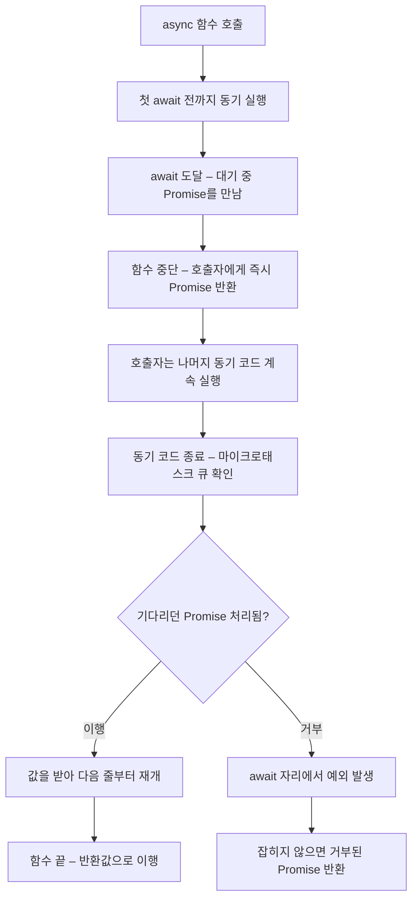

<Callout type="info">
  **이번 문서의 목표:** 이 파일을 다 읽으면 `await` 한 줄이 함수를 어디서 어떻게 중단시키는지 설명할 수 있고, 실수로 순차 실행이 되어 느려진 코드를 병렬로 고칠 수 있으며, async 함수의 에러가 어느 경로로 전파되는지 추적할 수 있습니다.
</Callout>

## 1. 체인도 완벽하지는 않았다

25편에서 Promise가 콜백 지옥을 평평하게 폈습니다. 그런데 `then` 체인에도 남은 불편이 있었습니다.

```js
function 주문처리(주문번호) {
  let 주문;   // 아래 단계에서도 써야 해서 바깥에 변수를 만들어 둔다
  return 주문조회(주문번호)
    .then((결과) => {
      주문 = 결과;                 // 손으로 옮겨 담기
      return 재고확인(주문.상품id);
    })
    .then((재고) => {
      if (재고 < 주문.수량) throw new Error('재고 부족');
      return 결제(주문);
    })
    .then((영수증) => ({ 주문, 영수증 }));
}
```

문제는 셋입니다.

1. **값이 단계를 건너뛰지 못합니다.** 1단계 결과를 3단계에서 쓰려면 바깥 변수에 손으로 옮겨야 합니다.
2. **조건문·반복문과 어울리지 않습니다.** "결과에 따라 조회를 반복한다" 같은 로직을 체인으로 표현하면 재귀나 `reduce` 곡예가 필요합니다.
3. **콜백 함수 껍데기가 계속 반복됩니다.** 실제 로직보다 `.then((x) => ...)`이라는 포장이 더 눈에 띕니다.

**async/await**(에이싱크 어웨이트)는 이 셋을 한 번에 해결합니다. 위 코드를 다시 쓰면 이렇게 됩니다.

```js
async function 주문처리(주문번호) {
  const 주문 = await 주문조회(주문번호);
  const 재고 = await 재고확인(주문.상품id);
  if (재고 < 주문.수량) throw new Error('재고 부족');
  const 영수증 = await 결제(주문);
  return { 주문, 영수증 };
}
```

변수는 그냥 `const`로 선언하고, 조건문은 그냥 `if`로 씁니다. 겉모습이 완전히 동기 코드입니다.

> **쉽게 말하면:** `then` 체인이 "택배가 오면 이걸 해줘"라는 **부탁의 연속**이라면, `await`는 "택배 올 때까지 여기서 기다릴게"라고 **함수 자신이 잠드는 것**입니다. 잠든 사이 프로그램 전체는 멈추지 않고 다른 일을 합니다.

<Callout type="warning">
  **가장 중요한 오해:** async/await는 Promise를 **대체하지 않습니다.** 그 위에 얹은 **문법 설탕**(syntactic sugar, 읽기 좋게 만든 문법)입니다. 안에서 돌아가는 것은 여전히 Promise이고, 25편의 상태 기계 규칙이 그대로 적용됩니다. 이 사실을 잊으면 "왜 async 함수의 반환값을 그냥 못 쓰지?" 같은 벽에 부딪힙니다.
</Callout>

## 2. async 함수 — 무조건 Promise를 반환한다

`async` 키워드를 붙인 함수는 **반환값이 무엇이든 Promise로 감싸서** 돌려줍니다. 예외 없습니다.

```js
async function 값하나() { return 42; }

console.log(값하나());          // Promise { 42 } — 42가 아니다!
값하나().then((v) => console.log(v));  // 42
```

이 규칙은 두 가지 하위 규칙으로 갈라집니다.

- **일반 값을 반환**하면 → 그 값으로 **이행된** Promise가 됩니다.
- **함수 안에서 예외를 던지면** → 그 에러로 **거부된** Promise가 됩니다. 함수 밖으로 예외가 튀어나오지 않습니다.

```js
async function 던지기() { throw new Error('실패'); }

// try { 던지기(); } catch (e) {}   // 잡히지 않는다! 예외가 밖으로 안 나옴
던지기().catch((e) => console.log('여기서 잡힘:', e.message));
```

두 번째 줄이 async 함수 에러 처리의 출발점입니다. **async 함수의 실패는 예외가 아니라 거부된 Promise로 나옵니다.** 그래서 호출부에서 `try/catch`로 잡으려면 `await`를 붙여 다시 예외로 되돌려야 합니다.

이미 Promise인 값을 반환하면 어떻게 될까요? 25편의 **채택**(adoption) 규칙이 그대로 적용되어, 이중으로 감싸지지 않고 그 Promise의 결과를 따라갑니다.

```js
async function 중첩없음() { return Promise.resolve(7); }
중첩없음().then((v) => console.log(v));   // 7 — Promise가 아니라 7
```

## 3. await — 정확히 무엇을 멈추는가

### 멈추는 것은 함수 하나뿐이다

`await`는 **오직 async 함수 안에서만** 쓸 수 있습니다(모듈 최상위는 예외 — 뒤에서 다룹니다). 하는 일은 이렇습니다.

1. 오른쪽 값이 Promise면 **처리될 때까지 이 함수의 실행을 중단**합니다.
2. 이행되면 그 **값**을 `await` 표현식의 결과로 내놓고 다음 줄부터 재개합니다.
3. 거부되면 그 자리에서 **예외를 던집니다.**

여기서 절대 오해하면 안 되는 것: **중단되는 것은 이 async 함수뿐이고, 프로그램 전체는 멈추지 않습니다.** async 함수는 `await`를 만나면 **자기 자리를 호출한 쪽에 즉시 돌려주고** 물러납니다. 호출자는 아직 처리되지 않은 Promise를 손에 쥐고 자기 할 일을 계속합니다.

```js
async function 작업() {
  console.log('A');
  await null;          // Promise가 아니어도 여기서 한 번 물러난다
  console.log('C');    // 재개 지점
}

작업();
console.log('B');
// 출력: A → B → C
```

`await null`처럼 **Promise가 아닌 값을 기다려도 중단은 일어납니다.** 엔진이 그 값을 `Promise.resolve`로 감싸기 때문입니다. 그래서 `await` 아래 줄은 **항상 마이크로태스크로 미뤄집니다.** 이 성질이 27편의 출력 순서 문제에서 결정적 역할을 합니다.

### 제너레이터로 보는 정체

`await`가 "멈췄다 이어진다"는 설명, 어디서 보셨죠? 24편의 `yield`입니다. 실제로 async 함수는 **제너레이터와 같은 중단·재개 기계 위에 세워졌습니다.** 대응 관계는 이렇습니다.

| 제너레이터 | async 함수 |
|-----------|-----------|
| `function*` 선언 | `async function` 선언 |
| `yield`에서 중단 | `await`에서 중단 |
| 외부에서 `next()`로 재개 | Promise가 처리되면 **자동** 재개 |
| `next(값)`으로 값을 주입 | 이행된 값이 자동 주입 |
| 반환값은 이터레이터 리절트 | 반환값은 Promise |

차이는 **재개를 누가 시키느냐**뿐입니다. 제너레이터는 사람이 `next()`를 눌러야 하고, async 함수는 Promise가 처리되는 순간 엔진이 알아서 눌러 줍니다. async/await가 표준이 되기 전, 개발자들이 제너레이터와 라이브러리를 조합해 똑같은 코드 모양을 만들어 쓰던 시절이 있었고, 그 관용구가 언어에 흡수된 것이 지금의 async/await입니다.



### 첫 await 이전은 동기다

자주 놓치는 사실 하나. **async 함수는 호출되는 즉시 첫 `await`를 만날 때까지 동기적으로 실행됩니다.** "async가 붙었으니 나중에 실행되겠지"는 틀린 모델입니다.

```js
async function 확인() {
  console.log('1. 호출 즉시 실행됨');
  await 지연(0);
  console.log('3. 재개 후');
}
확인();
console.log('2. 호출 다음 줄');
// 1 → 2 → 3
```

## 4. 출력 순서 실험 — await의 중단 지점 증명하기

말로 이해한 모델을 눈으로 확인할 차례입니다. 아래 실습기를 **실행 버튼으로 직접 돌려** 번호가 1부터 순서대로 찍히는지 확인하세요. 예측이 틀린 지점이 곧 모델의 구멍입니다.

<CodePlayground
  template="vanilla"
  activeFile="/index.js"
  showConsole
  label="출력 순서 실험 ① — await는 정확히 어디서 멈추는가"
  files={{
    '/index.js': `async function 안쪽() {
  console.log("2. 안쪽 함수 시작 — 호출 즉시 동기 실행");
  await null;                       // 여기서 물러난다
  console.log("6. 안쪽 함수 재개 — 마이크로태스크로 미뤄짐");
}

async function 바깥() {
  console.log("1. 바깥 함수 시작");
  await 안쪽();                     // 안쪽의 완료를 기다린다
  console.log("7. 바깥 함수 재개");
}

바깥();

Promise.resolve().then(() => console.log("5. 먼저 예약된 마이크로태스크"));

setTimeout(() => console.log("8. 타이머 — 항상 마지막"), 0);

console.log("3. 동기 코드 계속");
console.log("4. 동기 코드 끝");

// 실행 전에 예상 순서를 적어보세요.
// 실제: 1 → 2 → 3 → 4 → 5 → 6 → 7 → 8
//
// 왜 5가 6보다 먼저인가?
//   안쪽의 await null이 마이크로태스크를 예약한 시점보다
//   Promise.resolve().then 이 늦게 등록됐는데도...
//   실제로는 바깥의 await 안쪽() 이 한 겹 더 대기를 만들어
//   6번이 5번보다 뒤로 밀린다. 큐는 등록 순서대로 처리된다.
//
// await null 을 지우고 다시 실행해 순서가 어떻게 바뀌는지 확인해 보세요.`,
  }}
/>

이 실험에서 확인해야 할 세 가지입니다.

- **1과 2가 동기 코드 3보다 먼저**입니다. async 함수 몸통은 첫 `await`까지 즉시 실행됩니다.
- **6과 7은 동기 코드가 전부 끝난 뒤**입니다. `await` 아래 줄은 마이크로태스크로 미뤄집니다.
- **8은 항상 마지막**입니다. 타이머는 매크로태스크라, 마이크로태스크 큐가 완전히 빌 때까지 차례가 오지 않습니다.

`await null`을 지우고 다시 실행해 보면 6번이 훨씬 앞으로 당겨집니다. **`await`가 하나 늘어날 때마다 그 아래 코드는 마이크로태스크 한 단계씩 뒤로 밀립니다.** 이것이 "await의 중단 지점"의 실체입니다.

## 5. 순차와 병렬 — 가장 값비싼 실수

### 무심코 만드는 3배 느린 코드

async/await의 가독성에는 함정이 딸려 옵니다. 코드가 동기처럼 보이니, **원래 동시에 해도 될 일까지 줄 세워 버리기 쉽습니다.**

```js
// 순차 — 총 3초
async function 느림() {
  const a = await 지연(1000, 'A');   // 1초 기다림
  const b = await 지연(1000, 'B');   // A가 끝난 뒤 또 1초
  const c = await 지연(1000, 'C');   // 또 1초
  return [a, b, c];
}
```

A·B·C는 서로 아무 관계가 없는데도, `await`가 함수를 멈춰 세우는 바람에 B는 A가 끝날 때까지 **시작조차 하지 못합니다.**

고치는 방법의 핵심은 **시작과 대기를 분리하는 것**입니다. Promise는 생성되는 순간 이미 작업이 시작되므로, 먼저 전부 만들어 두고 나중에 한꺼번에 기다리면 됩니다.

```js
// 병렬 — 총 1초
async function 빠름() {
  const pA = 지연(1000, 'A');    // await 없이 시작만
  const pB = 지연(1000, 'B');
  const pC = 지연(1000, 'C');
  return [await pA, await pB, await pC];   // 이미 동시에 달리는 중
}

// 관용구 — Promise.all과 디스트럭처링
async function 더깔끔() {
  const [a, b, c] = await Promise.all([
    지연(1000, 'A'),
    지연(1000, 'B'),
    지연(1000, 'C'),
  ]);
  return [a, b, c];
}
```

25편에서 짚은 "`all`은 시작시키는 도구가 아니다"가 여기서 실감납니다. 병렬을 만든 것은 `Promise.all`이 아니라 **`await` 없이 함수를 먼저 호출한 것**입니다. `all`은 그저 기다리는 방법일 뿐입니다.

<Callout type="warning">
  **자주 틀리는 점:** `forEach`에 async 콜백을 넘기면 기다리지 않습니다. `forEach`는 콜백의 반환값을 버리기 때문에, 반환된 Promise가 그대로 증발합니다. 순차로 기다리려면 `for...of` 안에서 `await`를, 병렬이면 `map`으로 Promise 배열을 만들어 `Promise.all`에 넘기세요.
</Callout>

```js
// 잘못된 코드 — 즉시 "끝"이 찍힌다
[1, 2, 3].forEach(async (n) => { await 저장(n); });
console.log('끝');

// 순차 처리 — 앞이 끝나야 다음이 시작
for (const n of [1, 2, 3]) { await 저장(n); }

// 병렬 처리 — 전부 시작해 두고 한꺼번에 대기
await Promise.all([1, 2, 3].map((n) => 저장(n)));
```

### 언제 순차여야 하는가

병렬이 항상 옳은 것은 아닙니다. **뒤 작업이 앞 결과에 의존하면** 순차가 유일한 선택입니다. 앞의 `주문처리`에서 재고 확인은 주문 조회 결과의 상품 id가 있어야 시작할 수 있습니다. 판단 기준은 단순합니다 — **다음 줄이 앞 줄의 값을 쓰는가?** 쓰지 않는다면 병렬로 만들 수 있습니다.

아래 실습기에서 순차와 병렬의 시간 차이를 직접 측정해 보세요.

<CodePlayground
  template="vanilla"
  activeFile="/index.js"
  showConsole
  label="출력 순서 실험 ② — 순차와 병렬의 시간 차이를 측정하기"
  files={{
    '/index.js': `const 지연 = (ms, 이름) =>
  new Promise((resolve) => setTimeout(() => {
    console.log("   완료:", 이름, ms + "ms");
    resolve(이름);
  }, ms));

async function 순차() {
  const 시작 = Date.now();
  console.log("[순차 시작]");
  const a = await 지연(300, "A");
  const b = await 지연(300, "B");
  const c = await 지연(300, "C");
  console.log("[순차 결과]", [a, b, c], "걸린 시간:", Date.now() - 시작, "ms");
}

async function 병렬() {
  const 시작 = Date.now();
  console.log("[병렬 시작]");
  const [a, b, c] = await Promise.all([
    지연(300, "A"),
    지연(300, "B"),
    지연(300, "C"),
  ]);
  console.log("[병렬 결과]", [a, b, c], "걸린 시간:", Date.now() - 시작, "ms");
}

async function 잘못된_forEach() {
  console.log("[forEach 시작]");
  [1, 2].forEach(async (n) => { await 지연(100, "forEach-" + n); });
  console.log("[forEach 끝] — 기다리지 않고 즉시 찍힘!");
}

(async () => {
  await 순차();      // 약 900ms
  await 병렬();      // 약 300ms
  await 잘못된_forEach();
})();

// 지연 시간을 바꿔가며 총 시간이 어떻게 변하는지 실험해 보세요.
// 순차는 시간의 합, 병렬은 가장 긴 하나에 수렴합니다.`,
  }}
/>

측정값이 말해주는 결론입니다. **순차의 총 시간은 각 작업 시간의 합이고, 병렬의 총 시간은 가장 긴 하나에 수렴합니다.** 작업이 세 개일 때는 3배 차이지만, 열 개면 10배 차이가 됩니다. 그리고 `잘못된_forEach`의 "끝" 로그가 완료 로그보다 먼저 찍히는 것도 확인하세요.

## 6. 에러 전파 경로

### try/catch가 다시 돌아온다

`await`가 거부를 예외로 바꿔주기 때문에, 비동기 코드에서 **동기 코드와 똑같은 `try/catch`** 를 쓸 수 있습니다. 이것이 async/await의 두 번째 큰 이득입니다.

```js
async function 안전조회(id) {
  try {
    const 결과 = await 조회(id);
    return 결과;
  } catch (에러) {
    console.error('조회 실패:', 에러.message);
    return null;                   // 기본값으로 복구
  } finally {
    로딩숨기기();                   // 성공·실패 무관하게 실행
  }
}
```

### 놓치기 쉬운 세 가지 함정

**함정 1 — `await` 없는 호출은 잡히지 않습니다.**

```js
async function 잘못() {
  try {
    던지는함수();      // await가 없다
  } catch (e) {
    // 절대 실행되지 않음 — 거부된 Promise가 만들어졌을 뿐 예외가 아님
  }
}
```

`try/catch`는 **예외**를 잡습니다. `await` 없이 async 함수를 호출하면 거부된 Promise가 반환될 뿐 예외는 발생하지 않습니다. 이 상태로 두면 처리되지 않은 거부가 됩니다.

**함정 2 — `Promise.all`은 첫 실패만 전달합니다.** 나머지 작업이 어떻게 됐는지 알고 싶다면 `allSettled`를 써야 합니다.

**함정 3 — 병렬 시작 후 나중에 `await`하면 처리되지 않은 거부가 생길 수 있습니다.**

```js
const pA = 실패하는작업();      // 여기서 이미 거부됨
const pB = 오래걸리는작업();
await pB;                       // pB를 기다리는 동안
await pA;                       // pA의 거부는 아무도 안 보고 있었다
```

엔진은 거부된 Promise에 처리기가 붙지 않은 순간을 경고로 보고할 수 있습니다. 병렬 패턴에서는 `Promise.all`이나 `allSettled`로 **한 번에 묶어 기다리는 것**이 안전합니다.

### 최상위에서의 처리

async 함수는 결국 어딘가에서 `await` 없이 호출됩니다. 그 최상위 지점에는 반드시 `catch`를 붙여야 합니다.

```js
주요작업()
  .then(() => console.log('정상 종료'))
  .catch((e) => console.error('최종 에러 처리:', e));
```

모듈(ESM) 환경에서는 **top-level await**(최상위 await)가 허용되어 함수로 감싸지 않고도 `await`를 쓸 수 있습니다. 이 기능과 모듈 평가 순서의 관계는 29편에서 다룹니다.

## 핵심 정리

- `async` 함수는 **무엇을 반환하든 Promise를 반환**한다. 값이면 이행, 던진 예외면 거부다. 실패가 예외가 아니라 거부로 나온다는 점이 에러 처리의 출발점이다.
- `await`는 **그 함수 하나만** 중단시키고 호출자에게 제어를 즉시 돌려준다. 프로그램 전체가 멈추는 것이 아니다.
- async 함수는 **첫 `await`까지 동기 실행**되고, `await` 아래 줄은 마이크로태스크로 미뤄진다. Promise가 아닌 값을 기다려도 중단은 일어난다.
- 실행 모델은 제너레이터와 같다 — 차이는 **재개를 사람이 시키느냐 엔진이 시키느냐**뿐이다.
- 서로 의존하지 않는 작업을 줄줄이 `await`하면 시간이 합산된다. **시작과 대기를 분리**하거나 `Promise.all`로 묶어라. `forEach`에 async 콜백을 넘기면 기다리지 않는다.
- `await` 덕분에 `try/catch/finally`가 그대로 통한다. 단, **`await` 없이 호출한 async 함수의 실패는 `try/catch`에 잡히지 않는다.**

## 마무리 복습

<Quiz
  questionNumber={1}
  question="async 함수가 숫자 42를 return 했을 때 호출 결과로 얻는 값은?"
  options={['숫자 42', '42로 이행된 Promise', 'undefined', '실행 환경에 따라 다르다']}
  correctAnswer={2}
  explanation="async 함수는 반환값이 무엇이든 Promise로 감싸 반환한다. 값을 꺼내려면 await하거나 then을 붙여야 한다."
  optionExplanations={['값 자체가 아니라 감싸인 형태로 나온다', '정답 — 예외 없이 항상 Promise다', 'return 값이 있으므로 undefined가 아니다', '명세로 정해진 결정적 동작이다']}
/>

<Quiz
  questionNumber={2}
  question="await 오른쪽에 Promise가 아닌 일반 값을 두면 어떻게 되는가?"
  options={['문법 에러가 발생한다', '중단 없이 즉시 다음 줄이 실행된다', '값이 Promise로 감싸져 한 번 중단되었다가 마이크로태스크로 재개된다', '해당 값이 무시되고 undefined가 된다']}
  correctAnswer={3}
  explanation="엔진이 값을 이행된 Promise로 감싸기 때문에 중단이 일어난다. 따라서 await 아래 코드는 항상 마이크로태스크로 미뤄진다."
  optionExplanations={['일반 값도 await할 수 있다', '중단은 반드시 일어난다', '정답 — 이 성질이 출력 순서 문제의 핵심이다', '값은 그대로 표현식 결과가 된다']}
/>

<Quiz
  questionNumber={3}
  question="async 함수를 호출했을 때 함수 몸통의 첫 줄이 실행되는 시점은?"
  options={['호출 즉시 동기적으로 실행된다', '현재 동기 코드가 모두 끝난 뒤 실행된다', '첫 await가 처리된 뒤에 실행된다', '타이머 콜백과 같은 시점에 실행된다']}
  correctAnswer={1}
  explanation="async 함수는 호출되는 즉시 첫 await를 만날 때까지 동기적으로 실행된다. 미뤄지는 것은 await 아래의 코드다."
  optionExplanations={['정답 — 첫 await 전까지는 완전히 동기다', '첫 await 아래 코드가 그렇게 미뤄진다', '첫 줄은 그보다 훨씬 먼저 실행된다', '타이머보다 훨씬 먼저다']}
/>

<Quiz
  questionNumber={4}
  question="서로 의존하지 않는 세 개의 1초짜리 작업을 각각 await로 줄줄이 기다렸을 때 총 소요 시간은?"
  options={['약 1초', '약 2초', '약 3초', '작업 순서에 따라 달라진다']}
  correctAnswer={3}
  explanation="await가 함수를 멈추므로 다음 작업은 앞 작업이 끝난 뒤에야 시작된다. 순차 실행의 총 시간은 각 작업 시간의 합이다."
  optionExplanations={['병렬로 만들었을 때의 시간이다', '두 개일 때의 순차 시간이다', '정답 — 시작 자체가 지연되어 시간이 합산된다', '순서와 무관하게 합이 된다']}
/>

<Quiz
  questionNumber={5}
  question="배열의 forEach에 async 콜백을 넘기고 그 아래에 완료 로그를 두면 어떻게 되는가?"
  options={['모든 작업이 끝난 뒤 로그가 찍힌다', '작업 완료를 기다리지 않고 로그가 먼저 찍힌다', 'forEach가 에러를 던진다', '첫 번째 작업만 기다린 뒤 로그가 찍힌다']}
  correctAnswer={2}
  explanation="forEach는 콜백의 반환값을 버리므로 반환된 Promise가 무시된다. 기다리려면 for...of 안에서 await하거나 map과 Promise.all을 조합해야 한다."
  optionExplanations={['forEach는 기다리지 않는다', '정답 — 반환된 Promise가 그대로 버려진다', '문법상 정상이라 에러는 없다', '어떤 작업도 기다리지 않는다']}
/>

<Quiz
  questionNumber={6}
  question="try 블록 안에서 async 함수를 await 없이 호출했고 그 함수가 실패했다면?"
  options={['catch 블록이 정상적으로 실행된다', 'catch 블록이 실행되지 않고 처리되지 않은 거부가 된다', '함수 호출 자체가 문법 에러다', 'finally만 실행된다']}
  correctAnswer={2}
  explanation="await가 없으면 거부된 Promise가 반환될 뿐 예외가 발생하지 않는다. try/catch는 예외만 잡으므로 catch가 실행되지 않고, 처리기가 없는 거부로 남는다."
  optionExplanations={['예외가 아니므로 잡히지 않는다', '정답 — await가 거부를 예외로 바꿔주는 역할을 한다', '호출 자체는 정상이다', 'finally는 실행되지만 에러는 잡히지 않는다']}
/>

<Quiz
  questionNumber={7}
  question="async 함수와 제너레이터의 관계에 대한 설명으로 옳은 것은?"
  options={['둘은 아무 관련이 없는 별개의 기능이다', '중단과 재개라는 실행 모델을 공유하며, 재개를 엔진이 자동으로 시킨다는 점이 다르다', 'async 함수는 내부적으로 반드시 제너레이터를 선언해야 한다', '제너레이터는 Promise를 반환하고 async 함수는 이터레이터를 반환한다']}
  correctAnswer={2}
  explanation="yield와 await는 모두 함수를 중단하고 재개하는 지점이다. 차이는 제너레이터가 외부의 next 호출로 재개되는 반면, async 함수는 Promise가 처리되면 엔진이 자동으로 재개한다는 점이다."
  optionExplanations={['같은 중단·재개 기계 위에 서 있다', '정답 — 재개의 주체가 유일한 본질적 차이다', '문법적으로 제너레이터를 쓸 필요는 없다', '반환 타입 설명이 서로 뒤바뀌었다']}
/>

<Quiz
  questionNumber={8}
  question="이미 시작된 세 개의 작업을 병렬로 기다릴 때 처리되지 않은 거부를 피하는 가장 안전한 방법은?"
  options={['각 Promise를 순서대로 하나씩 await 한다', 'Promise.all이나 Promise.allSettled로 한 번에 묶어 기다린다', '모든 await를 제거한다', 'setTimeout으로 대기 시간을 벌어둔다']}
  correctAnswer={2}
  explanation="하나씩 순서대로 await하면 뒤쪽 Promise가 먼저 거부되었을 때 처리기가 붙기 전에 미처리 거부로 보고될 수 있다. 조합 메서드로 한 번에 묶으면 모든 Promise에 처리기가 즉시 연결된다."
  optionExplanations={['앞을 기다리는 동안 뒤의 거부가 방치될 수 있다', '정답 — 모든 Promise에 처리기가 동시에 붙는다', 'await를 없애면 결과를 쓸 수 없다', '대기 시간은 해결책이 아니다']}
/>

## 참고 자료

- [MDN - async function](https://developer.mozilla.org/en-US/docs/Web/JavaScript/Reference/Statements/async_function)
- [MDN - await](https://developer.mozilla.org/en-US/docs/Web/JavaScript/Reference/Operators/await)
- [MDN - Using promises](https://developer.mozilla.org/en-US/docs/Web/JavaScript/Guide/Using_promises)
- [MDN - Event loop](https://developer.mozilla.org/en-US/docs/Web/JavaScript/Event_loop)
- [ECMAScript Language Specification](https://262.ecma-international.org/)
