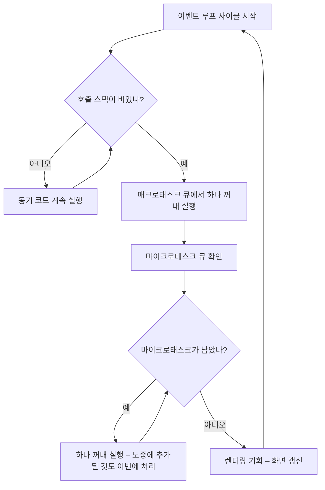

<Callout type="info">
  **이번 문서의 목표:** 이 파일을 다 읽으면 동기 코드·`then`·`await`·`setTimeout`이 뒤섞인 코드의 출력 순서를 **연필로 추적해 정확히 예측**할 수 있고, `setTimeout` 0밀리초가 왜 즉시가 아닌지, 마이크로태스크가 왜 화면을 얼릴 수 있는지 설명할 수 있습니다.
</Callout>

## 1. 싱글 스레드인데 어떻게 동시에 일하는가

### 먼저 오해부터 걷어냅니다

"JavaScript는 싱글 스레드(single thread, 단일 실행 흐름)다"라는 말을 들어보셨을 겁니다. 맞는 말이지만 절반만 맞습니다. 정확히는 **JavaScript 코드를 실행하는 흐름이 하나**라는 뜻입니다. 타이머를 세는 일, 네트워크 요청을 보내는 일, 파일을 읽는 일은 **JavaScript 코드가 아닙니다.** 그 일들은 브라우저나 Node.js 같은 **호스트 환경**(host environment)이 자기 스레드로 처리합니다.

그래서 전체 구조는 이렇게 나뉩니다.

- **JavaScript 엔진**: 코드를 실행합니다. 호출 스택 하나. 한 번에 하나만.
- **호스트 환경**: 타이머·네트워크·DOM 이벤트 등을 담당합니다. 여러 일을 동시에 처리할 수 있습니다.
- **큐**(queue, 대기줄): 호스트가 "이 콜백을 실행할 차례가 됐다"고 알릴 때 콜백을 넣어두는 줄.
- **이벤트 루프**(event loop): 스택이 비면 큐에서 하나를 꺼내 스택에 올리는, 쉬지 않고 도는 감시자.

> **쉽게 말하면:** 요리사(엔진)는 한 명입니다. 하지만 주방에는 오븐과 타이머(호스트)가 여러 개 있습니다. 요리사는 오븐에 넣어두고 다른 일을 하다가, "땡" 소리가 나면(큐에 들어오면) 그때 가서 꺼냅니다. 요리사가 한 명인데도 여러 요리가 동시에 진행되는 이유입니다.

### 호출 스택 복습

**호출 스택**(call stack)은 지금 실행 중인 함수들을 쌓아 둔 접시 더미입니다. 함수를 호출하면 위에 쌓이고, 끝나면 걷힙니다. 9편에서 실행 컨텍스트로 다룬 그 구조입니다. 이벤트 루프 이야기에서 중요한 것은 단 하나 — **스택이 완전히 비어야 큐에서 무언가를 꺼내 올릴 수 있다**는 규칙입니다. 실행 중인 함수를 중간에 끊고 콜백을 끼워 넣는 일은 절대 없습니다. 이 성질을 **실행 완료 보장**(run-to-completion)이라 부릅니다.

## 2. 두 개의 큐, 그리고 우선순위

### 태스크와 마이크로태스크

대기줄이 하나가 아니라는 점이 이 편의 핵심입니다. 성격이 다른 두 종류의 줄이 있고, **우선순위가 다릅니다.**

**매크로태스크 큐**(macrotask queue, 태스크 큐 또는 이벤트 큐)에 들어가는 것들:
- `setTimeout`, `setInterval`의 콜백
- DOM 이벤트 핸들러(클릭, 입력 등)
- 네트워크 응답 이벤트

**마이크로태스크 큐**(microtask queue, 명세 용어로는 잡 큐 – job queue)에 들어가는 것들:
- `then`, `catch`, `finally`에 등록한 콜백
- `await` 아래의 재개 코드
- `queueMicrotask`로 직접 예약한 함수
- `MutationObserver` 콜백

두 줄의 관계를 한 문장으로 요약하면 이렇습니다. **매크로태스크를 하나 처리할 때마다, 마이크로태스크 큐를 완전히 비운다.**



이 그림에서 반드시 붙잡아야 할 세 가지입니다.

1. **마이크로태스크는 하나가 아니라 큐가 빌 때까지 전부** 처리됩니다. 처리 도중에 새 마이크로태스크가 추가되면 그것도 **이번 차례에** 처리합니다.
2. 매크로태스크는 **한 사이클에 하나만** 꺼냅니다. `setTimeout` 콜백 세 개가 줄 서 있어도, 하나 실행 → 마이크로태스크 비우기 → 다음 사이클에서 두 번째, 이런 식입니다.
3. **렌더링은 마이크로태스크가 다 비워진 뒤** 기회를 얻습니다. 이 사실이 뒤에서 "화면이 얼어붙는" 현상의 원인이 됩니다.

### 왜 마이크로태스크가 더 급한가

설계 의도가 있습니다. Promise 체인은 **논리적으로 하나의 작업 흐름**입니다. `조회().then(가공).then(표시)`는 개념상 "조회하고 가공해서 표시한다"는 한 덩어리입니다. 그런데 이 사이에 클릭 이벤트나 타이머가 끼어들어 상태를 바꿔버리면, 중간 상태가 화면에 노출되거나 데이터가 어긋납니다.

그래서 명세는 **"현재 작업이 만든 후속 처리는 다른 작업이 끼어들기 전에 전부 끝낸다"** 는 원칙을 세웠습니다. 마이크로태스크 큐는 그 원칙의 구현체입니다. 회의 중에 나온 후속 조치는 다음 회의를 시작하기 전에 다 정리하고 넘어가는 셈입니다.

## 3. 타이머의 진실

### 0밀리초는 즉시가 아니다

`setTimeout(fn, 0)`은 "지금 당장 실행"이 아닙니다. 정확한 의미는 **"0밀리초 뒤에 콜백을 매크로태스크 큐에 넣어라"** 입니다. 큐에 들어간 뒤 실제 실행까지는 세 단계가 더 남습니다.

1. 현재 실행 중인 동기 코드가 전부 끝나야 합니다.
2. 마이크로태스크 큐가 완전히 비워져야 합니다.
3. 앞에 다른 매크로태스크가 있으면 그것들이 먼저입니다.

그래서 `setTimeout`의 지연 시간은 **최소 보장 시간**이지 정확한 실행 시각이 아닙니다. 앞선 작업이 5초 걸리면 콜백은 5초 뒤에 실행됩니다.

여기에 더해 브라우저에는 **최소 지연 시간 규칙**이 있습니다. 타이머가 5단계 이상 중첩되면 지연이 4밀리초로 강제 상향되고, 배경 탭에서는 1초 이상으로 늘어나기도 합니다. `setTimeout`으로 정밀한 시간 측정이나 애니메이션을 만들면 안 되는 이유입니다.

```js
const 시작 = Date.now();
setTimeout(() => console.log('경과:', Date.now() - 시작), 0);

// 무거운 동기 작업
let 합 = 0;
for (let i = 0; i < 1e8; i += 1) 합 += i;

// 출력: 경과: 200 정도 — 0이 아니다
```

<Callout type="warning">
  **자주 틀리는 점:** "setTimeout 0을 쓰면 코드가 나중에 실행되니까 성능이 좋아진다"는 오해가 흔합니다. 무거운 작업을 `setTimeout`으로 감싸도 **작업량은 줄지 않습니다.** 다만 그 사이에 렌더링 기회가 생겨 **화면이 덜 얼어붙을 뿐**입니다. 진짜 해법은 작업을 잘게 쪼개 여러 태스크로 나누는 것입니다.
</Callout>

### 마이크로태스크로는 화면을 되찾을 수 없다

여기서 두 큐의 차이가 실제 문제로 드러납니다. **마이크로태스크는 렌더링 앞을 가로막습니다.** 마이크로태스크가 스스로를 계속 추가하면 큐가 영원히 비지 않고, 렌더링 기회가 오지 않아 **화면이 완전히 멈춥니다.**

```js
// 절대 실행하지 마세요 — 브라우저 탭이 멈춥니다
function 무한마이크로() {
  queueMicrotask(무한마이크로);
}

// 반면 이것은 브라우저가 멈추지 않습니다
function 무한매크로() {
  setTimeout(무한매크로, 0);
}
```

차이는 명확합니다. 매크로태스크는 하나 처리하고 **반드시 루프 바깥으로 나가므로** 렌더링과 다른 이벤트에 차례가 돌아갑니다. 마이크로태스크는 큐가 빌 때까지 나가지 않으므로 차례가 오지 않습니다. **재귀적 비동기 작업은 마이크로태스크가 아니라 매크로태스크로 예약해야 한다**는 실무 규칙이 여기서 나옵니다.

## 4. 출력 순서 추적법 — 연필로 푸는 절차

복잡한 출력 순서 문제는 감으로 풀면 반드시 틀립니다. 다음 절차를 기계적으로 따르세요.

<Steps>

### 1단계: 동기 코드를 위에서 아래로 훑는다

`console.log`는 즉시 출력에 적고, `setTimeout`은 매크로 목록에, `then`·`await`는 마이크로 목록에 **등록만** 합니다. 아직 실행하지 않습니다.

### 2단계: async 함수 호출은 첫 await까지 동기로 처리한다

`async` 함수를 호출하면 몸통이 첫 `await`까지 즉시 실행됩니다. `await`를 만난 순간 그 아래 코드를 마이크로 목록에 넣고 호출자로 돌아옵니다.

### 3단계: 동기 코드가 끝나면 마이크로 목록을 위에서부터 전부 비운다

처리 도중 새로 등록된 마이크로태스크는 **목록 끝에 붙여 이번 차례에 함께** 처리합니다.

### 4단계: 매크로 목록에서 하나만 꺼내 실행한다

그 콜백 안에서 등록된 마이크로태스크가 있으면, 그 콜백이 끝난 직후 **다시 마이크로 목록을 전부 비웁니다.**

### 5단계: 매크로가 남아 있으면 4단계로 돌아간다

</Steps>

이 절차의 핵심은 **"동기 → 마이크로 전부 → 매크로 하나 → 마이크로 전부 → 매크로 하나 …"** 라는 리듬입니다. 이 리듬만 외우면 대부분의 문제가 풀립니다.

### 손으로 풀어보는 예제

```js
console.log('A');

setTimeout(() => {
  console.log('B');
  Promise.resolve().then(() => console.log('C'));
}, 0);

Promise.resolve().then(() => {
  console.log('D');
  Promise.resolve().then(() => console.log('E'));
});

console.log('F');
```

절차대로 추적합니다.

- **1단계** 동기 훑기: `A` 출력 → 매크로에 `[B덩어리]` 등록 → 마이크로에 `[D덩어리]` 등록 → `F` 출력. 여기까지 출력은 `A, F`.
- **3단계** 마이크로 비우기: `D덩어리` 실행 → `D` 출력, 그 안에서 마이크로에 `[E]` 추가. 큐가 아직 안 비었으니 계속 → `E` 출력. 여기까지 `A, F, D, E`.
- **4단계** 매크로 하나: `B덩어리` 실행 → `B` 출력, 마이크로에 `[C]` 등록. 콜백 종료 후 마이크로 비우기 → `C` 출력.

최종 순서는 **A, F, D, E, B, C** 입니다. `E`가 `B`보다 먼저라는 점이 이 문제의 함정이었습니다. 마이크로태스크 처리 중에 추가된 마이크로태스크는 **다음 사이클로 미뤄지지 않고 이번에 처리**되기 때문입니다.

## 5. 직접 눌러 확인하는 실험

### 실험 ① — 리듬 검증

아래 실습기를 **실행 버튼으로 돌려** 예측한 순서와 실제 출력을 대조하세요. 번호가 1부터 차례로 찍히면 모델이 맞은 것입니다.

<CodePlayground
  template="vanilla"
  activeFile="/index.js"
  showConsole
  label="출력 순서 실험 ① — 동기, 마이크로, 매크로의 리듬 검증"
  files={{
    '/index.js': `console.log("1. 동기 시작");

setTimeout(() => {
  console.log("6. 매크로태스크 1 — 타이머");
  Promise.resolve().then(() => console.log("7. 매크로 안에서 생긴 마이크로"));
}, 0);

setTimeout(() => console.log("8. 매크로태스크 2 — 다음 사이클"), 0);

Promise.resolve().then(() => {
  console.log("4. 마이크로 1");
  Promise.resolve().then(() => console.log("5. 마이크로 처리 중 추가된 마이크로"));
});

queueMicrotask(() => console.log("4.5 queueMicrotask도 같은 줄에 선다"));

console.log("2. 동기 중간");
console.log("3. 동기 끝");

// 예상 순서를 적고 실행해 보세요.
// 실제: 1 → 2 → 3 → 4 → 4.5 → 5 → 6 → 7 → 8
//
// 확인 포인트
//  - 5번이 6번보다 먼저: 마이크로 처리 중 추가된 것도 이번 차례에 처리
//  - 7번이 8번보다 먼저: 매크로 하나 끝날 때마다 마이크로를 전부 비운다
//  - 8번이 마지막: 매크로는 한 사이클에 하나씩만

// 실험: setTimeout의 0을 100으로 바꿔도 순서가 그대로인지 확인해 보세요.`,
  }}
/>

7번이 8번보다 먼저 나온 것이 **"매크로 하나마다 마이크로 전부"** 규칙의 증거입니다. 만약 규칙이 "매크로를 다 처리하고 마이크로"였다면 8이 7보다 먼저 나왔을 것입니다.

### 실험 ② — await가 만드는 지연 단계

`await` 하나가 코드를 마이크로태스크 한 단계 뒤로 미룬다는 사실을 눈으로 확인합니다. `await`의 개수를 바꿔가며 순서가 어떻게 재배열되는지 실험해 보세요.

<CodePlayground
  template="vanilla"
  activeFile="/index.js"
  showConsole
  label="출력 순서 실험 ② — await 개수가 순서를 어떻게 바꾸는가"
  files={{
    '/index.js': `async function 한번() {
  await null;
  console.log("A. await 1개짜리 — 1단계 뒤");
}

async function 두번() {
  await null;
  await null;
  console.log("B. await 2개짜리 — 2단계 뒤");
}

async function 세번() {
  await null;
  await null;
  await null;
  console.log("C. await 3개짜리 — 3단계 뒤");
}

// 호출 순서를 일부러 뒤집는다: 세번 → 두번 → 한번
세번();
두번();
한번();

// 비교용: 명시적으로 단계를 만든 then 체인
Promise.resolve()
  .then(() => console.log("D. then 1단계"))
  .then(() => console.log("E. then 2단계"))
  .then(() => console.log("F. then 3단계"));

console.log("동기 코드 끝");

// 예상: 호출은 세번→두번→한번 순서인데 출력은?
// 실제: 동기 코드 끝 → A(?) ... 실행해서 직접 확인하세요.
//
// 핵심: 각 함수의 출력은 "await 개수"만큼 마이크로태스크 단계 뒤로 밀린다.
// 그래서 늦게 호출된 한번()의 출력이 먼저 호출된 세번()보다 앞선다.
//
// 실험: 세번() 안의 await를 하나 지우고 다시 실행해 보세요.`,
  }}
/>

이 실험의 결론이 26편에서 말한 **"await 중단 지점"** 의 정량적 의미입니다. `await` 하나 = 마이크로태스크 큐 한 바퀴. 호출한 순서가 아니라 **`await` 개수가 출력 순서를 결정합니다.** 실무에서 "분명 먼저 호출했는데 나중에 실행된다"는 혼란은 거의 전부 이 구조에서 나옵니다.

## 6. 실무에서 이 지식이 쓰이는 자리

### 화면이 얼어붙는 문제 진단

버튼을 눌렀는데 스피너가 돌지 않고 화면이 굳는다면, 원인은 대개 셋 중 하나입니다.

- **긴 동기 작업**: 큰 배열 정렬, 무거운 반복문. 스택을 붙잡고 있으니 렌더링 기회가 없습니다.
- **끝나지 않는 마이크로태스크 연쇄**: 큐가 안 비워져 렌더링 앞을 막습니다.
- **한 태스크에 몰린 DOM 갱신**: 갱신 자체가 무거운 경우.

첫 번째와 세 번째의 해법은 작업을 **여러 매크로태스크로 쪼개는 것**입니다.

```js
// 10만 건을 한 번에 처리 — 화면이 굳는다
function 전부처리(항목들) {
  for (const 항목 of 항목들) 무거운작업(항목);
}

// 1000건씩 쪼개 매크로태스크로 나눔 — 사이사이 화면이 갱신된다
function 나눠처리(항목들, 시작 = 0) {
  const 끝 = Math.min(시작 + 1000, 항목들.length);
  for (let i = 시작; i < 끝; i += 1) 무거운작업(항목들[i]);
  if (끝 < 항목들.length) setTimeout(() => 나눠처리(항목들, 끝), 0);
}
```

### 상태 갱신 직후의 화면을 읽을 때

프레임워크들이 상태 변경을 모아 한꺼번에 반영하는 것도 이 구조 위에 서 있습니다. "상태를 바꾼 직후에 화면 값을 읽었더니 옛날 값이더라"는 현상은, 갱신 작업이 **마이크로태스크나 다음 태스크로 예약되어** 아직 실행되지 않았기 때문입니다. 해결책은 대기하지 않고 억지로 읽는 것이 아니라, 프레임워크가 제공하는 "갱신 이후" 훅을 쓰거나 `await`로 한 단계 양보하는 것입니다.

<Callout type="warning">
  **자주 틀리는 점 모음:** ① `setTimeout` 0을 "즉시 실행"으로 이해한다. ② 매크로태스크를 전부 처리한 뒤 마이크로태스크가 실행된다고 생각한다 – 실제는 정반대다. ③ 마이크로태스크 처리 중 추가된 마이크로태스크가 다음 사이클로 미뤄진다고 생각한다 – 이번 차례에 처리된다. ④ `await`를 "코드가 잠깐 멈추는 것"으로만 이해하고 마이크로태스크 단계가 하나 소비된다는 점을 놓친다.
</Callout>

## 핵심 정리

- JavaScript 엔진은 호출 스택 하나지만, 타이머·네트워크는 **호스트 환경**이 처리한다. 이벤트 루프는 스택이 빌 때 큐에서 콜백을 꺼내 올리는 감시자다.
- 큐는 둘이다. `then`·`await`가 들어가는 **마이크로태스크 큐**가 `setTimeout`이 들어가는 **매크로태스크 큐**보다 항상 우선한다.
- 리듬은 **동기 → 마이크로 전부 → 매크로 하나 → 마이크로 전부 → 매크로 하나**다. 매크로는 사이클당 하나, 마이크로는 큐가 빌 때까지 전부다.
- 마이크로태스크 처리 도중 추가된 마이크로태스크는 **이번 차례에** 처리된다. 그래서 무한 마이크로태스크는 렌더링을 영원히 막는다.
- `setTimeout`의 지연은 **최소 보장 시간**이며, 중첩·배경 탭에서는 더 늘어난다. 무거운 작업은 매크로태스크로 쪼개야 화면이 살아난다.
- `await` 하나는 마이크로태스크 단계 하나를 소비한다. 호출 순서가 아니라 **`await` 개수가 출력 순서를 만든다.**

## 마무리 복습

<Quiz
  questionNumber={1}
  question="동기 코드가 끝난 직후 이벤트 루프가 가장 먼저 처리하는 것은?"
  options={['매크로태스크 큐의 첫 항목', '마이크로태스크 큐 전체', '렌더링 갱신', '가장 오래 기다린 타이머']}
  correctAnswer={2}
  explanation="동기 코드가 끝나면 마이크로태스크 큐를 완전히 비운 뒤에야 매크로태스크와 렌더링 차례가 온다."
  optionExplanations={['마이크로태스크가 먼저다', '정답 — 큐가 빌 때까지 전부 처리한다', '렌더링은 마이크로태스크 이후다', '대기 시간이 우선순위를 뒤집지 못한다']}
/>

<Quiz
  questionNumber={2}
  question="마이크로태스크를 처리하는 도중에 새로운 마이크로태스크가 추가되면?"
  options={['다음 이벤트 루프 사이클로 미뤄진다', '이번 처리 차례에 함께 실행된다', '무시되고 버려진다', '매크로태스크 큐로 옮겨진다']}
  correctAnswer={2}
  explanation="마이크로태스크 큐는 완전히 빌 때까지 처리되므로, 처리 중 추가된 항목도 같은 차례에 실행된다. 이 때문에 무한 추가는 렌더링을 영구히 막는다."
  optionExplanations={['미뤄지지 않는다', '정답 — 큐가 빌 때까지 계속 처리한다', '정상적으로 실행된다', '큐가 바뀌지 않는다']}
/>

<Quiz
  questionNumber={3}
  question="setTimeout에 지연 0을 주었을 때 콜백이 실행되는 시점으로 옳은 것은?"
  options={['다른 어떤 코드보다 먼저 즉시 실행된다', '동기 코드와 마이크로태스크가 모두 끝난 뒤, 매크로태스크 차례가 되었을 때', '마이크로태스크보다 먼저 실행된다', '정확히 0밀리초 뒤 실행이 보장된다']}
  correctAnswer={2}
  explanation="0은 최소 지연 시간일 뿐이다. 콜백은 매크로태스크 큐에 들어가며, 동기 코드와 마이크로태스크가 모두 끝나야 차례가 온다."
  optionExplanations={['즉시가 아니다', '정답 — 0은 즉시가 아니라 다음 태스크 차례라는 뜻이다', '마이크로태스크가 항상 우선한다', '앞선 작업이 길면 그만큼 늦어진다']}
/>

<Quiz
  questionNumber={4}
  question="재귀적으로 반복되는 비동기 작업을 매크로태스크로 예약해야 하는 이유는?"
  options={['매크로태스크가 더 빠르기 때문', '매크로태스크는 한 번 처리하고 루프 밖으로 나가므로 렌더링과 이벤트에 차례가 돌아가기 때문', '마이크로태스크는 재귀를 지원하지 않기 때문', '매크로태스크만 에러를 잡을 수 있기 때문']}
  correctAnswer={2}
  explanation="마이크로태스크는 큐가 빌 때까지 처리되므로 자기 자신을 계속 추가하면 렌더링 기회가 오지 않는다. 매크로태스크는 사이클당 하나만 처리되어 사이사이 화면 갱신이 가능하다."
  optionExplanations={['오히려 마이크로태스크가 우선순위가 높다', '정답 — 렌더링 기회를 확보하는 것이 핵심이다', '마이크로태스크도 재귀 자체는 가능하다', '에러 처리와는 무관하다']}
/>

<Quiz
  questionNumber={5}
  question="await가 두 개인 async 함수와 await가 한 개인 async 함수를 순서대로 호출했을 때, 두 함수 마지막 줄의 출력 순서는?"
  options={['호출 순서대로 두 개짜리가 먼저', 'await가 적은 한 개짜리가 먼저', '항상 동시에 출력된다', '실행할 때마다 무작위로 달라진다']}
  correctAnswer={2}
  explanation="await 하나가 마이크로태스크 단계 하나를 소비하므로, await 개수가 적을수록 먼저 재개된다. 호출 순서보다 await 개수가 순서를 결정한다."
  optionExplanations={['호출 순서는 결정 요인이 아니다', '정답 — await 개수가 지연 단계 수를 만든다', '동시 실행은 불가능하다', '결정적인 규칙에 따라 정해진다']}
/>

<Quiz
  questionNumber={6}
  question="매크로태스크 콜백 안에서 then을 등록했을 때, 그 콜백이 실행되는 시점은?"
  options={['현재 매크로태스크가 끝난 직후, 다음 매크로태스크 전에', '모든 매크로태스크가 끝난 뒤', '현재 매크로태스크 도중에 즉시', '다음 렌더링 이후']}
  correctAnswer={1}
  explanation="매크로태스크를 하나 처리할 때마다 마이크로태스크 큐를 비우는 것이 이벤트 루프의 규칙이다. 따라서 다음 매크로태스크보다 먼저 실행된다."
  optionExplanations={['정답 — 매크로 하나마다 마이크로 전부라는 리듬이다', '다음 매크로보다 먼저다', '실행 완료 보장 규칙 때문에 도중에 끼어들 수 없다', '렌더링보다 먼저다']}
/>

<Quiz
  questionNumber={7}
  question="긴 동기 작업 때문에 화면이 굳는 문제를 해결하는 방법으로 가장 적절한 것은?"
  options={['작업 전체를 하나의 마이크로태스크로 감싼다', '작업을 여러 덩어리로 쪼개 각각을 매크로태스크로 예약한다', 'setTimeout으로 전체를 한 번 감싼다', '반복문을 while로 바꾼다']}
  correctAnswer={2}
  explanation="렌더링 기회는 매크로태스크 사이에 생긴다. 작업을 쪼개 여러 매크로태스크로 나누면 사이사이 화면이 갱신된다. 전체를 한 번 감싸는 것은 시작 시점만 미룰 뿐이다."
  optionExplanations={['마이크로태스크는 렌더링을 오히려 막는다', '정답 — 쪼개야 렌더링 기회가 생긴다', '작업 자체가 여전히 한 덩어리라 굳는다', '반복문 종류는 원인이 아니다']}
/>

<Quiz
  questionNumber={8}
  question="실행 완료 보장 규칙이 의미하는 바로 옳은 것은?"
  options={['모든 비동기 작업은 반드시 완료된다', '실행 중인 함수가 끝나고 스택이 비어야 큐의 콜백을 올릴 수 있다', '큐에 들어간 콜백은 반드시 실행된다', '에러가 나도 코드가 끝까지 실행된다']}
  correctAnswer={2}
  explanation="이벤트 루프는 스택이 비었을 때만 큐에서 항목을 꺼내 올린다. 실행 중인 코드를 중간에 끊고 콜백을 끼워 넣는 일은 없다."
  optionExplanations={['완료가 보장되는 것은 아니다', '정답 — 중간에 끼어들지 못한다는 뜻이다', '큐에 들어간 것이 반드시 실행된다는 보장과는 다른 개념이다', '에러는 실행을 중단시킬 수 있다']}
/>

## 참고 자료

- [MDN - The event loop](https://developer.mozilla.org/en-US/docs/Web/JavaScript/Event_loop)
- [MDN - queueMicrotask](https://developer.mozilla.org/en-US/docs/Web/API/Window/queueMicrotask)
- [MDN - setTimeout](https://developer.mozilla.org/en-US/docs/Web/API/Window/setTimeout)
- [ECMAScript Language Specification](https://262.ecma-international.org/)
