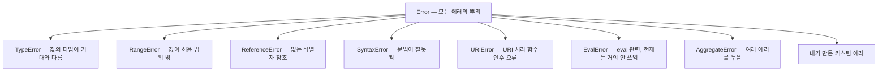

<Callout type="info">
  **이번 문서의 목표:** 이 파일을 다 읽으면 던져진 에러가 어느 경로로 어디까지 전파되는지 추적할 수 있고, `finally`가 반환값을 가로채는 함정을 피할 수 있으며, 호출자가 대응할 수 있는 정보를 담은 커스텀 에러 클래스를 설계할 수 있습니다.
</Callout>

## 1. 에러는 실패가 아니라 정보다

프로그램이 실패하는 방식은 두 가지입니다.

**조용한 실패**: 잘못된 값을 그대로 들고 계속 굴러갑니다. 화면에 `NaN`이 뜨거나, `undefined`가 저장되거나, 아무 일도 안 일어납니다. 원인 지점과 증상 지점이 멀어서 디버깅이 지옥입니다.

**시끄러운 실패**: 문제가 생긴 그 자리에서 즉시 멈추고 "여기서 이런 이유로 실패했다"를 알립니다. `throw`가 하는 일입니다.

```js
// 조용한 실패 — 호출자는 뭐가 잘못됐는지 모른다
function 나누기(a, b) {
  if (b === 0) return null;   // null이 "0으로 나눔"인지 "값 없음"인지 구분 불가
  return a / b;
}

// 시끄러운 실패 — 원인과 위치가 남는다
function 나누기2(a, b) {
  if (b === 0) throw new RangeError('0으로 나눌 수 없습니다');
  return a / b;
}
```

> **쉽게 말하면:** 에러 객체는 사고 신고서입니다. 무엇이(name), 왜(message), 어디서(stack) 잘못됐는지가 적혀 있습니다. `throw`는 그 신고서를 위로 올려보내는 행위이고, `catch`는 그 신고서를 받아 처리하는 책상입니다.

에러 처리를 잘한다는 것은 **에러를 안 나게 하는 것**이 아니라, **실패했을 때 호출자가 무엇을 할 수 있게 만드느냐**의 문제입니다. 이 관점을 잡고 나머지를 읽으세요.

## 2. 에러 객체의 계층

### 표준 에러 타입들

JavaScript는 `Error`를 뿌리로 하는 빌트인 에러 계층을 갖고 있습니다. 전부 `Error.prototype`을 상속하므로 `instanceof Error`가 참입니다.



각각이 언제 나오는지 예를 붙이면 기억에 남습니다.

```js
null.foo;                 // TypeError: null의 프로퍼티를 읽을 수 없음
[].length = -1;           // RangeError: 배열 길이 범위 밖
없는변수;                  // ReferenceError: 선언되지 않은 식별자
(1).toFixed(101);         // RangeError: 소수 자릿수 범위 밖
decodeURIComponent('%');  // URIError: 잘못된 URI
```

`SyntaxError`만 성격이 다릅니다. 다른 에러들은 **실행 중**에 발생하지만, `SyntaxError`는 대부분 **코드를 읽는 단계**에서 발생해 그 스크립트가 아예 실행되지 않습니다. 그래서 `try/catch`로 잡을 수 없습니다 — 잡을 코드조차 실행되지 않았으니까요.

### 에러 객체의 프로퍼티

```js
const 에러 = new TypeError('숫자가 필요합니다');
console.log(에러.name);     // 'TypeError'  — 에러 종류
console.log(에러.message);  // '숫자가 필요합니다' — 사람이 읽을 설명
console.log(에러.stack);    // 호출 스택 문자열 — 표준은 아니지만 모든 환경이 지원
console.log(에러 instanceof Error); // true
```

`stack`은 **어디서 던져졌는지의 흔적**입니다. 에러 객체가 `new`로 생성되는 시점에 기록되므로, 에러 객체를 미리 만들어 두고 나중에 던지면 스택이 엉뚱한 곳을 가리킵니다. **던질 자리에서 만드세요.**

ES2022부터는 `cause`(원인) 옵션이 표준이 되었습니다. 하위 계층의 에러를 감싸 올릴 때 원본을 잃지 않게 해줍니다.

```js
try {
  JSON.parse('깨진 문자열');
} catch (원본) {
  throw new Error('설정 파일을 읽지 못했습니다', { cause: 원본 });
  // 상위에서 에러.cause로 진짜 원인을 볼 수 있다
}
```

<Callout type="warning">
  **자주 틀리는 점:** `throw`는 아무 값이나 던질 수 있습니다. `throw '문자열'`, `throw 42`도 문법적으로 가능합니다. 하지만 그러면 `stack`도, `name`도, `instanceof` 판별도 없습니다. **항상 `Error` 또는 그 하위 클래스의 인스턴스를 던지세요.** 그래서 `catch` 블록에서는 잡은 값이 Error가 아닐 가능성까지 방어하는 것이 안전합니다.
</Callout>

## 3. try / catch / finally의 정확한 동작

### 세 블록의 역할

```js
try {
  // 위험할 수 있는 코드
} catch (에러) {
  // try에서 던져진 에러를 잡아 처리
} finally {
  // 성공하든 실패하든, 심지어 return이 있어도 반드시 실행
}
```

ES2019부터 잡은 값을 쓰지 않으면 매개변수를 생략할 수 있습니다 — `catch { ... }`도 유효합니다.

`finally`의 존재 이유는 **정리**(cleanup)입니다. 파일 닫기, 연결 해제, 로딩 표시 끄기처럼 "무슨 일이 있어도 해야 하는 일"을 둡니다. 정상 종료·예외·`return`·`break` 어떤 경로로 블록을 떠나든 실행됩니다.

### finally가 return을 가로채는 함정

여기에 아주 위험한 함정이 하나 있습니다. **`finally` 안의 `return`은 `try`나 `catch`의 `return`을 덮어씁니다.** 더 나쁜 것은, `finally`의 `return`이 **던져지던 에러까지 삼켜버린다**는 점입니다.

```js
function 함정() {
  try {
    return '정상값';
  } finally {
    return '가로챈 값';    // 이게 최종 반환값
  }
}
console.log(함정());       // 가로챈 값

function 더위험() {
  try {
    throw new Error('중요한 에러');
  } finally {
    return '에러가 사라짐';   // 에러가 조용히 증발한다!
  }
}
console.log(더위험());       // 에러가 사라짐 — 예외가 밖으로 나오지 않는다
```

두 번째 함수가 진짜 위험합니다. 프로그램이 실패했는데도 아무도 모르게 정상값이 반환됩니다. **`finally` 안에서는 `return`·`break`·`continue`·`throw`를 쓰지 않는다** — 이것을 규칙으로 삼으세요. `finally`는 오직 정리만 합니다.

### 전파는 위로 올라간다

`throw`가 실행되면 **현재 함수의 나머지 코드는 건너뛰고**, 호출 스택을 거슬러 올라가며 가장 가까운 `try`를 찾습니다. 찾으면 그 `catch`로 들어가고, 끝까지 못 찾으면 프로그램이 중단됩니다(브라우저에서는 해당 태스크가 중단됩니다).

```js
function 셋째() { throw new Error('바닥에서 발생'); }
function 둘째() { 셋째(); console.log('실행 안 됨'); }
function 첫째() {
  try {
    둘째();
  } catch (e) {
    console.log('두 단계 위에서 잡음:', e.message);
  } finally {
    console.log('정리는 항상');
  }
}
첫째();
// 두 단계 위에서 잡음: 바닥에서 발생
// 정리는 항상
```

중간의 `둘째`는 `try`가 없으므로 에러가 그냥 통과합니다. **모든 함수에 `try/catch`를 붙일 필요가 없다**는 뜻입니다. 오히려 그렇게 하면 로그만 늘고 처리는 안 되는 코드가 됩니다.

### 다시 던지기 — 처리할 수 있는 것만 잡는다

잡았는데 처리할 방법이 없다면 **다시 던지는 것**이 옳습니다.

```js
try {
  설정읽기();
} catch (e) {
  if (e instanceof SyntaxError) {
    return 기본설정();          // 이건 내가 복구할 수 있다
  }
  throw e;                      // 나머지는 위에서 판단하도록 올려보낸다
}
```

이 패턴의 반대편에 있는 것이 **삼키기**(swallowing)입니다.

```js
try { 위험한작업(); } catch (e) {}   // 최악 — 실패가 흔적도 없이 사라진다
```

빈 `catch`는 "이 실패는 무시해도 된다"는 명시적 판단일 때만 쓰고, 그때도 이유를 주석으로 남기세요.

## 4. 비동기 에러의 전파 경로

### 콜백 경계를 넘지 못하는 try/catch

동기 코드에서 잘 작동하던 `try/catch`가 비동기에서 갑자기 무력해지는 순간이 있습니다.

```js
try {
  setTimeout(() => {
    throw new Error('타이머 안의 에러');
  }, 0);
} catch (e) {
  console.log('절대 실행되지 않음');
}
```

이유는 27편의 이벤트 루프 모델로 완전히 설명됩니다. `setTimeout` 콜백이 실행될 때는 **`try` 블록이 이미 끝나고 스택에서 사라진 뒤**입니다. 콜백은 텅 빈 스택 위에 새로 올라가므로, 위로 거슬러 올라가도 `try`가 없습니다.

> **쉽게 말하면:** `try/catch`는 **같은 스택 위에서만** 통합니다. 콜백은 다음 태스크에서 **새 스택**으로 실행되므로, 앞 태스크의 `try`는 이미 철거된 건물입니다.

그래서 타이머·이벤트 핸들러 안의 에러는 **콜백 내부에서 잡아야** 합니다.

```js
setTimeout(() => {
  try { 위험한작업(); } catch (e) { 로그(e); }
}, 0);
```

### Promise 경로 — 거부로 변환된다

Promise는 이 문제를 다르게 해결합니다. **실행자 함수나 `then` 콜백 안에서 던진 예외는 밖으로 튀어나오지 않고, 그 Promise의 거부로 변환됩니다.**

```js
new Promise(() => { throw new Error('실행자 안의 에러'); })
  .catch((e) => console.log('거부로 변환되어 잡힘:', e.message));
```

25편에서 본 대로 거부는 체인을 따라 아래로 흐르다가 가장 가까운 `catch`에서 잡힙니다. 즉 **비동기 에러는 스택을 거슬러 올라가는 대신, 체인을 따라 내려갑니다.** 전파 방향이 정반대라는 점이 핵심입니다.

### await가 두 경로를 다시 잇는다

`await`는 거부를 **다시 예외로 되돌립니다.** 그래서 동기 코드와 똑같은 `try/catch`가 통합니다.

```js
async function 조회() {
  try {
    const 결과 = await 서버요청();   // 거부되면 여기서 예외가 던져짐
    return 결과;
  } catch (e) {
    return 기본값;
  }
}
```

세 경로를 표로 정리하면 이렇습니다.

| 상황 | 에러가 가는 곳 | 잡는 방법 |
|------|---------------|----------|
| 동기 함수에서 throw | 호출 스택을 거슬러 올라감 | 상위의 `try/catch` |
| 타이머·이벤트 콜백에서 throw | 새 스택 – 위로 전파될 곳 없음 | **콜백 안에서** `try/catch` |
| Promise 실행자·then에서 throw | 그 Promise의 거부로 변환 | 체인의 `catch` |
| async 함수에서 throw | 반환 Promise의 거부로 변환 | `await` + `try/catch` 또는 `.catch` |
| `await` 대상이 거부됨 | 그 자리에서 예외로 재발생 | 감싸는 `try/catch` |

### 마지막 안전망

어디서도 잡지 못한 에러를 위한 전역 처리기가 있습니다. 브라우저에서는 동기 에러가 `window`의 `error` 이벤트로, 처리되지 않은 거부가 `unhandledrejection` 이벤트로 옵니다. 이것은 **로깅과 사용자 알림을 위한 최후의 그물**이지 정상적인 에러 처리 수단이 아닙니다. 여기서 잡힌 에러는 이미 복구 시점을 놓친 상태입니다.

아래 실습기에서 네 가지 경로의 차이를 **직접 실행해 확인**하세요. 어떤 것이 잡히고 어떤 것이 새어 나가는지 출력으로 드러납니다.

<CodePlayground
  template="vanilla"
  activeFile="/index.js"
  showConsole
  label="에러 전파 경로 실험 — 어느 것이 잡히고 어느 것이 새는가"
  files={{
    '/index.js': `// 경로 1: 동기 에러 — 스택을 거슬러 올라가 잡힌다
function 깊은곳() { throw new Error("동기 에러"); }
try {
  깊은곳();
} catch (e) {
  console.log("1. 동기 에러 잡힘:", e.message);
}

// 경로 2: 타이머 콜백 — 바깥 try는 무력하다
try {
  setTimeout(() => {
    // 이 주석을 풀면 잡히지 않는 에러가 발생합니다
    // throw new Error("타이머 에러");
    console.log("2. 바깥 try는 이 콜백을 보호하지 못한다");
  }, 0);
} catch (e) {
  console.log("절대 실행되지 않음");
}

// 경로 3: Promise 실행자의 예외 → 거부로 변환
new Promise(() => { throw new Error("실행자 에러"); })
  .catch((e) => console.log("3. 거부로 변환되어 잡힘:", e.message));

// 경로 4: async 함수 — await 없이 호출하면 try/catch가 무력
async function 실패함수() { throw new Error("async 에러"); }

async function 검증() {
  try {
    실패함수();                  // await 없음 — 잡히지 않음
    console.log("4a. await 없는 호출은 예외를 던지지 않는다");
  } catch (e) {
    console.log("4a. 실행되지 않음");
  }

  try {
    await 실패함수();            // await 있음 — 예외로 재발생
  } catch (e) {
    console.log("4b. await 덕분에 잡힘:", e.message);
  }
}
검증();

// 경로 5: finally가 에러를 삼키는 함정
function 함정() {
  try { throw new Error("중요한 에러"); }
  finally { return "삼켜짐"; }
}
console.log("5. finally의 return이 에러를 삼킴:", 함정());

// 실험: 경로 2의 throw 주석을 풀고 콘솔에 어떻게 보고되는지 확인해 보세요.`,
  }}
/>

4a와 4b의 대조가 이 실험의 핵심입니다. 같은 함수를 같은 `try` 안에서 호출했는데 `await` 하나의 유무로 결과가 갈립니다. **`await`는 기다리는 문법이기도 하지만, 거부를 예외로 바꿔주는 변환기이기도 합니다.**

## 5. 커스텀 에러 설계

### 왜 만드는가

빌트인 에러만 쓰면 `catch`에서 **분기할 근거가 없습니다.** 메시지 문자열을 비교하는 코드는 문구가 바뀌는 순간 깨집니다.

```js
// 나쁜 코드 — 문자열에 의존
catch (e) {
  if (e.message.includes('없음')) { /* ... */ }
}
```

커스텀 에러 클래스를 만들면 `instanceof`로 **타입 기반 분기**가 가능해집니다. 여기에 상황 데이터까지 담으면 호출자가 실제로 대응할 수 있습니다.

### 올바른 구현

```js
class 앱에러 extends Error {
  constructor(메시지, 옵션 = {}) {
    super(메시지, { cause: 옵션.cause });   // 부모 생성자에 메시지와 원인 전달
    this.name = this.constructor.name;      // 'ValidationError' 등이 자동으로 들어감
  }
}

class 검증에러 extends 앱에러 {
  constructor(필드명, 값) {
    super(`${필드명} 값이 올바르지 않습니다`);
    this.필드명 = 필드명;                   // 호출자가 쓸 수 있는 구조화된 정보
    this.값 = 값;
  }
}

class 네트워크에러 extends 앱에러 {
  constructor(상태코드, 옵션) {
    super(`요청 실패 (상태 ${상태코드})`, 옵션);
    this.상태코드 = 상태코드;
    this.재시도가능 = 상태코드 >= 500;      // 대응 방법을 에러가 알려준다
  }
}
```

세 가지 설계 원칙이 들어 있습니다.

1. **`Error`를 상속한다.** 14편의 `extends`와 `super` 그대로입니다. `super(메시지)`를 반드시 호출해야 `message`와 `stack`이 채워집니다.
2. **`name`을 설정한다.** 설정하지 않으면 부모의 `'Error'`가 그대로 남아 로그에서 구분이 안 됩니다. `this.constructor.name`을 쓰면 하위 클래스마다 자동으로 맞춰집니다.
3. **호출자가 판단할 데이터를 담는다.** `상태코드`, `재시도가능`처럼 **분기에 쓸 수 있는 값**이 핵심입니다. 사람이 읽는 문장만으로는 프로그램이 대응할 수 없습니다.

### 잡는 쪽

```js
try {
  await 주문전송(데이터);
} catch (e) {
  if (e instanceof 검증에러) {
    입력강조(e.필드명);                  // 필드를 알기에 정확히 대응
  } else if (e instanceof 네트워크에러 && e.재시도가능) {
    return 재시도(주문전송, 데이터);      // 에러가 알려준 대로 재시도
  } else {
    throw e;                            // 모르는 에러는 위로 올린다
  }
}
```

이 코드가 에러 설계의 목적을 보여줍니다. **각 분기가 서로 다른 실제 행동을 합니다.** 만약 모든 분기가 "로그 찍고 끝"이라면 그 분기는 필요 없는 것입니다.

### 에러 설계의 실무 원칙

- **잡을 수 있는 곳에서만 잡는다.** 복구 방법이 없으면 올려보내는 편이 낫습니다.
- **경계에서 변환한다.** 하위 계층의 기술적 에러(파싱 실패, 소켓 끊김)를 상위 계층의 의미 있는 에러로 감싸되, `cause`로 원본을 보존합니다.
- **메시지에 맥락을 담되 민감 정보는 넣지 않는다.** 사용자 화면에 스택이나 내부 경로가 노출되면 보안 문제가 됩니다.
- **예상 가능한 실패는 에러가 아닐 수도 있다.** "검색 결과 없음"은 정상 흐름이므로 빈 배열을 반환하는 편이 낫습니다. **에러는 예외적인 상황에** 씁니다.

<Callout type="warning">
  **자주 틀리는 점 모음:** ① `finally`에서 `return`이나 `throw`를 써서 원래 결과·에러를 지운다. ② `Error`가 아닌 값을 던져 `stack`과 `instanceof`를 잃는다. ③ 비동기 콜백 바깥의 `try/catch`가 콜백 안을 지켜줄 거라 기대한다. ④ `await` 없이 async 함수를 호출하고 `try/catch`로 잡으려 한다. ⑤ 빈 `catch`로 실패를 삼킨다. ⑥ 커스텀 에러에서 `super(메시지)`를 빠뜨려 `message`가 비게 만든다.
</Callout>

## 핵심 정리

- 에러 객체는 **무엇이·왜·어디서**(name·message·stack)를 담은 정보 구조다. 던질 자리에서 생성해야 `stack`이 정확하다.
- `try/catch/finally`에서 **`finally`는 어떤 경로로 나가든 실행**되지만, 그 안의 `return`은 반환값을 덮어쓰고 던져지던 에러까지 삼킨다 – 정리 외의 일을 두지 않는다.
- 동기 에러는 **호출 스택을 거슬러 올라가고**, Promise 에러는 **체인을 따라 내려간다.** 전파 방향이 반대다.
- 타이머·이벤트 콜백의 에러는 새 스택에서 발생하므로 **바깥 `try/catch`가 잡지 못한다.** 콜백 안에서 처리해야 한다.
- `await`는 거부를 예외로 되돌리는 변환기이며, 그 덕분에 비동기 코드에서 동기와 같은 `try/catch`가 통한다. **`await`가 없으면 잡히지 않는다.**
- 커스텀 에러는 `Error`를 상속하고, `name`을 설정하고, **호출자가 분기에 쓸 데이터**를 담아야 값을 한다. 분기마다 다른 행동이 없다면 그 분기는 불필요하다.

## 마무리 복습

<Quiz
  questionNumber={1}
  question="try 블록에서 값을 반환하고 finally 블록에서도 값을 반환하면 최종 반환값은?"
  options={['try의 반환값', 'finally의 반환값', '두 값을 담은 배열', '문법 에러가 발생한다']}
  correctAnswer={2}
  explanation="finally의 return은 try나 catch의 return을 덮어쓴다. 심지어 던져지던 에러까지 삼키므로 finally에는 정리 코드만 두어야 한다."
  optionExplanations={['finally가 덮어쓴다', '정답 — 그래서 finally의 return은 위험하다', '배열로 합쳐지지 않는다', '문법적으로는 유효하다']}
/>

<Quiz
  questionNumber={2}
  question="setTimeout 콜백 안에서 던진 에러를 바깥 try/catch가 잡지 못하는 이유는?"
  options={['setTimeout이 에러를 내부에서 삼키기 때문', '콜백이 실행될 때 try 블록은 이미 끝나 스택에서 사라졌기 때문', '타이머 에러는 전역 처리기 전용이기 때문', 'catch가 비동기 코드를 지원하지 않는 문법이기 때문']}
  correctAnswer={2}
  explanation="콜백은 다음 태스크에서 빈 스택 위에 새로 올라간다. 에러가 위로 거슬러 올라가도 그 자리에 try가 없다. try/catch는 같은 스택 위에서만 작동한다."
  optionExplanations={['삼키는 것이 아니라 전파 경로가 다른 것이다', '정답 — 스택이 이미 철거된 상태다', '전역 처리기는 결과일 뿐 이유가 아니다', 'catch 문법의 한계가 아니라 실행 시점의 문제다']}
/>

<Quiz
  questionNumber={3}
  question="Promise 실행자 함수 안에서 예외를 던지면 어떻게 되는가?"
  options={['예외가 그대로 밖으로 전파된다', '해당 Promise가 그 에러로 거부된다', '예외가 무시되고 대기 상태가 유지된다', '프로그램이 즉시 종료된다']}
  correctAnswer={2}
  explanation="실행자나 then 콜백의 예외는 밖으로 튀어나오지 않고 그 Promise의 거부로 변환된다. 그래서 체인의 catch에서 처리할 수 있다."
  optionExplanations={['밖으로 나가지 않는다', '정답 — 예외가 거부로 변환된다', '대기 상태가 아니라 거부 상태가 된다', '종료되지 않고 거부로 남는다']}
/>

<Quiz
  questionNumber={4}
  question="try 블록 안에서 async 함수를 await 없이 호출했고 그 함수가 던졌다면?"
  options={['catch가 정상적으로 잡는다', 'catch가 잡지 못하고 처리되지 않은 거부가 된다', '함수 호출 시점에 문법 에러가 난다', 'finally만 실행되고 catch는 건너뛴다']}
  correctAnswer={2}
  explanation="async 함수의 실패는 예외가 아니라 거부된 Promise로 나온다. await가 있어야 그 거부가 예외로 다시 변환되어 catch에 걸린다."
  optionExplanations={['예외가 아니라 잡히지 않는다', '정답 — await가 거부를 예외로 바꾸는 변환기 역할을 한다', '호출 자체는 정상이다', 'finally는 실행되지만 에러는 잡히지 않는다']}
/>

<Quiz
  questionNumber={5}
  question="커스텀 에러 클래스를 만들 때 반드시 해야 할 일로 옳은 것은?"
  options={['Object를 상속하고 message 프로퍼티를 직접 만든다', 'Error를 상속하고 생성자에서 super로 메시지를 전달한다', 'stack 문자열을 직접 조립해 넣는다', 'name 프로퍼티는 건드리지 않는 것이 좋다']}
  correctAnswer={2}
  explanation="Error를 상속하고 super를 호출해야 message와 stack이 정상적으로 채워지고 instanceof Error 판별도 성립한다. name은 오히려 하위 클래스 이름으로 설정해야 로그에서 구분된다."
  optionExplanations={['Object 상속으로는 에러의 성질을 얻지 못한다', '정답 — super 호출이 message와 stack을 채운다', 'stack은 엔진이 생성 시점에 기록한다', 'name을 설정하지 않으면 모두 Error로 보인다']}
/>

<Quiz
  questionNumber={6}
  question="catch 블록에서 다시 throw 하는 것이 적절한 상황은?"
  options={['에러를 로그로 남기고 싶을 때', '그 자리에서 복구할 방법이 없어 상위의 판단이 필요할 때', '에러 메시지를 짧게 만들고 싶을 때', 'finally를 실행시키고 싶을 때']}
  correctAnswer={2}
  explanation="처리할 수 있는 에러만 잡고 나머지는 올려보내는 것이 원칙이다. 복구 방법이 없는데 잡아서 삼키면 실패가 은폐된다."
  optionExplanations={['로그만 남기고 삼키면 실패가 은폐된다', '정답 — 처리 가능한 것만 잡는다는 원칙이다', '메시지 길이는 이유가 아니다', 'finally는 다시 던지지 않아도 실행된다']}
/>

<Quiz
  questionNumber={7}
  question="에러 객체 대신 문자열을 throw 했을 때 잃게 되는 것으로 옳은 것은?"
  options={['try/catch로 잡을 수 없게 된다', 'stack 정보와 instanceof 판별 능력을 잃는다', 'finally가 실행되지 않는다', '비동기 코드에서만 문제가 된다']}
  correctAnswer={2}
  explanation="문자열도 던지고 잡을 수는 있지만 name, stack, instanceof 판별이 없다. 그래서 어디서 왜 실패했는지 추적하거나 타입으로 분기할 수 없다."
  optionExplanations={['잡히기는 잡힌다', '정답 — 진단과 분기의 근거가 사라진다', 'finally는 정상적으로 실행된다', '동기 코드에서도 똑같이 문제가 된다']}
/>

<Quiz
  questionNumber={8}
  question="ES2022의 cause 옵션을 쓰는 목적으로 가장 알맞은 것은?"
  options={['에러 메시지를 자동으로 번역하기 위해', '하위 계층의 원본 에러를 잃지 않고 상위 에러로 감싸기 위해', '에러 발생을 지연시키기 위해', '스택 트레이스를 숨기기 위해']}
  correctAnswer={2}
  explanation="경계에서 기술적 에러를 의미 있는 에러로 변환할 때, cause에 원본을 담으면 진짜 원인을 추적할 수 있다. 정보를 지우지 않고 층을 쌓는 방식이다."
  optionExplanations={['번역 기능과는 무관하다', '정답 — 원인 사슬을 보존하는 표준 수단이다', '발생 시점과는 관계없다', '숨기는 것이 아니라 보존하는 용도다']}
/>

## 참고 자료

- [MDN - Control flow and error handling](https://developer.mozilla.org/en-US/docs/Web/JavaScript/Guide/Control_flow_and_error_handling)
- [MDN - Error](https://developer.mozilla.org/en-US/docs/Web/JavaScript/Reference/Global_Objects/Error)
- [MDN - try...catch](https://developer.mozilla.org/en-US/docs/Web/JavaScript/Reference/Statements/try...catch)
- [MDN - Using promises](https://developer.mozilla.org/en-US/docs/Web/JavaScript/Guide/Using_promises)
- [ECMAScript Language Specification](https://262.ecma-international.org/)
