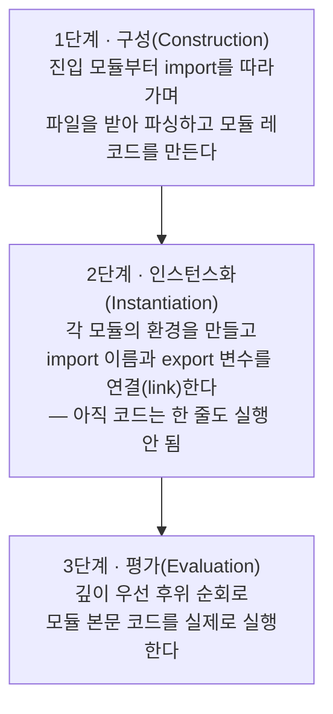
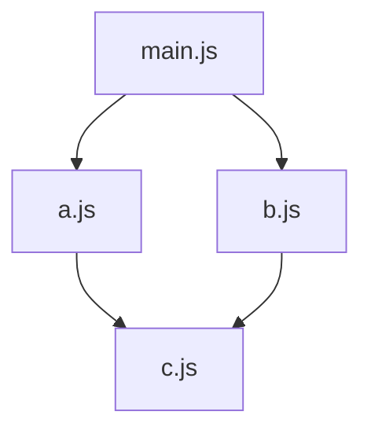
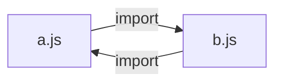

<Callout type="info">
  **이번 문서의 목표:** 이 파일을 다 읽으면 `import` 한 값이 왜 재할당 불가능한 "살아 있는 연결"인지, 여러 모듈이 얽혔을 때 어떤 순서로 평가되는지, 순환 참조가 어떤 조건에서 `undefined`나 ReferenceError로 터지는지를 스스로 그림으로 설명하고 재현할 수 있습니다.
</Callout>

## 1. 왜 모듈이 필요했는가

### 모듈 이전의 세계

JavaScript는 1995년에 "HTML 문서에 몇 줄 끼워 넣는 스크립트 언어"로 태어났습니다. 그래서 처음 15년 동안 **파일을 나누는 공식 문법이 아예 없었습니다.** 파일을 나누고 싶으면 방법은 하나뿐이었습니다.

```html
<script src="./utils.js"></script>
<script src="./cart.js"></script>
<script src="./main.js"></script>
```

이 방식에는 세 가지 구조적 문제가 있었습니다.

1. **전역 오염**(global pollution). `utils.js`에서 선언한 `var total`은 전역 객체의 프로퍼티가 되고, `cart.js`에서 선언한 `var total`이 그것을 조용히 덮어씁니다. 파일이 달라도 이름 공간(namespace, 네임스페이스 — 이름들이 사는 방)은 하나뿐이었습니다.
2. **암묵적 순서 의존**. `cart.js`가 `utils.js`의 함수를 쓴다는 사실이 코드 어디에도 적혀 있지 않습니다. HTML의 `script` 태그 순서라는, 코드 바깥의 약속에만 적혀 있습니다. 순서를 한 줄 바꾸면 앱이 죽습니다.
3. **의존 관계를 기계가 알 수 없음**. 어떤 파일이 어떤 파일을 쓰는지 도구가 분석할 수 없으니, 안 쓰는 코드를 잘라내거나 필요한 것만 미리 받아오는 최적화가 불가능했습니다.

> **쉽게 말하면:** 모듈이 없던 시절의 JS 파일들은 벽이 없는 원룸에 다 같이 사는 룸메이트였습니다. 물건 이름이 겹치면 서로 덮어썼고, 누가 누구 물건을 쓰는지는 아무도 몰랐습니다.

### 커뮤니티의 임시방편들

공식 문법이 없으니 개발자들이 스스로 만들었습니다. 즉시 실행 함수로 스코프를 만드는 **모듈 패턴**(module pattern), Node.js가 채택한 **CommonJS**(`require` / `module.exports`), 브라우저용 비동기 로더인 **AMD**(Asynchronous Module Definition) 같은 것들입니다. 이들은 잘 동작했지만 어디까지나 **런타임에 함수를 호출해서 흉내 낸** 모듈이었습니다.

ES2015(ES6)에서 드디어 언어 자체에 모듈이 들어왔습니다. 이것을 **ESM**(ECMAScript Modules, 에크마스크립트 모듈)이라고 부릅니다. ESM이 이전 방식들과 본질적으로 다른 점은 딱 하나입니다.

<Callout type="info">
  **ESM의 `import` / `export`는 함수 호출이 아니라 문법입니다.** 그래서 코드를 *실행하기 전에* 파서가 의존 관계를 전부 파악할 수 있습니다. 이 성질을 **정적 구조**(static structure, 스태틱 스트럭처)라고 부르며, ESM의 거의 모든 특이한 규칙이 여기서 나옵니다.
</Callout>

## 2. 모듈의 기본 규칙 — script와 무엇이 다른가

4편에서 script와 module의 차이를 짚었습니다. 여기서 모듈 쪽 규칙만 한 번에 정리합니다.

| 항목 | 일반 script | 모듈(module) |
|------|-------------|--------------|
| strict mode | 기본 비활성 — 직접 켜야 함 | **항상 활성**, 끌 수 없음 |
| 최상위 스코프 | 전역 스코프 | **모듈 자체의 스코프** |
| 최상위 `var` | 전역 객체의 프로퍼티가 됨 | 모듈 안에만 존재 |
| 최상위 `this` | `globalThis` | `undefined` |
| 로드 방식 | 기본 동기, 파싱 차단 | 항상 지연(defer), 비동기 |
| 중복 로드 | 같은 파일을 여러 번 실행 | URL당 **한 번만** 평가 |
| `import` / `export` | 사용 불가 | 사용 가능 |

브라우저에서 모듈로 실행하려면 `type` 속성에 module을 지정합니다.

```html
<script type="module" src="./main.js"></script>
```

여기서 가장 중요한 두 줄을 다시 강조합니다.

- **모듈의 최상위 스코프는 전역이 아닙니다.** 모듈 파일 맨 위에 `const 장바구니 = []`라고 써도 그것은 그 모듈 안에서만 보입니다. 전역 오염 문제가 문법 차원에서 사라졌습니다.
- **한 모듈은 프로그램 전체에서 딱 한 번만 평가됩니다.** 세 파일이 같은 모듈을 import 해도 그 파일의 코드는 한 번만 실행되고, 셋은 **같은 결과 객체를 공유**합니다. 이 성질은 뒤에서 다룰 live binding과 순환 참조를 이해하는 열쇠입니다.

<Callout type="warning">
  **자주 틀리는 점:** "모듈은 파일마다 격리되니까 같은 모듈을 두 번 import 하면 인스턴스가 두 개 생긴다"고 오해하기 쉽습니다. 반대입니다. 모듈은 **싱글턴**(singleton, 하나만 존재하는 것)입니다. 카운터를 export 하는 모듈을 A와 B가 각각 import 하면, A가 올린 숫자를 B도 그대로 봅니다. 이 성질을 모르면 "왜 다른 화면의 상태가 섞이지?" 하는 버그를 만나게 됩니다.
</Callout>

## 3. export와 import 문법 지도

### 이름 붙여 내보내기

**named export**(네임드 익스포트, 이름 붙인 내보내기)는 이름을 그대로 유지한 채 값을 공개합니다. 선언 앞에 붙이거나, 아래에 목록으로 모아 쓸 수 있습니다.

```js
// 방식 1 — 선언 앞에 붙이기
export const 부가세율 = 0.1;
export function 세금계산(금액) {
  return 금액 * 부가세율;
}

// 방식 2 — 아래에 모아 쓰기 (권장: 공개 목록이 한눈에 보임)
const 부가세율 = 0.1;
function 세금계산(금액) {
  return 금액 * 부가세율;
}
export { 부가세율, 세금계산 };

// 이름 바꿔 내보내기
export { 세금계산 as calcTax };
```

받는 쪽은 **중괄호 안에 내보낸 이름 그대로** 적습니다. 이름이 틀리면 실행 전에 에러가 납니다.

```js
import { 부가세율, 세금계산 } from './tax.js';
import { 세금계산 as 세금 } from './tax.js'; // 이름 바꿔 받기
import * as 세금모듈 from './tax.js';        // 전부 한 객체로 받기
```

`import * as 이름` 형태로 받은 것을 **모듈 네임스페이스 객체**(module namespace object)라고 합니다. 이 객체는 **동결되어 있어** 프로퍼티를 추가하거나 바꿀 수 없습니다.

### 기본 내보내기

**default export**(디폴트 익스포트)는 모듈당 최대 하나만 가능한, 이름 없는 대표 값입니다.

```js
// cart.js
export default class 장바구니 { /* ... */ }

// 쓰는 쪽 — 이름을 내가 마음대로 지어도 된다
import 카트 from './cart.js';
import { default as 카트2 } from './cart.js'; // 위와 완전히 동일
```

`default`는 내부적으로 **"default"라는 이름의 named export**입니다. 그래서 이름을 자유롭게 붙일 수 있는 것이지, 특별한 종류의 값이라서가 아닙니다.

| 비교 항목 | named export | default export |
|-----------|--------------|----------------|
| 개수 | 여러 개 | 모듈당 한 개 |
| import 시 이름 | 내보낸 이름과 일치해야 함 | 자유롭게 지음 |
| 오타 감지 | 실행 전 에러로 즉시 발견 | 오타가 나도 조용히 다른 이름 |
| 자동 완성·리네이밍 | 도구 지원 좋음 | 상대적으로 약함 |

> **쉽게 말하면:** named export는 이름표가 붙은 서랍이고, default export는 상자 하나를 통째로 건네주는 것입니다. 서랍은 이름을 틀리면 바로 알 수 있지만, 상자는 받는 사람이 아무 이름이나 붙일 수 있습니다.

### 다시 내보내기와 부수 효과 import

```js
// index.js — 여러 모듈의 공개 항목을 한 입구로 모으기
export { 세금계산 } from './tax.js';
export * from './cart.js';
export { default as 장바구니 } from './cart.js';

// 값은 필요 없고, 모듈이 실행되기만 하면 될 때
import './polyfill.js';
```

`export ... from`은 "받아서 다시 내보내기"인데, **받는 쪽 스코프에는 그 이름이 들어오지 않습니다.** 통과시켜 주기만 하는 파이프입니다.

## 4. live binding — 값이 아니라 연결을 가져온다

여기가 이 편의 핵심입니다.

### 왜 이 개념이 필요한가

CommonJS의 `require`는 **그 시점의 값을 복사**해 옵니다. 그래서 내보낸 쪽에서 나중에 값을 바꿔도 받은 쪽은 옛날 값을 계속 봅니다. ESM은 정반대로 설계했습니다.

> **쉽게 말하면:** `import`는 값을 복사해 오는 것이 아니라, 원본 변수를 **가리키는 창문**을 하나 뚫는 것입니다. 원본이 바뀌면 창문 너머 풍경도 같이 바뀝니다.

이 성질을 **live binding**(라이브 바인딩, 살아 있는 연결)이라고 합니다. 명세 용어로는 import 한 이름이 원본 모듈 환경의 변수를 참조하는 **간접 바인딩**(indirect binding)입니다.

### 직접 확인해 보기

아래 실습기에서 `증가` 함수를 호출할 때마다 import 해 온 `카운트` 값이 실제로 따라 바뀌는 것을 확인해 보세요. 숫자를 바꾸거나 호출 횟수를 늘려가며 실험해 보시기 바랍니다.

<CodePlayground
  template="vanilla"
  activeFile="/index.js"
  showConsole
  label="live binding — import 한 값은 원본을 따라 변한다"
  files={{
    '/counter.js': `export let 카운트 = 0;

export function 증가() {
  카운트 += 1;
}

// 값을 복사해 내보낸 경우와 비교하기 위한 스냅샷
export const 처음값 = 카운트;
`,
    '/index.js': `import { 카운트, 증가, 처음값 } from './counter.js';

console.log('초기 카운트:', 카운트);   // 0
증가();
증가();
console.log('두 번 증가 후:', 카운트); // 2  ← 값이 따라 변했다!
console.log('처음값 상수:', 처음값);   // 0  ← 이건 복사된 값이라 그대로

// 재할당은 금지된다 — 주석을 풀면 에러를 볼 수 있다
// 카운트 = 100; // TypeError: Assignment to constant variable.

console.log('---- 객체 프로퍼티는 다르다 ----');
`,
  }}
/>

실행 결과를 말로 해석하면 이렇습니다.

1. `카운트`는 `counter.js`의 `let` 변수에 연결된 창문입니다. `증가()`가 원본을 2로 올렸으니 창문 너머 값도 2가 됩니다.
2. `처음값`은 export 시점에 이미 `0`이라는 값으로 고정된 상수입니다. 연결이 아니라 그냥 0이므로 변하지 않습니다.
3. 받는 쪽에서 `카운트 = 100`처럼 **재할당은 금지**됩니다. import 한 이름은 `const`처럼 취급되기 때문입니다.

### 세 가지를 구분하기

| 대상 | 원본 변경이 반영되나 | 받는 쪽에서 변경 가능한가 |
|------|---------------------|--------------------------|
| import 한 `let` 변수 | 반영됨 – live binding | 재할당 불가 – TypeError |
| import 한 객체의 프로퍼티 | 반영됨 – 같은 객체 | 프로퍼티 변경은 가능 |
| import 한 원시값 `const` | 애초에 안 변함 | 재할당 불가 |

<Callout type="warning">
  **자주 틀리는 점:** "import 한 것은 못 바꾼다"를 "import 한 객체 안도 못 바꾼다"로 확대 해석하면 틀립니다. 잠긴 것은 **이름과 원본 변수 사이의 연결**이지, 그 변수가 가리키는 객체의 내용이 아닙니다. `import { 설정 }` 후 `설정.모드 = 'dark'`는 아무 에러 없이 통과하고, 그 모듈을 import 한 모든 곳에 영향을 줍니다. 이건 3편에서 본 원시값과 객체의 차이가 모듈 경계에서 다시 나타난 것입니다.
</Callout>

## 5. 모듈이 실행되는 순서 — 3단계 파이프라인

여러 모듈이 얽혀 있을 때 "누가 먼저 실행되는가"는 감이 아니라 규칙으로 정해져 있습니다. 명세는 모듈 로딩을 **세 단계**로 나눕니다.



### 1단계 구성 — 의존 그래프 만들기

진입점 모듈을 받아 파싱하면, `import` 문이 문법이기 때문에 **실행하지 않고도** 어떤 파일이 더 필요한지 알 수 있습니다. 그 파일들을 받아 또 파싱하고, 더 이상 새 의존이 없을 때까지 반복합니다. 결과는 **모듈 의존 그래프**(module dependency graph)입니다. 이미 받은 URL은 다시 받지 않으므로 그래프에는 모듈당 노드가 하나뿐입니다.

### 2단계 인스턴스화 — 창문 뚫기

각 모듈마다 변수를 담을 **모듈 환경 레코드**(module environment record)를 만들고, import 이름을 원본 모듈의 export 변수에 연결합니다. 앞에서 본 live binding의 창문이 실제로 뚫리는 단계입니다. **중요한 건 이때 코드는 아직 실행되지 않았다는 점입니다.** 그래서 모든 변수는 9편에서 배운 대로 함수 선언만 초기화된 상태이고, `let`·`const`·`class`는 TDZ(Temporal Dead Zone, 일시적 사각지대) 안에 있습니다.

### 3단계 평가 — 깊이 우선 후위 순회

이제 코드를 실행합니다. 순서 규칙은 한 문장입니다.

<Callout type="info">
  **"자식 먼저, 그다음 나."** 어떤 모듈을 평가하기 전에 그 모듈이 import 하는 모듈들을 **import 문에 적힌 순서대로** 먼저 평가합니다. 이미 평가된 모듈은 건너뜁니다. 이것을 깊이 우선 후위 순회(depth-first post-order traversal)라고 부릅니다.
</Callout>

예를 들어 다음 그래프를 봅시다.



평가 순서는 `c.js` → `a.js` → `b.js` → `main.js`입니다. 이유를 한 단계씩 따라가면 이렇습니다.

1. main을 평가하려면 먼저 a가 필요합니다.
2. a를 평가하려면 먼저 c가 필요합니다. c는 의존이 없으니 **c가 가장 먼저** 실행됩니다.
3. c가 끝났으니 a가 실행됩니다.
4. main의 두 번째 의존인 b 차례. b도 c가 필요하지만 c는 이미 평가됐으므로 건너뛰고, **b가 실행**됩니다.
5. 마지막으로 main이 실행됩니다.

직접 확인해 봅시다. 아래에서 파일별 `console.log` 출력 순서를 예측한 뒤 실행해 맞춰 보세요. import 문의 순서를 바꿔보면 결과가 어떻게 달라지는지도 실험해 보시기 바랍니다.

<CodePlayground
  template="vanilla"
  activeFile="/index.js"
  showConsole
  label="모듈 평가 순서 — 자식 먼저, 그다음 나"
  files={{
    '/c.js': `console.log('3) c.js 평가됨 — 의존이 없어 가장 먼저');
export const c값 = 'C';
`,
    '/a.js': `import { c값 } from './c.js';
console.log('4) a.js 평가됨 — c가 끝난 뒤');
export const a값 = 'A' + c값;
`,
    '/b.js': `import { c값 } from './c.js';
console.log('5) b.js 평가됨 — c는 이미 끝나서 건너뜀');
export const b값 = 'B' + c값;
`,
    '/index.js': `console.log('1) index.js 파일 자체는 맨 마지막에 평가된다');
import { a값 } from './a.js';
import { b값 } from './b.js';

console.log('6) index.js 본문 실행:', a값, b값);
`,
  }}
/>

실행해 보면 `index.js` 맨 위에 적힌 로그가 **가장 먼저 찍히지 않는다**는 사실에 놀랄 수 있습니다. `import` 선언은 파일 어디에 적혀 있든 **평가 이전 단계에서 처리**되기 때문입니다. 이것을 흔히 "import는 호이스팅된다"고 표현합니다.

## 6. 순환 참조 — 왜 어떤 건 살고 어떤 건 죽는가

### 상황 만들기

A가 B를 import 하고, B가 다시 A를 import 하는 상황을 **순환 참조**(circular dependency, 서큘러 디펜던시)라고 합니다.



CommonJS에서는 이런 구조가 대부분 부분적으로 비어 있는 객체를 만들어 냅니다. ESM은 인스턴스화 단계에서 **연결을 먼저 다 해두기 때문에** 상황이 다릅니다. 결론부터 말하면 **살고 죽는 기준은 "그 시점에 값이 필요한가"** 하나입니다.

### 평가 순서를 따라가 보기

main → a → b → (다시) a 인 그래프에서 실제 벌어지는 일입니다.

<Steps>

1. **main 평가 시작** → 의존 a를 먼저 평가하러 감
2. **a 평가 시작** → a를 "평가 중"으로 표시 → 의존 b를 평가하러 감
3. **b 평가 시작** → b의 의존은 a인데, a는 이미 "평가 중" 상태 → **다시 실행하지 않고 그냥 진행**
4. b의 본문이 실행됨. 이때 b가 a에서 가져온 이름은 **연결은 되어 있지만 값은 아직 채워지지 않았을 수 있음**
5. b 평가 완료 → a의 본문이 이어서 실행됨 → a 평가 완료
6. main 본문 실행

</Steps>

4단계가 전부입니다. b가 실행되는 시점에 a의 본문은 아직 안 끝났습니다. 그래서 b가 그 시점에 a의 값을 **읽으려 하면** 문제가 생기고, **나중에 함수 안에서 읽으면** 문제가 없습니다.

### 죽는 경우와 사는 경우

아래에서 두 패턴을 나란히 실행해 보세요. `안전한사용()` 호출은 성공하지만, 상단의 즉시 읽기는 `undefined`를 만들어 냅니다.

<CodePlayground
  template="vanilla"
  activeFile="/index.js"
  showConsole
  label="순환 참조 — 즉시 읽으면 깨지고, 나중에 읽으면 산다"
  files={{
    '/a.js': `import { b이름, b인사 } from './b.js';

// (2) b는 이미 평가가 끝났으므로 이 값은 정상이다
console.log('a.js 본문에서 본 b이름:', b이름);

export const a이름 = 'A모듈';
export function a인사() {
  return '안녕, 나는 ' + a이름;
}

console.log('a.js에서 b인사() 호출:', b인사());
`,
    '/b.js': `import { a이름, a인사 } from './a.js';

// (1) 이 시점에 a.js 본문은 아직 실행 전이다 → TDZ가 아니라면 undefined
console.log('b.js 본문에서 본 a이름:', a이름);

export const b이름 = 'B모듈';
export function b인사() {
  // 이 함수는 나중에 호출되므로 그때는 a이름이 채워져 있다
  return 'B가 본 a이름 = ' + a이름;
}
`,
    '/index.js': `import { a인사 } from './a.js';
console.log('index:', a인사());
`,
  }}
/>

<Callout type="warning">
  **자주 틀리는 점:** 위 예제에서 `const`로 선언한 export를 순환 중에 읽으면 실제 명세상으로는 TDZ 위반으로 **ReferenceError**가 나는 것이 정석입니다. 그런데 실습기는 번들러를 거치기 때문에 `undefined`로 관대하게 나올 수 있습니다. 핵심은 에러 종류가 아니라 "**순환 중 모듈 본문 최상위에서 상대 모듈의 값을 즉시 읽으면 안 된다**"는 규칙입니다. 함수 선언은 인스턴스화 직후 초기화되므로 순환에서도 안전한 반면, `let`·`const`·`class`는 위험합니다.
</Callout>

정리하면 순환 참조에서의 생존 규칙은 이렇습니다.

| 순환 중 사용 방식 | 결과 | 이유 |
|-------------------|------|------|
| 최상위에서 상대의 `const` 값 즉시 읽기 | 실패 – ReferenceError | 아직 초기화 전, TDZ |
| 최상위에서 상대의 함수 즉시 호출 | 대체로 성공 | 함수 선언은 미리 초기화됨 |
| 내 함수 몸통 안에서 상대 값 읽기 | 성공 | 호출 시점에는 평가가 끝나 있음 |
| 상대의 `class` 상속하기 | 실패 – ReferenceError | class는 TDZ 대상 |

실무 조언은 단순합니다. **순환 참조는 대부분 설계 신호입니다.** 두 모듈이 공유하는 것을 세 번째 모듈로 빼내면 순환이 사라집니다.

## 7. 동적 import와 top-level await

### 동적 import — 필요할 때 불러오기

지금까지 본 `import` 문은 정적이라 파일 맨 위에서만 쓸 수 있고 조건도 붙일 수 없습니다. 조건부·지연 로딩이 필요할 때 쓰는 것이 **동적 import**(dynamic import)입니다. 함수처럼 생겼지만 문법 형태이며, **Promise를 반환**합니다.

```js
버튼.addEventListener('click', async () => {
  const 차트모듈 = await import('./heavy-chart.js');
  차트모듈.그리기();
});
```

- 반환값은 **모듈 네임스페이스 객체**입니다. default export를 쓰려면 `모듈.default`로 접근합니다.
- 경로에 변수를 넣을 수 있습니다. 정적 import는 불가능합니다.
- 이미 로드된 모듈이면 새로 받지 않고 기존 것을 돌려줍니다 — 여전히 싱글턴입니다.

### top-level await — 모듈 본문에서 기다리기

ES2022부터 **모듈 최상위에서 `await`를 쓸 수 있습니다.** 26편에서 배운 `await`는 async 함수 안에서만 쓸 수 있었는데, 모듈은 그 자체로 비동기적으로 평가될 수 있기 때문에 예외가 생긴 것입니다.

```js
// config.js
const 응답 = await fetch('/config.json');
export const 설정 = await 응답.json();
```

여기서 평가 순서 규칙이 한 단계 확장됩니다.

<Callout type="info">
  **top-level await를 쓴 모듈을 import 한 모듈은, 그 모듈의 평가가 끝날 때까지 자기 본문 실행을 미룹니다.** 즉 import 하는 쪽은 아무것도 안 해도 자동으로 "기다려 주는" 상태가 됩니다. 대신 형제 관계의 다른 모듈들은 그동안 먼저 평가될 수 있습니다.
</Callout>

이건 강력하지만 대가가 있습니다. 앱 진입점 근처에서 느린 top-level await를 쓰면 **의존하는 모듈 전체의 실행이 그만큼 늦어집니다.** 화면을 그리는 코드가 설정 파일 요청을 기다리느라 멈춰 있는 상황이 대표적입니다. "정말 이 값 없이는 모듈이 성립하지 않는가"를 기준으로 판단하세요.

## 8. 자주 틀리는 점 모아 보기

1. **확장자를 빠뜨림.** 브라우저 ESM은 `import x from './util'`을 해석하지 못합니다. `'./util.js'`처럼 확장자까지 정확히 써야 합니다. 번들러가 알아서 붙여주는 데 익숙해지면 실제 배포 환경에서 깨집니다.
2. **`import`를 조건문 안에 넣음.** 정적 import는 최상위에만 올 수 있습니다. 조건부 로딩은 동적 import를 씁니다.
3. **live binding을 값 복사로 착각.** import 한 원시값이 나중에 바뀌어 있는 것을 보고 "왜 값이 변하지?" 하고 당황하는 경우입니다. 창문이지 사본이 아닙니다.
4. **모듈 싱글턴을 잊음.** 모듈 최상위에 가변 상태를 두면 그 앱 전체가 공유하는 전역 상태를 만든 것과 같습니다. 편리하지만 테스트와 격리를 어렵게 만듭니다.
5. **파일 프로토콜로 열기.** 로컬 파일을 브라우저에서 `file://`로 직접 열면 모듈은 CORS 정책 때문에 로드되지 않습니다. 간단한 로컬 서버로 열어야 합니다.
6. **default export 남발.** 오타가 나도 조용히 다른 이름이 되므로 리팩터링 안전성이 떨어집니다. 공개 항목이 여럿이면 named export를 기본으로 두는 편이 낫습니다.

## 핵심 정리

- ESM의 `import` / `export`는 함수 호출이 아니라 **정적 문법**이라, 실행 전에 의존 그래프를 만들 수 있습니다. ESM의 거의 모든 규칙이 여기서 파생됩니다.
- 모듈은 자체 스코프를 갖고, 항상 strict mode이며, URL당 **한 번만 평가되는 싱글턴**입니다.
- `import` 한 이름은 값의 복사본이 아니라 원본 변수를 가리키는 **live binding**입니다. 원본 변경은 반영되지만 받는 쪽 재할당은 금지됩니다.
- 평가는 **구성 → 인스턴스화 → 평가** 3단계이며, 평가 순서는 "자식 먼저, 그다음 나"인 깊이 우선 후위 순회입니다.
- 순환 참조에서 최상위 즉시 읽기는 TDZ 때문에 실패하고, 함수 몸통 안에서의 지연된 읽기는 성공합니다. 순환은 대개 설계를 나누라는 신호입니다.
- 동적 import는 Promise를 반환하는 지연 로딩 수단이고, top-level await는 모듈 평가 자체를 비동기로 만들어 import 하는 쪽을 기다리게 합니다.

## 마무리 복습

<Quiz
  questionNumber={1}
  question="ESM의 import·export가 CommonJS의 require와 근본적으로 다른 점으로 가장 알맞은 것은?"
  options={['실행 속도가 항상 더 빠르다', '함수 호출이 아니라 정적 문법이라 실행 전에 의존 관계를 분석할 수 있다', '객체만 내보낼 수 있다', '같은 모듈을 import 할 때마다 새 인스턴스를 만든다']}
  correctAnswer={2}
  explanation="ESM의 import는 문법 구조이므로 파싱만으로 의존 그래프를 만들 수 있고, 여기서 live binding과 평가 순서 규칙이 파생된다. 속도는 본질적 차이가 아니며, 모듈은 URL당 한 번만 평가되는 싱글턴이다."
  optionExplanations={['속도는 환경과 번들링에 따라 달라지며 본질적 차이가 아니다', '정답 — 정적 구조가 ESM의 모든 특성의 출발점이다', '함수, 클래스, 원시값 등 무엇이든 내보낼 수 있다', '반대로 모듈은 URL당 한 번만 평가되는 싱글턴이다']}
/>

<Quiz
  questionNumber={2}
  question="모듈의 최상위 this 값으로 옳은 것은?"
  options={['globalThis', 'undefined', '모듈 네임스페이스 객체', '빈 객체']}
  correctAnswer={2}
  explanation="일반 script의 최상위 this는 globalThis이지만, 모듈은 항상 strict mode이며 최상위 this는 undefined다."
  optionExplanations={['그건 일반 script의 최상위 this다', '정답 — 모듈 최상위 this는 undefined다', '네임스페이스 객체는 import 시 받는 것이지 this가 아니다', '빈 객체가 되는 경우는 없다']}
/>

<Quiz
  questionNumber={3}
  question="counter.js가 let 카운트를 export 하고 증가 함수로 이를 올린다. 이를 import 한 쪽의 동작으로 옳은 것은?"
  options={['증가 함수를 호출해도 import 한 카운트 값은 그대로다', '증가 함수를 호출하면 import 한 카운트 값도 따라 변한다', 'import 한 카운트에 새 값을 대입할 수 있다', 'import 한 카운트는 항상 undefined다']}
  correctAnswer={2}
  explanation="import 한 이름은 원본 변수를 가리키는 live binding이므로 원본 변경이 그대로 보인다. 다만 받는 쪽에서의 재할당은 금지되어 TypeError가 난다."
  optionExplanations={['그것은 값을 복사하는 CommonJS require의 동작이다', '정답 — live binding의 정의 그 자체다', '재할당은 금지되며 TypeError가 발생한다', '평가가 끝난 뒤에는 정상 값을 가진다']}
/>

<Quiz
  questionNumber={4}
  question="main이 a와 b를 순서대로 import 하고, a와 b가 모두 c를 import 할 때 모듈 평가 순서로 옳은 것은?"
  options={['main → a → b → c', 'c → a → b → main', 'a → b → c → main', 'c → main → a → b']}
  correctAnswer={2}
  explanation="평가는 깊이 우선 후위 순회로, 의존을 먼저 평가한 뒤 자신을 평가한다. c는 의존이 없어 가장 먼저, 이미 평가된 c는 b 차례에서 건너뛴다."
  optionExplanations={['부모를 먼저 실행하는 순서로, 후위 순회가 아니다', '정답 — 자식 먼저, 그다음 나 규칙의 결과다', 'c가 a보다 먼저 평가되어야 한다', 'main은 모든 의존이 끝난 뒤 마지막에 평가된다']}
/>

<Quiz
  questionNumber={5}
  question="모듈 로딩 3단계 중 import 이름과 export 변수의 연결이 만들어지는 단계는?"
  options={['구성 단계', '인스턴스화 단계', '평가 단계', '가비지 컬렉션 단계']}
  correctAnswer={2}
  explanation="구성 단계에서 파일을 받아 파싱해 그래프를 만들고, 인스턴스화 단계에서 모듈 환경과 연결을 만들며, 평가 단계에서 비로소 본문 코드가 실행된다."
  optionExplanations={['구성 단계는 파일을 받아 파싱해 의존 그래프를 만드는 단계다', '정답 — 코드 실행 전에 연결이 먼저 만들어진다', '평가는 본문 코드가 실제로 실행되는 마지막 단계다', 'GC는 모듈 로딩 단계에 포함되지 않는다']}
/>

<Quiz
  questionNumber={6}
  question="순환 참조 상황에서 상대적으로 안전한 사용 방식은?"
  options={['모듈 최상위에서 상대 모듈의 const 값을 즉시 읽기', '모듈 최상위에서 상대 모듈의 class를 상속하기', '내가 정의한 함수의 몸통 안에서 상대 모듈의 값을 읽기', '모듈 최상위에서 상대 모듈의 값으로 변수를 초기화하기']}
  correctAnswer={3}
  explanation="함수 몸통 안의 코드는 나중에 호출될 때 실행되므로, 그 시점에는 양쪽 모듈의 평가가 모두 끝나 있다. 최상위 즉시 읽기는 TDZ 때문에 실패한다."
  optionExplanations={['평가 중이라 TDZ 상태이므로 ReferenceError가 난다', 'class도 TDZ 대상이라 상속 시점에 실패한다', '정답 — 지연된 읽기이므로 안전하다', '즉시 읽기이므로 같은 이유로 실패한다']}
/>

<Quiz
  questionNumber={7}
  question="동적 import에 대한 설명으로 틀린 것은?"
  options={['Promise를 반환한다', '경로에 변수를 사용할 수 있다', '함수 안이나 조건문 안에서도 쓸 수 있다', '같은 모듈을 여러 번 호출하면 매번 새로 평가된다']}
  correctAnswer={4}
  explanation="동적 import도 모듈 싱글턴 규칙을 따르므로, 이미 로드된 모듈은 다시 평가하지 않고 기존 네임스페이스 객체를 돌려준다."
  optionExplanations={['모듈 네임스페이스 객체로 이행하는 Promise를 반환한다', '정적 import와 달리 경로를 동적으로 계산할 수 있다', '정적 import와 달리 위치 제약이 없다', '정답(틀린 설명) — 캐시된 모듈을 재사용하며 다시 평가하지 않는다']}
/>

<Quiz
  questionNumber={8}
  question="top-level await를 사용한 모듈 X를 import 한 모듈 Y의 동작으로 옳은 것은?"
  options={['Y의 본문은 X의 평가가 끝날 때까지 실행되지 않는다', 'Y는 X를 기다리지 않고 즉시 실행된다', 'top-level await는 모듈에서 문법 오류다', 'Y도 반드시 async 함수로 감싸야 한다']}
  correctAnswer={1}
  explanation="top-level await를 쓴 모듈은 비동기적으로 평가되며, 이를 import 한 모듈은 자동으로 그 완료를 기다린 뒤 본문을 실행한다. 별도 문법이 필요하지 않다."
  optionExplanations={['정답 — import 하는 쪽이 자동으로 기다린다', '기다리지 않으면 값이 준비되지 않은 상태가 되므로 규칙상 기다린다', 'ES2022부터 모듈에서 정식 허용된 문법이다', '아무 문법 없이도 자동으로 기다려진다']}
/>

## 참고 자료

- [MDN - JavaScript modules](https://developer.mozilla.org/en-US/docs/Web/JavaScript/Guide/Modules)
- [ECMAScript Language Specification - Modules](https://262.ecma-international.org/)
- [MDN - JavaScript reference: import](https://developer.mozilla.org/en-US/docs/Web/JavaScript/Reference)
