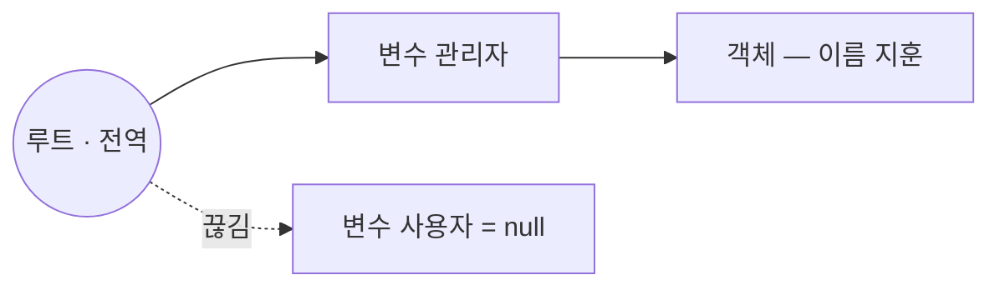
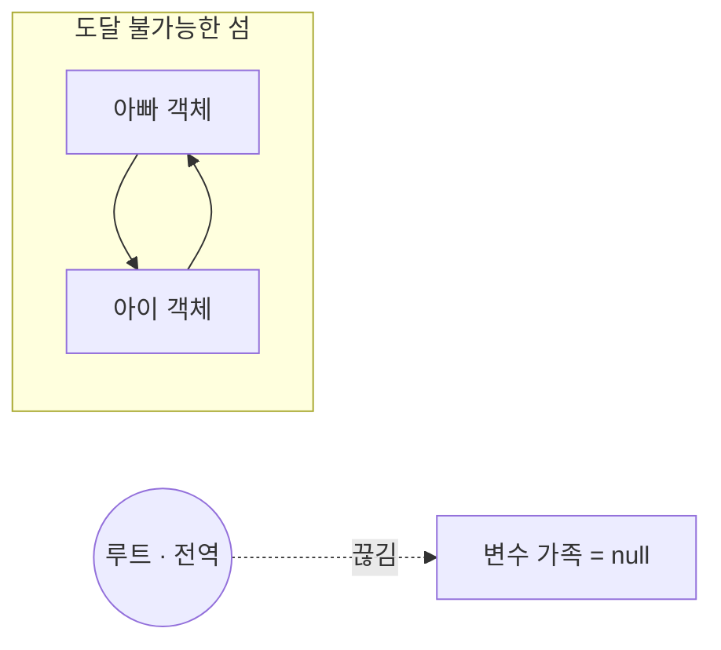

<Callout type="info">
  **이번 문서의 목표:** 이 파일을 다 읽으면 어떤 코드를 보고 "이 객체는 언제 사라지는가"를 참조 그래프로 그려 답할 수 있고, 클로저·타이머·전역 캐시·이벤트 리스너가 만드는 대표적 누수 패턴을 눈으로 식별해 고칠 수 있습니다.
</Callout>

## 1. 메모리는 언제 잡히고 언제 풀리는가

### 모든 언어가 겪는 세 단계

프로그램이 값을 다루려면 메모리(memory, 기억 장치)의 일부를 빌려야 합니다. 어떤 언어든 그 과정은 세 단계입니다.

<Steps>

1. **할당**(allocate) — 값을 담을 공간을 확보한다.
2. **사용**(use) — 그 공간에 읽고 쓴다.
3. **해제**(release) — 다 썼으면 공간을 돌려준다.

</Steps>

C 같은 언어는 3번을 사람이 직접 합니다. 돌려주는 걸 잊으면 **메모리 누수**(memory leak)가, 아직 쓰는 걸 돌려주면 **댕글링 포인터**(dangling pointer, 허공을 가리키는 포인터)가 생깁니다. JavaScript는 1번과 3번을 엔진이 알아서 합니다.

```js
const 사용자 = { 이름: '지훈' };   // 1. 객체를 담을 공간이 자동 할당됨
console.log(사용자.이름);          // 2. 사용
// 3. 해제 코드가 없다 — 엔진이 알아서 회수한다
```

3번을 자동으로 해주는 장치를 **GC**(Garbage Collector, 가비지 컬렉터 — 쓰레기 수집기)라고 부릅니다. "가비지"는 **더 이상 프로그램이 쓸 수 없게 된 값**을 뜻합니다.

> **쉽게 말하면:** GC는 사무실을 도는 청소부입니다. 다만 "안 쓰는 것 같은" 물건을 치우는 게 아니라, **아무도 손이 닿지 않는 곳에 있는 물건만** 치웁니다. 손이 닿는 한 아무리 안 써도 절대 치우지 않습니다.

### 자동인데 왜 알아야 하는가

"엔진이 알아서 하는데 왜 배우나?"라는 질문이 자연스럽습니다. 이유는 두 가지입니다.

1. **GC는 "안 쓰는 값"이 아니라 "닿을 수 없는 값"만 회수합니다.** 이 차이가 메모리 누수의 전부입니다. 프로그래머는 다 썼다고 생각하는데 코드 어딘가에서 여전히 손이 닿고 있으면, 그 값은 영원히 남습니다.
2. **누수는 조용히 자랍니다.** 에러도, 경고도 없습니다. 몇 시간 열어둔 탭이 느려지거나, 서버 프로세스가 며칠 뒤 죽는 방식으로만 드러납니다. 그래서 "이 참조는 언제 끊기는가"를 코드를 읽으며 감지하는 감각이 필요합니다.

## 2. 도달 가능성 — GC의 단 하나의 규칙

### 정의

JavaScript 엔진의 GC 판단 기준은 **도달 가능성**(reachability, 리처빌리티) 하나입니다.

<Callout type="info">
  **루트**(root, 뿌리)라고 부르는 출발점에서 참조를 따라가 **닿을 수 있는 값은 살아남고, 닿을 수 없는 값은 회수 대상**이 됩니다.
</Callout>

루트에 해당하는 것은 대략 이렇습니다.

- 전역 객체(브라우저의 `window`, 표준 이름으로는 `globalThis`)와 그 프로퍼티
- 현재 호출 스택에 쌓여 있는 함수들의 지역 변수와 매개변수
- 그 함수들이 붙잡고 있는 클로저 환경
- 엔진 내부가 붙잡고 있는 값들(모듈 레지스트리 등)

### 참조 그래프로 그려 보기

값과 값 사이의 참조를 화살표로 이으면 그래프가 됩니다. 이것을 **참조 그래프**(reference graph)라고 합니다.

```js
let 사용자 = { 이름: '지훈' };
let 관리자 = 사용자;
사용자 = null;
```



`사용자`를 `null`로 만들었지만 객체는 살아 있습니다. `관리자`라는 다른 길이 남아 있기 때문입니다. **참조를 하나 끊는 것과 객체가 죽는 것은 전혀 다른 일입니다.**

반대로 `관리자 = null`까지 하면 루트에서 그 객체로 가는 길이 모두 사라집니다. 이 상태를 **도달 불가능**(unreachable)이라 하고, 회수 대상이 됩니다.

### 섬 전체가 사라지는 경우

여기서 초보자가 가장 많이 오해하는 지점이 나옵니다. **서로를 가리키는 객체들도 통째로 회수됩니다.**

```js
function 가족만들기() {
  const 아빠 = { 이름: '아빠' };
  const 아이 = { 이름: '아이' };
  아빠.아이 = 아이;   // 서로를 가리킨다
  아이.아빠 = 아빠;
  return 아빠;
}

let 가족 = 가족만들기();
가족 = null;   // 루트에서 가는 길이 끊겼다
```



두 객체는 여전히 서로를 가리키고 있지만, **루트에서 출발해서는 어느 쪽에도 닿을 수 없습니다.** 그래서 섬 전체가 회수됩니다.

<Callout type="warning">
  **자주 틀리는 점:** "순환 참조가 있으면 메모리 누수가 난다"는 말을 어디선가 들었다면, 그것은 옛날 방식인 **참조 카운팅**(reference counting, 나를 가리키는 화살표 개수를 세는 방식)의 한계를 말한 것입니다. 참조 카운팅은 서로 가리키는 두 객체의 카운트가 영원히 1 이상이라 회수하지 못합니다. 현대 JS 엔진은 루트에서 훑어 내려가는 **마크 앤 스윕**(mark and sweep) 계열을 쓰므로 **순환 참조 자체는 누수가 아닙니다.**
</Callout>

## 3. GC는 실제로 어떻게 도는가

명세는 GC 알고리즘을 규정하지 않습니다. 엔진 구현의 자유입니다. 다만 주요 엔진들이 공통적으로 쓰는 뼈대는 알아둘 만합니다.

### 마크 앤 스윕

<Steps>

1. **마크**(mark, 표시) — 루트에서 시작해 참조를 따라가며 닿는 모든 객체에 "살아 있음" 도장을 찍는다.
2. **스윕**(sweep, 쓸어내기) — 힙 전체를 훑으며 도장이 없는 객체의 공간을 회수한다.
3. (선택) **압축**(compact) — 남은 객체들을 앞쪽으로 몰아 붙여 빈 공간의 파편화를 줄인다.

</Steps>

> **쉽게 말하면:** 도서관에서 대출 기록을 따라 "지금 누군가 읽고 있는 책"에 전부 스티커를 붙인 뒤, 스티커 없는 책만 폐기하는 방식입니다. 책끼리 서로 추천사를 써 뒀어도 아무도 안 읽으면 같이 폐기됩니다.

### 세대별 수집

실측해 보면 **객체 대부분은 태어나자마자 죽습니다.** 함수 안에서 잠깐 만든 배열, 중간 계산용 객체 같은 것들입니다. 반대로 오래 살아남은 객체는 앞으로도 오래 살 확률이 높습니다. 이 통계적 경향을 **세대 가설**(generational hypothesis)이라고 하고, 이를 이용한 것이 **세대별 수집**(generational collection)입니다.

- **신세대 영역**(young generation) — 새 객체가 태어나는 좁은 공간. 자주, 빠르게 훑는다.
- **구세대 영역**(old generation) — 신세대에서 몇 번 살아남은 객체가 승격되는 넓은 공간. 가끔, 크게 훑는다.

여기서 실무적으로 의미 있는 결론이 하나 나옵니다. **짧게 살다 죽는 객체를 많이 만드는 것 자체는 대체로 저렴합니다.** 진짜 비용은 **오래 살아남는 객체가 계속 늘어나는 것**입니다. 뒤에서 볼 누수 패턴이 모두 후자입니다.

### 언제 도는가

GC 시점은 예측할 수 없습니다. 엔진이 할당량·유휴 시간 등을 보고 스스로 정합니다. 그래서 두 가지 규칙이 따라옵니다.

1. **GC를 코드로 강제할 표준 방법이 없습니다.** `delete`는 프로퍼티를 지우는 연산자일 뿐 메모리 해제 명령이 아닙니다.
2. **"메모리를 아끼려고" 작성한 미세 최적화는 대개 무의미합니다.** 우리가 통제할 수 있는 것은 오직 **참조를 언제 끊는가**뿐입니다.

## 4. 누수처럼 보이는 패턴 다섯 가지

이제 실전입니다. 아래 다섯 패턴은 "다 썼다고 생각하는데 참조가 남아 있는" 대표적인 경우입니다.

### 패턴 1 — 의도치 않은 전역

```js
function 집계() {
  결과 = [];  // let·const를 빠뜨림!
  // ...
}
```

strict mode가 아니면 선언 없는 대입은 **전역 프로퍼티**를 만듭니다. 전역은 루트이므로 이 배열은 페이지가 닫힐 때까지 절대 회수되지 않습니다. 4편에서 본 strict mode가 이것을 ReferenceError로 잡아 주는 이유가 여기 있습니다.

### 패턴 2 — 끝나지 않는 타이머

```js
const 큰데이터 = new Array(1_000_000).fill('...');

setInterval(() => {
  console.log(큰데이터.length);
}, 1000);
```

인터벌 콜백은 취소하기 전까지 엔진이 붙잡고 있고, 그 콜백의 클로저가 `큰데이터`를 붙잡습니다. 화면에서 해당 기능을 껐더라도 `clearInterval`을 하지 않으면 데이터는 살아 있습니다.

### 패턴 3 — 떼지 않은 이벤트 리스너

```js
function 화면열기(요소) {
  const 무거운상태 = { 캐시: new Array(100000) };
  요소.addEventListener('click', () => 사용(무거운상태));
}
```

리스너는 대상 요소가 살아 있는 한 콜백을, 콜백은 클로저를 통해 상태를 붙잡습니다. 요소를 DOM에서 제거해도 다른 곳에서 그 요소를 변수로 붙잡고 있으면 사슬 전체가 남습니다. 짝이 되는 `removeEventListener`가 필요한 이유입니다.

### 패턴 4 — 무한히 자라는 캐시

```js
const 캐시 = new Map();

function 조회(키, 값만들기) {
  if (!캐시.has(키)) 캐시.set(키, 값만들기());
  return 캐시.get(키);
}
```

`Map`은 키를 **강한 참조**(strong reference)로 붙잡습니다. 키가 객체라면 그 객체는 캐시가 살아 있는 한 절대 회수되지 않습니다. 상한 없는 캐시는 사실상 "천천히 자라는 전역 변수"입니다.

### 패턴 5 — 클로저의 과잉 캡처

```js
function 만들기() {
  const 거대한원본 = 아주큰배열();          // 100MB
  const 요약 = 거대한원본.slice(0, 10);

  return function () {
    return 요약;   // 요약만 쓰는데...
  };
}
```

반환된 함수는 자기 스코프 체인을 통해 **바깥 환경 전체**에 접근할 수 있습니다. 엔진이 실제로 쓰이는 변수만 남기는 최적화를 하기도 하지만, 같은 환경을 공유하는 다른 클로저가 있으면 최적화가 무산되기도 합니다. 확실히 하려면 필요 없는 참조를 명시적으로 끊는 편이 안전합니다.

### 직접 관찰해 보기

메모리 사용량 자체는 코드로 정확히 측정하기 어렵지만, **참조가 끊겼는지 여부**는 관찰할 수 있습니다. 아래 실습기는 `WeakRef`와 `FinalizationRegistry`로 "GC 이후 살아 있는가"를 확인합니다. 값을 바꿔가며 어떤 참조가 객체를 살려두는지 실험해 보세요.

<CodePlayground
  template="vanilla"
  activeFile="/index.js"
  showConsole
  label="도달 가능성 실험 — 어떤 참조가 객체를 살려두는가"
  files={{
    '/index.js': `// 1) 강한 참조 vs 약한 참조 비교
const 강한보관함 = new Map();
const 약한보관함 = new WeakMap();

function 사용자만들기(이름) {
  return { 이름, 메모: new Array(1000).fill(이름) };
}

let 사용자A = 사용자만들기('A');
let 사용자B = 사용자만들기('B');

강한보관함.set(사용자A, '강한 참조로 보관');
약한보관함.set(사용자B, '약한 참조로 보관');

console.log('강한보관함 크기:', 강한보관함.size);
console.log('약한보관함에 B 있나:', 약한보관함.has(사용자B));

// 2) 원본 변수를 끊는다
사용자A = null;
사용자B = null;

// 강한보관함은 키를 붙잡고 있으므로 사용자A 객체는 아직 살아 있다
console.log('사용자A를 null로 만든 뒤 강한보관함 크기:', 강한보관함.size);
console.log('강한보관함에 남아 있는 키:', [...강한보관함.keys()]);

// WeakMap은 크기를 셀 수도, 순회할 수도 없다 — 언제 사라질지 모르기 때문
console.log('WeakMap에는 size도 keys()도 없다:', 약한보관함.size);

// 3) 도달 가능성 직접 확인하기
let 임시 = { 표시: '이 객체는 곧 버려진다' };
const 관찰창 = new WeakRef(임시);
console.log('아직 살아 있나:', 관찰창.deref() !== undefined);

임시 = null;
console.log('참조를 끊은 직후:', 관찰창.deref() !== undefined);
console.log('(GC 시점은 엔진이 정하므로 즉시 사라지지 않을 수 있다)');

// 4) 클로저가 붙잡는 범위 확인
function 만들기() {
  const 거대한원본 = new Array(50000).fill('x');
  let 요약 = 거대한원본.slice(0, 3);
  // 명시적으로 끊어 주기 — 이 줄을 지우고 비교해 보세요
  return function () { return 요약; };
}
const 읽기 = 만들기();
console.log('클로저가 돌려준 요약:', 읽기());
`,
  }}
/>

### 누수 패턴을 코드로 재현하기

아래 실습기는 위 다섯 패턴 중 **타이머**와 **캐시**를 안전한 범위에서 재현합니다. 정리 코드를 넣었을 때와 뺐을 때 참조가 어떻게 달라지는지 비교해 보세요.

<CodePlayground
  template="vanilla"
  activeFile="/index.js"
  showConsole
  label="누수 패턴 재현 — 참조를 끊는 코드가 있는가"
  files={{
    '/index.js': `// 패턴 2 재현 — 타이머가 데이터를 붙잡는다
function 누수있는기능() {
  const 큰데이터 = new Array(10000).fill('x');
  const 아이디 = setInterval(() => {
    console.log('타이머가 아직 데이터를 본다. 길이:', 큰데이터.length);
  }, 300);
  // 정리 함수를 돌려주지 않으면 바깥에서 끊을 방법이 없다
  return null;
}

function 누수없는기능() {
  const 큰데이터 = new Array(10000).fill('x');
  const 아이디 = setInterval(() => {
    console.log('정리 가능한 타이머. 길이:', 큰데이터.length);
  }, 300);
  // 정리 함수를 돌려주면 참조를 끊을 수 있다
  return function 정리() {
    clearInterval(아이디);
    console.log('타이머 정리 완료 — 이제 큰데이터는 도달 불가능해진다');
  };
}

const 정리 = 누수없는기능();
setTimeout(정리, 1000);

// 패턴 4 재현 — 상한 없는 캐시 vs 상한 있는 캐시
const 무한캐시 = new Map();
function 무한조회(키) {
  if (!무한캐시.has(키)) 무한캐시.set(키, { 무거운값: new Array(100).fill(키) });
  return 무한캐시.get(키);
}

const 상한 = 3;
const 제한캐시 = new Map();
function 제한조회(키) {
  if (제한캐시.has(키)) {
    const 값 = 제한캐시.get(키);
    제한캐시.delete(키);      // 최근 사용으로 재배치
    제한캐시.set(키, 값);
    return 값;
  }
  const 값 = { 무거운값: new Array(100).fill(키) };
  제한캐시.set(키, 값);
  if (제한캐시.size > 상한) {
    const 가장오래된 = 제한캐시.keys().next().value;
    제한캐시.delete(가장오래된);  // 참조를 끊어 회수 가능하게 만든다
  }
  return 값;
}

for (let i = 0; i < 10; i++) {
  무한조회('키' + i);
  제한조회('키' + i);
}
console.log('무한 캐시 크기:', 무한캐시.size);   // 10 — 계속 자란다
console.log('상한 캐시 크기:', 제한캐시.size);   // 3  — 유지된다
console.log('상한 캐시에 남은 키:', [...제한캐시.keys()]);
`,
  }}
/>

## 5. 약한 참조 도구들

### WeakMap과 WeakSet

23편에서 본 `WeakMap`·`WeakSet`은 **키를 약하게 잡습니다**. 키로 쓴 객체가 다른 곳에서 도달 불가능해지면, 그 항목은 엔트리째 조용히 사라집니다.

| 비교 항목 | Map | WeakMap |
|-----------|-----|---------|
| 키 종류 | 아무 값 | 객체나 등록되지 않은 심볼만 |
| 키 참조 강도 | 강한 참조 – GC를 막음 | 약한 참조 – GC를 막지 않음 |
| `size` 프로퍼티 | 있음 | 없음 |
| 순회 | 가능 | 불가능 |

`size`도 순회도 없는 것은 불편이 아니라 **필연**입니다. 언제 항목이 사라질지 알 수 없는 컬렉션의 크기를 알려주면, GC 시점이 프로그램에서 관찰 가능해져 버립니다. 명세는 그것을 막습니다.

대표 용도는 **객체에 딸린 부가 정보 보관**입니다. DOM 요소마다 메타데이터를 붙이고 싶을 때 `WeakMap`을 쓰면, 요소가 사라질 때 메타데이터도 알아서 사라집니다.

### WeakRef와 FinalizationRegistry

ES2021에 들어온 두 도구입니다.

- **WeakRef** — 객체를 약하게 감싼 상자입니다. `deref()`를 호출하면 아직 살아 있으면 객체를, 회수됐으면 `undefined`를 돌려줍니다.
- **FinalizationRegistry** — 객체가 회수된 뒤 정리 콜백을 실행하도록 등록합니다.

```js
const 창문 = new WeakRef(무거운객체);

function 나중에() {
  const 객체 = 창문.deref();
  if (객체 === undefined) return; // 이미 회수됨
  객체.사용();
}
```

<Callout type="warning">
  **자주 틀리는 점:** `WeakRef`와 `FinalizationRegistry`는 **일상 코드에서 쓸 도구가 아닙니다.** MDN과 명세 모두 신중히 쓰라고 경고합니다. 이유는 회수 시점이 엔진마다, 실행마다 달라서 **코드가 언제 어떻게 동작할지 재현되지 않기 때문**입니다. 콜백이 아예 호출되지 않을 수도 있습니다. 캐시를 비우고 싶다면 명시적인 상한이나 만료 시간을 두는 편이 언제나 낫습니다.
</Callout>

## 6. 누수를 줄이는 실전 감각

문법보다 중요한 건 코드를 읽으며 스스로에게 던지는 질문입니다.

<Steps>

1. **이 객체를 붙잡는 길이 몇 개인가?** 변수, 배열 원소, 객체 프로퍼티, 클로저, 컬렉션의 키 — 전부 길입니다.
2. **그 길들은 언제 끊기는가?** "화면을 닫으면"이라고 답했다면, 닫을 때 끊는 코드가 실제로 있는지 확인합니다.
3. **끝을 등록했으면 시작도 등록했는가?** `addEventListener` ↔ `removeEventListener`, `setInterval` ↔ `clearInterval`처럼 짝이 있는 API는 짝을 반드시 채웁니다.
4. **무한히 자랄 수 있는 컬렉션인가?** 자랄 수 있다면 상한, 만료, 혹은 약한 참조를 도입합니다.
5. **오래 사는 객체가 짧게 사는 객체를 붙잡고 있지 않은가?** 이 방향의 참조가 누수의 전형입니다. 반대 방향은 대체로 안전합니다.

</Steps>

마지막 질문이 특히 중요합니다. 세대별 수집 관점에서 보면, **오래 사는 것이 새것을 붙잡는 순간 새것도 오래 살게 됩니다.** 전역 배열에 로그 객체를 계속 밀어 넣는 코드가 그렇습니다.

브라우저 개발자 도구의 Memory 패널에서 힙 스냅샷을 두 번 찍고 비교하면, 그 사이에 늘어난 객체와 **그 객체를 붙잡고 있는 경로**를 그대로 볼 수 있습니다. 이 편에서 배운 참조 그래프가 그 화면을 읽는 문법입니다.

## 핵심 정리

- GC의 판단 기준은 "안 쓰는가"가 아니라 **루트에서 도달 가능한가**입니다. 닿을 수 있으면 안 써도 살고, 닿을 수 없으면 서로 가리켜도 죽습니다.
- 현대 엔진은 **마크 앤 스윕** 계열이라 순환 참조 자체는 누수가 아닙니다. 참조 카운팅 시절의 상식은 폐기해도 됩니다.
- **세대별 수집** 덕분에 짧게 살다 죽는 객체는 저렴합니다. 비용은 오래 사는 객체가 계속 늘어날 때 발생합니다.
- 대표 누수 패턴은 의도치 않은 전역, 취소하지 않은 타이머, 떼지 않은 이벤트 리스너, 상한 없는 캐시, 과잉 캡처 클로저 다섯 가지입니다.
- `WeakMap`·`WeakSet`은 키를 약하게 잡아 부가 정보 보관에 적합하고, `WeakRef`·`FinalizationRegistry`는 동작이 비결정적이라 일상 코드에서 피하는 것이 좋습니다.

## 마무리 복습

<Quiz
  questionNumber={1}
  question="JavaScript의 가비지 컬렉터가 어떤 값을 회수 대상으로 판단하는 기준은?"
  options={['일정 시간 동안 사용되지 않았는가', '루트에서 참조를 따라 도달할 수 없는가', '변수에 null을 대입했는가', 'delete 연산자로 삭제했는가']}
  correctAnswer={2}
  explanation="기준은 오직 도달 가능성이다. 오래 안 썼어도 루트에서 닿으면 살아남고, 방금 만들었어도 닿을 수 없으면 회수 대상이다."
  optionExplanations={['사용 빈도는 판단 기준이 아니다', '정답 — 도달 가능성이 유일한 기준이다', 'null 대입은 참조 하나를 끊을 뿐, 다른 참조가 남아 있으면 살아 있다', 'delete는 프로퍼티를 제거하는 연산자이며 메모리 해제 명령이 아니다']}
/>

<Quiz
  questionNumber={2}
  question="서로를 참조하는 두 객체가 있고 외부에서 이들로 가는 모든 참조가 끊겼다. 현대 JS 엔진에서의 결과는?"
  options={['참조 카운트가 1 이상이라 영원히 회수되지 않는다', '두 객체 모두 회수 대상이 된다', '먼저 만들어진 객체만 회수된다', '엔진이 에러를 발생시킨다']}
  correctAnswer={2}
  explanation="마크 앤 스윕 방식은 루트에서 훑어 내려가므로, 서로 가리키더라도 루트에서 닿을 수 없으면 섬 전체가 회수된다. 순환 참조가 누수라는 말은 참조 카운팅 시절의 이야기다."
  optionExplanations={['그것은 참조 카운팅 방식의 한계이며 현대 엔진의 동작이 아니다', '정답 — 도달 불가능한 섬은 통째로 회수된다', '생성 순서는 회수 여부와 무관하다', 'GC는 에러를 발생시키지 않는다']}
/>

<Quiz
  questionNumber={3}
  question="다음 중 메모리 누수 위험이 가장 큰 코드는?"
  options={['함수 안에서 큰 배열을 만들고 반환하지 않은 채 함수가 끝나는 경우', 'setInterval 콜백이 큰 데이터를 참조하는데 clearInterval을 하지 않는 경우', 'for 문 안에서 매번 새 객체를 만드는 경우', '지역 변수에 객체를 담았다가 다른 지역 변수에 다시 담는 경우']}
  correctAnswer={2}
  explanation="취소되지 않은 인터벌은 엔진이 콜백을 계속 붙잡고, 콜백의 클로저가 데이터를 붙잡아 도달 가능 상태를 유지시킨다. 나머지는 함수가 끝나면 참조가 끊겨 회수된다."
  optionExplanations={['함수 종료로 참조가 끊기므로 회수된다', '정답 — 취소하지 않은 타이머는 전형적인 누수 원인이다', '단명 객체는 세대별 수집에서 저렴하게 회수된다', '지역 변수끼리의 이동은 스코프 종료 시 함께 끊긴다']}
/>

<Quiz
  questionNumber={4}
  question="WeakMap에 size 프로퍼티와 순회 메서드가 없는 이유로 가장 알맞은 것은?"
  options={['성능을 높이기 위한 최적화다', '항목이 언제 사라질지 알 수 없어, 크기를 노출하면 GC 시점이 관찰 가능해지기 때문이다', '키로 원시값을 쓸 수 없기 때문이다', '아직 명세에 추가되지 않은 기능이기 때문이다']}
  correctAnswer={2}
  explanation="WeakMap의 항목은 키가 도달 불가능해지면 임의의 시점에 사라진다. size나 순회를 허용하면 GC의 비결정적 시점이 프로그램에서 관찰 가능해지므로 명세가 이를 막는다."
  optionExplanations={['성능이 아니라 관찰 가능성의 문제다', '정답 — GC 시점의 비관찰성을 지키기 위한 설계다', '키 제약은 별개의 규칙이며 size 부재의 이유가 아니다', '누락이 아니라 의도적 설계다']}
/>

<Quiz
  questionNumber={5}
  question="세대별 수집에서 신세대 영역을 자주, 좁게 훑는 이유는?"
  options={['새 객체 대부분이 금방 죽는다는 경험적 경향 때문', '새 객체는 크기가 항상 작기 때문', '새 객체는 순환 참조를 만들지 않기 때문', '구세대 영역에는 GC가 적용되지 않기 때문']}
  correctAnswer={1}
  explanation="세대 가설에 따르면 객체 대부분은 태어나자마자 죽고, 오래 살아남은 객체는 계속 살 확률이 높다. 그래서 좁은 신세대를 자주 훑는 것이 효율적이다."
  optionExplanations={['정답 — 세대 가설이 근거다', '크기와는 무관하다', '순환 참조 여부는 세대 구분과 관계없다', '구세대에도 주기적으로 GC가 수행된다']}
/>

<Quiz
  questionNumber={6}
  question="변수 사용자에 담긴 객체를 관리자 변수에도 담은 뒤 사용자에 null을 대입했다. 객체의 상태는?"
  options={['즉시 회수된다', '관리자를 통해 도달 가능하므로 살아 있다', 'null이 두 변수 모두에 전파된다', '참조 카운트가 0이 되어 회수 예약된다']}
  correctAnswer={2}
  explanation="참조 하나를 끊었을 뿐 다른 경로가 남아 있으므로 객체는 도달 가능하다. null 대입은 그 변수의 값만 바꿀 뿐 다른 변수에 영향을 주지 않는다."
  optionExplanations={['다른 참조가 살아 있어 회수되지 않는다', '정답 — 남은 경로가 하나라도 있으면 살아남는다', 'null 대입은 해당 변수에만 적용된다', '경로가 남아 있으므로 도달 가능 상태다']}
/>

<Quiz
  questionNumber={7}
  question="WeakRef 사용에 대한 설명으로 가장 적절한 것은?"
  options={['메모리를 확실히 아끼는 표준 최적화 도구이므로 적극 사용해야 한다', 'deref 호출 시 회수된 객체면 undefined를 반환하며, 회수 시점이 비결정적이라 일상 코드에서는 권장되지 않는다', 'WeakRef로 감싼 객체는 절대 회수되지 않는다', 'WeakRef는 원시값도 감쌀 수 있다']}
  correctAnswer={2}
  explanation="WeakRef는 약한 참조 상자이며 deref로 생존 여부를 확인한다. 회수 시점이 엔진과 실행마다 달라 동작이 재현되지 않으므로 명세와 MDN 모두 신중한 사용을 권한다."
  optionExplanations={['비결정적 동작 때문에 적극 권장되지 않는다', '정답 — 동작과 주의사항을 모두 맞게 설명했다', '반대로 약하게 잡아 회수를 막지 않는다', 'WeakRef의 대상은 객체나 등록되지 않은 심볼이다']}
/>

## 참고 자료

- [MDN - Memory management](https://developer.mozilla.org/en-US/docs/Web/JavaScript/Guide/Memory_management)
- [MDN - WeakMap](https://developer.mozilla.org/en-US/docs/Web/JavaScript/Reference/Global_Objects/Map)
- [ECMAScript Language Specification](https://262.ecma-international.org/)
