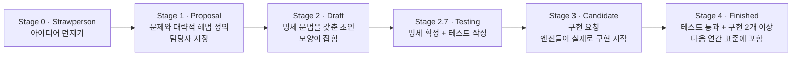

<Callout type="info">
  **이번 문서의 목표:** 이 파일을 다 읽으면 처음 보는 ECMAScript 문법을 만났을 때 "이건 어떤 기존 개념의 설탕인가, 새 동작인가"를 스스로 분류하고, TC39 제안 단계와 런타임 지원을 구분해 도입 여부를 판단할 수 있습니다.
</Callout>

## 1. 왜 "새 문법 외우기"는 실패하는가

ECMAScript는 2015년 이후 **해마다** 새 버전을 냅니다. ES2016, ES2017, … 이렇게 매년 몇 개씩 기능이 들어오니, 나온 순서대로 목록을 외우는 방식은 금세 무너집니다. 작년에 외운 목록이 올해면 낡습니다.

그런데 30편까지 읽어 온 우리에게는 다른 길이 있습니다. **JavaScript의 실행 모델은 거의 변하지 않았습니다.** 값과 참조, 실행 컨텍스트와 스코프, 프로토타입 체인, 이터레이션 프로토콜, 마이크로태스크 큐 — 이 뼈대는 2015년 이후 그대로입니다. 새 문법은 대부분 **이 뼈대 위에 얹히는 편의**이거나, **뼈대의 빈칸을 메우는 보완**입니다.

> **쉽게 말하면:** 새 문법을 배우는 일은 새 언어를 배우는 게 아니라, 이미 아는 도시에 새 가게가 하나 생긴 것을 확인하는 일입니다. 도로망은 그대로입니다.

그래서 이 편의 목표는 목록 암기가 아니라 **분류 훈련**입니다. 새 문법을 만나면 세 질문을 던집니다.

<Steps>

1. **이건 기존 코드로 똑같이 쓸 수 있나?** — 가능하면 **문법 설탕**(syntactic sugar, 신택틱 슈거)입니다. 읽기 편하게 만든 축약일 뿐, 실행 모델은 그대로입니다.
2. **기존 코드로는 흉내 낼 수 없는 새 동작인가?** — 그렇다면 실행 모델에 **새 규칙**이 추가된 것입니다. 이건 반드시 원리를 이해해야 합니다.
3. **어느 프로토콜에 붙는가?** — 이터러블인가, thenable인가, 프로토타입인가. 붙는 자리를 알면 동작이 예측됩니다.

</Steps>

## 2. 새 문법은 어떻게 표준이 되는가 — TC39 단계

### 누가 정하는가

ECMAScript 표준을 만드는 조직은 **TC39**(Technical Committee 39, 기술위원회 39)입니다. Ecma International이라는 표준화 단체 안의 위원회이고, 브라우저 벤더·런타임 개발사·개인 전문가로 구성됩니다. 이들이 정기 회의에서 **합의**(consensus)로 제안을 통과시킵니다. 투표가 아니라 반대가 없어야 통과라는 점이 중요합니다.

### 0단계부터 4단계까지

모든 기능은 **제안**(proposal, 프로포절)이라는 이름으로 다음 단계를 밟습니다.



각 단계를 실무 감각으로 번역하면 이렇습니다.

| 단계 | 상태 | 실무에서의 태도 |
|------|------|-----------------|
| 0–1 | 아이디어·문제 정의 | 구경만 한다. 통째로 사라질 수 있다 |
| 2 | 명세 초안 | 방향은 잡혔지만 문법이 바뀔 수 있다 |
| 2.7 | 명세 확정·테스트 | 큰 변경은 드물다 |
| 3 | 구현 요청 | 엔진 구현이 나오기 시작 – 실험적 도입 가능 |
| 4 | 완료 | 표준. 지원 범위만 확인하면 됨 |

<Callout type="warning">
  **자주 틀리는 점:** "Stage 3면 표준이니 써도 된다"는 오해가 흔합니다. Stage 3은 **엔진에게 구현해 보라고 요청하는 단계**이지 확정이 아닙니다. 실제로 Stage 3까지 갔다가 문법이 크게 바뀌거나 후퇴한 제안이 여러 번 있었습니다. 반대로 Stage 4라도 **오래된 실행 환경에는 없을 수 있습니다.** 표준화 여부와 실행 환경 지원 여부는 **다른 축**이라는 점을 항상 분리해서 생각해야 합니다.
</Callout>

### 버전 번호를 대하는 법

"ES6"라는 이름이 워낙 유명해 버전 번호로 기능을 기억하는 습관이 생겼지만, TC39는 2015년 이후 **연도 기반 이름**을 씁니다. ES2015, ES2020처럼요. 그리고 실무에서 중요한 질문은 대부분 이렇습니다.

- ❌ "이건 ES 몇에 들어왔지?"
- ✅ "이걸 내가 배포할 환경들이 지원하나?"

전자는 역사 지식이고 후자는 의사결정입니다. 후자는 MDN의 각 문서 하단에 있는 브라우저 호환성 표나 caniuse 같은 자료로 확인합니다.

## 3. 새 문법 해석 훈련 ① — 문법 설탕 계열

이제 실제 사례로 분류 훈련을 해봅니다. 먼저 **기존 모델 위에 얹힌 축약**들입니다.

### 논리 할당 연산자

```js
설정.모드 ||= 'light';   // 설정.모드 || (설정.모드 = 'light')
설정.값 &&= 정규화(설정.값); // 설정.값 && (설정.값 = 정규화(설정.값))
설정.제목 ??= '제목 없음'; // 설정.제목 ?? (설정.제목 = '제목 없음')
```

6편에서 배운 **단축 평가**(short-circuit evaluation)를 할당과 합친 것입니다. 여기서 중요한 미묘함이 하나 있습니다.

<Callout type="info">
  `a ||= b`는 `a = a || b`와 **완전히 같지 않습니다.** 논리 할당은 왼쪽이 이미 조건을 만족하면 **대입 자체를 실행하지 않습니다.** `a = a || b`는 언제나 대입이 일어나므로, 대상이 setter를 가진 접근자 프로퍼티라면 setter가 호출됩니다. 7편의 프로퍼티 어트리뷰트 지식이 여기서 쓰입니다.
</Callout>

### 숫자 구분자와 지수 연산자

```js
const 인구 = 51_780_000;   // 밑줄은 파서가 무시한다 — 값은 51780000
const 넓이 = 2 ** 10;      // Math.pow(2, 10)와 동일
```

숫자 구분자는 **토큰을 읽는 단계에서만** 의미가 있습니다. 값에도, 타입에도 영향이 없습니다. 문자열로 바꿔 `Number('51_780_000')`을 하면 `NaN`이 나옵니다 — 문법이지 값의 일부가 아니기 때문입니다.

### 배열·문자열의 `at` 메서드

```js
const 목록 = ['가', '나', '다'];
목록.at(-1);   // '다'
목록[목록.length - 1]; // 같은 결과, 더 장황함
```

음수 인덱스를 지원하는 조회 메서드입니다. **대괄호 표기법이 바뀐 게 아니라는 점**이 핵심입니다. `목록[-1]`은 여전히 `undefined`입니다. 3편에서 본 대로 배열의 인덱스는 문자열 키이고, `'-1'`이라는 키는 없기 때문입니다.

### `Object.hasOwn`

```js
Object.hasOwn(대상, '키');            // 새 방식
Object.prototype.hasOwnProperty.call(대상, '키'); // 기존 방식
```

13편에서 본 프로토타입 체인 문제를 정리한 것입니다. `대상.hasOwnProperty('키')`를 직접 부르면, 대상이 `Object.create(null)`로 만들어졌거나 `hasOwnProperty`라는 이름의 프로퍼티를 가지고 있을 때 깨집니다. `Object.hasOwn`은 그 위험을 없앤 정적 메서드입니다.

## 4. 새 문법 해석 훈련 ② — 모델에 규칙이 늘어난 계열

이번엔 기존 코드로 흉내 낼 수 없거나, 실행 모델 자체를 건드리는 것들입니다.

### 변경 대신 복사하는 배열 메서드

17·18편에서 `sort`, `reverse`, `splice`가 **원본을 바꾼다**는 함정을 봤습니다. ES2023은 같은 일을 하되 **새 배열을 돌려주는** 짝을 추가했습니다.

| 원본을 바꾸는 기존 메서드 | 복사본을 돌려주는 새 메서드 |
|---------------------------|-----------------------------|
| `sort` | `toSorted` |
| `reverse` | `toReversed` |
| `splice` | `toSpliced` |
| 인덱스 직접 대입 | `with` |

이건 단순 축약이 아닙니다. **불변성**(immutability, 이뮤터빌리티)을 지키는 코드 스타일을 언어가 지원하기로 한 방향 전환입니다. 아래에서 두 계열의 차이를 직접 확인해 보세요.

<CodePlayground
  template="vanilla"
  activeFile="/index.js"
  showConsole
  label="원본 변경 메서드와 복사본 메서드 비교"
  files={{
    '/index.js': `const 점수 = [30, 10, 20];

// 1) 기존 방식 — 원본이 바뀐다
const 정렬결과 = 점수.sort((a, b) => a - b);
console.log('sort 후 원본:', 점수);        // [10, 20, 30] ← 원본이 변했다
console.log('반환값이 원본과 같은가:', 정렬결과 === 점수); // true

// 2) 새 방식 — 원본은 그대로
const 점수2 = [30, 10, 20];
const 정렬본 = 점수2.toSorted((a, b) => a - b);
console.log('toSorted 후 원본:', 점수2);   // [30, 10, 20] ← 그대로
console.log('새 배열:', 정렬본);           // [10, 20, 30]
console.log('다른 배열인가:', 정렬본 !== 점수2); // true

// 3) with — 특정 인덱스만 바꾼 복사본
const 원본 = ['가', '나', '다'];
console.log('with 결과:', 원본.with(1, '변경'));
console.log('with 후 원본:', 원본);

// 4) toSpliced — splice의 복사본 버전
console.log('toSpliced:', 원본.toSpliced(1, 1, 'X', 'Y'));
console.log('toSpliced 후 원본:', 원본);

// 5) at — 음수 인덱스는 메서드에서만 통한다
console.log('at(-1):', 원본.at(-1));
console.log('대괄호 [-1]:', 원본[-1]); // undefined
`,
  }}
/>

### 그룹으로 묶기

ES2024의 `Object.groupBy`와 `Map.groupBy`는 "배열을 기준에 따라 묶기"라는, 그동안 `reduce`로 매번 손으로 짜던 작업을 표준화했습니다.

```js
const 결과 = Object.groupBy(학생들, (학생) => 학생.학년);
```

두 가지가 다릅니다.

- `Object.groupBy`는 키를 **문자열로** 변환한 일반 객체를 만듭니다. 정확히는 프로토타입이 `null`인 객체라, 상속된 프로퍼티와 이름이 충돌할 걱정이 없습니다.
- `Map.groupBy`는 **Map**을 만듭니다. 23편에서 본 대로 Map은 객체를 포함한 아무 값이나 키로 쓸 수 있습니다.

### 이터레이터 헬퍼

24편에서 이터레이션 프로토콜과 제너레이터를 배웠습니다. 그때 "배열의 `map`·`filter`는 편한데, 이터레이터에는 왜 없나?"라는 아쉬움이 있었죠. ES2025의 **이터레이터 헬퍼**(iterator helpers)가 그 빈칸을 메웁니다.

핵심은 **지연 평가**(lazy evaluation)입니다. 배열 메서드는 매 단계마다 중간 배열을 통째로 만들지만, 이터레이터 헬퍼는 **필요한 만큼만** 값을 끌어옵니다. 무한 수열에도 쓸 수 있는 이유입니다.

<CodePlayground
  template="vanilla"
  activeFile="/index.js"
  showConsole
  label="이터레이터 헬퍼 — 무한 수열에서 필요한 만큼만 꺼내기"
  files={{
    '/index.js': `// 끝이 없는 제너레이터
function* 자연수() {
  let n = 1;
  while (true) yield n++;
}

// 배열 메서드로는 불가능하다 — 무한 배열을 만들 수 없으므로
// 이터레이터 헬퍼가 있는 환경이면 아래가 동작한다
const 반복자 = 자연수();

if (typeof 반복자.take === 'function') {
  const 결과 = 자연수()
    .filter((n) => n % 3 === 0)
    .map((n) => n * n)
    .take(5)
    .toArray();
  console.log('3의 배수 제곱 5개:', 결과);
} else {
  console.log('이 환경에는 이터레이터 헬퍼가 아직 없습니다.');
}

// 헬퍼가 없을 때 직접 만들어 보는 버전 — 원리는 같다
function* 골라내기(반복가능, 조건) {
  for (const 값 of 반복가능) if (조건(값)) yield 값;
}
function* 앞에서(반복가능, 개수) {
  let i = 0;
  for (const 값 of 반복가능) {
    if (i++ >= 개수) return;
    yield 값;
  }
}

const 직접구현 = [...앞에서(골라내기(자연수(), (n) => n % 3 === 0), 5)];
console.log('직접 만든 지연 파이프라인:', 직접구현.map((n) => n * n));

// 왜 지연 평가인가 — 평가 횟수를 세어 보자
let 호출횟수 = 0;
function* 감시된자연수() {
  let n = 1;
  while (true) { 호출횟수++; yield n++; }
}
[...앞에서(감시된자연수(), 3)];
console.log('3개만 꺼냈을 때 생성 횟수:', 호출횟수); // 무한이 아니라 3~4회
`,
  }}
/>

### Set의 집합 연산

ES2025는 `Set`에 수학의 집합 연산을 그대로 옮겨왔습니다. `union`(합집합), `intersection`(교집합), `difference`(차집합), `symmetricDifference`(대칭차집합), `isSubsetOf`, `isSupersetOf`, `isDisjointFrom`입니다. 이들은 새 `Set`을 반환하고 원본을 바꾸지 않습니다 — 위에서 본 "변경 대신 복사" 흐름과 같은 방향입니다.

### 에러의 원인 연결

```js
try {
  저수준작업();
} catch (원인) {
  throw new Error('주문 저장 실패', { cause: 원인 });
}
```

28편에서 본 에러 설계 문제를 언어가 해결한 사례입니다. 예전에는 원본 에러를 감싸면서 원인을 잃거나, 직접 프로퍼티를 붙여야 했습니다. `cause`는 이제 **표준 옵션**입니다.

### Promise.withResolvers

```js
const { promise, resolve, reject } = Promise.withResolvers();
```

25편에서 본 **지연된 프로미스**(deferred) 패턴을 표준화한 것입니다. 예전에는 생성자 안에서 함수를 바깥 변수로 빼내는 어색한 코드를 써야 했습니다.

## 5. 지금 진행 중인 큰 변화들

Stage 3 근처에서 실제로 언어의 모양을 바꾸고 있는 제안들입니다. **아직 확정이 아니라는 전제**로 읽으세요.

### Temporal — Date를 대체하는 날짜·시간 API

19편에서 `Date`의 함정들을 봤습니다. 월이 0부터 시작하고, 가변 객체이고, 시간대 처리가 빈약합니다. **Temporal**은 이 모두를 다시 설계한 API입니다. 불변 객체를 쓰고, 날짜만·시간만·시간대 포함 시점을 각각 다른 타입으로 구분합니다.

### 명시적 자원 관리 — using 선언

```js
{
  using 파일 = 열기('data.txt');
  // 블록을 벗어나면 파일[Symbol.dispose]()가 자동 호출된다
}
```

파일이나 연결처럼 **다 쓰면 반드시 닫아야 하는 것**을 블록 종료 시 자동 정리합니다. 16편에서 본 웰노운 심볼 체계에 `Symbol.dispose`와 `Symbol.asyncDispose`가 추가되는 형태라, **기존 프로토콜 위에 새 프로토콜을 얹는** 전형적인 예입니다.

### 데코레이터

클래스와 그 멤버에 `@이름` 형태로 부가 동작을 붙이는 문법입니다. 14편의 class 모델 위에 얹히며, 오랜 기간 설계가 여러 번 바뀐 대표적 사례이기도 합니다.

### import 속성

```js
import 설정 from './config.json' with { type: 'json' };
```

29편의 모듈 시스템에 "이 모듈을 어떻게 해석할지"를 알려주는 정보가 추가되는 것입니다. 보안상 중요한 규칙이 하나 딸려 있습니다 — 이 속성이 없으면 JSON 모듈을 **스크립트로 실행해 버릴 위험**이 있기 때문에, 명시를 강제하는 방향으로 설계되었습니다.

## 6. 새 문법을 만났을 때의 실전 체크리스트

<Steps>

1. **MDN에서 이름을 검색한다.** 문서 하단의 호환성 표에서 지원 범위를 먼저 본다.
2. **어느 축에 붙는지 분류한다.** 값·연산자·프로토타입 메서드·프로토콜·모듈·클래스 중 어디인가.
3. **기존 코드로 같은 일을 써본다.** 써지면 문법 설탕, 안 써지면 새 규칙이다.
4. **엣지 케이스를 하나 만들어 본다.** 빈 배열, `null`, `NaN`, 음수 인덱스, 희소 배열처럼 이 과목에서 함정으로 배운 값들을 넣어 본다.
5. **원본을 바꾸는지 확인한다.** 최근 표준의 방향은 대체로 "바꾸지 않고 새로 만든다"이다.
6. **도입을 결정한다.** 배포 환경이 지원하는가, 지원하지 않으면 대체 코드가 있는가.

</Steps>

<Callout type="warning">
  **자주 틀리는 점:** 새 문법을 "무조건 최신이 낫다"며 도입하는 것과, "안전하게 옛날 문법만 쓴다"며 거부하는 것 **둘 다 판단을 회피하는 태도**입니다. 판단 기준은 하나입니다 — 이 문법이 **의도를 더 정확하게 드러내는가**. `toSorted`는 "원본을 안 건드린다"는 의도를 코드에 새기므로 가치가 있고, 숫자 구분자는 자릿수를 읽기 쉽게 하므로 가치가 있습니다. 반면 의미가 같은데 짧기만 한 문법은 팀의 익숙함이 더 중요할 수 있습니다.
</Callout>

## 핵심 정리

- 새 문법은 목록으로 외우는 것이 아니라 **문법 설탕인가 새 규칙인가**로 분류해 기존 실행 모델에 붙이는 것입니다.
- TC39의 제안은 Stage 0부터 4까지 진행되며, **Stage 4만 표준**입니다. 표준화 여부와 실행 환경 지원 여부는 별개의 축입니다.
- 논리 할당, 숫자 구분자, `at`, `Object.hasOwn`은 기존 모델의 축약이거나 알려진 함정을 정리한 것입니다. 다만 `a ||= b`처럼 **대입이 생략되는** 미묘한 차이는 반드시 확인해야 합니다.
- `toSorted`·`toReversed`·`toSpliced`·`with`, Set 집합 연산, 이터레이터 헬퍼는 "원본을 바꾸지 않는다"와 "지연 평가"라는 **방향성**을 보여주는 변화입니다.
- Temporal, `using` 선언, 데코레이터, import 속성은 진행 중인 큰 변화이며, 모두 기존 프로토콜과 모델 위에 얹히는 형태로 설계되고 있습니다.

## 마무리 복습

<Quiz
  questionNumber={1}
  question="TC39 제안 단계 중 다음 연간 표준에 실제로 포함되는 단계는?"
  options={['Stage 1', 'Stage 2', 'Stage 3', 'Stage 4']}
  correctAnswer={4}
  explanation="Stage 4는 테스트 통과와 두 개 이상의 구현이 확인된 완료 상태로, 다음 연간 표준에 포함된다. Stage 3은 엔진에 구현을 요청하는 단계일 뿐 확정이 아니다."
  optionExplanations={['문제와 대략적 해법을 정의한 초기 단계다', '명세 초안 단계로 문법이 바뀔 수 있다', '구현 요청 단계이며 이후 변경된 사례도 있다', '정답 — 완료 단계로 표준에 포함된다']}
/>

<Quiz
  questionNumber={2}
  question="a ||= b 와 a = a || b 의 차이로 옳은 것은?"
  options={['둘은 완전히 동일하다', '논리 할당은 왼쪽이 조건을 만족하면 대입 자체를 실행하지 않는다', '논리 할당은 항상 대입을 실행한다', '논리 할당은 b를 항상 평가한다']}
  correctAnswer={2}
  explanation="논리 할당은 필요할 때만 대입을 수행한다. 그래서 대상이 setter를 가진 접근자 프로퍼티일 때 불필요한 setter 호출이 발생하지 않는다."
  optionExplanations={['대입 실행 여부에서 차이가 난다', '정답 — 대입 생략이 핵심 차이다', '대입을 생략하는 것이 이 문법의 특징이다', '단축 평가이므로 왼쪽이 참이면 b는 평가되지 않는다']}
/>

<Quiz
  questionNumber={3}
  question="배열 목록에 대해 목록.at(-1)과 목록[-1]의 결과 관계로 옳은 것은?"
  options={['둘 다 마지막 요소를 반환한다', 'at(-1)은 마지막 요소, 대괄호 표기는 undefined', 'at(-1)은 undefined, 대괄호 표기는 마지막 요소', '둘 다 에러가 발생한다']}
  correctAnswer={2}
  explanation="at 메서드가 음수 인덱스를 지원하도록 만들어졌을 뿐, 대괄호 표기의 규칙은 바뀌지 않았다. 배열 인덱스는 문자열 키이며 -1이라는 키는 존재하지 않는다."
  optionExplanations={['대괄호 표기는 음수를 지원하지 않는다', '정답 — 새 메서드가 추가된 것이지 기존 표기가 바뀐 것이 아니다', '반대로 설명했다', '없는 프로퍼티 접근은 에러가 아니라 undefined다']}
/>

<Quiz
  questionNumber={4}
  question="toSorted 메서드에 대한 설명으로 옳은 것은?"
  options={['원본 배열을 정렬하고 원본을 반환한다', '원본을 그대로 두고 정렬된 새 배열을 반환한다', 'sort와 완전히 동일하다', '숫자 배열에만 사용할 수 있다']}
  correctAnswer={2}
  explanation="toSorted는 변경 대신 복사 계열의 메서드로, 원본을 유지하고 새 배열을 반환한다. sort는 원본을 정렬하고 원본 자신을 반환한다."
  optionExplanations={['그것은 sort의 동작이다', '정답 — 불변성을 지키는 방향의 새 메서드다', '원본 변경 여부가 결정적으로 다르다', '비교 함수를 넘기면 어떤 값이든 정렬할 수 있다']}
/>

<Quiz
  questionNumber={5}
  question="이터레이터 헬퍼가 배열 메서드 체이닝에 비해 갖는 본질적 이점은?"
  options={['코드가 더 짧다', '중간 배열을 만들지 않고 필요한 만큼만 값을 꺼내는 지연 평가가 가능하다', '항상 실행 속도가 빠르다', '비동기 코드에서만 쓸 수 있다']}
  correctAnswer={2}
  explanation="배열 메서드는 각 단계마다 중간 배열을 만들지만, 이터레이터 헬퍼는 요청받은 만큼만 값을 끌어온다. 그래서 무한 수열에도 적용할 수 있다."
  optionExplanations={['길이는 비슷하며 본질적 차이가 아니다', '정답 — 지연 평가가 핵심이며 무한 수열 처리가 가능해진다', '데이터가 작으면 배열 메서드가 더 빠를 수도 있다', '동기 이터레이터에도 사용한다']}
/>

<Quiz
  questionNumber={6}
  question="Object.hasOwn이 도입된 이유로 가장 알맞은 것은?"
  options={['속도가 더 빠르기 때문', '프로토타입이 null인 객체나 hasOwnProperty를 프로퍼티로 가진 객체에서도 안전하게 확인하기 위해', '상속된 프로퍼티까지 확인하기 위해', 'in 연산자를 대체하기 위해']}
  correctAnswer={2}
  explanation="객체에 직접 hasOwnProperty를 호출하는 방식은 프로토타입이 없거나 동명 프로퍼티가 있으면 깨진다. 정적 메서드로 만들어 그 위험을 없앤 것이다."
  optionExplanations={['성능이 도입 이유는 아니다', '정답 — 안전성 문제를 해결한 것이다', '자기 자신의 프로퍼티만 확인하는 메서드다', 'in은 상속까지 확인하는 별개 연산자다']}
/>

<Quiz
  questionNumber={7}
  question="Error 생성자의 두 번째 인수로 넘기는 옵션 객체의 cause 프로퍼티가 하는 일은?"
  options={['에러 메시지를 자동 번역한다', '원래 발생한 에러를 표준화된 방식으로 함께 담아 원인 사슬을 유지한다', '에러 발생 시 프로그램을 중단시킨다', '스택 트레이스를 제거한다']}
  correctAnswer={2}
  explanation="저수준 에러를 상위 맥락의 에러로 감쌀 때 원인을 잃지 않도록 표준화한 옵션이다. 예전에는 직접 프로퍼티를 붙이거나 원인을 버려야 했다."
  optionExplanations={['번역 기능은 없다', '정답 — 원인 사슬 보존이 목적이다', '중단 여부와는 무관하다', '스택 트레이스는 그대로 유지된다']}
/>

<Quiz
  questionNumber={8}
  question="새로운 문법을 도입할지 판단할 때 가장 적절한 기준은?"
  options={['무조건 최신 문법을 우선한다', '오래된 문법만 사용해 안전을 확보한다', '의도를 더 정확히 드러내는지와 배포 환경 지원 여부를 함께 본다', 'Stage 3 이상이면 무조건 사용한다']}
  correctAnswer={3}
  explanation="최신 선호와 무조건 거부는 모두 판단을 회피하는 태도다. 의미 전달력과 실제 지원 범위를 함께 따져야 한다. Stage 3은 확정 단계가 아니다."
  optionExplanations={['새롭다는 이유만으로는 근거가 되지 않는다', '개선된 표현력을 포기하는 선택이다', '정답 — 표현력과 지원 범위를 함께 본다', 'Stage 3은 구현 요청 단계이며 변경될 수 있다']}
/>

## 참고 자료

- [ECMA-262 표준 소개](https://ecma-international.org/publications-and-standards/standards/ecma-262/)
- [ECMAScript Language Specification](https://262.ecma-international.org/)
- [MDN - JavaScript reference](https://developer.mozilla.org/en-US/docs/Web/JavaScript/Reference)
