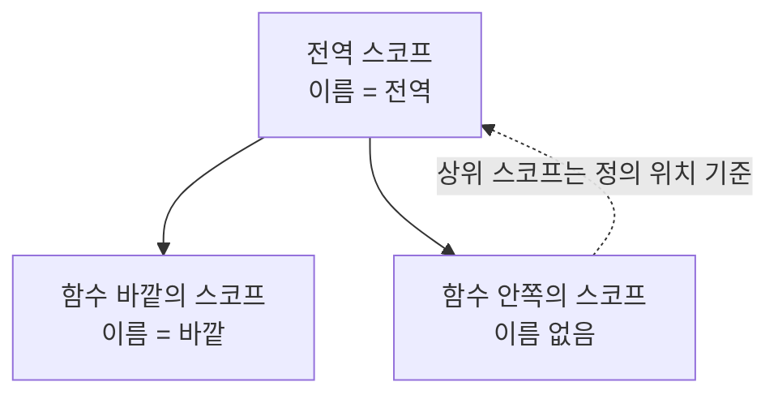

<Callout type="info">
  **이번 문서의 목표:** 이 파일을 다 읽으면 5·6·9·10편에서 배운 강제 변환·단축 평가·호이스팅·TDZ·클로저 지식을 **코드를 보고 출력을 예측하는 능력**으로 바꿀 수 있습니다. 모든 문제는 실습기에서 직접 실행해 답을 확인할 수 있습니다.
</Callout>

<Callout type="warning">
  **고지:** 이 편의 문제들은 **실제 시험 기출 문제를 복제한 것이 아닙니다.** ECMAScript 명세와 MDN 문서에 정의된 동작을 기준으로, 5·6·9·10편에서 다룬 개념을 확인하기 위해 **새로 재구성한 문제**입니다. 목적은 점수 예측이 아니라 실행 모델 점검입니다.
</Callout>

## 이 편을 푸는 방법

문제를 만나면 **반드시 먼저 종이나 머릿속으로 답을 적은 뒤** 실습기를 실행하세요. 예측 없이 실행부터 하면 "아 그렇구나"로 끝나고 아무것도 남지 않습니다. 틀렸다면 그 자리에서 다음 세 가지를 확인합니다.

<Steps>

1. **어떤 추상 연산이 불렸는가** — ToPrimitive, ToNumber, ToString, ToBoolean 중 무엇인가.
2. **어떤 환경 레코드를 찾아갔는가** — 스코프 체인의 어느 단계에서 그 이름을 찾았는가.
3. **언제 실행되었는가** — 평가 시점인가 호출 시점인가.

</Steps>

## A. 강제 변환 실험

### A-1. 덧셈 연산자의 두 얼굴

`+` 연산자는 **피연산자 중 하나라도 문자열이면 이어붙이기**, 아니면 숫자 덧셈을 합니다. 객체가 끼면 먼저 ToPrimitive로 원시값을 만듭니다. 아래 출력을 예측한 뒤 실행하세요.

<CodePlayground
  template="vanilla"
  activeFile="/index.js"
  showConsole
  label="실험 A-1 — 덧셈 연산자와 ToPrimitive"
  files={{
    '/index.js': `console.log(1 + '2');        // ?
console.log('3' + 4 + 5);    // ?
console.log(3 + 4 + '5');    // ?
console.log(1 + true);       // ?
console.log(1 + null);       // ?
console.log(1 + undefined);  // ?
console.log([] + []);        // ?
console.log([] + {});        // ?
console.log([1, 2] + [3]);   // ?
console.log('' + {});        // ?

// 힌트: 배열의 ToPrimitive는 join(',') 결과를 낸다
console.log([1, 2].toString()); // '1,2'
console.log(({}).toString());   // '[object Object]'
`,
  }}
/>

핵심 해설을 정리합니다.

- `'3' + 4 + 5`는 **왼쪽부터** 평가합니다. `'3' + 4`가 `'34'`가 되고, `'34' + 5`가 `'345'`입니다.
- `3 + 4 + '5'`는 먼저 `3 + 4 = 7`이 되고, `7 + '5'`가 `'75'`입니다. **순서가 결과를 바꿉니다.**
- `null`은 ToNumber에서 `0`이 되므로 `1 + null`은 `1`입니다. `undefined`는 `NaN`이 되므로 `1 + undefined`는 `NaN`입니다.
- 빈 배열의 원시값은 빈 문자열이고, 빈 객체의 원시값은 `'[object Object]'`입니다. 그래서 `[] + {}`가 `'[object Object]'`가 됩니다.

<Callout type="warning">
  **자주 틀리는 점:** `+`만 문자열 이어붙이기를 하고, `-`, `*`, `/`는 **언제나 숫자로 변환**합니다. `'10' - 5`는 `5`, `'10' + 5`는 `'105'`입니다. 같은 값에 연산자만 바꿨는데 타입이 달라집니다.
</Callout>

### A-2. 느슨한 동등 비교의 규칙

`==`는 타입이 다르면 변환 후 비교합니다. 그 규칙을 표로 외우기보다 **원리 세 줄**로 기억하는 편이 낫습니다.

1. `null`과 `undefined`는 **서로만** 같습니다. 다른 어떤 값과도 같지 않습니다.
2. 숫자와 문자열을 비교하면 **문자열을 숫자로** 바꿉니다.
3. 불리언이 끼면 **불리언을 먼저 숫자로** 바꿉니다. 그 후 규칙을 다시 적용합니다.
4. 객체와 원시값을 비교하면 **객체를 ToPrimitive**로 바꿉니다.

<CodePlayground
  template="vanilla"
  activeFile="/index.js"
  showConsole
  label="실험 A-2 — 느슨한 동등 비교 예측"
  files={{
    '/index.js': `console.log(null == undefined); // ?
console.log(null == 0);         // ?
console.log(null >= 0);         // ?
console.log(undefined == 0);    // ?
console.log('' == 0);           // ?
console.log('0' == 0);          // ?
console.log('' == '0');         // ?
console.log(false == '0');      // ?
console.log(false == []);       // ?
console.log([] == ![]);         // ?
console.log(NaN == NaN);        // ?
console.log([1] == 1);          // ?
console.log([1, 2] == '1,2');   // ?

// 왜 null == 0 은 false인데 null >= 0 은 true인가?
// == 는 null 전용 규칙을 쓰지만, 관계 연산자는 ToNumber를 쓴다.
console.log('null을 숫자로:', Number(null)); // 0
`,
  }}
/>

가장 헷갈리는 `[] == ![]`를 단계별로 풀어 봅니다.

<Steps>

1. `![]`를 먼저 계산합니다. 배열은 객체이므로 ToBoolean 결과가 `true`이고, 부정하면 `false`입니다.
2. 이제 `[] == false`입니다. 규칙 3에 따라 불리언을 숫자로 바꿔 `[] == 0`이 됩니다.
3. 규칙 4에 따라 `[]`를 ToPrimitive하면 빈 문자열 `''`입니다.
4. `'' == 0`에서 규칙 2에 따라 문자열을 숫자로 바꾸면 `0 == 0`, 결과는 `true`입니다.

</Steps>

<Callout type="warning">
  **자주 틀리는 점:** "빈 배열은 falsy라서 `[] == false`가 true다"라고 설명하면 **우연히 맞은 것**입니다. 실제로 `if ([])`는 참으로 평가됩니다. 배열은 truthy인데 `== false`는 참인, 겉보기에 모순인 결과가 나오는 이유가 바로 위의 4단계입니다. 조건 판단의 ToBoolean과 `==`의 변환 규칙은 **다른 알고리즘**입니다.
</Callout>

### A-3. 단축 평가와 널 병합

`||`와 `&&`는 불리언을 반환하지 않습니다. **평가를 멈춘 그 자리의 피연산자 값**을 그대로 돌려줍니다.

<CodePlayground
  template="vanilla"
  activeFile="/index.js"
  showConsole
  label="실험 A-3 — 단축 평가와 ?? 의 차이"
  files={{
    '/index.js': `console.log(0 || '기본값');    // ?
console.log('' || '기본값');   // ?
console.log(0 ?? '기본값');    // ?
console.log(null ?? '기본값'); // ?
console.log(false || null || 0 || '마지막'); // ?
console.log(1 && 2 && 3);      // ?
console.log(0 && 알수없는변수); // 에러가 날까?

// 실무 함정: 0과 빈 문자열이 유효한 값일 때
const 설정 = { 볼륨: 0, 이름: '' };
console.log('|| 사용:', 설정.볼륨 || 50);  // ?
console.log('?? 사용:', 설정.볼륨 ?? 50);  // ?

// 옵셔널 체이닝은 어디까지 멈추는가
const 사용자 = null;
console.log(사용자?.주소?.도시);           // ?
console.log(사용자?.주소.도시);            // 에러? 아니면 undefined?

let 호출됨 = false;
function 부수효과() { 호출됨 = true; return 1; }
const 없는객체 = null;
없는객체?.메서드(부수효과());
console.log('인수가 평가되었나:', 호출됨);  // ?
`,
  }}
/>

마지막 실험이 특히 중요합니다. 옵셔널 체이닝이 중간에 끊기면 **그 뒤의 인수 표현식조차 평가되지 않습니다.** 이것을 **단락**(short-circuit)이라고 하며, `?.` 뒤의 전체 체인에 적용됩니다.

## B. 호이스팅과 TDZ 실험

### B-1. var, let, function의 초기화 시점 차이

9편의 핵심은 이 표 한 장입니다.

| 선언 종류 | 스코프 | 생성 시점 | 초기화 시점 | 선언 전 접근 |
|-----------|--------|-----------|-------------|--------------|
| `var` | 함수 | 실행 컨텍스트 생성 시 | 생성과 동시에 `undefined` | `undefined` |
| `let` / `const` | 블록 | 실행 컨텍스트 생성 시 | 선언문에 도달할 때 | ReferenceError – TDZ |
| 함수 선언문 | 함수/블록 | 실행 컨텍스트 생성 시 | 생성과 동시에 함수 객체 | 호출 가능 |
| `class` | 블록 | 실행 컨텍스트 생성 시 | 선언문에 도달할 때 | ReferenceError – TDZ |

여기서 자주 오해하는 부분이 있습니다. **`let`도 호이스팅됩니다.** 다만 초기화가 미뤄져 있을 뿐입니다. 그 미뤄진 구간이 **TDZ**(Temporal Dead Zone, 일시적 사각지대)입니다.

<CodePlayground
  template="vanilla"
  activeFile="/index.js"
  showConsole
  label="실험 B-1 — 선언 전 접근하면 무슨 일이 생기나"
  files={{
    '/index.js': `// 1) var
console.log('var 선언 전:', typeof 가);
var 가 = 1;

// 2) 함수 선언문은 미리 쓸 수 있다
console.log('함수 선언문 호출:', 미리());
function 미리() { return '호출됨'; }

// 3) 함수 표현식은 안 된다
try {
  나중에();
} catch (e) {
  console.log('함수 표현식 호출:', e.constructor.name);
}
var 나중에 = function () { return '호출됨'; };

// 4) let의 TDZ — typeof조차 통하지 않는다
try {
  console.log(typeof 나);
} catch (e) {
  console.log('let TDZ에서 typeof:', e.constructor.name);
}
let 나 = 2;

// 5) 아예 선언되지 않은 이름은 typeof가 통한다
console.log('선언 안 된 이름의 typeof:', typeof 아예없는이름);

// 6) 가장 헷갈리는 형태 — 바깥에 같은 이름이 있어도 TDZ가 이긴다
let 값 = '바깥';
{
  try {
    console.log(값);
  } catch (e) {
    console.log('블록 안 TDZ:', e.constructor.name);
  }
  let 값 = '안쪽';
}
`,
  }}
/>

6번 실험이 이 절의 하이라이트입니다. 블록 안에서 `console.log(값)`을 실행하는 시점에 바깥의 `값`은 분명히 존재합니다. 그런데도 에러가 나는 이유는, **블록의 렉시컬 환경에 이미 자기 `값`이 등록되어 있어** 스코프 체인이 바깥으로 나가지 않기 때문입니다. 이름은 있는데 초기화 전이니 TDZ 위반입니다.

<Callout type="warning">
  **자주 틀리는 점:** `typeof`는 선언되지 않은 이름에 대해 예외적으로 `'undefined'`를 돌려주는 안전한 연산자로 알려져 있습니다. 하지만 **TDZ 안의 이름에는 안전하지 않습니다.** 5번과 4번의 차이를 직접 확인하세요. 존재하지 않는 이름은 통과하고, 존재하지만 초기화 전인 이름은 던집니다.
</Callout>

### B-2. 같은 이름이 여러 번 선언되면

<CodePlayground
  template="vanilla"
  activeFile="/index.js"
  showConsole
  label="실험 B-2 — 중복 선언과 매개변수 그림자"
  files={{
    '/index.js': `// 1) 함수 선언문이 var보다 우선한다
console.log(typeof 겹침);
var 겹침 = 1;
function 겹침() {}
console.log('할당 후:', typeof 겹침);

// 2) 매개변수와 같은 이름의 var
function 실험(값) {
  var 값;           // 재선언이지만 초기화는 아니다
  console.log('매개변수 유지되나:', 값);
  var 값2 = 값;
  return 값2;
}
console.log(실험('전달값'));

// 3) 같은 이름의 함수 선언문이 두 번 나오면 뒤엣것이 이긴다
function 둘() { return '첫 번째'; }
function 둘() { return '두 번째'; }
console.log('중복 선언 결과:', 둘());

// 3-1) 아래 주석을 풀면 파일 전체가 실행되지 않는다 — SyntaxError
// function 몸통없음();

// 4) 블록 안의 함수 선언 — 환경마다 다르게 동작했던 역사가 있다
{
  function 블록함수() { return '블록 안'; }
}
console.log('블록 밖에서 호출:', typeof 블록함수);
`,
  }}
/>

<Callout type="warning">
  **자주 틀리는 점:** 위 3-1번 주석을 풀면 `function 몸통없음();`이 됩니다. 함수 선언문에는 몸통이 반드시 필요하므로 이것은 **문법 오류**이고, 파싱 단계에서 실패하므로 **파일의 다른 줄도 한 줄도 실행되지 않습니다.** 직접 풀어서 확인해 보세요. 출력 예측 문제에서 정답이 "아무것도 출력되지 않고 SyntaxError"인 경우가 실제로 자주 있습니다.
</Callout>

## C. 스코프 체인과 클로저 실험

### C-1. 어디서 찾는가는 "어디에 쓰였는가"로 정해진다

JavaScript는 **렉시컬 스코프**(lexical scope, 정적 스코프)를 씁니다. 함수가 **어디서 호출되었는가**가 아니라 **어디에 정의되었는가**로 상위 스코프가 결정됩니다.

<CodePlayground
  template="vanilla"
  activeFile="/index.js"
  showConsole
  label="실험 C-1 — 렉시컬 스코프 추적"
  files={{
    '/index.js': `var 이름 = '전역';

function 바깥() {
  var 이름 = '바깥';
  return 안쪽;      // 안쪽 함수를 반환만 한다
}

function 안쪽() {
  return 이름;      // 어느 이름을 볼까?
}

console.log('결과:', 바깥()());  // ?

// 비교: 정의 위치를 바꾸면?
function 바깥2() {
  var 이름 = '바깥2';
  function 안쪽2() { return 이름; }
  return 안쪽2;
}
console.log('결과2:', 바깥2()()); // ?

// 스코프 체인 3단계 추적
let 단계 = 'A전역';
function 일단계() {
  let 단계 = 'B일단계';
  function 이단계() {
    function 삼단계() {
      return 단계;   // 어디서 찾을까
    }
    return 삼단계();
  }
  return 이단계();
}
console.log('3단계 추적:', 일단계()); // ?
`,
  }}
/>

`안쪽`은 전역에서 정의되었으므로 상위 스코프가 전역입니다. `바깥` 안에서 호출되어도 `바깥`의 지역 변수는 보이지 않습니다. **호출 스택과 스코프 체인은 별개**입니다.

### C-2. 반복문 안의 클로저

10편에서 다룬 가장 유명한 함정입니다.

<CodePlayground
  template="vanilla"
  activeFile="/index.js"
  showConsole
  label="실험 C-2 — var와 let이 만드는 클로저의 차이"
  files={{
    '/index.js': `// 1) var — 함수 스코프라 변수 하나를 공유한다
var 결과var = [];
for (var i = 0; i < 3; i++) {
  결과var.push(function () { return i; });
}
console.log('var:', 결과var.map(function (f) { return f(); })); // ?

// 2) let — 반복마다 새 바인딩이 만들어진다
let 결과let = [];
for (let j = 0; j < 3; j++) {
  결과let.push(function () { return j; });
}
console.log('let:', 결과let.map(function (f) { return f(); })); // ?

// 3) var로 고치려면 즉시 실행 함수로 스코프를 만든다
var 결과iife = [];
for (var k = 0; k < 3; k++) {
  (function (복사본) {
    결과iife.push(function () { return 복사본; });
  })(k);
}
console.log('IIFE:', 결과iife.map(function (f) { return f(); })); // ?

// 4) 비동기와 섞이면
for (var m = 0; m < 3; m++) {
  setTimeout(function () { console.log('var 타이머:', m); }, 0);
}
for (let n = 0; n < 3; n++) {
  setTimeout(function () { console.log('let 타이머:', n); }, 0);
}
`,
  }}
/>

<Callout type="info">
  **핵심 원리:** `let`으로 선언한 반복문 변수는 **반복 회차마다 새로운 바인딩**이 만들어지고, 이전 회차의 값이 새 바인딩에 복사됩니다. 그래서 각 클로저가 서로 다른 변수를 캡처합니다. `var`는 함수 스코프라 바인딩이 하나뿐이고, 모든 클로저가 같은 변수를 봅니다. 루프가 끝난 뒤 그 변수 값은 종료 조건을 넘은 값이므로 전부 같은 숫자가 나옵니다.
</Callout>

### C-3. 클로저가 캡처하는 것은 값이 아니라 변수

<CodePlayground
  template="vanilla"
  activeFile="/index.js"
  showConsole
  label="실험 C-3 — 캡처의 정체와 상태 공유"
  files={{
    '/index.js': `function 카운터만들기() {
  let 수 = 0;
  return {
    증가() { return ++수; },
    감소() { return --수; },
    현재() { return 수; },
  };
}

const A = 카운터만들기();
const B = 카운터만들기();
A.증가(); A.증가();
B.증가();
console.log('A:', A.현재(), 'B:', B.현재()); // ?

// 같은 카운터의 메서드끼리는 상태를 공유한다
const { 증가, 현재 } = A;
증가();
console.log('구조 분해 후에도 공유되나:', 현재()); // ?

// 값 복사가 아니라는 증거
function 지연출력() {
  let 메시지 = '처음';
  const 출력 = () => console.log('클로저가 본 값:', 메시지);
  메시지 = '나중에 바꿈';
  return 출력;
}
지연출력()(); // ?

// 은닉된 변수는 밖에서 건드릴 수 없다
console.log('수에 직접 접근 가능한가:', typeof A.수); // ?
`,
  }}
/>

결과를 말로 해석하면 이렇습니다. `카운터만들기`를 두 번 호출하면 **호출마다 새로운 렉시컬 환경**이 만들어지므로 A와 B의 `수`는 완전히 별개입니다. 반면 같은 호출에서 나온 세 메서드는 **같은 환경**을 공유하므로 구조 분해로 꺼내도 상태가 이어집니다. 그리고 `지연출력` 실험이 보여주듯, 클로저는 만들어진 시점의 **값**을 찍어두는 게 아니라 **변수 자체**를 붙잡습니다.

## 핵심 정리

- `+`만 문자열 이어붙이기를 하고 나머지 산술 연산자는 숫자로 변환합니다. 객체가 끼면 ToPrimitive가 먼저 돌아갑니다.
- `==`의 규칙은 네 줄로 압축됩니다 — null과 undefined는 서로만, 숫자 대 문자열은 문자열을 숫자로, 불리언은 먼저 숫자로, 객체는 ToPrimitive로.
- `if` 조건의 ToBoolean과 `==`의 변환은 **다른 알고리즘**입니다. 배열이 truthy인데 `== false`가 참인 모순이 여기서 나옵니다.
- `let`·`const`·`class`도 호이스팅되지만 초기화가 미뤄져 TDZ가 생깁니다. TDZ 안에서는 `typeof`조차 던집니다.
- 스코프 체인은 **정의 위치**로 정해지며 호출 위치와 무관합니다. `let` 반복문은 회차마다 새 바인딩을 만들고, `var`는 하나를 공유합니다.
- 클로저는 값이 아니라 **변수**를 캡처합니다. 같은 호출에서 나온 클로저들은 환경을 공유하고, 다른 호출끼리는 완전히 분리됩니다.

## 마무리 복습

<Quiz
  questionNumber={1}
  question="다음 표현식의 결과는? 문자열 3 더하기 숫자 4 더하기 숫자 5, 즉 '3' + 4 + 5"
  options={['숫자 12', '문자열 345', '문자열 39', '숫자 345']}
  correctAnswer={2}
  explanation="더하기는 왼쪽부터 평가한다. '3' + 4가 문자열 34가 되고, 여기에 5를 이어붙여 문자열 345가 된다."
  optionExplanations={['첫 피연산자가 문자열이라 숫자 덧셈이 일어나지 않는다', '정답 — 왼쪽부터 이어붙여 문자열 345가 된다', '4와 5를 먼저 더하지 않는다', '결과 타입은 문자열이다']}
/>

<Quiz
  questionNumber={2}
  question="다음 표현식의 결과는? 숫자 3 더하기 숫자 4 더하기 문자열 5, 즉 3 + 4 + '5'"
  options={['문자열 345', '문자열 75', '숫자 12', 'NaN']}
  correctAnswer={2}
  explanation="왼쪽부터 평가해 3 + 4가 숫자 7이 되고, 7 + 문자열 5에서 이어붙이기가 일어나 문자열 75가 된다. 앞 문제와 순서만 다른데 결과가 달라진다."
  optionExplanations={['앞의 두 숫자가 먼저 더해지므로 3과 4가 그대로 남지 않는다', '정답 — 숫자 덧셈 후 이어붙이기가 일어난다', '마지막 피연산자가 문자열이라 이어붙이기가 된다', '변환이 실패한 상황이 아니다']}
/>

<Quiz
  questionNumber={3}
  question="문자열 10에서 숫자 5를 빼는 연산, 즉 '10' - 5 의 결과는?"
  options={['문자열 105', '숫자 5', 'NaN', 'TypeError']}
  correctAnswer={2}
  explanation="빼기 연산자는 이어붙이기 기능이 없어 피연산자를 모두 숫자로 변환한다. 문자열 10은 숫자 10이 되어 결과는 5다."
  optionExplanations={['이어붙이기는 더하기 연산자에만 있다', '정답 — 산술 연산자는 ToNumber를 적용한다', '문자열 10은 숫자로 정상 변환된다', '타입 에러는 발생하지 않는다']}
/>

<Quiz
  questionNumber={4}
  question="1 + null 과 1 + undefined 의 결과를 순서대로 짝지은 것은?"
  options={['1 과 NaN', 'NaN 과 NaN', '1 과 1', 'null 과 undefined']}
  correctAnswer={1}
  explanation="ToNumber에서 null은 0으로, undefined는 NaN으로 변환된다. 따라서 각각 1과 NaN이 된다."
  optionExplanations={['정답 — null은 0, undefined는 NaN으로 변환된다', 'null은 0으로 변환되므로 첫 결과는 1이다', 'undefined는 숫자로 변환되지 않아 NaN이 된다', '두 값 모두 숫자 연산에 참여해 원시 타입이 유지되지 않는다']}
/>

<Quiz
  questionNumber={5}
  question="빈 배열과 빈 객체를 더한 결과, 즉 [] + {} 의 값은?"
  options={['빈 문자열', '문자열 [object Object]', '숫자 0', 'TypeError']}
  correctAnswer={2}
  explanation="빈 배열의 원시값은 빈 문자열이고, 빈 객체의 원시값은 문자열 [object Object]다. 둘을 이어붙이면 [object Object]가 된다."
  optionExplanations={['객체 쪽 원시값이 빈 문자열이 아니다', '정답 — 빈 문자열과 [object Object]를 이어붙인 결과다', '숫자 변환이 일어나지 않는다', '더하기 연산은 객체에도 정상 동작한다']}
/>

<Quiz
  questionNumber={6}
  question="null == undefined 와 null === undefined 의 결과를 순서대로 짝지은 것은?"
  options={['true 와 true', 'true 와 false', 'false 와 false', 'false 와 true']}
  correctAnswer={2}
  explanation="느슨한 비교에서 null과 undefined는 서로 같다고 정의되어 있다. 엄격한 비교는 타입이 다르면 무조건 false다."
  optionExplanations={['엄격 비교에서는 타입이 달라 false다', '정답 — 느슨한 비교의 전용 규칙이 적용된다', '느슨한 비교에서는 서로 같다', '반대로 설명했다']}
/>

<Quiz
  questionNumber={7}
  question="null == 0 의 결과가 false인 이유로 옳은 것은?"
  options={['null이 숫자 0으로 변환되어 비교되기 때문', 'null은 undefined 외의 어떤 값과도 느슨하게 같지 않다고 명세가 정하기 때문', 'null이 NaN으로 변환되기 때문', 'null은 객체 타입이라 비교가 불가능하기 때문']}
  correctAnswer={2}
  explanation="느슨한 비교에는 null 전용 규칙이 있어 undefined하고만 같다. 반면 크거나 같음 같은 관계 연산자는 ToNumber를 적용해 null이 0이 되므로 결과가 달라진다."
  optionExplanations={['느슨한 비교에서는 그 변환을 하지 않는다', '정답 — 전용 규칙 때문이다', 'null의 ToNumber 결과는 0이지 NaN이 아니다', '비교 자체는 가능하다']}
/>

<Quiz
  questionNumber={8}
  question="빈 배열과 그 부정을 비교한 [] == ![] 의 결과와 이유로 옳은 것은?"
  options={['false — 배열은 truthy이므로 false와 같을 수 없다', 'true — 부정 결과 false가 0이 되고, 빈 배열은 빈 문자열을 거쳐 0이 되어 서로 같아진다', 'false — 객체는 원시값과 비교할 수 없다', 'true — 배열이 falsy이기 때문']}
  correctAnswer={2}
  explanation="배열은 truthy라 부정하면 false가 되고, 불리언은 숫자 0으로 변환된다. 왼쪽 빈 배열은 ToPrimitive로 빈 문자열이 되고 다시 숫자 0이 되어 결국 0과 0을 비교하게 된다."
  optionExplanations={['truthy 여부와 느슨한 비교 결과는 별개의 알고리즘이다', '정답 — 단계별 변환을 정확히 설명했다', '객체는 ToPrimitive를 거쳐 비교된다', '배열은 항상 truthy다']}
/>

<Quiz
  questionNumber={9}
  question="설정 객체의 볼륨 값이 숫자 0일 때, 볼륨 || 50 과 볼륨 ?? 50 의 결과를 순서대로 짝지은 것은?"
  options={['50 과 50', '0 과 0', '50 과 0', '0 과 50']}
  correctAnswer={3}
  explanation="0은 falsy이므로 논리합은 오른쪽 50을 돌려준다. 널 병합은 null과 undefined일 때만 오른쪽을 쓰므로 0을 그대로 돌려준다."
  optionExplanations={['널 병합은 0을 유효한 값으로 취급한다', '논리합은 0을 falsy로 보아 50을 돌려준다', '정답 — 0이 유효 값인 상황에서 두 연산자의 차이가 드러난다', '반대로 설명했다']}
/>

<Quiz
  questionNumber={10}
  question="사용자가 null일 때 옵셔널 체이닝으로 메서드를 호출하며 인수로 함수를 넘겼다. 그 인수 함수는?"
  options={['먼저 평가되어 실행된다', '체인이 단락되어 아예 평가되지 않는다', '에러를 발생시킨다', '평가되지만 결과가 버려진다']}
  correctAnswer={2}
  explanation="옵셔널 체이닝은 앞부분이 null이나 undefined면 뒤따르는 체인 전체를 건너뛴다. 인수 표현식도 평가되지 않는다."
  optionExplanations={['단락이 일어나 평가 자체가 생략된다', '정답 — 인수 평가까지 생략되는 것이 단락의 범위다', '에러 없이 undefined가 된다', '평가 자체가 일어나지 않는다']}
/>

<Quiz
  questionNumber={11}
  question="var로 선언한 변수를 선언문 이전에 읽으면?"
  options={['ReferenceError가 발생한다', 'undefined가 나온다', 'SyntaxError가 발생한다', 'null이 나온다']}
  correctAnswer={2}
  explanation="var는 실행 컨텍스트 생성 시점에 undefined로 초기화되므로 선언문 전에 읽어도 에러 없이 undefined가 나온다."
  optionExplanations={['그것은 TDZ에 있는 let·const의 동작이다', '정답 — 생성과 동시에 undefined로 초기화된다', '문법상 문제가 없어 파싱은 통과한다', 'null로 초기화되지는 않는다']}
/>

<Quiz
  questionNumber={12}
  question="let으로 선언한 이름에 대해 선언문 이전에 typeof를 적용하면?"
  options={['문자열 undefined가 나온다', 'ReferenceError가 발생한다', '문자열 number가 나온다', 'null이 나온다']}
  correctAnswer={2}
  explanation="typeof는 선언되지 않은 이름에는 안전하지만 TDZ 안의 이름에는 안전하지 않다. 이름은 이미 등록되어 있고 초기화만 안 된 상태이므로 접근 자체가 에러다."
  optionExplanations={['그것은 아예 선언되지 않은 이름에 대한 결과다', '정답 — TDZ에서는 typeof도 예외를 던진다', '초기화 전이라 값 자체가 없다', 'TDZ는 null을 반환하지 않는다']}
/>

<Quiz
  questionNumber={13}
  question="바깥 스코프에 let 값이 있고, 안쪽 블록에서 값을 읽은 뒤 같은 블록 아래에서 let 값을 다시 선언했다. 안쪽에서 값을 읽은 결과는?"
  options={['바깥의 값이 읽힌다', 'undefined가 나온다', 'ReferenceError가 발생한다', '블록 안 선언이 무시된다']}
  correctAnswer={3}
  explanation="블록의 렉시컬 환경에 이미 자기 이름이 등록되어 있어 스코프 체인이 바깥으로 나가지 않는다. 초기화 전이므로 TDZ 위반으로 ReferenceError가 난다."
  optionExplanations={['안쪽 선언이 이름을 가려 바깥까지 탐색하지 않는다', '값이 없는 것이 아니라 접근 자체가 금지된 상태다', '정답 — 같은 이름이 바깥에 있어도 TDZ가 우선한다', '선언은 유효하며 오히려 이름을 가린다']}
/>

<Quiz
  questionNumber={14}
  question="함수 선언문과 함수 표현식의 호이스팅 차이로 옳은 것은?"
  options={['둘 다 선언 전에 호출할 수 있다', '함수 선언문은 선언 전 호출이 가능하지만 var에 담은 함수 표현식은 TypeError가 난다', '둘 다 선언 전에 호출할 수 없다', '함수 표현식만 선언 전 호출이 가능하다']}
  correctAnswer={2}
  explanation="함수 선언문은 컨텍스트 생성 시 함수 객체까지 초기화되지만, var에 담은 함수 표현식은 그 시점에 undefined이므로 호출하면 함수가 아니라는 TypeError가 난다."
  optionExplanations={['표현식은 값이 아직 할당되지 않아 호출할 수 없다', '정답 — 초기화 시점의 차이가 원인이다', '선언문은 가능하다', '반대로 설명했다']}
/>

<Quiz
  questionNumber={15}
  question="전역에 정의된 함수 안쪽이 이름 변수를 반환하고, 다른 함수 바깥이 자기 지역 변수 이름을 선언한 뒤 안쪽을 반환한다. 반환된 함수를 호출하면 어느 이름이 보이는가?"
  options={['바깥 함수의 지역 이름', '전역의 이름', 'undefined', 'ReferenceError']}
  correctAnswer={2}
  explanation="JavaScript는 렉시컬 스코프를 쓰므로 상위 스코프는 정의된 위치로 결정된다. 안쪽은 전역에서 정의되었으므로 전역의 이름을 본다."
  optionExplanations={['호출 위치가 아니라 정의 위치가 기준이다', '정답 — 정의 위치가 전역이므로 전역 이름을 본다', '전역에 값이 있으므로 undefined가 아니다', '이름이 존재하므로 에러가 아니다']}
/>

<Quiz
  questionNumber={16}
  question="var로 선언한 반복 변수로 세 번 도는 루프에서 각 회차마다 그 변수를 반환하는 함수를 배열에 담았다. 루프 후 세 함수를 호출한 결과는?"
  options={['0, 1, 2', '3, 3, 3', '0, 0, 0', '2, 2, 2']}
  correctAnswer={2}
  explanation="var는 함수 스코프라 바인딩이 하나뿐이고 세 함수가 같은 변수를 본다. 루프는 조건이 거짓이 되는 3에서 끝나므로 모두 3을 반환한다."
  optionExplanations={['각 회차의 값이 따로 보존되려면 let이나 별도 스코프가 필요하다', '정답 — 공유된 변수의 최종 값이 3이다', '초기값이 남아 있지는 않다', '루프 종료 시점의 값은 2가 아니라 3이다']}
/>

<Quiz
  questionNumber={17}
  question="같은 반복문을 let으로 선언한 변수로 바꾸면 결과가 달라지는 이유는?"
  options={['let이 더 빠르게 실행되기 때문', '반복 회차마다 새로운 바인딩이 만들어져 각 함수가 서로 다른 변수를 캡처하기 때문', 'let이 값을 복사해서 전달하기 때문', 'let 변수는 함수 안에서 읽을 수 없기 때문']}
  correctAnswer={2}
  explanation="let 반복 변수는 회차마다 새 바인딩이 생성되고 직전 값이 복사된다. 그래서 각 클로저가 독립된 변수를 붙잡는다."
  optionExplanations={['속도와는 무관하다', '정답 — 회차별 새 바인딩이 핵심이다', '클로저는 값이 아니라 변수를 캡처한다', '블록 스코프 안의 함수에서 정상적으로 읽을 수 있다']}
/>

<Quiz
  questionNumber={18}
  question="카운터를 만드는 함수를 두 번 호출해 A와 B를 얻었다. A의 증가를 두 번, B의 증가를 한 번 호출한 뒤 각각의 현재 값은?"
  options={['A는 2, B는 1', 'A는 3, B는 3', 'A는 1, B는 2', '둘 다 0']}
  correctAnswer={1}
  explanation="함수 호출마다 새로운 렉시컬 환경이 만들어지므로 두 카운터의 내부 상태는 완전히 분리된다. 같은 호출에서 나온 메서드끼리만 환경을 공유한다."
  optionExplanations={['정답 — 호출마다 환경이 분리된다', '상태를 공유하려면 같은 호출에서 나와야 한다', '증가 횟수와 순서가 뒤바뀐 설명이다', '증가를 호출했으므로 0이 아니다']}
/>

<Quiz
  questionNumber={19}
  question="클로저가 캡처하는 대상에 대한 설명으로 옳은 것은?"
  options={['함수가 만들어진 시점의 값을 복사해 둔다', '변수 자체를 붙잡으므로 나중에 값이 바뀌면 바뀐 값이 보인다', '전역 변수만 캡처한다', '원시값만 캡처하고 객체는 캡처하지 않는다']}
  correctAnswer={2}
  explanation="클로저는 값의 스냅샷이 아니라 렉시컬 환경의 변수를 참조한다. 그래서 캡처 이후 변수가 바뀌면 호출 시점의 새 값이 보인다."
  optionExplanations={['값 복사가 아니라 변수 참조다', '정답 — 그래서 반복문 함정이 생긴다', '상위 스코프의 어떤 변수든 캡처한다', '값의 종류와 무관하다']}
/>

<Quiz
  questionNumber={20}
  question="함수 선언문의 몸통을 빼먹고 세미콜론으로 끝낸 코드가 파일에 포함되어 있다면 실행 결과는?"
  options={['그 줄만 무시되고 나머지가 실행된다', '해당 함수가 undefined가 된다', '파싱 단계에서 SyntaxError가 발생해 파일 전체가 실행되지 않는다', '런타임에 TypeError가 발생한다']}
  correctAnswer={3}
  explanation="문법 오류는 파싱 단계에서 발견되므로 코드가 한 줄도 실행되지 않는다. 출력 예측 문제에서 정답이 SyntaxError인 경우가 여기에 해당한다."
  optionExplanations={['문법 오류는 부분 무시되지 않는다', '값 할당 이전에 파싱이 실패한다', '정답 — 실행 전에 파싱이 실패한다', '런타임에 도달하지 못한다']}
/>

## 참고 자료

- [MDN - Equality comparisons and sameness](https://developer.mozilla.org/en-US/docs/Web/JavaScript/Guide/Equality_comparisons_and_sameness)
- [MDN - Expressions and operators](https://developer.mozilla.org/en-US/docs/Web/JavaScript/Guide/Expressions_and_operators)
- [MDN - Closures](https://developer.mozilla.org/en-US/docs/Web/JavaScript/Guide/Closures)
- [ECMAScript Language Specification](https://262.ecma-international.org/)
