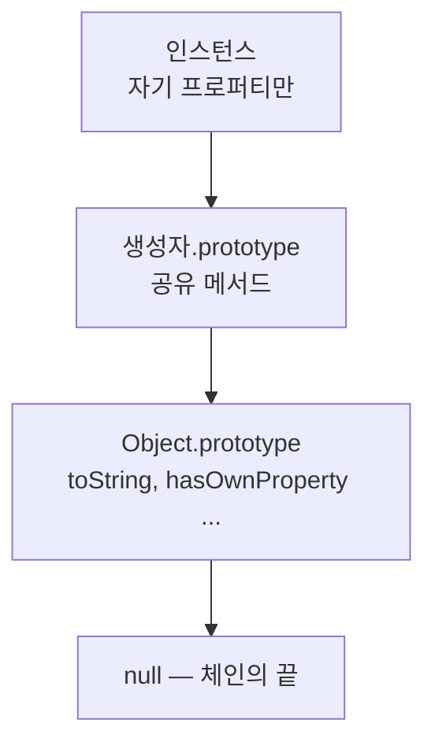

<Callout type="info">
  **이번 문서의 목표:** 이 파일을 다 읽으면 11~14편에서 배운 `new`·`this`·프로토타입·class 지식을 **코드를 보고 버그를 지목하는 능력**으로 바꿀 수 있습니다. 모든 문제는 실습기에서 직접 실행해 답을 확인할 수 있습니다.
</Callout>

<Callout type="warning">
  **고지:** 이 편의 문제들은 **실제 시험 기출 문제를 복제한 것이 아닙니다.** ECMAScript 명세와 MDN 문서에 정의된 동작을 기준으로, 11~14편에서 다룬 개념을 확인하기 위해 **새로 재구성한 문제**입니다. 목적은 점수 예측이 아니라 실행 모델 점검입니다.
</Callout>

## 진단 도구 세 가지

이 편의 문제를 풀 때는 매번 다음 세 질문을 순서대로 던지면 거의 다 풀립니다.

<Steps>

1. **이 함수는 어떻게 호출되었는가** — 점 앞에 뭐가 있는가, `new`가 붙었는가, `call`·`apply`·`bind`를 거쳤는가, 그냥 이름만 불렸는가.
2. **이 프로퍼티는 어디서 발견되었는가** — 자기 자신인가, 프로토타입 체인의 몇 번째 단계인가.
3. **이 값은 언제 만들어졌는가** — 클래스 평가 시점인가, 인스턴스 생성 시점인가.

</Steps>

## A. this 바인딩 실험

### A-1. 호출 방식 네 가지

12편의 핵심은 **함수가 정의된 곳이 아니라 호출된 방식**이 `this`를 정한다는 것입니다. 규칙을 우선순위 순으로 정리하면 이렇습니다.

| 우선순위 | 호출 형태 | `this` |
|----------|-----------|--------|
| 1 | `new 함수()` | 새로 만들어진 인스턴스 |
| 2 | `함수.call(대상)` · `bind(대상)` | 명시한 대상 |
| 3 | `객체.함수()` | 점 앞의 객체 |
| 4 | `함수()` | strict면 `undefined`, 아니면 전역 객체 |

화살표 함수는 이 표의 바깥에 있습니다. **자신의 `this`를 아예 갖지 않고**, 정의된 위치의 바깥 `this`를 그대로 씁니다. 그래서 `call`로 바꿔치기해도 소용없습니다.

<CodePlayground
  template="vanilla"
  activeFile="/index.js"
  showConsole
  label="실험 A-1 — 호출 방식이 this를 정한다"
  files={{
    '/index.js': `'use strict';

const 사람 = {
  이름: '지훈',
  일반() { return this && this.이름; },
  화살표: () => (typeof this === 'undefined' ? 'this 없음' : '바깥 this'),
};

console.log('1) 메서드 호출:', 사람.일반());          // ?

const 떼어냄 = 사람.일반;
try {
  console.log('2) 떼어내서 호출:', 떼어냄());        // ?
} catch (e) {
  console.log('2) 떼어내서 호출:', e.constructor.name);
}

console.log('3) call로 지정:', 사람.일반.call({ 이름: '민수' })); // ?

const 묶음 = 사람.일반.bind({ 이름: '고정' });
console.log('4) bind 후 호출:', 묶음());              // ?
console.log('5) bind한 것을 다시 call:', 묶음.call({ 이름: '재지정' })); // ?

console.log('6) 화살표 메서드:', 사람.화살표());      // ?

// 7) 콜백으로 넘기면 어떻게 되나
const 목록 = ['가'];
목록.forEach(사람.일반);            // 에러? 조용히 통과?
목록.forEach(사람.일반, 사람);      // 두 번째 인수가 this
console.log('7) forEach의 thisArg를 준 결과:', 목록.map(사람.일반, 사람));
`,
  }}
/>

5번이 중요한 함정입니다. **`bind`로 한 번 묶은 함수는 다시 바꿀 수 없습니다.** `bind`가 만든 함수는 내부에 대상을 저장해 두고, 이후의 `call`·`apply`·심지어 두 번째 `bind`도 무시합니다.

<Callout type="warning">
  **자주 틀리는 점:** "화살표 함수를 쓰면 this 문제가 해결된다"는 말은 절반만 맞습니다. **객체 리터럴의 메서드를 화살표로 쓰면 오히려 망가집니다.** 객체 리터럴은 스코프를 만들지 않으므로, 그 안의 화살표 함수는 객체가 아니라 **객체를 만든 바깥 코드의 `this`**를 붙잡습니다. 화살표가 유용한 자리는 메서드 자리가 아니라 **메서드 안에서 만드는 콜백** 자리입니다.
</Callout>

### A-2. 콜백 안에서 this를 잃는 문제

<CodePlayground
  template="vanilla"
  activeFile="/index.js"
  showConsole
  label="실험 A-2 — 콜백 안에서 this가 사라지는 순간"
  files={{
    '/index.js': `'use strict';

const 장바구니 = {
  상품: ['사과', '배', '감'],
  접두어: '담김: ',

  // 1) 문제 있는 버전 — 일반 함수 콜백
  문제버전() {
    try {
      return this.상품.map(function (이름) {
        return this.접두어 + 이름;   // 여기의 this는?
      });
    } catch (e) {
      return '에러: ' + e.constructor.name;
    }
  },

  // 2) 해결책 A — 화살표 함수
  화살표버전() {
    return this.상품.map((이름) => this.접두어 + 이름);
  },

  // 3) 해결책 B — thisArg 인수
  인수버전() {
    return this.상품.map(function (이름) {
      return this.접두어 + 이름;
    }, this);
  },

  // 4) 해결책 C — 변수에 저장하는 옛 방식
  저장버전() {
    const 자기 = this;
    return this.상품.map(function (이름) {
      return 자기.접두어 + 이름;
    });
  },
};

console.log('문제버전:', 장바구니.문제버전());
console.log('화살표버전:', 장바구니.화살표버전());
console.log('인수버전:', 장바구니.인수버전());
console.log('저장버전:', 장바구니.저장버전());
`,
  }}
/>

## B. 프로토타입 체인 실험

### B-1. 탐색은 어디까지 올라가는가

프로퍼티를 읽을 때 엔진은 **자기 자신 → 프로토타입 → 그 프로토타입 → ... → `null`** 순서로 올라갑니다. 발견하는 즉시 멈추고, 끝까지 못 찾으면 `undefined`입니다.

<CodePlayground
  template="vanilla"
  activeFile="/index.js"
  showConsole
  label="실험 B-1 — 체인 탐색과 섀도잉"
  files={{
    '/index.js': `function 동물(이름) {
  this.이름 = 이름;
}
동물.prototype.소리 = '...';
동물.prototype.울기 = function () {
  return this.이름 + ': ' + this.소리;
};

const 개 = new 동물('바둑이');
console.log('1) 상속 메서드:', 개.울기());          // ?

// 2) 섀도잉 — 자기 프로퍼티가 프로토타입을 가린다
개.소리 = '멍멍';
console.log('2) 섀도잉 후:', 개.울기());            // ?
console.log('   프로토타입 값은 그대로인가:', 동물.prototype.소리); // ?

// 3) 자기 것인지 물려받은 것인지 구분
console.log('3) 소리는 자기 것인가:', Object.hasOwn(개, '소리'));
console.log('   울기는 자기 것인가:', Object.hasOwn(개, '울기'));
console.log('   in 연산자로 보면:', '울기' in 개);

// 4) 자기 프로퍼티를 지우면 다시 프로토타입이 보인다
delete 개.소리;
console.log('4) delete 후:', 개.울기());            // ?

// 5) 프로토타입 프로퍼티는 delete로 못 지운다
delete 개.소리;
console.log('5) 다시 delete 후:', 개.소리);          // ?

// 6) 체인 전체 확인
let 현재 = 개;
const 체인 = [];
while (현재 !== null) {
  체인.push(현재.constructor ? 현재.constructor.name : '(constructor 없음)');
  현재 = Object.getPrototypeOf(현재);
}
console.log('6) 체인:', 체인);
`,
  }}
/>

5번이 핵심 함정입니다. **`delete`는 자기 프로퍼티만 지웁니다.** 프로토타입의 프로퍼티에는 아무 영향이 없고, 에러도 나지 않습니다. 그래서 두 번째 `delete` 후에도 값은 여전히 프로토타입의 것이 보입니다.

### B-2. 쓰기는 항상 자기 자신에게

읽기와 쓰기의 규칙이 다릅니다. **읽기는 체인을 올라가지만, 쓰기는 올라가지 않고 자기 자신에 새 프로퍼티를 만듭니다.**

<CodePlayground
  template="vanilla"
  activeFile="/index.js"
  showConsole
  label="실험 B-2 — 공유 상태의 함정"
  files={{
    '/index.js': `function 사용자(이름) {
  this.이름 = 이름;
}
사용자.prototype.점수 = 0;
사용자.prototype.기록 = [];   // 위험한 설계!

const A = new 사용자('A');
const B = new 사용자('B');

// 1) 원시값에 대입 — 자기 프로퍼티가 새로 생긴다
A.점수 = 10;
console.log('1) A 점수:', A.점수, '/ B 점수:', B.점수);   // ?
console.log('   A가 자기 점수를 가졌나:', Object.hasOwn(A, '점수'));
console.log('   B가 자기 점수를 가졌나:', Object.hasOwn(B, '점수'));

// 2) 배열에 push — 대입이 아니라 같은 객체를 수정한다
A.기록.push('A의 기록');
console.log('2) B의 기록:', B.기록);                      // ?
console.log('   같은 배열인가:', A.기록 === B.기록);       // ?

// 3) 올바른 설계 — 인스턴스마다 새 배열
function 사용자2(이름) {
  this.이름 = 이름;
  this.기록 = [];
}
const C = new 사용자2('C');
const D = new 사용자2('D');
C.기록.push('C만의 기록');
console.log('3) D의 기록:', D.기록);                      // ?
`,
  }}
/>

<Callout type="warning">
  **자주 틀리는 점:** 프로토타입에 **참조 타입**(배열·객체)을 두면 모든 인스턴스가 하나를 공유합니다. `A.기록.push(...)`는 대입이 아니라 **이미 찾은 배열을 수정**하는 것이라 섀도잉이 일어나지 않습니다. 반면 `A.점수 = 10`은 대입이므로 A에 자기 프로퍼티가 생기고 B는 영향받지 않습니다. **읽고 나서 수정하는가, 대입하는가**가 갈림길입니다.
</Callout>

### B-3. new는 정확히 무엇을 하는가

11편에서 본 `new`의 네 단계를 코드로 재현해 보면 이해가 확실해집니다.

<CodePlayground
  template="vanilla"
  activeFile="/index.js"
  showConsole
  label="실험 B-3 — new를 직접 구현해 보기"
  files={{
    '/index.js': `function 내가만든new(생성자, ...인수) {
  // 1단계: 빈 객체를 만들고 프로토타입을 연결한다
  const 인스턴스 = Object.create(생성자.prototype);
  // 2단계: this를 그 객체로 묶어 생성자를 실행한다
  const 반환값 = 생성자.apply(인스턴스, 인수);
  // 3단계: 생성자가 객체를 반환했으면 그것을, 아니면 인스턴스를 돌려준다
  return (반환값 !== null && typeof 반환값 === 'object') ? 반환값 : 인스턴스;
}

function 좌표(x, y) {
  this.x = x;
  this.y = y;
}
좌표.prototype.문자열 = function () { return this.x + ',' + this.y; };

const 진짜 = new 좌표(1, 2);
const 흉내 = 내가만든new(좌표, 1, 2);
console.log('1) 결과 비교:', 진짜.문자열(), 흉내.문자열());
console.log('   프로토타입도 같은가:', Object.getPrototypeOf(흉내) === 좌표.prototype);

// 2) 생성자가 객체를 반환하면 그게 이긴다
function 이상한생성자() {
  this.값 = '무시됨';
  return { 값: '반환된 객체가 이긴다' };
}
console.log('2) 객체 반환:', new 이상한생성자().값);   // ?

// 3) 원시값을 반환하면 무시된다
function 원시반환() {
  this.값 = '살아남음';
  return 42;
}
console.log('3) 원시값 반환:', new 원시반환().값);     // ?

// 4) new 없이 호출하면 — strict가 아니면 전역이 오염된다
function 위험(이름) {
  if (!new.target) return '실수로 new를 빠뜨렸습니다';
  this.이름 = 이름;
}
console.log('4) new 없이:', 위험('테스트'));
console.log('   new 있이:', new 위험('테스트').이름);
`,
  }}
/>

## C. class 실험

### C-1. 필드와 메서드는 어디에 놓이는가

14편의 핵심입니다. **메서드는 프로토타입에, 클래스 필드는 인스턴스에** 놓입니다. 이 차이가 동작을 크게 바꿉니다.

<CodePlayground
  template="vanilla"
  activeFile="/index.js"
  showConsole
  label="실험 C-1 — 메서드와 필드의 위치 차이"
  files={{
    '/index.js': `class 상자 {
  용량 = 10;                       // 인스턴스 필드
  static 기본색 = '흰색';           // 정적 필드
  #비밀 = '숨겨진 값';              // private 필드

  담기() { return '담는 중'; }       // 프로토타입 메서드
  화살표담기 = () => '화살표로 담는 중'; // 인스턴스 필드에 담긴 함수

  비밀보기() { return this.#비밀; }
  static 만들기() { return new 상자(); }
}

const 상자1 = new 상자();
const 상자2 = new 상자();

console.log('1) 담기는 자기 것인가:', Object.hasOwn(상자1, '담기'));
console.log('   화살표담기는 자기 것인가:', Object.hasOwn(상자1, '화살표담기'));
console.log('   두 인스턴스의 담기는 같은 함수인가:', 상자1.담기 === 상자2.담기);
console.log('   두 인스턴스의 화살표담기는 같은가:', 상자1.화살표담기 === 상자2.화살표담기);

// 2) 떼어내서 호출했을 때의 차이
const 뗀메서드 = 상자1.담기;
const 뗀화살표 = 상자1.화살표담기;
try { console.log('2) 뗀 메서드:', 뗀메서드()); }
catch (e) { console.log('2) 뗀 메서드:', e.constructor.name); }
console.log('   뗀 화살표:', 뗀화살표());

// 3) private 필드는 밖에서 볼 수 없다
console.log('3) 안에서 보기:', 상자1.비밀보기());
console.log('   Object.keys에 나오나:', Object.keys(상자1));
console.log('   JSON에 나오나:', JSON.stringify(상자1));

// 4) 정적 멤버는 클래스에 붙는다
console.log('4) 정적 필드:', 상자.기본색, '/ 인스턴스에서:', 상자1.기본색);
console.log('   정적 메서드로 만든 것:', 상자.만들기() instanceof 상자);
`,
  }}
/>

<Callout type="info">
  **핵심 정리:** 인스턴스 필드에 화살표 함수를 담으면 `this`가 고정되어 떼어내도 안전하지만, **인스턴스마다 함수 객체가 새로 만들어집니다.** 프로토타입 메서드는 하나를 공유해 메모리에 유리하지만 `this`를 잃을 수 있습니다. 어느 쪽도 정답이 아니라 **트레이드오프**입니다.
</Callout>

### C-2. extends와 super의 순서 규칙

<CodePlayground
  template="vanilla"
  activeFile="/index.js"
  showConsole
  label="실험 C-2 — super 호출 전에는 this가 없다"
  files={{
    '/index.js': `class 부모 {
  constructor(이름) {
    this.이름 = 이름;
    console.log('  부모 생성자 실행');
  }
  인사() { return '부모: ' + this.이름; }
}

class 자식 extends 부모 {
  구분 = '자식필드';   // 이 필드는 언제 초기화될까?

  constructor(이름) {
    console.log('  자식 생성자 시작');
    // console.log(this.이름); // 주석을 풀면 ReferenceError
    super(이름);
    console.log('  super 이후 구분 필드:', this.구분);
  }
  인사() { return '자식이 부른 ' + super.인사(); }
}

console.log('1) 인스턴스 생성');
const 인스턴스 = new 자식('민지');
console.log('2) 오버라이드된 메서드:', 인스턴스.인사());

// 3) 상속 관계 확인
console.log('3) instanceof 부모:', 인스턴스 instanceof 부모);
console.log('   프로토타입 체인:', Object.getPrototypeOf(자식.prototype) === 부모.prototype);
console.log('   정적 상속도 되는가:', Object.getPrototypeOf(자식) === 부모);

// 4) 클래스는 호이스팅되지만 TDZ에 있다
try {
  new 나중클래스();
} catch (e) {
  console.log('4) 선언 전 사용:', e.constructor.name);
}
class 나중클래스 {}

// 5) class는 new 없이 호출할 수 없다
try {
  부모('직접호출');
} catch (e) {
  console.log('5) new 없이 클래스 호출:', e.constructor.name);
}
`,
  }}
/>

여기서 규칙 세 가지가 확인됩니다.

1. **파생 클래스에서는 super 호출 이전에 `this`를 쓸 수 없습니다.** 명세상 파생 생성자의 `this`는 `super()`가 반환될 때 비로소 바인딩되기 때문입니다.
2. **자식의 인스턴스 필드는 super 호출 직후에 초기화됩니다.** 그래서 `super()` 윗줄에서는 `this.구분`이 존재조차 하지 않고, 아랫줄에서는 값이 채워져 있습니다.
3. **class는 `new` 없이 호출할 수 없습니다.** 생성자 함수와의 결정적 차이이며, TypeError가 납니다.

## 핵심 정리

- `this`는 정의 위치가 아니라 **호출 방식**이 정합니다. 우선순위는 `new` → 명시적 바인딩 → 메서드 호출 → 일반 호출입니다.
- 화살표 함수는 자신의 `this`가 없어 바깥 것을 씁니다. 콜백 자리에서는 유용하지만 **객체 리터럴의 메서드 자리에서는 틀린 선택**입니다.
- `bind`로 묶은 함수는 이후의 `call`·`apply`·재`bind`로 바꿀 수 없습니다.
- 프로퍼티 **읽기는 체인을 올라가고 쓰기는 자기 자신에 만듭니다.** 프로토타입에 배열·객체를 두면 모든 인스턴스가 공유하는 사고가 납니다.
- `new`는 객체 생성 → 프로토타입 연결 → `this` 바인딩 후 실행 → 반환값 판정의 네 단계입니다. 생성자가 객체를 반환하면 그것이 이깁니다.
- class의 메서드는 프로토타입에, 필드는 인스턴스에 놓입니다. 파생 클래스에서는 `super()` 이전에 `this` 접근이 금지되고, 자식 필드는 `super()` 직후 초기화됩니다.

## 마무리 복습

<Quiz
  questionNumber={1}
  question="객체의 메서드를 변수에 담아 그 변수로 호출했을 때, strict mode에서 함수 내부 this의 값은?"
  options={['원래 객체', '전역 객체', 'undefined', '함수 자신']}
  correctAnswer={3}
  explanation="점 앞의 객체가 사라진 일반 호출이므로 strict mode에서 this는 undefined다. strict가 아니면 전역 객체로 대체된다."
  optionExplanations={['호출 시점에 점 앞 객체가 없으므로 연결이 끊긴다', 'strict가 아닐 때의 동작이다', '정답 — strict mode의 일반 호출은 undefined다', 'this가 함수 자신이 되는 경우는 없다']}
/>

<Quiz
  questionNumber={2}
  question="bind로 this를 고정한 함수에 다시 call로 다른 객체를 넘기면?"
  options={['새로 넘긴 객체가 this가 된다', 'bind로 고정한 객체가 유지된다', 'TypeError가 발생한다', 'this가 undefined가 된다']}
  correctAnswer={2}
  explanation="bind가 만든 함수는 내부에 대상을 저장해 두고 이후의 call, apply, 재바인딩을 모두 무시한다."
  optionExplanations={['bind로 만든 함수에는 통하지 않는다', '정답 — 최초 bind가 우선한다', '에러 없이 조용히 무시된다', '고정된 대상이 그대로 유지된다']}
/>

<Quiz
  questionNumber={3}
  question="객체 리터럴의 메서드를 화살표 함수로 정의했을 때의 문제는?"
  options={['문법 오류가 발생한다', '객체 리터럴은 스코프를 만들지 않아 화살표가 바깥 코드의 this를 붙잡는다', '항상 undefined를 반환한다', '메서드가 프로토타입에 등록되지 않는다']}
  correctAnswer={2}
  explanation="화살표 함수는 정의된 위치의 바깥 this를 쓰는데, 객체 리터럴은 스코프를 만들지 않으므로 그 객체가 아니라 리터럴을 감싼 코드의 this가 잡힌다."
  optionExplanations={['문법상 유효한 코드다', '정답 — 스코프를 만들지 않는 것이 원인이다', '바깥 this의 내용에 따라 결과가 달라진다', '리터럴 메서드는 원래 프로토타입이 아니라 객체 자신에 놓인다']}
/>

<Quiz
  questionNumber={4}
  question="배열의 map 콜백을 일반 함수로 쓰면서 그 안에서 바깥 객체의 프로퍼티를 this로 접근하려 한다. 가장 적절하지 않은 해결책은?"
  options={['콜백을 화살표 함수로 바꾼다', 'map의 두 번째 인수로 this를 넘긴다', '바깥에서 this를 변수에 담아 그 변수를 쓴다', '콜백 함수 안에서 this에 직접 객체를 대입한다']}
  correctAnswer={4}
  explanation="this는 대입할 수 있는 변수가 아니다. 화살표 함수, thisArg 인수, 변수 저장 세 가지가 실제로 쓰이는 해결책이다."
  optionExplanations={['화살표는 바깥 this를 그대로 쓰므로 유효한 해결책이다', 'map은 두 번째 인수로 thisArg를 받는다', '옛 코드에서 흔히 쓰이던 유효한 방법이다', '정답(부적절) — this에는 대입할 수 없다']}
/>

<Quiz
  questionNumber={5}
  question="인스턴스에 프로토타입과 같은 이름의 프로퍼티를 대입한 뒤 프로토타입 쪽 값을 확인하면?"
  options={['프로토타입 값도 함께 바뀐다', '프로토타입 값은 그대로이고 인스턴스 값이 이를 가린다', '프로토타입 프로퍼티가 삭제된다', 'TypeError가 발생한다']}
  correctAnswer={2}
  explanation="대입은 체인을 올라가지 않고 자기 자신에 프로퍼티를 만든다. 이를 섀도잉이라 하며 프로토타입 값은 손상되지 않는다."
  optionExplanations={['쓰기는 프로토타입까지 전파되지 않는다', '정답 — 섀도잉의 정의다', '삭제되지 않고 가려질 뿐이다', '정상 동작이며 에러가 아니다']}
/>

<Quiz
  questionNumber={6}
  question="섀도잉된 인스턴스 프로퍼티를 delete로 지운 뒤 같은 이름을 읽으면?"
  options={['undefined가 나온다', '다시 프로토타입의 값이 보인다', '에러가 발생한다', 'null이 나온다']}
  correctAnswer={2}
  explanation="자기 프로퍼티가 사라지면 탐색이 다시 프로토타입까지 올라가므로 원래 상속받던 값이 보인다."
  optionExplanations={['프로토타입에 값이 남아 있으므로 undefined가 아니다', '정답 — 가리개가 사라져 원래 값이 드러난다', 'delete는 정상 동작한다', 'null로 바뀌지 않는다']}
/>

<Quiz
  questionNumber={7}
  question="프로토타입에 있는 프로퍼티에 대해 인스턴스에서 delete를 호출하면?"
  options={['프로토타입에서 삭제된다', '아무 일도 일어나지 않고 에러도 없다', 'TypeError가 발생한다', '인스턴스가 프로토타입에서 분리된다']}
  correctAnswer={2}
  explanation="delete는 자기 프로퍼티만 대상으로 한다. 프로토타입의 프로퍼티에는 영향이 없고 조용히 통과한다."
  optionExplanations={['체인을 거슬러 삭제하지 않는다', '정답 — 자기 것이 없으면 아무 효과가 없다', '에러가 아니라 무해한 실패다', '체인 연결은 유지된다']}
/>

<Quiz
  questionNumber={8}
  question="프로토타입에 빈 배열을 두고 인스턴스에서 그 배열에 push를 했을 때 다른 인스턴스의 상태는?"
  options={['영향받지 않는다', '같은 배열을 공유하므로 함께 바뀐다', '자동으로 복사본이 만들어진다', 'TypeError가 발생한다']}
  correctAnswer={2}
  explanation="push는 대입이 아니라 이미 찾아낸 객체를 수정하는 동작이므로 섀도잉이 일어나지 않는다. 모든 인스턴스가 같은 배열을 본다."
  optionExplanations={['공유 객체를 수정했으므로 모두 영향받는다', '정답 — 프로토타입에 참조 타입을 두면 생기는 대표적 사고다', '자동 복사는 일어나지 않는다', '정상 동작이며 에러가 아니다']}
/>

<Quiz
  questionNumber={9}
  question="Object.hasOwn과 in 연산자의 차이로 옳은 것은?"
  options={['둘은 완전히 같다', 'hasOwn은 자기 프로퍼티만, in은 프로토타입 체인까지 확인한다', 'hasOwn은 체인까지, in은 자기 것만 확인한다', 'in은 배열에만 쓸 수 있다']}
  correctAnswer={2}
  explanation="hasOwn은 대상 자신이 직접 가진 프로퍼티인지 확인하고, in은 상속받은 프로퍼티까지 참으로 판단한다."
  optionExplanations={['탐색 범위가 다르다', '정답 — 자기 것 대 체인 전체의 차이다', '반대로 설명했다', 'in은 모든 객체에 사용할 수 있다']}
/>

<Quiz
  questionNumber={10}
  question="new 연산자가 수행하는 단계로 옳지 않은 것은?"
  options={['빈 객체를 만들고 생성자의 prototype을 연결한다', '그 객체를 this로 바인딩해 생성자 몸통을 실행한다', '생성자가 객체를 반환하면 그 객체를 결과로 삼는다', '생성자가 반환한 원시값이 있으면 그 값을 결과로 삼는다']}
  correctAnswer={4}
  explanation="생성자가 원시값을 반환하면 무시되고 새로 만든 인스턴스가 반환된다. 객체를 반환할 때만 그 객체가 결과가 된다."
  optionExplanations={['첫 단계로 맞다', '두 번째 단계로 맞다', '객체 반환은 실제로 우선한다', '정답(틀린 설명) — 원시값 반환은 무시된다']}
/>

<Quiz
  questionNumber={11}
  question="함수 안에서 new.target을 확인하는 목적으로 가장 알맞은 것은?"
  options={['호출된 함수의 이름을 얻기 위해', 'new 없이 호출되었는지 감지해 실수를 막기 위해', '프로토타입 체인의 길이를 재기 위해', 'this를 강제로 바꾸기 위해']}
  correctAnswer={2}
  explanation="new로 호출되면 new.target은 그 생성자를, 일반 호출이면 undefined를 갖는다. 생성자 오용을 감지하는 표준 수단이다."
  optionExplanations={['이름을 얻는 용도가 아니다', '정답 — 생성자 호출 여부를 판별한다', '체인 길이와는 무관하다', 'this를 바꾸지는 못한다']}
/>

<Quiz
  questionNumber={12}
  question="class 문법에서 일반 메서드가 실제로 저장되는 위치는?"
  options={['각 인스턴스 자신', '클래스의 prototype 객체', '전역 객체', 'Object.prototype']}
  correctAnswer={2}
  explanation="class의 메서드는 prototype에 놓여 모든 인스턴스가 하나를 공유한다. 반면 클래스 필드는 인스턴스마다 따로 만들어진다."
  optionExplanations={['인스턴스에 놓이는 것은 클래스 필드다', '정답 — 공유되는 메서드는 prototype에 있다', '전역과는 무관하다', '체인의 끝이지 메서드가 정의되는 곳이 아니다']}
/>

<Quiz
  questionNumber={13}
  question="클래스 필드에 화살표 함수를 담는 방식과 프로토타입 메서드의 차이로 옳은 것은?"
  options={['화살표 필드는 인스턴스마다 새로 만들어지고 this가 고정된다', '화살표 필드도 prototype에 저장된다', '프로토타입 메서드는 this를 잃지 않는다', '둘은 완전히 동일하다']}
  correctAnswer={1}
  explanation="화살표 함수를 담은 필드는 인스턴스 프로퍼티이므로 인스턴스마다 함수 객체가 생기고, 정의 위치의 this가 고정되어 떼어내도 안전하다. 메모리와 안전성의 트레이드오프다."
  optionExplanations={['정답 — 안전하지만 인스턴스마다 함수가 생긴다', '필드는 인스턴스에 저장된다', '떼어내 호출하면 this를 잃는다', '저장 위치와 this 동작이 모두 다르다']}
/>

<Quiz
  questionNumber={14}
  question="private 필드에 대한 설명으로 옳은 것은?"
  options={['Object.keys로 확인할 수 있다', 'JSON.stringify 결과에 포함된다', '클래스 몸통 밖에서는 접근할 수 없고 열거·직렬화에도 나타나지 않는다', '이름 앞에 밑줄을 붙이는 관례일 뿐 실제 제약은 없다']}
  correctAnswer={3}
  explanation="샵 기호로 선언한 private 필드는 언어 차원에서 접근이 제한되며, 열거나 JSON 직렬화 대상이 아니다. 밑줄 관례와 달리 실제로 강제된다."
  optionExplanations={['열거 대상이 아니다', '직렬화에도 포함되지 않는다', '정답 — 언어가 강제하는 진짜 은닉이다', '밑줄 관례와 달리 문법으로 강제된다']}
/>

<Quiz
  questionNumber={15}
  question="파생 클래스의 생성자에서 super 호출 이전에 this에 접근하면?"
  options={['undefined가 나온다', 'ReferenceError가 발생한다', '부모 인스턴스가 반환된다', '정상적으로 동작한다']}
  correctAnswer={2}
  explanation="파생 생성자의 this는 super가 반환될 때 비로소 바인딩된다. 그 전에는 바인딩이 없어 접근 자체가 ReferenceError다."
  optionExplanations={['값이 없는 것이 아니라 바인딩 자체가 없다', '정답 — super 이전에는 this가 존재하지 않는다', '부모 인스턴스가 노출되지는 않는다', '명세가 금지하는 접근이다']}
/>

<Quiz
  questionNumber={16}
  question="파생 클래스에 선언한 인스턴스 필드는 언제 초기화되는가?"
  options={['클래스가 평가되는 시점', 'super 호출 직후', '생성자 본문이 모두 끝난 뒤', '첫 메서드 호출 시점']}
  correctAnswer={2}
  explanation="파생 클래스의 인스턴스 필드는 super가 반환되어 this가 만들어진 직후에 초기화된다. 그래서 super 위에서는 필드가 존재하지 않는다."
  optionExplanations={['클래스 평가 시에는 정적 멤버만 처리된다', '정답 — this가 생긴 직후다', '생성자 본문 실행 전에 이미 채워진다', '메서드 호출과는 무관하다']}
/>

<Quiz
  questionNumber={17}
  question="class 선언을 new 없이 함수처럼 호출하면?"
  options={['정상 실행된다', 'TypeError가 발생한다', 'ReferenceError가 발생한다', 'undefined를 반환한다']}
  correctAnswer={2}
  explanation="클래스 생성자는 new 없이 호출할 수 없도록 명세가 규정한다. 이는 생성자 함수와의 결정적인 차이다."
  optionExplanations={['생성자 함수와 달리 허용되지 않는다', '정답 — new 없는 호출은 TypeError다', 'TDZ 문제가 아니라 호출 방식 문제다', '값을 반환하지 못하고 에러가 난다']}
/>

<Quiz
  questionNumber={18}
  question="class 선언 이전에 그 클래스를 new로 사용하면?"
  options={['정상 동작한다', 'undefined가 반환된다', 'ReferenceError가 발생한다', 'SyntaxError가 발생한다']}
  correctAnswer={3}
  explanation="class는 호이스팅되지만 초기화가 선언문에 도달할 때 이뤄지므로 그 전 구간은 TDZ다. 접근하면 ReferenceError가 난다."
  optionExplanations={['함수 선언문과 달리 미리 사용할 수 없다', 'TDZ에서는 값이 아니라 에러가 나온다', '정답 — TDZ 위반이다', '문법 자체는 올바르므로 파싱은 통과한다']}
/>

<Quiz
  questionNumber={19}
  question="extends로 상속했을 때 정적 멤버에 대한 설명으로 옳은 것은?"
  options={['정적 멤버는 상속되지 않는다', '자식 클래스 객체의 프로토타입이 부모 클래스 객체가 되어 정적 멤버도 상속된다', '정적 멤버는 인스턴스에 복사된다', '정적 멤버는 자동으로 private이 된다']}
  correctAnswer={2}
  explanation="extends는 프로토타입 체인을 두 줄로 만든다. 인스턴스 쪽은 자식 prototype에서 부모 prototype으로, 클래스 객체 쪽은 자식 클래스에서 부모 클래스로 연결되어 정적 멤버도 상속된다."
  optionExplanations={['정적 멤버도 상속된다', '정답 — 클래스 객체끼리도 연결된다', '복사가 아니라 체인 탐색이다', '접근 제한과는 무관하다']}
/>

<Quiz
  questionNumber={20}
  question="프로토타입 체인에서 프로퍼티를 끝까지 찾지 못했을 때의 결과는?"
  options={['ReferenceError가 발생한다', 'undefined가 반환된다', 'null이 반환된다', 'TypeError가 발생한다']}
  correctAnswer={2}
  explanation="체인의 끝인 null까지 탐색해도 찾지 못하면 undefined를 돌려준다. 없는 프로퍼티를 읽는 것은 에러가 아니다. 다만 그 결과를 함수처럼 호출하면 TypeError가 난다."
  optionExplanations={['선언되지 않은 식별자를 읽을 때의 에러다', '정답 — 없는 프로퍼티 읽기는 undefined다', 'null은 체인의 끝을 나타내는 값이지 반환값이 아니다', '읽기 자체는 에러가 아니다']}
/>

## 참고 자료

- [MDN - this](https://developer.mozilla.org/en-US/docs/Web/JavaScript/Reference/Operators/this)
- [MDN - new operator](https://developer.mozilla.org/en-US/docs/Web/JavaScript/Reference/Operators/new)
- [MDN - Inheritance and the prototype chain](https://developer.mozilla.org/en-US/docs/Web/JavaScript/Guide/Inheritance_and_the_prototype_chain)
- [MDN - Classes](https://developer.mozilla.org/en-US/docs/Web/JavaScript/Reference/Classes)
