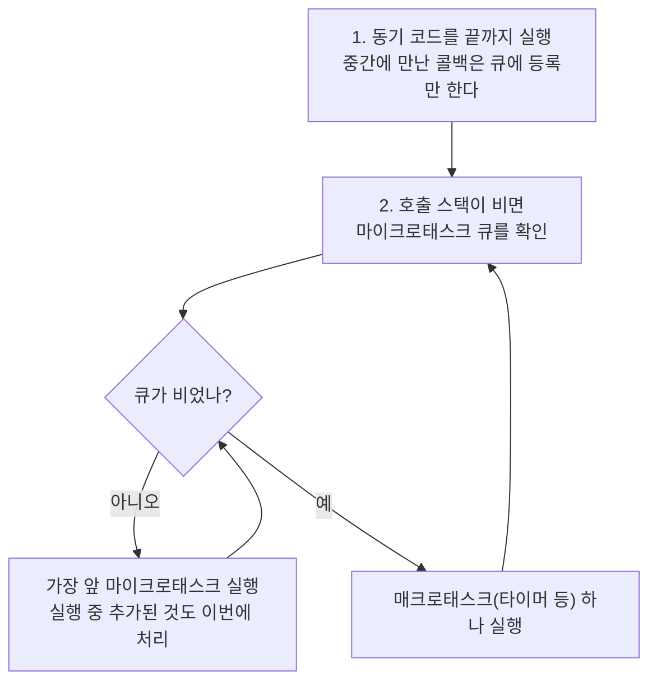

<Callout type="info">
  **이번 문서의 목표:** 이 파일을 다 읽으면 동기 코드·마이크로태스크·타이머가 섞인 코드를 보고 **출력 순서를 정확히 예측**할 수 있고, `await`가 어디서 함수를 멈추는지, Promise 조합 메서드가 각각 언제 결과를 내는지 설명할 수 있습니다.
</Callout>

<Callout type="warning">
  **고지:** 이 편의 문제들은 **실제 시험 기출 문제를 복제한 것이 아닙니다.** ECMAScript 명세와 MDN 문서에 정의된 동작을 기준으로, 25~27편에서 다룬 개념을 확인하기 위해 **새로 재구성한 문제**입니다. 목적은 점수 예측이 아니라 실행 모델 점검입니다.
</Callout>

## 순서를 푸는 단 하나의 절차

출력 순서 문제는 감으로 풀면 반드시 틀립니다. 아래 절차를 기계적으로 적용하세요.

<Callout type="info">
  **가장 중요한 한 문장:** 매크로태스크는 **하나 처리할 때마다** 마이크로태스크 큐를 완전히 비웁니다. 반대로 마이크로태스크는 **큐가 빌 때까지 연달아** 처리되며, 그 사이에 타이머가 끼어들지 못합니다.
</Callout>

용어를 정리하고 갑니다.

| 구분 | 들어가는 것 | 처리 시점 |
|------|-------------|-----------|
| 동기 코드 | 지금 실행 중인 코드 | 즉시 |
| 마이크로태스크 큐 | `then`·`catch`·`finally` 콜백, `await` 이후 코드, `queueMicrotask` | 스택이 빌 때마다 **전부** |
| 매크로태스크 큐 | `setTimeout`·`setInterval` 콜백, 사용자 이벤트 | 마이크로태스크가 다 빈 뒤 **하나씩** |

## A. 기본 순서 실험

### A-1. 동기, 마이크로, 매크로의 3층 구조

<CodePlayground
  template="vanilla"
  activeFile="/index.js"
  showConsole
  label="실험 A-1 — 세 층의 실행 순서"
  files={{
    '/index.js': `console.log('1');

setTimeout(() => console.log('2'), 0);

Promise.resolve().then(() => console.log('3'));

queueMicrotask(() => console.log('4'));

setTimeout(() => console.log('5'), 0);

Promise.resolve().then(() => console.log('6'));

console.log('7');

// 예측을 적어 보세요: _______________
`,
  }}
/>

정답은 `1 → 7 → 3 → 4 → 6 → 2 → 5`입니다. 한 단계씩 따라가면 이렇습니다.

<Steps>

1. 동기 코드가 먼저 전부 실행됩니다 — `1`, `7`.
2. 그 사이 `setTimeout` 두 개는 매크로태스크 큐에, `then` 두 개와 `queueMicrotask` 하나는 마이크로태스크 큐에 **등록만** 됩니다.
3. 스택이 비면 마이크로태스크를 등록 순서대로 전부 비웁니다 — `3`, `4`, `6`.
4. 그다음에야 매크로태스크를 순서대로 하나씩 처리합니다 — `2`, `5`.

</Steps>

<Callout type="warning">
  **자주 틀리는 점:** `setTimeout(fn, 0)`의 0은 "즉시"가 아니라 "**최소 0밀리초 뒤**"라는 뜻입니다. 게다가 실제로는 마이크로태스크가 전부 끝난 뒤에야 차례가 옵니다. 브라우저 명세는 중첩된 타이머에 최소 4밀리초 하한을 두기도 합니다. **타이머는 "정확한 시점"이 아니라 "그 시점 이후 가장 이른 기회"를 예약하는 것**입니다.
</Callout>

### A-2. 마이크로태스크가 마이크로태스크를 만들면

<CodePlayground
  template="vanilla"
  activeFile="/index.js"
  showConsole
  label="실험 A-2 — 마이크로태스크 굶주림 확인"
  files={{
    '/index.js': `setTimeout(() => console.log('타이머는 언제 실행될까'), 0);

let 횟수 = 0;
function 계속쌓기() {
  횟수 += 1;
  console.log('마이크로태스크', 횟수);
  if (횟수 < 5) queueMicrotask(계속쌓기);
}
queueMicrotask(계속쌓기);

console.log('동기 끝');

// 5를 500으로 바꾸면 타이머가 얼마나 밀리는지 확인해 보세요
// (숫자를 너무 키우면 화면이 멈춥니다 — 그것이 바로 굶주림입니다)
`,
  }}
/>

마이크로태스크가 실행 중에 또 마이크로태스크를 등록하면 **같은 사이클 안에서 계속 처리**됩니다. 그래서 무한히 등록하면 타이머와 화면 갱신이 영원히 오지 않습니다. 이 현상을 **굶주림**(starvation, 스타베이션)이라고 합니다.

## B. await 중단 지점 실험

### B-1. async 함수는 어디까지 동기인가

가장 많이 틀리는 지점입니다. **`async` 함수는 호출되는 순간 동기적으로 실행을 시작합니다.** 첫 `await`를 만나야 비로소 멈추고, 나머지는 마이크로태스크로 넘어갑니다.

<CodePlayground
  template="vanilla"
  activeFile="/index.js"
  showConsole
  label="실험 B-1 — async 함수의 중단 지점"
  files={{
    '/index.js': `async function 실험() {
  console.log('A: async 함수 시작 — 이건 동기다');
  await null;                    // 여기서 멈춘다
  console.log('C: 첫 await 이후');
  await null;
  console.log('E: 두 번째 await 이후');
}

console.log('시작 전');
실험();
console.log('B: 호출 직후 — 함수는 멈춰 있다');

Promise.resolve().then(() => console.log('D: 나중에 등록된 then'));

console.log('동기 끝');

// 예측: _______________
`,
  }}
/>

정답은 `시작 전 → A → B → 동기 끝 → C → D → E`입니다. 핵심은 세 가지입니다.

1. `실험()`을 부르는 순간 `A`가 **동기적으로** 찍힙니다.
2. `await null`을 만나면 함수가 멈추고, 나머지 부분이 마이크로태스크로 예약됩니다. 제어권은 즉시 호출한 쪽으로 돌아가 `B`가 찍힙니다.
3. `C`가 `D`보다 먼저인 이유는 **등록 순서** 때문입니다. `C`의 예약이 `D`의 `then`보다 먼저 이뤄졌습니다.

<Callout type="info">
  **await를 읽는 법:** `await 값` 아래에 있는 코드는 전부 `.then(() => { 아래 코드 })` 안에 들어간다고 생각하면 정확합니다. `await`는 함수를 멈추는 게 아니라 **함수를 그 지점에서 둘로 쪼개는** 문법입니다.
</Callout>

### B-2. 값의 종류에 따라 달라지는 대기 횟수

`await`가 마이크로태스크를 몇 번 소비하는지는 **기다리는 값이 무엇인가**에 따라 다릅니다. 이 미묘함이 순서 문제의 단골 함정입니다.

<CodePlayground
  template="vanilla"
  activeFile="/index.js"
  showConsole
  label="실험 B-2 — 값의 종류에 따른 대기 횟수 차이"
  files={{
    '/index.js': `// 원시값을 await 하면 한 틱만 소비한다
async function 원시() {
  await 1;
  console.log('원시 1틱');
  await 1;
  console.log('원시 2틱');
  await 1;
  console.log('원시 3틱');
}

// 비교용으로 then 체인을 나란히 돌린다
function 체인() {
  Promise.resolve()
    .then(() => console.log('체인 1틱'))
    .then(() => console.log('체인 2틱'))
    .then(() => console.log('체인 3틱'));
}

원시();
체인();

// thenable을 await 하면 틱을 더 소비한다
async function 세너블() {
  await { then(해결) { 해결(); } };
  console.log('thenable 이후');
}
세너블();
`,
  }}
/>

`await 원시값`과 `then` 한 단계는 같은 한 틱을 씁니다. 반면 **thenable**(then 메서드를 가진 일반 객체)을 기다리면 그것을 Promise로 감싸는 과정에서 틱을 더 씁니다. 이런 세부는 외우기보다 "**직접 실행해서 확인한다**"가 정답입니다.

### B-3. 순차 처리와 병렬 처리

<CodePlayground
  template="vanilla"
  activeFile="/index.js"
  showConsole
  label="실험 B-3 — 순차와 병렬의 실제 소요 시간"
  files={{
    '/index.js': `function 지연(밀리초, 이름) {
  return new Promise((해결) => setTimeout(() => {
    console.log('  완료:', 이름);
    해결(이름);
  }, 밀리초));
}

async function 순차() {
  const 시작 = Date.now();
  const a = await 지연(300, '순차A');
  const b = await 지연(300, '순차B');
  console.log('순차 총 시간(약):', Date.now() - 시작, 'ms');
  return [a, b];
}

async function 병렬() {
  const 시작 = Date.now();
  const 작업A = 지연(300, '병렬A');   // 여기서 이미 시작된다
  const 작업B = 지연(300, '병렬B');
  const 결과 = await Promise.all([작업A, 작업B]);
  console.log('병렬 총 시간(약):', Date.now() - 시작, 'ms');
  return 결과;
}

(async () => {
  await 순차();
  await 병렬();
})();

// 왜 시간이 두 배 차이 나는지 설명해 보세요
`,
  }}
/>

<Callout type="warning">
  **자주 틀리는 점:** `await`를 줄줄이 쓰면 **서로 의존하지 않는 작업까지 순서대로 기다리게** 됩니다. 반면 Promise를 먼저 만들어 두면 그 순간부터 작업이 시작되므로, 나중에 `Promise.all`로 한 번에 기다릴 수 있습니다. **핵심 구분은 "언제 함수를 호출했는가"이지 "언제 await 했는가"가 아닙니다.**
</Callout>

## C. 조합 메서드와 에러 전파 실험

### C-1. 네 가지 조합 메서드

| 메서드 | 언제 이행되나 | 언제 거부되나 | 결과 모양 |
|--------|---------------|---------------|-----------|
| `Promise.all` | 전부 성공했을 때 | **하나라도 실패하면 즉시** | 값 배열 |
| `Promise.allSettled` | 전부 끝났을 때 | 거부되지 않음 | 상태 객체 배열 |
| `Promise.race` | 가장 먼저 **끝난** 것이 성공이면 | 가장 먼저 끝난 것이 실패면 | 그 하나의 값 |
| `Promise.any` | 가장 먼저 **성공한** 것 | 전부 실패했을 때 | 그 하나의 값 |

<CodePlayground
  template="vanilla"
  activeFile="/index.js"
  showConsole
  label="실험 C-1 — 조합 메서드의 결과 비교"
  files={{
    '/index.js': `const 성공느림 = new Promise((해결) => setTimeout(() => 해결('느린 성공'), 200));
const 실패빠름 = new Promise((_, 거부) => setTimeout(() => 거부(new Error('빠른 실패')), 50));
const 성공빠름 = new Promise((해결) => setTimeout(() => 해결('빠른 성공'), 100));

Promise.all([성공느림, 실패빠름, 성공빠름])
  .then((r) => console.log('all 성공:', r))
  .catch((e) => console.log('all 실패:', e.message));

Promise.allSettled([성공느림, 실패빠름, 성공빠름])
  .then((r) => console.log('allSettled:', r.map((x) => x.status)));

Promise.race([성공느림, 실패빠름, 성공빠름])
  .then((r) => console.log('race 성공:', r))
  .catch((e) => console.log('race 실패:', e.message));

Promise.any([성공느림, 실패빠름, 성공빠름])
  .then((r) => console.log('any 성공:', r))
  .catch((e) => console.log('any 실패:', e.constructor.name));

// 중요한 관찰: all이 실패해도 나머지 작업은 취소되지 않는다
`,
  }}
/>

마지막 주석이 핵심입니다. **`Promise.all`이 거부되어도 나머지 작업은 계속 진행됩니다.** Promise에는 취소 기능이 없기 때문입니다. `all`은 결과 보고를 포기할 뿐이지 작업을 멈추지 못합니다.

### C-2. 에러가 사라지는 자리들

<CodePlayground
  template="vanilla"
  activeFile="/index.js"
  showConsole
  label="실험 C-2 — 에러가 잡히는 곳과 새는 곳"
  files={{
    '/index.js': `// 1) 동기 try/catch는 비동기 에러를 잡지 못한다
try {
  setTimeout(() => { throw new Error('타이머 안의 에러'); }, 0);
} catch (e) {
  console.log('1) 잡혔나:', e.message);
}
console.log('1) 위 catch는 실행되지 않는다 — 스택이 이미 떠났기 때문');

// 2) async 함수 안에서는 await한 거부를 try/catch로 잡을 수 있다
async function 잡기() {
  try {
    await Promise.reject(new Error('거부됨'));
  } catch (e) {
    console.log('2) async try/catch로 잡음:', e.message);
  }
}
잡기();

// 3) await 없이 호출만 하면 에러가 밖으로 새어 나간다
async function 위험() {
  throw new Error('처리되지 않은 거부');
}
위험().catch((e) => console.log('3) catch를 붙여야 잡힌다:', e.message));

// 4) then의 콜백에서 던진 에러는 다음 catch로 간다
Promise.resolve()
  .then(() => { throw new Error('then 안의 에러'); })
  .then(() => console.log('4) 이 줄은 건너뛴다'))
  .catch((e) => console.log('4) 뒤쪽 catch가 잡음:', e.message));

// 5) catch 뒤의 then은 다시 실행된다
Promise.reject(new Error('처음 실패'))
  .catch((e) => '복구된 값')
  .then((v) => console.log('5) catch가 복구한 뒤:', v));

// 6) finally는 값을 통과시킨다
Promise.resolve('원래 값')
  .finally(() => '이 반환값은 무시된다')
  .then((v) => console.log('6) finally 이후:', v));
`,
  }}
/>

이 실험에서 확인할 규칙 여섯 가지입니다.

1. 동기 `try/catch`는 **콜백이 나중에 실행되는 에러를 잡지 못합니다.** 그 시점에는 `try` 블록의 스택이 이미 사라졌습니다.
2. `async` 함수 안에서 `await`한 Promise의 거부는 **동기 코드처럼** `try/catch`로 잡힙니다. `await`가 거부를 `throw`로 바꿔주기 때문입니다.
3. `async` 함수는 에러를 던지는 대신 **거부된 Promise를 반환**합니다. 호출부가 `await`하거나 `catch`를 붙이지 않으면 처리되지 않은 거부가 됩니다.
4. `then` 콜백에서 던진 에러는 **그 아래의 `catch`**로 전달되고, 사이의 `then`은 건너뜁니다.
5. `catch`가 값을 반환하면 체인이 **다시 성공 상태로 복구**됩니다.
6. `finally`는 값을 바꾸지 않고 그대로 통과시킵니다. 다만 `finally` 안에서 에러를 던지면 그 에러가 이깁니다.

### C-3. 종합 순서 문제

<CodePlayground
  template="vanilla"
  activeFile="/index.js"
  showConsole
  label="실험 C-3 — 모든 요소를 섞은 최종 문제"
  files={{
    '/index.js': `console.log('①');

setTimeout(() => {
  console.log('②');
  Promise.resolve().then(() => console.log('③'));
}, 0);

async function 실행() {
  console.log('④');
  await null;
  console.log('⑤');
  await null;
  console.log('⑥');
}
실행();

new Promise((해결) => {
  console.log('⑦');   // 실행자 함수는 동기다
  해결();
}).then(() => {
  console.log('⑧');
  Promise.resolve().then(() => console.log('⑨'));
});

setTimeout(() => console.log('⑩'), 0);

console.log('⑪');

// 예측을 적고 실행해 확인하세요
`,
  }}
/>

정답은 `① → ④ → ⑦ → ⑪ → ⑤ → ⑧ → ⑥ → ⑨ → ② → ③ → ⑩`입니다. 헷갈리는 두 지점만 짚습니다.

- **`new Promise`의 실행자 함수는 동기입니다.** 그래서 `⑦`이 동기 구간에 찍힙니다. 비동기인 것은 `then`에 등록한 콜백뿐입니다.
- **첫 타이머 안에서 등록한 `③`은 `⑩`보다 먼저 실행됩니다.** 매크로태스크 하나(`②`)를 끝낸 직후 마이크로태스크 큐를 비우기 때문입니다. 타이머끼리 연달아 실행되지 않는다는 점이 핵심입니다.

## 핵심 정리

- 실행 순서는 **동기 → 마이크로태스크 전부 → 매크로태스크 하나 → 다시 마이크로태스크 전부**의 반복입니다.
- `setTimeout`의 0은 "즉시"가 아니라 "최소 0밀리초 뒤 가장 이른 기회"이며, 언제나 마이크로태스크보다 늦습니다.
- `async` 함수는 **호출 즉시 동기로 시작**하고 첫 `await`에서 멈춥니다. `await` 아래 코드는 `then` 콜백에 들어간 것과 같습니다.
- `await`를 줄줄이 쓰면 순차 실행이 됩니다. 병렬로 돌리려면 **Promise를 먼저 만들어 둔 뒤** `Promise.all`로 기다립니다.
- `all`은 하나라도 실패하면 즉시 거부되고, `allSettled`는 거부되지 않으며, `race`는 가장 먼저 끝난 것, `any`는 가장 먼저 성공한 것을 취합니다. **거부되어도 나머지 작업은 취소되지 않습니다.**
- 동기 `try/catch`는 비동기 콜백의 에러를 잡지 못하지만, `async` 함수 안의 `await`는 거부를 `throw`로 바꿔 잡을 수 있게 해줍니다.

## 마무리 복습

<Quiz
  questionNumber={1}
  question="동기 코드 실행이 끝나고 호출 스택이 비었을 때 이벤트 루프가 가장 먼저 처리하는 것은?"
  options={['타이머 콜백', '마이크로태스크 큐 전체', '사용자 이벤트', '화면 렌더링']}
  correctAnswer={2}
  explanation="스택이 비면 마이크로태스크 큐를 완전히 비운 뒤에야 매크로태스크로 넘어간다. 타이머와 이벤트는 매크로태스크에 해당한다."
  optionExplanations={['타이머는 매크로태스크로 뒤에 처리된다', '정답 — 마이크로태스크를 먼저 전부 비운다', '사용자 이벤트도 매크로태스크다', '렌더링은 매크로태스크 처리 흐름 안에서 일어난다']}
/>

<Quiz
  questionNumber={2}
  question="setTimeout에 지연 시간 0을 주면 어떤 의미인가?"
  options={['현재 코드보다 먼저 실행된다', '동기 코드와 마이크로태스크가 모두 끝난 뒤 가장 이른 기회에 실행된다', '정확히 0밀리초 후에 실행이 보장된다', '마이크로태스크보다 먼저 실행된다']}
  correctAnswer={2}
  explanation="0은 최소 지연 시간일 뿐이며, 실제로는 동기 코드와 마이크로태스크가 모두 끝난 뒤에야 차례가 온다. 중첩 타이머에는 최소 하한이 적용되기도 한다."
  optionExplanations={['등록 시점의 동기 코드보다 먼저 실행될 수 없다', '정답 — 최소 지연이자 가장 이른 기회라는 뜻이다', '정확한 시각은 보장되지 않는다', '마이크로태스크가 항상 우선한다']}
/>

<Quiz
  questionNumber={3}
  question="마이크로태스크 콜백 안에서 다시 마이크로태스크를 등록하면?"
  options={['다음 사이클로 미뤄진다', '같은 사이클 안에서 이어서 처리되며, 무한히 등록하면 타이머가 영원히 오지 않는다', '자동으로 매크로태스크로 변환된다', '에러가 발생한다']}
  correctAnswer={2}
  explanation="마이크로태스크 큐는 빌 때까지 처리되므로 실행 중 추가된 것도 같은 사이클에서 처리된다. 무한 등록은 굶주림 현상을 만든다."
  optionExplanations={['미뤄지지 않고 즉시 이어서 처리된다', '정답 — 굶주림 현상의 원리다', '큐 종류가 바뀌지 않는다', '정상 동작이며 에러가 아니다']}
/>

<Quiz
  questionNumber={4}
  question="async 함수를 호출했을 때 함수 몸통의 첫 줄은 언제 실행되는가?"
  options={['마이크로태스크로 미뤄져 나중에 실행된다', '호출 즉시 동기적으로 실행된다', '첫 await가 끝난 뒤 실행된다', '타이머 큐를 거친 뒤 실행된다']}
  correctAnswer={2}
  explanation="async 함수는 호출 즉시 동기적으로 실행을 시작하고, 첫 await를 만나야 비로소 중단된다. 이 지점을 오해하면 순서 예측이 어긋난다."
  optionExplanations={['첫 await 이전 코드는 동기다', '정답 — 시작은 동기다', 'await 이후 코드가 미뤄질 뿐이다', '타이머와는 무관하다']}
/>

<Quiz
  questionNumber={5}
  question="await 아래에 있는 코드를 정확히 설명한 것은?"
  options={['별도의 스레드에서 실행된다', 'then 콜백 안에 들어간 것과 같아 마이크로태스크로 실행된다', '타이머 콜백으로 등록된다', '동기적으로 이어서 실행된다']}
  correctAnswer={2}
  explanation="await는 함수를 그 지점에서 둘로 쪼개고 아래 부분을 then 콜백처럼 마이크로태스크로 예약한다. 새 스레드는 만들어지지 않는다."
  optionExplanations={['JavaScript 실행은 단일 스레드다', '정답 — 함수를 쪼개 마이크로태스크로 예약한다', '마이크로태스크이지 매크로태스크가 아니다', '중단되므로 동기적으로 이어지지 않는다']}
/>

<Quiz
  questionNumber={6}
  question="new Promise에 넘긴 실행자 함수의 실행 시점은?"
  options={['마이크로태스크로 미뤄진다', '생성자 호출 시점에 동기적으로 실행된다', 'then을 붙일 때 실행된다', '타이머 큐에서 실행된다']}
  correctAnswer={2}
  explanation="실행자 함수는 Promise 생성과 동시에 동기 실행된다. 비동기인 것은 then, catch, finally에 등록한 콜백이다."
  optionExplanations={['실행자는 미뤄지지 않는다', '정답 — 동기 실행이다', 'then 등록 여부와 무관하게 이미 실행된다', '타이머와 무관하다']}
/>

<Quiz
  questionNumber={7}
  question="타이머 콜백 안에서 Promise.then을 등록했고, 그 뒤에 다른 타이머가 대기 중이다. 어느 것이 먼저 실행되나?"
  options={['다음 타이머가 먼저', '방금 등록한 then 콜백이 먼저', '동시에 실행된다', '등록 순서와 무관하게 무작위']}
  correctAnswer={2}
  explanation="매크로태스크 하나를 끝낼 때마다 마이크로태스크 큐를 완전히 비운다. 따라서 같은 타이머 안에서 등록한 then이 다음 타이머보다 먼저 실행된다."
  optionExplanations={['타이머 사이에 마이크로태스크가 끼어든다', '정답 — 매크로태스크 하나마다 마이크로태스크를 비운다', '단일 스레드이므로 동시는 없다', '순서는 명확히 규정되어 있다']}
/>

<Quiz
  questionNumber={8}
  question="서로 의존하지 않는 두 비동기 작업을 await로 연달아 기다렸을 때의 결과는?"
  options={['두 작업이 동시에 진행되어 시간이 절약된다', '두 작업이 순차로 진행되어 시간이 합산된다', '두 번째 작업이 취소된다', '에러가 발생한다']}
  correctAnswer={2}
  explanation="첫 await가 끝나야 두 번째 함수 호출이 일어나므로 작업 시작 시점이 어긋난다. 병렬로 돌리려면 두 Promise를 먼저 만들어 두고 Promise.all로 기다려야 한다."
  optionExplanations={['호출 자체가 순서대로 일어나 동시 진행되지 않는다', '정답 — 시간이 합산된다', '취소 기능은 없다', '정상 동작이며 느릴 뿐이다']}
/>

<Quiz
  questionNumber={9}
  question="Promise.all에 넘긴 작업 중 하나가 거부되었을 때의 동작으로 옳은 것은?"
  options={['나머지 작업이 자동으로 취소된다', '나머지 작업은 계속 진행되지만 all의 결과는 즉시 거부된다', '나머지 작업이 끝날 때까지 기다린 뒤 거부된다', '거부를 무시하고 성공한 값만 모은다']}
  correctAnswer={2}
  explanation="Promise에는 취소 기능이 없으므로 나머지 작업은 계속 실행된다. all은 첫 거부 즉시 거부 상태가 되어 결과 보고를 포기할 뿐이다."
  optionExplanations={['취소 기능은 존재하지 않는다', '정답 — 즉시 거부되지만 작업은 계속된다', '기다리지 않고 즉시 거부된다', '성공 값만 모으는 것은 allSettled의 성격에 가깝다']}
/>

<Quiz
  questionNumber={10}
  question="모든 작업의 성공과 실패를 빠짐없이 확인하고 싶을 때 적절한 조합 메서드는?"
  options={['Promise.all', 'Promise.allSettled', 'Promise.race', 'Promise.any']}
  correctAnswer={2}
  explanation="allSettled는 거부되지 않고 모든 작업이 끝날 때까지 기다린 뒤, 각 항목의 상태와 값 또는 이유를 담은 배열을 준다."
  optionExplanations={['하나라도 실패하면 즉시 거부되어 나머지 결과를 볼 수 없다', '정답 — 전체 결과를 상태 객체 배열로 준다', '가장 먼저 끝난 하나만 알려준다', '가장 먼저 성공한 하나만 알려준다']}
/>

<Quiz
  questionNumber={11}
  question="Promise.race와 Promise.any의 차이로 옳은 것은?"
  options={['둘은 같다', 'race는 가장 먼저 끝난 것을 따르고 any는 가장 먼저 성공한 것을 따른다', 'race는 성공만 보고 any는 실패만 본다', 'any는 항상 배열을 반환한다']}
  correctAnswer={2}
  explanation="race는 결과 종류를 가리지 않고 가장 먼저 확정된 것을 그대로 따르므로 그것이 실패면 거부된다. any는 실패를 건너뛰고 첫 성공을 취하며, 전부 실패하면 AggregateError로 거부된다."
  optionExplanations={['실패 처리 방식이 다르다', '정답 — 확정 우선과 성공 우선의 차이다', 'race도 실패를 그대로 전달한다', 'any는 값 하나를 반환한다']}
/>

<Quiz
  questionNumber={12}
  question="동기 try 블록 안에서 setTimeout을 호출했고 그 콜백이 에러를 던졌다. 결과는?"
  options={['try에 딸린 catch가 잡는다', 'catch가 잡지 못하고 처리되지 않은 에러가 된다', 'setTimeout이 에러를 무시한다', '프로그램이 즉시 종료된다']}
  correctAnswer={2}
  explanation="콜백이 실행되는 시점에는 try 블록의 스택이 이미 사라졌다. 비동기 콜백의 에러는 콜백 내부에서 처리하거나 Promise로 감싸 전파해야 한다."
  optionExplanations={['실행 시점이 달라 잡히지 않는다', '정답 — 스택이 이미 떠났기 때문이다', '에러가 무시되지는 않는다', '환경에 따라 다르며 즉시 종료가 규칙은 아니다']}
/>

<Quiz
  questionNumber={13}
  question="async 함수 안에서 await한 Promise가 거부되면?"
  options={['조용히 무시된다', '그 자리에서 예외를 던진 것처럼 동작해 try catch로 잡을 수 있다', '함수가 undefined를 반환하고 계속 진행된다', '반드시 then으로만 잡을 수 있다']}
  correctAnswer={2}
  explanation="await는 거부를 throw로 바꿔주므로 동기 코드와 같은 방식으로 try catch가 동작한다. 이것이 async await의 가장 큰 실용적 이점이다."
  optionExplanations={['무시되지 않고 예외로 바뀐다', '정답 — 거부가 예외로 변환된다', '중단되며 계속 진행되지 않는다', 'try catch로 잡는 것이 표준적인 방식이다']}
/>

<Quiz
  questionNumber={14}
  question="async 함수가 내부에서 에러를 던졌을 때 호출부가 받는 것은?"
  options={['던져진 에러가 그대로 동기 예외로 전파된다', '거부된 Promise가 반환된다', 'undefined가 반환된다', '프로그램이 중단된다']}
  correctAnswer={2}
  explanation="async 함수는 언제나 Promise를 반환하며, 내부의 예외는 그 Promise의 거부로 변환된다. 호출부가 await하거나 catch를 붙이지 않으면 처리되지 않은 거부가 된다."
  optionExplanations={['동기 예외로 전파되지 않는다', '정답 — 예외가 거부로 변환된다', 'Promise가 반환된다', '자동 중단되지 않는다']}
/>

<Quiz
  questionNumber={15}
  question="then 콜백 안에서 에러를 던지면 그 뒤에 이어진 then과 catch는?"
  options={['이어진 then이 정상 실행된다', '이어진 then은 건너뛰고 그 아래 catch가 실행된다', '모든 후속 처리가 중단된다', 'catch도 건너뛴다']}
  correctAnswer={2}
  explanation="거부 상태는 체인을 따라 흐르며 성공 콜백들을 건너뛰고 가장 가까운 거부 처리기로 간다."
  optionExplanations={['성공 콜백은 실행되지 않는다', '정답 — 거부는 catch까지 흘러간다', 'catch가 있으면 처리가 이어진다', 'catch는 거부를 받기 위해 존재한다']}
/>

<Quiz
  questionNumber={16}
  question="catch 콜백이 정상 값을 반환한 뒤 그 아래에 then이 있다면?"
  options={['then은 실행되지 않는다', '체인이 성공 상태로 복구되어 then이 그 값을 받는다', '다시 거부 상태가 된다', 'TypeError가 발생한다']}
  correctAnswer={2}
  explanation="catch가 값을 반환하면 그 값으로 이행된 새 Promise가 만들어지므로 후속 then이 정상 실행된다. 이것이 에러 복구 패턴의 핵심이다."
  optionExplanations={['복구되었으므로 실행된다', '정답 — catch는 복구 지점이 될 수 있다', '다시 던지지 않는 한 성공 상태가 된다', '정상 동작이다']}
/>

<Quiz
  questionNumber={17}
  question="finally 콜백의 반환값은 체인에 어떤 영향을 주는가?"
  options={['후속 then이 그 값을 받는다', '무시되고 원래 값이 그대로 전달된다', '체인이 항상 거부된다', '체인이 중단된다']}
  correctAnswer={2}
  explanation="finally는 결과를 바꾸지 않고 통과시키는 것이 원칙이라 반환값은 무시된다. 다만 finally 안에서 에러를 던지면 그 에러가 체인을 덮어쓴다."
  optionExplanations={['반환값은 전달되지 않는다', '정답 — 값을 통과시킨다', '에러를 던질 때만 거부된다', '중단되지 않는다']}
/>

<Quiz
  questionNumber={18}
  question="다음 코드의 출력 순서로 옳은 것은? 첫 줄 로그 A, setTimeout 로그 B, Promise.then 로그 C, 마지막 줄 로그 D"
  options={['A B C D', 'A D C B', 'A C D B', 'A D B C']}
  correctAnswer={2}
  explanation="동기 코드 A와 D가 먼저 실행되고, 마이크로태스크인 C가 그다음, 매크로태스크인 타이머 B가 마지막이다."
  optionExplanations={['타이머가 동기 코드보다 먼저 나올 수 없다', '정답 — 동기, 마이크로태스크, 매크로태스크 순이다', '마지막 동기 로그가 마이크로태스크보다 먼저다', '타이머가 마이크로태스크보다 늦다']}
/>

<Quiz
  questionNumber={19}
  question="Promise를 취소하는 표준 방법에 대한 설명으로 옳은 것은?"
  options={['Promise.cancel 메서드로 취소한다', 'Promise 자체에는 취소 기능이 없어 별도의 중단 신호 수단이 필요하다', 'clearTimeout으로 취소할 수 있다', 'catch를 붙이면 취소된다']}
  correctAnswer={2}
  explanation="Promise는 결과를 표현하는 객체일 뿐 작업 제어권이 없다. 실제 중단이 필요하면 작업 쪽이 중단 신호를 받아 스스로 멈추도록 설계해야 한다."
  optionExplanations={['그런 메서드는 존재하지 않는다', '정답 — 취소는 Promise 바깥의 문제다', '타이머만 취소할 뿐 Promise를 되돌리지 못한다', 'catch는 에러 처리이지 취소가 아니다']}
/>

<Quiz
  questionNumber={20}
  question="이벤트 루프 관점에서 마이크로태스크 굶주림이 문제인 이유는?"
  options={['메모리를 많이 쓰기 때문', '마이크로태스크가 계속 새 마이크로태스크를 만들면 타이머와 화면 갱신 차례가 오지 않기 때문', '에러를 삼키기 때문', '실행 순서가 무작위가 되기 때문']}
  correctAnswer={2}
  explanation="마이크로태스크 큐는 빌 때까지 처리되므로, 무한히 자기 자신을 재등록하면 매크로태스크와 렌더링이 영원히 밀린다."
  optionExplanations={['메모리보다 응답성 문제가 본질이다', '정답 — 다른 작업이 영원히 밀린다', '에러 처리와는 무관하다', '순서는 여전히 결정적이다']}
/>

## 참고 자료

- [MDN - Event loop](https://developer.mozilla.org/en-US/docs/Web/JavaScript/Event_loop)
- [MDN - Using promises](https://developer.mozilla.org/en-US/docs/Web/JavaScript/Guide/Using_promises)
- [MDN - async function](https://developer.mozilla.org/en-US/docs/Web/JavaScript/Reference/Statements/async_function)
- [ECMAScript Language Specification](https://262.ecma-international.org/)
