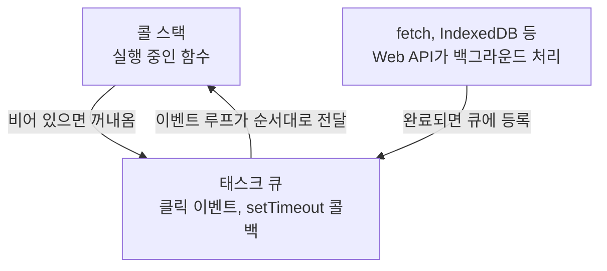

<Callout type="info">
  **이번 편의 결과물:** 코드 작성은 없습니다. 앞으로 20편에 걸쳐 만들 `notes-app`의 기능(DOM 렌더링, `fetch`, 저장소, 워커)이 브라우저의 어느 층에서 동작하는지 지도로 그려 봅니다. · **다루는 개념:** JS 엔진과 Web API의 역할 분리, DOM, 이벤트 루프와 메인 스레드·워커, origin
</Callout>

## 이 편에서 만드는 파일

(코드 없음) 이 편은 실습 폴더를 만들지 않습니다. `notes-app` 프로젝트는 04편부터 시작합니다.

## 개념 정리

### JS 엔진과 브라우저는 다른 것이다

자바스크립트 코드를 실행하는 것은 `V8`, `SpiderMonkey` 같은 **JS 엔진**입니다. 엔진 자체는 변수·함수·객체·`Promise` 같은 언어 문법만 압니다. 화면에 그림을 그리거나 네트워크 요청을 보내는 기능은 엔진에 없습니다.

`document.querySelector`, `fetch`, `localStorage` 같은 것은 브라우저가 엔진 옆에 추가로 붙여 준 **Web API**입니다. 자바스크립트 코드에서 `fetch(...)`를 호출하면, 실제 네트워크 요청은 엔진이 아니라 브라우저(정확히는 브라우저의 네트워크 스택)가 처리하고, 끝나면 결과를 다시 엔진에 돌려줍니다.

| 계층 | 담당 | 예 |
|------|------|-----|
| JS 엔진 | 문법 실행, 변수·함수·객체 | `let`, `function`, `class`, `Promise` |
| Web API (브라우저 제공) | DOM 조작, 네트워크, 저장소, 타이머 | `document`, `fetch`, `localStorage`, `setTimeout` |
| 렌더링 엔진 | DOM을 화면 픽셀로 그림 | 레이아웃, 페인트(02편에서 다룸) |

Node.js에서는 `document`가 없고 대신 `fs`, `process` 같은 시스템 API가 있습니다. "자바스크립트에 원래 있는 기능"과 "실행 환경이 추가한 기능"을 구분하는 습관이 이 과목 전체에서 필요합니다.

### DOM은 문서를 객체로 표현한 것

DOM(Document Object Model)은 HTML 문서를 자바스크립트가 읽고 바꿀 수 있는 트리 구조 객체로 표현한 것입니다. 브라우저가 HTML을 파싱하면서 이 트리를 만들고, 자바스크립트는 `document.querySelector`, `element.textContent` 같은 DOM API로 이 트리를 읽거나 바꿉니다. 트리를 바꾸면 브라우저가 다시 화면을 그립니다(02편에서 자세히 다룸).

### 이벤트 루프와 메인 스레드

브라우저 탭 하나는 기본적으로 자바스크립트를 **한 번에 한 줄씩만** 실행하는 스레드 하나(메인 스레드)를 씁니다. 클릭 이벤트 처리, DOM 갱신, 화면 그리기가 전부 이 한 스레드 위에서 순서대로 일어납니다.



`fetch`나 `setTimeout`처럼 시간이 걸리는 작업은 메인 스레드가 기다리지 않습니다. 브라우저가 백그라운드에서 처리하고, 끝나면 결과를 태스크 큐에 넣습니다. 이벤트 루프는 콜 스택이 비었을 때 큐에서 다음 작업을 꺼내 실행합니다. 이 구조 덕분에 네트워크 요청 중에도 화면이 멈추지 않습니다.

무거운 계산(예: 메모 500개 검색)을 메인 스레드에서 직접 돌리면 그동안 클릭도 화면 갱신도 멈춥니다. 15편에서 이 계산을 별도 스레드인 Web Worker로 옮기는 이유가 여기에 있습니다.

### origin — 같은 사이트인지 구분하는 기준

origin은 `프로토콜 + 호스트 + 포트`의 조합입니다. 셋 중 하나라도 다르면 다른 origin으로 취급합니다.

| URL 1 | URL 2 | 같은 origin인가 |
|-------|-------|------------------|
| `http://localhost:5173` | `http://localhost:5173/notes` | 예 (경로는 origin에 포함 안 됨) |
| `http://localhost:5173` | `http://localhost:3001` | 아니오 (포트가 다름) |
| `http://localhost:5173` | `https://localhost:5173` | 아니오 (프로토콜이 다름) |
| `http://app.example.com` | `http://api.example.com` | 아니오 (호스트가 다름) |

`localStorage`, IndexedDB, `fetch` 요청 허용 여부(CORS)는 모두 이 origin을 기준으로 판단합니다. 08편에서 `notes-app`(Vite 개발 서버, 포트 5173)이 json-server(포트 3001)에 요청을 보낼 때 이 둘이 서로 다른 origin이라는 점이 다시 등장합니다.

## 개발자 도구로 확인하기

<Steps>

### 1. 아무 웹 페이지에서 개발자 도구 열기

브라우저에서 `F12`(또는 `Cmd+Option+I`)를 눌러 개발자 도구를 엽니다. `Console` 탭으로 이동합니다.

### 2. JS 엔진 기능과 Web API 구분해보기

콘솔에 아래를 한 줄씩 입력합니다.

```text
typeof Array.prototype.map
typeof document.querySelector
typeof fetch
```

세 줄 모두 `"function"`이 나오지만, `Array.prototype.map`은 언어 자체(JS 엔진)가 제공하는 기능이고 `document.querySelector`와 `fetch`는 브라우저가 추가한 Web API입니다.

### 3. 현재 페이지의 origin 확인하기

```text
location.origin
```

### 4. Sources 탭에서 스레드 확인하기

`Sources` 탭 왼쪽 하단에 `Threads`(또는 `Call Stack` 근처) 영역이 있는지 찾아봅니다. 워커를 쓰지 않는 일반 페이지는 스레드가 메인 스레드 하나만 보입니다.

</Steps>

## 확인

- 콘솔에서 `typeof fetch`와 `typeof Array.prototype.map`이 둘 다 `"function"`으로 나오지만, 정의된 곳(엔진 vs 브라우저)이 다르다는 것을 설명할 수 있습니다.
- `location.origin`이 현재 주소창의 `프로토콜://호스트:포트`와 일치하는 것을 확인합니다.

## 직접 해보기

1. 지금 열린 사이트와 다른 사이트(예: 검색 엔진)를 새 탭에서 열고 각각 `location.origin`을 비교해봅니다.
2. 콘솔에 `setTimeout(() => console.log("나중에"), 0); console.log("먼저")`를 입력하고 어떤 순서로 출력되는지 확인해봅니다. 이유를 위 이벤트 루프 그림과 연결해 설명해봅니다.

<details>
<summary>정답 보기</summary>

`"먼저"`가 먼저 출력되고 `"나중에"`가 그다음에 출력됩니다. `setTimeout`은 지연 시간이 `0`이어도 콜백을 태스크 큐에 넣을 뿐이고, 콜 스택에 있는 동기 코드(`console.log("먼저")`)가 먼저 끝난 뒤에야 이벤트 루프가 큐에서 콜백을 꺼내 실행하기 때문입니다.

</details>

## 자주 하는 실수

| 오해 | 실제 |
|------|------|
| `fetch`, `document` 같은 것도 자바스크립트 언어 문법이다 | 언어 명세(ECMAScript)에는 없고 브라우저가 추가한 Web API다 |
| 자바스크립트는 여러 작업을 동시에 처리한다 | 메인 스레드는 한 번에 한 작업만 처리한다. 동시처럼 보이는 것은 이벤트 루프가 빠르게 번갈아 처리하기 때문이다 |
| 포트만 다르면 같은 사이트로 취급된다 | 포트도 origin 구성 요소라 다르면 별개 origin이다 |

## 확인 문제

<Quiz
  questionNumber={1}
  question="document.querySelector와 Array.prototype.map의 차이로 옳은 것은?"
  options={['둘 다 ECMAScript 언어 명세에 정의된 문법이다', 'querySelector는 브라우저가 제공하는 Web API이고 map은 언어 자체의 내장 기능이다', 'map은 브라우저 전용이라 Node.js에서 쓸 수 없다', '둘 다 브라우저가 추가한 확장 기능이다']}
  correctAnswer={2}
  explanation="Array.prototype.map은 ECMAScript 명세가 정의하는 언어 내장 기능이고, document.querySelector는 브라우저가 추가로 제공하는 Web API입니다."
  optionExplanations={['querySelector는 명세가 아니라 브라우저 API입니다', '정답입니다', 'map은 Node.js에서도 그대로 동작합니다', 'map은 브라우저 확장이 아니라 언어 자체 기능입니다']}
/>

<Quiz
  questionNumber={2}
  question="자바스크립트 메인 스레드의 동작 방식으로 옳은 것은?"
  options={['여러 함수를 동시에 병렬로 실행한다', '한 번에 한 작업씩 콜 스택에서 순서대로 실행한다', '항상 별도 스레드에서 이벤트를 처리한다', '이벤트 루프 없이 즉시 모든 콜백을 실행한다']}
  correctAnswer={2}
  explanation="메인 스레드는 콜 스택이 비었을 때 이벤트 루프가 태스크 큐에서 꺼낸 작업을 하나씩 순서대로 실행합니다."
  optionExplanations={['자바스크립트 메인 스레드는 단일 스레드로 동작합니다', '정답입니다', '별도 스레드 사용은 Web Worker를 명시적으로 만들 때만 해당됩니다', '이벤트 루프가 실행 순서를 관리합니다']}
/>

<Quiz
  questionNumber={3}
  question="setTimeout(fn, 0)을 호출했을 때 fn이 실행되는 시점으로 옳은 것은?"
  options={['호출 즉시 동기적으로 실행된다', '현재 실행 중인 동기 코드가 모두 끝난 뒤 태스크 큐를 거쳐 실행된다', '브라우저가 완전히 유휴 상태가 될 때까지 실행되지 않는다', 'Web Worker 스레드에서 실행된다']}
  correctAnswer={2}
  explanation="지연 시간이 0이어도 콜백은 태스크 큐에 들어가고, 현재 콜 스택의 동기 코드가 끝난 뒤 이벤트 루프가 꺼내 실행합니다."
  optionExplanations={['setTimeout은 항상 비동기로 큐를 거칩니다', '정답입니다', '유휴 상태와는 무관하게 큐 순서대로 처리됩니다', 'setTimeout 콜백은 메인 스레드에서 실행됩니다']}
/>

<Quiz
  questionNumber={4}
  question="http://localhost:5173과 http://localhost:3001이 서로 다른 origin인 이유는?"
  options={['호스트 이름의 대소문자가 다르기 때문이다', '경로(path)가 다르기 때문이다', '포트 번호가 다르기 때문이다', '둘 다 http이므로 같은 origin이다']}
  correctAnswer={3}
  explanation="origin은 프로토콜, 호스트, 포트 세 가지로 결정되며 포트가 다르면 다른 origin으로 취급됩니다."
  optionExplanations={['대소문자 문제가 아니라 포트 차이입니다', '경로는 origin 판단에 포함되지 않습니다', '정답입니다', '프로토콜이 같아도 포트가 다르면 다른 origin입니다']}
/>

## 참고 자료

- [MDN - Web APIs](https://developer.mozilla.org/en-US/docs/Web/API)
- [MDN - Event loop](https://developer.mozilla.org/en-US/docs/Web/JavaScript/Reference/Execution_model)
- [MDN - Same-origin policy](https://developer.mozilla.org/en-US/docs/Web/Security/Same-origin_policy)
