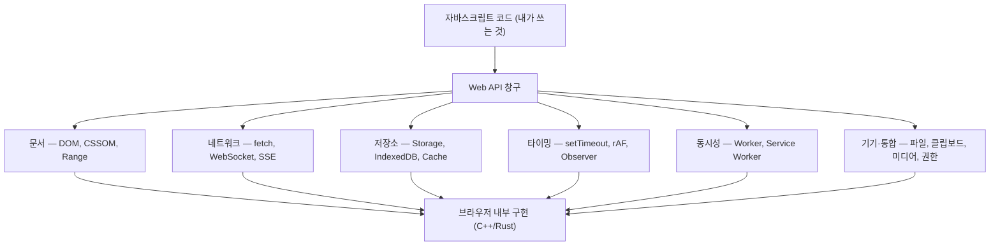
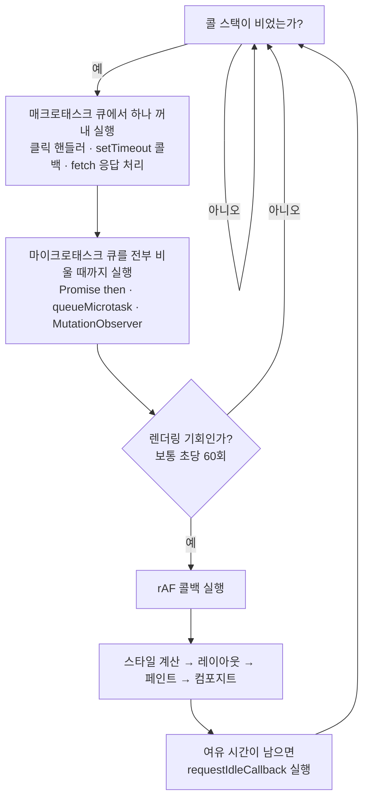
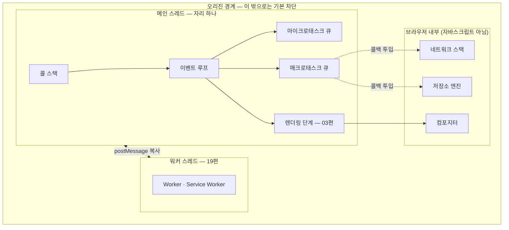

<Callout type="info">
  **이번 문서의 목표:** 이 문서를 다 읽으면 `setTimeout`·`fetch`·`document` 같은 이름이 자바스크립트 언어의 일부가 **아니라는** 사실을 근거와 함께 설명하고, 브라우저라는 실행 환경을 엔진·Web API·이벤트 루프·보안 경계라는 네 축의 지도로 머릿속에 그릴 수 있게 됩니다.
</Callout>

## 왜 "경계"부터 그리는가

이 과목의 나머지 29편은 전부 개별 Web API를 파고듭니다. 그런데 API를 하나씩 배우기 전에 반드시 먼저 잡아야 할 것이 있습니다. **어디까지가 자바스크립트 언어이고, 어디부터가 브라우저가 빌려주는 능력인가** 하는 경계선입니다.

이 선을 못 그으면 아주 자주 이런 착각에 빠집니다.

- "`setTimeout`은 자바스크립트 함수다" → 아닙니다. 브라우저(그리고 Node.js가 각자) 제공하는 함수입니다.
- "`fetch`가 느려서 코드가 멈춘 것 같다" → `fetch`는 코드를 멈추지 않습니다. 멈춘 건 다른 곳입니다.
- "브라우저가 자바스크립트를 실행하니까 브라우저가 할 수 있는 건 자바스크립트도 다 할 수 있다" → 파일 시스템을 마음대로 못 읽습니다. 경계와 권한이 있습니다.

경계선을 정확히 그으면, 나중에 배울 모든 API가 "브라우저가 나 대신 해주는 일 목록"이라는 하나의 이야기로 정리됩니다. 그래서 1편은 지도 그리기입니다.

## 1. 자바스크립트 엔진이 실제로 아는 것

### 언어 명세는 생각보다 작다

**자바스크립트**(JavaScript)라는 언어의 규칙을 정의한 문서를 **ECMAScript 명세**(ECMAScript specification, 에크마스크립트 스펙)라고 부릅니다. 이 명세가 정의하는 것은 놀랍도록 적습니다.

- 값과 타입: 숫자(number), 문자열(string), 불리언(boolean), 객체(object), 심볼(symbol) 등
- 문법과 실행 규칙: 변수 선언, 함수 호출, 프로토타입(prototype) 체인, 클래스(class)
- 내장 객체(built-in object): `Object`, `Array`, `Math`, `JSON`, `Promise`, `Map`, `Set`, `Date` 등

여기 없는 것이 무엇인지가 핵심입니다. **화면에 무언가를 출력하는 방법이 없습니다.** 파일을 읽는 방법도, 네트워크로 요청을 보내는 방법도, 심지어 "1초 뒤에 실행해줘"라는 시간 개념도 없습니다. `console.log`조차 ECMAScript 명세에 없습니다.

> **쉽게 말하면:** 자바스크립트 엔진(engine)은 계산만 할 줄 아는 뇌입니다. 눈·귀·손·시계가 없습니다. 그 감각 기관을 붙여주는 것이 브라우저입니다.

### 엔진이 하는 일 — 파싱·컴파일·실행

**엔진**(engine, 실행기)은 자바스크립트 소스 코드를 받아 실제로 돌리는 프로그램입니다. 크롬(Chrome)과 엣지(Edge)의 **V8**, 파이어폭스(Firefox)의 **SpiderMonkey**(스파이더몽키), 사파리(Safari)의 **JavaScriptCore**가 대표적입니다.

엔진 내부에는 두 개의 핵심 구조가 있습니다.

- **콜 스택**(call stack, 호출 스택): 지금 실행 중인 함수들이 쌓이는 접시 더미. 함수를 부르면 위에 쌓고, 끝나면 걷어냅니다. 자바스크립트가 "한 번에 한 가지 일만" 하는 이유가 바로 스택이 하나뿐이기 때문입니다.
- **힙**(heap, 더미): 객체와 배열 같은 덩치 큰 값들이 저장되는 메모리 영역. 더 이상 아무도 참조하지 않는 값은 **GC**(Garbage Collection, 가비지 컬렉션 — 쓰레기 수거)가 알아서 회수합니다.

<Callout type="warning">
  **자주 틀리는 점:** "자바스크립트는 싱글 스레드(single thread, 단일 실행 흐름)"라는 말은 **엔진의 콜 스택이 하나**라는 뜻이지, 브라우저 전체가 한 가닥으로 돈다는 뜻이 아닙니다. 브라우저는 네트워크·디코딩·컴포지팅(compositing) 등을 별도 스레드에서 병렬로 돌립니다. 내 자바스크립트 코드가 그 위에 올라탈 자리가 하나뿐인 것입니다.
</Callout>

### 확인 실험 — 엔진에 없는 것과 있는 것

아래 실습기는 실제 브라우저에서 실행됩니다. 콘솔 출력을 보며 어떤 이름이 어디 소속인지 확인해 보세요.

<CodePlayground
  template="vanilla"
  activeFile="/index.js"
  showConsole
  label="어디까지가 언어이고 어디부터가 브라우저인가"
  files={{
    '/index.html': `

  
콘솔 출력을 확인하세요.

`,
    '/index.js': `// (A) ECMAScript 언어가 정의하는 내장 객체 — 어떤 JS 환경에도 있다
console.log("Math는 언어 소속?", typeof Math);        // object
console.log("JSON은 언어 소속?", typeof JSON);        // object
console.log("Promise는 언어 소속?", typeof Promise);  // function

// (B) 브라우저가 빌려주는 것 — 언어 명세에는 한 글자도 없다
console.log("document는?", typeof document);          // object (브라우저)
console.log("fetch는?", typeof fetch);                // function (브라우저)
console.log("setTimeout은?", typeof setTimeout);      // function (브라우저)
console.log("localStorage는?", typeof localStorage);  // object (브라우저)

// (C) 전역 객체의 정체 — 브라우저에서 전역은 window
console.log("window === globalThis ?", window === globalThis); // true

// (D) 결정적 증거: 브라우저가 준 것은 window에 얹혀 있다
console.log("window.fetch 존재?", "fetch" in window);       // true
console.log("window.document 존재?", "document" in window); // true

// (E) 엔진이 멈추면 브라우저의 UI도 함께 멈춘다는 증거
const 시작 = performance.now();
let 합계 = 0;
for (let i = 0; i < 3000000; i++) { 합계 += i; }
const 걸린시간 = Math.round(performance.now() - 시작);
console.log("동기 반복 " + 걸린시간 + "ms 동안 화면은 얼어 있었다");`,
  }}
/>

`typeof Math`와 `typeof document`가 둘 다 `"object"`로 나오지만, 출신은 완전히 다릅니다. `Math`는 자바스크립트가 도는 모든 곳(Node.js, 워커, 심지어 브라우저 없는 임베디드 엔진)에 있고, `document`는 오직 브라우저의 창(window)이라는 맥락 안에만 존재합니다.

## 2. Web API — 브라우저가 빌려주는 능력

### 이름부터 뜯어보기

**API**(Application Programming Interface, 응용 프로그램 프로그래밍 인터페이스)는 단어를 쪼개면 뜻이 그대로 보입니다. **인터페이스**(interface)는 "사이(inter)에 놓인 면(face)", 즉 서로 다른 두 세계가 만나 약속대로 대화하는 창구입니다. 식당의 메뉴판과 같습니다. 손님은 주방 구조를 몰라도 메뉴판에 적힌 이름만 부르면 음식이 나옵니다.

그래서 **Web API**는 "브라우저라는 주방이 자바스크립트라는 손님에게 내미는 메뉴판"입니다. 메뉴판에는 이런 것들이 적혀 있습니다.

중요한 관찰: 창구 뒤의 실제 구현은 자바스크립트가 아닙니다. `fetch`를 부르면 브라우저 내부의 네트워크 스택(C++로 짜인 코드)이 소켓을 열고 TCP 연결을 맺습니다. 내 자바스크립트는 주문서를 넘겼을 뿐입니다.

### "브라우저가 대신 한다"의 실제 의미

이 관점을 잡으면 비동기(asynchronous, 비순차)가 왜 필요한지가 저절로 풀립니다.

주문서를 넘긴 뒤 내 콜 스택은 **비어 있습니다.** 네트워크 응답은 브라우저의 다른 스레드가 기다리고 있고, 내 자바스크립트는 그동안 다른 일을 합니다. 응답이 오면 브라우저가 "결과 나왔습니다"라며 내가 맡겨둔 콜백(callback, 되부름 함수)을 큐(queue, 대기줄)에 넣어줍니다.

> **쉽게 말하면:** Web API는 심부름꾼입니다. `fetch("...")`는 "이거 사다 줘"라고 부탁하고 돌아서는 행동이지, 가게 앞에 서서 기다리는 행동이 아닙니다.

### 표준이라는 것

Web API는 특정 회사가 마음대로 만드는 것이 아니라 두 표준 기구가 문서로 정의합니다.

| 기구 | 전체 이름 | 주로 정의하는 것 |
|------|-----------|------------------|
| WHATWG | Web Hypertext Application Technology Working Group | HTML, DOM, Fetch, Streams, URL — 살아있는 표준 |
| W3C | World Wide Web Consortium | CSSOM, Web Components, 권한·기기 관련 다수 |

"살아있는 표준"(Living Standard, 리빙 스탠더드)이란 버전 번호를 붙여 얼려두지 않고 계속 고쳐 나가는 방식입니다. 그래서 "HTML5"라는 표현은 더 이상 기술적으로 정확하지 않습니다. 이 스펙 문서를 실제로 읽는 방법은 다음 2편에서 통째로 다룹니다.

## 3. 이벤트 루프 — 하나뿐인 실행 자리의 교통정리

### 문제 상황

콜 스택은 하나입니다. 그런데 브라우저는 클릭 처리, 네트워크 응답, 타이머 만료, 화면 갱신을 전부 자바스크립트로 알려줘야 합니다. 이 여러 갈래의 일을 **하나뿐인 자리에 순서대로 밀어 넣는 교통정리 장치**가 필요합니다. 그것이 **이벤트 루프**(event loop, 사건 순환)입니다.

> **쉽게 말하면:** 이벤트 루프는 창구 하나짜리 은행의 번호표 기계입니다. 창구(콜 스택)가 비면 다음 번호를 부릅니다. 창구에 앉은 손님이 안 일어나면, 뒤에 아무리 많이 기다려도 아무도 못 들어옵니다.

### 한 바퀴에 무슨 일이 일어나는가

이벤트 루프의 한 바퀴를 **틱**(tick) 또는 태스크 한 번의 처리라고 부릅니다. 순서가 중요합니다.

- **매크로태스크**(macrotask, 큰 작업 — 스펙 용어로는 그냥 task): 한 바퀴에 **하나만** 꺼냅니다. 클릭 이벤트 핸들러, `setTimeout` 콜백, 스크립트 최초 실행이 여기 해당합니다.
- **마이크로태스크**(microtask, 작은 작업): 매크로태스크 하나가 끝나면 큐가 **완전히 빌 때까지 전부** 실행합니다. `Promise`의 `then`, `await` 이후 코드, `queueMicrotask`, `MutationObserver` 콜백이 여기 들어갑니다.
- **렌더링**: 마이크로태스크까지 다 비운 뒤에야 화면을 갱신할 기회가 옵니다. 이 단계의 내부 동작은 3편에서 자세히 다룹니다.

여기서 이 과목 전체를 관통하는 결론이 나옵니다. **화면 갱신은 자바스크립트가 콜 스택에서 내려온 뒤에만 가능합니다.** 무거운 반복문이 도는 동안 화면이 얼어붙는 이유이고, 스크롤·애니메이션 최적화가 전부 "메인 스레드를 비우기"라는 한 문장으로 수렴하는 이유입니다.

<Callout type="warning">
  **자주 틀리는 점:** `setTimeout(fn, 0)`은 "즉시 실행"이 아니라 "지금 하던 매크로태스크와 그 뒤의 모든 마이크로태스크가 끝난 다음, 가장 이른 기회에"입니다. 게다가 스펙상 중첩 5단계를 넘으면 최소 4밀리초의 하한(clamping, 클램핑)이 걸립니다. 정확한 동작은 18편에서 다룹니다.
</Callout>

### 순서를 눈으로 확인하기

<CodePlayground
  template="vanilla"
  activeFile="/index.js"
  showConsole
  label="이벤트 루프 실행 순서 — 예상하고 나서 콘솔을 확인하세요"
  files={{
    '/index.html': `

  <button id="버튼">클릭해서 이벤트 태스크 확인</button>
  
버튼을 누르면 추가 출력이 나옵니다.

`,
    '/index.js': `console.log("1. 동기 코드 — 지금 콜 스택 위");

setTimeout(() => {
  console.log("5. 매크로태스크(setTimeout 0ms)");
}, 0);

Promise.resolve().then(() => {
  console.log("3. 마이크로태스크(Promise then)");
});

queueMicrotask(() => {
  console.log("4. 마이크로태스크(queueMicrotask)");
});

console.log("2. 동기 코드 — 여전히 같은 스택");

// 클릭도 매크로태스크다. 핸들러 안의 Promise는
// 그 핸들러가 끝난 직후 곧바로 소진된다.
document.getElementById("버튼").addEventListener("click", () => {
  console.log("A. 클릭 핸들러 시작 — 새 매크로태스크");
  Promise.resolve().then(() => console.log("C. 핸들러가 만든 마이크로태스크"));
  console.log("B. 클릭 핸들러 끝");
});

// 렌더링은 마이크로태스크를 전부 비운 다음에 온다
requestAnimationFrame(() => {
  console.log("6. rAF — 다음 화면 갱신 직전");
});`,
  }}
/>

출력 순서가 1, 2, 3, 4, 5, 6인 것을 확인했다면 이벤트 루프의 뼈대를 잡은 것입니다. 특히 **3과 4가 5보다 먼저**라는 점 — 마이크로태스크가 매크로태스크를 앞지르는 것 — 이 핵심입니다.

## 4. 메인 스레드와 워커 — 자리를 늘리는 유일한 방법

### 메인 스레드가 하는 일 전부

**메인 스레드**(main thread, 주 실행 흐름)는 이름과 달리 자바스크립트만 돌리지 않습니다. 한 탭에서 이 스레드가 담당하는 일 목록입니다.

- 자바스크립트 실행
- 스타일 계산과 레이아웃(layout, 배치 계산)
- 대부분의 페인트(paint, 그리기) 명령 생성
- 이벤트 디스패치(dispatch, 전달)

전부 한 자리에서 순서대로 처리되므로, **자바스크립트가 오래 돌면 스타일 계산도, 클릭 처리도, 화면 그리기도 전부 대기**합니다. 초당 60프레임을 유지하려면 한 프레임에 주어진 시간은 약 16.7밀리초입니다. 자바스크립트가 그중 대부분을 먹으면 프레임을 놓치고, 사용자는 "끊긴다"고 느낍니다.

### 워커 — 진짜 병렬 실행

자리를 늘리는 방법은 **워커**(Worker, 일꾼)뿐입니다. 워커는 별도 스레드에서 도는 독립된 자바스크립트 실행 환경입니다.

| 구분 | 메인 스레드 | 워커 |
|------|-------------|------|
| DOM 접근 | 가능 | 불가능 — `document`가 없다 |
| 사용 가능한 API | 거의 전부 | fetch, IndexedDB, Cache, 타이머 등 일부 |
| 데이터 전달 | 직접 참조 | `postMessage`로 복사 또는 이전 |
| 막히면 | 화면 전체가 얼어붙음 | 화면은 멀쩡함 |

워커가 DOM에 접근하지 못하는 것은 게으름이 아니라 설계입니다. 여러 스레드가 같은 DOM 트리를 동시에 고치면 락(lock, 잠금)과 경쟁 조건(race condition, 경쟁 상태)이 필요해지고, 그러면 웹 개발자가 짜는 모든 코드가 훨씬 어려워집니다. 그래서 웹 플랫폼은 **DOM은 메인 스레드 독점, 스레드 간 대화는 메시지 복사로만**이라는 단순한 규칙을 택했습니다. 이 모델의 상세는 19편에서 다룹니다.

## 5. origin — 보안의 기본 단위

### 왜 격리가 필요한가

브라우저에서는 내가 열어둔 은행 탭과, 방금 클릭한 낯선 광고 페이지가 **같은 브라우저 프로세스 안에서 나란히** 돕니다. 아무 장치가 없다면 광고 페이지의 자바스크립트가 은행 페이지의 DOM을 읽어 계좌번호를 가져갈 수 있습니다. 이를 막는 기본 단위가 **오리진**(origin, 출처)입니다.

오리진은 URL(Uniform Resource Locator, 자원 위치 지정자)의 세 조각으로 만들어집니다.

$$
origin = scheme + host + port
$$

- $scheme$ (스킴, 통신 방식): `https`, `http` 같은 프로토콜 이름
- $host$ (호스트, 서버 이름): `example.com` 같은 도메인
- $port$ (포트, 접속 번호): `443`, `8080` 등. 생략하면 스킴의 기본값

세 개가 **하나라도** 다르면 다른 오리진입니다.

| URL | `https://shop.com` 과 같은 오리진? | 이유 |
|-----|-----------------------------------|------|
| `https://shop.com/cart` | 같음 | 경로는 오리진에 포함되지 않는다 |
| `http://shop.com` | 다름 | 스킴이 다르다 |
| `https://api.shop.com` | 다름 | 호스트가 다르다 |
| `https://shop.com:8443` | 다름 | 포트가 다르다 |

이 규칙을 강제하는 정책을 **동일 출처 정책**(Same-Origin Policy, SOP)이라고 부릅니다. 다른 오리진의 DOM 읽기, 저장소 읽기, 응답 본문 읽기가 기본적으로 차단됩니다.

> **쉽게 말하면:** 오리진은 아파트 호수입니다. 같은 건물(브라우저)에 살아도 남의 집 냉장고(저장소)와 서랍(DOM)은 열 수 없습니다. `https://shop.com`과 `https://api.shop.com`은 옆집이지, 같은 집이 아닙니다.

### 저장소도 오리진 단위다

`localStorage`, IndexedDB, Cache Storage는 전부 오리진마다 별도의 공간을 가집니다. `https://a.com`이 저장한 값은 `https://b.com`에서 조회조차 되지 않습니다. 13편에서 이 격리와 용량 한도(quota, 쿼터)를 자세히 다룹니다.

### 안전한 컨텍스트

강력한 API — 카메라, 마이크, 위치, Service Worker, `crypto.subtle` — 는 **안전한 컨텍스트**(secure context, 시큐어 컨텍스트)에서만 동작합니다. 실무적으로는 `https://`이거나 `localhost`여야 한다는 뜻입니다. 중간에서 통신을 가로채는 공격자가 있는 평문 연결에 카메라 권한을 주는 것은 위험하기 때문입니다. 상세는 24편입니다.

<Callout type="warning">
  **자주 틀리는 점:** "도메인이 같으면 같은 오리진"이라고 외우면 틀립니다. 포트와 스킴까지 셋 다 같아야 합니다. 개발 중 `http://localhost:3000`과 `http://localhost:5173`이 서로를 못 읽는 것이 바로 이 규칙 때문이고, 이를 서버가 허락해 주는 절차가 CORS(Cross-Origin Resource Sharing, 교차 출처 자원 공유)입니다. 10편에서 다룹니다.
</Callout>

## 6. 전체 지도 한 장

지금까지의 네 축을 하나로 합치면 이 과목의 전체 지형이 됩니다.

이 지도 위에 앞으로의 편들이 얹힙니다. 문서 모델(05편)과 이벤트(06·09편)는 메인 스레드 위의 이야기이고, 네트워크(10~12편)와 저장소(13~16편)는 오리진 경계와 브라우저 내부 구현의 이야기이며, 관측자·타이밍·워커(17~20·23편)는 전부 "메인 스레드의 하나뿐인 자리를 어떻게 비울 것인가"라는 한 가지 질문의 변주입니다.

## 핵심 정리

- ECMAScript 명세는 계산 규칙만 정의한다. `document`·`fetch`·`setTimeout`·`localStorage`는 전부 브라우저가 얹어준 Web API이며, 자바스크립트 언어의 일부가 아니다.
- Web API를 호출하는 것은 브라우저 내부의 비자바스크립트 구현에 주문서를 넘기는 일이다. 그래서 기다리지 않고 돌아설 수 있고, 그 결과가 콜백으로 돌아오는 구조가 비동기다.
- 이벤트 루프는 매크로태스크 하나 → 마이크로태스크 전부 → 렌더링 기회 순서로 돈다. 마이크로태스크가 매크로태스크를 앞지른다.
- 자바스크립트 실행과 레이아웃·페인트가 같은 메인 스레드를 공유하므로, 긴 동기 코드는 곧 화면 멈춤이다. 자리를 늘리는 유일한 방법이 워커다.
- 오리진은 스킴·호스트·포트 셋의 조합이며, DOM·저장소·응답 본문 접근의 기본 격리 단위다. 강력한 API는 안전한 컨텍스트를 요구한다.

## 마무리 복습

<Quiz
  questionNumber={1}
  question="다음 중 ECMAScript 언어 명세가 정의하는 것은?"
  options={['setTimeout', 'document', 'Promise', 'localStorage']}
  correctAnswer={3}
  explanation="Promise는 ECMAScript 명세가 정의하는 내장 객체다. setTimeout, document, localStorage는 브라우저가 제공하는 Web API이며 언어 명세에는 존재하지 않는다."
  optionExplanations={['브라우저와 Node.js가 각자 제공하는 환경 API다', '브라우저의 창 맥락에만 존재하는 문서 객체다', '정답 — 언어 명세의 내장 객체이므로 어떤 JS 환경에도 존재한다', '브라우저의 저장소 API이며 오리진 단위로 격리된다']}
/>

<Quiz
  questionNumber={2}
  question="다음 코드의 콘솔 출력 순서로 알맞은 것은? 첫 줄에 A 출력, setTimeout 0ms로 B 예약, Promise then으로 C 예약, 마지막 줄에 D 출력."
  options={['A D C B', 'A B C D', 'A C D B', 'A D B C']}
  correctAnswer={1}
  explanation="동기 코드 A와 D가 먼저 끝나고, 그 다음 마이크로태스크 큐가 전부 소진되어 C가 나오며, 매크로태스크인 setTimeout 콜백 B가 마지막이다."
  optionExplanations={['정답 — 동기 두 줄, 마이크로태스크, 매크로태스크 순서다', 'setTimeout 콜백은 동기 코드가 전부 끝난 뒤에만 실행된다', 'D는 동기 코드이므로 마이크로태스크 C보다 먼저다', '마이크로태스크는 항상 매크로태스크보다 앞선다']}
/>

<Quiz
  questionNumber={3}
  question="브라우저 메인 스레드에 대한 설명으로 옳지 않은 것은?"
  options={['자바스크립트 실행과 레이아웃 계산이 같은 스레드에서 처리된다', '긴 동기 반복문이 돌면 화면 갱신과 클릭 처리가 모두 지연된다', '워커를 쓰면 워커 스레드에서도 DOM을 직접 수정할 수 있다', '이벤트 디스패치도 이 스레드에서 이루어진다']}
  correctAnswer={3}
  explanation="워커에는 document가 없어 DOM에 직접 접근할 수 없다. DOM은 메인 스레드가 독점하며, 워커는 postMessage로 결과만 전달한다."
  optionExplanations={['둘 다 메인 스레드가 담당하므로 서로 자리를 다툰다', '콜 스택이 비어야 렌더링 기회가 오기 때문이다', '정답(틀린 설명) — 워커는 DOM에 접근할 수 없다', '이벤트 핸들러 실행도 메인 스레드의 태스크로 처리된다']}
/>

<Quiz
  questionNumber={4}
  question="https://shop.com 페이지와 동일한 오리진인 것은?"
  options={['http://shop.com/items', 'https://api.shop.com', 'https://shop.com:8443', 'https://shop.com/cart/checkout']}
  correctAnswer={4}
  explanation="오리진은 스킴, 호스트, 포트 세 요소로만 결정되며 경로는 포함되지 않는다. 나머지 보기는 각각 스킴, 호스트, 포트가 다르다."
  optionExplanations={['스킴이 http로 달라 다른 오리진이다', '호스트가 api.shop.com으로 달라 다른 오리진이다', '포트가 명시적으로 8443이라 기본 443과 다르다', '정답 — 경로만 다르므로 같은 오리진이다']}
/>

<Quiz
  questionNumber={5}
  question="Web API 호출이 코드 실행을 막지 않는 근본적인 이유로 가장 알맞은 것은?"
  options={['자바스크립트 엔진이 여러 개의 콜 스택을 동시에 운용하기 때문', '실제 작업을 브라우저 내부의 다른 구현이 처리하고 결과만 큐를 통해 콜백으로 돌려주기 때문', 'Promise 문법이 코드를 자동으로 병렬 실행하기 때문', '브라우저가 자바스크립트를 여러 번 복제해 실행하기 때문']}
  correctAnswer={2}
  explanation="fetch 같은 호출은 브라우저 내부 구현에 작업을 위임하는 주문서다. 내 콜 스택은 곧 비고, 결과는 태스크 큐를 거쳐 이벤트 루프가 다시 올려준다."
  optionExplanations={['콜 스택은 실행 맥락마다 하나뿐이다', '정답 — 위임과 콜백 큐가 비동기의 실제 메커니즘이다', 'Promise는 결과를 표현하는 객체일 뿐 병렬 실행 장치가 아니다', '코드가 복제되어 실행되는 일은 없다']}
/>

<Quiz
  questionNumber={6}
  question="안전한 컨텍스트(secure context)를 요구하는 API에 해당하지 않는 것은?"
  options={['Service Worker 등록', 'crypto.subtle 암호 연산', '카메라·마이크 접근', 'document.getElementById로 요소 선택']}
  correctAnswer={4}
  explanation="요소 선택 같은 기본 DOM 조작은 안전한 컨텍스트를 요구하지 않는다. 나머지는 통신 가로채기 위험 때문에 https 또는 localhost에서만 동작한다."
  optionExplanations={['네트워크를 가로챌 수 있는 강력한 기능이라 제한된다', '암호 키를 다루므로 평문 연결에서는 허용되지 않는다', '기기 접근은 대표적인 제한 대상이다', '정답 — 기본 DOM 조작에는 이 제약이 없다']}
/>

<Quiz
  questionNumber={7}
  question="마이크로태스크 큐에 대한 설명으로 옳은 것은?"
  options={['이벤트 루프 한 바퀴에 하나씩만 꺼내 실행한다', '매크로태스크 하나가 끝나면 큐가 빌 때까지 전부 실행한다', 'setTimeout 콜백이 들어가는 큐다', '렌더링이 끝난 다음에만 실행된다']}
  correctAnswer={2}
  explanation="마이크로태스크는 매크로태스크 하나가 끝날 때마다 큐가 완전히 빌 때까지 연속 실행되며, 그 뒤에 렌더링 기회가 온다. 하나씩 꺼내는 것은 매크로태스크다."
  optionExplanations={['하나씩 꺼내는 것은 매크로태스크의 처리 방식이다', '정답 — 큐가 빌 때까지 전부 소진한다', 'setTimeout 콜백은 매크로태스크다', '마이크로태스크 소진이 렌더링보다 먼저다']}
/>

## 참고 자료

- [MDN - Web APIs](https://developer.mozilla.org/en-US/docs/Web/API)
- [MDN - Populating the page: how browsers work](https://developer.mozilla.org/en-US/docs/Web/Performance/Guides/How_browsers_work)
- [HTML Living Standard - Event loops](https://html.spec.whatwg.org/multipage/webappapis.html#event-loops)
- [MDN - Web Workers API](https://developer.mozilla.org/en-US/docs/Web/API/Web_Workers_API)
