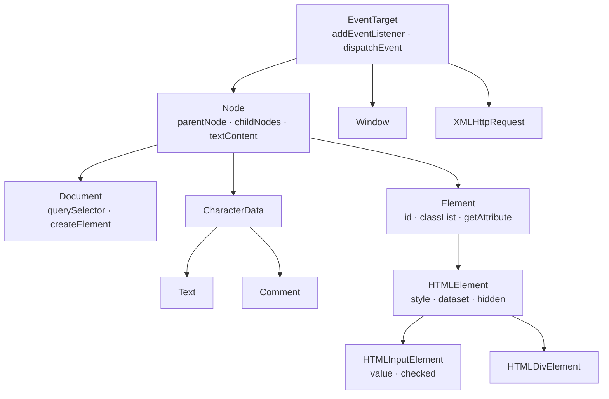
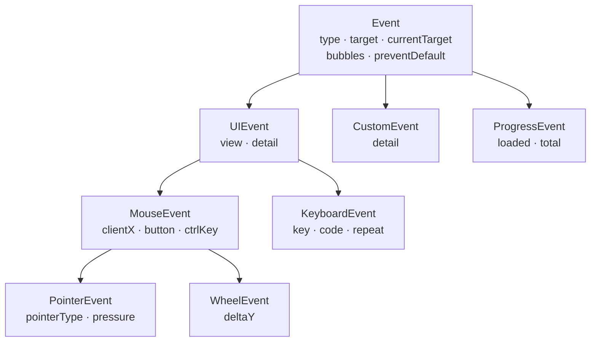
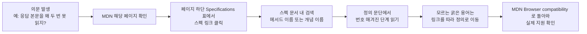

<Callout type="info">
  **이번 문서의 목표:** 이 문서를 다 읽으면 WHATWG·W3C 스펙 문서에 나오는 Web IDL 블록을 한 줄씩 해독하고, "이 API가 정확히 어떻게 동작하는가"라는 질문의 답을 MDN이 아니라 **스펙 원문에서 직접** 찾아올 수 있게 됩니다.
</Callout>

## 왜 스펙을 직접 읽어야 하는가

MDN(Mozilla Developer Network)은 훌륭한 문서입니다. 하지만 실무에서 이런 순간이 반드시 옵니다.

- "`fetch`의 응답 본문을 두 번 읽으면 왜 에러가 나지? MDN에는 '한 번만 읽을 수 있다'고만 적혀 있는데, 정확히 어느 시점에 무엇이 잠기는 거지?"
- "`addEventListener`에 같은 함수를 두 번 등록하면 어떻게 되지? 옵션이 다르면?"
- "이 속성은 문서에 안 나오는데, 크롬에만 있는 건가 아니면 표준인가?"

이 질문들의 답은 전부 스펙 문서에 **번호가 매겨진 알고리즘 단계**로 적혀 있습니다. 스펙은 브라우저 구현자들이 그대로 따라 구현하는 설계도이므로, 애매한 문장이 아니라 실행 가능한 절차로 쓰여 있습니다.

> **쉽게 말하면:** MDN이 사용 설명서라면, 스펙은 회로도입니다. 고장 원인을 알려면 결국 회로도를 봐야 합니다.

이 문서는 회로도 읽는 법을 가르칩니다. 한 번 익히면 앞으로 나올 28편이 전부 쉬워집니다.

## 1. Web IDL — 인터페이스를 적는 공용 언어

### 왜 별도 언어가 필요했나

브라우저는 C++이나 러스트(Rust)로 짜여 있고, 우리는 자바스크립트로 그 기능을 씁니다. **서로 다른 두 언어를 잇는 창구의 모양을 기술할 중립적인 언어**가 필요합니다. 그것이 **Web IDL**(Web Interface Definition Language, 웹 인터페이스 정의 언어)입니다.

이름을 쪼개면 뜻이 그대로입니다. 인터페이스(interface)를 정의(definition)하는 언어(language). 자바스크립트도 C++도 아니고, "이런 이름의 속성이 있고, 이런 타입을 받고, 이런 걸 돌려준다"만 적는 설계 표기법입니다.

> **쉽게 말하면:** Web IDL은 국제 표지판입니다. 어느 나라 말을 쓰든 그림만 보면 "여기 화장실 있음"을 알 수 있듯, 어느 언어로 구현하든 IDL만 보면 창구의 모양을 알 수 있습니다.

### 실제 IDL 한 덩어리 해독하기

DOM 표준에 실린 `AbortController`의 IDL입니다. 실물 그대로입니다.

```webidl
[Exposed=*]
interface AbortController {
  constructor();

  [SameObject] readonly attribute AbortSignal signal;

  undefined abort(optional any reason);
};
```

한 줄씩 뜯어봅니다.

| 줄 | 의미 |
|----|------|
| `[Exposed=*]` | **확장 속성**(extended attribute). 이 인터페이스가 노출되는 전역 범위. `*`는 윈도우·워커 모두 |
| `interface AbortController` | 인터페이스 이름. 자바스크립트에서는 `AbortController`라는 전역 생성자로 보인다 |
| `constructor();` | `new AbortController()`가 가능하며 인자를 받지 않는다 |
| `[SameObject]` | 몇 번을 읽어도 **매번 같은 객체**가 돌아온다는 보장 |
| `readonly attribute` | 읽기 전용 속성. 대입해도 조용히 무시된다(엄격 모드에서는 에러) |
| `AbortSignal signal` | `signal`이라는 이름의 속성이고 타입은 `AbortSignal` |
| `undefined abort(...)` | `abort` 메서드는 아무것도 반환하지 않는다 |
| `optional any reason` | `reason` 인자는 선택이며 어떤 타입이든 받는다 |

이 표를 읽고 나면 문서 없이도 이런 사실을 알 수 있습니다. `controller.signal = 뭔가`는 무시된다. `controller.abort()`의 반환값을 변수에 담아봐야 `undefined`다. `controller.signal`을 두 번 읽어 비교하면 `true`다.

### 자주 나오는 IDL 키워드 사전

| 키워드 | 뜻 | 실제 영향 |
|--------|-----|-----------|
| `interface` | 인터페이스 정의 | 자바스크립트의 생성자 함수와 프로토타입으로 노출 |
| `attribute` | 속성 | 게터·세터가 프로토타입에 정의됨 |
| `readonly` | 읽기 전용 | 세터가 없음 |
| `undefined` | 반환값 없음 | 예전 스펙의 `void`가 이 이름으로 바뀜 |
| `optional` | 선택 인자 | 생략 가능 |
| `any` | 아무 타입 | 제약 없음 |
| `sequence` | 순서 있는 목록 | 자바스크립트 배열로 오고 감 |
| `record` | 키–값 묶음 | 평범한 객체로 표현 |
| `Promise` | 프로미스 반환 | `await` 가능 |
| `dictionary` | 옵션 묶음 정의 | 옵션 객체로 전달 |
| `EventHandler` | 이벤트 핸들러 속성 | `onclick` 같은 형태의 속성 |
| `[SameObject]` | 동일 객체 보장 | 매번 새 객체가 아님 |
| `[Exposed=Window]` | 윈도우에만 노출 | 워커에서는 존재하지 않음 |
| `[SecureContext]` | 안전한 컨텍스트 전용 | https 또는 localhost에서만 |

`[Exposed]`와 `[SecureContext]` 두 줄만 봐도 "이 API를 워커에서 쓸 수 있나?", "http에서 왜 `undefined`지?"라는 질문의 답이 나옵니다. IDL을 읽는 실익이 여기 있습니다.

### 딕셔너리 — 옵션 객체의 정체

Web API가 옵션 객체를 받을 때, 그 객체의 모양은 **딕셔너리**(dictionary, 사전)로 정의됩니다. DOM 표준의 이벤트 리스너 옵션입니다.

```webidl
dictionary EventListenerOptions {
  boolean capture = false;
};

dictionary AddEventListenerOptions : EventListenerOptions {
  boolean passive;
  boolean once = false;
  AbortSignal signal;
};
```

`= false`는 **기본값**입니다. 그래서 `capture`와 `once`는 생략하면 `false`이고, `passive`는 기본값이 없습니다 — 스펙이 "상황에 따라 브라우저가 결정한다"고 따로 규정하기 때문입니다(스크롤 관련 이벤트는 기본이 `true`로 바뀐 역사가 있습니다). `: EventListenerOptions`는 상속을 뜻하므로 `capture`도 함께 쓸 수 있습니다.

<Callout type="warning">
  **자주 틀리는 점:** IDL에서 `boolean` 타입 인자에 문자열을 넘겨도 에러가 나지 않습니다. Web IDL은 넘어온 값을 정의된 타입으로 **강제 변환**(conversion)하도록 규정하기 때문입니다. `once: "false"`라고 쓰면 빈 문자열이 아닌 문자열은 참으로 변환되어 `once: true`가 됩니다. 오타 한 글자가 조용히 반대로 동작하는 대표적인 사고입니다.
</Callout>

### IDL이 자바스크립트에 어떻게 드러나는지 직접 확인

<CodePlayground
  template="vanilla"
  activeFile="/index.js"
  showConsole
  label="IDL 선언이 실제 객체에서 어떻게 보이는지 관찰하기"
  files={{
    '/index.html': `<div id="app">
  <p>콘솔에서 IDL 선언의 실제 결과를 확인하세요.</p>
</div>`,
    '/index.js': `const 컨트롤러 = new AbortController();

// [SameObject] readonly attribute AbortSignal signal;
// → 몇 번을 읽어도 같은 객체
console.log("SameObject 보장?", 컨트롤러.signal === 컨트롤러.signal); // true

// readonly → 대입은 조용히 무시된다 (비엄격 모드)
const 원본 = 컨트롤러.signal;
try {
  컨트롤러.signal = "덮어쓰기 시도";
} catch (e) {
  console.log("엄격 모드였다면 에러:", e.name);
}
console.log("readonly 유지됨?", 컨트롤러.signal === 원본); // true

// undefined abort(optional any reason);
// → 반환값이 없다
console.log("abort 반환값:", 컨트롤러.abort("취소 사유"));  // undefined
console.log("aborted 상태:", 컨트롤러.signal.aborted);      // true
console.log("reason 전달됨:", 컨트롤러.signal.reason);      // 취소 사유

// 속성은 인스턴스가 아니라 프로토타입에 정의된다
const 서술자 = Object.getOwnPropertyDescriptor(
  AbortController.prototype, "signal"
);
console.log("게터만 존재?", typeof 서술자.get, typeof 서술자.set); // function undefined

// dictionary 의 타입 강제 변환 함정
const 옵션 = { once: "false" };  // 문자열 "false"
console.log("boolean으로 변환하면?", Boolean(옵션.once)); // true — 의도와 반대!

// [Exposed] 확인 — 이 값들이 워커에서는 달라진다
console.log("Window 전용 document 존재?", typeof document);   // object
console.log("워커에도 있는 fetch 존재?", typeof fetch);        // function

// [SecureContext] 계열 확인
console.log("현재 안전한 컨텍스트인가?", window.isSecureContext);
console.log("crypto.subtle 사용 가능?", typeof crypto.subtle);`,
  }}
/>

## 2. 인터페이스 상속 — 왜 `click` 이벤트에 `target`이 있는가

Web API의 인터페이스들은 촘촘한 상속 관계를 이룹니다. 이 구조를 알면 "이 객체에 이 속성이 왜 있지?"라는 질문이 사라집니다.



이 그림이 설명해 주는 것들입니다.

- **버튼에 `addEventListener`가 있는 이유**: `HTMLButtonElement`가 아니라 저 꼭대기의 `EventTarget`이 가진 메서드를 물려받았기 때문입니다.
- **`window.addEventListener`도 되는 이유**: `Window`도 `EventTarget`을 상속합니다. DOM 요소가 아닌데도 되는 것이 이 때문입니다.
- **입력 요소에만 `value`가 있는 이유**: `value`는 `HTMLInputElement`에 정의되어 있어서, `<div>`에는 없습니다.

이벤트 객체 쪽도 같은 구조입니다.



클릭 핸들러가 받는 객체에 `clientX`도 있고 `preventDefault`도 있는 이유가 정확히 이 사슬입니다. `clientX`는 `MouseEvent`가, `preventDefault`는 `Event`가 준 것입니다. 그래서 키보드 이벤트에는 `clientX`가 없습니다 — 다른 가지이기 때문입니다.

## 3. 스펙 알고리즘 문단 읽는 법

### 스펙의 문장은 규칙이 있다

스펙 문서에는 특정 단어가 **법률 용어처럼 엄격한 의미**로 쓰입니다. RFC 2119라는 문서가 정한 관례입니다.

| 단어 | 의미 |
|------|------|
| MUST | 반드시 그래야 함. 어기면 구현 버그 |
| MUST NOT | 절대 하면 안 됨 |
| SHOULD | 권장. 합당한 이유가 있으면 예외 가능 |
| MAY | 선택 사항. 브라우저마다 달라도 정상 |

"SHOULD"라고 적힌 동작은 브라우저마다 다를 수 있다는 뜻이므로, 실무에서 그 동작에 의존하면 안 됩니다. 스펙에서 대문자 단어를 만나면 그냥 지나치지 말아야 하는 이유입니다.

### 알고리즘 단계 읽기 — 실제 사례

`addEventListener`의 동작은 DOM 표준에 "add an event listener"라는 알고리즘으로 정의되어 있습니다. 핵심 단계를 요약하면 이렇습니다.

<Steps>

1. **signal 확인** — 옵션의 `signal`이 이미 중단(aborted) 상태이면, 아무것도 하지 않고 **즉시 반환**한다.

2. **콜백 확인** — 리스너의 콜백이 `null`이면 아무것도 하지 않고 반환한다.

3. **중복 검사** — 대상의 리스너 목록에 **타입·콜백·capture가 모두 같은** 리스너가 이미 있으면 추가하지 않는다.

4. **추가** — 그 외의 경우 리스너 목록의 끝에 추가한다.

5. **signal 연결** — `signal`이 있으면, 그 신호가 중단될 때 이 리스너를 제거하는 알고리즘을 등록한다.

</Steps>

이 다섯 단계가 실무 질문 여러 개를 한 번에 해결합니다.

- **같은 함수를 두 번 등록하면?** 3단계에 의해 두 번째는 무시됩니다. 핸들러가 두 번 실행되지 않습니다.
- **capture만 다르게 두 번 등록하면?** 3단계의 조건이 "타입·콜백·capture 셋 다 같을 때"이므로, capture가 다르면 **별개의 리스너로 둘 다 등록**됩니다.
- **익명 함수를 두 번 등록하면?** 콜백이 서로 다른 객체이므로 둘 다 등록되고, `removeEventListener`로 지울 수도 없습니다.
- **`once`는 왜 중복 검사에 안 들어가나?** 3단계 조건에 `once`가 없기 때문입니다. `once`만 다르게 두 번 등록하면 두 번째는 무시되고, 첫 등록의 옵션이 유지됩니다.

<CodePlayground
  template="vanilla"
  activeFile="/index.js"
  showConsole
  label="스펙 알고리즘 3단계를 직접 검증하기 — 버튼을 눌러보세요"
  files={{
    '/index.html': `<div id="app">
  <button id="버튼">눌러서 리스너 실행 횟수 세기</button>
  <p id="결과">아직 클릭하지 않음</p>
</div>`,
    '/index.js': `const 버튼 = document.getElementById("버튼");
const 결과 = document.getElementById("결과");
let 실행횟수 = 0;

function 핸들러() {
  실행횟수 += 1;
  결과.textContent = "이번 클릭에서 핸들러가 실행된 횟수 누적: " + 실행횟수;
  console.log("핸들러 실행, 누적 " + 실행횟수 + "회");
}

// (1) 완전히 동일한 조건으로 세 번 등록 → 스펙 3단계에 의해 1개만 남는다
버튼.addEventListener("click", 핸들러);
버튼.addEventListener("click", 핸들러);
버튼.addEventListener("click", 핸들러);
console.log("동일 조건 3회 등록 완료 — 클릭 시 몇 번 실행될까?");

// (2) capture만 다르게 등록 → 중복 조건에 capture가 포함되므로 별개로 등록된다
버튼.addEventListener("click", 핸들러, { capture: true });
console.log("capture:true 로 한 번 더 등록 — 이제 총 2개");

// (3) 이미 중단된 signal 로 등록 → 스펙 1단계에 의해 아예 등록되지 않는다
const 컨트롤러 = new AbortController();
컨트롤러.abort();
버튼.addEventListener("click", () => {
  console.log("이 줄은 절대 출력되지 않는다");
}, { signal: 컨트롤러.signal });
console.log("이미 abort된 signal 로 등록 시도 — 무시됨");

// (4) removeEventListener 도 타입·콜백·capture 세 값으로 찾는다
//     capture 를 안 맞추면 못 지운다
버튼.addEventListener("click", 핸들러, { capture: true });
버튼.removeEventListener("click", 핸들러);  // capture 기본 false → capture 리스너는 남는다
console.log("capture 불일치 제거 시도 — capture 리스너는 그대로 남아 있다");`,
  }}
/>

클릭 한 번에 핸들러가 **정확히 2회** 실행되었다면 스펙 알고리즘을 제대로 읽은 것입니다. 세 번 등록한 동일 리스너는 1개로 합쳐졌고, capture가 다른 것 하나가 별도로 살아 있기 때문입니다.

### 스펙에서 원하는 문단을 찾는 실전 경로



핵심 습관 두 가지입니다.

1. **MDN 페이지 맨 아래를 항상 본다.** 거기에 Specifications 표와 Browser compatibility 표가 있습니다. 전자는 원전 링크, 후자는 실제로 쓸 수 있는지의 답입니다.
2. **스펙의 굵은 용어는 전부 링크다.** 모르는 개념이 나오면 클릭해서 정의로 갑니다. 스펙은 모든 용어를 자기 안에서 정의하도록 쓰여 있어서, 링크를 두세 번 따라가면 반드시 바닥에 닿습니다.

## 4. 호환성·실험적 API 읽기

### 어떤 API를 믿을 수 있는가

Web API는 표준이 되어도 모든 브라우저에 동시에 들어오지 않습니다. 판단 재료는 세 가지입니다.

| 표기 | 어디서 보이나 | 의미 |
|------|---------------|------|
| Experimental | MDN 제목 옆 배지 | 스펙이 바뀔 수 있음. 프로덕션 사용 주의 |
| Deprecated | MDN 제목 옆 배지 | 폐기 예정. 새 코드에 쓰지 말 것 |
| Non-standard | MDN 제목 옆 배지 | 특정 브라우저 전용. 표준 아님 |
| Baseline | MDN 페이지 상단 위젯 | 주요 브라우저에 모두 들어온 시점 표시 |

**Baseline**(베이스라인, 기준선)은 비교적 최근에 도입된 표기로, "주요 브라우저 네 곳에 모두 구현되었는가"를 한눈에 보여줍니다. Widely available이면 안심하고 쓰고, Newly available이면 사용자층을 고려해 판단합니다.

### 코드에서 직접 확인하는 법 — 기능 탐지

브라우저 이름이나 버전을 보고 분기하는 것을 **UA 스니핑**(User Agent sniffing, 사용자 에이전트 탐지)이라고 하는데, **하면 안 되는 방식**입니다. 사용자 에이전트 문자열은 호환성을 위해 거짓말투성이이고, 새 브라우저가 나오면 조건문이 깨집니다.

올바른 방법은 **기능 탐지**(feature detection, 기능 유무 검사)입니다. "그 기능이 실제로 있는지 물어본다"는 단순한 원칙입니다.

```js
// 나쁜 방식 — 브라우저 이름으로 판단
if (navigator.userAgent.includes("Chrome")) { /* 언젠가 반드시 깨진다 */ }

// 좋은 방식 — 기능이 있는지 직접 물어본다
if ("IntersectionObserver" in window) {
  // 관측자 사용
} else {
  // 스크롤 이벤트 등 대체 경로
}

// 옵션 단위 탐지 — 게터가 호출되는지로 지원 여부를 알아낸다
let passive지원 = false;
try {
  const 옵션 = Object.defineProperty({}, "passive", {
    get() { passive지원 = true; return false; },
  });
  window.addEventListener("탐지용", null, 옵션);
  window.removeEventListener("탐지용", null, 옵션);
} catch (e) {}
```

마지막 패턴이 흥미롭습니다. 브라우저가 옵션 객체의 `passive` 속성을 실제로 읽으면 게터가 호출되고, 그 사실로 지원 여부를 알아냅니다. 옵션을 무시하는 구형 브라우저는 게터를 부르지 않으므로 `false`로 남습니다. 스펙 알고리즘("옵션 딕셔너리를 변환한다")을 이해했기 때문에 짤 수 있는 코드입니다.

<Callout type="warning">
  **자주 틀리는 점:** `if (window.someAPI)`처럼 진릿값으로만 검사하면, 값이 `0`이나 빈 문자열인 속성에서 오판합니다. 존재 여부는 `in` 연산자나 `typeof`로 확인하는 것이 안전합니다. 또 하나 — 존재한다고 **동작한다**는 보장은 없습니다. 안전한 컨텍스트가 아니면 `navigator.geolocation`이 있어도 호출이 즉시 실패할 수 있고, 권한이 거부되면 존재해도 소용없습니다.
</Callout>

## 5. Web API에 반복되는 설계 패턴

30편 내내 같은 모양이 계속 나옵니다. 미리 패턴으로 정리해두면 새 API를 볼 때마다 빠르게 감을 잡을 수 있습니다.

| 패턴 | 모양 | 대표 사례 |
|------|------|-----------|
| 생성자 + 옵션 딕셔너리 | `new X(대상, 옵션)` | `IntersectionObserver`, `Request` |
| EventTarget 상속 | `addEventListener`로 상태 변화 수신 | `XMLHttpRequest`, `WebSocket`, `AbortSignal` |
| 프로미스 반환 | `await`로 결과 수신 | `fetch`, `crypto.subtle`, `caches` |
| 콜백 + 관측 시작·중단 | `observe` · `disconnect` | Mutation·Intersection·Resize Observer |
| 컨트롤러 + 신호 분리 | 조작하는 쪽과 듣는 쪽을 나눔 | `AbortController` 와 `AbortSignal` |
| 일회성 소비 | 한 번 읽으면 잠김 | `Response.body`, `ReadableStream` |
| 핸들 수명 관리 | 만들면 반드시 해제해야 함 | `URL.createObjectURL` 과 `revokeObjectURL` |

특히 **컨트롤러와 신호를 분리하는 패턴**을 눈여겨보세요. 취소를 지시할 권한(`AbortController`)과 취소를 통보받을 권한(`AbortSignal`)을 서로 다른 객체로 나눠, 신호만 남에게 넘겨도 남이 내 대신 취소를 걸지 못하게 만든 설계입니다. 이 사고방식은 7편에서 본격적으로 다룹니다.

## 핵심 정리

- Web IDL은 브라우저 구현(C++ 등)과 자바스크립트 사이의 창구 모양을 언어 중립적으로 적는 표기법이며, `readonly`·`optional`·`[Exposed]`·`[SecureContext]` 같은 키워드가 실제 동작 제약을 그대로 알려준다.
- Web API 객체들은 `EventTarget`을 뿌리로 하는 상속 사슬 위에 있다. 어떤 속성이 어디에 있는지는 이 사슬로 전부 설명된다.
- 스펙의 알고리즘은 번호 매겨진 단계로 쓰여 있고, MUST·SHOULD·MAY는 엄격한 의미를 가진다. `addEventListener`의 중복 검사가 타입·콜백·capture 셋으로 이루어진다는 사실도 이 단계에서 직접 읽어낸 것이다.
- 지원 여부 판단은 UA 스니핑이 아니라 기능 탐지로 한다. 존재와 동작은 별개이며, 안전한 컨텍스트·권한 조건을 함께 확인해야 한다.
- 반복되는 설계 패턴(옵션 딕셔너리, EventTarget 상속, 프로미스 반환, 컨트롤러–신호 분리, 일회성 소비, 핸들 해제)을 알아두면 새 API를 훨씬 빨리 읽는다.

## 마무리 복습

<Quiz
  questionNumber={1}
  question="Web IDL에서 readonly attribute 로 선언된 속성에 값을 대입하면 비엄격 모드에서 어떻게 되는가?"
  options={['타입 에러가 발생한다', '조용히 무시되고 값은 그대로 유지된다', '값이 정상적으로 바뀐다', '해당 속성이 삭제된다']}
  correctAnswer={2}
  explanation="readonly 속성에는 세터가 정의되지 않으므로 비엄격 모드에서는 대입이 조용히 무시된다. 엄격 모드에서만 TypeError가 발생한다."
  optionExplanations={['엄격 모드에서만 에러가 난다', '정답 — 세터가 없어 대입이 무시된다', '읽기 전용이므로 바뀌지 않는다', '삭제와는 무관한 동작이다']}
/>

<Quiz
  questionNumber={2}
  question="addEventListener의 스펙 알고리즘에서 중복 리스너로 판단하는 기준 세 가지는?"
  options={['타입, 콜백, once', '타입, 콜백, capture', '타입, capture, passive', '콜백, once, signal']}
  correctAnswer={2}
  explanation="스펙은 타입과 콜백과 capture가 모두 같을 때만 중복으로 보고 추가하지 않는다. once나 passive는 판단 기준에 포함되지 않는다."
  optionExplanations={['once는 중복 판단 기준이 아니다', '정답 — 이 셋이 모두 같아야 중복으로 본다', 'passive는 기준에 없고 콜백이 빠졌다', '타입이 빠졌고 once와 signal은 기준이 아니다']}
/>

<Quiz
  questionNumber={3}
  question="IDL 확장 속성 [Exposed=Window] 가 붙은 인터페이스에 대한 설명으로 옳은 것은?"
  options={['안전한 컨텍스트에서만 사용할 수 있다', 'Worker 안에서는 존재하지 않는다', '읽기 전용 인터페이스라는 뜻이다', '반환값이 없다는 뜻이다']}
  correctAnswer={2}
  explanation="Exposed는 그 인터페이스가 노출되는 전역 범위를 지정한다. Window만 지정되어 있으면 워커 전역에는 아예 존재하지 않는다."
  optionExplanations={['그것은 SecureContext 확장 속성의 역할이다', '정답 — 노출 범위가 윈도우로 한정된다', 'readonly와는 관계없다', 'undefined 반환 타입과는 다른 개념이다']}
/>

<Quiz
  questionNumber={4}
  question="브라우저 지원 여부를 확인하는 방법으로 권장되는 것은?"
  options={['navigator.userAgent 문자열에서 브라우저 이름을 찾아 분기한다', '해당 기능 이름이 전역에 존재하는지 in 연산자나 typeof로 검사한다', '브라우저 버전 번호를 하드코딩해 비교한다', '화면 크기로 브라우저 종류를 추정한다']}
  correctAnswer={2}
  explanation="기능 탐지가 정답이다. UA 문자열은 호환성을 위해 부정확하고 새 브라우저에서 조건문이 깨진다. 화면 크기는 브라우저 종류와 무관하다."
  optionExplanations={['UA 스니핑은 깨지기 쉬운 안티패턴이다', '정답 — 기능 탐지가 표준 관행이다', '버전 하드코딩도 UA 스니핑의 변형이다', '화면 크기는 기능 지원과 관련이 없다']}
/>

<Quiz
  questionNumber={5}
  question="MouseEvent 객체에 preventDefault 메서드가 존재하는 이유로 알맞은 것은?"
  options={['MouseEvent가 직접 정의한 메서드이기 때문', 'Event 인터페이스로부터 상속받았기 때문', '브라우저가 클릭에만 특별히 추가해 주기 때문', 'EventTarget이 정의한 메서드이기 때문']}
  correctAnswer={2}
  explanation="preventDefault는 최상위 Event 인터페이스에 정의되어 있고, UIEvent를 거쳐 MouseEvent가 상속한다. EventTarget은 addEventListener 쪽을 정의하는 별개 인터페이스다."
  optionExplanations={['MouseEvent가 정의한 것은 clientX 같은 좌표 속성이다', '정답 — 상속 사슬의 뿌리인 Event가 정의한다', '이벤트 종류와 무관하게 모든 Event가 가진다', 'EventTarget은 리스너 등록 쪽을 담당한다']}
/>

<Quiz
  questionNumber={6}
  question="스펙에서 SHOULD 로 기술된 동작에 대한 올바른 태도는?"
  options={['모든 브라우저가 반드시 그렇게 구현하므로 안심하고 의존한다', '합당한 이유가 있으면 구현이 달라질 수 있으므로 그 동작에 의존하지 않는다', '구현하면 안 되는 금지 동작이라는 뜻이다', '이미 폐기된 동작이라는 뜻이다']}
  correctAnswer={2}
  explanation="SHOULD는 권장 사항이며 예외가 허용된다. 반드시 지켜야 하는 것은 MUST이고, 금지는 MUST NOT이다."
  optionExplanations={['반드시 지켜야 하는 것은 MUST다', '정답 — 권장이므로 구현 차이가 있을 수 있다', '금지는 MUST NOT으로 표기한다', '폐기 여부는 deprecated 표기로 나타낸다']}
/>

<Quiz
  questionNumber={7}
  question="AbortController와 AbortSignal을 별도 객체로 나눈 설계 의도로 가장 알맞은 것은?"
  options={['메모리 사용량을 줄이기 위해', '취소를 지시할 권한과 취소를 통보받을 권한을 분리하기 위해', '워커에서만 동작하게 만들기 위해', '프로미스 반환을 피하기 위해']}
  correctAnswer={2}
  explanation="신호만 남에게 넘기면 상대는 취소 상태를 알 수는 있어도 스스로 취소를 걸 수는 없다. 권한 분리를 위한 설계다."
  optionExplanations={['메모리 최적화와는 관계없는 구조다', '정답 — 조작 권한과 관찰 권한을 나눈 설계다', '둘 다 윈도우와 워커 모두에서 쓸 수 있다', '프로미스 반환 여부와 무관하다']}
/>

## 참고 자료

- [MDN - Web APIs](https://developer.mozilla.org/en-US/docs/Web/API)
- [DOM Living Standard](https://dom.spec.whatwg.org/)
- [HTML Living Standard](https://html.spec.whatwg.org/multipage/)
- [Web IDL Standard](https://webidl.spec.whatwg.org/)
