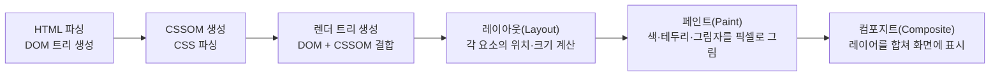

<Callout type="info">
  **이번 편의 결과물:** 코드 작성은 없습니다. DOM을 바꾸는 코드가 화면에 반영되기까지 브라우저가 거치는 단계를 정리하고, 13·14편에서 다룰 "메인 스레드를 비워야 하는 이유"의 근거를 마련합니다. · **다루는 개념:** HTML 파싱과 DOM 생성, 레이아웃·페인트·컴포지트, reflow와 repaint 비용
</Callout>

## 이 편에서 만드는 파일

(코드 없음) 04편부터 `notes-app` 프로젝트 폴더를 만듭니다.

## 개념 정리

### HTML 파싱부터 화면까지

브라우저는 서버에서 받은 HTML 문서를 아래 순서로 처리해 화면에 픽셀을 그립니다.



| 단계 | 하는 일 | 다시 실행되는 조건 |
|------|---------|---------------------|
| 파싱 | HTML을 읽어 DOM 트리 생성 | 최초 로드 시 한 번(이후 DOM 조작은 파싱을 다시 하지 않음) |
| 레이아웃(reflow) | 각 요소의 크기·위치 계산 | 요소 크기·위치에 영향을 주는 변경(`width`, `display`, 텍스트 추가 등) |
| 페인트(repaint) | 픽셀 색상 채우기 | 위치는 그대로고 겉모습만 바뀌는 변경(`color`, `background-color`) |
| 컴포지트 | 레이어를 합성해 화면 출력 | `transform`, `opacity`만 바뀌는 변경 |

### DOM을 바꾸면 무슨 일이 일어나는가

`element.textContent = "새 메모"`처럼 DOM을 바꾸는 자바스크립트 코드를 실행해도 화면이 즉시 다시 그려지지 않습니다. 브라우저는 한 프레임(보통 초당 60번, 약 16.7밀리초 간격) 동안 쌓인 변경 사항을 모아서 레이아웃·페인트를 한 번에 처리합니다. 이것이 04편부터 만들 `render.js`가 매번 `document.createElement`를 호출해도 화면이 버벅이지 않는 이유입니다.

문제는 자바스크립트 코드에서 **레이아웃 값을 읽는 것**(`element.offsetHeight`, `getBoundingClientRect()` 등)입니다. 이런 값을 읽으려면 브라우저가 그 시점까지 쌓인 변경 사항의 레이아웃을 강제로 즉시 계산해야 합니다. 이를 강제 동기 레이아웃(forced synchronous layout)이라고 부르며, DOM을 바꾸는 코드와 레이아웃 값을 읽는 코드를 번갈아 반복하면 프레임 하나 안에서 레이아웃이 여러 번 실행되어 느려집니다.

| 비용이 큰 순서 | 예 |
|----------------|-----|
| 레이아웃(reflow) | 부모 요소 크기 변경 → 자식 전체 위치 재계산 |
| 페인트(repaint) | 배경색·글자색 변경(위치는 그대로) |
| 컴포지트만 | `transform: translateX()`, `opacity` 변경(레이아웃·페인트 생략 가능) |

애니메이션을 만들 때 `left` 대신 `transform`을 쓰라는 조언이 흔한 이유가 여기 있습니다. `left`를 바꾸면 레이아웃부터 다시 계산하지만, `transform`은 레이아웃과 페인트를 건너뛰고 컴포지트 단계만 다시 실행할 수 있습니다.

### 메인 스레드와의 관계

레이아웃·페인트 계산 자체는 메인 스레드에서 일어납니다(컴포지트 일부만 별도 스레드가 처리). 01편에서 본 이벤트 루프의 콜 스택이 무거운 자바스크립트 계산으로 계속 채워져 있으면, 그동안 브라우저는 레이아웃·페인트를 실행할 틈이 없어 화면이 멈춘 것처럼 보입니다. 13편의 `ResizeObserver`, 14편의 `requestAnimationFrame`은 모두 "언제 레이아웃이 끝나고 다음 프레임이 그려지는 시점"에 맞춰 코드를 실행하기 위한 API입니다.

## 개발자 도구로 확인하기

<Steps>

### 1. Rendering 탭에서 페인트 영역 보기

개발자 도구에서 `Cmd/Ctrl+Shift+P`를 눌러 명령 메뉴를 열고 `Show Rendering`을 입력해 실행합니다. `Paint flashing`을 체크한 뒤 아무 페이지나 스크롤하거나 버튼을 눌러봅니다.

### 2. 다시 그려지는 영역 관찰

체크박스를 켠 상태에서 페이지의 일부만 바뀌는 동작(예: 버튼 hover, 텍스트 입력)을 해보면 실제로 다시 그려지는 영역이 초록색으로 깜빡입니다. 페이지 전체가 아니라 바뀐 부분만 깜빡이는 것을 확인합니다.

### 3. Performance 탭에서 레이아웃 기록하기

`Performance` 탭에서 녹화를 시작하고 텍스트 입력 상자에 빠르게 타이핑한 뒤 녹화를 멈춥니다. 타임라인에서 보라색(Layout)과 초록색(Paint) 구간이 반복되는 것을 확인합니다.

### 4. 콘솔에서 강제 동기 레이아웃 재현

```text
const el = document.body;
console.time("read");
for (let i = 0; i < 1000; i++) {
  el.style.width = (300 + i) + "px";
  el.offsetWidth; // 레이아웃 값을 즉시 읽음 → 매번 강제 레이아웃 발생
}
console.timeEnd("read");
```

</Steps>

## 확인

- `Paint flashing`을 켰을 때 페이지 전체가 아니라 실제로 바뀐 영역만 깜빡이는 것을 확인합니다.
- `Performance` 탭 타임라인에서 `Layout`, `Paint` 구간의 이름과 색을 구분할 수 있습니다.
- 콘솔의 `offsetWidth` 반복 읽기 예제가 눈에 띄게 오래 걸리는 것을 `console.time`/`console.timeEnd` 결과로 확인합니다.

## 직접 해보기

1. 위 콘솔 예제에서 `el.offsetWidth;` 줄을 지우고 다시 `console.time`으로 시간을 재봅니다. 읽기를 반복문 밖으로 빼면 얼마나 빨라지는지 비교해봅니다.
2. `Performance` 탭에서 CSS `transform`으로 움직이는 애니메이션과 `left`로 움직이는 애니메이션을 각각 녹화해 `Layout` 구간 발생 빈도를 비교해봅니다.

<details>
<summary>정답 보기</summary>

`offsetWidth` 읽기를 반복문 밖으로 빼면(예: 반복문이 끝난 뒤 한 번만 읽기) 강제 동기 레이아웃이 1000번이 아니라 1번만 일어나 훨씬 빨리 끝납니다. `transform` 애니메이션은 `Layout` 구간이 거의 없이 `Composite`만 반복되지만, `left` 애니메이션은 매 프레임 `Layout` 구간이 나타납니다.

</details>

## 자주 하는 실수

| 증상 | 원인 | 고치는 법 |
|------|------|-----------|
| 텍스트 입력마다 화면이 버벅인다 | 입력 이벤트마다 레이아웃 값을 읽고 바로 DOM을 바꾸는 것을 반복함 | 읽기와 쓰기를 분리하거나 값을 캐시한 뒤 한 번에 적용 |
| `color`만 바꿨는데도 느리다고 착각 | 레이아웃(reflow)과 페인트(repaint)를 구분하지 못함 | `color`·`background-color`는 페인트만 발생시키고, 레이아웃은 크기·위치 변경에서만 발생 |
| 애니메이션에 `left`, `top`을 사용 | `transform`이 레이아웃을 건너뛴다는 것을 모름 | 위치 이동 애니메이션은 `transform: translate()`로 대체 |

## 확인 문제

<Quiz
  questionNumber={1}
  question="브라우저 렌더링 파이프라인의 순서로 옳은 것은?"
  options={['페인트 → 레이아웃 → 파싱 → 컴포지트', '파싱 → 레이아웃 → 페인트 → 컴포지트', '컴포지트 → 파싱 → 페인트 → 레이아웃', '레이아웃 → 파싱 → 컴포지트 → 페인트']}
  correctAnswer={2}
  explanation="HTML을 파싱해 DOM을 만든 뒤, 레이아웃으로 위치·크기를 계산하고, 페인트로 픽셀을 채운 다음, 컴포지트로 레이어를 합쳐 화면에 표시합니다."
  optionExplanations={['순서가 뒤바뀌었습니다', '정답입니다', '파싱이 가장 먼저 일어나야 합니다', '레이아웃 전에 파싱이 먼저입니다']}
/>

<Quiz
  questionNumber={2}
  question="element.style.color만 바꿨을 때 발생하는 단계로 옳은 것은?"
  options={['레이아웃부터 다시 계산된다', '레이아웃은 건너뛰고 페인트부터 다시 실행된다', 'HTML 파싱이 다시 일어난다', '아무 단계도 실행되지 않는다']}
  correctAnswer={2}
  explanation="색상 변경은 요소의 크기·위치에 영향을 주지 않으므로 레이아웃은 건너뛰고 페인트 단계부터 다시 실행됩니다."
  optionExplanations={['위치·크기 변경이 없어 레이아웃은 필요 없습니다', '정답입니다', 'HTML 파싱은 최초 로드 시에만 일어납니다', '페인트 단계는 다시 실행됩니다']}
/>

<Quiz
  questionNumber={3}
  question="element.offsetWidth를 DOM 변경 직후 반복해서 읽을 때 발생하는 문제는?"
  options={['메모리 누수가 발생한다', '강제 동기 레이아웃이 매번 발생해 느려진다', '브라우저가 값을 캐시해 항상 빠르다', 'CSSOM이 손상된다']}
  correctAnswer={2}
  explanation="레이아웃 값을 읽으려면 그 시점까지의 변경 사항에 대해 즉시 레이아웃을 계산해야 하므로, DOM 변경과 값 읽기를 반복하면 강제 동기 레이아웃이 여러 번 발생합니다."
  optionExplanations={['메모리 누수와는 관련 없습니다', '정답입니다', '변경 직후 읽으면 캐시된 값이 아니라 즉시 재계산됩니다', 'CSSOM 손상과는 무관합니다']}
/>

<Quiz
  questionNumber={4}
  question="위치 이동 애니메이션에 left 대신 transform을 권장하는 이유는?"
  options={['transform은 레이아웃과 페인트를 건너뛰고 컴포지트만으로 처리할 수 있어서', 'left는 구형 브라우저에서 지원하지 않아서', 'transform이 더 짧은 코드라서', 'left는 CSSOM에 포함되지 않아서']}
  correctAnswer={1}
  explanation="transform 변경은 레이아웃 재계산 없이 컴포지트 단계에서 처리할 수 있어 애니메이션이 더 매끄럽습니다."
  optionExplanations={['정답입니다', '지원 여부 문제가 아닙니다', '코드 길이와는 무관합니다', 'left도 CSSOM에 포함되는 일반 속성입니다']}
/>

## 참고 자료

- [MDN - Populating the page: how browsers work](https://developer.mozilla.org/en-US/docs/Web/Performance/Guides/How_browsers_work)
- [web.dev - Rendering Performance](https://web.dev/articles/rendering-performance)
