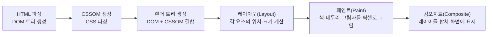

## 개념 정리

### HTML 파싱부터 화면까지

브라우저는 서버에서 받은 HTML 문서를 아래 순서로 처리해 화면에 픽셀을 그립니다.

```mermaid
graph LR
  A["HTML 파싱<br/>DOM 트리 생성"] --> B["CSSOM 생성<br/>CSS 파싱"]
  B --> C["렌더 트리 생성<br/>DOM + CSSOM 결합"]
  C --> D["레이아웃(Layout)<br/>각 요소의 위치·크기 계산"]
  D --> E["페인트(Paint)<br/>색·테두리·그림자를 픽셀로 그림"]
  E --> F["컴포지트(Composite)<br/>레이어를 합쳐 화면에 표시"]
```

| 단계 | 하는 일 | 다시 실행되는 조건 |
|------|---------|---------------------|
| 파싱 | HTML을 읽어 DOM 트리 생성 | 최초 로드 시 한 번(이후 DOM 조작은 파싱을 다시 하지 않음) |
| 레이아웃(reflow) | 각 요소의 크기·위치 계산 | 요소 크기·위치에 영향을 주는 변경(`width`, `display`, 텍스트 추가 등) |
| 페인트(repaint) | 픽셀 색상 채우기 | 위치는 그대로고 겉모습만 바뀌는 변경(`color`, `background-color`) |
| 컴포지트 | 레이어를 합성해 화면 출력 | `transform`, `opacity`만 바뀌는 변경 |

### DOM을 바꾸면 무슨 일이 일어나는가

`element.textContent = "새 메모"`처럼 DOM을 바꾸는 자바스크립트 코드를 실행해도 화면이 즉시 다시 그려지지 않습니다. 브라우저는 한 프레임(보통 초당 60번, 약 16.7밀리초 간격) 동안 쌓인 변경 사항을 모아서 레이아웃·페인트를 한 번에 처리합니다.

문제는 자바스크립트 코드에서 **레이아웃 값을 읽는 것**(`element.offsetHeight`, `getBoundingClientRect()` 등)입니다. 이런 값을 읽으려면 브라우저가 그 시점까지 쌓인 변경 사항의 레이아웃을 강제로 즉시 계산해야 합니다.

| 비용이 큰 순서 | 예 |
|----------------|-----|
| 레이아웃(reflow) | 부모 요소 크기 변경 → 자식 전체 위치 재계산 |
| 페인트(repaint) | 배경색·글자색 변경(위치는 그대로) |
| 컴포지트만 | `transform: translateX()`, `opacity` 변경(레이아웃·페인트 생략 가능) |

애니메이션을 만들 때 `left` 대신 `transform`을 쓰라는 조언이 흔한 이유가 여기 있습니다. `left`를 바꾸면 레이아웃부터 다시 계산하지만, `transform`은 레이아웃과 페인트를 건너뛰고 컴포지트 단계만 다시 실행할 수 있습니다.

### 메인 스레드와의 관계

레이아웃·페인트 계산 자체는 메인 스레드에서 일어납니다(컴포지트 일부만 별도 스레드가 처리). 01편에서 본 이벤트 루프의 콜 스택이 무거운 자바스크립트 계산으로 계속 채워져 있으면, 그동안 브라우저는 레이아웃·페인트를 실행할 틈이 없어 화면이 멈춘 것처럼 보입니다.

## 개발자 도구로 확인하기

## 자주 하는 실수

| 증상 | 원인 | 고치는 법 |
|------|------|-----------|
| 텍스트 입력마다 화면이 버벅인다 | 입력 이벤트마다 레이아웃 값을 읽고 바로 DOM을 바꾸는 것을 반복함 | 읽기와 쓰기를 분리하거나 값을 캐시한 뒤 한 번에 적용 |
| `color`만 바꿨는데도 느리다고 착각 | 레이아웃(reflow)과 페인트(repaint)를 구분하지 못함 | `color`·`background-color`는 페인트만 발생시키고, 레이아웃은 크기·위치 변경에서만 발생 |
| 애니메이션에 `left`, `top`을 사용 | `transform`이 레이아웃을 건너뛴다는 것을 모름 | 위치 이동 애니메이션은 `transform: translate()`로 대체 |

## 확인 문제

<Quiz
  questionNumber={1}
  question={"브라우저 렌더링 파이프라인의 순서로 옳은 것은?"}
  options={["페인트 → 레이아웃 → 파싱 → 컴포지트","파싱 → 레이아웃 → 페인트 → 컴포지트","컴포지트 → 파싱 → 페인트 → 레이아웃","레이아웃 → 파싱 → 컴포지트 → 페인트"]}
  correctAnswer={2}
  explanation={"HTML을 파싱해 DOM을 만든 뒤, 레이아웃으로 위치·크기를 계산하고, 페인트로 픽셀을 채운 다음, 컴포지트로 레이어를 합쳐 화면에 표시합니다."}
/>

<Quiz
  questionNumber={2}
  question={"element.style.color만 바꿨을 때 발생하는 단계로 옳은 것은?"}
  options={["레이아웃부터 다시 계산된다","레이아웃은 건너뛰고 페인트부터 다시 실행된다","HTML 파싱이 다시 일어난다","아무 단계도 실행되지 않는다"]}
  correctAnswer={2}
  explanation={"색상 변경은 요소의 크기·위치에 영향을 주지 않으므로 레이아웃은 건너뛰고 페인트 단계부터 다시 실행됩니다."}
/>

<Quiz
  questionNumber={3}
  question={"element.offsetWidth를 DOM 변경 직후 반복해서 읽을 때 발생하는 문제는?"}
  options={["메모리 누수가 발생한다","강제 동기 레이아웃이 매번 발생해 느려진다","브라우저가 값을 캐시해 항상 빠르다","CSSOM이 손상된다"]}
  correctAnswer={2}
  explanation={"레이아웃 값을 읽으려면 그 시점까지의 변경 사항에 대해 즉시 레이아웃을 계산해야 하므로, DOM 변경과 값 읽기를 반복하면 강제 동기 레이아웃이 여러 번 발생합니다."}
/>

## 참고 자료

- [MDN - Populating the page: how browsers work](https://developer.mozilla.org/en-US/docs/Web/Performance/Guides/How_browsers_work)
- [web.dev - Rendering Performance](https://web.dev/articles/rendering-performance)
