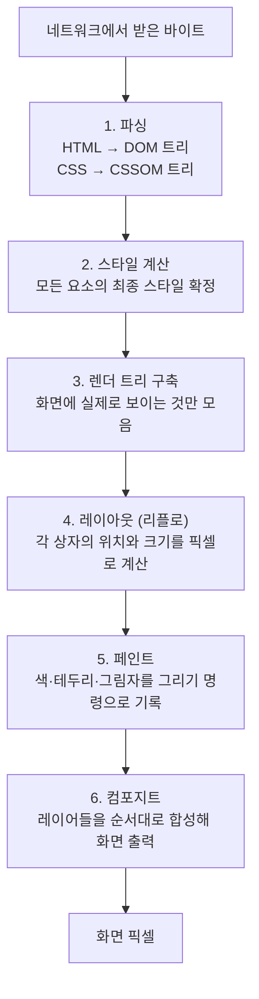
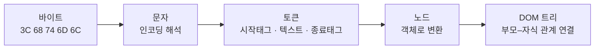
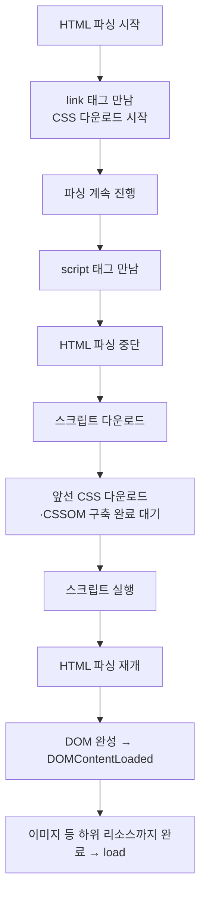
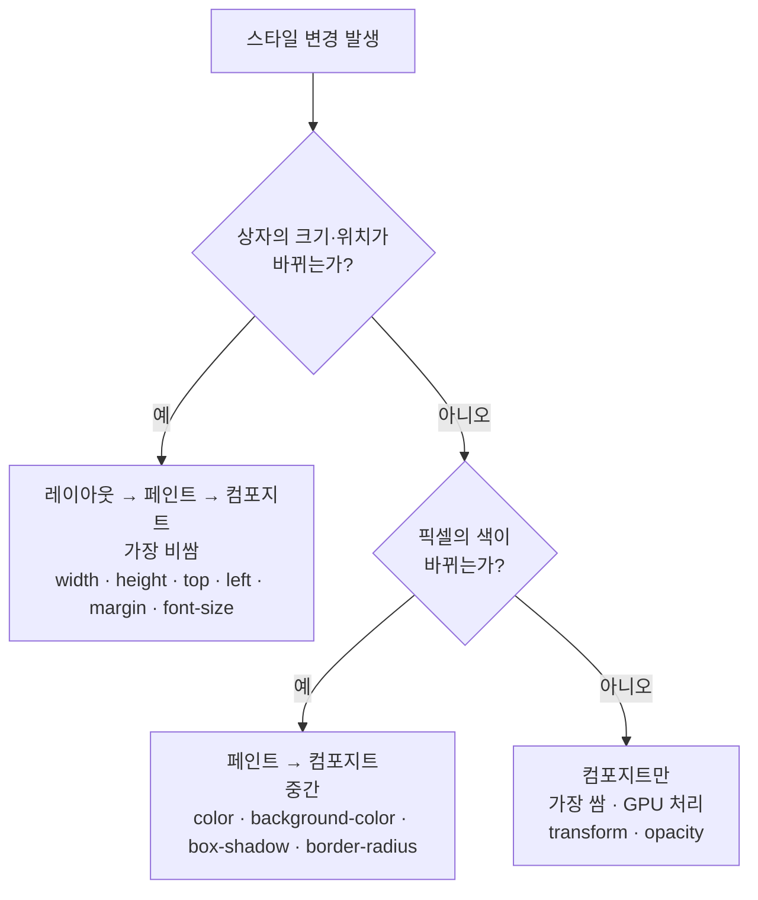
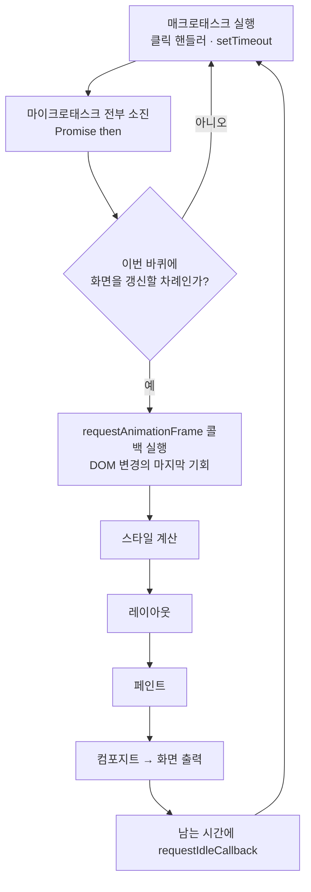

<Callout type="info">
  **이번 문서의 목표:** 이 문서를 다 읽으면 브라우저가 HTML 바이트를 화면 픽셀로 바꾸는 여섯 단계를 순서대로 설명하고, 내가 쓴 자바스크립트 한 줄이 그중 어느 단계를 다시 돌리는지 판단해 레이아웃 스래싱을 피할 수 있게 됩니다.
</Callout>

## 왜 파이프라인을 알아야 하는가

1편에서 이벤트 루프의 한 바퀴 끝에 "렌더링 기회"라는 단계가 있다고 했습니다. 이번 편은 그 상자를 열어봅니다.

이걸 알아야 하는 실용적인 이유는 명확합니다. 아래 두 줄은 겉보기에 거의 같지만, 하나는 다른 하나보다 수십 배 비쌉니다.

```js
요소.style.transform = "translateX(100px)";  // 마지막 단계만 다시 한다
요소.style.left = "100px";                   // 배치부터 전부 다시 한다
```

왜 그런지는 파이프라인을 알아야만 설명됩니다. 그리고 이 지식은 18편(rAF와 타이밍)과 23편(메인 스레드 비우기)의 전제이기도 합니다.

## 1. 전체 그림 — 여섯 단계

브라우저가 서버에서 받은 바이트 뭉치를 화면의 색깔 있는 점들로 바꾸는 과정을 **렌더링 파이프라인**(rendering pipeline, 화면 생성 공정)이라고 부릅니다. 파이프라인(pipeline)은 공장의 컨베이어 벨트처럼 **앞 단계의 결과가 뒷 단계의 입력이 되는 일렬 공정**을 뜻합니다.



> **쉽게 말하면:** 무대 공연 준비와 같습니다. 대본을 읽고(파싱), 배우별 의상을 정하고(스타일), 무대에 오를 사람만 추리고(렌더 트리), 각자 설 자리를 재고(레이아웃), 실제로 분장하고(페인트), 조명과 배경을 겹쳐 최종 장면을 만듭니다(컴포지트).

핵심 통찰 하나를 미리 못 박아 둡니다. **앞 단계를 다시 돌리면 뒤 단계도 전부 다시 돌아야 합니다.** 그래서 4단계를 건드리는 코드는 4·5·6을 모두 유발하고, 6단계만 건드리는 코드는 6만 유발합니다. 이것이 `left`와 `transform`의 비용 차이의 전부입니다.

## 2. 1단계 — 파싱과 DOM·CSSOM 생성

### 바이트에서 트리까지

네트워크는 그냥 숫자 뭉치를 보냅니다. 그것이 트리가 되기까지 네 번 모습을 바꿉니다.



- **인코딩**(encoding, 부호화 방식): 바이트를 문자로 읽는 규칙. `<meta charset="utf-8">`를 문서 앞쪽에 두라는 조언이 여기서 나옵니다. 늦게 알려주면 브라우저가 이미 읽은 부분을 버리고 다시 읽어야 합니다.
- **토큰화**(tokenization, 토막내기): 문자열을 의미 단위로 자릅니다. 시작 태그, 속성, 텍스트, 종료 태그 같은 조각들입니다.
- **트리 구축**: 토큰을 노드 객체로 만들고 부모–자식 관계로 엮습니다. 여는 태그를 만나면 자식으로 내려가고, 닫는 태그를 만나면 부모로 올라옵니다.

여기서 HTML 파서의 유명한 특성 하나. **HTML 파서는 절대 실패하지 않습니다.** 닫는 태그가 없어도, 태그가 엇갈려도, 브라우저는 스펙에 규정된 오류 복구 알고리즘으로 어떻게든 트리를 만들어 냅니다. XML이라면 에러 화면을 띄웠을 상황에서도 그렇습니다. 웹의 하위 호환성을 위한 선택인데, 부작용도 있습니다 — 내가 의도한 구조와 실제 DOM 구조가 다를 수 있습니다.

### CSSOM — 잊혀진 나머지 절반

**CSSOM**(CSS Object Model, CSS 객체 모델)은 스타일시트를 파싱해 만든 트리입니다. DOM과 나란히, 별도로 만들어집니다.

DOM과 결정적으로 다른 점이 있습니다. **CSS는 상속됩니다.** `body`에 `font-size: 16px`를 주면 후손 요소 대부분이 그 값을 물려받습니다. 그래서 어떤 요소의 최종 폰트 크기를 알려면 조상 사슬 전체가 확정되어야 하고, **CSSOM은 부분적으로 완성될 수 없습니다.** 스타일시트를 전부 읽기 전에는 어떤 요소의 스타일도 확정할 수 없습니다.

이 성질이 다음 절의 "렌더링 차단"의 원인입니다.

## 3. 렌더링을 막는 리소스

### CSS는 렌더링을 막는다

브라우저는 CSSOM이 완성되기 전에는 화면을 그리지 않습니다. 만약 그린다면, 스타일이 적용되지 않은 날것의 HTML이 잠깐 보였다가 갑자기 스타일이 입혀지는 현상 — **FOUC**(Flash of Unstyled Content, 스타일 없는 내용의 번쩍임) — 이 일어납니다. 그래서 CSS는 기본적으로 **렌더링 차단 리소스**(render-blocking resource)입니다.

완화하는 방법은 조건부 로딩입니다.

```html
<!-- 항상 렌더링을 막는다 -->
<link rel="stylesheet" href="main.css">

<!-- 인쇄할 때만 필요 → 화면 렌더링을 막지 않는다 -->
<link rel="stylesheet" href="print.css" media="print">

<!-- 넓은 화면에서만 필요 → 좁은 화면에서는 차단하지 않는다 -->
<link rel="stylesheet" href="wide.css" media="(min-width: 1024px)">
```

`media` 속성이 지금 상황에 해당하지 않으면, 브라우저는 그 파일을 여전히 내려받되 **렌더링을 기다리게 하지는 않습니다.**

### 스크립트는 파싱을 막는다

`<script>` 태그는 더 강력하게 막습니다. **HTML 파싱 자체를 멈춥니다.**

이유는 논리적입니다. 스크립트 안에 `document.write("<p>추가</p>")` 같은 코드가 있을 수 있고, 그러면 파서가 만들고 있던 트리가 통째로 달라집니다. 브라우저는 그 가능성 때문에 스크립트를 만나면 파싱을 멈추고, 파일을 받고, 실행하고, 그 다음에야 파싱을 재개합니다.

여기에 한 겹 더 있습니다. **스크립트는 그 앞의 CSSOM 완성을 기다립니다.** 스크립트가 `getComputedStyle`로 계산된 스타일을 물어볼 수 있기 때문에, 아직 스타일이 확정되지 않은 상태로 실행시킬 수 없습니다. 결과적으로 이런 사슬이 생깁니다.



`async`와 `defer` 속성이 이 사슬을 끊는 도구입니다.

| 속성 | 다운로드 | 실행 시점 | 파싱 차단 | 실행 순서 보장 |
|------|----------|-----------|-----------|----------------|
| 없음 | 즉시 | 즉시 | 차단함 | 문서 순서대로 |
| `defer` | 병렬 | 파싱 완료 후, DOMContentLoaded 직전 | 차단 안 함 | 문서 순서대로 |
| `async` | 병렬 | 다운로드 끝나는 즉시 | 차단 안 함 | 보장 없음 |
| `type="module"` | 병렬 | 기본이 defer와 동일 | 차단 안 함 | 문서 순서대로 |

<Callout type="warning">
  **자주 틀리는 점:** `async`를 "무조건 좋은 최적화"로 외우면 사고가 납니다. 실행 순서가 보장되지 않으므로, 라이브러리를 먼저 로드하고 그 라이브러리를 쓰는 코드를 나중에 실행해야 하는 경우 순서가 뒤집혀 참조 에러가 납니다. 서로 의존하는 스크립트에는 `defer`를 씁니다. 그리고 `async`·`defer` 둘 다 인라인 스크립트(파일이 아니라 태그 안에 직접 쓴 코드)에는 아무 효과가 없습니다.
</Callout>

### 두 이벤트의 차이

- **DOMContentLoaded**: HTML 파싱이 끝나고 DOM이 완성된 시점. 이미지·폰트는 아직 안 왔을 수 있습니다. DOM 조작을 시작하기에 적절한 시점입니다.
- **load**: 이미지·스타일시트·서브 프레임까지 모든 하위 리소스가 도착한 시점. 훨씬 늦습니다.

## 4. 2·3단계 — 스타일 계산과 렌더 트리

### 스타일 계산

DOM의 각 노드에 대해, CSSOM의 어떤 규칙들이 적용되는지 찾고 우선순위(명시도, specificity)와 상속을 반영해 **최종 스타일 값 하나**를 확정합니다. 이 결과를 **계산된 스타일**(computed style)이라고 하고, 자바스크립트에서는 `getComputedStyle(요소)`로 읽습니다.

`element.style.color`와 `getComputedStyle(element).color`는 전혀 다릅니다. 전자는 그 요소의 인라인 `style` 속성에 직접 쓰인 값만 보여주고(없으면 빈 문자열), 후자는 스타일시트·상속·기본값까지 전부 반영한 실제 값을 보여줍니다.

### 렌더 트리 — DOM과 다른 트리

**렌더 트리**(render tree)는 "실제로 화면에 그려질 것들"만 모은 별도의 트리입니다. DOM 트리와 1:1이 아닙니다.

| 대상 | DOM 트리 | 렌더 트리 |
|------|----------|-----------|
| 보통의 `div` | 있음 | 있음 |
| `head` 안의 내용 | 있음 | 없음 — 그려지지 않는다 |
| `display: none` 요소 | 있음 | 없음 — 상자를 만들지 않는다 |
| `visibility: hidden` 요소 | 있음 | 있음 — 자리는 차지한다 |
| `opacity: 0` 요소 | 있음 | 있음 — 자리도 차지하고 클릭도 된다 |
| `::before` 가상 요소 | 없음 | 있음 — CSS가 만든 상자 |

이 표가 실무 질문 하나를 정리해 줍니다. **`display: none`과 `visibility: hidden`은 왜 다른가?** 전자는 렌더 트리에서 빠져 레이아웃 계산 대상 자체가 아니고, 후자는 레이아웃에 참여해 자리를 차지한 채 그리기만 생략됩니다. 그래서 `display: none` 요소의 크기를 재면 전부 0이 나옵니다.

## 5. 4단계 — 레이아웃(리플로)

### 무엇을 계산하는가

**레이아웃**(layout, 배치)은 렌더 트리의 각 상자가 화면 어디에 얼마나 크게 놓이는지를 **실제 픽셀 값으로** 계산하는 단계입니다. 크롬 계열에서는 이 과정을 **리플로**(reflow, 재배치)라고도 부릅니다.

CSS에 `width: 50%`라고 적혀 있어도 그건 지시일 뿐입니다. 부모의 실제 너비가 정해져야 50퍼센트가 몇 픽셀인지 나옵니다. 그래서 레이아웃은 **트리를 위에서 아래로 훑으며 연쇄적으로** 계산되고, 이것이 비싼 이유입니다.

> **쉽게 말하면:** 레이아웃은 도면의 "벽 두께는 벽 사이 거리의 5퍼센트"라는 문구를 실제 줄자로 재서 "3.2센티미터"로 바꾸는 작업입니다. 앞의 치수가 바뀌면 뒤의 치수도 전부 다시 재야 합니다.

### 강제 동기 레이아웃 — 가장 흔한 성능 사고

브라우저는 스타일 변경을 모아뒀다가 렌더링 기회에 한꺼번에 처리하려 합니다. 그런데 자바스크립트가 **레이아웃 결과에 의존하는 값**을 물어보면, 브라우저는 어쩔 수 없이 그 자리에서 즉시 레이아웃을 돌려야 합니다. 이것을 **강제 동기 레이아웃**(forced synchronous layout) 또는 **레이아웃 스래싱**(layout thrashing, 레이아웃 두들겨패기)이라고 부릅니다.

레이아웃을 강제로 유발하는 대표적인 읽기 목록입니다.

| 분류 | 속성·메서드 |
|------|-------------|
| 크기·위치 | `offsetTop`, `offsetLeft`, `offsetWidth`, `offsetHeight` |
| 클라이언트 영역 | `clientTop`, `clientLeft`, `clientWidth`, `clientHeight` |
| 스크롤 | `scrollTop`, `scrollLeft`, `scrollWidth`, `scrollHeight` |
| 정밀 측정 | `getBoundingClientRect()`, `getClientRects()` |
| 계산된 스타일 | `getComputedStyle()` 의 상당수 속성 |
| 포커스 이동 | `focus()` |

문제는 **쓰기와 읽기를 번갈아 할 때** 터집니다.

<CodePlayground
  template="vanilla"
  activeFile="/index.js"
  showConsole
  label="레이아웃 스래싱을 직접 측정하기 — 두 버튼의 시간 차이를 보세요"
  files={{
    '/index.html': `<div id="app">
  <button id="나쁜방식">나쁜 방식: 읽기·쓰기 번갈아</button>
  <button id="좋은방식">좋은 방식: 읽기 모아서 → 쓰기 모아서</button>
  <p id="결과">버튼을 눌러 콘솔의 소요 시간을 비교하세요.</p>
  <div id="목록"></div>
</div>`,
    '/index.js': `const 목록 = document.getElementById("목록");
const 결과 = document.getElementById("결과");

// 측정 대상 상자 400개 생성
for (let i = 0; i < 400; i++) {
  const 상자 = document.createElement("div");
  상자.className = "상자";
  상자.style.height = "10px";
  상자.style.background = "#dde";
  상자.style.marginBottom = "1px";
  상자.textContent = "상자 " + i;
  목록.appendChild(상자);
}
const 상자들 = document.querySelectorAll(".상자");

// 나쁜 방식: 한 요소마다 [읽기 → 쓰기]를 반복
// 쓰기가 레이아웃을 무효화하고, 다음 읽기가 즉시 레이아웃을 강제한다
document.getElementById("나쁜방식").addEventListener("click", () => {
  const 시작 = performance.now();
  for (const 상자 of 상자들) {
    const 폭 = 상자.offsetWidth;        // 읽기 → 레이아웃 강제
    상자.style.width = (폭 - 1) + "px"; // 쓰기 → 레이아웃 무효화
  }
  const 걸린시간 = (performance.now() - 시작).toFixed(1);
  console.log("나쁜 방식: " + 걸린시간 + "ms");
  결과.textContent = "나쁜 방식 " + 걸린시간 + "ms";
});

// 좋은 방식: 모든 읽기를 먼저 끝내고, 그 다음 모든 쓰기를 한다
// 레이아웃은 최대 한 번만 돈다
document.getElementById("좋은방식").addEventListener("click", () => {
  const 시작 = performance.now();
  const 폭들 = [];
  for (const 상자 of 상자들) {
    폭들.push(상자.offsetWidth);        // 읽기만 모음
  }
  상자들.forEach((상자, i) => {
    상자.style.width = (폭들[i] - 1) + "px"; // 쓰기만 모음
  });
  const 걸린시간 = (performance.now() - 시작).toFixed(1);
  console.log("좋은 방식: " + 걸린시간 + "ms");
  결과.textContent = "좋은 방식 " + 걸린시간 + "ms";
});

console.log("두 버튼을 각각 눌러 소요 시간을 비교해 보세요.");`,
  }}
/>

두 방식의 코드가 하는 일은 **완전히 같습니다.** 순서만 다릅니다. 그런데 시간이 크게 차이 납니다. 원인은 이렇습니다.

- 나쁜 방식: 쓰기가 레이아웃을 "더러운(dirty) 상태"로 만들고, 바로 다음 반복의 읽기가 최신 값을 요구하므로 브라우저가 즉시 레이아웃을 돌립니다. 400번 반복이면 레이아웃이 400번 돕니다.
- 좋은 방식: 읽기 400번은 전부 같은 레이아웃 결과를 쓰므로 레이아웃은 한 번만 돌고, 쓰기 400번은 모여 있다가 다음 렌더링 기회에 한 번에 처리됩니다.

이 원칙을 **읽기–쓰기 분리**(read–write batching)라고 부릅니다. 23편에서 관측자·rAF와 결합한 실전 패턴으로 다시 다룹니다.

## 6. 5·6단계 — 페인트와 컴포지트

### 페인트

**페인트**(paint, 칠하기)는 각 상자를 실제로 어떻게 그릴지 — 배경색, 테두리, 그림자, 글자 — 를 **그리기 명령 목록**으로 만드는 단계입니다. 이때 요소들의 겹침 순서(stacking order, 쌓임 순서)가 반영됩니다.

색깔만 바꾸는 변경(`background-color`, `color`, `visibility`)은 상자의 위치·크기를 바꾸지 않으므로 레이아웃을 건너뛰고 페인트부터 다시 합니다. 이를 **리페인트**(repaint, 재도색)라고 합니다.

### 컴포지트 — 마지막이자 가장 싼 단계

브라우저는 페이지를 여러 장의 **레이어**(layer, 층)로 쪼개 각각 따로 그려두고, 마지막에 겹쳐 최종 화면을 만듭니다. 이 합성 과정이 **컴포지트**(composite, 합성)이며, 주로 **GPU**(Graphics Processing Unit, 그래픽 처리 장치)가 담당합니다.

레이어가 이미 그려져 있다면, 그 레이어를 옆으로 옮기거나 투명하게 만드는 것은 **다시 그릴 필요가 없습니다.** 이미 있는 그림을 다른 위치에 얹기만 하면 됩니다. 그래서 다음 두 속성은 특별합니다.

- `transform` — 이동, 회전, 확대
- `opacity` — 투명도

둘은 레이아웃도 페인트도 건드리지 않고 컴포지트만 다시 합니다. 게다가 컴포지트는 GPU에서 도니까 **메인 스레드가 자바스크립트로 바빠도 애니메이션이 계속 부드럽게 돕니다.** 애니메이션은 `transform`과 `opacity`로 하라는 조언의 진짜 이유가 이것입니다.

### 세 갈래 비용 비교



<Callout type="warning">
  **자주 틀리는 점:** "`transform`을 쓰면 무조건 GPU 가속"이라는 것도 반쪽 진실입니다. 브라우저가 그 요소를 별도 레이어로 승격(promote)시켜야 효과가 있는데, 레이어 하나마다 GPU 메모리를 먹습니다. `will-change: transform`을 수십 개 요소에 남발하면 메모리가 폭증하고 오히려 느려집니다. 애니메이션 직전에만 붙이고 끝나면 떼는 것이 정석입니다.
</Callout>

## 7. 파이프라인과 이벤트 루프의 만남

1편의 이벤트 루프 그림에 이번 편의 파이프라인을 끼워 넣으면 전체가 완성됩니다.



여기서 두 가지 결론이 나옵니다.

1. **자바스크립트가 오래 돌면 이 사이클 전체가 밀립니다.** 60프레임을 지키려면 한 바퀴가 약 16.7밀리초 안에 끝나야 하는데, 자바스크립트가 그 예산을 다 쓰면 화면 갱신이 통째로 늦어집니다.
2. **`requestAnimationFrame`이 애니메이션의 정확한 자리인 이유** — 스타일 계산 바로 직전에 실행되므로, 여기서 한 DOM 변경이 곧바로 이번 프레임에 반영됩니다. `setTimeout`으로 애니메이션을 돌리면 프레임 경계와 어긋나 어떤 프레임에는 두 번 반영되고 어떤 프레임에는 한 번도 반영되지 않는 떨림이 생깁니다. 18편에서 상세히 다룹니다.

## 핵심 정리

- 렌더링 파이프라인은 파싱 → 스타일 계산 → 렌더 트리 → 레이아웃 → 페인트 → 컴포지트의 여섯 단계이며, 앞 단계를 다시 돌리면 뒤 단계도 전부 다시 돈다.
- CSS는 렌더링을 막고, 스크립트는 HTML 파싱을 막으면서 앞선 CSSOM 완성까지 기다린다. `defer`는 순서를 지키며 차단을 풀고, `async`는 순서 보장이 없다.
- 렌더 트리는 DOM 트리와 다르다. `display: none`은 렌더 트리에서 빠지고, `visibility: hidden`은 남아 자리를 차지한다.
- `offsetWidth`·`getBoundingClientRect` 같은 값을 쓰기 사이사이에 읽으면 강제 동기 레이아웃이 발생한다. 읽기를 모으고 쓰기를 모으는 것만으로 큰 차이가 난다.
- `transform`과 `opacity`는 레이아웃·페인트를 건너뛰고 컴포지트만 다시 하므로 애니메이션에 적합하다. 단 레이어 승격에는 메모리 비용이 따른다.

## 마무리 복습

<Quiz
  questionNumber={1}
  question="렌더링 파이프라인의 단계 순서로 올바른 것은?"
  options={['레이아웃 → 파싱 → 페인트 → 컴포지트', '파싱 → 스타일 계산 → 레이아웃 → 페인트 → 컴포지트', '파싱 → 페인트 → 레이아웃 → 컴포지트', '스타일 계산 → 파싱 → 컴포지트 → 페인트']}
  correctAnswer={2}
  explanation="트리를 만들고, 스타일을 확정하고, 위치와 크기를 계산한 뒤, 그리기 명령을 만들고, 마지막에 레이어를 합성한다. 위치를 모르면 그릴 수 없으므로 레이아웃이 페인트보다 먼저다."
  optionExplanations={['파싱이 가장 먼저여야 한다', '정답 — 각 단계가 앞 단계의 결과를 입력으로 받는다', '위치를 모르는 상태에서 페인트할 수 없다', '파싱 없이는 스타일을 계산할 대상이 없다']}
/>

<Quiz
  questionNumber={2}
  question="script 태그에 defer를 붙였을 때의 동작으로 옳은 것은?"
  options={['다운로드가 끝나는 즉시 실행되며 순서 보장이 없다', 'HTML 파싱과 병렬로 다운로드되고, 파싱 완료 후 문서 순서대로 실행된다', 'HTML 파싱을 멈추고 즉시 실행된다', '인라인 스크립트에도 동일하게 적용된다']}
  correctAnswer={2}
  explanation="defer는 파싱을 막지 않으면서 문서에 나온 순서대로 파싱 완료 후 실행한다. 즉시 실행과 순서 미보장은 async의 특성이고, defer와 async 모두 인라인 스크립트에는 효과가 없다."
  optionExplanations={['그것은 async의 동작이다', '정답 — 차단 없음과 순서 보장을 동시에 얻는다', '아무 속성 없는 스크립트의 동작이다', '인라인 스크립트에는 두 속성 모두 무효다']}
/>

<Quiz
  questionNumber={3}
  question="display: none 과 visibility: hidden 의 차이로 옳은 것은?"
  options={['둘 다 렌더 트리에 남으며 차이가 없다', 'display: none 은 렌더 트리에서 제외되어 자리를 차지하지 않고, visibility: hidden 은 렌더 트리에 남아 자리를 차지한다', 'display: none 은 DOM 트리에서도 제거된다', 'visibility: hidden 요소는 크기를 재면 항상 0이 나온다']}
  correctAnswer={2}
  explanation="display: none은 렌더 트리에서 빠져 상자를 만들지 않으므로 레이아웃 대상이 아니고 크기가 0으로 나온다. visibility: hidden은 레이아웃에 참여해 자리를 차지한다. 둘 다 DOM 트리에는 그대로 남는다."
  optionExplanations={['렌더 트리 포함 여부가 다르다', '정답 — 렌더 트리 참여 여부가 핵심 차이다', 'DOM 트리에는 그대로 남아 있고 선택도 된다', '자리를 차지하므로 크기가 0이 아니다']}
/>

<Quiz
  questionNumber={4}
  question="다음 중 강제 동기 레이아웃(레이아웃 스래싱)을 유발할 가능성이 가장 큰 코드 패턴은?"
  options={['반복문 안에서 offsetWidth를 읽고 곧바로 style.width를 쓰는 것을 반복', '모든 요소의 offsetWidth를 배열에 모은 뒤 별도 반복문에서 width를 대입', 'transform 값만 바꾸는 애니메이션', 'DocumentFragment에 노드를 모아 마지막에 한 번 붙이기']}
  correctAnswer={1}
  explanation="쓰기가 레이아웃을 무효화한 직후 읽기가 최신 값을 요구하면 브라우저는 즉시 레이아웃을 다시 돌린다. 이 순환이 반복될 때 스래싱이 발생한다."
  optionExplanations={['정답 — 읽기와 쓰기가 번갈아 나오는 전형적인 패턴이다', '읽기와 쓰기를 분리했으므로 레이아웃이 최소화된다', 'transform은 컴포지트만 유발한다', '트리 밖에서 조립하므로 레이아웃이 반복되지 않는다']}
/>

<Quiz
  questionNumber={5}
  question="transform과 opacity로 애니메이션을 권장하는 이유로 가장 정확한 것은?"
  options={['CSS 문법이 더 짧기 때문', '레이아웃과 페인트를 건너뛰고 컴포지트 단계만 다시 하며 GPU에서 처리될 수 있기 때문', '자바스크립트로만 제어할 수 있기 때문', '모든 브라우저에서 자동으로 60프레임이 보장되기 때문']}
  correctAnswer={2}
  explanation="이미 그려진 레이어를 옮기거나 투명하게 하는 작업이므로 다시 그릴 필요가 없다. 메인 스레드가 바빠도 컴포지터 스레드에서 계속 진행될 수 있다."
  optionExplanations={['문법 길이와는 무관하다', '정답 — 파이프라인의 마지막 단계만 다시 돈다', 'CSS로도 제어할 수 있다', '레이어 승격 여부와 메모리 상황에 따라 달라진다']}
/>

<Quiz
  questionNumber={6}
  question="DOMContentLoaded 이벤트가 발생하는 시점으로 옳은 것은?"
  options={['HTML 파싱이 끝나 DOM이 완성된 시점, 이미지는 아직 도착하지 않았을 수 있다', '모든 이미지와 스타일시트까지 전부 로드된 시점', '첫 페인트가 화면에 나타난 시점', '서버로부터 첫 바이트를 받은 시점']}
  correctAnswer={1}
  explanation="DOMContentLoaded는 DOM 완성 시점이고, 이미지 등 하위 리소스까지 모두 끝난 시점은 load 이벤트다."
  optionExplanations={['정답 — DOM 완성 시점이며 하위 리소스는 별개다', '그것은 load 이벤트다', '페인트 시점과는 별개의 이벤트다', '첫 바이트 수신은 파싱 시작 시점에 가깝다']}
/>

<Quiz
  questionNumber={7}
  question="link 태그에 media 속성으로 print를 지정했을 때의 효과는?"
  options={['파일을 아예 다운로드하지 않는다', '다운로드는 하되 화면 렌더링을 차단하지 않는다', '화면에서도 스타일이 적용된다', 'HTML 파싱을 중단시킨다']}
  correctAnswer={2}
  explanation="media 조건이 현재 상황에 맞지 않으면 브라우저는 파일을 여전히 받되 렌더링 차단 대상에서 제외한다. 파싱을 멈추는 것은 스크립트의 특성이다."
  optionExplanations={['다운로드 자체는 진행된다', '정답 — 렌더링 차단만 면제된다', '인쇄 시에만 적용된다', '스타일시트는 파싱이 아니라 렌더링을 막는다']}
/>

## 참고 자료

- [MDN - Populating the page: how browsers work](https://developer.mozilla.org/en-US/docs/Web/Performance/Guides/How_browsers_work)
- [HTML Living Standard - Parsing HTML documents](https://html.spec.whatwg.org/multipage/parsing.html)
- [MDN - window.requestAnimationFrame](https://developer.mozilla.org/en-US/docs/Web/API/Window/requestAnimationFrame)
- [MDN - Web APIs](https://developer.mozilla.org/en-US/docs/Web/API)
