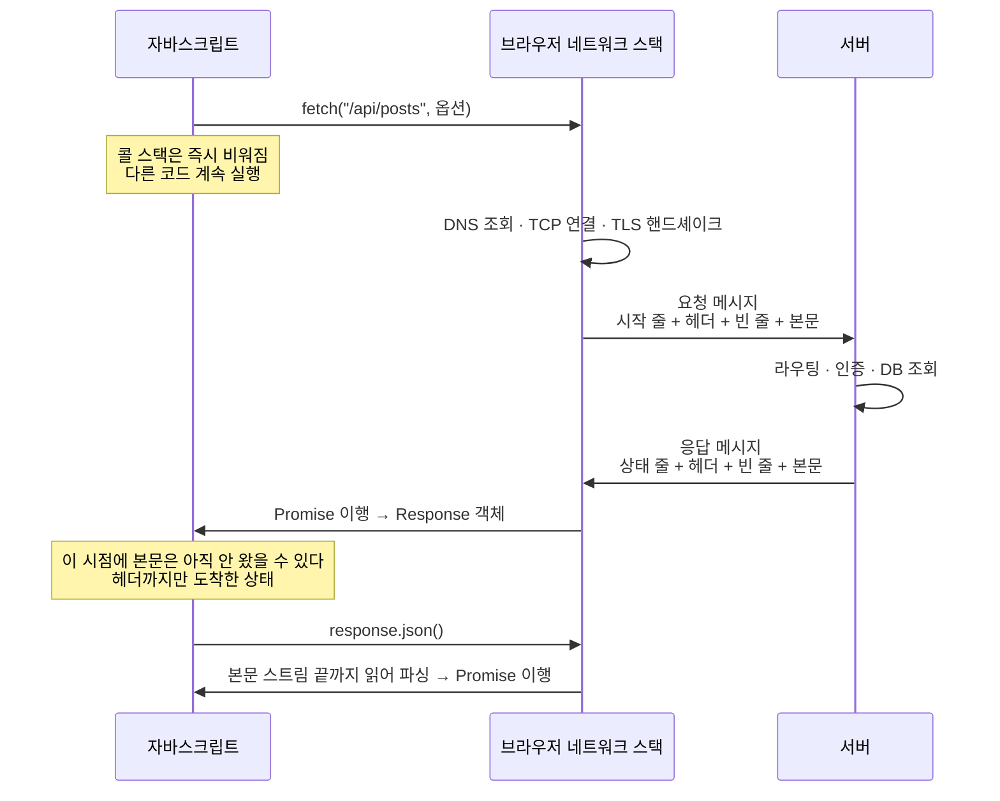
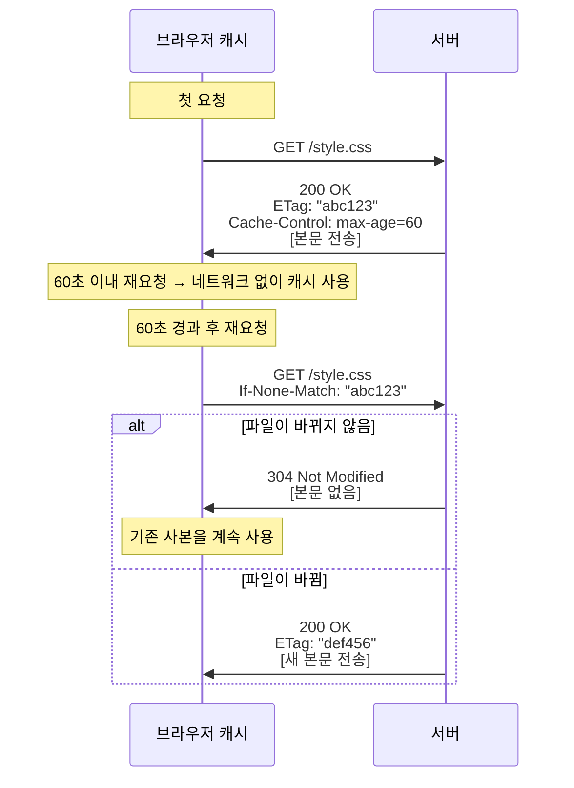
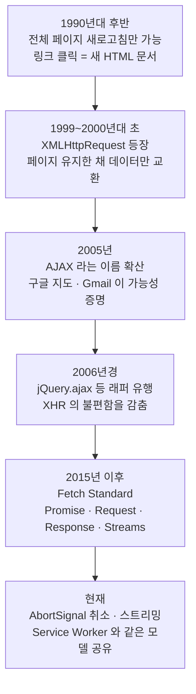

<Callout type="info">
  **이번 문서의 목표:** 이 문서를 다 읽으면 개발자 도구 네트워크 탭에 뜬 요청·응답을 한 줄씩 해독하고, 상태 코드와 캐시 헤더의 의미를 근거로 "이 요청이 왜 이렇게 동작했는지" 설명할 수 있게 됩니다.
</Callout>

## 왜 지금 HTTP인가

10편부터 `fetch`를 본격적으로 해부합니다. 그런데 `fetch`가 다루는 `Request`·`Response`·`Headers`는 전부 **HTTP라는 프로토콜의 개념을 자바스크립트 객체로 옮겨놓은 것**입니다. HTTP 메시지의 생김새를 모르면 `fetch`의 API는 그냥 외워야 할 이름 목록이 되고, CORS 에러 메시지는 해독 불가능한 주문이 됩니다.

반대로 HTTP 메시지 한 장을 읽을 줄 알면, `fetch`의 API가 "아, 이 헤더 줄을 객체로 만든 거구나"로 전부 자연스럽게 이해됩니다. 그래서 네트워크 편에 들어가기 전에 이 토대를 깝니다.

## 1. HTTP — 요청과 응답이라는 단 하나의 규칙

### 이름 뜯어보기

**HTTP**(HyperText Transfer Protocol, 하이퍼텍스트 전송 규약)는 단어 셋으로 되어 있습니다.

- **하이퍼텍스트**(hypertext): 다른 문서로 건너뛰는 링크를 품은 텍스트. 웹의 본래 목적이 문서 사이를 넘나드는 것이었음을 보여주는 이름입니다.
- **전송**(transfer): 그 문서를 옮긴다.
- **프로토콜**(protocol, 규약): 대화의 형식을 미리 정해둔 약속. 외교 의전에서 온 단어입니다.

핵심 성질 두 가지가 이름에는 안 드러나 있습니다.

- **요청–응답**(request–response) 구조: 반드시 클라이언트가 먼저 묻고, 서버가 답합니다. 서버가 먼저 말을 걸 수 없습니다. 그래서 실시간 알림을 위해 WebSocket 같은 별도 프로토콜이 필요합니다(12편).
- **무상태**(stateless, 상태 없음): 서버는 이전 요청을 기억하지 않습니다. 요청 하나하나가 독립적입니다. 그래서 "누구인지"를 매번 다시 알려야 하고, 그 수단이 쿠키(cookie)와 토큰입니다(13편).

> **쉽게 말하면:** HTTP는 편지 왕래입니다. 매번 겉봉에 주소와 신원을 다시 써야 하고, 우체국은 지난번에 무슨 편지가 오갔는지 기억하지 않습니다.

### 메시지의 실제 생김새

HTTP 메시지는 놀랍도록 단순한 텍스트 구조입니다. 요청 하나를 실물로 보겠습니다.

```http
POST /api/posts HTTP/1.1
Host: example.com
Content-Type: application/json
Accept: application/json
Authorization: Bearer eyJhbGciOi...
Content-Length: 46

{"title":"첫 글","body":"내용입니다"}
```

네 부분으로 나뉩니다.

| 부분 | 내용 | 설명 |
|------|------|------|
| 시작 줄 | `POST /api/posts HTTP/1.1` | 메서드 + 경로 + 버전 |
| 헤더들 | `Host:` 부터 `Content-Length:` 까지 | 이름과 값의 쌍이 한 줄씩 |
| 빈 줄 | (아무것도 없는 줄) | 헤더 끝을 알리는 구분선 |
| 본문 | JSON 문자열 | 실제 데이터. 없어도 된다 |

응답도 대칭입니다.

```http
HTTP/1.1 201 Created
Content-Type: application/json; charset=utf-8
Location: /api/posts/42
Cache-Control: no-store
Content-Length: 58

{"id":42,"title":"첫 글","body":"내용입니다"}
```

차이는 시작 줄뿐입니다. 요청은 "무엇을 해달라"(메서드 + 경로), 응답은 "어떻게 됐다"(상태 코드 + 설명)로 시작합니다.



이 그림의 마지막 두 단계가 `fetch`의 가장 유명한 함정을 설명합니다. **`fetch`가 이행되는 시점은 헤더가 도착한 때이지 본문이 다 온 때가 아닙니다.** 그래서 `.json()`이라는 두 번째 `await`가 필요합니다. 상세는 10·11편에서 다룹니다.

## 2. 메서드 — 의도를 이름으로 밝히기

### 자주 쓰는 메서드

| 메서드 | 의도 | 본문 | 안전 | 멱등 |
|--------|------|------|------|------|
| GET | 자원 조회 | 없음 | 예 | 예 |
| HEAD | 헤더만 조회 | 없음 | 예 | 예 |
| POST | 자원 생성·처리 요청 | 있음 | 아니오 | 아니오 |
| PUT | 자원 전체 교체 | 있음 | 아니오 | 예 |
| PATCH | 자원 일부 수정 | 있음 | 아니오 | 아니오 |
| DELETE | 자원 삭제 | 보통 없음 | 아니오 | 예 |
| OPTIONS | 지원 기능 질의 | 없음 | 예 | 예 |

두 개념을 정확히 잡고 갑니다.

- **안전**(safe, 안전함): 서버의 상태를 바꾸지 않는다는 뜻입니다. GET 요청은 몇 번을 보내도 데이터가 바뀌지 않아야 합니다. 브라우저·프록시·크롤러가 GET을 마음대로 미리 보내거나 캐시해도 되는 근거가 이것입니다.
- **멱등**(idempotent, 여러 번 해도 같음): 같은 요청을 여러 번 보내도 **최종 상태가 한 번 보낸 것과 같다**는 뜻입니다. 수학의 멱등원에서 온 말입니다.

$$
f(f(x)) = f(x)
$$

- $f$ : 요청을 한 번 적용하는 것
- $x$ : 서버의 상태

DELETE가 멱등인 이유를 보면 감이 옵니다. `DELETE /posts/42`를 세 번 보내면 첫 번째에 삭제되고 나머지는 "이미 없음"입니다. 최종 상태는 "42번 글이 없음"으로 동일합니다. 반면 `POST /posts`를 세 번 보내면 글이 세 개 생깁니다 — 멱등이 아닙니다.

<Callout type="warning">
  **자주 틀리는 점:** 멱등은 **응답이 같다**는 뜻이 아니라 **서버 상태가 같다**는 뜻입니다. DELETE를 두 번 보내면 첫 응답은 `204`, 두 번째는 `404`로 다를 수 있지만 여전히 멱등입니다. 또 하나 — 이 성질들은 스펙의 **약속**이지 강제가 아닙니다. GET 요청에서 데이터를 지우는 서버를 만들 수도 있습니다. 다만 그러면 브라우저가 GET을 미리 요청해버리는 순간 데이터가 날아갑니다. 실제로 과거에 이런 사고가 있었습니다.
</Callout>

## 3. 상태 코드 — 세 자리 숫자의 문법

### 첫 자리가 분류다

| 앞자리 | 부류 | 뜻 |
|--------|------|-----|
| 1xx | 정보 | 처리 중. 계속 진행하라 |
| 2xx | 성공 | 요청이 정상 처리됨 |
| 3xx | 리다이렉션 | 다른 곳으로 가라 |
| 4xx | 클라이언트 오류 | 보낸 쪽이 잘못했다 |
| 5xx | 서버 오류 | 받은 쪽이 잘못했다 |

4xx와 5xx의 구분이 실무에서 중요합니다. **4xx는 같은 요청을 다시 보내도 똑같이 실패**하므로 재시도가 무의미하고, **5xx는 서버가 잠깐 문제였을 수 있으므로 재시도할 가치**가 있습니다. 재시도 로직을 짤 때의 첫 번째 판단 기준입니다.

### 꼭 알아야 할 것들

| 코드 | 이름 | 언제 |
|------|------|------|
| 200 | OK | 일반 성공 |
| 201 | Created | 생성됨. `Location` 헤더에 새 자원 주소 |
| 204 | No Content | 성공했고 본문이 없음. DELETE 응답에 흔함 |
| 206 | Partial Content | 범위 요청의 일부 응답. 동영상 탐색·이어받기 |
| 301 | Moved Permanently | 영구 이동. 브라우저가 기억한다 |
| 302 | Found | 임시 이동 |
| 304 | Not Modified | 안 바뀜. 캐시된 것을 쓰라. **본문이 없다** |
| 400 | Bad Request | 요청 형식이 잘못됨 |
| 401 | Unauthorized | **인증** 실패. 사실 이름이 잘못 붙었다 |
| 403 | Forbidden | **인가** 실패. 누군지는 알지만 권한이 없다 |
| 404 | Not Found | 자원이 없음 |
| 409 | Conflict | 현재 상태와 충돌. 중복 등록 등 |
| 413 | Content Too Large | 본문이 너무 큼 |
| 429 | Too Many Requests | 요청 과다. `Retry-After` 헤더 확인 |
| 500 | Internal Server Error | 서버 내부 오류 |
| 502 | Bad Gateway | 앞단 서버가 뒷단에서 잘못된 응답을 받음 |
| 503 | Service Unavailable | 일시적 과부하·점검 |
| 504 | Gateway Timeout | 뒷단 서버 응답 시간 초과 |

401과 403의 차이는 자주 헷갈립니다.

- **인증**(authentication, 너 누구야): 신원 확인. 실패하면 401. "로그인부터 하세요."
- **인가**(authorization, 너 그거 해도 돼): 권한 확인. 실패하면 403. "로그인은 됐는데, 당신은 관리자가 아닙니다."

<Callout type="warning">
  **자주 틀리는 점:** `fetch`는 **404나 500을 에러로 보지 않습니다.** 서버가 응답을 제대로 돌려준 이상 네트워크 통신은 성공한 것이므로 프로미스가 정상 이행됩니다. 거부(reject)되는 것은 네트워크 자체가 실패했을 때(연결 불가, CORS 차단, 요청 취소)뿐입니다. 그래서 `response.ok`(상태 코드가 200번대인지)를 직접 확인해야 합니다. `axios` 같은 라이브러리에서 옮겨온 사람이 가장 먼저 부딪히는 벽입니다.
</Callout>

<CodePlayground
  template="vanilla"
  activeFile="/index.js"
  showConsole
  label="상태 코드와 헤더를 실제 요청으로 확인하기 — 버튼을 눌러보세요"
  files={{
    '/index.html': `<div id="app">
  <button id="성공">200 성공 요청</button>
  <button id="실패">404 응답 받기</button>
  <button id="헤더">응답 헤더 전부 출력</button>
  <p id="결과">버튼을 눌러 콘솔을 확인하세요.</p>
</div>`,
    '/index.js': `const 결과 = document.getElementById("결과");
const 기준주소 = "https://jsonplaceholder.typicode.com";

// (1) 정상 응답
document.getElementById("성공").addEventListener("click", async () => {
  const 응답 = await fetch(기준주소 + "/posts/1");
  console.log("status:", 응답.status);        // 200
  console.log("ok:", 응답.ok);                // true
  console.log("statusText:", 응답.statusText);
  const 데이터 = await 응답.json();           // 본문은 두 번째 await
  console.log("본문 제목:", 데이터.title);
  결과.textContent = "200 성공 — 콘솔 확인";
});

// (2) 404 — fetch는 거부되지 않는다는 사실을 눈으로 확인
document.getElementById("실패").addEventListener("click", async () => {
  try {
    const 응답 = await fetch(기준주소 + "/posts/99999999");
    console.log("catch로 가지 않았다! status:", 응답.status); // 404
    console.log("ok:", 응답.ok);                              // false
    if (!응답.ok) {
      console.log("→ 그래서 ok 를 직접 검사해야 한다");
      throw new Error("HTTP " + 응답.status);
    }
  } catch (에러) {
    console.log("직접 던진 에러를 잡음:", 에러.message);
  }
  결과.textContent = "404를 받았지만 fetch는 거부되지 않았다";
});

// (3) 헤더 순회 — Headers 는 이터러블이다
document.getElementById("헤더").addEventListener("click", async () => {
  const 응답 = await fetch(기준주소 + "/posts/1");
  console.log("--- 응답 헤더 목록 ---");
  for (const [이름, 값] of 응답.headers.entries()) {
    console.log(이름 + ": " + 값);
  }
  // 대소문자를 구분하지 않는다 — HTTP 헤더 이름의 규칙 그대로
  console.log("content-type:", 응답.headers.get("content-type"));
  console.log("Content-Type:", 응답.headers.get("Content-Type"));
  console.log("있나?", 응답.headers.has("content-type"));
  결과.textContent = "헤더 목록 출력 완료 — 콘솔 확인";
});

console.log("교차 출처 요청이므로 CORS 정책이 적용됩니다. 10편에서 자세히 다룹니다.");`,
  }}
/>

헤더 순회 결과에서 눈여겨볼 점: **목록에 나오는 헤더가 실제 응답보다 적습니다.** 교차 출처 요청에서는 서버가 `Access-Control-Expose-Headers`로 명시적으로 허락한 헤더만 자바스크립트가 읽을 수 있습니다. 개발자 도구에서는 보이는데 코드에서는 `null`이 나오는 현상의 원인입니다.

## 4. 헤더 — 메시지에 붙는 메타데이터

### 성격별 분류

| 분류 | 대표 헤더 | 역할 |
|------|-----------|------|
| 표현 | `Content-Type`, `Content-Length`, `Content-Encoding` | 본문의 형식·길이·압축 방식 |
| 협상 | `Accept`, `Accept-Language`, `Accept-Encoding` | 클라이언트가 선호하는 형식 |
| 인증 | `Authorization`, `WWW-Authenticate` | 신원 증명 |
| 상태 | `Cookie`, `Set-Cookie` | 무상태 프로토콜에 상태를 얹는 수단 |
| 캐시 | `Cache-Control`, `ETag`, `Last-Modified` | 재사용 정책 |
| 보안 | `Content-Security-Policy`, `Strict-Transport-Security` | 브라우저에 지시하는 보안 규칙 |
| CORS | `Access-Control-Allow-Origin` 등 | 교차 출처 허용 범위 |

**콘텐츠 협상**(content negotiation, 내용 협상)이라는 개념이 재미있습니다. 클라이언트가 `Accept: application/json`이라고 "이런 형식을 선호한다"고 말하면, 서버가 가능한 범위에서 맞춰 줍니다. 같은 주소가 요청 헤더에 따라 JSON도 되고 HTML도 될 수 있습니다.

### 헤더 이름은 대소문자를 구분하지 않는다

HTTP 스펙이 헤더 이름을 대소문자 무시로 규정하기 때문에, `fetch`의 `Headers` 객체도 그 규칙을 따릅니다. `get("content-type")`과 `get("Content-Type")`이 같은 값을 돌려줍니다. 위 실습기에서 확인한 그대로입니다.

## 5. 캐시 — 다시 안 물어보는 기술

### 두 가지 방식

캐시(cache, 임시 보관소)는 두 가지 전략이 있고, 이름이 헷갈리니 구분해서 잡습니다.

**첫째, 강한 캐시** — 아예 물어보지 않는다

서버가 `Cache-Control: max-age=3600`이라고 답하면, 브라우저는 1시간(3600초) 동안 그 자원을 **네트워크 요청 없이** 로컬 사본에서 꺼내 씁니다. 개발자 도구에는 `(from disk cache)` 또는 `(from memory cache)`로 표시되고, 서버는 요청이 온 사실조차 모릅니다.

**둘째, 조건부 요청** — 물어보되 안 바뀌었으면 본문을 안 받는다

캐시 기한이 지나면 브라우저는 "내가 가진 게 아직 유효한가?"만 묻습니다.



- **ETag**(Entity Tag, 개체 태그): 파일 내용의 지문 같은 문자열. 내용이 바뀌면 값이 바뀝니다. 요청 시 `If-None-Match`로 되돌려 보냅니다.
- **Last-Modified**: 마지막 수정 시각. 요청 시 `If-Modified-Since`로 되돌려 보냅니다. 초 단위 정밀도라 ETag보다 정확도가 낮습니다.

`304` 응답의 핵심 이익은 **본문이 오지 않는다**는 것입니다. 헤더 몇 줄만 오가므로 대역폭이 크게 절약됩니다.

### Cache-Control 지시어

| 지시어 | 의미 |
|--------|------|
| `max-age=N` | N초 동안 재검증 없이 사용 가능 |
| `no-cache` | 캐시는 하되 **매번 재검증**하고 써라 |
| `no-store` | 저장 자체를 하지 마라. 민감 정보용 |
| `must-revalidate` | 기한이 지나면 반드시 재검증. 오래된 사본 사용 금지 |
| `public` | 프록시 등 공유 캐시도 저장 가능 |
| `private` | 브라우저만 저장. 공유 캐시 금지 |
| `immutable` | 기한 내에는 재검증 시도조차 하지 마라 |

<Callout type="warning">
  **자주 틀리는 점:** `no-cache`는 "캐시하지 마라"가 아닙니다. **캐시는 하되 쓰기 전에 서버에 물어보라**는 뜻입니다. 저장 자체를 막는 것은 `no-store`입니다. 이름이 직관과 반대라 실수가 잦습니다.
</Callout>

이 캐시 모델은 14편에서 Cache Storage API와 나란히 다시 등장합니다. 두 캐시는 **완전히 별개**입니다. HTTP 캐시는 브라우저가 자동으로 관리하고, Cache Storage는 자바스크립트가 명시적으로 넣고 빼는 저장소입니다.

## 6. REST — 주소가 명사, 메서드가 동사

### 자원 중심이라는 발상

**REST**(REpresentational State Transfer, 표현 상태 전이)는 프로토콜이 아니라 **설계 스타일**입니다. 이름이 난해한데, 핵심 아이디어는 의외로 단순합니다.

> **쉽게 말하면:** 주소는 "무엇"만 가리키는 명사로 쓰고, "무엇을 할지"는 HTTP 메서드라는 동사로 표현하라.

같은 기능을 두 방식으로 설계해 비교해 봅니다.

| 하는 일 | 비REST 스타일 | REST 스타일 |
|---------|---------------|-------------|
| 글 목록 | `GET /getPosts` | `GET /posts` |
| 글 하나 | `GET /getPost?id=42` | `GET /posts/42` |
| 글 작성 | `POST /createPost` | `POST /posts` |
| 글 수정 | `POST /updatePost` | `PUT /posts/42` |
| 글 삭제 | `POST /deletePost?id=42` | `DELETE /posts/42` |
| 글의 댓글 | `GET /getComments?postId=42` | `GET /posts/42/comments` |

오른쪽의 이점이 보입니다. 주소가 **자원의 계층 구조**를 그대로 드러내고, 동사가 메서드로 빠지면서 주소 개수가 줄어듭니다. 무엇보다 GET이 안전·멱등이라는 약속을 지키므로 브라우저와 프록시의 캐시가 자동으로 동작합니다. 왼쪽 방식은 모든 것이 POST라 캐시 이점을 전부 포기합니다.

### 제약 조건들

REST를 제안한 논문은 여섯 가지 제약을 걸었습니다. 그중 실무에 직접 와닿는 것들입니다.

| 제약 | 뜻 | 실제 영향 |
|------|-----|-----------|
| 클라이언트–서버 분리 | 역할을 나눈다 | 프런트와 백엔드를 독립적으로 배포 |
| 무상태 | 서버가 대화 맥락을 안 가진다 | 서버를 여러 대로 늘리기 쉬움 |
| 캐시 가능 | 응답이 캐시 가능함을 명시 | GET에 캐시 헤더를 붙일 수 있음 |
| 균일한 인터페이스 | 자원 식별·표현·메서드 규칙 통일 | 새 API를 봐도 규칙을 짐작 가능 |
| 계층 구조 | 중간에 프록시·게이트웨이 삽입 가능 | CDN, 로드 밸런서 도입이 자연스러움 |

여기서 **무상태**가 왜 그렇게 강조되는지 짚고 갑니다. 서버가 "지금 이 사용자는 3단계까지 진행했다"는 정보를 메모리에 들고 있으면, 다음 요청이 다른 서버로 가는 순간 맥락이 사라집니다. 서버를 늘릴 수 없게 되는 것입니다. 그래서 필요한 상태는 클라이언트가 매 요청에 들고 오거나(토큰), 모든 서버가 공유하는 저장소에 둡니다.

### 자원 표현

REST의 R은 **표현**(representation)입니다. 서버 안의 데이터베이스 행 자체를 주고받는 게 아니라, 그것을 JSON이나 XML 같은 **형식으로 표현한 사본**을 주고받는다는 의미입니다. 같은 자원 `/posts/42`가 요청 헤더에 따라 JSON으로도, HTML로도 표현될 수 있는 것이 이 개념 덕분입니다.

## 7. XHR에서 fetch까지 — 왜 새 API가 필요했나

### 시대순 정리



**AJAX**(Asynchronous JavaScript And XML, 비동기 자바스크립트와 XML)라는 이름은 이제 반쯤 거짓말입니다. XML 대신 JSON을 쓰니까요. 하지만 이름이 가리키던 발상 — **페이지를 새로 고치지 않고 데이터만 주고받는다** — 은 오늘날 모든 웹 앱의 기본 전제가 되었습니다.

### 두 API의 실제 차이

| 항목 | XMLHttpRequest | fetch |
|------|----------------|-------|
| 결과 수신 | 이벤트 핸들러 등록 | 프로미스 반환 |
| 코드 흐름 | 콜백 중첩 | `await`로 평탄하게 |
| 요청·응답 표현 | 별도 객체 없음 | `Request`·`Response`·`Headers` 객체 |
| 취소 | `xhr.abort()` | `AbortSignal` — 다른 API와 공통 |
| 스트리밍 | 부분 텍스트 접근 정도 | `ReadableStream`으로 본문 조각 처리 |
| 업로드 진행률 | `upload.onprogress` 지원 | 표준 방식이 아직 제한적 |
| Service Worker 연동 | 불가 | 같은 `Request`·`Response` 모델 공유 |

`fetch`가 XHR을 완전히 대체하지 못한 유일한 실무 영역이 **업로드 진행률**입니다. 대용량 파일 업로드에 퍼센트 표시가 꼭 필요하면 여전히 XHR을 쓰는 경우가 있습니다.

가장 중요한 마지막 줄에 주목하세요. `fetch`가 도입한 `Request`·`Response` 객체는 **Service Worker가 네트워크를 가로챌 때 다루는 바로 그 객체**이고, Cache Storage에 저장하는 것도 바로 그 객체입니다. 즉 `fetch`는 단순히 "XHR의 예쁜 버전"이 아니라, 네트워크·캐시·오프라인을 하나의 공통 모델로 묶기 위한 기반이었습니다. 이 이야기는 10·14·20편으로 이어집니다.

## 핵심 정리

- HTTP 메시지는 시작 줄, 헤더들, 빈 줄, 본문의 네 부분으로 된 텍스트 구조다. `fetch`의 `Request`·`Response`·`Headers`는 이 구조를 객체로 옮긴 것이다.
- 안전은 서버 상태를 바꾸지 않음을, 멱등은 여러 번 보내도 최종 상태가 같음을 뜻한다. GET을 캐시하고 미리 요청해도 되는 근거가 이 약속이다.
- 4xx는 재시도해도 같고 5xx는 재시도할 가치가 있다. `fetch`는 404·500을 거부하지 않으므로 `response.ok`를 직접 검사해야 한다.
- 캐시는 강한 캐시(`max-age`로 아예 안 물어봄)와 조건부 요청(`ETag`·`Last-Modified`로 묻되 `304`면 본문 생략)의 두 축이다. `no-cache`는 저장 금지가 아니라 매번 재검증하라는 뜻이다.
- REST는 주소를 자원 명사로, 동작을 HTTP 메서드 동사로 표현하는 설계 스타일이며, 무상태 제약이 서버 확장을 가능하게 한다.
- `fetch`는 XHR의 문법 개선이 아니라, 네트워크·캐시·Service Worker가 공유할 공통 요청·응답 모델을 세우기 위한 재설계였다.

## 마무리 복습

<Quiz
  questionNumber={1}
  question="HTTP 요청 메시지의 구성 순서로 올바른 것은?"
  options={['헤더 → 시작 줄 → 본문 → 빈 줄', '시작 줄 → 헤더 → 빈 줄 → 본문', '본문 → 헤더 → 시작 줄', '시작 줄 → 본문 → 헤더']}
  correctAnswer={2}
  explanation="메서드와 경로가 담긴 시작 줄이 먼저 오고, 헤더가 이어지며, 빈 줄로 헤더의 끝을 알린 뒤 본문이 온다."
  optionExplanations={['시작 줄이 가장 앞에 와야 한다', '정답 — 빈 줄이 헤더와 본문의 경계다', '본문이 먼저 올 수 없다', '헤더가 본문보다 앞에 와야 한다']}
/>

<Quiz
  questionNumber={2}
  question="멱등(idempotent)한 메서드에 해당하지 않는 것은?"
  options={['GET', 'PUT', 'DELETE', 'POST']}
  correctAnswer={4}
  explanation="POST를 세 번 보내면 자원이 세 개 생기므로 최종 상태가 달라진다. GET은 상태를 바꾸지 않고, PUT은 같은 값으로 덮어쓰며, DELETE는 이미 없는 것을 지워도 결과가 같다."
  optionExplanations={['조회만 하므로 상태가 변하지 않는다', '같은 내용으로 여러 번 교체해도 결과가 같다', '두 번째부터는 이미 없는 상태로 동일하다', '정답 — 호출 횟수만큼 자원이 늘어난다']}
/>

<Quiz
  questionNumber={3}
  question="fetch로 요청했는데 서버가 500을 응답했다. 이때의 동작으로 옳은 것은?"
  options={['프로미스가 거부되어 catch 블록으로 간다', '프로미스가 정상 이행되고 response.ok가 false다', '자동으로 세 번 재시도한다', '예외가 발생해 스크립트 실행이 중단된다']}
  correctAnswer={2}
  explanation="fetch는 서버가 응답을 돌려준 이상 통신 성공으로 본다. 거부되는 것은 연결 실패, CORS 차단, 요청 취소 같은 네트워크 수준 실패뿐이다."
  optionExplanations={['네트워크 수준 실패가 아니므로 거부되지 않는다', '정답 — status는 500이고 ok는 false다', '자동 재시도 기능은 없다', '예외가 발생하지 않는다']}
/>

<Quiz
  questionNumber={4}
  question="Cache-Control의 no-cache 지시어의 의미로 옳은 것은?"
  options={['응답을 저장 자체를 하지 말라는 뜻', '저장은 하되 사용하기 전에 서버에 유효한지 매번 확인하라는 뜻', '캐시를 영원히 사용하라는 뜻', '프록시 서버만 캐시하라는 뜻']}
  correctAnswer={2}
  explanation="저장 자체를 금지하는 것은 no-store다. no-cache는 저장하되 사용 전 재검증을 요구한다."
  optionExplanations={['그것은 no-store의 의미다', '정답 — 이름과 달리 저장은 허용되고 재검증만 강제된다', 'immutable에 가까운 설명이다', '공유 캐시 허용은 public 지시어가 담당한다']}
/>

<Quiz
  questionNumber={5}
  question="상태 코드 304 Not Modified 응답의 특징으로 옳은 것은?"
  options={['본문이 포함되어 새 내용을 전달한다', '본문 없이 헤더만 오며 브라우저는 기존 캐시 사본을 사용한다', '자원이 영구히 삭제되었음을 뜻한다', '인증이 필요함을 알린다']}
  correctAnswer={2}
  explanation="304의 이점은 본문을 전송하지 않는 것이다. 브라우저는 이미 가진 사본을 그대로 사용한다."
  optionExplanations={['본문을 보내지 않는 것이 304의 핵심 이점이다', '정답 — 헤더만 오가므로 대역폭이 절약된다', '삭제와는 무관한 캐시 관련 코드다', '인증 관련은 401이다']}
/>

<Quiz
  questionNumber={6}
  question="401과 403의 차이로 알맞은 것은?"
  options={['401은 인증 실패, 403은 인증은 되었으나 권한이 없음', '401은 서버 오류, 403은 클라이언트 오류', '401은 자원 없음, 403은 요청 형식 오류', '둘은 완전히 같은 의미다']}
  correctAnswer={1}
  explanation="401은 신원 확인 실패이므로 로그인이 필요하다는 신호이고, 403은 신원은 확인되었지만 그 작업을 할 권한이 없다는 뜻이다."
  optionExplanations={['정답 — 인증과 인가의 구분이다', '둘 다 4xx 클라이언트 오류 계열이다', '자원 없음은 404, 형식 오류는 400이다', '의미가 명확히 다르다']}
/>

<Quiz
  questionNumber={7}
  question="REST 스타일의 API 설계로 가장 적절한 것은?"
  options={['POST /deletePost?id=42', 'DELETE /posts/42', 'GET /removePost/42', 'POST /posts/42/delete']}
  correctAnswer={2}
  explanation="REST는 주소를 자원 명사로, 동작을 HTTP 메서드로 표현한다. 삭제 동작은 DELETE 메서드가 담당하고 주소에는 동사를 넣지 않는다."
  optionExplanations={['주소에 동사가 들어가 있고 메서드가 의도와 다르다', '정답 — 명사 주소와 동사 메서드의 조합이다', 'GET은 안전해야 하므로 삭제에 쓰면 안 된다', '주소에 동사가 남아 있다']}
/>

<Quiz
  questionNumber={8}
  question="fetch가 XMLHttpRequest 대비 가지는 구조적 이점으로 보기 어려운 것은?"
  options={['Request와 Response를 독립 객체로 다룰 수 있다', 'AbortSignal이라는 공통 취소 메커니즘을 쓴다', '업로드 진행률을 표준적으로 더 잘 보고한다', 'Service Worker와 동일한 요청·응답 모델을 공유한다']}
  correctAnswer={3}
  explanation="업로드 진행률은 오히려 XHR의 upload.onprogress가 더 성숙한 영역이라, 이것 때문에 여전히 XHR을 쓰는 경우가 있다."
  optionExplanations={['Cache Storage에 그대로 저장할 수 있는 근거가 된다', '타이머·이벤트 리스너와도 같은 방식으로 취소된다', '정답 — 이 영역은 XHR이 더 낫다', 'fetch 이벤트에서 같은 객체를 다룬다']}
/>

## 참고 자료

- [MDN - HTTP](https://developer.mozilla.org/en-US/docs/Web/HTTP)
- [MDN - REST 용어 정리](https://developer.mozilla.org/en-US/docs/Glossary/REST)
- [MDN - Fetch API](https://developer.mozilla.org/en-US/docs/Web/API/Fetch_API)
- [Fetch Standard](https://fetch.spec.whatwg.org/)
- [MDN - HTTP cookies](https://developer.mozilla.org/en-US/docs/Web/HTTP/Guides/Cookies)
