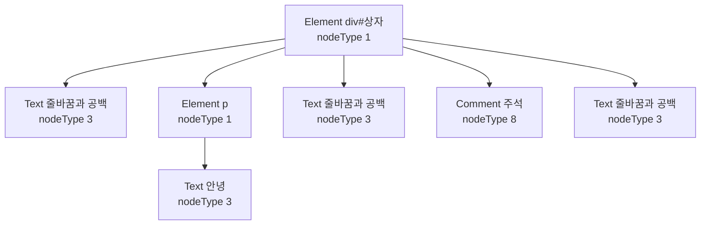
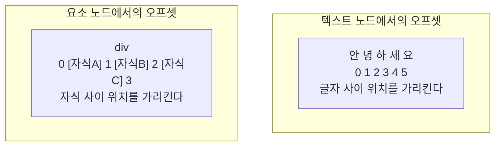
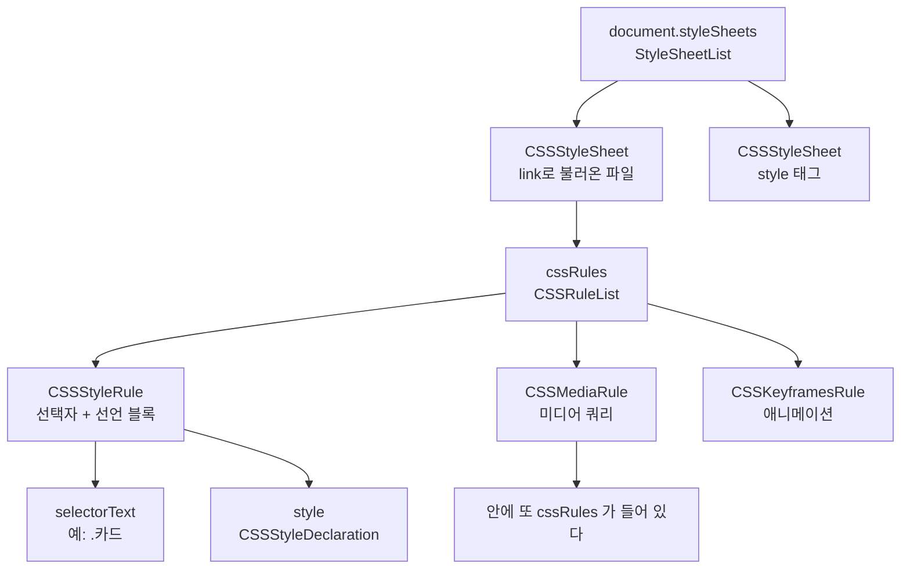

<Callout type="info">
  **이번 문서의 목표:** 이 문서를 다 읽으면 DOM 트리가 어떤 종류의 노드로 이루어져 있는지, 라이브 컬렉션이 언제 나를 배신하는지, Range로 문서의 임의 구간을 어떻게 지정하는지, CSSOM으로 스타일 규칙 자체를 어떻게 다루는지 설명하고 직접 조작할 수 있게 됩니다.
</Callout>

## 왜 DOM을 "다시" 배우는가

이 과목의 독자는 이미 `querySelector`와 `classList`를 씁니다. 그런데도 5편을 DOM에 통째로 쓰는 이유는, 실무의 미묘한 버그들이 전부 **DOM을 얕게 아는 지점**에서 태어나기 때문입니다.

- 반복문 안에서 요소를 지우는데 절반만 지워진다.
- 요소의 텍스트를 바꿨더니 안에 있던 이벤트 리스너가 전부 사라졌다.
- 부모의 `childNodes` 길이가 자식 태그 수보다 많다.
- `element.className`은 됐는데 스타일시트의 규칙 자체를 바꾸는 방법을 모르겠다.

이 네 가지가 각각 라이브 컬렉션, 노드 교체, 노드 타입, CSSOM의 이야기입니다. 하나씩 바닥까지 파겠습니다.

## 1. DOM 트리 — 노드 타입 체계

### DOM은 요소의 트리가 아니다

가장 먼저 고칠 오해입니다. DOM(Document Object Model, 문서 객체 모델)은 **요소**(element)의 트리가 아니라 **노드**(node, 마디)의 트리입니다. 요소는 노드의 여러 종류 중 하나일 뿐입니다.

```html
<div id="상자">
  <p>안녕</p>
  <!-- 주석 -->
</div>
```

이 짧은 HTML이 만드는 실제 트리입니다.



`div`의 자식이 몇 개일까요? 눈으로는 `p` 하나지만 실제로는 **다섯 개**입니다. 태그 사이의 줄바꿈과 들여쓰기 공백이 전부 텍스트 노드가 되기 때문입니다.

### 주요 노드 타입

| nodeType | 이름 | 인터페이스 | 정체 |
|----------|------|-----------|------|
| 1 | ELEMENT_NODE | `Element` | 태그 하나 |
| 3 | TEXT_NODE | `Text` | 글자 덩어리. 공백도 포함 |
| 8 | COMMENT_NODE | `Comment` | 주석 |
| 9 | DOCUMENT_NODE | `Document` | 문서 전체의 뿌리 |
| 10 | DOCUMENT_TYPE_NODE | `DocumentType` | 문서 형식 선언 |
| 11 | DOCUMENT_FRAGMENT_NODE | `DocumentFragment` | 문서에 붙지 않은 임시 컨테이너 |

이 표가 실무 문제를 하나 해결합니다. **`childNodes`와 `children`의 차이**입니다.

| 속성 | 반환 | 포함 대상 |
|------|------|-----------|
| `childNodes` | `NodeList` | 모든 노드 — 텍스트·주석 포함 |
| `children` | `HTMLCollection` | 요소 노드만 |
| `firstChild` | `Node` 또는 `null` | 첫 노드. 흔히 공백 텍스트 |
| `firstElementChild` | `Element` 또는 `null` | 첫 요소 |

들여쓰기된 HTML에서 `firstChild`가 원하는 요소가 아닌 공백 텍스트로 나오는 사고의 원인이 여기 있습니다. 요소만 다루고 싶으면 이름에 `Element`가 들어간 쪽을 쓰면 됩니다.

### DocumentFragment — 트리 밖의 작업대

`DocumentFragment`(문서 조각)는 노드들을 담을 수 있지만 **어느 문서에도 붙어 있지 않은** 컨테이너입니다. 문서에 붙어 있지 않으므로 여기에 노드를 아무리 많이 추가해도 레이아웃이 돌지 않습니다.

> **쉽게 말하면:** 조립을 작업대에서 다 끝내고 완성품 하나만 전시대에 올리는 것입니다. 전시대 위에서 부품을 하나씩 붙이면 관객(브라우저)이 매번 반응해야 하지만, 작업대에서는 아무도 안 봅니다.

그리고 문서에 붙일 때 흥미로운 성질이 있습니다. **조각 자체는 사라지고 자식들만 옮겨갑니다.** `appendChild`로 넣으면 `<fragment>` 같은 껍데기가 남지 않고 내용물만 들어갑니다.

## 2. 라이브 컬렉션 — 가장 유명한 함정

### 두 종류의 컬렉션

DOM에서 여러 요소를 돌려주는 메서드는 두 부류로 나뉩니다.

| 메서드 | 반환 타입 | 성격 |
|--------|-----------|------|
| `getElementsByTagName` | `HTMLCollection` | 라이브 |
| `getElementsByClassName` | `HTMLCollection` | 라이브 |
| `element.children` | `HTMLCollection` | 라이브 |
| `document.forms`, `document.images` | `HTMLCollection` | 라이브 |
| `querySelectorAll` | `NodeList` | 정적(스냅샷) |
| `element.childNodes` | `NodeList` | **라이브** |

`NodeList`가 항상 정적인 것이 아니라는 마지막 줄에 주의하세요. `querySelectorAll`이 돌려주는 것만 정적이고, `childNodes`가 돌려주는 `NodeList`는 라이브입니다.

**라이브**(live, 살아있는) 컬렉션은 DOM이 바뀌면 **자동으로 내용이 갱신됩니다.** 저장해둔 변수가 조용히 달라집니다.

> **쉽게 말하면:** 라이브 컬렉션은 실시간 검색 결과 화면이고, 정적 컬렉션은 그 순간 찍은 스크린샷입니다. 검색어에 맞는 항목이 새로 생기면 앞의 화면은 즉시 바뀌지만 스크린샷은 그대로입니다.

### 실험으로 확인하기

<CodePlayground
  template="vanilla"
  activeFile="/index.js"
  showConsole
  label="라이브 컬렉션 vs 정적 컬렉션 — 버튼을 눌러 결과를 비교하세요"
  files={{
    '/index.html': `<div id="app">
  <div id="목록">
    <div class="항목">항목 1</div>
    <div class="항목">항목 2</div>
    <div class="항목">항목 3</div>
    <div class="항목">항목 4</div>
  </div>
  <button id="추가">항목 하나 추가</button>
  <button id="나쁜삭제">나쁜 삭제: 라이브 컬렉션 순회</button>
  <button id="좋은삭제">좋은 삭제: 정적 컬렉션 순회</button>
  <button id="초기화">초기화</button>
  <p id="결과">콘솔을 함께 확인하세요.</p>
</div>`,
    '/index.js': `const 목록 = document.getElementById("목록");
const 결과 = document.getElementById("결과");
const 초기HTML = 목록.innerHTML;

function 상태출력(설명) {
  console.log(설명 + " → 실제 남은 항목 수: " + 목록.children.length);
  결과.textContent = 설명 + " / 남은 항목 " + 목록.children.length + "개";
}

// (1) 라이브와 정적의 차이 관찰
const 라이브 = 목록.getElementsByClassName("항목");  // HTMLCollection — 라이브
const 정적 = document.querySelectorAll(".항목");      // NodeList — 스냅샷
console.log("등록 시점 — 라이브:", 라이브.length, "정적:", 정적.length); // 4 4

document.getElementById("추가").addEventListener("click", () => {
  const 새항목 = document.createElement("div");
  새항목.className = "항목";
  새항목.textContent = "새 항목";
  목록.appendChild(새항목);
  // 라이브만 늘어난다. 정적은 그대로다.
  console.log("추가 후 — 라이브:", 라이브.length, "정적:", 정적.length);
  상태출력("항목 추가");
});

// (2) 라이브 컬렉션을 순회하며 지우면 절반만 지워진다
document.getElementById("나쁜삭제").addEventListener("click", () => {
  const 컬렉션 = 목록.getElementsByClassName("항목");
  console.log("삭제 시작 전 개수:", 컬렉션.length);
  for (let i = 0; i < 컬렉션.length; i++) {
    console.log("i=" + i + " 에서 삭제, 현재 길이 " + 컬렉션.length);
    컬렉션[i].remove();   // 지우는 순간 컬렉션이 줄어들어 인덱스가 밀린다
  }
  상태출력("나쁜 삭제 실행");
});

// (3) 정적 스냅샷을 순회하면 전부 지워진다
document.getElementById("좋은삭제").addEventListener("click", () => {
  const 스냅샷 = document.querySelectorAll(".항목");  // 또는 Array.from(컬렉션)
  console.log("스냅샷 개수:", 스냅샷.length);
  스냅샷.forEach((항목) => 항목.remove());
  상태출력("좋은 삭제 실행");
});

document.getElementById("초기화").addEventListener("click", () => {
  목록.innerHTML = 초기HTML;
  상태출력("초기화");
});

console.log("먼저 [나쁜 삭제]를 눌러보고, 초기화 후 [좋은 삭제]와 비교하세요.");`,
  }}
/>

"나쁜 삭제"의 결과를 콘솔에서 보면 이유가 명확합니다.

| 반복 | `i` | 삭제 전 길이 | 삭제 대상 | 삭제 후 길이 |
|------|-----|--------------|-----------|--------------|
| 1회 | 0 | 4 | 항목 1 | 3 |
| 2회 | 1 | 3 | 항목 3 | 2 |
| 3회 | 2 | 2 | 조건 불만족으로 종료 | 2 |

`i`는 늘어나는데 컬렉션은 줄어드니 한 칸씩 건너뛰게 되고, 결국 절반만 지워집니다. 해결책은 세 가지입니다.

1. `querySelectorAll`로 스냅샷을 받는다.
2. `Array.from(컬렉션)`으로 배열 사본을 만든다.
3. 뒤에서부터 순회한다 — `for (let i = 길이 - 1; i >= 0; i--)`.

<Callout type="warning">
  **자주 틀리는 점:** 라이브 컬렉션은 반복문 조건에서 `.length`를 매번 평가할 때 특히 위험합니다. 그리고 성능 함정도 있습니다. `for (let i = 0; i < document.getElementsByTagName("div").length; i++)`는 매 반복마다 문서 전체를 다시 훑을 수 있습니다. 길이를 변수에 미리 담거나 정적 컬렉션을 쓰세요.
</Callout>

## 3. 노드 조작 — 무엇이 실제로 벌어지는가

### innerHTML의 비용

`innerHTML`에 문자열을 대입하는 것은 편해 보이지만 안에서 벌어지는 일은 무겁습니다.

<Steps>

1. 기존 자식 노드들을 **전부 파괴**한다. 그 노드에 붙어 있던 이벤트 리스너도 함께 사라진다.

2. 대입된 문자열을 HTML 파서로 **다시 파싱**한다.

3. 파싱 결과로 새 노드 트리를 만들어 붙인다.

4. 트리가 통째로 바뀌었으므로 레이아웃과 페인트가 다시 돈다.

</Steps>

그래서 "텍스트만 살짝 바꾸려고" `innerHTML`을 쓰면 그 안의 모든 리스너와 상태가 초기화됩니다. 입력창의 입력 중이던 값도 날아갑니다.

| 목적 | 권장 방법 | 이유 |
|------|-----------|------|
| 텍스트만 바꾸기 | `textContent` | 파싱 없음. 가장 빠르고 안전 |
| 요소 하나 추가 | `append`, `prepend` | 기존 자식 보존 |
| 여러 개 추가 | `DocumentFragment` 조립 후 한 번에 | 레이아웃 1회 |
| 마크업 삽입 | `insertAdjacentHTML` | 기존 자식을 파괴하지 않음 |
| 요소 교체 | `replaceWith` | 부모 참조 없이 바로 교체 |
| 요소 제거 | `remove` | `부모.removeChild(자식)` 보다 간결 |

### textContent와 innerText의 결정적 차이

이름이 비슷해 자주 바꿔 쓰지만 성능 특성이 완전히 다릅니다.

| 항목 | `textContent` | `innerText` |
|------|---------------|-------------|
| 반환 내용 | 마크업을 뺀 모든 텍스트 | 화면에 **보이는** 텍스트 |
| `display: none` 요소 | 포함 | 제외 |
| 공백 처리 | 소스 그대로 | CSS 적용 결과대로 정리 |
| 레이아웃 유발 | 없음 | **있음** — 강제 동기 레이아웃 |

`innerText`가 "보이는 텍스트"를 알려면 무엇이 보이는지 알아야 하고, 그러려면 레이아웃이 필요합니다. 3편에서 배운 강제 동기 레이아웃을 유발하는 대표적인 속성입니다. 특별한 이유가 없으면 `textContent`를 쓰세요.

### XSS — innerHTML의 보안 문제

사용자가 입력한 문자열을 `innerHTML`에 그대로 넣으면 **XSS**(Cross-Site Scripting, 교차 사이트 스크립팅) 취약점이 됩니다. 공격자가 이미지 태그의 오류 처리 속성에 스크립트를 심어 보내면, 그 스크립트가 내 페이지의 오리진 권한으로 실행됩니다. 쿠키를 읽어 서버로 보내는 것까지 가능합니다.

`<script>` 태그는 `innerHTML`로 삽입해도 실행되지 않지만, 이벤트 핸들러 속성을 통한 실행은 막히지 않습니다. 원칙은 하나입니다. **신뢰할 수 없는 문자열은 `textContent`로 넣는다.**

## 4. Range — 문서의 임의 구간 지정

### 왜 필요한가

DOM API는 기본적으로 **노드 단위**로 동작합니다. 그런데 실제 편집 기능에서 필요한 것은 "이 문단의 3번째 글자부터 다음 문단의 7번째 글자까지"처럼 **노드 경계를 가로지르는 구간**입니다. 노드 단위 API로는 표현할 수 없습니다.

**Range**(레인지, 범위)는 이 문제를 위한 객체입니다. 문서 안의 **연속된 한 구간**을 나타냅니다.

### 경계점이라는 좌표계

Range는 두 개의 **경계점**(boundary point)으로 정의됩니다. 각 경계점은 한 쌍의 값입니다.

$$
경계점 = (container, offset)
$$

- $container$ (컨테이너): 기준이 되는 노드
- $offset$ (오프셋, 자리 번호): 그 노드 안에서의 위치

여기서 오프셋의 의미가 컨테이너의 종류에 따라 **다릅니다.** 이것이 Range의 핵심이자 헷갈리는 지점입니다.

| 컨테이너 종류 | 오프셋의 의미 | 범위 |
|---------------|---------------|------|
| 텍스트 노드 | 글자 사이의 위치 | 0부터 글자 수까지 |
| 요소 노드 | 자식 노드 사이의 위치 | 0부터 자식 수까지 |

"안녕하세요"라는 텍스트 노드에서 오프셋 2는 "안녕"과 "하세요" 사이입니다. 반면 자식이 셋인 `div`에서 오프셋 2는 두 번째 자식과 세 번째 자식 사이입니다.



### Range의 주요 메서드

| 메서드 | 하는 일 |
|--------|---------|
| `setStart(노드, 오프셋)` | 시작 경계점 지정 |
| `setEnd(노드, 오프셋)` | 끝 경계점 지정 |
| `selectNode(노드)` | 그 노드 자체를 통째로 감싸기 |
| `selectNodeContents(노드)` | 그 노드의 내용만 |
| `cloneContents()` | 구간 내용을 복사한 `DocumentFragment` |
| `extractContents()` | 구간 내용을 **잘라내어** 반환 |
| `deleteContents()` | 구간 내용 삭제 |
| `surroundContents(노드)` | 구간을 주어진 노드로 감싸기 |
| `getBoundingClientRect()` | 구간의 화면 좌표 |

`surroundContents`가 형광펜 기능의 핵심입니다. 선택 구간을 `<mark>` 같은 요소로 감싸면 그 부분만 강조 표시됩니다.

<Callout type="warning">
  **자주 틀리는 점:** `surroundContents`는 구간이 **여러 노드에 걸쳐 부분적으로** 있으면 예외를 던집니다. 예를 들어 문단 A의 중간에서 시작해 문단 B의 중간에서 끝나는 구간은 감쌀 수 없습니다. 그렇게 감싸면 트리 구조가 깨지기 때문입니다. 실제 편집기들은 이 경우 구간을 여러 조각으로 나눠 각각 감싸는 방식으로 처리합니다.
</Callout>

## 5. Selection — 사용자가 드래그한 그것

**Selection**(셀렉션, 선택 영역)은 사용자가 마우스나 키보드로 실제 선택한 영역을 나타내는 객체입니다. `window.getSelection()`으로 가져옵니다.

Range와의 관계는 명확합니다. **Selection은 Range를 담고 있습니다.** 대부분의 브라우저에서 한 번에 하나의 Range만 가집니다.

| 속성·메서드 | 의미 |
|-------------|------|
| `anchorNode`, `anchorOffset` | 드래그를 **시작한** 지점 |
| `focusNode`, `focusOffset` | 드래그가 **끝난** 지점 |
| `isCollapsed` | 시작과 끝이 같은가 — 즉 커서만 있는가 |
| `toString()` | 선택된 텍스트 |
| `getRangeAt(0)` | 선택 영역의 Range 객체 |
| `removeAllRanges()` | 선택 해제 |
| `addRange(range)` | 프로그램으로 선택 지정 |

앵커(anchor)와 포커스(focus)를 시작·끝과 구분하는 이유가 있습니다. **사용자가 거꾸로 드래그하면 앵커가 포커스보다 뒤에 있습니다.** 반면 Range의 `startContainer`는 항상 문서 순서상 앞입니다. 방향 정보가 필요하면 Selection을, 순서가 정규화된 구간이 필요하면 Range를 봅니다.

<CodePlayground
  template="vanilla"
  activeFile="/index.js"
  showConsole
  label="Range와 Selection 직접 다루기 — 텍스트를 드래그해 보세요"
  files={{
    '/index.html': `<div id="app">
  <p id="본문">브라우저의 문서 모델은 노드의 트리이고, Range는 그 트리를 가로지르는 임의의 구간을 가리킵니다. 이 문장을 마우스로 드래그해 보세요.</p>
  <button id="정보">선택 영역 정보 출력</button>
  <button id="강조">선택 부분 형광펜 표시</button>
  <button id="자동">프로그램으로 앞 10글자 선택</button>
  <p id="결과">아직 선택하지 않았습니다.</p>
</div>`,
    '/index.js': `const 본문 = document.getElementById("본문");
const 결과 = document.getElementById("결과");

// (1) 선택 영역의 좌표계를 관찰한다
document.getElementById("정보").addEventListener("click", () => {
  const 선택 = window.getSelection();
  if (선택.isCollapsed) {
    console.log("선택된 구간이 없습니다. 먼저 드래그하세요.");
    결과.textContent = "선택 없음";
    return;
  }
  console.log("선택된 텍스트:", 선택.toString());
  console.log("anchorNode 타입:", 선택.anchorNode.nodeType, "offset:", 선택.anchorOffset);
  console.log("focusNode 타입:", 선택.focusNode.nodeType, "offset:", 선택.focusOffset);

  const 범위 = 선택.getRangeAt(0);
  console.log("startOffset:", 범위.startOffset, "endOffset:", 범위.endOffset);
  console.log("여러 노드에 걸쳤나?", 범위.startContainer !== 범위.endContainer);

  const 사각형 = 범위.getBoundingClientRect();
  console.log("화면 좌표 — 좌:", Math.round(사각형.left), "상:", Math.round(사각형.top));
  결과.textContent = "선택: " + 선택.toString();
});

// (2) surroundContents 로 형광펜 — 실패 조건도 함께 확인
document.getElementById("강조").addEventListener("click", () => {
  const 선택 = window.getSelection();
  if (선택.isCollapsed) {
    console.log("먼저 텍스트를 드래그하세요.");
    return;
  }
  const 범위 = 선택.getRangeAt(0);
  const 형광펜 = document.createElement("mark");
  try {
    범위.surroundContents(형광펜);
    console.log("감싸기 성공");
    결과.textContent = "형광펜 적용 완료";
  } catch (에러) {
    // 구간이 노드 경계를 부분적으로 가로지르면 예외가 난다
    console.log("감싸기 실패:", 에러.name);
    console.log("→ 구간이 여러 노드를 부분적으로 걸치고 있습니다.");
    결과.textContent = "감쌀 수 없는 구간입니다";
  }
  선택.removeAllRanges();
});

// (3) 프로그램으로 선택 지정 — Range를 만들어 Selection에 넣는다
document.getElementById("자동").addEventListener("click", () => {
  const 첫텍스트노드 = 본문.firstChild;   // 텍스트 노드
  console.log("첫 자식 nodeType:", 첫텍스트노드.nodeType); // 3
  const 범위 = document.createRange();
  범위.setStart(첫텍스트노드, 0);
  범위.setEnd(첫텍스트노드, 10);          // 텍스트 노드이므로 글자 단위
  const 선택 = window.getSelection();
  선택.removeAllRanges();
  선택.addRange(범위);
  console.log("프로그램으로 선택한 텍스트:", 범위.toString());
  결과.textContent = "자동 선택: " + 범위.toString();
});

// 선택이 바뀔 때마다 알림
document.addEventListener("selectionchange", () => {
  const 선택 = window.getSelection();
  if (!선택.isCollapsed) {
    console.log("selectionchange — 현재 길이:", 선택.toString().length);
  }
});`,
  }}
/>

## 6. CSSOM — 스타일 규칙 자체를 다루기

### element.style로는 부족한 순간

`element.style.color = "red"`는 그 요소 하나의 인라인 스타일만 바꿉니다. 그런데 "이 페이지의 모든 `.카드` 요소의 배경색"을 바꾸고 싶다면? 요소를 전부 찾아 하나씩 대입할 수도 있지만, **스타일 규칙 자체를 고치는** 방법이 있습니다. 그것이 **CSSOM**(CSS Object Model, CSS 객체 모델)입니다.

### 구조



주요 조작 메서드입니다.

| 대상 | 메서드·속성 | 하는 일 |
|------|-------------|---------|
| `document` | `styleSheets` | 문서의 모든 스타일시트 목록 |
| `CSSStyleSheet` | `cssRules` | 그 시트의 규칙 목록 |
| `CSSStyleSheet` | `insertRule(문자열, 위치)` | 규칙 추가 |
| `CSSStyleSheet` | `deleteRule(위치)` | 규칙 삭제 |
| `CSSStyleRule` | `selectorText` | 선택자 문자열 |
| `CSSStyleRule` | `style` | 선언 블록. `color` 등 직접 접근 |
| `window` | `getComputedStyle(요소)` | 최종 계산된 스타일 |
| `Element` | `computedStyleMap()` | 타입 있는 형태로 읽기 |

### 언제 CSSOM을 쓰는가

`element.style`을 일일이 대입하는 대신 규칙 하나를 고치면 되는 상황들입니다.

- 테마 전환: 규칙 몇 개만 바꿔 수백 개 요소를 한 번에 변경
- 동적 애니메이션 정의: `@keyframes`를 런타임에 생성
- 인쇄용 스타일 주입
- CSS-in-JS 라이브러리 내부 구현

<Callout type="warning">
  **자주 틀리는 점:** 다른 오리진에서 불러온 스타일시트의 `cssRules`에 접근하면 `SecurityError`가 납니다. 1편의 동일 출처 정책이 여기에도 적용되기 때문입니다. CDN에서 불러온 CSS의 규칙을 읽으려 하면 이 벽에 부딪힙니다. 서버가 CORS 헤더를 주고 `<link>`에 `crossorigin` 속성을 붙여야 읽을 수 있습니다.
</Callout>

### 현대적 대안 — CSS 커스텀 속성

사실 대부분의 테마 전환은 CSSOM 없이 **CSS 커스텀 속성**(custom property, 사용자 정의 속성 — 흔히 CSS 변수라 부름)으로 해결하는 편이 낫습니다.

```js
// 루트에 정의된 변수 하나만 바꾸면
// 그 변수를 쓰는 모든 규칙이 함께 바뀐다
document.documentElement.style.setProperty("--주요색", "#0d6efd");

// 현재 값 읽기
const 현재색 = getComputedStyle(document.documentElement)
  .getPropertyValue("--주요색");
```

CSSOM 규칙 조작보다 단순하고, 브라우저가 변수 변경을 최적화해 처리합니다. 스타일시트 구조 자체를 바꿔야 하는 경우에만 CSSOM으로 내려가세요.

## 핵심 정리

- DOM은 요소가 아니라 노드의 트리다. 태그 사이의 공백과 줄바꿈도 텍스트 노드가 되므로 `childNodes`와 `children`, `firstChild`와 `firstElementChild`를 구분해 써야 한다.
- `getElementsByClassName` 계열과 `childNodes`는 라이브 컬렉션이라 DOM 변경에 따라 조용히 달라진다. 순회하며 삭제할 때는 `querySelectorAll` 스냅샷이나 배열 사본, 또는 역방향 순회를 쓴다.
- `innerHTML` 대입은 기존 자식과 리스너를 전부 파괴하고 재파싱한다. 텍스트만 바꾼다면 `textContent`가 빠르고 안전하며, `innerText`는 레이아웃을 강제한다.
- Range는 컨테이너와 오프셋 쌍으로 된 두 경계점으로 구간을 지정하며, 오프셋의 의미는 컨테이너가 텍스트냐 요소냐에 따라 달라진다. Selection은 사용자의 실제 선택을 나타내고 방향 정보를 가진다.
- CSSOM은 스타일 규칙 자체를 조작하는 통로다. 교차 출처 스타일시트는 읽을 수 없으며, 대부분의 테마 전환은 CSS 커스텀 속성으로 더 간단히 해결된다.

## 마무리 복습

<Quiz
  questionNumber={1}
  question="들여쓰기된 HTML에서 부모 요소의 childNodes 길이가 자식 태그 수보다 큰 이유는?"
  options={['브라우저가 보이지 않는 요소를 자동 추가하기 때문', '태그 사이의 줄바꿈과 공백이 텍스트 노드로 포함되기 때문', 'childNodes가 손자 노드까지 포함하기 때문', '주석은 항상 두 개의 노드로 세어지기 때문']}
  correctAnswer={2}
  explanation="childNodes는 요소뿐 아니라 텍스트 노드와 주석 노드까지 모두 포함한다. 들여쓰기 공백이 전부 텍스트 노드가 된다."
  optionExplanations={['브라우저가 임의로 요소를 넣지는 않는다', '정답 — 공백 텍스트 노드가 포함된다', '직계 자식만 포함한다', '주석은 노드 하나로 센다']}
/>

<Quiz
  questionNumber={2}
  question="다음 중 정적(스냅샷) 컬렉션을 반환하는 것은?"
  options={['getElementsByClassName', 'element.children', 'querySelectorAll', 'element.childNodes']}
  correctAnswer={3}
  explanation="querySelectorAll만 호출 시점의 스냅샷인 정적 NodeList를 반환한다. 나머지 셋은 모두 DOM 변경에 따라 갱신되는 라이브 컬렉션이다."
  optionExplanations={['라이브 HTMLCollection을 반환한다', '라이브 HTMLCollection이다', '정답 — 호출 시점의 스냅샷이다', 'NodeList지만 라이브다']}
/>

<Quiz
  questionNumber={3}
  question="라이브 컬렉션을 인덱스 0부터 증가시키며 순회하면서 각 요소를 remove할 때 나타나는 현상은?"
  options={['모든 요소가 정상적으로 삭제된다', '요소를 하나 걸러 하나씩만 삭제되어 절반이 남는다', '즉시 예외가 발생한다', '역순으로 삭제된다']}
  correctAnswer={2}
  explanation="삭제할 때마다 컬렉션 길이가 줄어 뒤 요소들의 인덱스가 앞으로 당겨지는데 인덱스는 계속 증가하므로 한 칸씩 건너뛴다."
  optionExplanations={['인덱스가 어긋나 일부만 삭제된다', '정답 — 인덱스 밀림으로 절반만 삭제된다', '예외 없이 조용히 잘못 동작한다', '순방향 순회이며 역순이 되지는 않는다']}
/>

<Quiz
  questionNumber={4}
  question="textContent와 innerText의 차이로 옳은 것은?"
  options={['textContent가 레이아웃을 강제하고 innerText는 그렇지 않다', 'innerText는 화면에 보이는 텍스트만 반환하며 레이아웃을 유발할 수 있다', '둘은 완전히 동일하게 동작한다', 'textContent는 display none 요소의 텍스트를 제외한다']}
  correctAnswer={2}
  explanation="innerText는 렌더링 결과를 반영하므로 숨겨진 요소를 제외하고 공백을 정리하며, 그 판단을 위해 레이아웃을 요구할 수 있다. textContent는 소스 그대로를 반환하고 레이아웃과 무관하다."
  optionExplanations={['방향이 반대다', '정답 — 보이는 텍스트를 알기 위해 레이아웃이 필요하다', '반환 내용과 성능 특성이 모두 다르다', '숨겨진 텍스트도 포함하는 쪽이 textContent다']}
/>

<Quiz
  questionNumber={5}
  question="Range의 경계점에서 컨테이너가 요소 노드일 때 offset이 의미하는 것은?"
  options={['해당 요소의 글자 위치', '해당 요소의 자식 노드 사이의 위치', '화면상의 픽셀 좌표', '요소의 z-index 값']}
  correctAnswer={2}
  explanation="컨테이너가 텍스트 노드면 오프셋은 글자 사이 위치를, 요소 노드면 자식 노드 사이 위치를 가리킨다."
  optionExplanations={['글자 단위는 컨테이너가 텍스트 노드일 때다', '정답 — 자식 노드 사이의 위치를 센다', '픽셀 좌표는 getBoundingClientRect로 얻는다', 'z-index와는 무관하다']}
/>

<Quiz
  questionNumber={6}
  question="Selection의 anchorNode와 focusNode를 Range의 start와 end와 별도로 두는 이유는?"
  options={['성능 최적화를 위해', '사용자가 거꾸로 드래그하면 앵커가 포커스보다 문서 뒤쪽에 올 수 있어 방향 정보를 담기 위해', '두 값이 항상 동일하기 때문', 'Range가 텍스트 노드만 다루기 때문']}
  correctAnswer={2}
  explanation="Range의 start는 항상 문서 순서상 앞이지만, Selection의 앵커는 드래그를 시작한 지점이라 역방향 선택에서는 뒤쪽에 위치한다."
  optionExplanations={['성능과는 관계없는 의미 차이다', '정답 — 선택 방향을 표현하기 위한 구분이다', '역방향 선택에서 서로 다르다', 'Range도 요소 노드를 컨테이너로 가질 수 있다']}
/>

<Quiz
  questionNumber={7}
  question="다른 오리진의 CDN에서 불러온 스타일시트의 cssRules에 접근할 때 발생하는 일은?"
  options={['정상적으로 규칙 목록을 읽을 수 있다', 'SecurityError가 발생한다', '빈 배열이 조용히 반환된다', '브라우저가 자동으로 파일을 다시 받아온다']}
  correctAnswer={2}
  explanation="동일 출처 정책이 스타일시트 내용 읽기에도 적용된다. 서버가 CORS 헤더를 주고 link에 crossorigin 속성을 붙여야 접근할 수 있다."
  optionExplanations={['같은 오리진일 때만 읽을 수 있다', '정답 — 동일 출처 정책에 의해 차단된다', '조용한 실패가 아니라 예외가 발생한다', '자동 재요청은 일어나지 않는다']}
/>

<Quiz
  questionNumber={8}
  question="DocumentFragment를 사용해 여러 노드를 한 번에 붙이는 주된 이점은?"
  options={['노드에 붙은 이벤트 리스너가 자동으로 복제된다', '문서 트리 밖에서 조립하므로 레이아웃이 반복되지 않고 한 번만 발생한다', '노드가 자동으로 정렬된다', '메모리 사용량이 항상 절반으로 줄어든다']}
  correctAnswer={2}
  explanation="프래그먼트는 어느 문서에도 붙어 있지 않아 내부 조작이 레이아웃을 유발하지 않는다. 완성된 뒤 한 번만 문서에 붙이므로 파이프라인이 한 번 돈다."
  optionExplanations={['리스너 복제와는 관계없다', '정답 — 레이아웃 유발 횟수를 줄이는 것이 핵심이다', '정렬 기능은 없다', '메모리 절감이 목적이 아니다']}
/>

## 참고 자료

- [DOM Living Standard](https://dom.spec.whatwg.org/)
- [MDN - Web APIs](https://developer.mozilla.org/en-US/docs/Web/API)
- [HTML Living Standard](https://html.spec.whatwg.org/multipage/)
- [MDN - Populating the page: how browsers work](https://developer.mozilla.org/en-US/docs/Web/Performance/Guides/How_browsers_work)
