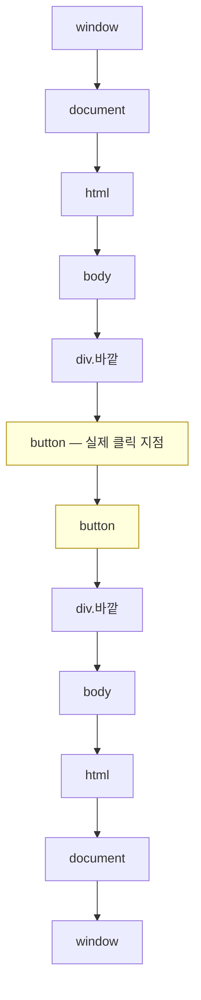
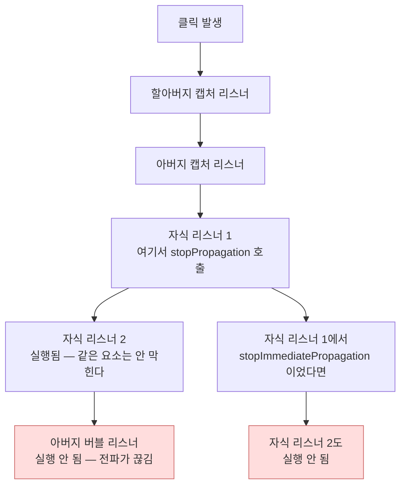

<Callout type="info">
  **이번 문서의 목표:** 이 문서를 다 읽으면 클릭 한 번에 브라우저가 어떤 경로로 몇 개의 리스너를 어떤 순서로 부르는지 정확히 예측하고, 이벤트 위임과 커스텀 이벤트로 확장 가능한 구조를 설계할 수 있게 됩니다.
</Callout>

## 왜 전파 모델이 중요한가

`addEventListener`는 웹 개발에서 가장 먼저 배우는 API 중 하나입니다. 그런데 다음 질문들에 즉답할 수 있는 사람은 의외로 적습니다.

- 부모와 자식에 각각 클릭 리스너가 있다. 자식을 클릭하면 몇 번 실행되고 순서는?
- `event.target`과 `event.currentTarget`은 언제 달라지는가?
- `stopPropagation`을 호출하면 같은 요소의 다른 리스너도 막히는가?
- 아직 존재하지 않는 요소에 미리 리스너를 걸 수 있는가?

이 답들은 전부 **이벤트 전파**(event propagation, 사건 전달)라는 하나의 모델에서 나옵니다. 모델 하나를 정확히 세우면 네 질문이 동시에 풀립니다.

## 1. 3단계 전파 — 내려갔다가 올라온다

### 왜 이런 구조가 되었나

브라우저 전쟁 시절, 넷스케이프(Netscape)는 이벤트가 **바깥에서 안으로** 내려가야 한다고 했고, 마이크로소프트(Microsoft)는 **안에서 바깥으로** 올라가야 한다고 했습니다. W3C가 표준을 정하면서 내린 결론은 타협이었습니다 — **둘 다 한다.**

그래서 오늘날 이벤트는 한 번 발생할 때마다 트리를 **내려갔다가 다시 올라옵니다.**



세 단계로 이름이 붙어 있습니다.

| 단계 | 이름 | 방향 | `eventPhase` 값 |
|------|------|------|-----------------|
| 1 | 캡처링(capturing, 붙잡기) | window에서 대상까지 내려감 | 1 |
| 2 | 타깃(target, 대상) | 실제 발생 지점 | 2 |
| 3 | 버블링(bubbling, 거품) | 대상에서 window까지 올라감 | 3 |

> **쉽게 말하면:** 회사에 민원이 들어왔습니다. 사장 → 부장 → 팀장 순으로 내려가며 각자 "내가 먼저 처리할까?" 확인하고(캡처링), 실제 담당자가 처리한 뒤(타깃), 다시 팀장 → 부장 → 사장으로 보고가 올라갑니다(버블링). 같은 사건 하나에 대해 조직 전체가 두 번 마주칠 기회를 가집니다.

**버블링**이라는 이름은 물속에서 거품이 위로 떠오르는 모습에서 왔습니다. 깊은 곳(자식)에서 생긴 거품이 수면(window)으로 올라오는 그림입니다.

### addEventListener의 세 번째 인자

기본값은 **버블링 단계에서 듣기**입니다. 캡처링 단계에서 들으려면 명시해야 합니다.

```js
요소.addEventListener("click", 핸들러);                   // 버블링 (기본)
요소.addEventListener("click", 핸들러, true);             // 캡처링
요소.addEventListener("click", 핸들러, { capture: true }); // 캡처링 (권장 형태)
```

2편에서 스펙 알고리즘을 읽은 것을 떠올리세요. 중복 판단 기준이 **타입·콜백·capture** 셋이었습니다. 그래서 같은 함수를 capture 유무만 달리해 등록하면 **둘 다 등록되고 둘 다 실행됩니다.**

### 실제 실행 순서 실험

<CodePlayground
  template="vanilla"
  activeFile="/index.js"
  showConsole
  label="캡처·타깃·버블 3단계를 눈으로 확인 — 안쪽 버튼을 클릭하세요"
  files={{
    '/index.html': `<div id="app">
  <div id="할아버지" style="padding:24px;background:#eef;border:2px solid #99c">
    할아버지 div
    <div id="아버지" style="padding:24px;background:#efe;border:2px solid #9c9">
      아버지 div
      <button id="자식" style="padding:12px">자식 버튼 — 여기를 클릭</button>
    </div>
  </div>
  <button id="지우기">로그 지우기</button>
  <ol id="로그"></ol>
</div>`,
    '/index.js': `const 로그 = document.getElementById("로그");

function 기록(문구) {
  console.log(문구);
  const 항목 = document.createElement("li");
  항목.textContent = 문구;
  로그.appendChild(항목);
}

const 단계이름 = { 1: "캡처링", 2: "타깃", 3: "버블링" };

function 리스너만들기(주인, 캡처여부) {
  return function (이벤트) {
    const 단계 = 단계이름[이벤트.eventPhase];
    기록(
      주인 + " 리스너(" + (캡처여부 ? "capture" : "bubble") + ") 실행 — " +
      "phase: " + 단계 +
      " / target: " + 이벤트.target.id +
      " / currentTarget: " + 이벤트.currentTarget.id
    );
  };
}

for (const 아이디 of ["할아버지", "아버지", "자식"]) {
  const 요소 = document.getElementById(아이디);
  요소.addEventListener("click", 리스너만들기(아이디, true), { capture: true });
  요소.addEventListener("click", 리스너만들기(아이디, false));
}

document.getElementById("지우기").addEventListener("click", (e) => {
  e.stopPropagation();
  로그.innerHTML = "";
});

기록("준비 완료 — 자식 버튼을 클릭해 6줄의 순서를 확인하세요");`,
  }}
/>

자식 버튼을 클릭하면 **여섯 줄**이 이 순서로 나옵니다.

| 순서 | 실행되는 리스너 | phase | currentTarget |
|------|-----------------|-------|---------------|
| 1 | 할아버지 capture | 캡처링 | 할아버지 |
| 2 | 아버지 capture | 캡처링 | 아버지 |
| 3 | 자식 capture | 타깃 | 자식 |
| 4 | 자식 bubble | 타깃 | 자식 |
| 5 | 아버지 bubble | 버블링 | 아버지 |
| 6 | 할아버지 bubble | 버블링 | 할아버지 |

세 가지를 관찰하세요.

1. **`target`은 여섯 줄 내내 `자식`으로 고정**입니다. 실제로 사건이 일어난 지점이니까요.
2. **`currentTarget`은 매번 달라집니다.** 지금 이 리스너가 붙어 있는 요소를 가리킵니다.
3. **타깃 요소 자신에서는 capture와 bubble의 구분이 사라집니다.** 둘 다 phase 2로 보고되고, 등록한 순서대로 실행됩니다.

### target과 currentTarget

| 속성 | 가리키는 것 | 전파 중 변하는가 |
|------|-------------|------------------|
| `event.target` | 이벤트가 실제 발생한 가장 안쪽 요소 | 변하지 않음 |
| `event.currentTarget` | 지금 실행 중인 리스너가 등록된 요소 | 매 단계 변함 |
| `this` (일반 함수) | `currentTarget`과 동일 | 매 단계 변함 |

<Callout type="warning">
  **자주 틀리는 점:** 화살표 함수를 리스너로 쓰면 `this`가 `currentTarget`을 가리키지 않습니다. 화살표 함수는 자신의 `this`를 갖지 않고 바깥 스코프의 것을 그대로 쓰기 때문입니다. 리스너 안에서는 `this` 대신 **`event.currentTarget`을 쓰는 습관**이 안전합니다. 함수 종류에 상관없이 항상 정확합니다.
</Callout>

## 2. 전파 제어 — 세 가지 메서드의 정확한 차이

이름이 비슷한 세 메서드가 있고, 셋의 역할이 전부 다릅니다.

| 메서드 | 막는 것 | 안 막는 것 |
|--------|---------|------------|
| `stopPropagation()` | 다음 요소로의 전파 | **같은 요소의 나머지 리스너** |
| `stopImmediatePropagation()` | 다음 요소 + 같은 요소의 나머지 리스너 | — |
| `preventDefault()` | 브라우저의 **기본 동작** | 전파는 그대로 계속됨 |



**기본 동작**(default action)이란 브라우저가 그 이벤트에 대해 원래 하기로 되어 있는 일입니다.

| 이벤트·요소 | 기본 동작 |
|-------------|-----------|
| 링크 클릭 | 해당 주소로 이동 |
| 폼 제출 버튼 클릭 | 폼 전송과 페이지 이동 |
| 체크박스 클릭 | 체크 상태 토글 |
| 우클릭 | 컨텍스트 메뉴 표시 |
| 스페이스바 누름 | 페이지 아래로 스크롤 |
| 드래그된 파일 드롭 | 그 파일을 브라우저로 열기 |

`preventDefault()`는 이것들만 취소합니다. 전파와는 완전히 별개의 축입니다. 그래서 "링크 이동은 막되 부모의 통계 수집 리스너는 계속 동작"하게 하려면 `preventDefault`만 쓰면 됩니다.

<Callout type="warning">
  **자주 틀리는 점:** `return false`는 상황에 따라 의미가 다릅니다. HTML 속성으로 등록한 핸들러(`onclick="..."`)에서는 `preventDefault`와 비슷하게 동작하지만, `addEventListener`로 등록한 리스너에서는 **아무 효과가 없습니다.** 항상 `preventDefault()`를 명시적으로 부르세요. 또한 `passive: true`로 등록된 리스너에서는 `preventDefault`가 무시되고 경고만 뜹니다 — 스크롤 성능을 위해 "이 리스너는 기본 동작을 막지 않는다"고 미리 약속한 상태이기 때문입니다.
</Callout>

### 모든 이벤트가 버블링하지는 않는다

| 이벤트 | 버블링 | 비고 |
|--------|--------|------|
| `click`, `input`, `change`, `keydown` | 함 | 대부분의 상호작용 이벤트 |
| `focus`, `blur` | 안 함 | 대신 `focusin`·`focusout`이 버블링함 |
| `mouseenter`, `mouseleave` | 안 함 | 대신 `mouseover`·`mouseout`이 버블링함 |
| `load`, `error` (이미지 등) | 안 함 | 리소스별로 개별 처리 |
| `scroll` (요소) | 안 함 | document의 scroll은 예외적으로 전달됨 |

버블링하지 않는 이벤트는 **위임 대상이 될 수 없습니다.** 그래서 포커스를 위임으로 처리하려면 `focus` 대신 `focusin`을 써야 합니다. 이벤트의 `bubbles` 속성으로 직접 확인할 수 있습니다.

## 3. 이벤트 위임 — 버블링의 실용적 응용

### 문제 상황

목록에 항목이 1000개 있고 각각 클릭 처리가 필요합니다. 순진하게 짜면 리스너를 1000개 붙이게 됩니다. 문제가 두 가지입니다.

1. **메모리와 등록 비용**: 리스너 1000개가 각각 메모리를 차지합니다.
2. **새 항목**: 나중에 추가된 항목에는 리스너가 없습니다. 추가할 때마다 붙여줘야 합니다.

### 해결 — 부모 하나에만 걸고 target으로 분기

버블링 덕분에 자식에서 일어난 클릭이 부모까지 올라옵니다. 그러니 **부모 하나에만 리스너를 걸고, `event.target`을 보고 누가 클릭됐는지 판단**하면 됩니다. 이것이 **이벤트 위임**(event delegation, 사건 위임)입니다.

> **쉽게 말하면:** 아파트 각 세대에 우체통을 다는 대신 1층 관리실에 하나만 두고, 관리인이 수취인을 보고 나눠주는 방식입니다. 새 세대가 입주해도 관리실은 그대로입니다.

핵심 도구는 `closest()`입니다. `event.target`은 클릭된 **가장 안쪽 요소**이므로, 버튼 안의 아이콘을 클릭하면 `target`이 아이콘이 됩니다. `closest("선택자")`는 자기 자신부터 조상 방향으로 올라가며 조건에 맞는 첫 요소를 찾아 줍니다.

<CodePlayground
  template="vanilla"
  activeFile="/index.js"
  showConsole
  label="이벤트 위임 — 새로 추가된 항목도 리스너 없이 동작합니다"
  files={{
    '/index.html': `<div id="app">
  <div id="도구">
    <button id="추가">항목 추가</button>
    <button id="개수확인">현재 리스너 등록 횟수 확인</button>
  </div>
  <ul id="목록" style="border:2px solid #99c;padding:12px;min-height:60px">
    <li data-아이디="1">첫 번째 항목 <button class="삭제" data-동작="삭제"><span>삭제</span></button></li>
    <li data-아이디="2">두 번째 항목 <button class="삭제" data-동작="삭제"><span>삭제</span></button></li>
    <li data-아이디="3">세 번째 항목 <button class="삭제" data-동작="삭제"><span>삭제</span></button></li>
  </ul>
  <p id="결과">항목이나 삭제 버튼을 클릭해 보세요.</p>
</div>`,
    '/index.js': `const 목록 = document.getElementById("목록");
const 결과 = document.getElementById("결과");
let 등록횟수 = 0;
let 다음아이디 = 4;

// 리스너는 딱 하나. 목록 전체에 위임한다.
목록.addEventListener("click", (이벤트) => {
  // target 은 실제 클릭된 가장 안쪽 요소다.
  // 삭제 버튼 안의 span 이나 이모지를 눌러도 target 은 그 안쪽 요소가 된다.
  console.log("target 태그:", 이벤트.target.tagName);
  console.log("currentTarget 태그:", 이벤트.currentTarget.tagName); // 항상 UL

  // closest 로 자기 자신부터 위로 올라가며 찾는다
  const 삭제버튼 = 이벤트.target.closest("[data-동작=삭제]");
  if (삭제버튼) {
    const 항목 = 삭제버튼.closest("li");
    console.log("삭제 실행 — 아이디:", 항목.dataset.아이디);
    항목.remove();
    결과.textContent = "항목 삭제됨";
    return;
  }

  const 항목 = 이벤트.target.closest("li");
  if (항목 && 목록.contains(항목)) {
    console.log("항목 선택 — 아이디:", 항목.dataset.아이디);
    결과.textContent = "선택한 항목 아이디: " + 항목.dataset.아이디;
  }
});
등록횟수 += 1;
console.log("리스너 등록 완료. 총 등록 횟수:", 등록횟수);

// 새 항목을 추가해도 리스너를 다시 붙이지 않는다
document.getElementById("추가").addEventListener("click", () => {
  const 항목 = document.createElement("li");
  항목.dataset.아이디 = String(다음아이디);
  항목.innerHTML =
    다음아이디 + "번째 항목 (나중에 추가됨) " +
    '<button class="삭제" data-동작="삭제"><span>삭제</span></button>';
  목록.appendChild(항목);
  console.log("항목 추가 — 리스너는 추가로 등록하지 않았다");
  다음아이디 += 1;
});

document.getElementById("개수확인").addEventListener("click", () => {
  const 항목수 = 목록.children.length;
  console.log("항목 " + 항목수 + "개를 리스너 " + 등록횟수 + "개로 처리 중");
  결과.textContent = "항목 " + 항목수 + "개 / 리스너 " + 등록횟수 + "개";
});`,
  }}
/>

항목을 여러 개 추가한 뒤 삭제 버튼을 눌러 보세요. **리스너는 처음 등록한 하나뿐인데** 새로 추가된 항목도 정상 동작합니다. 이것이 위임의 힘입니다.

### 위임의 주의점

| 항목 | 내용 |
|------|------|
| 버블링하지 않는 이벤트 | `focus` 대신 `focusin`, `mouseenter` 대신 `mouseover` |
| 위임 지점의 선택 | 너무 위(document)로 잡으면 모든 클릭을 검사하게 되어 낭비 |
| `target`의 정체 | 항상 가장 안쪽 요소. `closest`로 정규화 필요 |
| 컨테이너 밖 클릭 | `closest`가 컨테이너 밖 조상을 찾을 수 있으므로 `contains`로 확인 |
| `stopPropagation` 충돌 | 중간 요소가 전파를 끊으면 위임 리스너에 도달하지 않는다 |

마지막 항목이 실무에서 은근히 사고를 냅니다. 어떤 라이브러리나 동료의 코드가 중간에서 `stopPropagation()`을 부르면, 문서 수준에 걸어둔 위임 리스너가 조용히 동작하지 않습니다. 그럴 때는 **캡처 단계에서 듣는 것**이 해법이 될 수 있습니다. 캡처는 내려가는 길이므로 아직 중간 요소를 지나지 않았기 때문입니다.

## 4. 커스텀 이벤트 — 내가 만드는 신호

### 왜 필요한가

컴포넌트 A에서 어떤 일이 끝났을 때 B와 C에 알려야 합니다. 콜백을 인자로 넘길 수도 있지만, 그러면 A가 B와 C를 **알고 있어야** 합니다. 결합이 생깁니다.

**CustomEvent**(커스텀 이벤트, 사용자 정의 이벤트)를 쓰면 A는 "이런 일이 일어났다"고 방송만 하고, 관심 있는 쪽이 각자 듣습니다. A는 누가 듣는지 몰라도 됩니다.

> **쉽게 말하면:** 사내 방송입니다. 방송하는 사람은 누가 듣는지 모르고, 듣는 사람도 방송실 구조를 모릅니다. 채널 이름만 서로 알면 됩니다.

### 만들고 쏘기

```js
// 1. 이벤트 객체를 만든다
const 이벤트 = new CustomEvent("장바구니:추가됨", {
  detail: { 상품아이디: 42, 수량: 2 },  // 실어 보낼 데이터
  bubbles: true,      // 기본값 false — 명시해야 버블링한다
  cancelable: true,   // preventDefault 를 허용할지
  composed: false,    // Shadow DOM 경계를 넘을지 (22편)
});

// 2. 어떤 요소에서 발생한 것으로 할지 정해 발사한다
const 취소되지않음 = 요소.dispatchEvent(이벤트);

// 3. 듣는 쪽
document.addEventListener("장바구니:추가됨", (e) => {
  console.log(e.detail.상품아이디);
});
```

옵션 세 가지를 정확히 짚습니다.

| 옵션 | 기본값 | 의미 |
|------|--------|------|
| `bubbles` | `false` | **기본이 false다.** 위임으로 받으려면 반드시 `true` |
| `cancelable` | `false` | `true`여야 리스너가 `preventDefault` 가능 |
| `composed` | `false` | Shadow DOM 경계를 넘어 바깥까지 전파할지 |
| `detail` | `null` | 실어 보낼 임의의 데이터 |

`dispatchEvent`의 반환값도 의미가 있습니다. 리스너 중 누군가가 `preventDefault()`를 불렀으면 `false`가 돌아옵니다. 이를 이용해 **거부 가능한 신호**를 만들 수 있습니다.

```js
const 진행해도됨 = 요소.dispatchEvent(
  new CustomEvent("저장:시도", { cancelable: true, detail: { 내용 } })
);
if (!진행해도됨) {
  console.log("누군가 저장을 막았다");
  return;
}
// 아무도 막지 않았으니 진행
```

### dispatchEvent는 동기다

중요한 특성입니다. `dispatchEvent`는 리스너들을 **그 자리에서 동기적으로 전부 호출**하고 나서 반환합니다. 큐에 넣고 나중에 처리하는 것이 아닙니다.

브라우저가 자연 발생시키는 이벤트(실제 클릭)는 매크로태스크로 큐에 들어가지만, 내가 `dispatchEvent`로 쏘는 이벤트는 **함수 호출과 다를 바 없이 즉시** 처리됩니다. 그래서 리스너 안에서 시간이 오래 걸리는 일을 하면 `dispatchEvent`를 부른 코드가 그만큼 멈춥니다.

<Callout type="warning">
  **자주 틀리는 점:** `bubbles`의 기본값이 `false`라는 것을 놓쳐서 "커스텀 이벤트가 document에서 안 잡힌다"는 문제가 아주 흔합니다. 브라우저 내장 이벤트 대부분은 버블링하지만, `new CustomEvent`로 만든 것은 명시하지 않으면 발생한 요소에서 멈춥니다. 이벤트 이름에 `내영역:동작` 같은 접두사를 붙이는 관례도 함께 익혀 두세요. 표준 이벤트 이름과 충돌하는 사고를 막아 줍니다.
</Callout>

<CodePlayground
  template="vanilla"
  activeFile="/index.js"
  showConsole
  label="CustomEvent 발사와 수신 — bubbles 옵션의 차이를 확인하세요"
  files={{
    '/index.html': `<div id="app">
  <div id="컨테이너" style="padding:20px;background:#eef;border:2px solid #99c">
    컨테이너
    <div id="내부" style="padding:20px;background:#efe;border:2px solid #9c9">
      내부 요소
    </div>
  </div>
  <button id="버블O">bubbles true 로 발사</button>
  <button id="버블X">bubbles false 로 발사</button>
  <button id="취소가능">cancelable 신호 발사</button>
  <label><input type="checkbox" id="막기"> 리스너가 preventDefault 호출</label>
  <p id="결과">버튼을 눌러 콘솔을 확인하세요.</p>
</div>`,
    '/index.js': `const 내부 = document.getElementById("내부");
const 컨테이너 = document.getElementById("컨테이너");
const 결과 = document.getElementById("결과");
const 막기 = document.getElementById("막기");

// 세 지점에서 같은 이벤트를 듣는다
내부.addEventListener("앱:알림", (e) => {
  console.log("[내부] 수신 — detail:", JSON.stringify(e.detail));
});
컨테이너.addEventListener("앱:알림", (e) => {
  console.log("[컨테이너] 수신 — 버블링으로 도달");
});
document.addEventListener("앱:알림", (e) => {
  console.log("[document] 수신 — 최상위까지 도달");
});

document.getElementById("버블O").addEventListener("click", () => {
  console.log("--- bubbles: true 로 발사 ---");
  내부.dispatchEvent(new CustomEvent("앱:알림", {
    detail: { 메시지: "버블링 켬", 시각: Date.now() },
    bubbles: true,
  }));
  결과.textContent = "세 곳 모두 수신 — 콘솔 확인";
});

document.getElementById("버블X").addEventListener("click", () => {
  console.log("--- bubbles 생략(기본 false) 로 발사 ---");
  내부.dispatchEvent(new CustomEvent("앱:알림", {
    detail: { 메시지: "버블링 끔" },
  }));
  console.log("→ 내부에서만 잡혔습니다. 이것이 가장 흔한 실수입니다.");
  결과.textContent = "내부에서만 수신 — 콘솔 확인";
});

// cancelable 로 거부 가능한 신호 만들기
컨테이너.addEventListener("앱:저장시도", (e) => {
  if (막기.checked) {
    e.preventDefault();
    console.log("[컨테이너] 저장을 거부했습니다");
  } else {
    console.log("[컨테이너] 저장을 허용합니다");
  }
});

document.getElementById("취소가능").addEventListener("click", () => {
  console.log("--- cancelable 신호 발사 ---");
  const 진행가능 = 내부.dispatchEvent(new CustomEvent("앱:저장시도", {
    bubbles: true,
    cancelable: true,
    detail: { 내용: "문서 본문" },
  }));
  console.log("dispatchEvent 반환값:", 진행가능);
  결과.textContent = 진행가능 ? "저장 진행" : "저장이 취소되었습니다";
});

// dispatchEvent 가 동기라는 증거
console.log("동기성 확인 시작");
내부.addEventListener("앱:동기확인", () => console.log("  리스너 실행 중"));
내부.dispatchEvent(new CustomEvent("앱:동기확인"));
console.log("dispatchEvent 다음 줄 — 리스너보다 뒤에 출력됨");`,
  }}
/>

## 5. 리스너 수명 관리

리스너를 등록만 하고 해제하지 않으면 **메모리 누수**(memory leak)가 됩니다. 리스너 함수가 클로저로 붙잡고 있는 객체들이 계속 살아남기 때문입니다.

| 방법 | 코드 | 특징 |
|------|------|------|
| 명시적 해제 | `removeEventListener(타입, 함수, 옵션)` | 등록 때와 **같은 함수 참조**여야 함 |
| 일회성 | `{ once: true }` | 한 번 실행 후 자동 해제 |
| 신호로 일괄 해제 | `{ signal }` | 여러 리스너를 한 번에 정리 |

`removeEventListener`의 함정은 익명 함수입니다.

```js
// 절대 해제할 수 없다 — 두 익명 함수는 서로 다른 객체다
요소.addEventListener("click", () => 처리());
요소.removeEventListener("click", () => 처리());

// 참조를 보관해야 해제할 수 있다
const 핸들러 = () => 처리();
요소.addEventListener("click", 핸들러);
요소.removeEventListener("click", 핸들러);
```

그리고 2편에서 확인했듯 **capture 값까지 일치해야** 제거됩니다.

가장 현대적인 방법은 `AbortSignal`입니다.

```js
const 컨트롤러 = new AbortController();
const { signal } = 컨트롤러;

요소A.addEventListener("click", 핸들러1, { signal });
요소B.addEventListener("scroll", 핸들러2, { signal });
window.addEventListener("resize", 핸들러3, { signal });

// 한 줄로 셋 다 해제
컨트롤러.abort();
```

같은 신호를 `fetch`에도 넘길 수 있어서 "이 화면과 관련된 모든 구독과 요청"을 한 번에 정리할 수 있습니다. 이 모델은 7편에서 통째로 다룹니다.

## 핵심 정리

- 이벤트는 window에서 대상까지 내려가는 캡처링, 대상에서의 타깃, 대상에서 window로 올라가는 버블링의 3단계를 거친다. `addEventListener`의 기본은 버블링 단계이며, 중복 판단 기준에 capture가 포함되므로 capture만 달리하면 둘 다 등록된다.
- `target`은 실제 발생 지점으로 고정이고 `currentTarget`은 현재 리스너가 붙은 요소로 매 단계 바뀐다. 화살표 함수에서는 `this`가 부정확하므로 `currentTarget`을 쓴다.
- `stopPropagation`은 다음 요소로의 전파만 막고 같은 요소의 다른 리스너는 막지 못한다. 그것까지 막으려면 `stopImmediatePropagation`이고, 브라우저 기본 동작 취소는 별개 축인 `preventDefault`다.
- 이벤트 위임은 버블링을 이용해 부모 하나에만 리스너를 걸고 `target.closest()`로 분기하는 패턴이다. 새로 추가된 요소도 자동으로 동작하며, 버블링하지 않는 이벤트에는 쓸 수 없다.
- `CustomEvent`는 `bubbles` 기본값이 `false`라는 점에 주의해야 하고, `dispatchEvent`는 리스너를 동기적으로 즉시 호출한다. `cancelable`과 반환값으로 거부 가능한 신호를 만들 수 있다.

## 마무리 복습

<Quiz
  questionNumber={1}
  question="할아버지, 아버지, 자식 요소 각각에 capture와 bubble 리스너를 모두 등록한 뒤 자식을 클릭했을 때 가장 먼저 실행되는 것은?"
  options={['자식의 bubble 리스너', '할아버지의 capture 리스너', '자식의 capture 리스너', '할아버지의 bubble 리스너']}
  correctAnswer={2}
  explanation="전파는 window 쪽에서 대상 쪽으로 내려오는 캡처링 단계부터 시작한다. 따라서 가장 바깥 조상의 capture 리스너가 가장 먼저 실행된다."
  optionExplanations={['버블링은 마지막 단계다', '정답 — 캡처링은 가장 바깥에서 시작한다', '자식은 캡처링의 끝 지점이라 나중이다', '버블링의 마지막 순서다']}
/>

<Quiz
  questionNumber={2}
  question="event.target과 event.currentTarget의 차이로 옳은 것은?"
  options={['둘은 항상 같은 값을 가리킨다', 'target은 실제 발생 지점으로 고정이고 currentTarget은 현재 리스너가 등록된 요소로 단계마다 바뀐다', 'currentTarget이 고정이고 target이 바뀐다', 'target은 캡처링에서만 유효하다']}
  correctAnswer={2}
  explanation="target은 이벤트가 일어난 가장 안쪽 요소로 전파 내내 고정이고, currentTarget은 지금 실행되는 리스너가 붙은 요소를 가리킨다."
  optionExplanations={['타깃 단계에서만 같다', '정답 — 고정과 가변의 구분이 핵심이다', '방향이 반대다', '모든 단계에서 유효하다']}
/>

<Quiz
  questionNumber={3}
  question="같은 요소에 등록된 다른 리스너들의 실행까지 막으려면 사용해야 할 메서드는?"
  options={['stopPropagation', 'preventDefault', 'stopImmediatePropagation', 'return false']}
  correctAnswer={3}
  explanation="stopPropagation은 다음 요소로의 전파만 끊고 같은 요소의 나머지 리스너는 그대로 실행된다. 그것까지 막는 것이 stopImmediatePropagation이다."
  optionExplanations={['같은 요소의 리스너는 계속 실행된다', '브라우저 기본 동작만 취소한다', '정답 — 같은 요소의 나머지 리스너까지 차단한다', 'addEventListener 리스너에서는 효과가 없다']}
/>

<Quiz
  questionNumber={4}
  question="이벤트 위임 패턴을 적용할 수 없는 이벤트는?"
  options={['click', 'focusin', 'keydown', 'mouseenter']}
  correctAnswer={4}
  explanation="mouseenter는 버블링하지 않으므로 부모에서 받을 수 없다. 같은 목적으로는 버블링하는 mouseover를 사용한다. focusin은 focus와 달리 버블링하도록 만들어진 이벤트다."
  optionExplanations={['대표적인 버블링 이벤트다', 'focus의 버블링 버전으로 위임에 쓸 수 있다', '버블링하므로 위임 가능하다', '정답 — 버블링하지 않아 위임 대상이 아니다']}
/>

<Quiz
  questionNumber={5}
  question="이벤트 위임에서 event.target.closest(선택자)를 쓰는 이유로 가장 알맞은 것은?"
  options={['성능을 높이기 위해', 'target이 클릭된 가장 안쪽 요소이므로 버튼 안의 아이콘 등을 눌렀을 때도 의도한 요소를 찾기 위해', '이벤트 전파를 멈추기 위해', '캡처링 단계로 전환하기 위해']}
  correctAnswer={2}
  explanation="target은 실제 클릭된 최말단 요소이므로 버튼 내부의 span이나 아이콘일 수 있다. closest로 자기 자신부터 조상 방향으로 올라가며 의도한 요소를 찾아 정규화한다."
  optionExplanations={['성능이 주 목적은 아니다', '정답 — target을 의도한 요소로 정규화한다', '전파 제어와는 무관하다', '단계 전환과는 관계없다']}
/>

<Quiz
  questionNumber={6}
  question="new CustomEvent로 만든 이벤트를 document에서 받으려 했는데 잡히지 않았다. 가장 유력한 원인은?"
  options={['detail 옵션을 지정하지 않아서', 'bubbles 옵션의 기본값이 false라 발생 요소에서 멈춰서', 'dispatchEvent가 비동기라서', 'CustomEvent는 document에서 받을 수 없어서']}
  correctAnswer={2}
  explanation="CustomEvent의 bubbles 기본값은 false다. 상위에서 받으려면 명시적으로 true를 지정해야 한다."
  optionExplanations={['detail은 데이터 전달용이며 전파와 무관하다', '정답 — 기본값이 false라 버블링하지 않는다', 'dispatchEvent는 동기적으로 실행된다', 'bubbles를 켜면 정상적으로 받을 수 있다']}
/>

<Quiz
  questionNumber={7}
  question="dispatchEvent의 실행 방식으로 옳은 것은?"
  options={['이벤트를 매크로태스크 큐에 넣고 즉시 반환한다', '리스너들을 그 자리에서 동기적으로 모두 호출한 뒤 반환한다', '마이크로태스크로 예약된다', '다음 애니메이션 프레임에 실행된다']}
  correctAnswer={2}
  explanation="dispatchEvent는 함수 호출과 마찬가지로 리스너를 동기적으로 즉시 실행한다. 큐에 들어가는 것은 브라우저가 자연 발생시키는 이벤트다."
  optionExplanations={['큐에 넣지 않고 즉시 실행한다', '정답 — 동기 호출이므로 리스너가 끝나야 다음 줄이 실행된다', '마이크로태스크로 예약되지 않는다', '프레임과는 무관하다']}
/>

<Quiz
  questionNumber={8}
  question="AbortSignal을 addEventListener의 옵션으로 넘기는 이점으로 가장 알맞은 것은?"
  options={['리스너 실행 속도가 빨라진다', '여러 요소에 등록한 리스너들을 컨트롤러의 abort 호출 한 번으로 일괄 해제할 수 있다', '이벤트가 자동으로 버블링하게 된다', '캡처링 단계로 자동 등록된다']}
  correctAnswer={2}
  explanation="같은 signal을 여러 리스너에 넘겨두면 abort 한 번으로 전부 정리된다. 같은 신호를 fetch에도 넘길 수 있어 화면 단위 정리에 유용하다."
  optionExplanations={['실행 속도와는 무관하다', '정답 — 구독 수명을 한 곳에서 관리할 수 있다', '전파 방식과는 관계없다', 'capture는 별도 옵션으로 지정한다']}
/>

## 참고 자료

- [DOM Living Standard - Events](https://dom.spec.whatwg.org/#events)
- [MDN - Web APIs](https://developer.mozilla.org/en-US/docs/Web/API)
- [HTML Living Standard](https://html.spec.whatwg.org/multipage/)
