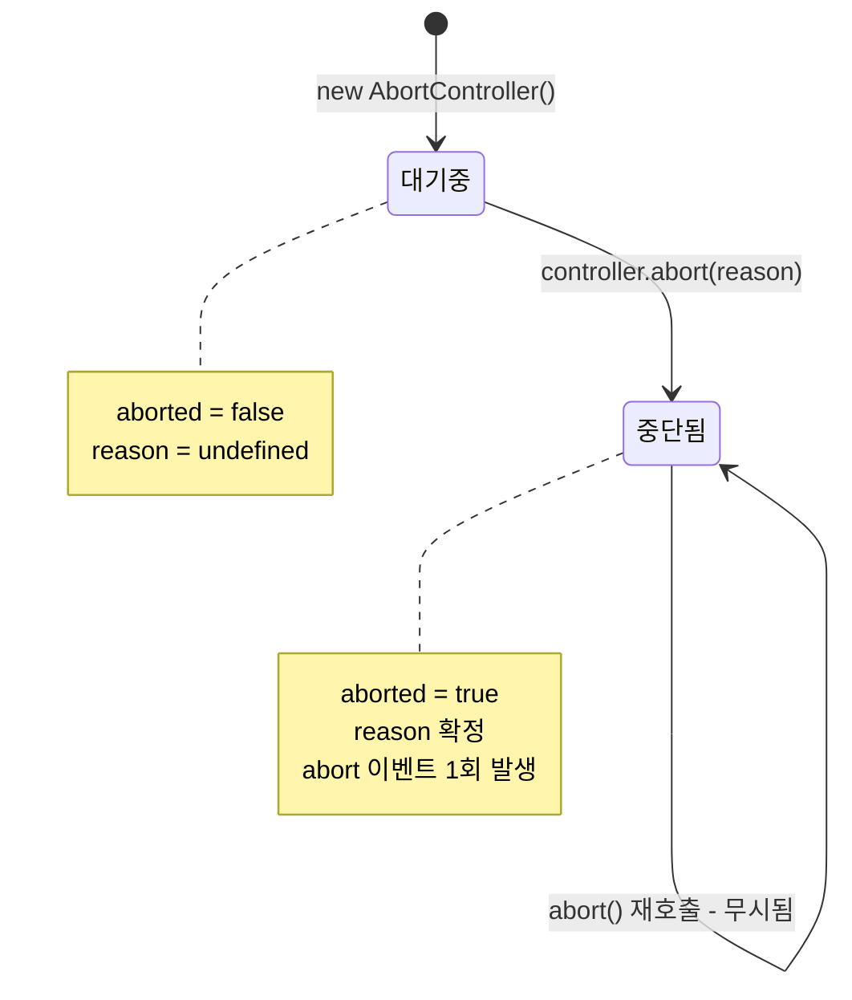
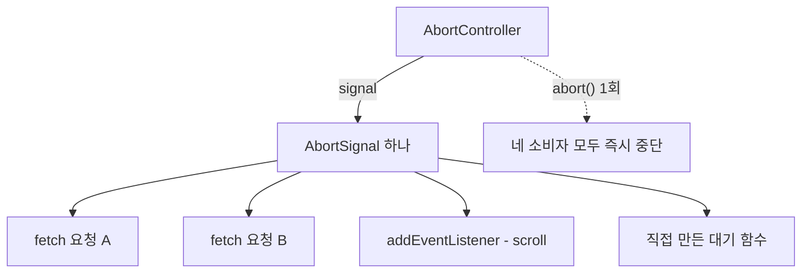
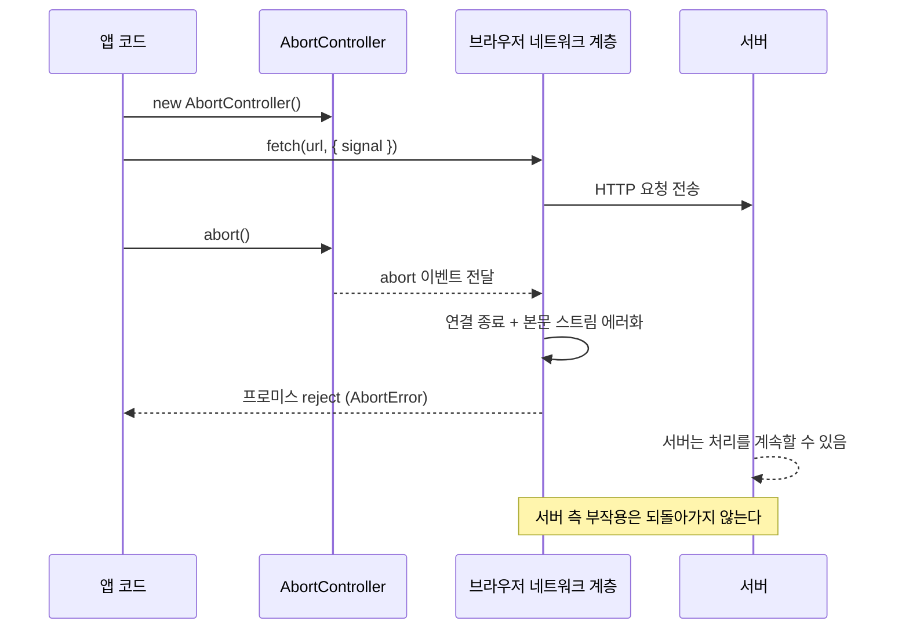

<Callout type="info">
  **이번 문서의 목표:** 이 파일을 다 읽으면 "이미 시작된 비동기 작업을 어떻게 멈추는가"라는 질문에, AbortController 하나로 fetch·이벤트 구독·타이머·직접 만든 async 함수의 수명을 일괄 관리하는 답을 설계할 수 있게 된다.
</Callout>

## 1. 왜 취소가 필요한가 — 프로미스는 되돌릴 수 없다

검색창에 사용자가 "서"를 입력하면 서버에 요청을 보냅니다. 0.2초 뒤 "서울"을 입력하면 또 보냅니다. 다시 0.2초 뒤 "서울역"까지 치면 세 번째 요청이 나갑니다. 그런데 첫 번째 요청이 네트워크 사정으로 가장 늦게 도착한다면? 화면에는 "서울역" 검색 결과 위에 "서"의 검색 결과가 덮어씌워집니다. 이것이 프론트엔드에서 가장 흔한 경합 상태(race condition, 레이스 컨디션) 버그입니다.

이 문제를 근본적으로 막으려면 **이미 출발한 요청을 취소**할 수 있어야 합니다. 그런데 자바스크립트(JavaScript)의 프로미스(Promise, 약속 객체)에는 취소 기능이 없습니다. 프로미스는 "언젠가 결과가 나올 자리를 미리 잡아둔 표"일 뿐이고, 표를 찢는다고 이미 시작된 요리가 멈추지는 않습니다. `then`을 걸지 않고 무시할 수는 있어도, 실제 네트워크 연결·서버 부하·응답 파싱 비용은 그대로 발생합니다.

> **쉽게 말하면:** 프로미스는 "결과를 받을 영수증"이고, 취소는 "주방에 조리 중단을 알리는 벨"입니다. 영수증을 버려도 벨을 누르지 않으면 요리는 계속됩니다.

그래서 브라우저 플랫폼은 프로미스와 **별도로** 취소 신호를 흘려보내는 통로를 만들었습니다. 그것이 DOM 표준(DOM Living Standard)에 정의된 **AbortController**(어보트 컨트롤러, 중단 제어기)와 **AbortSignal**(어보트 시그널, 중단 신호)입니다. 이름에 "Promise"가 들어가지 않는 것에 주목하세요 — 취소는 프로미스의 기능이 아니라, **비동기 작업을 시작할 때 함께 건네주는 별도 채널**입니다.

## 2. 구조 — 리모컨과 수신기

AbortController와 AbortSignal은 항상 한 쌍입니다. 컨트롤러를 하나 만들면 그 안에 신호 객체가 하나 딸려 나옵니다.

```js
const 컨트롤러 = new AbortController();
const 신호 = 컨트롤러.signal;   // AbortSignal 인스턴스 (읽기 전용)

컨트롤러.abort();               // 신호를 "중단됨" 상태로 전환
```

> **쉽게 말하면:** 컨트롤러는 **버튼이 달린 리모컨**, 시그널은 **버튼이 없는 수신기**입니다. 취소를 실행할 권한은 리모컨을 쥔 쪽에만 있고, 작업을 수행하는 쪽에는 수신기만 넘겨줍니다.

이 비대칭이 설계의 핵심입니다. `fetch`에 시그널만 넘기기 때문에, `fetch` 내부 코드는 취소 여부를 **감지**할 수는 있어도 스스로 취소를 **발동**할 수는 없습니다. 권한을 나눠 가진 덕분에 신호를 여러 작업에 마음 놓고 뿌릴 수 있습니다.

### AbortSignal이 가진 것

| 멤버 | 종류 | 의미 |
|------|------|------|
| `aborted` | 불리언 속성 | 이미 중단되었는지 여부. 한 번 `true`가 되면 절대 되돌아가지 않는다 |
| `reason` | 값 속성 | 중단 사유. `abort()`에 인자를 주지 않으면 `AbortError` 이름의 `DOMException` |
| `abort` 이벤트 | 이벤트 | 중단 순간 시그널 위에서 한 번만 발생 |
| `throwIfAborted()` | 메서드 | 이미 중단됐으면 `reason`을 그대로 throw, 아니면 아무 일도 안 함 |
| `addEventListener` | 상속 메서드 | AbortSignal은 `EventTarget`을 상속하므로 이벤트 리스너를 붙일 수 있다 |

여기서 두 가지 성질을 반드시 기억해야 합니다.

1. **일방통행**: 시그널의 상태 전이는 "미중단 → 중단" 단 한 방향뿐입니다. 되돌리는 API는 없습니다. 그래서 한 번 쓴 컨트롤러는 재사용할 수 없고, 새 작업마다 새 컨트롤러를 만들어야 합니다.
2. **일회성 이벤트**: `abort` 이벤트는 최대 한 번만 발생합니다. 이미 중단된 시그널에 나중에 리스너를 붙이면 그 리스너는 **영원히 호출되지 않습니다.** 그래서 안전한 코드는 항상 `signal.aborted`를 먼저 확인하고, 아니면 리스너를 붙입니다.



### 신호가 퍼져나가는 그림

컨트롤러 하나에서 나온 시그널 하나를 여러 소비자에게 나눠줄 수 있습니다. `abort()` 한 번이면 모두가 동시에 중단됩니다.



이것이 AbortSignal의 진짜 가치입니다. 취소는 "요청 하나 끄기"가 아니라 "**어떤 작업 묶음의 수명을 한 손잡이로 잡는 일**"입니다.

## 3. 이벤트 리스너의 수명을 시그널로 묶기

`addEventListener`의 세 번째 인자인 옵션 객체에는 `signal` 속성을 넣을 수 있습니다. 시그널이 중단되면 브라우저가 **그 리스너를 자동으로 제거**합니다.

전통적인 방식과 비교해 보면 이득이 분명합니다.

```js
// 전통 방식 — 제거하려면 함수 참조를 그대로 들고 있어야 한다
function 스크롤핸들러() { /* ... */ }
window.addEventListener("scroll", 스크롤핸들러);
// 나중에
window.removeEventListener("scroll", 스크롤핸들러);  // 같은 참조여야만 제거됨
```

`removeEventListener`는 **등록할 때와 완전히 동일한 함수 참조**를 넘겨야 동작합니다. 익명 함수나 `bind`로 만든 함수를 등록했다면 사실상 제거할 방법이 없어 메모리 누수(memory leak)로 이어집니다. 시그널 방식은 참조를 보관할 필요가 없습니다.

```js
const 컨트롤러 = new AbortController();
const { signal } = 컨트롤러;

window.addEventListener("scroll", () => { /* 익명 함수여도 OK */ }, { signal });
window.addEventListener("resize", () => { /* ... */ }, { signal });
document.addEventListener("keydown", (e) => { /* ... */ }, { signal });

컨트롤러.abort();   // 세 리스너가 한꺼번에 사라진다
```

> **쉽게 말하면:** 리스너마다 열쇠를 하나씩 챙겨두는 대신, 방 전체에 **차단기 하나**를 달아두고 내릴 때 다 끄는 방식입니다.

아래 실습기에서 직접 확인해 보세요. 카운터가 올라가다가 중단 이후로는 완전히 멈춥니다.

<CodePlayground
  template="vanilla"
  activeFile="/index.js"
  showConsole
  label="AbortSignal로 여러 리스너를 한 번에 해제하기"
  files={{
    '/index.html': `<div id="app">
  <button id="세기">클릭하면 카운트 증가</button>
  <button id="중단">구독 전부 해제 (abort)</button>
  <p id="표시">클릭 수: 0</p>
</div>`,
    '/index.js': `const 컨트롤러 = new AbortController();
const { signal } = 컨트롤러;

let 클릭수 = 0;
const 표시 = document.getElementById("표시");

// 1. 익명 함수를 그대로 등록해도 나중에 제거할 수 있다
document.getElementById("세기").addEventListener(
  "click",
  () => {
    클릭수 += 1;
    표시.textContent = "클릭 수: " + 클릭수;
    console.log("클릭 처리됨:", 클릭수);
  },
  { signal }
);

// 2. 같은 시그널을 쓰는 두 번째 구독
document.addEventListener(
  "keydown",
  (e) => console.log("키 입력 감지:", e.key),
  { signal }
);

// 3. 시그널 자체에도 리스너를 붙일 수 있다 (정리 작업 자리)
signal.addEventListener("abort", () => {
  console.log("중단 사유:", signal.reason.name);
  console.log("이제 위의 두 리스너는 자동 제거되었습니다.");
});

document.getElementById("중단").addEventListener("click", () => {
  if (signal.aborted) {
    console.log("이미 중단된 컨트롤러입니다. 재사용은 불가능합니다.");
    return;
  }
  컨트롤러.abort();
});

console.log("초기 aborted 상태:", signal.aborted);`,
  }}
/>

중단 버튼을 두 번 눌러보세요. 두 번째부터는 "이미 중단됨" 메시지만 나옵니다. **컨트롤러는 재사용 불가**라는 성질을 몸으로 확인하는 지점입니다.

## 4. fetch와의 결합 — 취소는 어떤 얼굴로 나타나는가

`fetch`의 두 번째 인자에 `signal`을 넣으면 그 요청은 시그널에 묶입니다.

```js
const 컨트롤러 = new AbortController();

fetch("/api/검색?q=서울", { signal: 컨트롤러.signal })
  .then((응답) => 응답.json())
  .then((데이터) => console.log(데이터))
  .catch((에러) => {
    if (에러.name === "AbortError") {
      console.log("사용자가 다시 입력해서 취소된 요청입니다.");
      return;                       // 정상 흐름 — 에러 화면을 띄우면 안 된다
    }
    console.error("진짜 실패:", 에러);
  });

컨트롤러.abort();
```

취소된 `fetch`의 프로미스는 **거부**(reject, 리젝트)됩니다. 성공도 실패도 아닌 제3의 상태로 남는 것이 아니라, `AbortError`라는 `name`을 가진 `DOMException` 객체를 사유로 거부되는 것입니다. 이 설계 때문에 반드시 알아야 할 점이 하나 있습니다.

<Callout type="warning">
  **자주 틀리는 점:** 취소를 "에러"로 취급해 사용자에게 오류 토스트를 띄우는 코드입니다. 취소는 **우리가 의도해서 일으킨 정상 흐름**입니다. `catch` 블록 맨 앞에서 `error.name === "AbortError"`를 걸러내고 조용히 빠져나가야 합니다. 반대로 `catch`를 통째로 비워두면 진짜 네트워크 실패까지 삼켜버립니다.
</Callout>

### 취소된 요청은 어디까지 되돌아가는가

여기서 스펙 수준의 오해를 하나 풀어야 합니다. `abort()`가 호출되면 브라우저는 다음을 수행합니다.

1. 진행 중인 요청을 **fetch 컨트롤러 종료** 절차로 넘겨 네트워크 연결을 끊습니다.
2. 아직 응답 본문을 읽는 중이었다면 그 **ReadableStream을 에러 상태로** 만듭니다.
3. `fetch`가 반환한 프로미스를 시그널의 `reason`으로 거부합니다.

하지만 **서버가 이미 받은 요청을 되돌리지는 못합니다.** 요청이 서버에 도달한 뒤에 취소했다면, 서버는 그대로 처리를 마치고 응답을 보냅니다 — 다만 브라우저가 그 응답을 버릴 뿐입니다. 그래서 결제 요청처럼 부작용이 있는 작업은 `abort()`로 "없던 일"이 되지 않습니다. 취소는 **클라이언트 쪽의 관심 철회**이지, 분산 트랜잭션 롤백이 아닙니다.

> **쉽게 말하면:** 배달 앱에서 주문 취소를 눌러도, 이미 조리를 시작한 주방은 음식을 완성합니다. 다만 내가 받지 않을 뿐입니다.



## 5. 타임아웃과 신호 합성 — 표준이 제공하는 조립 부품

### AbortSignal.timeout()

일정 시간이 지나면 자동으로 중단되는 시그널을 만듭니다. 컨트롤러를 만들고 `setTimeout`으로 `abort()`를 부르는 수고를 대신합니다.

```js
// 5초 안에 응답이 없으면 자동 취소
fetch("/api/느린엔드포인트", { signal: AbortSignal.timeout(5000) });
```

중요한 차이가 하나 있습니다. 직접 `abort()`한 경우의 사유는 `AbortError`이지만, `AbortSignal.timeout()`이 발동시킨 사유는 **`TimeoutError`**라는 다른 이름의 `DOMException`입니다. 덕분에 "사용자가 취소한 것"과 "시간이 초과된 것"을 코드에서 구분할 수 있습니다. 타임아웃은 사용자에게 알려야 하는 실패이고, 사용자 취소는 조용히 넘어갈 정상 흐름이니까요.

또 하나, 타이머는 **문서가 화면에 보이지 않는 동안 멈추지 않습니다.** 이 타임아웃은 백그라운드 탭에서도 정상적으로 발동합니다.

### AbortSignal.any()

여러 시그널을 묶어, **그중 하나라도 중단되면 함께 중단되는** 새 시그널을 만듭니다. 논리 연산의 OR에 해당합니다.

```js
const 사용자취소 = new AbortController();

const 합성신호 = AbortSignal.any([
  사용자취소.signal,             // 사용자가 취소 버튼을 누르면
  AbortSignal.timeout(3000),     // 또는 3초가 지나면
  화면떠남컨트롤러.signal,        // 또는 페이지를 떠나면
]);

fetch("/api/데이터", { signal: 합성신호 });
```

> **쉽게 말하면:** 여러 개의 비상정지 버튼을 하나의 회로에 병렬로 연결하는 것입니다. 아무 버튼이나 눌리면 기계가 섭니다.

합성 시그널의 `reason`은 **가장 먼저 중단된 원본 시그널의 reason**을 그대로 물려받습니다. 그래서 위 코드에서 3초가 먼저 지나면 `reason.name`은 `TimeoutError`이고, 사용자가 먼저 누르면 `AbortError`입니다. 원인 추적이 끊기지 않습니다.

### AbortSignal.abort()

처음부터 이미 중단된 상태인 시그널을 즉시 만듭니다. "이 조건이면 아예 요청을 보내지 않는다"를 분기문 없이 표현할 때 씁니다.

```js
const 신호 = 캐시에있음 ? AbortSignal.abort() : 컨트롤러.signal;
```

## 6. 내가 만든 비동기 함수도 취소 가능하게 만들기

표준 API만 취소를 지원하면 반쪽입니다. 직접 만든 함수도 같은 규약을 따르게 하려면 **시그널을 인자로 받고, 세 지점에서 확인**하면 됩니다.

<Steps>

### 시작 직전에 확인한다

함수에 들어오자마자 이미 중단된 시그널이라면 아무 작업도 시작하지 않고 즉시 던집니다. `signal.throwIfAborted()` 한 줄이면 됩니다.

### 실행 도중 이벤트를 듣는다

오래 걸리는 대기라면 `abort` 이벤트를 듣고 진행 중인 타이머나 루프를 정리합니다.

### `await` 뒤에서 다시 확인한다

`await`로 제어를 넘긴 사이에 중단이 일어났을 수 있습니다. 재개 직후 다시 확인해야 이미 취소된 작업이 뒤늦게 화면을 갱신하는 사고를 막습니다.

</Steps>

아래 실습기는 이 규약을 따르는 "취소 가능한 지연" 함수와, `await` 뒤 재확인을 빠뜨렸을 때 벌어지는 일을 나란히 보여줍니다.

<CodePlayground
  template="vanilla"
  activeFile="/index.js"
  showConsole
  label="취소 가능한 async 함수 만들기 — throwIfAborted와 await 뒤 재확인"
  files={{
    '/index.html': `<div id="app">
  <button id="시작">3단계 작업 시작 (각 1초)</button>
  <button id="취소">취소</button>
  <p id="상태">대기 중</p>
</div>`,
    '/index.js': `// 취소 가능한 setTimeout — 표준 규약을 따르는 사용자 정의 비동기 함수
function 기다리기(밀리초, signal) {
  return new Promise((resolve, reject) => {
    // (1) 시작 직전 확인 — 이미 중단이면 타이머조차 만들지 않는다
    if (signal.aborted) return reject(signal.reason);

    const 타이머 = setTimeout(() => {
      signal.removeEventListener("abort", 중단시);
      resolve();
    }, 밀리초);

    function 중단시() {
      clearTimeout(타이머);      // 자원 정리가 핵심
      reject(signal.reason);
    }

    // (2) 실행 도중 중단 감지
    signal.addEventListener("abort", 중단시, { once: true });
  });
}

const 상태 = document.getElementById("상태");
let 컨트롤러 = null;

async function 세단계작업(signal) {
  for (let 단계 = 1; 단계 <= 3; 단계 += 1) {
    signal.throwIfAborted();          // 매 단계 시작 전 확인
    상태.textContent = 단계 + "단계 진행 중...";
    console.log(단계 + "단계 시작");

    await 기다리기(1000, signal);

    // (3) await 뒤 재확인 — 이 줄이 없으면 취소 후에도 아래가 실행될 수 있다
    signal.throwIfAborted();
    console.log(단계 + "단계 완료");
  }
  상태.textContent = "전부 완료!";
}

document.getElementById("시작").addEventListener("click", async () => {
  컨트롤러 = new AbortController();     // 매번 새로 만든다 (재사용 불가)
  try {
    await 세단계작업(컨트롤러.signal);
  } catch (에러) {
    if (에러.name === "AbortError") {
      상태.textContent = "취소되었습니다.";
      console.log("정상 취소 — 오류 화면을 띄우지 않습니다.");
    } else {
      console.error("진짜 실패:", 에러);
    }
  }
});

document.getElementById("취소").addEventListener("click", () => {
  if (컨트롤러) 컨트롤러.abort();
});`,
  }}
/>

시작을 누르고 1.5초쯤에 취소를 눌러보세요. 콘솔에 "2단계 시작"이 찍히지 않고 즉시 취소로 빠지는 것을 볼 수 있습니다. `기다리기` 안에서 `clearTimeout`을 부르지 않았다면 타이머가 살아남아 1초 뒤 헛되이 깨어났을 것입니다.

## 7. 실전 패턴 — 검색창 경합 상태 잡기

맨 처음 문제로 돌아갑시다. 새 입력이 들어올 때마다 **이전 컨트롤러를 중단하고 새 컨트롤러를 만드는** 것이 정석입니다.

```js
let 진행중컨트롤러 = null;

async function 검색(질의어) {
  진행중컨트롤러?.abort();                 // 이전 요청 폐기
  진행중컨트롤러 = new AbortController();  // 새 컨트롤러 (재사용 금지)

  try {
    const 응답 = await fetch(
      "/api/검색?q=" + encodeURIComponent(질의어),
      { signal: AbortSignal.any([진행중컨트롤러.signal, AbortSignal.timeout(5000)]) }
    );
    const 결과 = await 응답.json();
    화면갱신(결과);                        // 살아남은 요청만 여기 도달
  } catch (에러) {
    if (에러.name === "AbortError") return;          // 덮어쓰기된 요청 — 무시
    if (에러.name === "TimeoutError") {
      알림("검색이 지연되고 있습니다.");
      return;
    }
    throw 에러;
  }
}
```

이 구조의 우아한 점은 **화면 갱신 코드가 오직 한 군데**라는 것입니다. 응답 순서를 비교하거나 요청 번호를 세는 로직이 필요 없습니다. 취소된 요청은 `catch`로 빠지므로 `화면갱신`에 도달할 수 없기 때문입니다.

같은 패턴은 컴포넌트 수명 관리에도 그대로 적용됩니다. 화면이 사라질 때 컨트롤러를 `abort()`하면, 그 화면이 걸어둔 fetch·리스너·타이머가 한 번에 정리됩니다.

## 8. 자주 틀리는 점 모음

<Callout type="warning">
  **① 컨트롤러 재사용.** 한 번 `abort()`한 컨트롤러의 시그널은 영원히 중단 상태입니다. 그 시그널로 새 `fetch`를 걸면 요청이 나가지도 못하고 즉시 거부됩니다. 작업 단위마다 새로 만드세요.
</Callout>

<Callout type="warning">
  **② 이미 중단된 시그널에 리스너 붙이기.** `abort` 이벤트는 과거에 이미 지나갔으므로 다시 발생하지 않습니다. 반드시 `if (signal.aborted) { 즉시처리 } else { addEventListener }` 순서로 쓰거나, `throwIfAborted()`를 활용하세요.
</Callout>

<Callout type="warning">
  **③ `await` 뒤 확인 누락.** 취소했는데도 이미 진행 중이던 `await`가 정상 완료되면, 그 아래 줄은 그대로 실행됩니다. 중단된 작업이 화면을 갱신하는 유령 버그의 원인입니다.
</Callout>

<Callout type="warning">
  **④ 정리 작업 빠뜨리기.** `abort` 리스너에서 `clearTimeout`·`clearInterval`·`observer.disconnect()` 같은 실제 해제를 하지 않으면, 프로미스만 거부될 뿐 자원은 계속 살아 있습니다. 취소는 "약속을 깨는 일"이 아니라 "자원을 반납하는 일"입니다.
</Callout>

<Callout type="warning">
  **⑤ 부작용까지 취소된다고 믿기.** 앞서 본 대로 서버는 이미 받은 요청을 처리합니다. 되돌려야 하는 작업이라면 서버에 별도의 취소·보상 엔드포인트가 필요합니다.
</Callout>

## 핵심 정리

- 프로미스는 취소할 수 없으므로, 브라우저는 **별도의 신호 채널**로 AbortController/AbortSignal을 제공한다. 컨트롤러는 리모컨, 시그널은 수신기다.
- 시그널의 상태 전이는 "미중단 → 중단" **일방통행**이고 `abort` 이벤트는 **한 번만** 발생한다. 따라서 컨트롤러는 재사용할 수 없다.
- `addEventListener`의 `signal` 옵션으로 리스너 수명을 묶으면, 함수 참조를 보관하지 않고도 구독을 일괄 해제할 수 있다.
- 취소된 `fetch`는 `AbortError` 이름의 `DOMException`으로 **거부**된다. 이는 에러가 아니라 정상 흐름이므로 `catch`에서 걸러내야 한다.
- `AbortSignal.timeout()`은 `TimeoutError`로 구분되며, `AbortSignal.any()`로 여러 취소 조건을 OR로 합성할 수 있다.
- 직접 만든 비동기 함수는 **시작 전·실행 중·`await` 뒤** 세 지점에서 시그널을 확인하고, 실제 자원을 해제해야 규약을 지킨 것이다.

## 마무리 복습

<Quiz
  questionNumber={1}
  question="AbortController와 AbortSignal의 역할 분담을 가장 정확히 설명한 것은?"
  options={['컨트롤러는 취소를 발동하고, 시그널은 취소 여부를 알리는 읽기 전용 통로다', '시그널이 취소를 발동하고 컨트롤러는 결과를 받는다', '둘 다 abort 메서드를 가지고 있어 어느 쪽에서든 취소할 수 있다', '컨트롤러는 프로미스를 감싸는 래퍼이고 시그널은 그 결과값이다']}
  correctAnswer={1}
  explanation="컨트롤러만 abort 메서드를 가지며 시그널에는 발동 권한이 없다. 작업 수행자에게는 시그널만 넘겨 취소 권한과 감지 권한을 분리한다."
  optionExplanations={['정답 — 리모컨과 수신기의 관계다', '역할이 반대로 서술되었다', '시그널에는 abort 메서드가 없다', '컨트롤러는 프로미스와 무관한 별도 신호 채널이다']}
/>

<Quiz
  questionNumber={2}
  question="이미 abort 된 컨트롤러의 시그널로 새 fetch를 실행하면 어떻게 되는가?"
  options={['시그널이 자동으로 초기화되어 정상 요청된다', '요청이 실제로 나가지 못하고 즉시 거부된다', '시그널이 무시되고 취소 불가능한 요청이 된다', '두 번째 abort 호출 전까지는 정상 동작한다']}
  correctAnswer={2}
  explanation="시그널의 상태 전이는 일방통행이며 되돌릴 수 없다. 중단 상태의 시그널을 넘기면 fetch는 시작하지 못하고 곧바로 reason으로 거부된다. 그래서 작업마다 새 컨트롤러를 만들어야 한다."
  optionExplanations={['초기화하는 API 자체가 존재하지 않는다', '정답 — 컨트롤러 재사용 금지의 이유다', '시그널은 무시되지 않고 즉시 적용된다', 'abort 재호출은 아무 효과가 없다']}
/>

<Quiz
  questionNumber={3}
  question="addEventListener의 signal 옵션이 removeEventListener보다 유리한 가장 큰 이유는?"
  options={['이벤트 처리 속도가 더 빠르다', '등록한 함수의 참조를 따로 보관하지 않아도 되고 여러 구독을 한 번에 해제할 수 있다', '캡처 단계에서도 동작하기 때문이다', '이벤트 버블링을 막아주기 때문이다']}
  correctAnswer={2}
  explanation="removeEventListener는 등록 시와 동일한 함수 참조를 요구해 익명 함수는 사실상 제거가 불가능하다. signal 옵션은 참조 보관 없이, 여러 리스너를 abort 한 번으로 정리한다."
  optionExplanations={['성능 차이가 목적이 아니다', '정답 — 참조 보관 부담을 없애고 일괄 해제가 가능하다', '캡처 여부는 capture 옵션이 담당한다', '전파 제어와는 무관하다']}
/>

<Quiz
  questionNumber={4}
  question="AbortSignal.timeout(3000)으로 취소된 fetch의 에러 name 값으로 알맞은 것은?"
  options={['AbortError', 'TimeoutError', 'NetworkError', 'TypeError']}
  correctAnswer={2}
  explanation="직접 abort를 호출하면 AbortError지만, timeout이 발동시킨 사유는 TimeoutError라는 별도 이름의 DOMException이다. 덕분에 사용자 취소와 시간 초과를 코드에서 구분할 수 있다."
  optionExplanations={['개발자가 직접 abort를 호출했을 때의 이름이다', '정답 — 시간 초과는 별도 이름으로 구분된다', 'fetch가 네트워크 실패에 쓰는 이름이 아니다', 'TypeError는 잘못된 인자나 네트워크 실패 시 나타난다']}
/>

<Quiz
  questionNumber={5}
  question="AbortSignal.any 로 만든 합성 시그널의 reason에 대한 설명으로 옳은 것은?"
  options={['항상 새로 만들어진 AbortError가 된다', '가장 먼저 중단된 원본 시그널의 reason을 그대로 물려받는다', '모든 원본 시그널의 reason을 배열로 담는다', '원본 시그널이 전부 중단되어야만 값이 정해진다']}
  correctAnswer={2}
  explanation="any는 논리 OR처럼 동작해 하나라도 중단되면 함께 중단되며, 그때의 reason을 그대로 승계한다. 그래서 타임아웃인지 사용자 취소인지 원인 추적이 끊기지 않는다."
  optionExplanations={['원인 정보가 사라지므로 그렇게 설계되지 않았다', '정답 — 최초 중단 시그널의 reason을 승계한다', '배열이 아니라 단일 reason이다', '하나만 중단되어도 즉시 중단된다']}
/>

<Quiz
  questionNumber={6}
  question="await 로 대기한 뒤 signal.throwIfAborted() 를 다시 호출해야 하는 이유는?"
  options={['프로미스가 두 번 실행되는 것을 막기 위해', '대기하는 동안 중단이 일어났어도 재개된 코드는 그대로 실행되기 때문에', 'throwIfAborted는 한 번에 하나의 조건만 검사하기 때문에', 'await 가 시그널의 상태를 초기화하기 때문에']}
  correctAnswer={2}
  explanation="await 는 제어를 넘겼다가 돌려받을 뿐, 그 사이 중단이 일어났는지 스스로 확인하지 않는다. 재확인하지 않으면 취소된 작업이 뒤늦게 화면을 갱신하는 유령 버그가 생긴다."
  optionExplanations={['프로미스는 중복 실행되지 않는다', '정답 — 재개 지점마다 확인이 필요하다', '검사 개수와는 무관하다', 'await 는 시그널 상태를 건드리지 않는다']}
/>

<Quiz
  questionNumber={7}
  question="fetch를 abort 했을 때 실제로 보장되는 것은?"
  options={['서버가 이미 시작한 처리까지 취소된다', '데이터베이스에 반영된 변경이 자동으로 롤백된다', '브라우저가 연결을 끊고 본문 스트림을 에러 상태로 만들며 프로미스를 거부한다', '요청이 전송 전이었다면 응답이 캐시에서 대신 제공된다']}
  correctAnswer={3}
  explanation="abort는 클라이언트 측의 관심 철회다. 연결 종료, 본문 스트림 에러화, 프로미스 거부까지가 보장 범위이며 서버 측 부작용은 되돌아가지 않는다."
  optionExplanations={['서버는 받은 요청을 그대로 처리할 수 있다', '분산 트랜잭션 롤백 기능이 아니다', '정답 — 브라우저 측에서 일어나는 세 가지가 보장 범위다', '캐시 대체 동작은 존재하지 않는다']}
/>

<Quiz
  questionNumber={8}
  question="이미 중단된 시그널에 abort 이벤트 리스너를 나중에 붙였을 때의 동작은?"
  options={['즉시 한 번 호출된다', '다음 abort 호출 때 호출된다', '영원히 호출되지 않으므로 aborted 속성을 먼저 확인해야 한다', '예외가 발생한다']}
  correctAnswer={3}
  explanation="abort 이벤트는 중단 순간 단 한 번만 발생하고 지나간다. 나중에 붙은 리스너는 호출되지 않으므로 aborted 를 먼저 확인하거나 throwIfAborted 를 써야 한다."
  optionExplanations={['지나간 이벤트를 재생하지 않는다', 'abort 재호출 자체가 무시된다', '정답 — 일회성 이벤트의 대표적 함정이다', '예외는 발생하지 않고 조용히 무시된다']}
/>

## 참고 자료

- [DOM Living Standard - AbortController and AbortSignal](https://dom.spec.whatwg.org/#aborting-ongoing-activities)
- [MDN - AbortController](https://developer.mozilla.org/en-US/docs/Web/API/AbortController)
- [MDN - AbortSignal](https://developer.mozilla.org/en-US/docs/Web/API/AbortSignal)
- [Fetch Standard - Aborting a fetch](https://fetch.spec.whatwg.org/#aborting-a-fetch)
- [MDN - EventTarget.addEventListener (signal 옵션)](https://developer.mozilla.org/en-US/docs/Web/API/EventTarget/addEventListener)
