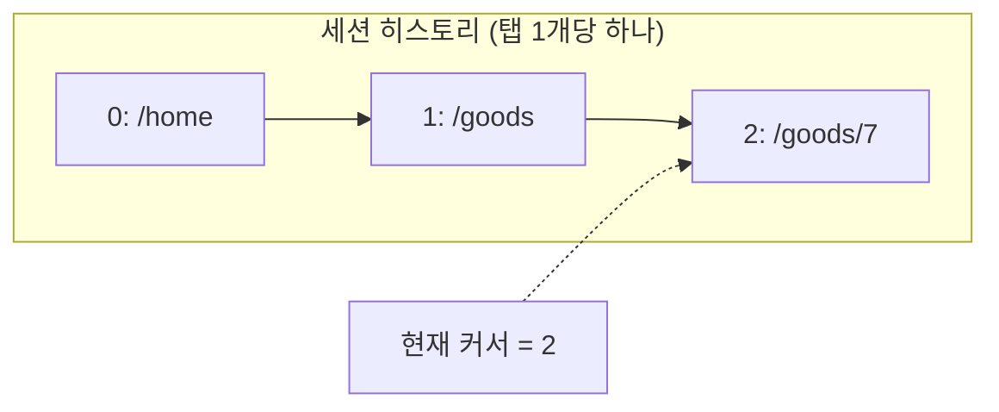
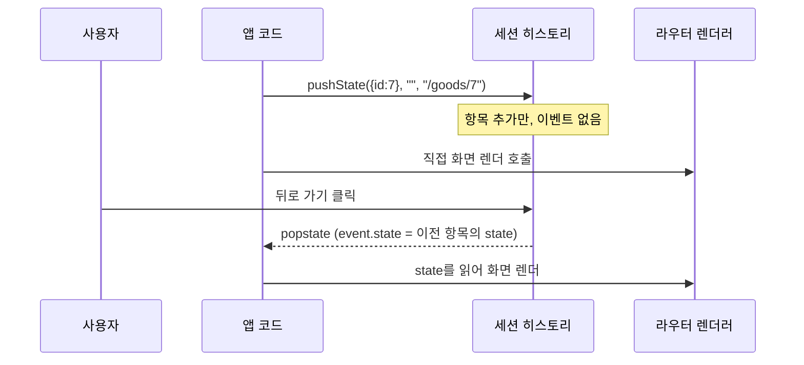

<Callout type="info">
  **이번 문서의 목표:** 이 파일을 다 읽으면 페이지를 새로 불러오지 않고 주소만 바꾸는 SPA 라우터의 내부 동작을 설명할 수 있고, `pushState`·`popstate`·`URLSearchParams`·`URLPattern`을 조합해 뒤로 가기가 정상 동작하는 라우팅을 직접 설계할 수 있게 된다.
</Callout>

## 1. 문제 상황 — 주소는 바꾸고 싶은데, 페이지는 새로 받기 싫다

전통적인 웹에서 링크를 클릭하면 브라우저가 서버에 새 문서를 요청하고, 받은 HTML로 화면 전체를 갈아엎습니다. 이 과정을 **내비게이션**(navigation, 문서 이동)이라고 부릅니다. 문제는 비용입니다. 헤더·사이드바처럼 바뀌지 않는 부분까지 버리고 다시 만들며, 그 사이 화면이 하얗게 비고, 자바스크립트(JavaScript) 실행 컨텍스트도 통째로 사라집니다.

그래서 SPA(Single Page Application, 단일 페이지 애플리케이션)는 문서를 처음 한 번만 받고 이후에는 필요한 부분만 자바스크립트로 갈아 끼웁니다. 그런데 이렇게만 하면 새로운 문제가 생깁니다.

- 주소창은 계속 첫 페이지 주소를 가리켜, 지금 화면을 **북마크하거나 공유할 수 없습니다.**
- 브라우저의 **뒤로 가기** 버튼을 누르면 사이트를 완전히 떠나버립니다.
- 새로고침하면 첫 화면으로 돌아갑니다.

> **쉽게 말하면:** 화면은 앱처럼 부드럽게 바뀌는데, 주소창은 그 변화를 하나도 모르는 상태입니다. **History API**(히스토리 API, 방문 기록 API)는 "화면 전환 없이 주소창과 방문 기록만 갱신하는" 권한을 자바스크립트에 열어주기 위해 존재합니다.

## 2. URL은 문자열이 아니라 구조체다

라우팅을 다루기 전에 URL부터 정확히 잡아야 합니다. **URL**(Uniform Resource Locator, 자원 위치 지정자)은 겉보기엔 한 줄의 문자열이지만, WHATWG URL 표준이 정의한 **구조를 가진 값**입니다. 문자열 자르기로 다루면 반드시 깨집니다.

```
https://shop.example.com:8443/goods/list?page=2&sort=price#reviews
└─┬──┘  └────────┬───────┘└┬─┘└───┬────┘└───────┬────────┘└──┬───┘
protocol       hostname   port  pathname      search        hash
└──────────────────┬──────────┘
                 origin
```

각 조각의 뜻은 이렇습니다.

- `protocol` (프로토콜, 통신 규약): `https:`처럼 **콜론까지 포함**합니다. `https`만 반환되지 않는 점이 함정입니다.
- `hostname` (호스트명): 서버의 이름. 포트가 붙은 `host`와 구분됩니다.
- `port` (포트, 접속 창구 번호): 기본 포트(http는 80, https는 443)면 빈 문자열입니다.
- `origin` (오리진, 출처): `프로토콜 + 호스트명 + 포트`의 조합. 브라우저 보안의 기준 단위이며 10편·13편·24편에서 계속 등장합니다.
- `pathname` (경로): 서버 안에서의 자원 위치. 항상 `/`로 시작합니다.
- `search` (검색 문자열, 쿼리 스트링): `?`부터 끝까지. **`?`를 포함**합니다.
- `hash` (해시, 프래그먼트): `#`부터 끝까지. 이 부분은 **서버로 전송되지 않습니다** — 문서 안 위치를 가리키는 브라우저 전용 표시이기 때문입니다.

> **쉽게 말하면:** URL은 "어느 나라(origin), 어느 건물(pathname), 어떤 조건으로(search), 그 안 몇 층(hash)"을 적은 주소 양식입니다. 양식의 칸을 손으로 세어 자르지 말고, 양식을 읽어주는 파서에게 맡기면 됩니다.

### URL 객체와 URLSearchParams

`new URL(주소, 기준주소)`는 문자열을 파싱해 위 조각들을 속성으로 노출합니다. 두 번째 인자 덕분에 상대 경로를 절대 경로로 해석하는 일도 공짜로 해결됩니다.

`URLSearchParams`(URL 검색 파라미터)는 쿼리 문자열 전용 컬렉션입니다. 인코딩·디코딩과 중복 키 처리를 표준 규칙대로 처리해 줍니다. 특히 값에 `&`나 공백, 한글이 들어갈 때 직접 문자열을 이어 붙이면 반드시 사고가 납니다.

아래에서 직접 값을 바꿔가며 관찰해 보세요. 외부 네트워크 없이 파싱만 하므로 그대로 실행됩니다.

<CodePlayground
  template="vanilla"
  activeFile="/index.js"
  showConsole
  label="URL과 URLSearchParams — 문자열 자르기를 대체하는 구조적 파싱"
  files={{
    '/index.js': `const 주소 = new URL(
  "https://shop.example.com:8443/goods/list?page=2&sort=price&tag=신상&tag=세일#reviews"
);

console.log("origin  :", 주소.origin);     // 보안의 기준 단위
console.log("protocol:", 주소.protocol);   // 콜론까지 포함된다
console.log("hostname:", 주소.hostname);
console.log("port    :", 주소.port);
console.log("pathname:", 주소.pathname);
console.log("search  :", 주소.search);     // 물음표까지 포함된다
console.log("hash    :", 주소.hash);       // 서버로 전송되지 않는 부분

console.log("---- URLSearchParams ----");
const 조건 = 주소.searchParams;
console.log("page       :", 조건.get("page"));
console.log("tag(첫 값) :", 조건.get("tag"));      // 중복 키는 첫 값만
console.log("tag(전부)  :", 조건.getAll("tag"));   // 전부 필요하면 getAll
console.log("없는 키    :", 조건.get("없음"));      // null (undefined 아님)
console.log("존재 확인  :", 조건.has("sort"));

console.log("---- 수정하면 URL도 함께 바뀐다 ----");
조건.set("page", "3");
조건.delete("tag");
조건.append("q", "겨울 코트 & 목도리");   // 공백과 앰퍼샌드가 자동 인코딩된다
console.log(주소.toString());

console.log("---- 상대 경로 해석 ----");
const 기준 = "https://shop.example.com/goods/list/";
console.log(new URL("../cart", 기준).href);
console.log(new URL("/help", 기준).href);
console.log(new URL("detail?id=7", 기준).href);

console.log("---- 문자열 붙이기가 위험한 이유 ----");
const 위험 = "/search?q=" + "a&b=해킹";              // 파라미터가 쪼개진다
const 안전 = "/search?" + new URLSearchParams({ q: "a&b=해킹" });
console.log("위험:", 위험);
console.log("안전:", 안전);`,
  }}
/>

<Callout type="warning">
  **자주 틀리는 점:** `URLSearchParams`의 `get`은 값이 없을 때 `null`을 돌려줍니다. `undefined`가 아니므로 기본값 처리에 `??`를 쓸 때 헷갈리지 않도록 주의하세요. 또 `get`은 **첫 번째 값만** 반환합니다. 체크박스처럼 같은 이름이 여러 번 오는 폼은 반드시 `getAll`을 써야 값이 유실되지 않습니다.
</Callout>

## 3. 세션 히스토리 — 브라우저가 들고 있는 스택

브라우저 탭 하나에는 **세션 히스토리**(session history, 세션 방문 기록)라는 목록이 있습니다. 뒤로/앞으로 버튼이 오가는 그 목록입니다. 구조는 배열에 가깝고, 지금 위치를 가리키는 커서가 하나 있습니다.



여기서 사용자가 뒤로 가기를 눌러 커서가 1로 이동한 뒤, 새 항목을 추가하면 어떻게 될까요? **커서 뒤쪽 항목은 전부 잘려나갑니다.** 브라우저 히스토리는 되돌아가서 다른 길을 택하면 원래 앞길이 사라지는 나뭇가지 구조가 아니라, **잘라내고 덧붙이는 선형 스택**입니다.

> **쉽게 말하면:** 등산 중 갈림길에서 되돌아 내려온 뒤 다른 길로 올라가면, 아까 올라갔던 길의 발자국은 지워집니다. 앞으로 가기 버튼이 회색으로 변하는 순간이 바로 이때입니다.

### History 인터페이스가 제공하는 것

| 멤버 | 하는 일 | 문서를 다시 불러오는가 |
|------|---------|------------------------|
| `history.length` | 세션 히스토리 항목 수 | – |
| `history.state` | 현재 항목에 붙은 상태 객체 | – |
| `history.pushState(state, "", url)` | 커서 뒤를 자르고 새 항목 추가 | 아니오 |
| `history.replaceState(state, "", url)` | 현재 항목을 교체 | 아니오 |
| `history.back()` / `forward()` | 커서를 한 칸 이동 | 경우에 따라 |
| `history.go(n)` | 커서를 n칸 이동 (`go(0)`은 새로고침) | 경우에 따라 |
| `history.scrollRestoration` | 뒤로 갈 때 스크롤 위치 복원 여부 | – |

`pushState`와 `replaceState`의 두 번째 인자는 원래 제목(title)을 위한 자리인데, 어떤 브라우저도 이 값을 쓰지 않습니다. 관례적으로 빈 문자열을 넘깁니다.

### pushState와 replaceState는 언제 갈리는가

- **pushState**: 사용자가 "새 화면으로 이동했다"고 느껴야 할 때. 뒤로 가기를 누르면 이전 화면으로 돌아가는 것이 자연스러운 경우입니다. 목록 → 상세 이동이 대표적입니다.
- **replaceState**: 주소는 갱신해야 하지만 히스토리에 남으면 곤란할 때. 검색어를 입력할 때마다 `pushState`를 하면, 뒤로 가기를 열 번 눌러야 검색창을 빠져나갈 수 있습니다. 필터·정렬·탭 전환 같은 "같은 화면의 상태 변화"는 `replaceState`가 맞습니다.

> **쉽게 말하면:** `pushState`는 앨범에 **새 사진을 추가**하는 것이고, `replaceState`는 **지금 사진을 다른 사진으로 갈아 끼우는** 것입니다.

### 상태 객체가 진짜로 하는 일

`pushState`의 첫 인자인 상태 객체는 **URL에 담기에는 지저분한 정보를 히스토리 항목에 몰래 붙여두는 주머니**입니다. 스크롤 위치, 열려 있던 아코디언 인덱스, 목록의 스크롤 오프셋 같은 것들이죠.

이 값은 URL과 달리 **구조화 복제 알고리즘**(structured clone algorithm)으로 직렬화되어 디스크에 저장됩니다. 그래서 두 가지 제약이 생깁니다.

1. 함수·DOM 노드·클래스 인스턴스처럼 복제할 수 없는 값은 넣을 수 없습니다 — 넣으면 `DataCloneError`가 납니다.
2. 크기 상한이 있습니다. 브라우저마다 다르지만 파이어폭스는 항목당 약 16MiB, 다른 브라우저도 유사한 제한을 둡니다. 상태 주머니에 API 응답 전체를 담는 것은 잘못된 사용입니다. **식별자만 담고 본문은 다시 조회**하는 것이 정석입니다.

<Callout type="warning">
  **자주 틀리는 점:** 상태 객체를 애플리케이션의 진짜 상태 저장소로 쓰는 것입니다. 사용자가 URL을 복사해 새 탭에 붙여넣으면 상태 객체는 `null`입니다. **URL에 담긴 정보만이 공유 가능한 상태**이고, 상태 객체는 어디까지나 "같은 세션에서 돌아왔을 때의 사용성 보조"입니다.
</Callout>

## 4. popstate — 언제 발생하고, 언제 발생하지 않는가

여기가 History API에서 가장 많이 틀리는 지점입니다.

<Callout type="info">
  **`pushState`와 `replaceState`는 `popstate` 이벤트를 발생시키지 않습니다.** `popstate`는 오직 **히스토리 항목 사이를 이동할 때**만 발생합니다.
</Callout>

왜 이렇게 설계했을까요? `pushState`를 호출한 쪽은 **자기가 무슨 화면으로 가려는지 이미 알고 있기** 때문입니다. 알고 있는 정보를 이벤트로 되돌려 받으면 화면 렌더가 두 번 일어나거나 무한 루프에 빠지기 쉽습니다. 그래서 스펙은 역할을 이렇게 나눕니다.

- 내 코드가 일으킨 이동 → **직접 화면을 그린다** (이벤트 없음)
- 브라우저·사용자가 일으킨 이동 → **`popstate`를 받아 화면을 그린다**

`popstate`가 발생하는 경우는 다음과 같습니다.

- 사용자가 뒤로/앞으로 버튼을 누를 때
- `history.back()`, `forward()`, `go(n)`을 호출할 때 (n이 0이 아닐 때)
- 히스토리 항목을 오가는 동안 해시만 달라졌을 때 (이때는 `hashchange`도 함께 발생)



이 그림에서 라우터 구현의 규칙이 그대로 도출됩니다. **화면을 그리는 함수는 하나로 만들고, `pushState` 직후와 `popstate` 리스너 안에서 각각 호출**합니다. 그래야 어떤 경로로 들어오든 화면이 동일하게 재구성됩니다.

### 첫 진입 항목에는 state가 없다

페이지를 처음 열었을 때의 히스토리 항목은 `history.state`가 `null`입니다. 여기서 다른 화면으로 `pushState`한 뒤 뒤로 가기를 누르면, `popstate`의 `event.state`가 `null`로 들어와 라우터가 "그릴 화면이 없다"며 멈추는 사고가 흔합니다.

해결책은 앱이 시작하자마자 **현재 항목에 `replaceState`로 상태를 심어두는 것**입니다.

```js
// 앱 부팅 시 딱 한 번 — 첫 항목에도 상태를 부여한다
history.replaceState({ 화면: "홈", 스크롤: 0 }, "", location.href);
```

### 스크롤 복원 제어

브라우저는 뒤로 갈 때 이전 스크롤 위치를 자동으로 복원합니다. 그런데 SPA에서는 화면 내용이 비동기로 채워지므로, 복원 시점에 아직 콘텐츠가 없어 엉뚱한 위치로 튀는 일이 생깁니다. 이럴 때 자동 복원을 끄고 직접 관리합니다.

```js
if ("scrollRestoration" in history) {
  history.scrollRestoration = "manual";   // 기본값은 "auto"
}
```

끄기로 했다면 스크롤 위치를 **직접 상태 객체에 저장하고 복원하는 책임**을 져야 합니다. 켠 채로 두는 것보다 나쁜 결과가 나오기 쉬우니, 실제로 관리할 자신이 있을 때만 바꾸세요.

## 5. 해시 기반 라우팅 — 가장 오래된, 그리고 여전히 유효한 방법

`pushState`가 표준화되기 전에는 `#` 뒤를 바꾸는 방식으로 라우팅했습니다. 해시는 서버로 전송되지 않고 문서를 다시 불러오지도 않기 때문에, 자바스크립트가 마음대로 바꿀 수 있는 유일한 URL 조각이었습니다. 해시가 바뀌면 `hashchange` 이벤트가 발생합니다.

이 방식은 지금도 두 상황에서 쓸모가 있습니다. 첫째, **서버 설정을 바꿀 수 없을 때**입니다. `pushState`로 `/goods/7`을 만들어두면, 사용자가 그 주소에서 새로고침할 때 서버가 `/goods/7`에 해당하는 파일을 찾다가 404를 냅니다. SPA를 제대로 배포하려면 모든 경로를 `index.html`로 돌려주는 서버 설정(폴백)이 필요한데, 정적 호스팅에서는 그게 불가능할 수 있습니다. 해시 라우팅은 서버가 항상 `/`만 보므로 설정이 필요 없습니다. 둘째, **다른 문서 안에 끼워지는 위젯**처럼 경로를 소유하지 못하는 상황입니다.

아래 실습기로 해시 라우터의 뼈대를 직접 조작해 보세요. 링크를 눌러 화면이 바뀌는 것과, 이벤트가 어떤 순서로 오는지 콘솔에서 확인할 수 있습니다.

<CodePlayground
  template="vanilla"
  activeFile="/index.js"
  showConsole
  label="hashchange로 만든 최소 라우터 — 문서 재요청 없이 화면 전환"
  files={{
    '/index.html': `<div id="app">
  <nav>
    <a href="#/home">홈</a> |
    <a href="#/goods">상품 목록</a> |
    <a href="#/goods/7?tab=review">상품 7 리뷰 탭</a> |
    <a href="#/없는경로">없는 경로</a>
  </nav>
  <hr />
  <div id="화면">불러오는 중...</div>
  <p id="기록">이동 횟수: 0</p>
</div>`,
    '/index.js': `const 화면 = document.getElementById("화면");
const 기록 = document.getElementById("기록");
let 이동횟수 = 0;

// 경로 문자열 하나를 구조체로 파싱한다.
// location.hash 는 "#/goods/7?tab=review" 형태이므로 앞의 # 을 떼고 URL 로 만든다.
function 경로파싱() {
  const 원본 = location.hash.slice(1) || "/home";
  const 가짜주소 = new URL(원본, "https://example.com");
  return {
    경로: 가짜주소.pathname,
    조건: Object.fromEntries(가짜주소.searchParams.entries()),
  };
}

// 화면을 그리는 함수는 반드시 하나로 유지한다.
function 렌더() {
  const { 경로, 조건 } = 경로파싱();
  const 조각 = 경로.split("/").filter(Boolean);

  if (경로 === "/home") {
    화면.innerHTML = "<h2>홈</h2><p>첫 화면입니다.</p>";
  } else if (조각[0] === "goods" && 조각.length === 1) {
    화면.innerHTML = "<h2>상품 목록</h2><p>목록 화면입니다.</p>";
  } else if (조각[0] === "goods" && 조각.length === 2) {
    const 탭 = 조건.tab || "info";
    화면.innerHTML =
      "<h2>상품 상세</h2><p>상품 번호: " + 조각[1] + "</p><p>선택된 탭: " + 탭 + "</p>";
  } else {
    화면.innerHTML = "<h2>404</h2><p>알 수 없는 경로: " + 경로 + "</p>";
  }

  console.log("렌더 실행 - 경로:", 경로, "조건:", 조건);
}

// 브라우저가 일으킨 이동은 이벤트로 받아서 같은 렌더 함수를 부른다.
window.addEventListener("hashchange", () => {
  이동횟수 += 1;
  기록.textContent = "이동 횟수: " + 이동횟수;
  console.log("hashchange 발생");
  렌더();
});

// 첫 진입 시에도 한 번 그려야 화면이 빈 채로 남지 않는다.
렌더();
console.log("초기 history.length:", history.length);
console.log("초기 history.state:", history.state);`,
  }}
/>

"없는 경로"까지 눌러본 뒤 브라우저 뒤로 가기를 눌러보세요. 방문했던 해시를 거꾸로 되짚으며 같은 렌더 함수가 다시 호출되는 것을 볼 수 있습니다. **경로 → 화면**이라는 단방향 함수 하나만 유지하면 라우터의 절반은 완성입니다.

## 6. History API 기반 라우터의 뼈대

해시 대신 실제 경로를 쓰는 라우터는 세 가지를 더 처리해야 합니다.

<Steps>

### 링크 클릭을 가로챈다

`a` 요소의 기본 동작은 문서 재요청입니다. 클릭 이벤트에서 `preventDefault()`를 호출하고 대신 `pushState`를 부릅니다. 단, 외부 도메인 링크, `target="_blank"`, 사용자가 Ctrl이나 Command를 누른 채 클릭한 경우, 마우스 가운데 버튼 클릭은 **가로채면 안 됩니다.** 새 탭으로 열려는 사용자의 의도를 뺏는 것이기 때문입니다.

### pushState 직후 직접 렌더한다

`pushState`는 이벤트를 발생시키지 않으므로 렌더 함수를 손으로 호출합니다.

### popstate에서 같은 렌더 함수를 호출한다

뒤로/앞으로에 대응합니다. `event.state`가 있으면 활용하고, 없으면 `location`을 다시 파싱해 복구합니다.

</Steps>

```js
function 이동(경로, 상태 = {}) {
  history.pushState(상태, "", 경로);   // 주소만 갱신 (이벤트 없음)
  렌더();                              // 그래서 직접 그린다
}

document.addEventListener("click", (e) => {
  const 링크 = e.target.closest("a");
  if (!링크) return;

  // 가로채면 안 되는 클릭들을 먼저 걸러낸다
  if (링크.target === "_blank" || 링크.hasAttribute("download")) return;
  if (e.metaKey || e.ctrlKey || e.shiftKey || e.altKey) return;
  if (e.button !== 0) return;

  const 목적지 = new URL(링크.href, location.href);
  if (목적지.origin !== location.origin) return;   // 외부 사이트는 브라우저에 맡긴다

  e.preventDefault();
  이동(목적지.pathname + 목적지.search);
});

window.addEventListener("popstate", (e) => {
  console.log("popstate 상태:", e.state);
  렌더();                              // 이번엔 이벤트를 받아 그린다
});
```

### 보안 제약 — 아무 주소나 쓸 수 있는 것은 아니다

`pushState`의 URL 인자는 **현재 문서와 동일 출처**(same-origin)여야 합니다. 다른 도메인 주소를 넣으면 `SecurityError`가 발생합니다. 이유는 분명합니다. 이 제약이 없다면 악성 페이지가 주소창을 은행 도메인으로 바꿔놓고 로그인 폼을 띄우는 완벽한 피싱이 가능해집니다. **주소창은 사용자가 신뢰할 수 있는 마지막 표시**이므로, 문서를 실제로 불러오지 않고 주소만 바꾸는 권한은 같은 출처 안으로 엄격히 제한됩니다.

또 브라우저는 짧은 시간에 과도하게 많은 `pushState` 호출을 제한(rate limit)합니다. 스크롤 위치를 매 프레임 `pushState`로 기록하는 식의 코드는 브라우저가 조용히 무시하거나 경고를 냅니다. 고빈도 갱신은 `replaceState`로, 그것도 디바운스(debounce, 잦은 호출을 묶어 지연 실행)해서 부르는 것이 옳습니다.

## 7. URLPattern — 경로 매칭을 정규식 없이

앞의 실습기에서 경로를 `split("/")`으로 쪼개 조건문을 늘어놓았습니다. 경로가 열 개만 넘어도 이 방식은 읽기 어려워집니다. 정규식(regular expression)으로 쓰면 정확도는 오르지만 가독성이 무너집니다.

**URLPattern**은 URL 매칭 전용 패턴 문법을 제공하는 표준 인터페이스입니다. 경로뿐 아니라 프로토콜·호스트·검색·해시까지 각각 패턴으로 지정할 수 있습니다.

```js
const 패턴 = new URLPattern({ pathname: "/goods/:상품번호/reviews/:리뷰번호?" });

const 결과 = 패턴.exec("https://shop.example.com/goods/7/reviews/42");
console.log(결과.pathname.groups);   // { 상품번호: "7", 리뷰번호: "42" }

console.log(패턴.test("https://shop.example.com/goods/7/reviews"));  // true (? 는 선택)
console.log(패턴.test("https://shop.example.com/cart"));             // false
```

패턴 문법의 주요 기호는 다음과 같습니다.

| 기호 | 의미 | 예시 |
|------|------|------|
| `:이름` | 한 구간을 잡아 이름 붙임 | `/goods/:id` |
| `?` | 바로 앞 구간이 선택 사항 | `/goods/:id?` |
| `*` | 남은 경로 전부 매칭 | `/docs/*` |
| `{...}` | 그룹 묶기 | `/goods{/:id}?` |
| `(정규식)` | 구간에 정규식 제약 | `/goods/:id(\\d+)` |

`test()`는 참·거짓만, `exec()`는 매칭 결과와 이름 붙은 그룹을 돌려줍니다. 매칭 실패 시 `exec()`는 `null`입니다.

<Callout type="warning">
  **자주 틀리는 점:** URLPattern은 비교적 최근 표준이라 **브라우저 지원이 아직 고르지 않습니다.** 특히 사파리(Safari) 계열에서 늦게 도입되었습니다. 실제 배포 코드에서는 `if ("URLPattern" in globalThis)`로 존재를 확인하고, 없으면 정규식 기반 대체 경로를 두거나 폴리필(polyfill, 없는 기능을 채워주는 코드)을 적용해야 합니다. 2편에서 다룬 "실험적 API 표기 읽기"가 바로 이런 상황을 위한 것입니다.
</Callout>

### 한 걸음 더 — Navigation API

History API는 이름과 달리 "이동을 가로채는" 기능이 없습니다. 그래서 링크 클릭을 직접 가로채는 위의 코드가 필요했고, 폼 제출이나 주소창 직접 입력은 여전히 잡을 수 없습니다. 이 한계를 정면으로 해결하려는 후속 표준이 **Navigation API**(`navigation.addEventListener("navigate", ...)`)입니다. 모든 종류의 내비게이션을 하나의 이벤트로 가로채고, 전환 애니메이션과 대기 상태까지 다룹니다. 다만 지원 범위가 아직 좁아 이 문서에서는 "존재와 방향"만 짚어둡니다.

## 8. 자주 틀리는 점 모음

<Callout type="warning">
  **① `pushState` 뒤에 화면이 안 바뀐다.** `popstate`가 발생하지 않기 때문입니다. 직접 렌더 함수를 부르세요.
</Callout>

<Callout type="warning">
  **② 뒤로 가기 한 번에 사이트를 벗어난다.** 앱 부팅 시 `replaceState`로 첫 항목에 상태를 심지 않았거나, 화면 전환을 전부 `replaceState`로 처리했을 때 나타납니다.
</Callout>

<Callout type="warning">
  **③ 검색어 입력마다 `pushState`.** 뒤로 가기 지옥이 만들어집니다. 같은 화면의 상태 변화는 `replaceState` + 디바운스입니다.
</Callout>

<Callout type="warning">
  **④ 새로고침하면 404.** `pushState`로 만든 경로를 서버가 모릅니다. 모든 경로를 `index.html`로 돌려주는 폴백 설정이 필요합니다.
</Callout>

<Callout type="warning">
  **⑤ 쿼리 문자열 직접 조립.** 값에 공백·한글·`&`가 섞이면 파라미터가 쪼개집니다. `URLSearchParams`에 맡기세요.
</Callout>

## 핵심 정리

- URL은 문자열이 아니라 `origin`·`pathname`·`search`·`hash` 등으로 이루어진 구조체이며, `URL`과 `URLSearchParams`로 다뤄야 인코딩 사고를 피한다. `hash`는 서버로 전송되지 않는다.
- 세션 히스토리는 커서를 가진 선형 스택이다. 뒤로 간 뒤 새 항목을 넣으면 앞쪽 항목은 잘려나간다.
- `pushState`는 새 항목 추가, `replaceState`는 현재 항목 교체다. 화면 이동은 push, 같은 화면의 상태 변화는 replace가 원칙이다.
- **`pushState`·`replaceState`는 `popstate`를 발생시키지 않는다.** 내 코드가 일으킨 이동은 직접 렌더하고, 사용자·브라우저가 일으킨 이동만 `popstate`로 받는다.
- 상태 객체는 구조화 복제로 저장되므로 함수·DOM은 담을 수 없고 크기 제한이 있다. 공유 가능한 상태는 오직 URL에 담긴 것뿐이다.
- `pushState`의 URL은 동일 출처여야 한다 — 주소창 위조 피싱을 막기 위한 필수 제약이다.
- `URLPattern`은 경로 매칭을 선언적으로 표현해 주지만 지원 범위를 확인하고 써야 한다.

## 마무리 복습

<Quiz
  questionNumber={1}
  question="history.pushState 를 호출했을 때 일어나는 일로 옳은 것은?"
  options={['서버에 새 문서를 요청하고 화면을 다시 그린다', '세션 히스토리에 항목을 추가하지만 popstate 이벤트는 발생하지 않는다', 'popstate 이벤트가 즉시 발생해 라우터가 자동으로 렌더한다', '현재 히스토리 항목을 교체하고 앞으로 가기를 유지한다']}
  correctAnswer={2}
  explanation="pushState는 문서를 다시 불러오지 않고 항목만 추가하며 이벤트도 발생시키지 않는다. 호출한 코드가 이미 목적지를 알고 있으므로 직접 렌더해야 한다."
  optionExplanations={['문서 재요청은 일어나지 않는 것이 핵심 이점이다', '정답 — 그래서 렌더 함수를 손으로 호출해야 한다', 'popstate는 히스토리 항목 사이를 이동할 때만 발생한다', '현재 항목 교체는 replaceState의 동작이다']}
/>

<Quiz
  questionNumber={2}
  question="검색 필터를 바꿀 때마다 주소를 갱신하려 한다. 가장 적절한 방법은?"
  options={['매번 pushState 를 호출한다', '매번 replaceState 를 호출하고 잦은 호출은 디바운스한다', '매번 location.href 에 새 주소를 대입한다', '주소는 그대로 두고 화면만 바꾼다']}
  correctAnswer={2}
  explanation="같은 화면의 상태 변화이므로 히스토리 항목을 늘리면 뒤로 가기 지옥이 된다. replaceState로 현재 항목을 갱신하고, 브라우저의 호출 빈도 제한을 고려해 디바운스한다."
  optionExplanations={['입력 한 글자마다 항목이 쌓여 뒤로 가기가 망가진다', '정답 — 항목을 늘리지 않으면서 주소를 최신으로 유지한다', 'location.href 대입은 문서를 다시 불러온다', '주소를 갱신하지 않으면 공유와 새로고침이 깨진다']}
/>

<Quiz
  questionNumber={3}
  question="URL 객체에서 서버로 전송되지 않는 부분은?"
  options={['pathname', 'search', 'hash', 'hostname']}
  correctAnswer={3}
  explanation="hash는 문서 내 위치를 가리키는 브라우저 전용 표시로 HTTP 요청에 포함되지 않는다. 이 성질 덕분에 초기 SPA 라우팅이 해시를 사용할 수 있었다."
  optionExplanations={['요청 라인에 그대로 포함된다', '쿼리 문자열은 서버로 전송된다', '정답 — 해시는 클라이언트에만 남는다', '호스트 헤더로 전송된다']}
/>

<Quiz
  questionNumber={4}
  question="URLSearchParams 의 get 메서드에 대한 설명으로 옳은 것은?"
  options={['같은 이름의 값이 여러 개면 배열을 반환한다', '값이 없으면 undefined 를 반환한다', '같은 이름의 값이 여러 개여도 첫 번째 값만 반환하며 없으면 null 이다', '항상 문자열 대신 숫자로 변환해 반환한다']}
  correctAnswer={3}
  explanation="get은 첫 값만 반환하고 없으면 null이다. 체크박스처럼 같은 이름이 반복되는 경우 값이 유실되지 않으려면 getAll을 써야 한다."
  optionExplanations={['배열이 필요하면 getAll을 써야 한다', 'undefined가 아니라 null이다', '정답 — 첫 값만, 없으면 null이다', '항상 문자열로 반환한다']}
/>

<Quiz
  questionNumber={5}
  question="pushState 의 URL 인자에 다른 도메인 주소를 넣으면 어떻게 되는가?"
  options={['정상 동작하며 주소창만 바뀐다', 'SecurityError 가 발생한다 — 주소창 위조 피싱을 막기 위한 동일 출처 제약 때문이다', '그 도메인의 문서를 새로 불러온다', '경고만 출력되고 무시된다']}
  correctAnswer={2}
  explanation="문서를 실제로 불러오지 않고 주소창만 바꾸는 권한이 다른 출처까지 허용되면 완벽한 피싱이 가능해진다. 그래서 스펙은 동일 출처만 허용하고 위반 시 SecurityError를 던진다."
  optionExplanations={['그렇게 허용하면 주소창의 신뢰가 무너진다', '정답 — 동일 출처 제약이 명시되어 있다', '문서를 불러오지 않는 것이 pushState의 정의다', '조용히 무시되지 않고 예외가 발생한다']}
/>

<Quiz
  questionNumber={6}
  question="pushState 의 상태 객체에 담을 수 없는 값은?"
  options={['숫자와 문자열', '배열과 일반 객체', 'DOM 요소나 함수', 'null']}
  correctAnswer={3}
  explanation="상태 객체는 구조화 복제 알고리즘으로 직렬화되어 저장되므로 DOM 노드나 함수처럼 복제 불가능한 값을 넣으면 DataCloneError가 발생한다."
  optionExplanations={['기본 자료형은 문제없이 복제된다', '일반 객체와 배열은 복제 대상이다', '정답 — 복제 불가능한 값이라 예외가 발생한다', 'null도 정상적으로 저장된다']}
/>

<Quiz
  questionNumber={7}
  question="앱 부팅 시 history.replaceState 로 현재 항목에 상태를 심어두는 이유는?"
  options={['히스토리 길이를 늘려 뒤로 가기를 활성화하려고', '첫 진입 항목의 state 가 null 이라 뒤로 돌아왔을 때 라우터가 복원할 정보가 없기 때문에', 'pushState 를 사용하려면 반드시 선행되어야 하기 때문에', '스크롤 복원을 자동으로 켜기 위해']}
  correctAnswer={2}
  explanation="처음 문서를 열었을 때의 항목은 state가 null이다. 다른 화면으로 이동했다가 돌아오면 popstate의 event.state가 null이어서 렌더가 실패할 수 있으므로 미리 상태를 심어둔다."
  optionExplanations={['replaceState는 길이를 늘리지 않는다', '정답 — 첫 항목의 state 부재를 메우기 위함이다', 'pushState는 선행 조건 없이 호출할 수 있다', '스크롤 복원은 scrollRestoration 속성이 담당한다']}
/>

<Quiz
  questionNumber={8}
  question="History API 기반 라우터에서 링크 클릭을 가로챌 때 preventDefault 를 하면 안 되는 경우가 아닌 것은?"
  options={['Ctrl 또는 Command 키를 누른 채 클릭한 경우', 'target 속성이 _blank 인 링크', '다른 출처를 가리키는 링크', '같은 출처의 일반 좌클릭 링크']}
  correctAnswer={4}
  explanation="같은 출처의 평범한 좌클릭이야말로 라우터가 가로채야 하는 경우다. 나머지는 새 탭 열기나 외부 이동처럼 브라우저에 맡겨야 하는 사용자 의도다."
  optionExplanations={['새 탭으로 열려는 의도이므로 가로채면 안 된다', '새 창 열기 의도이므로 브라우저에 맡긴다', '외부 사이트는 실제 내비게이션이 필요하다', '정답 — 이 경우가 바로 가로채기 대상이다']}
/>

## 참고 자료

- [MDN - History API](https://developer.mozilla.org/en-US/docs/Web/API/History_API)
- [MDN - URL API](https://developer.mozilla.org/en-US/docs/Web/API/URL_API)
- [MDN - URLSearchParams](https://developer.mozilla.org/en-US/docs/Web/API/URLSearchParams)
- [MDN - URLPattern API](https://developer.mozilla.org/en-US/docs/Web/API/URLPattern)
- [HTML Living Standard - Navigation and session history](https://html.spec.whatwg.org/multipage/nav-history-apis.html)
- [URL Living Standard](https://url.spec.whatwg.org/)
