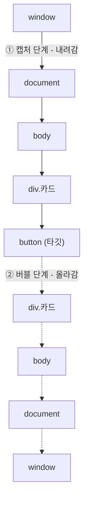
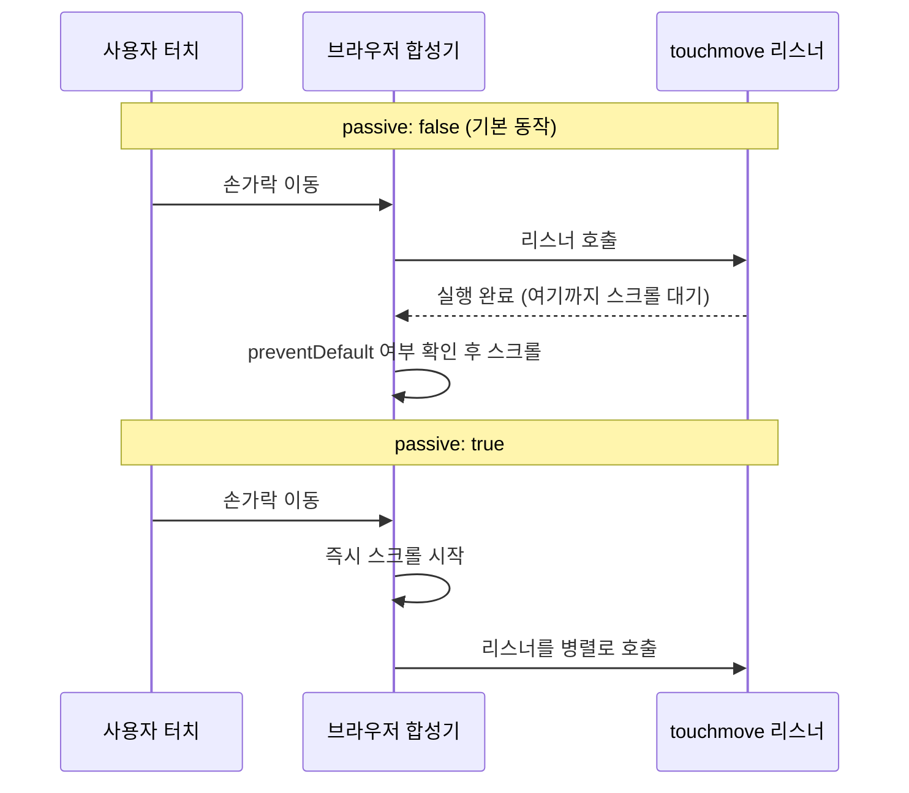

<Callout type="info">
  **이번 문서의 목표:** 이 파일을 다 읽으면 `CustomEvent`로 컴포넌트 사이의 통신 규약을 설계할 수 있고, `passive`가 스크롤 성능을 바꾸는 이유와 IME 입력 중 키 이벤트가 왜 이상하게 보이는지를 스펙 수준에서 설명할 수 있게 된다.
</Callout>

## 1. 이벤트를 받는 쪽에서 쏘는 쪽으로

6편에서 이벤트가 캡처(capture)·타깃(target)·버블(bubble) 세 단계를 거쳐 전파된다는 것을 봤습니다. 그때 이벤트를 만들어내는 주체는 언제나 브라우저였습니다. 사용자가 클릭하면 브라우저가 `MouseEvent`를 만들어 트리에 흘려보내는 식이죠.

이번 편은 그 반대편을 다룹니다. **내가 직접 이벤트 객체를 만들어 원하는 요소에 쏘는 것**입니다. 왜 그런 일이 필요할까요?

달력 위젯을 하나 만들었다고 합시다. 위젯 내부에서 날짜를 고르면, 이 위젯을 쓰는 바깥 코드가 그 사실을 알아야 합니다. 방법은 두 가지입니다.

1. 위젯을 만들 때 콜백 함수를 인자로 받는다 — `new 달력({ 선택시: 함수 })`
2. 위젯이 `날짜선택` 이라는 이벤트를 발생시키고, 바깥은 `addEventListener`로 듣는다

2번이 우월한 지점이 분명히 있습니다. 콜백은 **하나만** 등록되지만 이벤트는 **여러 곳에서 동시에** 들을 수 있습니다. 또 이벤트는 트리를 타고 버블링되므로, 위젯을 감싼 컨테이너가 자식 위젯 전부의 선택을 **위임**해서 한 자리에서 처리할 수 있습니다. 콜백 방식으로는 위젯마다 일일이 연결해야 합니다.

> **쉽게 말하면:** 콜백은 **직통 전화**, 커스텀 이벤트는 **사내 방송**입니다. 방송은 듣고 싶은 사람이 몇 명이든 알아서 듣습니다.

## 2. Event와 CustomEvent — 만들어 쏘는 법

### 생성자와 세 가지 옵션

```js
const 이벤트 = new Event("내이벤트", {
  bubbles: true,      // 버블 단계로 조상까지 올라갈지 (기본 false)
  cancelable: true,   // preventDefault()로 취소할 수 있을지 (기본 false)
  composed: false,    // Shadow DOM 경계를 넘을지 (기본 false)
});

요소.dispatchEvent(이벤트);
```

세 옵션의 기본값이 전부 `false`라는 점이 중요합니다. 브라우저가 만드는 `click`은 `bubbles: true`인데, 내가 만든 이벤트는 명시하지 않으면 **타깃에서 멈추고 조상까지 올라가지 않습니다.** 위임으로 받으려 했는데 아무것도 안 잡히는 사고의 대부분이 여기서 나옵니다.

`composed`는 22편에서 다룰 Shadow DOM(섀도 돔, 캡슐화된 하위 트리)과 관련됩니다. `false`면 이벤트가 섀도 경계 안에서만 돌고 바깥 문서로 새어 나가지 않습니다. 캡슐화를 지키고 싶으면 `false`, 컴포넌트 바깥까지 알려야 하면 `true`입니다.

### 데이터를 실어 보내려면 CustomEvent

`Event`에는 임의의 값을 담을 자리가 없습니다. `CustomEvent`는 `detail`이라는 한 칸을 추가로 제공합니다.

```js
요소.dispatchEvent(
  new CustomEvent("날짜선택", {
    bubbles: true,
    detail: { 년: 2026, 월: 8, 일: 30 },   // 여기에만 값을 담는다
  })
);

// 받는 쪽
document.addEventListener("날짜선택", (e) => {
  console.log(e.detail.년, e.detail.월, e.detail.일);
});
```

<Callout type="warning">
  **자주 틀리는 점:** 이벤트 객체에 `e.내값 = 1`처럼 임의 속성을 직접 붙이는 코드입니다. 동작은 하지만 표준이 보장하는 자리가 아니고, 라이브러리끼리 이름이 충돌합니다. 실어 보낼 데이터는 **반드시 `detail` 안**에 넣으세요. 그리고 `detail`은 복제되지 않고 **참조 그대로** 전달됩니다. 받는 쪽에서 객체를 수정하면 보낸 쪽에도 반영되므로, 변경되면 곤란한 값은 복사해서 넘겨야 합니다.
</Callout>

### dispatchEvent는 동기다

가장 자주 오해되는 성질입니다. `dispatchEvent`는 등록된 리스너들을 **그 자리에서 전부 호출하고 나서** 반환합니다. 큐에 넣었다가 나중에 처리하는 것이 아닙니다.

```js
console.log("1");
요소.dispatchEvent(new Event("테스트"));   // 리스너들이 여기서 전부 실행됨
console.log("3");
// 리스너가 "2"를 출력한다면 결과는 1, 2, 3 순서
```

반환값은 불리언입니다. **어떤 리스너도 취소를 요청하지 않았으면** `true`, 하나라도 `preventDefault()`를 불렀으면 `false`입니다. 이 값으로 "취소 가능한 동작을 계속 진행해도 되는지"를 판단합니다.

```js
const 계속해도됨 = 요소.dispatchEvent(
  new CustomEvent("삭제전", { cancelable: true, detail: { id: 7 } })
);

if (계속해도됨) {
  실제로삭제();     // 아무도 막지 않았으므로 진행
}
```

이 패턴은 브라우저가 `submit`이나 `beforeunload`에서 쓰는 방식과 정확히 같습니다. "**하기 전에 물어보고, 아무도 반대하지 않으면 한다**"는 계약을 내 코드에도 그대로 적용하는 것입니다.

### isTrusted — 흉내 낸 이벤트와 진짜 이벤트

모든 이벤트에는 `isTrusted`라는 읽기 전용 불리언이 있습니다. 사용자의 실제 조작으로 브라우저가 만든 이벤트는 `true`, `dispatchEvent`로 만든 이벤트는 `false`입니다. 이 값은 **변조할 수 없습니다.**

왜 이런 구분이 필요할까요? 전체 화면 전환(Fullscreen), 클립보드 읽기, 새 창 열기, 오디오 자동 재생 같은 기능은 **사용자 활성화**(user activation, 사용자 조작 이력)를 요구합니다. 페이지가 열리자마자 스스로 클릭을 흉내 내 전체 화면을 잡거나 팝업을 띄우는 남용을 막기 위해서입니다.

```js
버튼.dispatchEvent(new MouseEvent("click"));
// click 리스너는 호출된다.
// 그러나 그 안에서 requestFullscreen()을 부르면 거부된다 — 사용자 활성화가 없기 때문.
```

> **쉽게 말하면:** 합성 이벤트는 **복사한 초대장**입니다. 문지기는 들여보내 주지만, VIP 라운지 입구에서는 원본이 아니라는 이유로 막힙니다.

한편 `element.click()` 같은 메서드는 합성 클릭을 보내면서도 체크박스 토글 같은 **기본 동작은 수행**합니다. 기본 동작 수행 여부와 사용자 활성화 부여 여부는 별개의 규칙이라는 점을 기억하세요.

## 3. addEventListener의 옵션 네 가지

```js
대상.addEventListener("이벤트명", 핸들러, {
  capture: false,   // 캡처 단계에서 받을지
  once: false,      // 한 번 실행 후 자동 제거
  passive: false,   // preventDefault를 절대 안 부르겠다는 약속
  signal: undefined // AbortSignal로 수명 관리 (7편)
});
```

### capture — 받는 단계를 바꾼다

`true`면 이벤트가 조상에서 타깃으로 **내려가는** 캡처 단계에서 호출됩니다. `false`(기본값)면 타깃에서 조상으로 **올라가는** 버블 단계입니다.



캡처가 유용한 자리는 **자식보다 먼저 개입해야 할 때**입니다. 예를 들어 모달이 열려 있는 동안 바깥 요소의 클릭을 전부 무력화하려면, 캡처 단계에서 잡아 `stopPropagation()`을 부르는 것이 확실합니다. 버블 단계에서 잡으면 이미 자식의 핸들러가 다 실행된 뒤입니다.

<Callout type="warning">
  **자주 틀리는 점:** `removeEventListener`는 `capture` 플래그까지 일치해야 제거됩니다. `addEventListener(t, f, true)`로 등록한 것을 `removeEventListener(t, f)`로 지우면 **제거되지 않습니다.** 브라우저는 캡처 리스너와 버블 리스너를 서로 다른 등록으로 취급하기 때문입니다. 이 함정을 피하는 가장 쉬운 길이 7편의 `signal` 옵션입니다.
</Callout>

### once — 한 번 쓰고 버린다

`once: true`면 리스너가 한 번 호출된 직후 브라우저가 자동으로 제거합니다. 초기화 코드, 애니메이션 종료 대기, 첫 사용자 조작 감지 같은 자리에 딱 맞습니다. 직접 `removeEventListener`를 부르는 코드보다 안전한데, 핸들러 안에서 예외가 나도 **제거는 이미 완료된 뒤**이기 때문입니다.

### passive — 브라우저에게 하는 약속

이 옵션은 성능과 직결되므로 원리부터 봐야 합니다.

사용자가 화면을 스크롤하려고 손가락을 움직입니다. 브라우저는 즉시 화면을 밀어주고 싶습니다. 그런데 `touchmove` 리스너가 등록되어 있다면 문제가 생깁니다. **그 리스너가 스크롤을 취소해 버릴지도 모르기 때문**입니다 — 리스너 안에서 `preventDefault()`를 부르면 스크롤은 일어나지 않습니다. 취소될 수도 있는 스크롤을 미리 그렸다가 되돌리면 화면이 튑니다.

그래서 브라우저는 **리스너 실행이 끝날 때까지 기다렸다가** `defaultPrevented`를 확인하고 스크롤을 진행합니다. 리스너가 무거우면 그 시간만큼 스크롤이 멈춰 보이고, 이것이 모바일 웹의 대표적인 버벅임 원인이었습니다.

`passive: true`는 이렇게 선언하는 것입니다 — "**이 리스너는 기본 동작을 절대 취소하지 않겠다**"는 약속입니다. 즉 `preventDefault()`를 부르지 않겠다고 미리 알리는 것입니다. 약속을 받은 브라우저는 리스너 실행을 기다리지 않고 스크롤을 **즉시** 시작합니다. 리스너는 스크롤과 병렬로 실행됩니다.



약속을 어기면 어떻게 될까요? passive 리스너 안에서 `preventDefault()`를 부르면 **조용히 무시되고 콘솔에 경고**가 찍힙니다. 예외가 나지 않으므로 알아채기 어렵습니다.

<Callout type="info">
  **기본값이 상황에 따라 다릅니다.** 대부분의 이벤트는 `passive`의 기본값이 `false`지만, `touchstart`·`touchmove`·`wheel`·`mousewheel`을 `window`·`document`·`document.body`에 등록할 때는 **기본값이 `true`**입니다. 스크롤 성능을 위해 브라우저 벤더들이 도입한 예외입니다. 이 대상들에서 스크롤을 실제로 막으려면 `{ passive: false }`를 **명시**해야 합니다.
</Callout>

### 전파 제어 — 두 가지 stop의 차이

- `stopPropagation()`: 다음 단계·상위 요소로의 전파를 막습니다. 다만 **같은 요소에 등록된 다른 리스너들은 그대로 실행**됩니다.
- `stopImmediatePropagation()`: 위 효과에 더해, **같은 요소의 아직 실행되지 않은 리스너까지** 막습니다.

그리고 이 둘은 `preventDefault()`와 완전히 다른 축입니다. `preventDefault()`는 전파를 막지 않고 **브라우저의 기본 동작**(링크 이동, 폼 제출, 체크박스 토글)만 취소합니다. "전파를 멈춘다"와 "기본 동작을 막는다"는 서로 독립입니다.

아래 실습기에서 네 옵션과 전파 제어를 한 번에 관찰해 보세요.

<CodePlayground
  template="vanilla"
  activeFile="/index.js"
  showConsole
  label="capture / once / stopPropagation / preventDefault를 눈으로 비교하기"
  files={{
    '/index.html': `<div id="app">
  <div id="바깥" style="padding:20px;border:2px solid #888">
    바깥 div
    <div id="안쪽" style="padding:20px;border:2px solid #4a9">
      안쪽 div
      <button id="버튼">클릭해 보세요</button>
      <a id="링크" href="https://example.com">기본 동작이 막힌 링크</a>
    </div>
  </div>
  <p><button id="한번만">once 테스트 (한 번만 동작)</button></p>
  <p><button id="즉시중단">stopImmediatePropagation 테스트</button></p>
</div>`,
    '/index.js': `const 바깥 = document.getElementById("바깥");
const 안쪽 = document.getElementById("안쪽");
const 버튼 = document.getElementById("버튼");

// 캡처 단계 — 위에서 아래로 내려오며 먼저 호출된다
바깥.addEventListener("click", () => console.log("① 바깥 [캡처]"), { capture: true });
안쪽.addEventListener("click", () => console.log("② 안쪽 [캡처]"), { capture: true });

// 타깃
버튼.addEventListener("click", () => console.log("③ 버튼 [타깃]"));

// 버블 단계 — 아래에서 위로 올라가며 나중에 호출된다
안쪽.addEventListener("click", () => console.log("④ 안쪽 [버블]"));
바깥.addEventListener("click", () => console.log("⑤ 바깥 [버블]"));

// once — 한 번 실행 후 자동 제거
document.getElementById("한번만").addEventListener(
  "click",
  () => console.log("once 리스너 실행 — 다음 클릭부터는 아무 일도 없습니다"),
  { once: true }
);

// stopImmediatePropagation — 같은 요소의 나머지 리스너까지 차단
const 즉시중단 = document.getElementById("즉시중단");
즉시중단.addEventListener("click", (e) => {
  console.log("첫 번째 리스너 실행 후 즉시 중단");
  e.stopImmediatePropagation();
});
즉시중단.addEventListener("click", () => {
  console.log("이 줄은 절대 출력되지 않습니다");
});

// preventDefault — 전파는 계속되지만 기본 동작만 취소된다
document.getElementById("링크").addEventListener("click", (e) => {
  e.preventDefault();
  console.log("링크 이동은 취소되었지만 버블링은 계속됩니다");
  console.log("defaultPrevented:", e.defaultPrevented);
});

// 합성 이벤트와 isTrusted 비교
버튼.addEventListener("click", (e) => {
  console.log("isTrusted:", e.isTrusted, "(직접 클릭이면 true)");
});
console.log("--- 코드로 합성 클릭을 한 번 쏴 봅니다 ---");
버튼.dispatchEvent(new MouseEvent("click", { bubbles: true }));`,
  }}
/>

버튼을 실제로 클릭한 결과와, 페이지 로드 시 자동으로 나가는 합성 클릭의 결과를 비교해 보세요. 전파 순서는 같지만 `isTrusted`만 다릅니다.

## 4. 포인터 이벤트 — 마우스·터치·펜을 하나로

과거에는 마우스용 `mousedown`·`mousemove`와 터치용 `touchstart`·`touchmove`를 각각 처리해야 했습니다. 게다가 모바일 브라우저는 호환성을 위해 터치 후 약 300밀리초 뒤에 가짜 마우스 이벤트까지 발생시켜, 같은 조작이 두 번 처리되는 버그가 흔했습니다.

**포인터 이벤트**(Pointer Events)는 이 세 가지 입력 장치를 하나의 이벤트 계열로 통합합니다. `pointerdown`·`pointermove`·`pointerup`·`pointercancel`이 기본이고, 어떤 장치였는지는 `event.pointerType`으로 구분합니다 — 값은 `mouse`, `touch`, `pen` 중 하나입니다.

포인터 이벤트가 추가로 제공하는 정보도 실무에서 유용합니다.

| 속성 | 의미 |
|------|------|
| `pointerId` | 접촉점마다 부여되는 고유 번호 — 멀티터치 구분에 사용 |
| `pressure` | 필압. 0.0에서 1.0 사이, 지원 안 하면 0.5 |
| `width` / `height` | 접촉 면적 — 손가락은 넓고 펜은 좁다 |
| `isPrimary` | 멀티터치 중 대표 접촉점인지 |

### setPointerCapture — 드래그가 요소를 벗어나도 놓치지 않기

드래그 구현의 고전적 문제가 있습니다. 사용자가 손잡이를 잡고 빠르게 움직이면 커서가 요소 밖으로 나가고, 그 순간부터 `pointermove`가 그 요소에 오지 않아 드래그가 끊깁니다. 그래서 예전에는 `document`에 임시 리스너를 붙였다가 떼는 번거로운 코드를 썼습니다.

`element.setPointerCapture(pointerId)`는 **해당 포인터의 모든 후속 이벤트를 그 요소로 강제 전달**합니다. 커서가 화면 어디에 있든 상관없습니다. `pointerup` 시점에 캡처는 자동으로 해제됩니다.

```js
손잡이.addEventListener("pointerdown", (e) => {
  손잡이.setPointerCapture(e.pointerId);   // 이 포인터를 독점한다
});
손잡이.addEventListener("pointermove", (e) => {
  if (!손잡이.hasPointerCapture(e.pointerId)) return;
  이동처리(e.clientX);                      // 요소 밖으로 나가도 계속 들어온다
});
```

> **쉽게 말하면:** 마이크를 손에 쥐고 무대 밖으로 나가도 목소리가 계속 스피커로 나오는 것과 같습니다.

`pointercancel`도 반드시 처리해야 합니다. 브라우저가 조작을 스크롤이나 시스템 제스처로 판단해 가져가 버린 경우 발생하며, 이때 `pointerup`은 **오지 않습니다.** 드래그 정리 코드를 `pointerup`에만 두면 상태가 영원히 "드래그 중"으로 남습니다.

## 5. 키보드 이벤트 — key와 code, 그리고 IME

### key와 code는 다른 질문에 답한다

- `event.key`: **찍히는 문자**. 한글 자판에서 A 자리를 누르면 `ㅁ`, Shift와 함께 누르면 `A`입니다.
- `event.code`: **물리적 자리**. 자판 배열이나 언어와 무관하게 항상 `KeyA`입니다.

게임의 WASD 이동처럼 **자리**가 중요하면 `code`를, 단축키처럼 사용자가 인식하는 **문자**가 중요하면 `key`를 씁니다. 프랑스식 AZERTY 자판에서 `code`로 W를 감지하면 사용자의 손은 엉뚱한 자리에 있게 됩니다. 반대로 `key`로만 게임 조작을 만들면 한글 입력 상태에서 전부 깨집니다.

`event.repeat`는 키를 누르고 있어 자동 반복 중인지 알려줍니다. 키를 누른 순간에만 한 번 반응해야 한다면 `if (e.repeat) return;`으로 걸러냅니다.

### IME — 한글·일본어·중국어 입력의 함정

**IME**(Input Method Editor, 입력기)는 여러 번의 키 입력을 조합해 한 글자를 만드는 장치입니다. 한글은 `ㄱ` + `ㅏ` + `ㅁ`을 조합해 `감`을 만들죠. 이 **조합 중인 상태**가 키 이벤트를 매우 이상하게 만듭니다.

조합이 진행되는 동안 브라우저는 `keydown`을 발생시키되 `event.key`를 실제 글자 대신 `Process`로, `event.keyCode`(옛 속성)를 `229`로 채워 넣습니다. 확정되지 않은 글자를 알려줄 방법이 없기 때문입니다. 그래서 "엔터를 누르면 검색"을 `keydown`에서 처리하면, 한글 조합 중 엔터로 글자를 확정할 때 **검색이 함께 실행**되는 유명한 버그가 생깁니다.

해결책은 `event.isComposing`을 확인하는 것입니다.

```js
입력창.addEventListener("keydown", (e) => {
  if (e.isComposing) return;        // 조합 중이면 무시 — 반드시 먼저
  if (e.key === "Enter") 검색실행();
});
```

조합 과정 자체를 다루는 전용 이벤트도 있습니다. `compositionstart`(조합 시작), `compositionupdate`(조합 중 갱신), `compositionend`(조합 확정)입니다. 실시간 검색어 자동완성처럼 "완성된 글자만" 처리해야 하는 기능은 `compositionend`를 기준으로 삼으면 깔끔합니다.

## 6. 폼 입력 이벤트 — input, change, beforeinput

세 이벤트의 발생 시점이 다릅니다.

| 이벤트 | 발생 시점 | 취소 가능 | 주 용도 |
|--------|-----------|-----------|---------|
| `beforeinput` | 값이 바뀌기 직전 | 예 | 입력 자체를 막거나 변형 |
| `input` | 값이 바뀐 직후 매번 | 아니오 | 실시간 검증·미리보기 |
| `change` | 값이 확정될 때 | 아니오 | 최종 값 처리 |

`change`의 "확정"은 요소마다 다릅니다. 텍스트 입력은 **포커스를 잃을 때**, 체크박스·라디오·`select`는 **선택 즉시**입니다. 텍스트 입력에서 실시간 반응을 원하면서 `change`를 쓰면 아무 반응이 없어 보이는데, 원인이 바로 이것입니다.

`beforeinput`은 취소 가능해서 강력합니다. `event.inputType`으로 어떤 종류의 입력인지 알 수 있고 — `insertText`, `deleteContentBackward`, `insertFromPaste` 등 — `event.data`로 삽입될 문자를 확인할 수 있습니다. 숫자만 허용하는 입력창을 만들 때, 값이 바뀐 뒤 되돌리는 방식보다 애초에 막는 쪽이 커서 위치도 안 튀고 자연스럽습니다.

```js
숫자입력.addEventListener("beforeinput", (e) => {
  if (e.data && !/^\d+$/.test(e.data)) {
    e.preventDefault();     // 숫자가 아니면 아예 들어오지 못하게 한다
  }
});
```

### submit과 폼 데이터

`submit` 이벤트는 `form` 요소에서 발생하며 취소 가능합니다. `event.submitter`로 **어느 버튼이 제출을 일으켰는지** 알 수 있어, 저장과 임시저장 버튼을 구분할 때 유용합니다.

`formdata` 이벤트는 폼 데이터가 수집된 직후, 전송 직전에 발생합니다. `event.formData`에 값을 추가하면 HTML에 숨은 입력 요소를 두지 않고도 필드를 덧붙일 수 있습니다.

## 7. 자주 틀리는 점 모음

<Callout type="warning">
  **① 커스텀 이벤트에 `bubbles: true`를 안 줌.** 기본값이 `false`라 위임 리스너에 도달하지 않습니다.
</Callout>

<Callout type="warning">
  **② `capture`를 준 리스너를 `capture` 없이 제거.** 제거되지 않습니다. `signal` 옵션을 쓰면 이 문제 자체가 사라집니다.
</Callout>

<Callout type="warning">
  **③ passive 리스너에서 기본 동작 취소 시도.** `preventDefault()`는 조용히 무시되고 경고만 나옵니다. `window`·`document`의 `touchmove`·`wheel`은 기본이 passive라는 점을 함께 기억하세요.
</Callout>

<Callout type="warning">
  **④ 전파 차단을 만능 해결책으로 사용.** `stopPropagation()`으로 전파를 끊으면 문서 전체를 대상으로 하는 분석 도구나 모달 닫기 로직 같은 상위 위임 리스너가 조용히 망가집니다. 정말 필요한 자리인지 먼저 따져보세요.
</Callout>

<Callout type="warning">
  **⑤ IME 조합 중 `keydown` 처리.** `isComposing`을 확인하지 않으면 한글 입력 중 엔터가 두 번 처리됩니다.
</Callout>

<Callout type="warning">
  **⑥ 드래그 정리를 `pointerup`에만 작성.** `pointercancel`이 오면 정리되지 않아 상태가 남습니다.
</Callout>

## 핵심 정리

- `dispatchEvent`는 **동기**로 리스너를 전부 실행하고, 아무도 `preventDefault()`를 부르지 않았을 때 `true`를 반환한다. 이 반환값으로 "진행해도 되는지"를 판단하는 계약을 만들 수 있다.
- 커스텀 이벤트의 `bubbles`·`cancelable`·`composed`는 **기본이 모두 `false`**다. 데이터는 반드시 `detail`에 담고, 참조가 그대로 전달된다는 점에 주의한다.
- `isTrusted`는 조작할 수 없으며, 전체 화면·클립보드처럼 사용자 활성화를 요구하는 API는 합성 이벤트로 열리지 않는다.
- `capture`는 받는 단계를, `once`는 자동 제거를, `signal`은 수명을 바꾼다. `passive: true`는 "`preventDefault()`를 부르지 않겠다"는 약속이라 브라우저가 스크롤을 기다리지 않게 해준다.
- 포인터 이벤트는 마우스·터치·펜을 통합하며, `setPointerCapture`로 요소 밖 드래그를 유지하고 `pointercancel`까지 처리해야 완성이다.
- `key`는 찍히는 문자, `code`는 물리적 자리다. IME 조합 중에는 `isComposing`을 먼저 확인해야 중복 처리 버그를 피한다.
- 입력은 `beforeinput`(직전, 취소 가능) → `input`(직후 매번) → `change`(확정 시) 순서로 이해하면 선택이 쉬워진다.

## 마무리 복습

<Quiz
  questionNumber={1}
  question="new CustomEvent 로 만든 이벤트가 상위 요소의 위임 리스너에 잡히지 않는 가장 흔한 원인은?"
  options={['detail 에 값을 담지 않아서', 'bubbles 옵션의 기본값이 false 여서', 'dispatchEvent 가 비동기라서', 'cancelable 을 true 로 주지 않아서']}
  correctAnswer={2}
  explanation="브라우저가 만드는 click과 달리 커스텀 이벤트의 bubbles 기본값은 false다. 타깃에서 전파가 끝나므로 조상에 등록한 위임 리스너에는 도달하지 않는다."
  optionExplanations={['detail은 데이터 전달용이며 전파와 무관하다', '정답 — bubbles를 true로 명시해야 한다', 'dispatchEvent는 동기로 실행된다', 'cancelable은 preventDefault 가능 여부만 결정한다']}
/>

<Quiz
  questionNumber={2}
  question="dispatchEvent 의 반환값이 false 라는 것은 무엇을 뜻하는가?"
  options={['리스너가 하나도 등록되어 있지 않았다', '리스너 중 하나 이상이 preventDefault 를 호출했다', '이벤트 전파가 중간에 중단되었다', '이벤트 객체 생성에 실패했다']}
  correctAnswer={2}
  explanation="반환값은 기본 동작을 진행해도 되는지를 나타낸다. 어떤 리스너도 preventDefault를 부르지 않으면 true, 하나라도 부르면 false다."
  optionExplanations={['리스너가 없으면 아무도 막지 않았으므로 true다', '정답 — 취소 요청이 있었다는 신호다', 'stopPropagation은 반환값에 영향을 주지 않는다', '생성 실패 시에는 예외가 발생한다']}
/>

<Quiz
  questionNumber={3}
  question="passive: true 옵션이 스크롤 성능을 개선하는 원리로 옳은 것은?"
  options={['리스너를 워커 스레드에서 실행하기 때문에', '리스너가 preventDefault 를 부르지 않는다고 보장하므로 브라우저가 리스너 실행을 기다리지 않고 스크롤을 시작하기 때문에', '리스너 호출 횟수를 브라우저가 자동으로 줄여주기 때문에', '이벤트 전파 단계를 하나 건너뛰기 때문에']}
  correctAnswer={2}
  explanation="기본 상태에서는 리스너가 스크롤을 취소할 가능성이 있어 브라우저가 실행 완료를 기다린다. passive 약속을 받으면 기다릴 이유가 사라져 스크롤과 리스너가 병렬로 진행된다."
  optionExplanations={['여전히 메인 스레드에서 실행된다', '정답 — 대기 제거가 핵심이다', '호출 횟수를 줄이는 기능은 없다', '전파 단계는 그대로다']}
/>

<Quiz
  questionNumber={4}
  question="stopPropagation 과 stopImmediatePropagation 의 차이로 옳은 것은?"
  options={['전자는 기본 동작도 막고 후자는 막지 않는다', '전자는 상위로의 전파만 막고, 후자는 같은 요소에 남은 다른 리스너까지 막는다', '전자는 캡처 단계에서만, 후자는 버블 단계에서만 동작한다', '둘은 완전히 동일하며 이름만 다르다']}
  correctAnswer={2}
  explanation="stopPropagation은 다음 요소로의 전파만 막고 같은 요소의 나머지 리스너는 실행된다. stopImmediatePropagation은 그 나머지 리스너까지 차단한다. 둘 다 기본 동작은 막지 않는다."
  optionExplanations={['기본 동작을 막는 것은 preventDefault다', '정답 — 차단 범위의 차이다', '두 메서드 모두 어느 단계에서든 동작한다', '차단 범위가 명확히 다르다']}
/>

<Quiz
  questionNumber={5}
  question="한글 입력 중 엔터로 글자를 확정할 때 검색이 함께 실행되는 버그를 막는 방법은?"
  options={['keyup 대신 keypress 를 사용한다', 'keydown 핸들러 맨 앞에서 event.isComposing 이 참이면 반환한다', 'preventDefault 를 항상 호출한다', 'event.code 대신 event.key 를 사용한다']}
  correctAnswer={2}
  explanation="IME 조합 중에는 확정 목적의 엔터가 keydown으로도 전달된다. isComposing이 참이면 조합 중이라는 뜻이므로 그 경우를 먼저 걸러내야 한다."
  optionExplanations={['keypress는 폐기된 이벤트이며 해결책이 아니다', '정답 — 조합 상태를 먼저 확인한다', '기본 동작을 막아도 조합 확정 문제는 그대로다', 'key와 code의 선택은 이 문제와 무관하다']}
/>

<Quiz
  questionNumber={6}
  question="텍스트 입력창에서 타이핑할 때마다 실시간으로 반응하려면 어떤 이벤트를 써야 하는가?"
  options={['change — 값이 바뀔 때마다 발생하므로', 'input — 값이 바뀐 직후 매번 발생하므로', 'submit — 폼 값이 갱신될 때 발생하므로', 'formdata — 입력 데이터가 수집될 때 발생하므로']}
  correctAnswer={2}
  explanation="텍스트 입력에서 change는 포커스를 잃어 값이 확정될 때만 발생한다. 매 글자 반응이 필요하면 input을 써야 한다."
  optionExplanations={['텍스트 입력의 change는 포커스를 잃을 때 발생한다', '정답 — 값 변경 직후 매번 발생한다', 'submit은 폼 제출 시점의 이벤트다', 'formdata는 전송 직전 한 번만 발생한다']}
/>

<Quiz
  questionNumber={7}
  question="element.setPointerCapture(pointerId) 를 사용하는 목적으로 알맞은 것은?"
  options={['해당 요소에서만 포인터 이벤트를 차단하기 위해', '커서가 요소 밖으로 나가도 그 포인터의 이벤트를 계속 그 요소가 받게 하기 위해', '멀티터치를 하나의 포인터로 합치기 위해', '마우스 이벤트를 터치 이벤트로 변환하기 위해']}
  correctAnswer={2}
  explanation="드래그 중 커서가 요소를 벗어나면 pointermove가 끊긴다. 포인터 캡처는 후속 이벤트를 그 요소로 강제 전달해 드래그를 유지시키며, pointerup 시 자동 해제된다."
  optionExplanations={['차단이 아니라 독점 수신이다', '정답 — 요소 밖 드래그를 유지한다', '멀티터치는 pointerId로 구분해 개별 처리한다', '장치 변환 기능이 아니다']}
/>

<Quiz
  questionNumber={8}
  question="이벤트의 isTrusted 속성에 대한 설명으로 옳은 것은?"
  options={['dispatchEvent 로 만든 이벤트는 false 이며, 전체 화면 요청처럼 사용자 활성화가 필요한 API는 이런 이벤트로 열 수 없다', '개발자가 값을 true 로 설정해 신뢰 이벤트를 흉내 낼 수 있다', 'isTrusted 가 false 면 리스너 자체가 호출되지 않는다', '커스텀 이벤트에만 존재하는 속성이다']}
  correctAnswer={1}
  explanation="isTrusted는 브라우저만 true로 설정할 수 있는 읽기 전용 값이다. 합성 이벤트로도 리스너는 호출되지만, 사용자 활성화를 요구하는 기능은 남용 방지를 위해 거부된다."
  optionExplanations={['정답 — 남용 방지를 위한 구분이다', '변조할 수 없는 읽기 전용 값이다', '리스너는 정상적으로 호출된다', '모든 이벤트가 가진 속성이다']}
/>

## 참고 자료

- [DOM Living Standard - Events](https://dom.spec.whatwg.org/#events)
- [MDN - EventTarget.addEventListener](https://developer.mozilla.org/en-US/docs/Web/API/EventTarget/addEventListener)
- [MDN - CustomEvent](https://developer.mozilla.org/en-US/docs/Web/API/CustomEvent)
- [MDN - Pointer events](https://developer.mozilla.org/en-US/docs/Web/API/Pointer_events)
- [MDN - KeyboardEvent](https://developer.mozilla.org/en-US/docs/Web/API/KeyboardEvent)
- [MDN - InputEvent (beforeinput)](https://developer.mozilla.org/en-US/docs/Web/API/InputEvent)
- [HTML Living Standard - Interactive elements and user activation](https://html.spec.whatwg.org/multipage/interaction.html)
