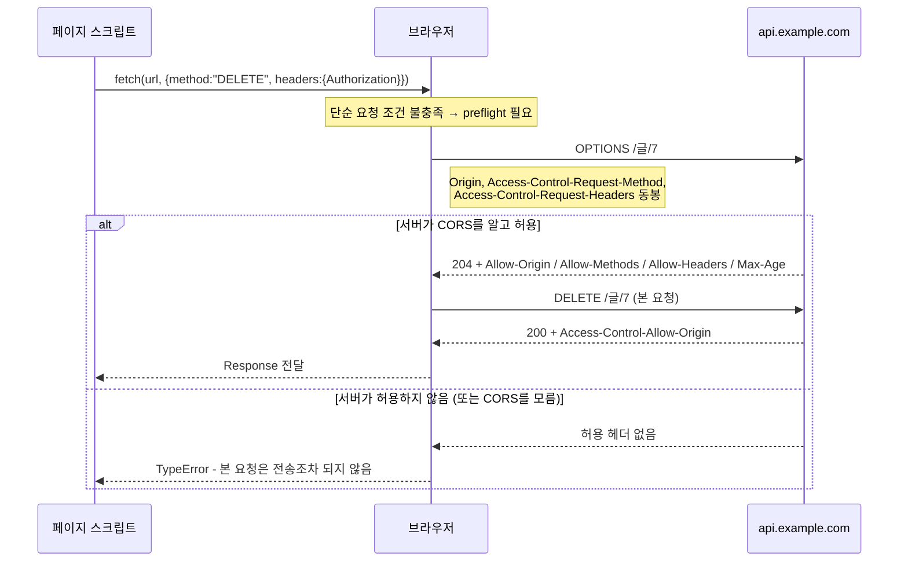
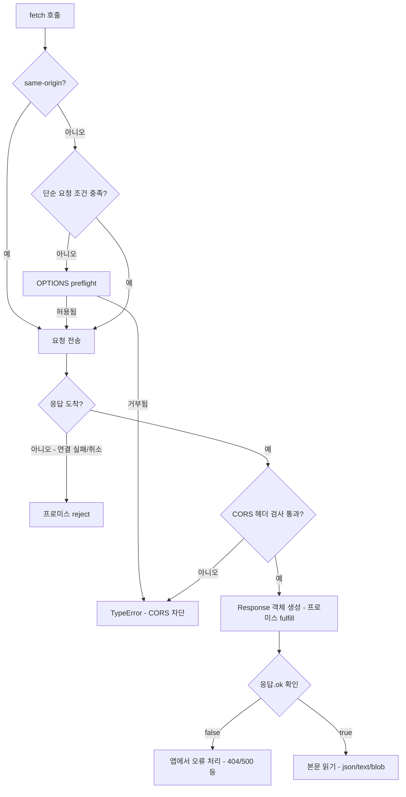

<Callout type="info">
  **이번 문서의 목표:** 이 파일을 다 읽으면 `fetch` 호출 한 줄이 브라우저 안에서 어떤 단계를 거치는지 그릴 수 있고, CORS 오류 메시지를 보고 서버가 무엇을 빠뜨렸는지 정확히 짚어낼 수 있게 된다.
</Callout>

## 1. fetch는 무엇을 바꾸었나

4편에서 HTTP 요청·응답의 형태를 봤습니다. 브라우저에서 그 요청을 자바스크립트(JavaScript)로 보내는 도구가 오랫동안 `XMLHttpRequest`(XHR, 비동기 HTTP 요청 객체)였습니다. XHR은 객체 하나에 상태·설정·콜백이 뒤엉켜 있어, 요청을 만들고 보내고 결과를 읽는 과정이 이벤트 핸들러 뭉치로 흩어졌습니다.

Fetch 표준(Fetch Standard)은 같은 일을 완전히 다른 구조로 재정의했습니다. 핵심은 **HTTP의 개념 하나하나를 일급 객체로 만든 것**입니다.

| 객체 | 대응하는 HTTP 개념 |
|------|--------------------|
| `Request` | 요청 한 건 – 메서드, URL, 헤더, 본문 |
| `Response` | 응답 한 건 – 상태 코드, 헤더, 본문 |
| `Headers` | 헤더 목록 – 이름 대소문자 무시, 다중 값 지원 |
| `Body` 믹스인 | 본문을 읽는 방법 – `text`, `json`, `blob`, `arrayBuffer`, `formData` |

> **쉽게 말하면:** XHR이 "전화 한 대에 다이얼·수화기·자동응답기가 붙어 있는 물건"이라면, Fetch는 **편지·봉투·주소록을 따로 만들어 조립하는 방식**입니다. 조각을 미리 만들어 두었다가 재사용하거나, 다른 API(Service Worker, Cache Storage)에 그대로 넘길 수 있는 것이 결정적 차이입니다.

이 "재사용 가능한 객체"라는 성질이 왜 중요한지는 20편에서 Service Worker가 `fetch` 이벤트로 `Request` 객체를 가로채고, 14편에서 Cache Storage가 `Request`를 키로 `Response`를 저장하는 것을 보면 분명해집니다. Fetch의 객체 모델은 브라우저 네트워크 계층 전체의 **공용 어휘**입니다.

## 2. Request — 요청을 값으로 다루기

```js
const 요청 = new Request("https://api.example.com/글/7", {
  method: "POST",
  headers: { "Content-Type": "application/json" },
  body: JSON.stringify({ 제목: "안녕" }),
  credentials: "same-origin",
  cache: "no-store",
  redirect: "follow",
  signal: 컨트롤러.signal,
});

fetch(요청);          // 만들어 둔 요청을 그대로 보낼 수 있다
```

`fetch(url, 옵션)` 형태로 쓰는 것이 익숙하지만, 실제로는 첫 인자를 항상 `Request`로 변환한 뒤 처리합니다. 옵션 객체의 필드는 곧 `Request`의 속성입니다.

### 주요 옵션이 각각 통제하는 것

- **`method`**: HTTP 메서드. 기본은 `GET`입니다. `GET`과 `HEAD`에는 본문을 넣을 수 없고, 넣으면 `TypeError`가 납니다.
- **`credentials`**: 쿠키·인증 정보를 실을지 결정합니다. 세 값이 있습니다.
  - `omit` – 절대 보내지 않음
  - `same-origin` – 같은 출처에만 보냄 (기본값)
  - `include` – 교차 출처에도 보냄 (CORS 조건 충족 시)
- **`mode`**: 교차 출처 요청의 처리 방식입니다. `cors`(기본), `same-origin`(교차 출처면 즉시 실패), `no-cors`(제한된 요청만 허용하고 응답은 읽을 수 없음)가 있습니다.
- **`cache`**: HTTP 캐시와의 상호작용. `default`, `no-store`, `reload`, `no-cache`, `force-cache`, `only-if-cached` — 자세한 의미는 14편에서 다룹니다.
- **`redirect`**: `follow`(기본, 최대 20회 자동 추적), `error`(리다이렉트를 실패로 처리), `manual`(추적하지 않고 불투명 응답 반환).
- **`keepalive`**: `true`면 페이지가 닫혀도 요청이 살아남습니다. 페이지 이탈 로그 전송에 쓰이며 본문 크기가 64KiB로 제한됩니다.
- **`integrity`**: 응답 본문의 해시를 검증합니다. CDN에서 받은 파일이 변조되지 않았는지 확인하는 용도입니다.

### 한 번 쓰면 소진되는 요청

`Request` 객체에 본문이 있으면, 그 본문은 **스트림 한 줄기**입니다. 같은 `Request`로 두 번 `fetch`를 부르면 두 번째는 실패합니다. 이 규칙과 그 이유는 11편에서 스트림 모델과 함께 자세히 다룹니다. 지금은 재요청이 필요하면 `요청.clone()`으로 복제하거나, `Request` 객체를 매번 새로 만든다고 기억하면 됩니다.

## 3. Headers — 왜 그냥 객체가 아닌가

헤더를 평범한 자바스크립트 객체로 두지 않고 별도 클래스로 만든 이유가 세 가지 있습니다.

**첫째, 이름의 대소문자를 무시해야 합니다.** HTTP 명세상 헤더 이름은 대소문자를 구분하지 않습니다. `Content-Type`과 `content-type`은 같은 헤더인데, 일반 객체라면 서로 다른 키가 됩니다.

**둘째, 같은 이름이 여러 번 올 수 있습니다.** `Set-Cookie`가 대표적입니다. 일반 객체로는 표현할 수 없습니다.

**셋째, 금지 헤더를 막아야 합니다.** 여기가 보안의 핵심입니다.

```js
const 헤더 = new Headers();
헤더.append("Accept", "application/json");
헤더.append("Accept", "text/plain");        // 같은 이름 추가 가능
console.log(헤더.get("accept"));             // 대소문자 무시 — 두 값이 쉼표로 합쳐짐

헤더.set("Host", "evil.example.com");        // 조용히 무시된다
헤더.set("Cookie", "role=admin");            // 역시 무시된다
```

### 금지 헤더와 가드

브라우저는 자바스크립트가 설정할 수 없는 **금지 요청 헤더**(forbidden request header) 목록을 둡니다. `Host`, `Origin`, `Referer`, `Cookie`, `Connection`, `Content-Length`, `Sec-` 로 시작하는 이름 등이 여기 속합니다.

왜 막을까요? 이 헤더들은 **브라우저가 요청의 출처를 증명하는 근거**이기 때문입니다. 페이지가 `Origin`을 마음대로 위조할 수 있다면 CORS 검사 전체가 무의미해집니다. `Cookie`를 임의로 설정할 수 있다면 다른 사이트의 인증 정보를 조립해 보낼 수 있습니다. 즉 이 목록은 **서버가 브라우저를 신뢰할 수 있게 만드는 최소 조건**입니다.

`Headers` 객체에는 **가드**(guard)라는 내부 상태가 있어, 그 헤더 목록이 어디에 속했는지에 따라 수정 가능 범위가 달라집니다.

| 가드 | 붙는 곳 | 수정 |
|------|---------|------|
| `none` | `new Headers()`로 직접 만든 것 | 자유롭게 가능 |
| `request` | `Request`의 헤더 | 금지 요청 헤더만 차단 |
| `request-no-cors` | `mode: "no-cors"` 요청 | 아주 소수의 헤더만 허용 |
| `response` | `Response`의 헤더 | 금지 응답 헤더만 차단 |
| `immutable` | `fetch`가 돌려준 응답의 헤더 | 전부 수정 불가 |

<Callout type="warning">
  **자주 틀리는 점:** 금지 헤더 설정은 **예외를 던지지 않고 조용히 무시**됩니다. 디버깅할 때 "분명히 set 했는데 서버에 안 왔다"면 금지 목록을 의심하세요. 그리고 `fetch` 응답의 헤더는 `immutable` 가드라 `응답.headers.set(...)`이 통하지 않습니다. 고쳐야 하면 `new Response(본문, { headers: 새헤더 })`로 새로 만들어야 합니다.
</Callout>

## 4. Response — 404는 실패가 아니다

가장 많은 사람이 걸려 넘어지는 지점입니다.

<Callout type="info">
  **`fetch`가 반환한 프로미스는 HTTP 오류 상태에서 거부되지 않습니다.** 404도, 500도 "서버가 응답을 정상적으로 돌려준 것"이므로 성공(fulfilled)입니다. 거부되는 경우는 **응답을 받지 못했을 때**뿐입니다 — DNS 실패, 연결 끊김, CORS 차단, 취소.
</Callout>

이 설계가 자의적으로 보일 수 있지만 일관성이 있습니다. Fetch 표준에서 프로미스의 성공/실패는 "**HTTP 트랜잭션이 완료되었는가**"를 뜻하지, "원하는 결과를 얻었는가"를 뜻하지 않습니다. 404는 서버가 명확한 의미를 담아 정상 전달한 메시지입니다. 반면 네트워크가 끊기면 우리는 아무 정보도 얻지 못했습니다. 이 둘은 근본적으로 다른 사건입니다.

> **쉽게 말하면:** 편지를 보냈더니 "그런 사람 없음"이라는 **답장이 왔다**면 배달은 성공한 것입니다. 실패는 편지가 아예 사라졌을 때입니다.

그래서 실무 코드는 항상 `ok`를 확인합니다.

```js
const 응답 = await fetch("/api/글/7");

if (!응답.ok) {                                  // 200~299 밖이면 false
  throw new Error("HTTP " + 응답.status + " " + 응답.statusText);
}

const 데이터 = await 응답.json();
```

### Response가 가진 정보

| 속성 | 의미 |
|------|------|
| `ok` | 상태 코드가 200 이상 300 미만인지 |
| `status` / `statusText` | 상태 코드와 그 설명 문구 |
| `headers` | 응답 헤더 `Headers` 객체 (immutable 가드) |
| `url` | 리다이렉트를 모두 따라간 **최종** URL |
| `redirected` | 리다이렉트가 한 번이라도 있었는지 |
| `type` | 응답의 종류 – 아래 설명 |
| `body` | 본문 `ReadableStream` (11편) |

`type`은 CORS 이해에 직결됩니다.

- `basic` – 같은 출처의 응답. 헤더를 전부 읽을 수 있습니다.
- `cors` – 교차 출처지만 CORS 검사를 통과한 응답. **일부 헤더만** 읽을 수 있습니다.
- `opaque` – `mode: "no-cors"`로 받은 응답. 상태 코드가 0, 헤더는 비어 있고 본문도 읽을 수 없습니다.
- `opaqueredirect` – `redirect: "manual"`로 받은 리다이렉트 응답.
- `error` – 네트워크 오류를 나타내는 내부 표현.

`opaque` 응답은 "받긴 받았지만 볼 수는 없는 봉인된 상자"입니다. 왜 이런 것이 존재할까요? 이미지나 스크립트처럼 **읽지 않고 그대로 사용하기만 하면 되는** 자원이 있기 때문입니다. Service Worker가 교차 출처 이미지를 캐시에 넣을 때 유용합니다. 하지만 내용을 알 수 없으니 성공 여부조차 판단할 수 없다는 점을 잊으면 안 됩니다.

### 응답 본문 읽기

`json()`, `text()`, `blob()`, `arrayBuffer()`, `formData()` — 전부 **프로미스를 반환**합니다. 본문은 네트워크에서 조각조각 도착하므로, 다 모일 때까지 기다려야 하기 때문입니다. 그리고 이 메서드들은 **한 번만** 부를 수 있습니다. 11편의 핵심 주제입니다.

## 5. CORS — 왜 이렇게 복잡한가

### 출발점: 동일 출처 정책

브라우저에는 **동일 출처 정책**(Same-Origin Policy, SOP)이라는 근본 규칙이 있습니다. 어떤 출처의 문서에서 실행되는 스크립트는, **다른 출처의 응답 내용을 읽을 수 없습니다.**

이 규칙이 없다면 어떻게 될까요? 사용자가 은행에 로그인한 상태로 악성 사이트를 방문합니다. 악성 사이트의 스크립트가 `fetch("https://bank.example.com/계좌목록")`을 호출하면, 브라우저는 사용자의 은행 쿠키를 자동으로 실어 보냅니다. 은행 서버는 정상 로그인 사용자로 보고 계좌 목록을 돌려줍니다. 그 내용을 악성 스크립트가 읽을 수 있다면 — 끝입니다.

> **쉽게 말하면:** 동일 출처 정책은 "**남의 집 열쇠로 문을 열 수는 있어도, 안을 들여다볼 수는 없다**"는 규칙입니다. 여기서 열쇠에 해당하는 것이 브라우저가 자동으로 실어 보내는 쿠키입니다.

주의할 점은 SOP가 **요청 전송 자체를 막는 것이 아니라 응답 읽기를 막는다**는 것입니다. 이 미묘한 차이가 다음 이야기의 전제입니다.

### 그런데 정당한 교차 출처 요청도 있다

API 서버가 `api.example.com`이고 화면이 `www.example.com`이라면, 이건 막아야 할 공격이 아니라 정상적인 구성입니다. 그래서 **CORS**(Cross-Origin Resource Sharing, 교차 출처 자원 공유)가 만들어졌습니다. CORS는 SOP를 뚫는 구멍이 아니라, **서버가 "이 출처에는 내용을 보여줘도 좋다"고 브라우저에게 명시적으로 허락하는 프로토콜**입니다.

허락의 주체가 서버라는 점이 핵심입니다. 프론트엔드 코드로는 CORS 오류를 절대 해결할 수 없습니다. 응답 헤더를 보내는 쪽이 서버이기 때문입니다.

### 단순 요청 — 먼저 보내고 나중에 검사

다음 조건을 **전부** 만족하면 브라우저는 요청을 그냥 보냅니다.

- 메서드가 `GET`, `HEAD`, `POST` 중 하나
- 수동으로 설정한 헤더가 `Accept`, `Accept-Language`, `Content-Language`, `Content-Type`, `Range` 등 안전한 목록 안에만 있음
- `Content-Type`이 `application/x-www-form-urlencoded`, `multipart/form-data`, `text/plain` 중 하나

요청에는 `Origin: https://www.example.com` 헤더가 자동으로 붙습니다. 서버가 응답에 `Access-Control-Allow-Origin`을 적절히 붙여 돌려주면 브라우저가 스크립트에 응답을 넘겨주고, 없으면 **응답은 이미 도착했지만 브라우저가 폐기**합니다.

여기서 중요한 결론이 나옵니다. **CORS 실패는 요청이 서버에 안 갔다는 뜻이 아닙니다.** 서버는 요청을 처리했고 데이터베이스도 변경되었을 수 있습니다. 단지 브라우저가 결과를 우리에게 안 준 것입니다.

### Preflight — 왜 미리 물어봐야 하는가

`PUT`, `DELETE`를 쓰거나 `Content-Type: application/json`을 쓰거나 `Authorization` 같은 커스텀 헤더를 붙이면, 브라우저는 **본 요청을 보내기 전에 `OPTIONS` 메서드로 사전 확인 요청**을 보냅니다. 이것이 **preflight**(프리플라이트, 사전 확인)입니다.

왜 이런 단계가 필요할까요? 답은 **역사**에 있습니다.

CORS가 만들어지기 전, 웹에는 이미 수십만 대의 서버가 돌아가고 있었습니다. 그 서버들은 하나의 전제 위에 만들어졌습니다. **"브라우저는 교차 출처로 `DELETE` 요청 같은 것을 보낼 수 없다."** HTML 폼(form)으로 보낼 수 있는 것은 `GET`과 `POST`뿐이고 `Content-Type`도 세 가지로 제한되어 있었으니, 그 전제는 사실이었습니다. 그래서 많은 서버가 "요청이 도착했다는 것은 곧 우리 사이트 안에서 온 것"이라 믿고 별도 검증 없이 처리했습니다.

이제 CORS가 교차 출처 `DELETE`를 허용한다고 해봅시다. 옛 서버는 CORS라는 개념 자체를 모릅니다. 악성 사이트가 `fetch("https://old-server.example.com/글/7", { method: "DELETE" })`를 보내면, 서버는 사용자 쿠키를 보고 정상 요청으로 처리해 **글을 삭제합니다.** 브라우저가 나중에 응답을 폐기해도 소용없습니다. 삭제는 이미 일어났으니까요.

그래서 스펙은 순서를 뒤집었습니다. **부작용을 일으킬 수 있는 요청은, 보내기 전에 서버에게 물어본다.**

`OPTIONS` 메서드를 고른 이유도 여기 있습니다. `OPTIONS`는 정의상 자원을 변경하지 않는 메서드이고, CORS를 모르는 옛 서버는 이 요청에 `Access-Control-Allow-Methods` 헤더를 붙여 돌려줄 리가 없습니다. 그러면 브라우저는 "이 서버는 허락하지 않았다"고 판단해 본 요청을 아예 보내지 않습니다. **옛 서버는 아무것도 하지 않음으로써 자동으로 보호받습니다.** 이것이 preflight 설계의 진짜 아름다움입니다.



### 응답 헤더의 의미

| 헤더 | 역할 |
|------|------|
| `Access-Control-Allow-Origin` | 어떤 출처에 내용을 보여줄지. 정확한 출처 하나 또는 `*` |
| `Access-Control-Allow-Methods` | preflight 응답에서 허용하는 메서드 목록 |
| `Access-Control-Allow-Headers` | preflight 응답에서 허용하는 요청 헤더 목록 |
| `Access-Control-Allow-Credentials` | `true`면 쿠키를 실은 요청을 허용 |
| `Access-Control-Expose-Headers` | 스크립트가 읽을 수 있게 노출할 응답 헤더 목록 |
| `Access-Control-Max-Age` | preflight 결과를 캐시할 초 단위 시간 |

여기서 두 가지 함정을 반드시 알아야 합니다.

**함정 1 — 와일드카드와 쿠키는 함께 쓸 수 없습니다.** `credentials: "include"`로 보낸 요청에 서버가 `Access-Control-Allow-Origin: *`으로 답하면 브라우저는 거부합니다. `*`는 "아무나 봐도 된다"는 뜻인데, 쿠키가 실린 요청은 특정 사용자의 개인 데이터이기 때문입니다. 이 조합을 허용하면 아무 사이트나 로그인한 사용자의 데이터를 읽을 수 있게 됩니다. 서버는 반드시 **요청의 `Origin` 값을 그대로 되돌려주고**, `Access-Control-Allow-Credentials: true`도 함께 보내야 합니다.

**함정 2 — 교차 출처 응답에서 기본으로 읽을 수 있는 헤더는 극소수입니다.** `Cache-Control`, `Content-Language`, `Content-Type`, `Expires`, `Last-Modified`, `Pragma` — 이 여섯 개뿐입니다. 페이지 번호를 `X-Total-Count` 헤더로 내려주는 API를 만들었는데 프론트에서 `null`만 나온다면, 서버가 `Access-Control-Expose-Headers: X-Total-Count`를 빠뜨린 것입니다.

## 6. 직접 만들어 보며 익히기

`Request`와 `Response`는 네트워크 없이도 생성하고 검사할 수 있습니다. 아래 실습기는 서버 없이 Fetch의 객체 모델 전체를 관찰합니다.

<CodePlayground
  template="vanilla"
  activeFile="/index.js"
  showConsole
  label="네트워크 없이 Request·Headers·Response 해부하기"
  files={{
    '/index.js': `// ---------- 1. Headers ----------
const 헤더 = new Headers({ "Content-Type": "application/json" });
헤더.append("Accept", "application/json");
헤더.append("Accept", "text/plain");            // 같은 이름 중복 허용

console.log("대소문자 무시:", 헤더.get("CONTENT-TYPE"));
console.log("합쳐진 값   :", 헤더.get("Accept"));
console.log("존재 확인   :", 헤더.has("accept"));

헤더.set("Host", "evil.example.com");           // 금지 헤더
헤더.set("Cookie", "role=admin");               // 금지 헤더
console.log("Host 설정 결과  :", 헤더.get("Host"));    // null — 조용히 무시
console.log("Cookie 설정 결과:", 헤더.get("Cookie"));  // null

console.log("--- 전체 순회 (이름은 소문자로 정규화된다) ---");
for (const [이름, 값] of 헤더.entries()) {
  console.log(이름, "=", 값);
}

// ---------- 2. Request ----------
const 요청 = new Request("https://api.example.com/글/7?draft=1", {
  method: "POST",
  headers: { "Content-Type": "application/json" },
  body: JSON.stringify({ 제목: "안녕", 내용: "본문입니다" }),
  credentials: "same-origin",
  cache: "no-store",
});

console.log("--- Request 속성 ---");
console.log("method     :", 요청.method);
console.log("url        :", 요청.url);
console.log("credentials:", 요청.credentials);
console.log("cache      :", 요청.cache);
console.log("mode       :", 요청.mode);
console.log("bodyUsed   :", 요청.bodyUsed);     // 아직 안 읽음

// ---------- 3. Response 를 직접 만들어 본다 ----------
const 응답 = new Response(JSON.stringify({ 결과: "성공", 번호: 7 }), {
  status: 404,
  statusText: "Not Found",
  headers: { "Content-Type": "application/json", "X-Total-Count": "128" },
});

console.log("--- Response 속성 ---");
console.log("status:", 응답.status, "/ ok:", 응답.ok);   // 404 → ok는 false
console.log("type  :", 응답.type);
console.log("커스텀 헤더:", 응답.headers.get("X-Total-Count"));

// 응답 헤더의 immutable 가드 확인
try {
  응답.headers.set("X-Total-Count", "999");
  console.log("수정 후:", 응답.headers.get("X-Total-Count"));
} catch (에러) {
  console.log("헤더 수정 거부됨:", 에러.name);
}

// ---------- 4. 본문은 한 번만 읽힌다 ----------
(async () => {
  console.log("--- 본문 소비 ---");
  console.log("읽기 전 bodyUsed:", 응답.bodyUsed);
  const 데이터 = await 응답.json();
  console.log("첫 번째 읽기 성공:", 데이터);
  console.log("읽은 후 bodyUsed:", 응답.bodyUsed);

  try {
    await 응답.json();                            // 두 번째 시도
  } catch (에러) {
    console.log("두 번째 읽기 실패:", 에러.name, "-", 에러.message);
  }

  // clone() 은 읽기 전에 미리 해두어야 한다
  const 원본 = new Response("복제 실험용 본문");
  const 사본 = 원본.clone();
  console.log("원본:", await 원본.text());
  console.log("사본:", await 사본.text());
})();`,
  }}
/>

404로 만든 응답의 `ok`가 `false`인 것, 금지 헤더가 예외 없이 `null`로 남는 것, 본문을 두 번 읽으면 `TypeError`가 나는 것을 콘솔에서 직접 확인해 보세요.

## 7. 타임아웃과 재시도 — fetch가 주지 않는 것들

### fetch에는 타임아웃이 없다

`fetch` 자체에는 타임아웃 옵션이 없습니다. 서버가 응답하지 않으면 프로미스는 브라우저의 기본 연결 제한에 걸릴 때까지 대기합니다. 7편에서 배운 `AbortSignal.timeout()`이 표준 해법입니다.

```js
const 응답 = await fetch("/api/느린것", { signal: AbortSignal.timeout(8000) });
```

한 가지 유의할 점이 있습니다. 이 타임아웃은 **응답 헤더가 도착할 때까지**가 아니라 **요청 전체**를 기준으로 재는 것이 아니라는 점입니다. 정확히는 시그널이 중단되는 순간 fetch가 취소되므로, 본문을 스트리밍으로 오래 읽는 중이었다면 그 읽기도 함께 끊깁니다. "헤더는 5초 안에, 본문 전체는 60초 안에" 같은 이중 기준이 필요하면 헤더 도착 후 별도 시그널로 갈아타는 구조를 직접 만들어야 합니다.

### 재시도 — 안전한 요청만, 지수 백오프로

일시적 네트워크 실패나 서버의 503은 다시 시도하면 성공할 수 있습니다. 하지만 무작정 재시도하면 두 가지 사고가 납니다.

**첫째, 부작용의 중복입니다.** `POST /주문`이 타임아웃 났을 때, 서버가 요청을 못 받은 것인지 처리하고 응답만 못 보낸 것인지 클라이언트는 알 수 없습니다. 재시도하면 주문이 두 번 들어갈 수 있습니다. 그래서 재시도는 **멱등**(idempotent, 여러 번 해도 결과가 같은) 메서드인 `GET`·`HEAD`·`PUT`·`DELETE`에만 기본 허용하고, `POST`는 서버가 멱등 키(idempotency key)를 지원할 때만 재시도해야 합니다.

**둘째, 재시도 폭풍입니다.** 서버가 과부하로 503을 냈는데 수천 개의 클라이언트가 1초 뒤 일제히 재시도하면 서버는 다시 쓰러집니다. 그래서 대기 시간을 **지수적으로 늘리고**(exponential backoff), 거기에 **무작위 값을 섞습니다**(jitter, 지터). 무작위를 섞는 이유는 모든 클라이언트가 정확히 같은 시각에 재시도하는 것을 흩뜨리기 위해서입니다.

$$
대기시간 = 기본지연 \times 2^{시도횟수} + 무작위값
$$

- $기본지연$ : 첫 재시도까지의 기준 시간. 보통 200에서 500밀리초
- $2^{시도횟수}$ : 시도할수록 두 배씩 늘어나는 배수
- $무작위값$ : 0부터 기본지연 사이의 난수. 동시 재시도를 흩뜨리는 역할

```js
async function 재시도가능한요청(url, 옵션 = {}, 최대시도 = 3) {
  const 기본지연 = 300;

  for (let 시도 = 0; 시도 < 최대시도; 시도 += 1) {
    try {
      const 응답 = await fetch(url, {
        ...옵션,
        signal: AbortSignal.any([
          옵션.signal ?? new AbortController().signal,
          AbortSignal.timeout(8000),
        ]),
      });

      // 4xx는 재시도해도 결과가 같다 — 즉시 포기
      if (응답.status >= 400 && 응답.status < 500) return 응답;
      if (응답.ok) return 응답;
      // 5xx는 재시도 대상 — 아래로 떨어진다
    } catch (에러) {
      if (에러.name === "AbortError") throw 에러;   // 사용자 취소는 재시도 금지
      if (시도 === 최대시도 - 1) throw 에러;
    }

    const 대기 = 기본지연 * 2 ** 시도 + Math.random() * 기본지연;
    await new Promise((r) => setTimeout(r, 대기));
  }

  throw new Error("최대 재시도 횟수 초과");
}
```

이 코드에서 눈여겨볼 부분은 **4xx와 5xx를 다르게 다루는 것**입니다. 400번대는 "요청 자체가 잘못되었다"는 뜻이라 백 번 다시 보내도 같은 답이 옵니다. 재시도할 가치가 있는 것은 500번대와 네트워크 오류뿐입니다. 그리고 사용자가 직접 취소한 `AbortError`를 재시도하는 것은 명백한 버그입니다.

### 요청 하나의 전체 수명



이 그림이 이 편의 요약입니다. 프로미스가 거부되는 지점과 `ok`가 `false`가 되는 지점이 서로 다른 층에 있다는 것, CORS 검사가 응답을 받은 **뒤에** 이루어진다는 것을 확인하세요.

## 8. 자주 틀리는 점 모음

<Callout type="warning">
  **① `try/catch`만으로 오류를 처리.** 404·500은 `catch`로 가지 않습니다. `응답.ok`를 반드시 확인하세요.
</Callout>

<Callout type="warning">
  **② CORS 오류를 프론트엔드에서 고치려는 시도.** 허용 헤더를 보내는 주체는 서버입니다. 개발 중이라면 개발 서버의 프록시 기능을 쓰는 것이 정석이고, 브라우저 보안 옵션을 끄는 것은 해결이 아닙니다.
</Callout>

<Callout type="warning">
  **③ 쿠키가 안 실린다.** 교차 출처 요청의 기본 `credentials`는 `same-origin`입니다. `include`를 명시하고, 서버도 정확한 `Origin` 반환과 `Allow-Credentials: true`를 함께 보내야 합니다.
</Callout>

<Callout type="warning">
  **④ 커스텀 응답 헤더가 안 보인다.** `Access-Control-Expose-Headers`가 없으면 교차 출처 응답에서 읽을 수 있는 헤더는 여섯 개뿐입니다.
</Callout>

<Callout type="warning">
  **⑤ preflight가 매번 발생해 느리다.** `Access-Control-Max-Age`를 설정하면 브라우저가 결과를 캐시합니다. 또는 `Content-Type`을 단순 요청 조건에 맞춰 preflight 자체를 피할 수도 있습니다.
</Callout>

<Callout type="warning">
  **⑥ `POST`를 무조건 재시도.** 멱등하지 않은 요청의 중복 실행은 데이터 사고로 직결됩니다.
</Callout>

## 핵심 정리

- Fetch는 HTTP의 개념을 `Request`·`Response`·`Headers`라는 일급 객체로 만들었고, 이 객체 모델은 Service Worker·Cache Storage까지 공유하는 공용 어휘다.
- `Headers`는 대소문자 무시·다중 값·금지 헤더 차단을 위해 별도 클래스로 존재하며, 가드에 따라 수정 범위가 달라진다. 금지 헤더 설정은 **예외 없이 조용히 무시**된다.
- `fetch` 프로미스는 응답을 받지 못했을 때만 거부된다. 404·500은 성공이며 `응답.ok`로 판별해야 한다.
- 동일 출처 정책은 **요청 전송이 아니라 응답 읽기**를 막는다. CORS는 서버가 "이 출처에는 보여줘도 된다"고 허락하는 프로토콜이다.
- preflight는 **CORS를 모르는 옛 서버를 보호**하기 위한 장치다. 부작용 있는 요청을 보내기 전에 `OPTIONS`로 허락을 구하고, 허락이 없으면 본 요청 자체를 보내지 않는다.
- 와일드카드 `Access-Control-Allow-Origin`과 쿠키는 함께 쓸 수 없고, 커스텀 응답 헤더는 `Expose-Headers`로 명시해야 읽힌다.
- 타임아웃은 `AbortSignal.timeout()`으로 직접 붙이고, 재시도는 멱등 메서드에 한해 지수 백오프와 지터를 적용한다.

## 마무리 복습

<Quiz
  questionNumber={1}
  question="서버가 404를 반환했을 때 fetch 가 반환한 프로미스는 어떻게 되는가?"
  options={['거부되어 catch 블록으로 들어간다', '이행되며 응답.ok 가 false 인 Response 를 전달한다', '이행되지도 거부되지도 않고 대기 상태로 남는다', 'TypeError 를 동기적으로 던진다']}
  correctAnswer={2}
  explanation="fetch 프로미스는 HTTP 트랜잭션이 완료되었는지를 나타낸다. 404는 서버가 정상적으로 돌려준 응답이므로 성공이며, 원하는 결과인지는 ok 속성으로 판별한다."
  optionExplanations={['거부되는 경우는 응답을 받지 못했을 때뿐이다', '정답 — ok 확인이 필수인 이유다', '응답이 도착하면 즉시 이행된다', 'TypeError는 네트워크 실패나 CORS 차단 시 비동기로 거부된다']}
/>

<Quiz
  questionNumber={2}
  question="CORS preflight 요청이 존재하는 근본 이유로 가장 알맞은 것은?"
  options={['요청 크기를 미리 알려 대역폭을 아끼기 위해', 'CORS를 모르는 기존 서버가 부작용 있는 교차 출처 요청을 처리해 버리는 것을 막기 위해', '서버의 응답 속도를 미리 측정하기 위해', '브라우저 캐시에 응답을 저장하기 위해']}
  correctAnswer={2}
  explanation="CORS 이전의 서버들은 브라우저가 교차 출처 DELETE 등을 보낼 수 없다는 전제 위에 만들어졌다. 부작용 있는 요청을 보내기 전에 OPTIONS로 허락을 구하면, CORS를 모르는 서버는 허용 헤더를 보내지 않아 자동으로 보호된다."
  optionExplanations={['대역폭과는 무관하다', '정답 — 하위 호환 서버 보호가 핵심 동기다', '성능 측정 기능이 아니다', '캐시되는 것은 preflight 결과이지 응답 본문이 아니다']}
/>

<Quiz
  questionNumber={3}
  question="credentials 를 include 로 설정한 요청에 서버가 Access-Control-Allow-Origin 을 별표 하나로 응답하면?"
  options={['정상적으로 처리되며 쿠키도 전달된다', '브라우저가 응답을 거부한다 — 개인 데이터를 아무에게나 공개하는 셈이기 때문이다', '쿠키만 제거되고 응답은 전달된다', 'preflight 가 한 번 더 발생한다']}
  correctAnswer={2}
  explanation="와일드카드는 아무 출처나 읽어도 된다는 뜻인데, 쿠키가 실린 응답은 특정 사용자의 개인 데이터다. 이 조합을 허용하면 어떤 사이트든 로그인 사용자의 데이터를 읽을 수 있으므로 브라우저가 차단한다."
  optionExplanations={['이 조합은 명시적으로 금지되어 있다', '정답 — 서버는 정확한 Origin 값을 되돌려주어야 한다', '쿠키만 제거하는 동작은 없다', 'preflight 반복과는 무관하다']}
/>

<Quiz
  questionNumber={4}
  question="교차 출처 응답에서 X-Total-Count 같은 커스텀 헤더가 null 로 읽히는 원인은?"
  options={['헤더 이름이 대문자로 되어 있어서', '서버가 Access-Control-Expose-Headers 로 그 헤더를 노출하지 않아서', 'Headers 객체가 immutable 가드라서', 'preflight 요청이 실패해서']}
  correctAnswer={2}
  explanation="교차 출처 응답에서 기본으로 읽을 수 있는 헤더는 Cache-Control 등 여섯 개뿐이다. 커스텀 헤더를 읽으려면 서버가 Expose-Headers로 명시해야 한다."
  optionExplanations={['헤더 이름은 대소문자를 구분하지 않는다', '정답 — 노출 목록에 없으면 읽을 수 없다', 'immutable 가드는 수정을 막을 뿐 읽기는 가능하다', 'preflight가 실패하면 응답 자체가 오지 않는다']}
/>

<Quiz
  questionNumber={5}
  question="Headers 객체에 Host 나 Cookie 같은 금지 헤더를 set 하면 어떻게 되는가?"
  options={['TypeError 가 발생한다', '조용히 무시되어 값이 설정되지 않는다', '값이 설정되고 서버로 전송된다', '이름 앞에 X- 접두사가 자동으로 붙는다']}
  correctAnswer={2}
  explanation="금지 요청 헤더 설정은 예외를 던지지 않고 무시된다. 이 헤더들은 브라우저가 요청의 출처를 증명하는 근거이므로 스크립트가 위조할 수 없어야 한다."
  optionExplanations={['예외가 발생하지 않아 디버깅이 어려운 함정이다', '정답 — 조용히 무시된다', '전송되면 CORS 검사 자체가 무의미해진다', '자동 접두사 규칙은 존재하지 않는다']}
/>

<Quiz
  questionNumber={6}
  question="mode 를 no-cors 로 설정해 받은 opaque 응답의 특징으로 옳은 것은?"
  options={['상태 코드가 0이고 헤더와 본문을 읽을 수 없다', '헤더는 읽을 수 있지만 본문만 읽을 수 없다', '동일 출처 응답과 완전히 동일하게 다룰 수 있다', '항상 CORS 오류로 거부된다']}
  correctAnswer={1}
  explanation="opaque 응답은 봉인된 상자다. 상태 코드는 0이고 헤더 목록은 비어 있으며 본문도 읽을 수 없어 성공 여부조차 판단할 수 없다. 이미지처럼 읽지 않고 사용만 하는 자원에 쓰인다."
  optionExplanations={['정답 — 내용에 접근할 수 없는 응답이다', '헤더도 읽을 수 없다', '읽기 권한이 전혀 없다는 점이 결정적으로 다르다', '거부되지 않고 opaque 응답으로 이행된다']}
/>

<Quiz
  questionNumber={7}
  question="자동 재시도를 적용해도 되는 요청으로 가장 적절한 것은?"
  options={['결제를 생성하는 POST 요청', '멱등성이 보장되지 않는 POST 주문 요청', '자원을 조회하는 GET 요청', '멱등 키를 지원하지 않는 POST 업로드 요청']}
  correctAnswer={3}
  explanation="GET은 여러 번 실행해도 서버 상태가 변하지 않는 멱등 메서드이므로 안전하게 재시도할 수 있다. POST는 서버가 멱등 키를 지원할 때만 재시도해야 중복 처리를 피할 수 있다."
  optionExplanations={['결제가 두 번 생성될 수 있다', '주문 중복 위험이 있다', '정답 — 멱등 메서드라 안전하다', '중복 업로드가 발생할 수 있다']}
/>

<Quiz
  questionNumber={8}
  question="재시도 대기 시간에 무작위 값(지터)을 더하는 이유는?"
  options={['서버의 응답 시간을 측정하기 위해', '모든 클라이언트가 같은 시각에 일제히 재시도해 서버를 다시 쓰러뜨리는 것을 막기 위해', '브라우저의 요청 순서를 보장하기 위해', '타임아웃 값을 자동으로 조정하기 위해']}
  correctAnswer={2}
  explanation="지수 백오프만 적용하면 동시에 실패한 클라이언트들이 정확히 같은 시각에 재시도한다. 무작위 값을 섞어 재시도 시점을 흩뜨려야 서버가 회복할 여유를 얻는다."
  optionExplanations={['측정 목적이 아니다', '정답 — 재시도 폭풍을 흩뜨리기 위함이다', '순서 보장과는 무관하다', '타임아웃 조정 기능이 아니다']}
/>

## 참고 자료

- [Fetch Standard](https://fetch.spec.whatwg.org/)
- [MDN - Fetch API](https://developer.mozilla.org/en-US/docs/Web/API/Fetch_API)
- [MDN - Cross-Origin Resource Sharing (CORS)](https://developer.mozilla.org/en-US/docs/Web/HTTP/Guides/CORS)
- [MDN - Request](https://developer.mozilla.org/en-US/docs/Web/API/Request)
- [MDN - Response](https://developer.mozilla.org/en-US/docs/Web/API/Response)
- [MDN - Headers](https://developer.mozilla.org/en-US/docs/Web/API/Headers)
- [MDN - HTTP headers](https://developer.mozilla.org/en-US/docs/Web/HTTP/Reference/Headers)
