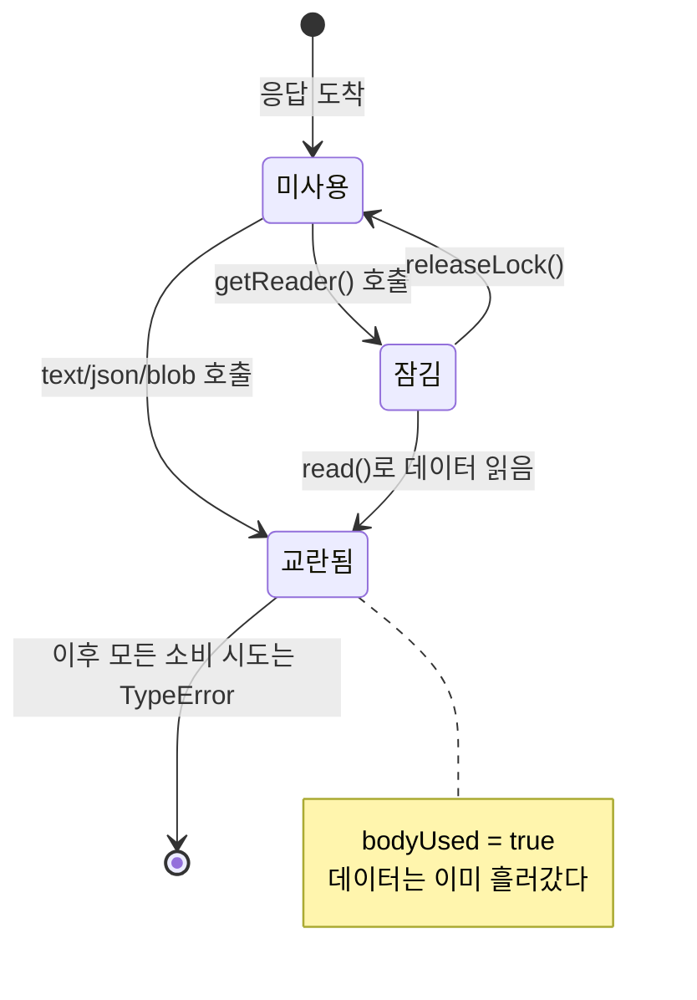
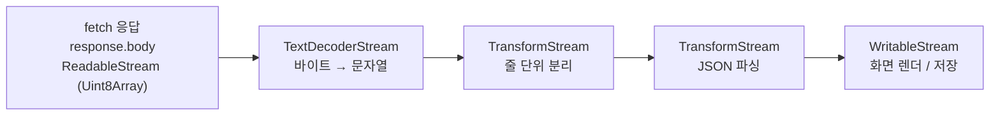

<Callout type="info">
  **이번 문서의 목표:** 이 파일을 다 읽으면 `response.json()`을 두 번 부르면 왜 실패하는지 스펙 용어로 설명할 수 있고, `ReadableStream`과 `TransformStream`을 조립해 다운로드 진행률 표시나 실시간 텍스트 처리를 메모리 폭발 없이 구현할 수 있게 된다.
</Callout>

## 1. 문제 상황 — 4GB 영상을 변수에 담을 수 있는가

10편에서 응답 본문을 읽는 방법으로 `json()`, `text()`, `blob()`을 봤습니다. 이들은 전부 **본문이 전부 도착할 때까지 기다렸다가** 하나의 값으로 돌려줍니다. 작은 JSON이라면 문제없습니다.

그런데 4기가바이트짜리 영상 파일을 내려받는다고 해봅시다. `await 응답.blob()`은 4기가바이트가 전부 도착할 때까지 아무것도 하지 않고, 그 데이터를 통째로 메모리에 올립니다. 사용자는 몇 분 동안 아무 반응 없는 화면을 봐야 하고, 기기에 따라서는 메모리 부족으로 탭이 죽습니다.

더 근본적인 문제도 있습니다. 로그 스트림이나 실시간 응답처럼 **끝이 없는 데이터**는 "전부 도착할 때까지"라는 조건이 영원히 충족되지 않습니다.

> **쉽게 말하면:** 지금까지의 방식이 **물을 양동이에 다 받아서 나르는 것**이었다면, 스트림은 **수도관을 연결해 흐르는 대로 쓰는 것**입니다. 양동이는 크기 한계가 있고 다 찰 때까지 기다려야 하지만, 수도관은 첫 물이 나오는 순간부터 쓸 수 있습니다.

WHATWG Streams 표준은 이 "수도관"을 자바스크립트(JavaScript) 객체로 정의합니다. 그리고 Fetch의 `Response.body`는 처음부터 이 수도관, 즉 `ReadableStream`(읽기 가능 스트림)입니다.

## 2. 본문을 한 번만 읽을 수 있는 이유

### 두 개의 내부 플래그

가장 흔한 오류부터 봅시다.

```js
const 응답 = await fetch("/api/데이터");
const 텍스트 = await 응답.text();
const 데이터 = await 응답.json();   // TypeError: body stream already read
```

Fetch 표준은 `Response`(그리고 `Request`)의 본문에 두 가지 내부 상태를 정의합니다.

- **disturbed**(교란됨): 본문에서 데이터를 한 번이라도 읽기 시작했는가.
- **locked**(잠김): 현재 누군가가 리더(reader, 읽기 도구)를 잡고 독점 중인가.

`text()`나 `json()` 같은 메서드는 내부적으로 이 두 가지를 모두 확인합니다. 이미 disturbed이거나 locked면 즉시 `TypeError`로 거부합니다. `bodyUsed` 속성이 바로 이 disturbed 플래그를 밖에서 볼 수 있게 노출한 것입니다.

### 왜 이렇게 만들었는가

플래그를 두는 것이 불친절해 보일 수 있지만, 대안이 없습니다. **스트림은 데이터를 보관하지 않기 때문**입니다.

버퍼(buffer, 저장 공간)라면 읽어도 원본이 남아 몇 번이든 다시 읽을 수 있습니다. 하지만 스트림은 지나간 데이터를 버립니다. 그래야 4기가바이트 영상을 100메가바이트 메모리로 처리할 수 있습니다. 만약 "혹시 또 읽을지 모르니" 지나간 조각을 전부 보관한다면, 스트림의 존재 이유 자체가 사라집니다.

> **쉽게 말하면:** 흐르는 강물은 한 번 퍼 담으면 그 물은 이미 하류로 갔습니다. 같은 물을 다시 퍼려면 처음부터 강을 다시 만들어야 하죠 — 그것이 곧 새 요청입니다.

`locked`가 별도로 필요한 이유도 분명합니다. 두 소비자가 같은 스트림에서 동시에 읽으면 조각이 무작위로 나뉘어 양쪽 다 깨진 데이터를 받습니다. 그래서 리더는 한 번에 하나만 붙을 수 있고, `releaseLock()`으로 놓아야 다음 리더가 붙습니다.



### clone은 공짜가 아니다

정말 두 번 읽어야 한다면 **읽기 전에** `clone()`을 호출합니다.

```js
const 응답 = await fetch("/api/데이터");
const 사본 = 응답.clone();          // 반드시 읽기 전에

const 텍스트 = await 응답.text();
const 데이터 = await 사본.json();   // 정상 동작
```

`clone()`은 내부적으로 스트림을 **tee**(티, 두 갈래로 나누기)합니다. 하나의 원본 스트림을 두 개의 스트림으로 분기시키는 연산입니다. 문제는 두 갈래가 **같은 속도로 소비되지 않을 때** 발생합니다.

한쪽은 열심히 읽고 다른 쪽은 놀고 있으면, 브라우저는 느린 쪽을 위해 아직 읽히지 않은 조각들을 **메모리에 쌓아둡니다.** 한쪽만 끝까지 읽고 다른 쪽을 방치하면 결국 본문 전체가 메모리에 올라갑니다 — 스트림을 쓴 의미가 사라지는 것이죠.

<Callout type="warning">
  **자주 틀리는 점:** 디버깅용으로 `응답.clone().text()`를 로그에 찍는 코드입니다. 작은 응답이라면 무해하지만 대용량 응답에서는 메모리를 그대로 두 배로 쓰게 됩니다. 그리고 `clone()`은 이미 읽기 시작한 본문에는 쓸 수 없습니다 — `TypeError`가 납니다.
</Callout>

## 3. ReadableStream을 직접 읽기

### 리더와 조각

`response.body`는 `ReadableStream`이고, `getReader()`로 리더를 얻어 `read()`를 반복 호출합니다.

```js
const 응답 = await fetch("/큰파일.bin");
const 리더 = 응답.body.getReader();

while (true) {
  const { value, done } = await 리더.read();
  if (done) break;              // 스트림 끝
  console.log("조각 크기:", value.length);   // value는 Uint8Array
}
```

`read()`가 돌려주는 객체의 두 필드가 전부입니다.

- `done`: 스트림이 끝났으면 `true`. 이때 `value`는 `undefined`입니다.
- `value`: 데이터 조각. `response.body`의 경우 항상 **`Uint8Array`**, 즉 0에서 255 사이의 바이트 배열입니다.

**조각의 경계는 예측할 수 없습니다.** 네트워크 패킷 사정에 따라 결정되므로, 한 조각이 1바이트일 수도 64킬로바이트일 수도 있습니다. 이 성질이 다음 함정의 원인입니다.

### 멀티바이트 문자가 조각 경계에 걸릴 때

한글 "가"는 UTF-8로 세 바이트입니다. 조각 하나가 그 세 바이트 중 두 개에서 끝나 버릴 수 있습니다. 조각마다 `new TextDecoder().decode(value)`를 부르면, 잘린 바이트는 복원 불가능한 깨진 문자로 변환되고 다음 조각의 나머지 한 바이트도 쓰레기가 됩니다.

해결책은 **디코더에게 "아직 더 온다"고 알려주는 것**입니다.

```js
const 디코더 = new TextDecoder();
// stream: true 를 주면 디코더가 잘린 바이트를 내부에 보관했다가
// 다음 조각의 앞부분과 이어 붙여 해석한다
const 조각문자열 = 디코더.decode(value, { stream: true });
```

> **쉽게 말하면:** 편지를 두 장으로 나눠 받았는데 단어가 장 끝에서 잘렸다면, 첫 장의 마지막 조각을 손에 쥐고 있다가 둘째 장의 첫 글자와 붙여 읽는 것과 같습니다.

## 4. 진행률 표시 — 스트림의 가장 실용적인 용도

다운로드 진행률은 두 정보가 있어야 계산됩니다. 지금까지 받은 바이트 수와 전체 바이트 수입니다. 전자는 조각 길이를 누적하면 되고, 후자는 응답 헤더의 `Content-Length`에서 얻습니다.

$$
진행률 = \frac{누적바이트}{전체바이트} \times 100
$$

- $누적바이트$ : 지금까지 `read()`로 받은 조각들의 `length` 합계
- $전체바이트$ : `Content-Length` 헤더 값을 정수로 변환한 값

```js
const 응답 = await fetch("/큰파일.zip");
const 전체 = Number(응답.headers.get("Content-Length")) || 0;

const 리더 = 응답.body.getReader();
const 조각들 = [];
let 누적 = 0;

while (true) {
  const { value, done } = await 리더.read();
  if (done) break;

  조각들.push(value);
  누적 += value.length;

  if (전체 > 0) {
    const 진행률 = Math.round((누적 / 전체) * 100);
    진행바갱신(진행률);
  }
}

const 완성 = new Blob(조각들);   // 필요하면 마지막에 합친다
```

<Callout type="warning">
  **자주 틀리는 점:** `Content-Length`가 항상 있다고 가정하는 것입니다. 서버가 `Transfer-Encoding: chunked`로 응답하거나 압축을 적용하면 이 헤더가 없을 수 있습니다. 또 압축이 걸린 경우 `Content-Length`는 **압축된 크기**인데 `value.length`는 **압축 해제된 크기**라, 진행률이 100퍼센트를 훌쩍 넘어갑니다. 헤더가 없거나 신뢰할 수 없으면 퍼센트 대신 "받은 용량"만 표시하는 것이 정직합니다.
</Callout>

## 5. TransformStream과 파이프 — 조립식 처리

리더로 직접 읽는 방식은 명확하지만, 처리 단계가 늘어나면 `while` 루프 안이 뒤엉킵니다. Streams 표준은 **파이프**(pipe, 관 잇기) 모델을 제공합니다.

세 가지 스트림 종류를 알아야 합니다.

| 종류 | 역할 | 비유 |
|------|------|------|
| `ReadableStream` | 데이터가 나오는 곳 | 수도꼭지 |
| `WritableStream` | 데이터가 들어가는 곳 | 배수구 |
| `TransformStream` | 들어온 것을 바꿔 내보내는 중간 단계 | 정수 필터 |

`TransformStream`은 안쪽에 `writable`과 `readable`을 함께 가진 객체입니다. 앞쪽에서 받아 변환한 뒤 뒤쪽으로 내보냅니다. 연결은 두 메서드로 합니다.

- `readable.pipeThrough(변환스트림)` → 변환된 새 `ReadableStream`을 반환. 계속 이어 붙일 수 있습니다.
- `readable.pipeTo(쓰기스트림)` → 최종 목적지로 흘려보내고, 다 끝나면 이행되는 프로미스를 반환합니다.

```js
응답.body
  .pipeThrough(new TextDecoderStream())     // 바이트 → 문자열 (경계 처리 자동)
  .pipeThrough(줄단위로쪼개기())              // 문자열 → 한 줄씩
  .pipeTo(화면에출력하기());                  // 최종 소비
```

`TextDecoderStream`은 앞서 다룬 `{ stream: true }` 처리를 알아서 해주는 표준 변환 스트림입니다. 직접 디코더 상태를 관리할 필요가 없어집니다.



### 배압 — 파이프 모델의 진짜 이점

`pipeTo`와 `pipeThrough`가 수동 루프보다 나은 결정적 이유는 **배압**(backpressure, 역압)을 자동으로 처리한다는 점입니다.

네트워크는 초당 10메가바이트를 쏟아내는데 화면 렌더는 초당 1메가바이트밖에 처리하지 못한다면 어떻게 될까요? 처리되지 못한 데이터가 큐에 계속 쌓여 메모리를 먹습니다. 배압은 **소비자가 "잠깐, 아직 버겁다"고 생산자에게 신호를 보내 흐름을 늦추는 장치**입니다.

각 스트림에는 `highWaterMark`(하이 워터 마크, 큐의 목표 크기)라는 값이 있습니다. 큐가 이 값을 넘으면 스트림은 "지금은 더 못 받는다"는 상태가 되고, 파이프 체인 전체가 그 신호를 앞쪽으로 전파해 결국 네트워크 읽기 속도까지 늦춥니다.

> **쉽게 말하면:** 컨베이어 벨트 끝의 작업자가 손을 들면 벨트가 천천히 도는 공장입니다. 수동 `while` 루프에서는 이 손짓이 아무에게도 전달되지 않습니다.

## 6. 직접 만들어 보며 익히기

`ReadableStream`은 네트워크 없이도 만들 수 있습니다. 아래 실습기에서 스트림을 직접 생산하고, 변환하고, 소비하면서 lock과 disturbed 상태까지 관찰해 보세요.

<CodePlayground
  template="vanilla"
  activeFile="/index.js"
  showConsole
  label="ReadableStream 생산 · TransformStream 변환 · 본문 재소비 실패 실험"
  files={{
    '/index.html': `<div id="app">
  <h3>스트림 소비 결과</h3>
  <pre id="출력" style="background:#f4f4f4;padding:12px;min-height:80px"></pre>
  <div style="background:#ddd;height:16px;border-radius:8px;overflow:hidden">
    <div id="진행바" style="background:#4a9;height:100%;width:0%"></div>
  </div>
  <p id="진행글">진행률: 0%</p>
</div>`,
    '/index.js': `const 출력 = document.getElementById("출력");
const 진행바 = document.getElementById("진행바");
const 진행글 = document.getElementById("진행글");

const 문장들 = [
  "첫 번째 조각입니다.",
  "두 번째 조각이 도착했습니다.",
  "세 번째 조각도 흘러옵니다.",
  "네 번째 조각, 거의 다 왔습니다.",
  "마지막 다섯 번째 조각입니다.",
];

// ---------- 1. ReadableStream 을 직접 만든다 ----------
function 느린생산자() {
  let 순번 = 0;
  return new ReadableStream({
    // start: 스트림이 만들어질 때 한 번 호출
    start(controller) {
      console.log("스트림 시작 — 생산 준비 완료");
    },
    // pull: 소비자가 더 필요할 때마다 호출된다 (배압의 실체)
    async pull(controller) {
      if (순번 >= 문장들.length) {
        controller.close();              // 더 없으면 닫는다 → done: true
        console.log("스트림 종료 신호 전송");
        return;
      }
      await new Promise((r) => setTimeout(r, 400));   // 네트워크 지연 흉내
      const 바이트 = new TextEncoder().encode(문장들[순번]);
      controller.enqueue(바이트);        // 큐에 넣으면 소비자에게 흘러간다
      console.log("생산: 조각 " + (순번 + 1) + " (" + 바이트.length + " 바이트)");
      순번 += 1;
    },
    cancel(사유) {
      console.log("소비자가 스트림을 취소함:", 사유);
    },
  });
}

// ---------- 2. TransformStream 으로 중간 가공 ----------
function 번호붙이기() {
  let 카운트 = 0;
  return new TransformStream({
    transform(조각, controller) {
      카운트 += 1;
      controller.enqueue("[" + 카운트 + "] " + 조각 + "\\n");
    },
    flush(controller) {
      controller.enqueue("--- 총 " + 카운트 + "개 조각 처리 완료 ---\\n");
    },
  });
}

// ---------- 3. 파이프로 연결해 소비한다 ----------
async function 실행() {
  const 전체바이트 = 문장들.reduce(
    (합, 문장) => 합 + new TextEncoder().encode(문장).length,
    0
  );
  let 누적 = 0;

  await 느린생산자()
    .pipeThrough(new TextDecoderStream())   // Uint8Array → 문자열 (경계 자동 처리)
    .pipeThrough(번호붙이기())               // 문자열 → 번호 붙은 줄
    .pipeTo(
      new WritableStream({
        write(줄) {
          출력.textContent += 줄;
          누적 += new TextEncoder().encode(줄).length;
          const 진행률 = Math.min(100, Math.round((누적 / 전체바이트) * 100));
          진행바.style.width = 진행률 + "%";
          진행글.textContent = "진행률: " + 진행률 + "%";
        },
        close() {
          console.log("모든 소비 완료");
        },
      })
    );

  // ---------- 4. 본문 재소비 실패 실험 ----------
  console.log("--- 본문 소비 규칙 확인 ---");
  const 응답 = new Response("한 번만 읽을 수 있는 본문");
  console.log("읽기 전 bodyUsed:", 응답.bodyUsed);
  console.log("첫 읽기:", await 응답.text());
  console.log("읽은 후 bodyUsed:", 응답.bodyUsed);
  try {
    await 응답.text();
  } catch (에러) {
    console.log("두 번째 읽기 →", 에러.name + ":", 에러.message);
  }

  // ---------- 5. lock 상태 확인 ----------
  const 응답2 = new Response("잠금 실험용");
  const 리더 = 응답2.body.getReader();
  console.log("리더를 잡은 뒤 locked:", 응답2.body.locked);
  try {
    응답2.body.getReader();               // 두 번째 리더 시도
  } catch (에러) {
    console.log("두 번째 리더 →", 에러.name);
  }
  리더.releaseLock();
  console.log("releaseLock 후 locked:", 응답2.body.locked);
}

실행();`,
  }}
/>

콘솔에서 "생산: 조각 N"과 화면 출력이 **번갈아** 나타나는 것을 확인하세요. 전부 생산한 뒤 소비하는 것이 아니라, 한 조각이 만들어지는 즉시 파이프를 타고 끝까지 흘러갑니다. 이것이 스트림의 본질입니다.

## 7. 업로드 스트리밍과 응답 재구성

### 요청 본문 스트리밍

내려받기뿐 아니라 올려보내기도 스트림으로 할 수 있습니다. `Request`의 `body`에 `ReadableStream`을 넣는 것입니다. 다만 조건이 까다롭습니다.

```js
await fetch("/업로드", {
  method: "POST",
  body: 만든스트림,
  duplex: "half",       // 필수 — 없으면 TypeError
});
```

`duplex: "half"`는 "요청 본문을 다 보낸 뒤에 응답을 읽겠다"는 선언입니다. 이 옵션을 요구하는 이유는, 요청과 응답이 동시에 흐르는 전이중(full duplex) 통신을 나중에 도입할 여지를 남기면서 지금의 동작을 명확히 하기 위해서입니다. 또 요청 본문 스트리밍은 **HTTP/2 이상**을 요구하고 브라우저 지원도 제한적이므로, 실무에서는 지원 여부를 확인하고 청크 업로드 같은 대체 전략을 함께 두어야 합니다.

### 스트림으로 새 Response 만들기

`Response` 생성자는 본문으로 `ReadableStream`을 받습니다. 이 성질을 이용하면 **응답을 통째로 버퍼링하지 않고 가공해서 다시 내보내는** 중계기를 만들 수 있습니다.

```js
// Service Worker 안에서: 원본 응답을 가로채 변환한 뒤 그대로 흘려보낸다
const 원본 = await fetch(요청);

const 가공된본문 = 원본.body
  .pipeThrough(new TextDecoderStream())
  .pipeThrough(치환하는변환스트림())
  .pipeThrough(new TextEncoderStream());

return new Response(가공된본문, {
  status: 원본.status,
  headers: 원본.headers,
});
```

이 코드는 응답이 아무리 커도 메모리를 거의 쓰지 않습니다. 20편의 Service Worker와 결합하면 강력한 패턴이 됩니다.

### 비동기 순회

일부 환경에서는 `ReadableStream`이 비동기 이터러블(async iterable)이라 `for await`로 순회할 수 있습니다.

```js
for await (const 조각 of 응답.body) {
  console.log(조각.length);
}
```

문법은 훨씬 깔끔하지만 브라우저 지원이 아직 고르지 않습니다. 2편에서 다룬 호환성 표기 확인 습관이 필요한 자리이며, 안전한 코드에서는 `getReader()` 방식이 여전히 기본입니다.

## 8. 자주 틀리는 점 모음

<Callout type="warning">
  **① 본문을 두 번 읽기.** `text()` 뒤에 `json()`은 언제나 실패합니다. 필요하면 문자열을 받아 `JSON.parse`하거나, 읽기 전에 `clone()`하세요.
</Callout>

<Callout type="warning">
  **② 복제를 읽은 뒤에 호출.** `clone()`을 나중에 부르면 이미 disturbed 상태라 `TypeError`가 납니다. 복제는 항상 먼저입니다.
</Callout>

<Callout type="warning">
  **③ clone 한쪽만 소비.** 느린 쪽을 위해 조각이 메모리에 쌓입니다. 두 갈래 모두 읽거나, 쓰지 않을 쪽은 `cancel()`로 명시적으로 닫으세요.
</Callout>

<Callout type="warning">
  **④ 조각마다 `stream: true` 없이 디코딩.** 멀티바이트 문자가 조각 경계에서 깨집니다. `TextDecoderStream`을 쓰는 것이 가장 안전합니다.
</Callout>

<Callout type="warning">
  **⑤ 리더의 잠금 해제를 잊음.** `releaseLock()`을 부르지 않으면 리더가 붙어 있는 동안 스트림은 잠긴 상태라 `pipeTo`나 다른 소비가 불가능합니다.
</Callout>

<Callout type="warning">
  **⑥ 결국 전부 배열에 모으기.** 조각을 다 모아 마지막에 `Blob`으로 합치면 메모리 이점이 사라집니다. 정말 전체 파일이 필요한 경우가 아니라면, 조각 단위로 처리하고 버리는 구조를 설계하세요.
</Callout>

## 핵심 정리

- `Response.body`는 처음부터 `ReadableStream`이다. 스트림은 데이터를 보관하지 않으므로 지나간 조각을 다시 읽을 수 없다.
- 본문에는 **disturbed**(읽기 시작함)와 **locked**(리더가 독점 중) 두 플래그가 있고, 둘 중 하나라도 걸려 있으면 소비 시도는 `TypeError`가 된다. `bodyUsed`가 disturbed를 노출한다.
- `clone()`은 스트림을 두 갈래로 tee 하는 연산이라 공짜가 아니다. 소비 속도가 다르면 느린 쪽을 위해 메모리에 조각이 쌓인다.
- `read()`가 주는 조각은 `Uint8Array`이며 경계는 예측할 수 없다. 문자열로 바꿀 때는 `{ stream: true }`나 `TextDecoderStream`이 필수다.
- 진행률은 누적 바이트를 `Content-Length`로 나눠 계산하되, 헤더가 없거나 압축된 경우를 반드시 대비한다.
- `pipeThrough`·`pipeTo`는 코드를 짧게 할 뿐 아니라 **배압을 자동으로 전파**해, 소비 속도에 맞춰 생산 속도를 늦춰 준다.
- `Response` 생성자에 스트림을 넣으면 버퍼링 없이 응답을 가공해 중계할 수 있고, 요청 본문 스트리밍은 `duplex: "half"`와 HTTP/2를 요구한다.

## 마무리 복습

<Quiz
  questionNumber={1}
  question="response.text() 를 호출한 뒤 response.json() 을 호출하면 실패하는 이유는?"
  options={['JSON 파싱 결과가 캐시되지 않아서', '본문이 스트림이라 이미 읽힌 데이터를 다시 제공할 수 없고 disturbed 플래그가 설정되기 때문에', '두 메서드의 반환 타입이 달라서', 'Content-Type 헤더가 하나만 허용되기 때문에']}
  correctAnswer={2}
  explanation="본문은 버퍼가 아니라 스트림이며 지나간 데이터를 보관하지 않는다. 한 번 읽으면 disturbed 플래그가 설정되어 이후 모든 소비 시도가 TypeError로 거부된다."
  optionExplanations={['캐시 여부의 문제가 아니다', '정답 — 스트림의 근본 성질에서 나오는 제약이다', '반환 타입은 무관하다', '헤더 개수와 무관하다']}
/>

<Quiz
  questionNumber={2}
  question="같은 응답 본문을 두 번 사용해야 할 때 올바른 방법은?"
  options={['읽은 뒤에 clone 을 호출한다', '읽기 전에 clone 을 호출해 두 개의 Response 를 만든다', 'bodyUsed 를 false 로 되돌린다', 'getReader 를 두 번 호출한다']}
  correctAnswer={2}
  explanation="clone은 읽기 전에만 가능하다. 이미 disturbed 상태에서는 TypeError가 나며, bodyUsed는 읽기 전용이라 되돌릴 수 없고, 리더는 한 번에 하나만 붙을 수 있다."
  optionExplanations={['이미 교란된 본문은 복제할 수 없다', '정답 — 복제는 항상 먼저다', 'bodyUsed는 읽기 전용 속성이다', '잠긴 스트림에는 두 번째 리더를 붙일 수 없다']}
/>

<Quiz
  questionNumber={3}
  question="reader.read() 가 반환하는 객체의 value 속성 타입으로 옳은 것은? (fetch 응답 본문 기준)"
  options={['문자열', 'Uint8Array 바이트 배열', 'Blob', 'JSON 객체']}
  correctAnswer={2}
  explanation="fetch 응답 본문의 스트림은 바이트 단위로 흐르며 각 조각은 Uint8Array다. 문자열이 필요하면 TextDecoder나 TextDecoderStream으로 변환해야 한다."
  optionExplanations={['자동 디코딩은 일어나지 않는다', '정답 — 0에서 255 사이 값의 바이트 배열이다', 'Blob은 blob 메서드의 반환값이다', 'JSON 파싱은 직접 해야 한다']}
/>

<Quiz
  questionNumber={4}
  question="스트림 조각을 문자열로 변환할 때 TextDecoder 에 stream: true 옵션을 주어야 하는 이유는?"
  options={['디코딩 속도를 높이기 위해', '멀티바이트 문자가 조각 경계에서 잘렸을 때 남은 바이트를 보관했다가 다음 조각과 이어 붙이기 위해', '문자 인코딩을 자동 감지하기 위해', '조각의 순서를 보장하기 위해']}
  correctAnswer={2}
  explanation="조각 경계는 네트워크 사정으로 결정되므로 한글처럼 여러 바이트로 이루어진 문자가 잘릴 수 있다. stream 옵션은 잘린 바이트를 디코더가 보관했다가 다음 조각과 결합해 해석하게 한다."
  optionExplanations={['속도 최적화 옵션이 아니다', '정답 — 경계에서 잘린 문자를 복원한다', '인코딩 감지 기능은 없다', '순서는 스트림이 이미 보장한다']}
/>

<Quiz
  questionNumber={5}
  question="배압(backpressure)이 하는 일로 가장 알맞은 것은?"
  options={['네트워크 대역폭을 강제로 늘린다', '소비 속도가 생산 속도를 못 따라갈 때 생산 쪽에 속도를 늦추라는 신호를 전파한다', '조각을 압축해 크기를 줄인다', '실패한 조각을 자동으로 재전송한다']}
  correctAnswer={2}
  explanation="큐가 highWaterMark를 넘으면 스트림은 더 못 받는다는 상태가 되고, 파이프 체인이 그 신호를 앞쪽으로 전파해 결국 네트워크 읽기 속도까지 늦춘다. 수동 루프에서는 이 신호가 전달되지 않는다."
  optionExplanations={['대역폭을 늘리는 기능이 아니다', '정답 — 흐름 제어 신호다', '압축과 무관하다', '재전송 기능이 아니다']}
/>

<Quiz
  questionNumber={6}
  question="TransformStream 을 파이프에 연결할 때 사용하는 메서드는?"
  options={['pipeTo', 'pipeThrough', 'getReader', 'tee']}
  correctAnswer={2}
  explanation="pipeThrough는 변환 스트림을 거쳐 나온 새 ReadableStream을 반환해 계속 이어 붙일 수 있다. pipeTo는 최종 WritableStream으로 흘려보내며 프로미스를 반환한다."
  optionExplanations={['최종 목적지로 보낼 때 쓴다', '정답 — 중간 변환 연결용이다', '수동으로 읽을 때 쓴다', '스트림을 두 갈래로 나눌 때 쓴다']}
/>

<Quiz
  questionNumber={7}
  question="Content-Length 헤더로 진행률을 계산할 때 주의할 점으로 옳은 것은?"
  options={['항상 존재하므로 그대로 신뢰하면 된다', '응답이 압축된 경우 헤더는 압축된 크기이고 읽는 조각은 압축 해제된 크기라 진행률이 100을 넘을 수 있다', '헤더 값이 킬로바이트 단위라 1024를 곱해야 한다', '조각 개수를 세는 것이 더 정확하다']}
  correctAnswer={2}
  explanation="chunked 전송이나 압축 응답에서는 Content-Length가 없거나 실제 디코딩된 바이트 수와 어긋난다. 신뢰할 수 없으면 퍼센트 대신 받은 용량만 표시하는 편이 정직하다."
  optionExplanations={['없는 경우가 흔하다', '정답 — 압축 시 기준이 어긋난다', '값의 단위는 바이트다', '조각 크기가 제각각이라 개수는 의미가 없다']}
/>

<Quiz
  questionNumber={8}
  question="Response 생성자에 ReadableStream 을 본문으로 넘기는 패턴의 장점은?"
  options={['응답을 전부 메모리에 버퍼링하지 않고 가공해 그대로 흘려보낼 수 있다', '응답이 자동으로 캐시에 저장된다', 'CORS 검사를 건너뛸 수 있다', '본문을 여러 번 읽을 수 있게 된다']}
  correctAnswer={1}
  explanation="스트림을 본문으로 넘기면 조각이 도착하는 대로 변환해 내보낼 수 있어, 응답 크기와 무관하게 메모리 사용이 일정하다. Service Worker의 중계 패턴에서 특히 유용하다."
  optionExplanations={['정답 — 메모리 사용을 일정하게 유지한다', '캐시 저장은 별도로 해야 한다', '보안 검사는 우회되지 않는다', '스트림 본문도 한 번만 읽을 수 있다']}
/>

## 참고 자료

- [MDN - Streams API](https://developer.mozilla.org/en-US/docs/Web/API/Streams_API)
- [Streams Living Standard](https://streams.spec.whatwg.org/)
- [MDN - ReadableStream](https://developer.mozilla.org/en-US/docs/Web/API/ReadableStream)
- [MDN - TransformStream](https://developer.mozilla.org/en-US/docs/Web/API/TransformStream)
- [MDN - TextDecoderStream](https://developer.mozilla.org/en-US/docs/Web/API/TextDecoderStream)
- [Fetch Standard - Body mixin](https://fetch.spec.whatwg.org/#body-mixin)
- [MDN - Using readable streams](https://developer.mozilla.org/en-US/docs/Web/API/Streams_API/Using_readable_streams)
